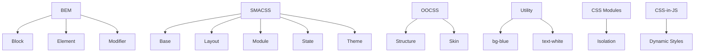

## 2.7. CSS Architecture

### BEM Methodology

BEM (Block, Element, Modifier) — методологія для організації CSS-коду, що підвищує масштабованість і зрозумілість.

```html
<div class="menu menu--active">
  <div class="menu__item menu__item--selected">Home</div>
  <div class="menu__item">About</div>
</div>
```
- Block: `menu`
- Element: `menu__item`
- Modifier: `menu--active`, `menu__item--selected`
- Переваги: уникає конфліктів, легко підтримувати.

---

### SMACSS

SMACSS (Scalable and Modular Architecture for CSS) — підхід для розділення стилів на категорії:
- Base (базові стилі)
- Layout (макет)
- Module (модулі)
- State (стани)
- Theme (теми)

```css
/* Module */
.button { ... }
/* State */
.button.is-active { ... }
```
- Гнучка структура для великих проектів.

---

### OOCSS

OOCSS (Object-Oriented CSS) — підхід, що розділяє структуру і вигляд.

```css
/* Structure */
.media { display: flex; }
/* Skin */
.media--highlight { background: #ff0; }
```
- Використовуйте повторно "об'єкти" для різних елементів.

---

### Utility-First Approach

Utility-first — підхід, де стилі описуються через маленькі утилітарні класи.

```html
<button class="bg-blue text-white p-2 m-1">Click</button>
```
- Кожен клас — одна властивість.
- Популярний у Tailwind CSS.

---

### CSS Modules

CSS Modules — ізольовані стилі для компонентів (переважно у React, Vue).

```css
/* button.module.css */
.button { color: red; }
```
```js
import styles from './button.module.css';
<button className={styles.button}>Click</button>
```
- Уникає глобальних конфліктів.
- Стилі застосовуються лише до компонента.

---

### CSS-in-JS Overview

CSS-in-JS — підхід, коли стилі пишуться у JS-файлах (наприклад, styled-components, Emotion).

```js
import styled from 'styled-components';
const Button = styled.button`
  color: white;
  background: #0099ff;
`;
```
- Динамічні стилі, ізоляція, інтеграція з логікою компонента.

---

### Mermaid Diagram: CSS Architecture


_Архітектурні підходи до CSS_

---

#### Navigation

- [Попередня тема: SCSS Features](2.6-scss-features.md)
- [Наступна тема: Advanced CSS](2.8-advanced-css.md)
