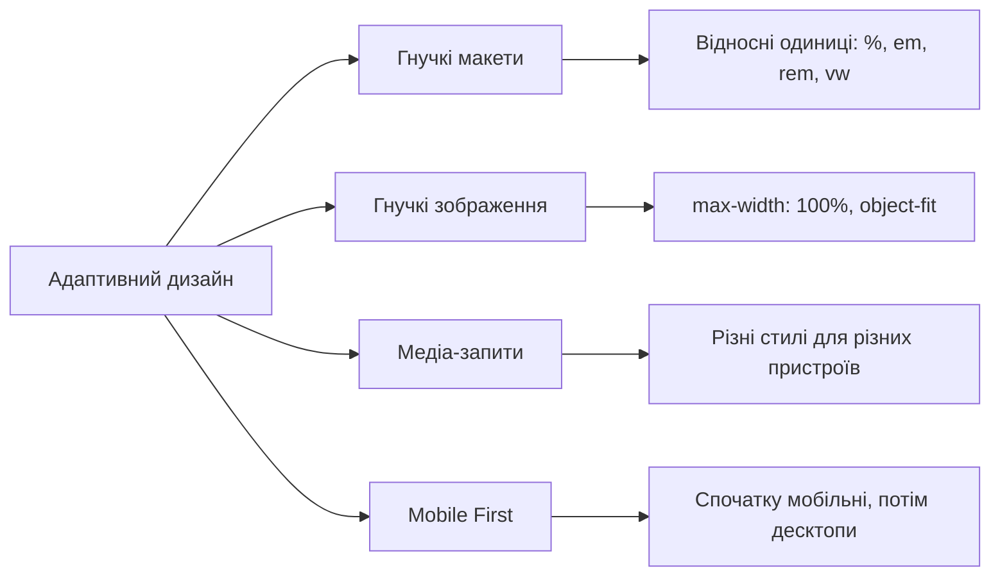
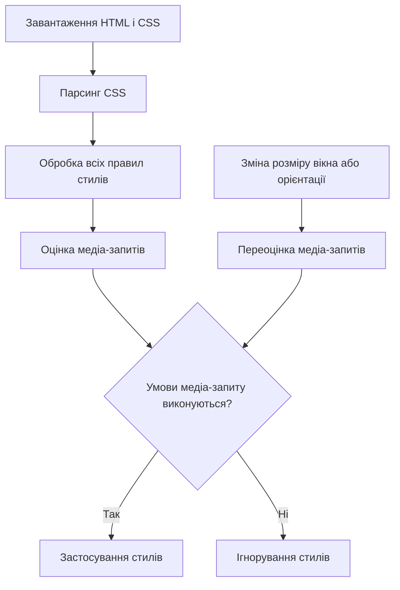

# CSS Медіа-запити

## Що таке медіа-запити?

Медіа-запити (Media Queries) — це потужна функція CSS, яка дозволяє застосовувати різні стилі залежно від характеристик пристрою: розміру екрана, орієнтації, роздільної здатності та інших параметрів. Це основний інструмент для створення адаптивних (responsive) веб-сайтів, які оптимально відображаються на різних пристроях: від мобільних телефонів до великих настільних моніторів.

Медіа-запити дозволяють розробникам:

-   Створювати різні макети для різних пристроїв
-   Адаптувати розмір та розташування елементів
-   Приховувати або показувати контент залежно від контексту
-   Оптимізувати інтерфейс для різних методів введення (миша, сенсорний екран)

## Синтаксис медіа-запитів

### Базовий синтаксис

```css
@media медіа-тип and (умова) {
    /* CSS правила, що застосовуються при виконанні умови */
}
```

### Типи медіа (media types)

| Тип              | Опис                                                             |
| ---------------- | ---------------------------------------------------------------- |
| `all`            | Всі типи пристроїв (значення за замовчуванням)                   |
| `screen`         | Екрани комп'ютерів, планшетів, телефонів                         |
| `print`          | Для друкованих матеріалів та перегляду документів у режимі друку |
| `speech`         | Для синтезаторів мовлення                                        |
| ~~`tv`~~         | Застарілий                                                       |
| ~~`handheld`~~   | Застарілий                                                       |
| ~~`projection`~~ | Застарілий                                                       |

> **Примітка:** Типи `tv`, `handheld`, `projection` та інші застаріли і більше не рекомендуються.

### Функції медіа-запитів (media features)

#### Розміри області перегляду (viewport)

| Функція      | Опис                        | Приклад                      |
| ------------ | --------------------------- | ---------------------------- |
| `width`      | Точна ширина вікна браузера | `@media (width: 768px)`      |
| `min-width`  | Мінімальна ширина вікна     | `@media (min-width: 768px)`  |
| `max-width`  | Максимальна ширина вікна    | `@media (max-width: 767px)`  |
| `height`     | Точна висота вікна браузера | `@media (height: 500px)`     |
| `min-height` | Мінімальна висота вікна     | `@media (min-height: 500px)` |
| `max-height` | Максимальна висота вікна    | `@media (max-height: 499px)` |

#### Розміри пристрою

| Функція             | Опис                        | Приклад                              |
| ------------------- | --------------------------- | ------------------------------------ |
| `device-width`      | Ширина екрану пристрою      | `@media (device-width: 1920px)`      |
| `min-device-width`  | Мінімальна ширина пристрою  | `@media (min-device-width: 1200px)`  |
| `max-device-width`  | Максимальна ширина пристрою | `@media (max-device-width: 767px)`   |
| `device-height`     | Висота екрану пристрою      | `@media (device-height: 1080px)`     |
| `min-device-height` | Мінімальна висота пристрою  | `@media (min-device-height: 800px)`  |
| `max-device-height` | Максимальна висота пристрою | `@media (max-device-height: 1079px)` |

> **Примітка:** Функції `device-width` та `device-height` вважаються застарілими. Рекомендується використовувати `width`, `height`.

#### Орієнтація та співвідношення сторін

| Функція               | Опис                                     | Приклад                                                                |
| --------------------- | ---------------------------------------- | ---------------------------------------------------------------------- |
| `orientation`         | Орієнтація пристрою                      | `@media (orientation: portrait)` або `@media (orientation: landscape)` |
| `aspect-ratio`        | Співвідношення ширини до висоти вікна    | `@media (aspect-ratio: 16/9)`                                          |
| `min-aspect-ratio`    | Мінімальне співвідношення                | `@media (min-aspect-ratio: 1/1)`                                       |
| `max-aspect-ratio`    | Максимальне співвідношення               | `@media (max-aspect-ratio: 2/1)`                                       |
| `device-aspect-ratio` | Співвідношення ширини до висоти пристрою | `@media (device-aspect-ratio: 16/9)`                                   |

#### Щільність пікселів та роздільна здатність

| Функція          | Опис                  | Приклад                                                        |
| ---------------- | --------------------- | -------------------------------------------------------------- |
| `resolution`     | Щільність пікселів    | `@media (resolution: 192dpi)` або `@media (resolution: 2dppx)` |
| `min-resolution` | Мінімальна щільність  | `@media (min-resolution: 2dppx)`                               |
| `max-resolution` | Максимальна щільність | `@media (max-resolution: 1dppx)`                               |

#### Інші функції

| Функція                  | Опис                                                    | Приклад                                                                              |
| ------------------------ | ------------------------------------------------------- | ------------------------------------------------------------------------------------ |
| `color`                  | Кількість біт на колірний компонент                     | `@media (color: 8)`                                                                  |
| `color-index`            | Кількість кольорів у палітрі пристрою                   | `@media (color-index: 256)`                                                          |
| `monochrome`             | Біти на піксель у монохромних пристроях                 | `@media (monochrome: 2)`                                                             |
| `grid`                   | Чи є пристрій сітковим (наприклад, телетайп)            | `@media (grid: 1)`                                                                   |
| `scan`                   | Процес сканування вихідного пристрою                    | `@media (scan: progressive)` або `@media (scan: interlace)`                          |
| `hover`                  | Чи може користувач навести курсор                       | `@media (hover: hover)` або `@media (hover: none)`                                   |
| `pointer`                | Наявність та точність пристрою введення                 | `@media (pointer: coarse)` або `@media (pointer: fine)` або `@media (pointer: none)` |
| `prefers-reduced-motion` | Чи користувач віддає перевагу меншій кількості анімацій | `@media (prefers-reduced-motion: reduce)`                                            |
| `prefers-color-scheme`   | Переваги користувача щодо світлої чи темної теми        | `@media (prefers-color-scheme: dark)` або `@media (prefers-color-scheme: light)`     |

### Логічні оператори

| Оператор     | Опис                                                            | Приклад                                                                            |
| ------------ | --------------------------------------------------------------- | ---------------------------------------------------------------------------------- |
| `and`        | Обидві умови мають бути виконані                                | `@media screen and (min-width: 768px)`                                             |
| `not`        | Заперечує умову (повинен бути першим у запиті)                  | `@media not screen and (color)`                                                    |
| `,` або `or` | Одна з умов має бути виконана                                   | `@media screen, print` або `@media (min-width: 768px) or (orientation: landscape)` |
| `only`       | Використовується для уникнення інтерпретації в старих браузерах | `@media only screen and (min-width: 768px)`                                        |

### Приклади комбінування умов

```css
/* Застосовується тільки для екранів з шириною від 768px до 1023px */
@media screen and (min-width: 768px) and (max-width: 1023px) {
    body {
        font-size: 16px;
    }
}

/* Застосовується для екранів з шириною від 1024px АБО в альбомній орієнтації */
@media screen and (min-width: 1024px), screen and (orientation: landscape) {
    body {
        font-size: 18px;
    }
}

/* Застосовується до всіх пристроїв, КРІМ екранів */
@media not screen {
    body {
        font-size: 12pt;
    }
}
```

### Вкладені медіа-запити

В CSS можна вкладати медіа-запити один в одного (підтримка в сучасних браузерах):

```css
@media screen {
    /* Стилі для всіх екранів */
    body {
        color: #333;
    }

    @media (min-width: 768px) {
        /* Стилі для екранів шириною від 768px */
        body {
            font-size: 16px;
        }
    }
}
```

### Медіа-запити в HTML

Медіа-запити можна використовувати не тільки в CSS, але й у тегу `link` для завантаження різних таблиць стилів:

```html
<!-- Базові стилі для всіх пристроїв -->
<link rel="stylesheet" href="base.css" />
<!-- Стилі тільки для мобільних пристроїв -->
<link
    rel="stylesheet"
    href="mobile.css"
    media="screen and (max-width: 767px)"
/>
<!-- Стилі тільки для планшетів -->
<link
    rel="stylesheet"
    href="tablet.css"
    media="screen and (min-width: 768px) and (max-width: 1023px)"
/>
<!-- Стилі тільки для десктопів -->
<link
    rel="stylesheet"
    href="desktop.css"
    media="screen and (min-width: 1024px)"
/>
<!-- Стилі для друку -->
<link rel="stylesheet" href="print.css" media="print" />
```

### Медіа-запити в JavaScript

Медіа-запити можна використовувати також у JavaScript через `window.matchMedia()`:

```javascript
// Перевірка, чи ширина екрану менше 768px
const isMobile = window.matchMedia("(max-width: 767px)");

// Функція, яка виконується при зміні стану
function handleMobileChange(e) {
    if (e.matches) {
        console.log("Зараз мобільний режим");
        // Виконання коду для мобільних пристроїв
    } else {
        console.log("Зараз НЕ мобільний режим");
        // Виконання коду для більших екранів
    }
}

// Додавання слухача подій
isMobile.addEventListener("change", handleMobileChange);

// Виклик функції одразу для поточного стану
handleMobileChange(isMobile);
```

## Responsive Web Design (адаптивний дизайн)

Адаптивний веб-дизайн — це підхід до створення веб-сайтів, який забезпечує оптимальний перегляд і взаємодію з сайтом на різних пристроях. Медіа-запити є одним із ключових інструментів для реалізації адаптивного дизайну.

### Основні концепції адаптивного дизайну

1. **Fluid Layouts (Гнучкі макети)**

    - Використання відносних одиниць (%, em, rem, vw, vh) замість фіксованих (px)
    - Дозволяє елементам адаптуватися до розміру контейнера

2. **Flexible Images (Гнучкі зображення)**

    - Зображення, які масштабуються разом з контейнером
    - Запобігання переповненню контенту

3. **Media Queries (Медіа-запити)**

    - Застосування різних стилів залежно від характеристик пристрою
    - Зміна макету, розміру шрифту, відступів тощо

4. **Mobile First (Спочатку мобільні)**
    - Розробка спочатку для мобільних пристроїв, потім розширення для більших екранів
    - Фокусування на основному контенті та функціональності



### Viewport мета-тег

Критично важливою частиною адаптивного дизайну є правильне налаштування viewport:

```html
<meta name="viewport" content="width=device-width, initial-scale=1.0" />
```

Цей тег говорить браузеру:

-   `width=device-width`: встановити ширину вікна перегляду рівною ширині пристрою
-   `initial-scale=1.0`: встановити початковий масштаб на 100%

Додаткові параметри:

-   `minimum-scale`: мінімальне значення масштабу
-   `maximum-scale`: максимальне значення масштабу
-   `user-scalable`: чи може користувач змінювати масштаб (yes/no)

### Breakpoints (контрольні точки)

Breakpoints — це порогові значення ширини екрану, при яких макет сайту змінюється. Вибір правильних контрольних точок є важливим аспектом адаптивного дизайну.

#### Загальноприйняті контрольні точки

```css
/* Мобільні пристрої (до 767px) */
@media (max-width: 767px) {
    ...;
}

/* Планшети (768px - 1023px) */
@media (min-width: 768px) and (max-width: 1023px) {
    ...;
}

/* Десктопи (від 1024px) */
@media (min-width: 1024px) {
    ...;
}

/* Великі десктопи (від 1200px) */
@media (min-width: 1200px) {
    ...;
}
```

#### Контрольні точки, орієнтовані на контент

Замість фіксації на стандартних розмірах пристроїв, кращою практикою є визначення контрольних точок на основі вашого контенту:

1. Розробіть базовий дизайн
2. Поступово змінюйте розмір вікна браузера
3. Коли макет "ламається" або виглядає погано, встановіть контрольну точку

```css
/* Приклад контрольних точок, орієнтованих на контент */
@media (max-width: 600px) {
    ...;
}
@media (min-width: 601px) and (max-width: 900px) {
    ...;
}
@media (min-width: 901px) and (max-width: 1200px) {
    ...;
}
@media (min-width: 1201px) {
    ...;
}
```

### Mobile First підхід

Mobile First — це стратегія розробки, яка починається з проектування інтерфейсу для мобільних пристроїв, а потім поступово розширює його для більших екранів.

#### Порівняння підходів

**Desktop First (спочатку десктоп):**

```css
/* Стилі для всіх пристроїв (десктоп за замовчуванням) */
.element {
    width: 1200px;
    font-size: 18px;
}

/* Адаптація для планшетів */
@media (max-width: 1023px) {
    .element {
        width: 750px;
        font-size: 16px;
    }
}

/* Адаптація для мобільних */
@media (max-width: 767px) {
    .element {
        width: 100%;
        font-size: 14px;
    }
}
```

**Mobile First (спочатку мобільні):**

```css
/* Стилі для всіх пристроїв (мобільні за замовчуванням) */
.element {
    width: 100%;
    font-size: 14px;
}

/* Розширення для планшетів */
@media (min-width: 768px) {
    .element {
        width: 750px;
        font-size: 16px;
    }
}

/* Розширення для десктопів */
@media (min-width: 1024px) {
    .element {
        width: 1200px;
        font-size: 18px;
    }
}
```

#### Переваги Mobile First підходу

1. **Пріоритизація контенту**

    - Фокусування на найважливішому контенті та функціональності
    - Усунення зайвих елементів

2. **Покращена продуктивність**

    - Легші сторінки за замовчуванням
    - Менше початкового CSS для завантаження

3. **Краща підтримка старих мобільних браузерів**

    - Деякі старі мобільні браузери не підтримують медіа-запити
    - Базовий дизайн буде працювати належним чином

4. **Прогресивне покращення**
    - Починати з базової функціональності
    - Додавати розширені функції для потужніших пристроїв

## Практичні приклади використання медіа-запитів

### Адаптивна навігація

```html
<nav class="main-nav">
    <div class="logo">Лого</div>
    <button class="menu-toggle">Меню</button>
    <ul class="menu">
        <li><a href="#">Головна</a></li>
        <li><a href="#">Про нас</a></li>
        <li><a href="#">Послуги</a></li>
        <li><a href="#">Контакти</a></li>
    </ul>
</nav>
```

```css
/* Базові стилі (Mobile First) */
.main-nav {
    display: flex;
    justify-content: space-between;
    align-items: center;
    padding: 10px;
    background-color: #333;
    color: white;
}

.logo {
    font-size: 1.5rem;
}

.menu-toggle {
    display: block;
    background: none;
    border: none;
    color: white;
    font-size: 1.2rem;
    cursor: pointer;
}

.menu {
    display: none;
    position: absolute;
    top: 60px;
    left: 0;
    right: 0;
    background-color: #333;
    flex-direction: column;
    padding: 0;
    margin: 0;
    list-style: none;
}

.menu.active {
    display: flex;
}

.menu li {
    padding: 10px;
    text-align: center;
}

.menu a {
    color: white;
    text-decoration: none;
}

/* Стилі для планшетів і десктопів */
@media (min-width: 768px) {
    .menu-toggle {
        display: none;
    }

    .menu {
        display: flex;
        position: static;
        flex-direction: row;
        background: none;
    }

    .menu li {
        padding: 0 15px;
    }
}
```

```javascript
// JavaScript для перемикання меню на мобільних пристроях
document.querySelector(".menu-toggle").addEventListener("click", function () {
    document.querySelector(".menu").classList.toggle("active");
});
```

### Адаптивна сітка (Grid Layout)

```html
<div class="grid-container">
    <div class="card">Картка 1</div>
    <div class="card">Картка 2</div>
    <div class="card">Картка 3</div>
    <div class="card">Картка 4</div>
    <div class="card">Картка 5</div>
    <div class="card">Картка 6</div>
</div>
```

```css
/* Базові стилі (Mobile First) */
.grid-container {
    display: grid;
    grid-template-columns: 1fr;
    gap: 20px;
    padding: 20px;
}

.card {
    background-color: #f0f0f0;
    padding: 20px;
    border-radius: 5px;
    box-shadow: 0 2px 5px rgba(0, 0, 0, 0.1);
}

/* Стилі для планшетів */
@media (min-width: 768px) {
    .grid-container {
        grid-template-columns: repeat(2, 1fr);
    }
}

/* Стилі для десктопів */
@media (min-width: 1024px) {
    .grid-container {
        grid-template-columns: repeat(3, 1fr);
    }
}

/* Стилі для великих десктопів */
@media (min-width: 1200px) {
    .grid-container {
        grid-template-columns: repeat(4, 1fr);
        max-width: 1200px;
        margin: 0 auto;
    }
}
```

### Адаптивна типографіка

```css
/* Базові стилі (Mobile First) */
html {
    font-size: 16px; /* Базовий розмір шрифту */
}

h1 {
    font-size: 1.8rem; /* 28.8px на мобільних */
    line-height: 1.2;
}

h2 {
    font-size: 1.5rem; /* 24px на мобільних */
    line-height: 1.3;
}

p {
    font-size: 1rem; /* 16px на мобільних */
    line-height: 1.5;
}

/* Стилі для планшетів */
@media (min-width: 768px) {
    html {
        font-size: 17px; /* Збільшений базовий розмір шрифту */
    }

    h1 {
        font-size: 2rem; /* 34px на планшетах */
    }
}

/* Стилі для десктопів */
@media (min-width: 1024px) {
    html {
        font-size: 18px; /* Ще більший базовий розмір шрифту */
    }

    h1 {
        font-size: 2.5rem; /* 45px на десктопах */
    }

    h2 {
        font-size: 1.8rem; /* 32.4px на десктопах */
    }
}
```

### Приховування/показ елементів

```css
/* Елемент видимий тільки на мобільних */
.mobile-only {
    display: block;
}

/* Елемент видимий тільки на планшетах і вище */
.tablet-up {
    display: none;
}

/* Елемент видимий тільки на десктопах */
.desktop-only {
    display: none;
}

/* Стилі для планшетів */
@media (min-width: 768px) {
    .mobile-only {
        display: none;
    }

    .tablet-up {
        display: block;
    }
}

/* Стилі для десктопів */
@media (min-width: 1024px) {
    .desktop-only {
        display: block;
    }
}
```

### Адаптивні зображення

```html
<picture>
    <source srcset="image-large.jpg" media="(min-width: 1024px)" />
    <source srcset="image-medium.jpg" media="(min-width: 768px)" />
    
</picture>
```

```css
/* Базовий стиль для всіх зображень */
img {
    max-width: 100%;
    height: auto;
}

/* Фонове зображення з медіа-запитами */
.hero {
    height: 300px;
    background-image: url("hero-small.jpg");
    background-size: cover;
    background-position: center;
}

@media (min-width: 768px) {
    .hero {
        height: 400px;
        background-image: url("hero-medium.jpg");
    }
}

@media (min-width: 1024px) {
    .hero {
        height: 500px;
        background-image: url("hero-large.jpg");
    }
}
```

## Типові патерни адаптивного дизайну

### Column Drop (Скидання стовпців)

При зменшенні ширини екрана стовпці "скидаються" вниз, перетворюючись з горизонтального розташування на вертикальне.

```css
/* Базові стилі (Mobile First) */
.container {
    display: flex;
    flex-direction: column;
}

.column {
    width: 100%;
    padding: 20px;
    box-sizing: border-box;
}

/* Середні екрани: 2 колонки */
@media (min-width: 768px) {
    .container {
        flex-direction: row;
        flex-wrap: wrap;
    }

    .column {
        width: 50%;
    }
}

/* Великі екрани: 3 колонки */
@media (min-width: 1024px) {
    .column {
        width: 33.33%;
    }
}
```

### Mostly Fluid (Переважно гнучкий)

Багатоколонковий макет, який стає однією колонкою на малих екранах. На більших екранах змінюються лише відступи.

```css
/* Базові стилі (Mobile First) */
.container {
    display: grid;
    grid-template-columns: 1fr;
    gap: 20px;
    padding: 10px;
}

/* Середні екрани */
@media (min-width: 768px) {
    .container {
        grid-template-columns: repeat(2, 1fr);
        padding: 20px;
    }

    .feature {
        grid-column: span 2;
    }
}

/* Великі екрани */
@media (min-width: 1024px) {
    .container {
        grid-template-columns: repeat(4, 1fr);
        max-width: 1200px;
        margin: 0 auto;
        padding: 30px;
    }
}
```

### Layout Shifter (Перемикач макету)

Різні макети на різних розмірах екрану, з використанням порядку елементів.

```css
/* Базові стилі (Mobile First) */
.container {
    display: grid;
    grid-template-columns: 1fr;
    grid-template-areas:
        "header"
        "sidebar"
        "content"
        "footer";
    gap: 20px;
}

.header {
    grid-area: header;
}
.sidebar {
    grid-area: sidebar;
}
.content {
    grid-area: content;
}
.footer {
    grid-area: footer;
}

/* Середні екрани */
@media (min-width: 768px) {
    .container {
        grid-template-columns: 1fr 2fr;
        grid-template-areas:
            "header header"
            "sidebar content"
            "footer footer";
    }
}

/* Великі екрани */
@media (min-width: 1024px) {
    .container {
        grid-template-columns: 1fr 3fr 1fr;
        grid-template-areas:
            "header header header"
            "sidebar content aside"
            "footer footer footer";
    }
}
```

### Off Canvas (Поза полотном)

Елементи, які не є критичними, розміщуються поза екраном і показуються лише за потреби.

```css
/* Базові стилі (Mobile First) */
.container {
    position: relative;
    overflow-x: hidden;
    width: 100%;
    height: 100vh;
}

.content {
    width: 100%;
    transition: transform 0.3s ease;
}

.sidebar {
    position: absolute;
    top: 0;
    left: -250px;
    width: 250px;
    height: 100%;
    background-color: #333;
    transition: transform 0.3s ease;
}

.sidebar.active {
    transform: translateX(250px);
}

.content.active {
    transform: translateX(250px);
}

/* Середні і великі екрани */
@media (min-width: 768px) {
    .container {
        display: flex;
    }

    .sidebar {
        position: relative;
        left: 0;
        width: 250px;
    }

    .content {
        flex: 1;
        transform: none !important;
    }

    .menu-toggle {
        display: none;
    }
}
```

## Підкапотні механізми та оптимізація

### Як браузер обробляє медіа-запити



1. **Завантаження та парсинг** — Браузер завантажує та аналізує всі CSS-файли
2. **Оцінка медіа-запитів** — Браузер перевіряє всі медіа-запити відповідно до поточних характеристик пристрою
3. **Застосування стилів** — Якщо умови виконуються, стилі застосовуються
4. **Переоцінка при змінах** — При зміні розміру вікна, орієнтації або інших параметрів, медіа-запити оцінюються повторно

### Продуктивність медіа-запитів

#### Специфічність завантаження

Незважаючи на те, що певні стилі можуть не застосовуватися через медіа-запити, браузер все одно завантажує і аналізує всі CSS-файли:

```html
<!-- Цей файл все одно буде завантажений, навіть якщо пристрій не є мобільним -->
<link
    rel="stylesheet"
    href="mobile.css"
    media="screen and (max-width: 767px)"
/>
```

#### Оптимізація завантаження CSS

Для покращення продуктивності можна використовувати:

1. **CSS-in-JS** — Динамічне завантаження стилів на основі потреб
2. **Критичний CSS** — Вбудовування критичних стилів безпосередньо у HTML
3. **Умовне завантаження** — Використання JavaScript для завантаження CSS на основі умов

```javascript
// Умовне завантаження CSS
if (window.matchMedia("(min-width: 768px)").matches) {
    const link = document.createElement("link");
    link.rel = "stylesheet";
    link.href = "desktop.css";
    document.head.appendChild(link);
}
```

### Уникнення проблем з медіа-запитами

1. **Перекриття контрольних точок** — Уникайте перекриття в діапазонах:

    ```css
    /* Погано - перекриття при 768px */
    @media (max-width: 768px) {
        ...;
    }
    @media (min-width: 768px) {
        ...;
    }

    /* Добре - чіткі межі */
    @media (max-width: 767px) {
        ...;
    }
    @media (min-width: 768px) {
        ...;
    }
    ```

2. **Занадто багато контрольних точок** — Використовуйте лише необхідні контрольні точки

3. **Повторюваний код** — Уникайте дублювання CSS-правил у різних медіа-запитах

4. **Важкі селектори** — Не використовуйте занадто складні селектори, які можуть сповільнити рендеринг

## Підтримка браузерами та майбутнє медіа-запитів

### Сучасна підтримка

Медіа-запити добре підтримуються у всіх сучасних браузерах:

-   Chrome 21+
-   Firefox 3.5+
-   Safari 4.0+
-   Edge 12+
-   Opera 9+
-   iOS Safari 3.2+
-   Android Browser 2.1+

### Медіа-запити рівня 4 і 5

Нові можливості, які з'являються в останніх специфікаціях:

1. **Медіа-запити рівня 4**:

    - `prefers-reduced-motion` — для користувачів, які віддають перевагу меншій кількості анімацій
    - `prefers-color-scheme` — для визначення теми (світла/темна)
    - `hover` — чи доступний ефект наведення
    - `pointer` — точність пристрою введення
    - `any-hover` і `any-pointer` — для визначення можливостей будь-якого доступного пристрою введення

2. **Медіа-запити рівня 5**:
    - `prefers-contrast` — для користувачів, які потребують більшого контрасту
    - `prefers-reduced-transparency` — для користувачів, які потребують менше прозорості
    - `light-level` — для визначення рівня освітлення
    - `environment-blending` — для AR/VR досвіду
    - `inverted-colors` — для інвертованих кольорів

```css
/* Приклади нових медіа-запитів */
@media (prefers-color-scheme: dark) {
    body {
        background-color: #121212;
        color: #f0f0f0;
    }
}

@media (prefers-reduced-motion: reduce) {
    * {
        animation: none !important;
        transition: none !important;
    }
}

@media (prefers-contrast: high) {
    body {
        color: black;
        background-color: white;
    }
}
```

### Медіа-запити та Container Queries

Container Queries — це новий підхід, який дозволяє стилізувати елементи на основі розміру їх батьківського контейнера, а не вікна браузера:

```css
/* Підтримується в нових версіях браузерів */
.container {
    container-type: inline-size;
}

@container (min-width: 400px) {
    .item {
        font-size: 1.5rem;
    }
}
```

## Практичні поради та best practices

1. **Використовуйте Mobile First підхід** — Починайте з базових стилів для мобільних пристроїв

2. **Обмежте кількість контрольних точок** — Виберіть 3-4 основні контрольні точки

3. **Використовуйте EM/REM для медіа-запитів** — Це дозволяє медіа-запитам коректно працювати при зміні користувачем розміру шрифту:

    ```css
    @media (min-width: 48em) {
        /* 768px при базовому розмірі шрифту 16px */
    }
    ```

4. **Орієнтуйтеся на контент, а не на пристрої** — Встановлюйте контрольні точки там, де ваш контент цього потребує

5. **Використовуйте CSS Grid та Flexbox** — Вони спрощують створення адаптивних макетів

6. **Тестуйте на реальних пристроях** — Симулятори не завжди точно відображають реальний досвід

7. **Мінімізуйте використання `display: none`** — Елементи все одно завантажуються, навіть якщо вони приховані

8. **Оптимізуйте зображення** — Використовуйте `<picture>` або медіа-запити для забезпечення відповідних зображень

9. **Забезпечте доступність** — Переконайтеся, що ваш сайт залишається доступним на всіх розмірах екрану

10. **Враховуйте високу щільність пікселів** — Використовуйте `min-resolution` для забезпечення якісних зображень на Retina-дисплеях

## Висновок

Медіа-запити є фундаментальним інструментом для створення адаптивних веб-сайтів, які забезпечують оптимальний досвід користувачів на різних пристроях. Поєднуючи медіа-запити з гнучкими макетами та зображеннями, ви можете створювати сайти, які ефективно адаптуються до різних розмірів екрану, орієнтацій та можливостей пристроїв.

Із розвитком веб-стандартів та появою нових функцій, таких як Container Queries, можливості адаптивного дизайну продовжують розширюватися, надаючи розробникам все більше інструментів для створення високоякісних, гнучких та доступних веб-інтерфейсів.
