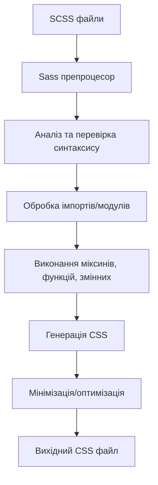

# SCSS (Sass)

## Що таке SCSS?

SCSS (Sassy CSS) — це препроцесор CSS, який розширює стандартний CSS додатковими можливостями, такими як змінні, вкладеність, міксини, імпорти та інші функції. SCSS є частиною Sass (Syntactically Awesome Style Sheets), але використовує синтаксис, ближчий до звичайного CSS (з фігурними дужками та крапками з комою).

Основні переваги SCSS:

-   Підвищення читабельності та організації коду
-   Зменшення повторень за допомогою змінних та міксинів
-   Спрощення підтримки завдяки модульній структурі
-   Додаткові функції, які полегшують створення складних стилів

## Різниця між Sass і SCSS

Sass має два синтаксиси:

1. **Sass** (оригінальний синтаксис) — використовує відступи замість фігурних дужок і нові рядки замість крапок з комою:

    ```sass
    nav
      ul
        margin: 0
        padding: 0
        list-style: none
    ```

2. **SCSS** (новіший синтаксис) — використовує синтаксис, схожий на CSS:
    ```scss
    nav {
        ul {
            margin: 0;
            padding: 0;
            list-style: none;
        }
    }
    ```

SCSS став популярнішим, оскільки його синтаксис ближчий до стандартного CSS, що полегшує перехід від CSS до препроцесора.

## Змінні в SCSS

Змінні дозволяють зберігати та повторно використовувати значення в усьому таблиці стилів.

### Синтаксис змінних

```scss
$variable-name: value;
```

### Приклади використання змінних

```scss
// Оголошення змінних
$primary-color: #3498db;
$secondary-color: #2ecc71;
$base-font-size: 16px;
$base-padding: 15px;
$font-stack: "Helvetica", Arial, sans-serif;

// Використання змінних
body {
    font-family: $font-stack;
    font-size: $base-font-size;
    color: $primary-color;
    padding: $base-padding;
}

.button {
    background-color: $secondary-color;
    padding: $base-padding;
    border: 1px solid darken($secondary-color, 10%);
}
```

### Область видимості змінних

Змінні в SCSS мають область видимості, що визначається блоком, в якому вони оголошені:

```scss
$global-color: #333; // Глобальна змінна

.container {
    $local-padding: 20px; // Локальна змінна
    padding: $local-padding;
    color: $global-color;
}

.other-container {
    // $local-padding тут недоступна
    color: $global-color; // Але глобальна змінна доступна
}
```

### Глобальні змінні та !global

Щоб локальну змінну зробити глобальною, використовуйте флаг `!global`:

```scss
.container {
    $local-var: 10px !global; // Тепер це глобальна змінна
    padding: $local-var;
}

.other-container {
    margin: $local-var; // Тепер доступна тут
}
```

### Значення за замовчуванням з !default

Флаг `!default` дозволяє встановити значення змінної, тільки якщо вона ще не визначена або має значення `null`:

```scss
$primary-color: #3498db !default;

// Якщо $primary-color вже визначена раніше, цей рядок не змінить її значення
// Якщо ні, то буде використано значення #3498db
```

Це корисно для створення бібліотек та тем, де користувач може перевизначити змінні.

## Вкладеність (Nesting)

Вкладеність дозволяє створювати ієрархічну структуру CSS, яка відображає структуру HTML.

### Базова вкладеність селекторів

```scss
nav {
    background-color: #333;

    ul {
        margin: 0;
        padding: 0;
        list-style: none;

        li {
            display: inline-block;

            a {
                color: white;
                text-decoration: none;
                padding: 10px 15px;

                &:hover {
                    background-color: #555;
                }
            }
        }
    }
}
```

Компілюється в CSS:

```css
nav {
    background-color: #333;
}
nav ul {
    margin: 0;
    padding: 0;
    list-style: none;
}
nav ul li {
    display: inline-block;
}
nav ul li a {
    color: white;
    text-decoration: none;
    padding: 10px 15px;
}
nav ul li a:hover {
    background-color: #555;
}
```

### Оператор & (амперсанд)

Оператор `&` посилається на батьківський селектор і дозволяє створювати складніші селектори:

```scss
.button {
    padding: 10px 15px;
    background-color: #3498db;

    &:hover {
        background-color: darken(#3498db, 10%);
    }

    &.primary {
        background-color: #2ecc71;
    }

    &-small {
        padding: 5px 10px;
        font-size: 12px;
    }
}
```

Компілюється в CSS:

```css
.button {
    padding: 10px 15px;
    background-color: #3498db;
}
.button:hover {
    background-color: #217dbb;
}
.button.primary {
    background-color: #2ecc71;
}
.button-small {
    padding: 5px 10px;
    font-size: 12px;
}
```

### Вкладеність властивостей

SCSS дозволяє вкладати властивості з однаковим префіксом:

```scss
.element {
    font: {
        family: "Helvetica", sans-serif;
        size: 16px;
        weight: bold;
    }
    margin: {
        top: 10px;
        bottom: 15px;
        left: 5px;
        right: 5px;
    }
    border: 1px solid black {
        radius: 5px;
    }
}
```

Компілюється в CSS:

```css
.element {
    font-family: "Helvetica", sans-serif;
    font-size: 16px;
    font-weight: bold;
    margin-top: 10px;
    margin-bottom: 15px;
    margin-left: 5px;
    margin-right: 5px;
    border: 1px solid black;
    border-radius: 5px;
}
```

### Правило @at-root

Правило `@at-root` дозволяє виходити з вкладеності і розміщувати селектор в корені документа:

```scss
.parent {
    font-size: 16px;

    .child {
        font-size: 14px;
    }

    @at-root .sibling {
        font-size: 12px;
    }
}
```

Компілюється в CSS:

```css
.parent {
    font-size: 16px;
}
.parent .child {
    font-size: 14px;
}
.sibling {
    font-size: 12px;
}
```

## Міксини (Mixins)

Міксини дозволяють групувати CSS декларації, які потрібно повторно використовувати в різних місцях.

### Оголошення та використання міксинів

```scss
// Оголошення міксину
@mixin border-radius($radius) {
    -webkit-border-radius: $radius;
    -moz-border-radius: $radius;
    border-radius: $radius;
}

// Використання міксину
.box {
    @include border-radius(5px);
    background-color: #f5f5f5;
}

.button {
    @include border-radius(3px);
    background-color: #3498db;
}
```

### Міксини з декількома параметрами

```scss
@mixin box-shadow($x, $y, $blur, $color) {
    -webkit-box-shadow: $x $y $blur $color;
    -moz-box-shadow: $x $y $blur $color;
    box-shadow: $x $y $blur $color;
}

.card {
    @include box-shadow(0, 2px, 5px, rgba(0, 0, 0, 0.1));
}
```

### Параметри за замовчуванням

```scss
@mixin button-style(
    $bg-color: #3498db,
    $text-color: white,
    $padding: 10px 15px
) {
    background-color: $bg-color;
    color: $text-color;
    padding: $padding;
    border: none;
    cursor: pointer;

    &:hover {
        background-color: darken($bg-color, 10%);
    }
}

.primary-button {
    @include button-style;
}

.secondary-button {
    @include button-style(#2ecc71);
}

.danger-button {
    @include button-style(#e74c3c, white, 8px 12px);
}
```

### Іменовані параметри

```scss
@mixin position(
    $position,
    $top: null,
    $right: null,
    $bottom: null,
    $left: null
) {
    position: $position;
    top: $top;
    right: $right;
    bottom: $bottom;
    left: $left;
}

.element {
    @include position(absolute, $top: 10px, $left: 20px);
}
```

### Передача довільної кількості аргументів

```scss
@mixin box-shadow($shadows...) {
    -webkit-box-shadow: $shadows;
    -moz-box-shadow: $shadows;
    box-shadow: $shadows;
}

.complex-shadow {
    @include box-shadow(
        0 2px 5px rgba(0, 0, 0, 0.1),
        0 0 10px rgba(0, 0, 255, 0.2)
    );
}
```

### Вміст у міксинах (@content)

Директива `@content` дозволяє передавати блок стилів у міксин:

```scss
@mixin media-query($breakpoint) {
    @if $breakpoint == small {
        @media (max-width: 767px) {
            @content;
        }
    } @else if $breakpoint == medium {
        @media (min-width: 768px) and (max-width: 1023px) {
            @content;
        }
    } @else if $breakpoint == large {
        @media (min-width: 1024px) {
            @content;
        }
    }
}

.responsive-element {
    font-size: 16px;

    @include media-query(small) {
        font-size: 14px;
        padding: 5px;
    }

    @include media-query(large) {
        font-size: 18px;
        padding: 15px;
    }
}
```

## Імпорти та Модулі

SCSS дозволяє розділяти стилі на окремі файли та імпортувати їх, що сприяє кращій організації коду.

### Базовий імпорт

```scss
// _variables.scss
$primary-color: #3498db;
$secondary-color: #2ecc71;

// _mixins.scss
@mixin border-radius($radius) {
    border-radius: $radius;
}

// main.scss
@import "variables";
@import "mixins";

.button {
    background-color: $primary-color;
    @include border-radius(3px);
}
```

> **Примітка**: Файли, які імпортуються, зазвичай починаються з підкреслення (наприклад, `_variables.scss`). Це вказує, що ці файли є частковими і не повинні компілюватися в окремі CSS-файли.

### Модулі (@use та @forward)

У новіших версіях Sass (від 3.6.0) рекомендується використовувати `@use` замість `@import` для кращої модульності:

```scss
// _variables.scss
$primary-color: #3498db;
$secondary-color: #2ecc71;

// _mixins.scss
@mixin border-radius($radius) {
    border-radius: $radius;
}

// main.scss
@use "variables";
@use "mixins";

.button {
    background-color: variables.$primary-color;
    @include mixins.border-radius(3px);
}
```

Також можна задавати простір імен:

```scss
@use "variables" as v;
@use "mixins" as m;

.button {
    background-color: v.$primary-color;
    @include m.border-radius(3px);
}
```

Або використовувати без простору імен:

```scss
@use "variables" as *;
@use "mixins" as *;

.button {
    background-color: $primary-color;
    @include border-radius(3px);
}
```

### Передача даних між модулями з @forward

Директива `@forward` дозволяє перенаправляти змінні та міксини з одного модуля в інший:

```scss
// _colors.scss
$primary-color: #3498db;
$secondary-color: #2ecc71;

// _typography.scss
$base-font-size: 16px;
$heading-font-family: "Arial", sans-serif;

// _variables.scss
@forward "colors";
@forward "typography";

// main.scss
@use "variables";

body {
    font-size: variables.$base-font-size;
    color: variables.$primary-color;
}
```

### Налаштування значень модуля при імпорті

```scss
// _theme.scss
$color: #3498db !default;
$padding: 10px !default;

// main.scss
@use "theme" with (
    $color: #e74c3c,
    $padding: 15px
);

.button {
    background-color: theme.$color;
    padding: theme.$padding;
}
```

## Розширення (Extend)

Розширення дозволяє одному селектору успадковувати стилі іншого, що зменшує дублювання коду.

### Базове використання @extend

```scss
.message {
    border: 1px solid #ccc;
    padding: 10px;
    color: #333;
}

.success {
    @extend .message;
    border-color: #2ecc71;
    color: #2ecc71;
}

.error {
    @extend .message;
    border-color: #e74c3c;
    color: #e74c3c;
}
```

Компілюється в CSS:

```css
.message,
.success,
.error {
    border: 1px solid #ccc;
    padding: 10px;
    color: #333;
}

.success {
    border-color: #2ecc71;
    color: #2ecc71;
}

.error {
    border-color: #e74c3c;
    color: #e74c3c;
}
```

### Селектори-заповнювачі (placeholder selectors)

Селектори-заповнювачі (`%`) існують тільки для розширення і не компілюються в CSS, якщо не використовуються:

```scss
%message-shared {
    border: 1px solid #ccc;
    padding: 10px;
    color: #333;
}

.success {
    @extend %message-shared;
    border-color: #2ecc71;
}

.error {
    @extend %message-shared;
    border-color: #e74c3c;
}

// %message-shared не з'явиться у вихідному CSS
```

### Розширення в різних контекстах

```scss
%button-base {
    display: inline-block;
    padding: 10px 15px;
    cursor: pointer;
}

.primary-button {
    @extend %button-base;
    background-color: #3498db;
}

.sidebar {
    .button {
        @extend %button-base;
        background-color: #2ecc71;
    }
}
```

### Обмеження @extend

Розширення не працює між різними директивами медіа-запитів:

```scss
// Це НЕ спрацює
@media (min-width: 768px) {
    .desktop-class {
        color: red;
    }
}

@media (max-width: 767px) {
    .mobile-class {
        @extend .desktop-class; // Помилка!
    }
}
```

## Оператори та вирази

SCSS підтримує різні типи операторів, які дозволяють виконувати обчислення та маніпуляції зі значеннями.

### Математичні оператори

```scss
.container {
    width: 100% - 20px;
    height: 100px * 2;
    margin: 10px / 2;
    padding: 10px + 5px;
}

// З різними одиницями виміру
.element {
    font-size: 16px + 4px; // 20px
    margin: 5px * 2; // 10px
    padding: (20px / 2); // 10px
    width: 100% - 20px; // 80%
}
```

### Порівняння та логічні оператори

```scss
$breakpoint: 768px;

@mixin responsive($width) {
    @if $width <= $breakpoint {
        // Стилі для малих екранів
    } @else {
        // Стилі для великих екранів
    }
}

$theme: "dark";

.element {
    @if $theme == "dark" {
        background-color: #333;
        color: white;
    } @else if $theme == "light" {
        background-color: white;
        color: #333;
    } @else {
        background-color: #f5f5f5;
        color: #333;
    }
}
```

### Оператори з кольорами

```scss
$base-color: #3498db;

.element {
    // Світліші та темніші відтінки
    background-color: lighten($base-color, 10%); // світліше на 10%
    border-color: darken($base-color, 10%); // темніше на 10%

    // Зміна насиченості
    color: saturate($base-color, 20%); // збільшення насиченості
    border-bottom-color: desaturate($base-color, 20%); // зменшення насиченості

    // Зміна прозорості
    box-shadow: 0 0 10px rgba($base-color, 0.5); // 50% прозорості
}
```

### Оператор інтерполяції #{}

Інтерполяція дозволяє вставляти значення змінних в рядки:

```scss
$property: "color";
$value: "center";

.element {
    #{$property}: blue; // компілюється в color: blue;
    text-align: #{$value}; // компілюється в text-align: center;
}

// Створення динамічних селекторів
@for $i from 1 through 3 {
    .col-#{$i} {
        width: 100% / $i;
    }
}
```

### Функції для роботи з рядками

```scss
$name: "Hello";
$font: "Arial, sans-serif";

.element {
    content: to-upper-case($name); // 'HELLO'
    font-family: quote($font); // 'Arial, sans-serif'
    data-attr: unquote($font); // Arial, sans-serif

    $length: str-length($name); // 5
    $first-letter: str-slice($name, 1, 1); // 'H'
}
```

### Функції для роботи зі списками

```scss
$list: 10px 20px 30px;
$colors: red, green, blue;

.element {
    margin: nth($list, 2); // 20px (другий елемент)
    color: nth($colors, 1); // red (перший елемент)

    $length: length($list); // 3
    $joined: join($list, $colors); // 10px 20px 30px red green blue

    padding: append($list, 40px); // 10px 20px 30px 40px
}
```

### Функції для роботи з мапами (словниками)

```scss
$theme-colors: (
    "primary": #3498db,
    "secondary": #2ecc71,
    "danger": #e74c3c,
);

.primary-button {
    background-color: map-get($theme-colors, "primary");
}

.secondary-button {
    background-color: map-get($theme-colors, "secondary");
}

// Перевірка наявності ключа
@if map-has-key($theme-colors, "danger") {
    .danger-button {
        background-color: map-get($theme-colors, "danger");
    }
}

// Отримання всіх ключів та значень
$keys: map-keys($theme-colors); // 'primary', 'secondary', 'danger'
$values: map-values($theme-colors); // #3498db, #2ecc71, #e74c3c

// Об'єднання мап
$additional-colors: (
    "warning": #f39c12,
    "info": #3498db,
);

$all-colors: map-merge($theme-colors, $additional-colors);
```

## Потоки управління

SCSS надає директиви для контролю виконання коду, такі як `@if`, `@for`, `@each` та `@while`.

### Умовні оператори @if/@else

```scss
$theme: "dark";

body {
    @if $theme == "dark" {
        background-color: #333;
        color: white;
    } @else if $theme == "light" {
        background-color: white;
        color: #333;
    } @else {
        background-color: #f5f5f5;
        color: #333;
    }
}

// Використання з функціями
@mixin text-contrast($bg-color) {
    @if lightness($bg-color) > 50% {
        color: #000;
    } @else {
        color: #fff;
    }
}

.button {
    background-color: #3498db;
    @include text-contrast(#3498db);
}
```

### Цикли @for

```scss
// Від 1 до 3 (включно)
@for $i from 1 through 3 {
    .col-#{$i} {
        width: 100% / $i;
    }
}

// Від 1 до 2 (виключно 3)
@for $i from 1 to 3 {
    .margin-#{$i} {
        margin: $i * 10px;
    }
}
```

### Цикли @each

```scss
// Проста ітерація
$colors: red, green, blue;

@each $color in $colors {
    .text-#{$color} {
        color: $color;
    }
}

// Ітерація по мапі
$theme-colors: (
    "primary": #3498db,
    "secondary": #2ecc71,
    "danger": #e74c3c,
);

@each $name, $color in $theme-colors {
    .#{$name} {
        background-color: $color;
    }

    .#{$name}-text {
        color: $color;
    }
}

// Деструктуризація
$icons: (home, 20px, 18px), (user, 24px, 24px), (settings, 16px, 16px);

@each $name, $width, $height in $icons {
    .icon-#{$name} {
        width: $width;
        height: $height;
        background-image: url("icons/#{$name}.svg");
    }
}
```

### Цикли @while

```scss
$i: 1;
$max: 5;

@while $i <= $max {
    .item-#{$i} {
        width: $i * 20%;
        opacity: 1 - ($i * 0.1);
    }
    $i: $i + 1;
}
```

## Функції

SCSS дозволяє створювати користувацькі функції для багаторазового використання логіки обчислень.

### Визначення та використання функції

```scss
@function calculate-width($col-count, $total-cols: 12) {
    @return percentage($col-count / $total-cols);
}

.col-4 {
    width: calculate-width(4); // 33.33333%
}

.col-6 {
    width: calculate-width(6); // 50%
}

.col-4-of-16 {
    width: calculate-width(4, 16); // 25%
}
```

### Функції з умовами

```scss
@function contrast-color($color) {
    @if lightness($color) > 50% {
        @return #000;
    } @else {
        @return #fff;
    }
}

.button {
    background-color: #3498db;
    color: contrast-color(#3498db);
}
```

### Рекурсивні функції

```scss
@function fibonacci($n) {
    @if $n <= 1 {
        @return $n;
    } @else {
        @return fibonacci($n - 1) + fibonacci($n - 2);
    }
}

.element {
    padding: fibonacci(6) * 1px; // 8px
}
```

## Вбудовані модулі Sass

Sass надає кілька вбудованих модулів з корисними функціями:

### Модуль math

```scss
@use "sass:math";

.element {
    width: math.div(600px, 3); // 200px
    height: math.round(3.7px); // 4px
    margin: math.min(10px, 20px, 5px); // 5px
    padding: math.max(10px, 20px, 5px); // 20px
    transform: rotate(math.pi() * 1rad); // rotate(3.14159rad)
}
```

### Модуль color

```scss
@use "sass:color";

$base-color: #3498db;

.element {
    background-color: color.adjust($base-color, $red: 20, $blue: -10);
    border-color: color.scale($base-color, $lightness: -20%);
    color: color.complement($base-color); // комплементарний колір
    box-shadow: 0 0 10px color.mix($base-color, black, 80%);
}
```

### Модуль string

```scss
@use "sass:string";

.element {
    content: string.to-upper-case("hello"); // "HELLO"
    font-family: string.quote(Arial, sans-serif); // "Arial, sans-serif"

    $name: "hello world";
    $upper: string.to-upper-case($name); // "HELLO WORLD"
    $index: string.index($name, "world"); // 7
    $insert: string.insert($name, " beautiful", 6); // "hello beautiful world"
}
```

### Модуль list

```scss
@use "sass:list";

$sizes: 10px, 20px, 30px, 40px;

.element {
    padding: list.nth($sizes, 2); // 20px
    margin: list.join($sizes, 50px 60px); // 10px, 20px, 30px, 40px, 50px, 60px

    $first: list.first($sizes); // 10px
    $last: list.last($sizes); // 40px
    $separator: list.separator($sizes); // comma

    // Створення нового списку з усіх крім першого елементу
    $rest: list.slice($sizes, 2); // 20px, 30px, 40px
}
```

### Модуль map

```scss
@use "sass:map";

$theme: (
    "primary": #3498db,
    "secondary": #2ecc71,
    "danger": #e74c3c,
);

.element {
    color: map.get($theme, "primary");

    // Перевірка наявності ключа
    @if map.has-key($theme, "info") == false {
        $theme: map.merge(
            $theme,
            (
                "info": #5bc0de,
            )
        );
    }

    // Видалення ключа
    $theme-without-danger: map.remove($theme, "danger");

    // Отримання всіх ключів
    $all-keys: map.keys($theme); // "primary", "secondary", "danger"
}
```

### Модуль meta

```scss
@use "sass:meta";

@mixin apply-styles($styles...) {
    @include meta.load-css($styles...);
}

$list: 10px 20px 30px;
$is-list: meta.type-of($list); // "list"

$quoted: meta.inspect($list); // "(10px 20px 30px)"
```

## Підкапотні механізми та оптимізація

### Процес компіляції SCSS



1. **Аналіз та перевірка синтаксису**: Препроцесор перевіряє синтаксис SCSS файлів на помилки.
2. **Обробка імпортів/модулів**: Всі імпортовані файли збираються разом.
3. **Виконання міксинів, функцій, змінних**: Препроцесор обчислює всі змінні, виконує функції та міксини.
4. **Генерація CSS**: Перетворення SCSS в стандартний CSS.
5. **Мінімізація/оптимізація**: Опціональне зменшення розміру вихідного файлу.

### Організація SCSS проєкту

Структура файлів в типовому SCSS проєкті:

```
scss/
├── abstracts/
│   ├── _variables.scss   # Змінні
│   ├── _functions.scss   # Функції
│   ├── _mixins.scss      # Міксини
│   └── _placeholders.scss # Плейсхолдери
│
├── base/
│   ├── _reset.scss       # Скидання стилів
│   ├── _typography.scss  # Типографіка
│   └── _animations.scss  # Анімації
│
├── components/
│   ├── _buttons.scss     # Кнопки
│   ├── _forms.scss       # Форми
│   └── _modals.scss      # Модальні вікна
│
├── layout/
│   ├── _header.scss      # Шапка
│   ├── _footer.scss      # Підвал
│   └── _grid.scss        # Сітка
│
├── pages/
│   ├── _home.scss        # Стилі для головної сторінки
│   └── _about.scss       # Стилі для сторінки "Про нас"
│
├── themes/
│   ├── _default.scss     # Тема за замовчуванням
│   └── _dark.scss        # Темна тема
│
├── vendors/
│   └── _bootstrap.scss   # Зовнішні бібліотеки
│
└── main.scss             # Головний файл, що імпортує всі інші
```

### Оптимізація SCSS

#### 1. Уникнення глибокої вкладеності

Надмірна вкладеність може призвести до громіздкого CSS та проблем зі специфічністю.

```scss
// Погано - занадто глибока вкладеність
.container {
    .header {
        .navigation {
            ul {
                li {
                    a {
                        // стилі
                    }
                }
            }
        }
    }
}

// Краще - обмежена вкладеність
.container .header {
    // стилі
}

.navigation-list {
    // стилі
}

.navigation-item {
    // стилі
}

.navigation-link {
    // стилі
}
```

#### 2. Розумне використання міксинів

Надмірне використання міксинів може призвести до дублювання CSS.

```scss
// Погано - дублювання коду для кожного використання
@mixin large-text {
    font-size: 20px;
    font-weight: bold;
    line-height: 1.5;
    color: #333;
    text-transform: uppercase;
}

.title {
    @include large-text;
}
.subtitle {
    @include large-text;
}
.header {
    @include large-text;
}

// Краще - використання класу або placeholder
%large-text {
    font-size: 20px;
    font-weight: bold;
    line-height: 1.5;
    color: #333;
    text-transform: uppercase;
}

.title {
    @extend %large-text;
}
.subtitle {
    @extend %large-text;
}
.header {
    @extend %large-text;
}
```

#### 3. Оптимізація імпортів

```scss
// Погано - багато окремих імпортів
@import "variables";
@import "mixins";
@import "reset";
@import "typography";
@import "buttons";
// ... і т.д.

// Краще - групування в індексних файлах
// _abstracts.scss
@forward "variables";
@forward "mixins";
@forward "functions";

// main.scss
@import "abstracts";
@import "base";
@import "components";
// ... і т.д.
```

#### 4. Стиснення результату

Використовуйте компресію CSS для продакшн-версії:

```bash
sass --style compressed main.scss:main.min.css
```

### Інтеграція з іншими інструментами

#### 1. Автопрефіксер

Додає вендорні префікси до CSS властивостей:

```scss
// SCSS
.element {
    display: flex;
    transition: transform 0.3s;
}

// Скомпільований CSS з автопрефіксером
.element {
    display: -webkit-box;
    display: -ms-flexbox;
    display: flex;
    -webkit-transition: -webkit-transform 0.3s;
    transition: -webkit-transform 0.3s;
    transition: transform 0.3s;
    transition: transform 0.3s, -webkit-transform 0.3s;
}
```

#### 2. PostCSS

Використовується разом з Sass для додаткової обробки CSS:

-   Мінімізація
-   Оптимізація
-   Нормалізація
-   Автопрефіксінг

#### 3. Webpack/Gulp/Grunt

Інтеграція Sass з системами збирання:

```javascript
// Приклад з webpack
module.exports = {
    module: {
        rules: [
            {
                test: /\.scss$/,
                use: [
                    "style-loader", // Додає стилі в DOM
                    "css-loader", // Перетворює CSS в CommonJS
                    "sass-loader", // Компілює Sass в CSS
                ],
            },
        ],
    },
};
```

## Типові помилки та як їх уникати

### 1. Надмірна вкладеність

```scss
// Проблема
nav {
    ul {
        li {
            a {
                &:hover {
                    // стилі на 5 рівнів вкладеності
                }
            }
        }
    }
}

// Рішення
nav {
    // Стилі для nav
}

nav ul {
    // Стилі для ul в nav
}

nav li {
    // Стилі для li в nav
}

nav a {
    // Стилі для посилань

    &:hover {
        // Стилі для hover-ефекту
    }
}
```

### 2. Неефективне використання розширень

```scss
// Проблема - розширення всередині медіа-запиту
@media (min-width: 768px) {
    .desktop-class {
        color: red;
    }
}

.mobile-class {
    @extend .desktop-class; // Помилка!
}

// Рішення - використання міксинів
@mixin shared-styles {
    color: red;
}

@media (min-width: 768px) {
    .desktop-class {
        @include shared-styles;
    }
}

.mobile-class {
    @include shared-styles;
}
```

### 3. Зловживання змінними

```scss
// Проблема - занадто багато змінних
$small-padding: 5px;
$medium-padding: 10px;
$large-padding: 15px;
$xl-padding: 20px;
$xxl-padding: 25px;

// Рішення - використання map і функції
$paddings: (
    "small": 5px,
    "medium": 10px,
    "large": 15px,
    "xl": 20px,
    "xxl": 25px,
);

@function padding($size) {
    @return map-get($paddings, $size);
}

.element {
    padding: padding("medium");
}
```

### 4. Дублювання коду

```scss
// Проблема - повторення коду
.button-primary {
    display: inline-block;
    padding: 10px 15px;
    border-radius: 3px;
    background-color: blue;
}

.button-secondary {
    display: inline-block;
    padding: 10px 15px;
    border-radius: 3px;
    background-color: green;
}

// Рішення - використання placeholder або міксину
%button-base {
    display: inline-block;
    padding: 10px 15px;
    border-radius: 3px;
}

.button-primary {
    @extend %button-base;
    background-color: blue;
}

.button-secondary {
    @extend %button-base;
    background-color: green;
}
```

## Порівняння з іншими препроцесорами

| Особливість      | SCSS/Sass                                    | Less                      | Stylus                                                     | PostCSS                     |
| ---------------- | -------------------------------------------- | ------------------------- | ---------------------------------------------------------- | --------------------------- |
| **Синтаксис**    | Подібний до CSS (SCSS) або відступний (Sass) | Подібний до CSS           | Гнучкий, дозволяє опускати фігурні дужки та крапки з комою | Стандартний CSS з плагінами |
| **Змінні**       | `$variable: value`                           | `@variable: value`        | `variable = value`                                         | Потребує плагіна            |
| **Вкладеність**  | Підтримується                                | Підтримується             | Підтримується                                              | Потребує плагіна            |
| **Міксини**      | `@mixin`, `@include`                         | Міксини як функції        | Міксини як функції                                         | Потребує плагіна            |
| **Розширення**   | `@extend`                                    | `:extend()`               | `@extend`                                                  | Потребує плагіна            |
| **Функції**      | Вбудовані + користувацькі                    | Вбудовані + користувацькі | Вбудовані + користувацькі                                  | Через плагіни               |
| **Умови**        | `@if`, `@else`                               | Блоки захисту             | `if`, `else`                                               | Через JavaScript            |
| **Цикли**        | `@for`, `@each`, `@while`                    | Рекурсивні міксини        | `for`                                                      | Через JavaScript            |
| **Імпорти**      | `@import`, `@use`                            | `@import`                 | `@import`                                                  | Через плагіни               |
| **Популярність** | Висока                                       | Середня                   | Низька                                                     | Зростаюча                   |
| **Екосистема**   | Багата                                       | Достатня                  | Обмежена                                                   | Модульна                    |
| **Компіляція**   | Швидка                                       | Дуже швидка               | Швидка                                                     | Найшвидша                   |

## Висновок

SCSS (Sass) є потужним інструментом, який значно розширює можливості стандартного CSS, дозволяючи створювати більш структурований, підтримуваний та DRY (Don't Repeat Yourself) код. Завдяки змінним, вкладеності, міксинам, функціям та іншим особливостям, SCSS значно полегшує розробку та підтримку складних стилів.

Використання SCSS особливо корисне в великих проєктах, де організація та повторне використання коду є критичними факторами. Крім того, інтеграція з сучасними інструментами збірки робить SCSS невід'ємною частиною сучасного фронтенд-розробки.
