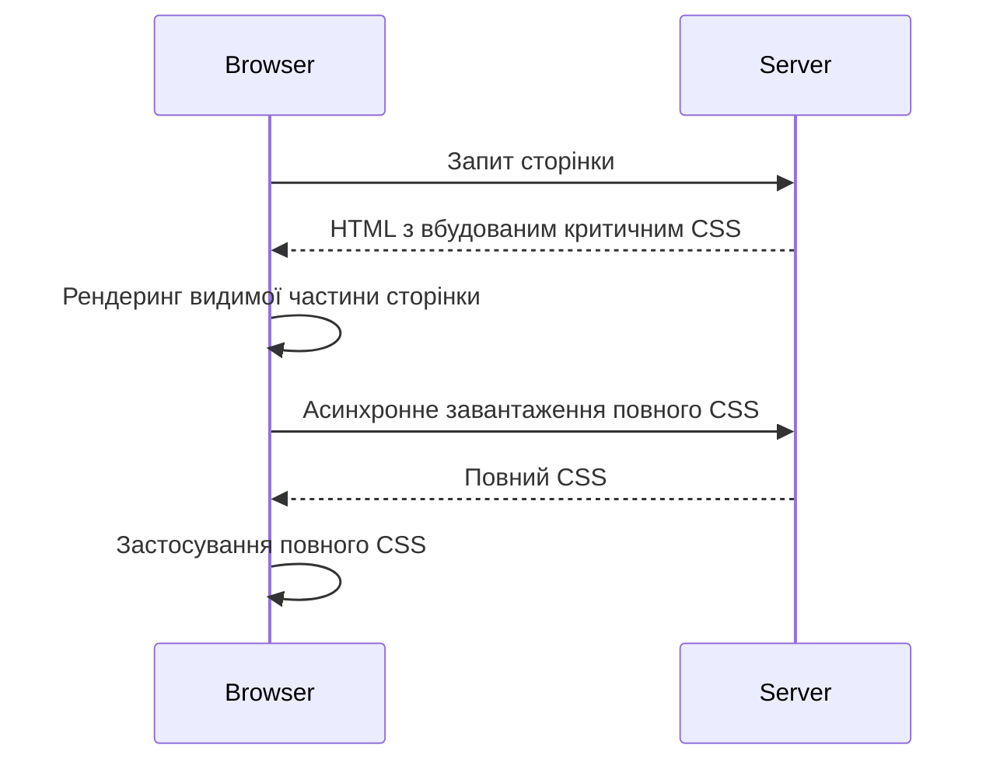
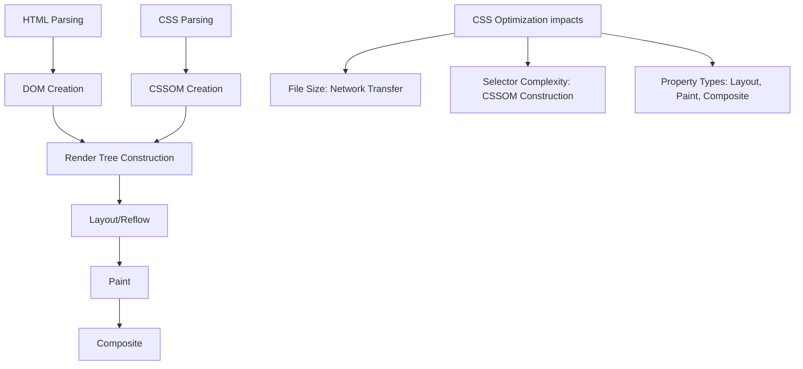

# Оптимізація CSS

## Що таке оптимізація CSS?

Оптимізація CSS — це набір технік та підходів, спрямованих на покращення продуктивності веб-сайту шляхом зменшення розміру CSS-файлів, прискорення їх завантаження та обробки браузером. Правильно оптимізований CSS покращує час завантаження сторінки, зменшує використання пам'яті та підвищує загальну ефективність сайту.

Основні напрямки оптимізації CSS:

1. **Мінімізація** — зменшення розміру CSS-файлів
2. **Критичний CSS** — пріоритизація стилів, необхідних для відображення видимої частини сторінки
3. **Lazy Loading** — відкладене завантаження несуттєвих стилів
4. **Оптимізація селекторів** — написання ефективних селекторів для зменшення часу обробки
5. **Усунення невикористаних стилів** — видалення CSS, який не застосовується на сторінці

## Мінімізація CSS

Мінімізація CSS — це процес видалення з файлів усього зайвого: пробілів, коментарів, перенесень рядків, та необов'язкових символів без зміни функціональності.

### Що видаляється при мінімізації CSS?

1. **Пробіли та перенесення рядків**:

    ```css
    /* До мінімізації */
    .container {
        width: 100%;
        max-width: 1200px;
        margin: 0 auto;
    }

    /* Після мінімізації */
    .container {
        width: 100%;
        max-width: 1200px;
        margin: 0 auto;
    }
    ```

2. **Коментарі**:

    ```css
    /* До мінімізації */
    /* Головний контейнер */
    .container {
        width: 100%; /* повна ширина */
    }

    /* Після мінімізації */
    .container {
        width: 100%;
    }
    ```

3. **Надлишкові крапки з комою** (остання в блоці):

    ```css
    /* До мінімізації */
    .example {
        color: black;
        font-size: 16px;
    }

    /* Після мінімізації */
    .example {
        color: black;
        font-size: 16px;
    }
    ```

4. **Скорочення значень**:

    ```css
    /* До мінімізації */
    .element {
        margin: 10px 20px 10px 20px;
        color: #ffffff;
        font-weight: normal;
        border: none;
    }

    /* Після мінімізації */
    .element {
        margin: 10px 20px;
        color: #fff;
        font-weight: 400;
        border: 0;
    }
    ```

### Інструменти для мінімізації CSS

#### 1. Онлайн-інструменти

-   [CSS Minifier](https://cssminifier.com/)
-   [CSS Compressor](https://csscompressor.com/)
-   [Clean CSS](https://www.cleancss.com/css-minify/)

#### 2. Інструменти командного рядка

-   **cssnano**:

    ```bash
    npm install cssnano
    npx cssnano input.css output.css
    ```

-   **clean-css-cli**:
    ```bash
    npm install clean-css-cli
    cleancss -o output.min.css input.css
    ```

#### 3. Плагіни для систем збірки

**Webpack** з `css-minimizer-webpack-plugin`:

```javascript
// webpack.config.js
const CssMinimizerPlugin = require("css-minimizer-webpack-plugin");

module.exports = {
    // ...
    optimization: {
        minimizer: [new CssMinimizerPlugin()],
    },
};
```

**Gulp** з `gulp-clean-css`:

```javascript
// gulpfile.js
const gulp = require("gulp");
const cleanCSS = require("gulp-clean-css");

gulp.task("minify-css", () => {
    return gulp
        .src("src/styles/*.css")
        .pipe(cleanCSS())
        .pipe(gulp.dest("dist/styles"));
});
```

### Додаткові техніки мінімізації

#### 1. Зменшення специфічності селекторів

```css
/* До оптимізації */
body .container .navigation ul li a {
    color: blue;
}

/* Після оптимізації */
.nav-link {
    color: blue;
}
```

#### 2. Об'єднання дублюючих селекторів

```css
/* До оптимізації */
.header {
    padding: 20px;
}
.footer {
    padding: 20px;
}

/* Після оптимізації */
.header,
.footer {
    padding: 20px;
}
```

#### 3. Використання скорочених властивостей

```css
/* До оптимізації */
.element {
    margin-top: 10px;
    margin-right: 15px;
    margin-bottom: 10px;
    margin-left: 15px;
    padding-top: 5px;
    padding-right: 10px;
    padding-bottom: 5px;
    padding-left: 10px;
}

/* Після оптимізації */
.element {
    margin: 10px 15px;
    padding: 5px 10px;
}
```

## Критичний CSS

Критичний CSS — це техніка, яка передбачає виділення та вбудовування мінімального набору CSS, необхідного для відображення верхньої видимої частини сторінки ("above the fold"). Це дозволяє браузеру відображати вміст сторінки швидше, не чекаючи завантаження повного CSS.



### Як працює критичний CSS

1. **Виділення критичних стилів** — визначення CSS, необхідного для верхньої частини сторінки
2. **Вбудовування в HTML** — додавання цих стилів безпосередньо в `<head>` документа
3. **Асинхронне завантаження повного CSS** — завантаження решти CSS після рендерингу сторінки

### Приклад реалізації критичного CSS

```html
<!DOCTYPE html>
<html>
    <head>
        <meta charset="UTF-8" />
        <title>Приклад критичного CSS</title>

        <!-- Вбудований критичний CSS -->
        <style>
            /* Тільки найнеобхідніші стилі для верхньої частини сторінки */
            body {
                margin: 0;
                font-family: sans-serif;
            }
            header {
                background: #333;
                color: white;
                padding: 1rem;
            }
            .hero {
                height: 80vh;
                background: url("hero.jpg");
            }
            .hero h1 {
                font-size: 3rem;
                color: white;
            }
        </style>

        <!-- Асинхронне завантаження повного CSS -->
        <link
            rel="preload"
            href="styles.css"
            as="style"
            onload="this.onload=null;this.rel='stylesheet'"
        />
        <noscript><link rel="stylesheet" href="styles.css" /></noscript>
    </head>
    <body>
        <header>...</header>
        <div class="hero">
            <h1>Заголовок сторінки</h1>
        </div>
        <!-- Решта контенту -->
    </body>
</html>
```

### Інструменти для генерації критичного CSS

#### 1. Critical

```bash
npm install -g critical

# Генерація критичного CSS
critical generate --base=src --src=index.html --target=dist/index-critical.html --inline
```

#### 2. CriticalCSS

```bash
npm install -g criticalcss

# Генерація критичного CSS
criticalcss --file=styles.css --url=https://example.com --output=critical.css
```

#### 3. Інтеграція з Webpack (критичний-екстракт-плагін)

```javascript
// webpack.config.js
const HtmlWebpackPlugin = require("html-webpack-plugin");
const { CriticalCssPlugin } = require("critical-css-webpack-plugin");

module.exports = {
    // ...
    plugins: [
        new HtmlWebpackPlugin(),
        new CriticalCssPlugin({
            base: "./dist/",
            src: "index.html",
            target: "index-critical.html",
            inline: true,
            extract: true,
            width: 1300,
            height: 900,
        }),
    ],
};
```

### Підводні камені критичного CSS

1. **Складність визначення "above the fold"** — ця область змінюється залежно від пристрою
2. **Необхідність оновлення** — критичний CSS потрібно оновлювати при зміні дизайну
3. **Flash of unstyled content (FOUC)** — можливе миготіння при застосуванні повного CSS
4. **Надлишкові запити** — необхідно вжити заходів, щоб уникнути дублювання запитів CSS

### Найкращі практики для критичного CSS

1. **Обмежте розмір** — критичний CSS повинен бути максимально компактним
2. **Використовуйте автоматизацію** — генеруйте критичний CSS автоматично для кожної сторінки
3. **Тестуйте на різних пристроях** — переконайтеся, що верхня частина виглядає добре на всіх екранах
4. **Оновлюйте при змінах дизайну** — підтримуйте критичний CSS в актуальному стані

## Lazy Loading CSS

Lazy Loading (відкладене завантаження) CSS — це техніка, яка передбачає завантаження CSS-файлів тільки тоді, коли вони дійсно потрібні. Це допомагає зменшити початкове навантаження сторінки та прискорити час до інтерактивності.

### Стратегії відкладеного завантаження CSS

#### 1. Умовне завантаження на основі медіа-запитів

```html
<!-- CSS для настільних комп'ютерів завантажується тільки на великих екранах -->
<link rel="stylesheet" href="desktop.css" media="(min-width: 1024px)" />

<!-- CSS для друку завантажується тільки при друку -->
<link rel="stylesheet" href="print.css" media="print" />
```

#### 2. Завантаження на основі видимості елементів (Intersection Observer)

```html
<div class="lazy-section" data-styles="carousel.css">
    <!-- Контент, що вимагає спеціальних стилів -->
</div>
```

```javascript
// Створення Intersection Observer
const observer = new IntersectionObserver((entries) => {
    entries.forEach((entry) => {
        if (entry.isIntersecting) {
            const section = entry.target;
            const stylesheetUrl = section.dataset.styles;

            // Завантаження CSS при видимості елемента
            if (
                stylesheetUrl &&
                !document.querySelector(`link[href="${stylesheetUrl}"]`)
            ) {
                const link = document.createElement("link");
                link.rel = "stylesheet";
                link.href = stylesheetUrl;
                document.head.appendChild(link);
            }

            // Припинення спостереження після завантаження
            observer.unobserve(section);
        }
    });
});

// Спостереження за всіма елементами, що потребують відкладеного CSS
document.querySelectorAll(".lazy-section").forEach((section) => {
    observer.observe(section);
});
```

#### 3. Завантаження CSS на вимогу (наприклад, при відкритті модального вікна)

```javascript
function openModal() {
    // Перевірка, чи стилі модального вікна вже завантажені
    if (!document.querySelector('link[href="modal.css"]')) {
        // Завантаження стилів перед відкриттям модального вікна
        const link = document.createElement("link");
        link.rel = "stylesheet";
        link.href = "modal.css";
        link.onload = () => {
            // Показ модального вікна після завантаження стилів
            document.getElementById("modal").classList.add("visible");
        };
        document.head.appendChild(link);
    } else {
        // Стилі вже завантажені, просто показуємо модальне вікно
        document.getElementById("modal").classList.add("visible");
    }
}
```

#### 4. Розділення CSS для різних маршрутів (для SPA)

```javascript
// Приклад для Vue Router
router.beforeEach(async (to, from, next) => {
    // Завантаження CSS для конкретного маршруту
    if (to.meta.styles && !loadedStyles.includes(to.meta.styles)) {
        try {
            await loadCSS(to.meta.styles);
            loadedStyles.push(to.meta.styles);
        } catch (error) {
            console.error("Failed to load styles:", error);
        }
    }
    next();
});

// Функція для завантаження CSS
function loadCSS(url) {
    return new Promise((resolve, reject) => {
        const link = document.createElement("link");
        link.rel = "stylesheet";
        link.href = url;
        link.onload = resolve;
        link.onerror = reject;
        document.head.appendChild(link);
    });
}
```

### Методи оптимізації завантаження CSS

#### 1. Preload і Prefetch

```html
<!-- Preload — високопріоритетний ресурс, потрібний для поточної сторінки -->
<link rel="preload" href="critical.css" as="style" />

<!-- Prefetch — низькопріоритетний ресурс, який може знадобитися пізніше -->
<link rel="prefetch" href="non-critical.css" as="style" />
```

#### 2. Resource Hints

```html
<!-- DNS-prefetch — попереднє визначення IP-адреси домену -->
<link rel="dns-prefetch" href="//fonts.googleapis.com" />

<!-- Preconnect — встановлення з'єднання з сервером заздалегідь -->
<link rel="preconnect" href="https://fonts.googleapis.com" />
```

#### 3. Асинхронне завантаження CSS

```html
<!-- Використання loadCSS -->
<link
    rel="preload"
    href="styles.css"
    as="style"
    onload="this.onload=null;this.rel='stylesheet'"
/>
<noscript><link rel="stylesheet" href="styles.css" /></noscript>
```

### Підводні камені відкладеного завантаження CSS

1. **Flash of Unstyled Content (FOUC)** — тимчасове відображення нестилізованого контенту
2. **Складність управління залежностями** — необхідно чітко визначити, які стилі коли потрібні
3. **Додаткові HTTP-запити** — може збільшити загальну кількість запитів
4. **Затримка відображення** — контент може виглядати неправильно до завантаження стилів

### Рекомендації з реалізації Lazy Loading CSS

1. **Визначте критичний шлях** — розділіть CSS на критичний та некритичний
2. **Використовуйте аналіз покриття CSS** в DevTools для виявлення невикористаних стилів
3. **Вимірюйте вплив** — перевіряйте, чи дійсно відкладене завантаження покращує продуктивність
4. **Розділіть CSS за компонентами** — особливо корисно для SPA та компонентних фреймворків

## Оптимізація селекторів

Оптимізація селекторів — важлива частина загальної оптимізації CSS, яка дозволяє зменшити час, необхідний для зіставлення селекторів з елементами DOM.

### Ефективність різних типів селекторів

```mermaid
graph LR
    A[Найшвидші] --> B[ID #id]
    B --> C[Клас .class]
    C --> D[Тег element]
    D --> E[Сусідні sibling+sibling]
    E --> F[Дочірні parent>child]
    F --> G[Потомки parent descendant]
    G --> H[Атрибути [attr=value]]
    H --> I[Псевдо-класи :pseudo-class]
    I --> J[Універсальні *]
    J --> K[Найповільніші]
```

### Неефективні селектори та як їх покращити

```css
/* Неефективно — глибоке вкладення */
body div.container ul li a {
    color: red;
}

/* Більш ефективно — прямий селектор */
.nav-link {
    color: red;
}

/* Неефективно — надто загальний */
div > * {
    margin-bottom: 10px;
}

/* Більш ефективно — конкретний селектор */
.content-item {
    margin-bottom: 10px;
}

/* Неефективно — пошук від кореневого елемента */
html body .content .sidebar .widget h3 {
    font-size: 18px;
}

/* Більш ефективно — починаємо з найконкретнішого */
.widget-title {
    font-size: 18px;
}
```

### Правила для оптимізації селекторів

1. **Уникайте універсального селектора** (`*`) в середині складних селекторів
2. **Обмежуйте глибину селекторів** до 3 рівнів
3. **Надавайте перевагу класам** перед комбінаціями селекторів
4. **Уникайте надлишкової специфічності**
5. **Не кваліфікуйте селектори ID** (`div#id` замість просто `#id`)

## Усунення невикористаних стилів

Усунення невикористаних стилів — це видалення CSS, який не застосовується до жодного елемента на сторінці, що дозволяє зменшити розмір CSS та покращити продуктивність.

### Інструменти для виявлення невикористаних стилів

#### 1. Chrome DevTools Coverage

1. Відкрийте DevTools (F12)
2. Перейдіть на вкладку "Coverage"
3. Натисніть кнопку запису та перезавантажте сторінку
4. Перегляньте звіт про невикористані стилі

#### 2. PurgeCSS

```bash
# Встановлення
npm install -g purgecss

# Використання
purgecss --css style.css --content index.html --output purged.css
```

#### 3. UnCSS

```bash
# Встановлення
npm install -g uncss

# Використання
uncss https://example.com > purified.css
```

#### 4. Webpack + PurgeCSS

```javascript
// webpack.config.js
const PurgeCSSPlugin = require("purgecss-webpack-plugin");
const glob = require("glob");
const path = require("path");

module.exports = {
    // ...
    plugins: [
        new PurgeCSSPlugin({
            paths: glob.sync(`${path.join(__dirname, "src")}/**/*`, {
                nodir: true,
            }),
            safelist: ["body", "html", "active"], // Селектори, які слід зберегти
        }),
    ],
};
```

### Обмеження інструментів очищення CSS

1. **Динамічні класи** — CSS для класів, доданих через JavaScript, може бути помилково видалений
2. **Селектори, створені за патерном** — може бути складно виявити селектори, що генеруються за шаблоном
3. **Потреба у білому списку** — необхідно вказувати селектори, які не слід видаляти

### Рекомендації з видалення невикористаних стилів

1. **Завжди тестуйте після очищення** — переконайтеся, що нічого не зламалося
2. **Створюйте білий список критичних селекторів** — збережіть ті, що використовуються в JavaScript
3. **Очищайте кожну сторінку окремо** — для сайтів з різними шаблонами сторінок
4. **Автоматизуйте процес** — інтегруйте очищення в процес збірки

## Додаткові стратегії оптимізації CSS

### CSS-in-JS для динамічного завантаження стилів

```javascript
// Приклад з styled-components
import styled from "styled-components";

const Button = styled.button`
    background-color: ${(props) => (props.primary ? "blue" : "gray")};
    color: white;
    padding: 10px 15px;
    border-radius: 4px;
`;

// Стилі завантажуються тільки коли компонент використовується
```

### HTTP/2 Server Push для CSS-файлів

```
# Налаштування для Apache (.htaccess)
<IfModule mod_headers.c>
  <FilesMatch "index.html">
    Header add Link "</css/main.css>; rel=preload; as=style"
  </FilesMatch>
</IfModule>
```

### Використання CSS-змінних для зменшення дублювання

```css
:root {
    --primary-color: #3498db;
    --secondary-color: #2ecc71;
    --base-padding: 15px;
    --border-radius: 4px;
}

.button {
    background-color: var(--primary-color);
    padding: var(--base-padding);
    border-radius: var(--border-radius);
}

.alert {
    border: 1px solid var(--primary-color);
    padding: var(--base-padding);
    border-radius: var(--border-radius);
}
```

### Інлайновий CSS для маленьких сайтів

```html
<!DOCTYPE html>
<html>
    <head>
        <style>
            /* Весь CSS прямо в HTML */
            body {
                font-family: sans-serif;
                margin: 0;
            }
            header {
                background: #333;
                color: white;
                padding: 1rem;
            }
            /* ... */
        </style>
    </head>
    <body>
        <!-- HTML контент -->
    </body>
</html>
```

### Атомарний CSS для зменшення дублювання

```html
<!-- Атомарний підхід -->
<div class="p-10 mb-15 bg-primary text-white">
    Контент з відступом 10px, нижнім відступом 15px, первинним фоном та білим
    текстом
</div>
```

```css
/* Атомарні класи */
.p-10 {
    padding: 10px;
}
.mb-15 {
    margin-bottom: 15px;
}
.bg-primary {
    background-color: #3498db;
}
.text-white {
    color: white;
}
```

## Вимірювання ефективності оптимізації CSS

### Метрики для відстеження

1. **Загальний розмір CSS** — менший розмір = швидше завантаження
2. **Час до First Paint** — коли браузер почав рендеринг
3. **Час до First Contentful Paint** — коли відображається перший контент
4. **Час до Largest Contentful Paint** — коли відображається основний контент
5. **Total Blocking Time** — час блокування основного потоку

### Інструменти для вимірювання

#### 1. Lighthouse

```bash
# Встановлення
npm install -g lighthouse

# Використання
lighthouse https://example.com --output=html --output-path=./report.html
```

#### 2. WebPageTest

Онлайн-інструмент: [WebPageTest.org](https://www.webpagetest.org/)

#### 3. PageSpeed Insights

Онлайн-інструмент: [PageSpeed Insights](https://pagespeed.web.dev/)

### A/B тестування оптимізацій

1. **Створіть дві версії** — оригінальну та оптимізовану
2. **Вимірюйте показники** для обох версій
3. **Порівняйте результати** — переконайтеся, що оптимізація дійсно покращує продуктивність
4. **Проаналізуйте компроміси** — баланс між розміром файлу та функціональністю

## Зведена таблиця методів оптимізації CSS

| Метод                              | Переваги                           | Недоліки                                   | Коли використовувати                                                     |
| ---------------------------------- | ---------------------------------- | ------------------------------------------ | ------------------------------------------------------------------------ |
| **Мінімізація**                    | Простота, зменшення розміру файлу  | Складність відлагодження, естетика коду    | Завжди для продакшн                                                      |
| **Критичний CSS**                  | Швидший рендеринг видимої частини  | Складність підтримки, додаткова робота     | Для сайтів, де важлива швидкість першого рендерингу                      |
| **Lazy Loading CSS**               | Зменшення початкового завантаження | Можливий FOUC, складність реалізації       | Для сайтів з великою кількістю CSS, рідко використовуваними компонентами |
| **Оптимізація селекторів**         | Швидший парсинг і застосування CSS | Може вплинути на читабельність/модульність | Для сайтів з складними селекторами                                       |
| **Усунення невикористаних стилів** | Менший розмір файлу                | Ризик видалення потрібних стилів           | Для сайтів з великими CSS-фреймворками                                   |
| **HTTP/2 Server Push**             | Відсутність додаткових запитів     | Вимагає налаштування сервера               | Для сайтів з багатьма файлами CSS                                        |
| **CSS-in-JS**                      | Точний контроль над стилями        | Збільшення розміру JS, втрата кешування    | Для динамічних SPA з частими змінами стилів                              |

## Підкапотні механізми CSS в браузері

Розуміння того, як браузер обробляє CSS, допомагає краще оптимізувати стилі.

### Процес рендерингу CSS в браузері



1. **Парсинг CSS** — браузер аналізує CSS і перетворює його на CSSOM (CSS Object Model)
2. **Конструювання Render Tree** — браузер об'єднує DOM і CSSOM
3. **Layout/Reflow** — браузер обчислює розміри і позиції елементів
4. **Paint** — браузер "малює" елементи з урахуванням стилів
5. **Composite** — браузер об'єднує намальовані шари

### Вплив різних CSS-властивостей на продуктивність

| Категорія            | Властивості                                       | Вплив                                         | Оптимізація           |
| -------------------- | ------------------------------------------------- | --------------------------------------------- | --------------------- |
| **Тільки Composite** | `opacity`, `transform`                            | Найменший вплив — змінюють тільки композитинг | Ідеальні для анімацій |
| **Paint**            | `color`, `background-color`, `text-shadow`        | Середній вплив — вимагають перемалювання      | Уникайте частих змін  |
| **Layout**           | `width`, `height`, `margin`, `padding`, `display` | Найбільший вплив — викликають reflow          | Мінімізуйте зміни     |

### Як браузери оптимізують обробку CSS

1. **Кешування** — браузери кешують CSSOM для повторного використання
2. **Інкрементальний парсинг** — обробка CSS починається до завершення завантаження
3. **Попередній пріоритет** — браузери дають пріоритет стилям для видимого контенту
4. **Оптимізація селекторів** — браузери застосовують евристики для швидшого зіставлення
5. **Асинхронна обробка** — сучасні браузери обробляють CSS в окремому потоці

## Висновок

Оптимізація CSS є важливою частиною розробки сучасних веб-сайтів, що безпосередньо впливає на швидкість завантаження та користувацький досвід. Застосовуючи описані техніки (мінімізація, критичний CSS, відкладене завантаження, оптимізація селекторів та видалення невикористаних стилів), можна значно покращити продуктивність вашого сайту.

Найкращий підхід до оптимізації CSS — комбінування різних методів залежно від конкретних потреб проєкту, з регулярним вимірюванням та моніторингом результатів для переконання в ефективності впроваджених оптимізацій.
