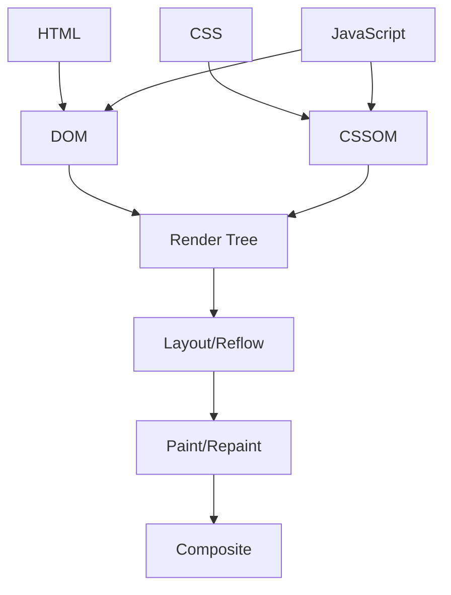
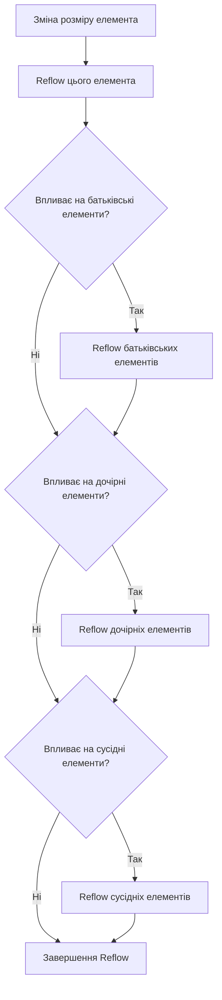
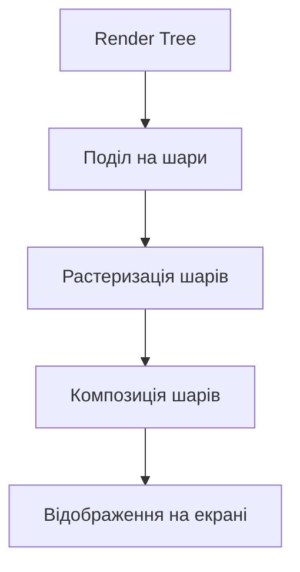
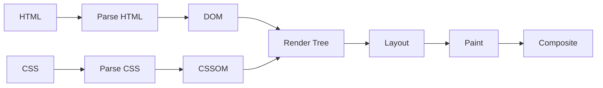

# CSS: Рендеринг у браузері

## Загальний огляд

Рендеринг у браузері — це складний багатоетапний процес, який перетворює HTML, CSS та JavaScript у візуальне представлення веб-сторінки. Розуміння цього процесу дозволяє створювати більш ефективні та продуктивні веб-додатки, оптимізувати анімації та взаємодію з користувачем.



## Етапи рендерингу в браузері

1. **Завантаження та парсинг HTML** → створення DOM (Document Object Model)
2. **Завантаження та парсинг CSS** → створення CSSOM (CSS Object Model)
3. **Створення Render Tree** → об'єднання DOM і CSSOM
4. **Layout/Reflow** → обчислення позицій та розмірів елементів
5. **Paint/Repaint** → створення візуального відображення елементів
6. **Composite** → об'єднання різних шарів для формування фінального зображення

## Reflow (Перекомпонування)

### Що таке Reflow?

Reflow (також відомий як Layout) — це процес обчислення геометрії (розміру та положення) всіх елементів на сторінці. Браузер визначає, де і як розташувати кожен елемент у вікні, враховуючи їх розміри, позицію та вплив на інші елементи.

### Коли відбувається Reflow?

Reflow спрацьовує при:

-   Початковому рендерингу сторінки
-   Зміні розмірів вікна браузера
-   Зміні вмісту сторінки (додаванні/видаленні елементів)
-   Зміні CSS-властивостей, які впливають на геометрію:
    -   width, height
    -   margin, padding
    -   border
    -   position, top, left, right, bottom
    -   display, float
    -   font-size, font-family
    -   text-align
    -   overflow
    -   line-height

### Приклад, який викликає Reflow

```javascript
// Цей код викликає Reflow
const div = document.getElementById("myDiv");
div.style.width = "300px"; // Reflow
div.style.height = "200px"; // Ще один Reflow
div.style.marginTop = "20px"; // І ще один Reflow
```

Оптимізований варіант:

```javascript
// Оптимізований код: один Reflow замість трьох
const div = document.getElementById("myDiv");
div.style.cssText = "width: 300px; height: 200px; margin-top: 20px;";
// або
div.className = "new-dimensions"; // Де клас містить всі необхідні стилі
```

### Вплив на продуктивність

Reflow — ресурсомісткий процес, який може сповільнювати роботу сторінки, особливо на складних сайтах або на пристроях з обмеженими ресурсами. Кожен Reflow може спричиняти каскадний ефект, змушуючи браузер перераховувати положення багатьох елементів.



## Repaint (Перемалювання)

### Що таке Repaint?

Repaint — це процес візуального оновлення пікселів на екрані після того, як структура елементів була визначена (після Reflow або без нього). Під час цього етапу браузер заповнює пікселі кольорами, текстом, зображеннями та іншими візуальними атрибутами.

### Коли відбувається Repaint?

Repaint відбувається:

-   Після Reflow
-   При зміні видимих стилів, які не впливають на компонування:
    -   color
    -   background-color
    -   visibility
    -   text-shadow
    -   box-shadow
    -   border-radius
    -   outline

### Приклад, який викликає Repaint (без Reflow)

```javascript
// Цей код викликає Repaint, але не Reflow
const div = document.getElementById("myDiv");
div.style.backgroundColor = "red"; // Тільки Repaint
div.style.color = "blue"; // Тільки Repaint
div.style.boxShadow = "2px 2px 5px #888"; // Тільки Repaint
```

### Вплив на продуктивність

Repaint менш ресурсомісткий, ніж Reflow, але все ще може впливати на продуктивність, особливо при частих змінах або на великих областях екрану. Оптимізація полягає в групуванні змін стилів та мінімізації області, яка перемальовується.

## Composite (Композиція)

### Що таке Composite?

Composite — це процес об'єднання намальованих частин сторінки (шарів) у фінальне зображення, яке відображається на екрані. Сучасні браузери розділяють сторінку на шари для оптимізації рендерингу та використовують апаратне прискорення (GPU) для композиції.

### Як працює Composite?

1. Браузер розділяє сторінку на шари (layers)
2. Кожен шар обробляється окремо
3. Шари складаються разом у правильному порядку
4. Результат відображається на екрані



### Оптимізація за допомогою Composite

Деякі CSS-властивості можуть бути оптимізовані для виконання тільки на етапі Composite, минаючи Reflow і Repaint:

-   transform
-   opacity
-   filter
-   will-change

### Приклад оптимізованої анімації

Неоптимізована анімація (викликає Reflow і Repaint):

```css
@keyframes move-bad {
    from {
        left: 0;
        top: 0;
    }
    to {
        left: 200px;
        top: 200px;
    }
}

.animated-bad {
    position: absolute;
    animation: move-bad 1s infinite alternate;
}
```

Оптимізована анімація (тільки Composite):

```css
@keyframes move-good {
    from {
        transform: translate(0, 0);
    }
    to {
        transform: translate(200px, 200px);
    }
}

.animated-good {
    position: absolute;
    will-change: transform; /* Підказка браузеру про майбутні зміни */
    animation: move-good 1s infinite alternate;
}
```

## Інструменти для аналізу рендеринга

### Chrome DevTools Performance

Chrome DevTools надає потужні інструменти для аналізу продуктивності рендерингу:

1. **Performance** — запис та аналіз активності рендерингу

    - Визначення Reflow (показаний як "Layout")
    - Визначення Repaint (показаний як "Paint")
    - Аналіз шарів композиції ("Layers")

2. **Rendering** — візуалізація процесів рендерингу
    - Paint flashing — підсвічування областей, які перемальовуються
    - Layout Shift Regions — виділення областей, де відбувається зсув макету
    - Layer borders — відображення кордонів шарів композиції

## Підводні камені та оптимізація

### Частих причини непотрібних Reflow

1. **Інлайнові стилі** — викликають індивідуальні Reflow:

    ```javascript
    // Погано
    element.style.width = "100px";
    element.style.height = "200px";

    // Краще
    element.style.cssText = "width: 100px; height: 200px;";
    // або
    element.className = "new-size";
    ```

2. **Читання геометричних властивостей** — змушує браузер виконати Reflow для отримання актуальних значень:

    ```javascript
    // Погано: викликає Reflow між записом і читанням
    element.style.width = "100px";
    console.log(element.offsetWidth); // Спричиняє Reflow
    element.style.height = "200px";
    console.log(element.offsetHeight); // Ще один Reflow

    // Краще: спочатку всі записи, потім всі читання
    element.style.width = "100px";
    element.style.height = "200px";
    console.log(element.offsetWidth); // Один Reflow
    console.log(element.offsetHeight); // Використовує кешовані значення
    ```

3. **DOM-маніпуляції в циклі** — призводять до множинних Reflow:

    ```javascript
    // Погано: кожна вставка викликає Reflow
    for (let i = 0; i < 1000; i++) {
        container.appendChild(document.createElement("div"));
    }

    // Краще: використання DocumentFragment
    const fragment = document.createDocumentFragment();
    for (let i = 0; i < 1000; i++) {
        fragment.appendChild(document.createElement("div"));
    }
    container.appendChild(fragment); // Один Reflow
    ```

### Стратегії оптимізації

1. **Мінімізація змін DOM** — групування маніпуляцій, використання DocumentFragment

2. **Батчинг змін стилів**:

    - Зміна класів замість інлайн-стилів
    - Використання `requestAnimationFrame` для синхронізації змін з циклом рендерингу

    ```javascript
    requestAnimationFrame(() => {
        element.style.width = "100px";
        element.style.height = "200px";
        element.style.marginTop = "20px";
    });
    ```

3. **Керування шарами композиції**:

    - Використання `will-change` для елементів, які будуть анімуватися
    - Обережне створення нових шарів (занадто багато шарів може зменшити продуктивність)

    ```css
    .animated-element {
        will-change: transform; /* Створює новий шар */
    }
    ```

4. **Виведення елементів з потоку** для уникнення каскадних Reflow:

    - Використання `position: absolute` або `position: fixed`
    - Тимчасове приховування елементів під час масових змін

    ```javascript
    // Техніка "виведення з потоку" для масових змін
    const element = document.getElementById("myList");
    const originalDisplay = element.style.display;

    // Виводимо з потоку
    element.style.display = "none";

    // Виконуємо багато змін
    for (let i = 0; i < 100; i++) {
        const item = document.createElement("li");
        item.textContent = `Item ${i}`;
        element.appendChild(item);
    }

    // Повертаємо в потік
    element.style.display = originalDisplay; // Один Reflow
    ```

5. **Віртуалізація** для великих списків даних — рендеринг тільки видимих елементів

## Критичний шлях рендерингу (Critical Rendering Path)

Критичний шлях рендерингу (CRP) — це послідовність кроків, які браузер повинен виконати, щоб відобразити початкову сторінку. Оптимізація CRP покращує час до першого відображення.



### Оптимізація критичного шляху рендерингу:

1. **Мінімізація кількості критичних ресурсів**:

    - Об'єднання CSS-файлів
    - Інлайн критичного CSS
    - Асинхронне завантаження некритичних CSS та JavaScript

2. **Зменшення розміру критичних ресурсів**:

    - Мінімізація CSS
    - Видалення невикористаних стилів
    - Стиснення ресурсів

3. **Оптимізація порядку завантаження**:
    - Розміщення критичного CSS в `<head>`
    - Відкладене завантаження JavaScript
    - Використання атрибутів `async` і `defer` для скриптів

## Веб-анімації та рендеринг

### Порівняння методів анімації

| Метод анімації  | Reflow | Repaint | Composite | Продуктивність |
| --------------- | ------ | ------- | --------- | -------------- |
| left, top       | Так    | Так     | Так       | Низька         |
| margin, padding | Так    | Так     | Так       | Низька         |
| transform       | Ні\*   | Ні\*    | Так       | Висока         |
| opacity         | Ні\*   | Ні\*    | Так       | Висока         |
| filter          | Ні\*   | Ні\*    | Так       | Середня-висока |

\* За умови, що елемент знаходиться у своєму власному шарі (наприклад, з will-change: transform).

### Приклад оптимізованої анімації прокрутки

```javascript
// Неоптимальний підхід: примусова прокрутка з reflow на кожному кроці
function scrollToSlowly(element, to, duration) {
    const start = element.scrollTop;
    const change = to - start;
    const increment = 20;
    let currentTime = 0;

    function animateScroll() {
        currentTime += increment;
        const val = Math.easeInOutQuad(currentTime, start, change, duration);
        element.scrollTop = val; // Викликає reflow на кожному кроці
        if (currentTime < duration) {
            setTimeout(animateScroll, increment);
        }
    }
    animateScroll();
}

// Оптимізований підхід: використання requestAnimationFrame
function smoothScrollTo(element, to, duration) {
    const start = element.scrollTop;
    const change = to - start;
    const startTime = performance.now();

    function animateScroll(currentTime) {
        const elapsedTime = currentTime - startTime;
        const progress = Math.min(elapsedTime / duration, 1);
        const easeProgress = easeInOutCubic(progress);

        element.scrollTop = start + change * easeProgress;

        if (elapsedTime < duration) {
            requestAnimationFrame(animateScroll);
        }
    }

    requestAnimationFrame(animateScroll);
}

// Функція пом'якшення
function easeInOutCubic(t) {
    return t < 0.5 ? 4 * t * t * t : 1 - Math.pow(-2 * t + 2, 3) / 2;
}
```

## Висновки

Розуміння механізмів рендерингу в браузері — критично важливо для створення високопродуктивних веб-додатків. Знання про Reflow, Repaint і Composite дозволяє:

1. **Писати оптимізований код** з урахуванням впливу на процеси рендерингу
2. **Створювати плавні анімації** без зниження продуктивності
3. **Діагностувати та виправляти проблеми** з продуктивністю
4. **Ефективно використовувати сучасні API** браузерів для рендерингу

Найважливіші принципи оптимізації:

-   Групування DOM-операцій
-   Мінімізація змін макета (Reflow)
-   Використання властивостей, які впливають тільки на Composite
-   Ефективне управління шарами
-   Відстеження продуктивності за допомогою інструментів розробника

> **Цитата WebKit-розробника**: "Найкращий Reflow — це той, який ніколи не відбувався."
