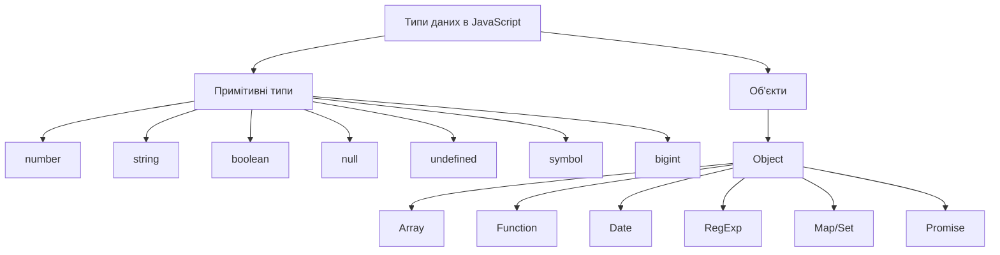
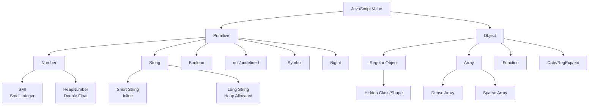

# JavaScript/TypeScript: Типи даних

## Загальний огляд

JavaScript — це динамічно типізована мова, що означає, що типи змінних визначаються під час виконання, а не під час компіляції. TypeScript розширює JavaScript статичною типізацією. Разом вони надають широкий спектр типів даних для різних потреб програмування.

Розуміння типів даних у JavaScript та TypeScript є фундаментальним для написання надійного, передбачуваного та ефективного коду.



## Примітивні типи даних

Примітивні типи даних — це базові, вбудовані типи, які не є об'єктами та не мають методів. JavaScript має 7 примітивних типів даних.

### 1. Number (Число)

**Визначення**: Представляє як цілі числа, так і числа з плаваючою комою (IEEE 754 double precision).

**Діапазон**: від ±5.0×10^-324 до ±1.7976931348623157×10^308

**Синтаксис**:

```javascript
let integer = 42; // Ціле число
let float = 3.14; // Число з плаваючою комою
let exponent = 2.998e8; // Експоненційний запис (2.998 × 10^8)
let binary = 0b1010; // Бінарне число (10 в десятковій)
let octal = 0o744; // Вісімкове число (484 в десятковій)
let hexadecimal = 0xff; // Шістнадцяткове число (255 в десятковій)
```

**Спеціальні значення**:

```javascript
let positiveInfinity = Infinity; // Позитивна нескінченність
let negativeInfinity = -Infinity; // Негативна нескінченність
let notANumber = NaN; // "Не число" (результат невизначених операцій)
```

**Методи і властивості** (доступні через об'єктний обгортку `Number`):

```javascript
Number.MAX_VALUE; // Найбільше представиме число (≈1.8e+308)
Number.MIN_VALUE; // Найменше представиме додатне число (≈5e-324)
Number.MAX_SAFE_INTEGER; // Найбільше ціле число, що може бути безпечно представлене (2^53 - 1)
Number.MIN_SAFE_INTEGER; // Найменше ціле число, що може бути безпечно представлене (-(2^53 - 1))
Number.EPSILON; // Найменша різниця між числами (≈2.22e-16)
Number.NaN; // Спеціальне "не число" значення
Number.POSITIVE_INFINITY; // Спеціальне значення для позитивної нескінченності
Number.NEGATIVE_INFINITY; // Спеціальне значення для негативної нескінченності

// Методи
(123.456).toFixed(2); // "123.46" (округлення до вказаної кількості знаків після коми)
(123.456).toPrecision(4); // "123.5" (округлення до вказаної загальної кількості цифр)
(123.456).toString(16); // "7b.74bc6a7ef9db" (перетворення в рядок вказаної системи числення)
Number.isNaN(NaN); // true (перевірка, чи є значення NaN)
Number.isFinite(42); // true (перевірка, чи є число скінченним)
Number.isInteger(42); // true (перевірка, чи є число цілим)
Number.isSafeInteger(42); // true (перевірка, чи є ціле число безпечним)
Number.parseFloat("3.14"); // 3.14 (перетворення рядка в число з плаваючою комою)
Number.parseInt("42", 10); // 42 (перетворення рядка в ціле число з вказаною основою)
```

**Підводні камені**:

1. **Проблеми точності з плаваючою комою**:

    ```javascript
    0.1 + 0.2; // 0.30000000000000004, а не 0.3
    ```

    Рішення:

    ```javascript
    (0.1 + 0.2).toFixed(1); // "0.3" (рядок)
    Number((0.1 + 0.2).toFixed(10)); // 0.3 (число)
    Math.round((0.1 + 0.2) * 10) / 10; // 0.3
    ```

2. **Ділення на нуль**:

    ```javascript
    1 / 0; // Infinity (не викликає помилки)
    -1 / 0; // -Infinity
    0 / 0; // NaN
    ```

3. **NaN поведінка**:

    ```javascript
    NaN === NaN; // false! NaN не дорівнює навіть самому собі
    isNaN(NaN); // true (стандартна перевірка на NaN)
    Number.isNaN(NaN); // true (строгіша перевірка в ES6+)

    // Різниця між isNaN() та Number.isNaN():
    isNaN("string"); // true (намагається конвертувати в число спочатку)
    Number.isNaN("string"); // false (перевіряє, чи значення вже є NaN)
    ```

**Внутрішня реалізація**:

JavaScript використовує стандарт IEEE 754 для чисел з подвійною точністю:

-   1 біт для знаку
-   11 бітів для експоненти
-   52 біти для мантиси

```
Візуалізація числа в пам'яті:
[sign][exponent][mantissa]
```

### 2. String (Рядок)

**Визначення**: Послідовність символів, що представляють текстові дані.

**Синтаксис**:

```javascript
let singleQuotes = "Текст у одинарних лапках";
let doubleQuotes = "Текст у подвійних лапках";
let backticks = `Шаблонний рядок з можливістю вставки ${singleQuotes}`;
```

**Escape-послідовності**:

```javascript
let escapes = "Нова строка: \n Табуляція: \t Зворотній слеш: \\ Лапки: '";
```

**Unicode**:

```javascript
let unicode = "\u00A9"; // © (знак копірайту)
let emoji = "\u{1F604}"; // 😄 (смайлик)
```

**Методи і властивості**:

```javascript
let text = "Hello, World!";

// Властивості
text.length; // 13 (довжина рядка)

// Методи доступу до символів
text.charAt(0); // "H" (символ за індексом)
text[0]; // "H" (альтернативний доступ)
text.charCodeAt(0); // 72 (код символу в UTF-16)
text.codePointAt(0); // 72 (код символу в Unicode)

// Методи пошуку
text.indexOf("World"); // 7 (індекс першого входження підрядка)
text.lastIndexOf("o"); // 8 (індекс останнього входження символу)
text.includes("Hello"); // true (перевірка на наявність підрядка)
text.startsWith("Hello"); // true (перевірка початку рядка)
text.endsWith("!"); // true (перевірка кінця рядка)
text.search(/World/); // 7 (пошук за регулярним виразом)

// Методи витягування підрядків
text.slice(0, 5); // "Hello" (підрядок від start до end)
text.substring(7, 12); // "World" (підрядок між індексами)
text.substr(7, 5); // "World" (підрядок з індексу певної довжини)

// Методи перетворення
text.toUpperCase(); // "HELLO, WORLD!" (перетворення в верхній регістр)
text.toLowerCase(); // "hello, world!" (перетворення в нижній регістр)
text.trim(); // "Hello, World!" (видалення пробілів по краях)
text.trimStart(); // Видалення пробілів на початку (ES2019)
text.trimEnd(); // Видалення пробілів в кінці (ES2019)
text.padStart(20, "-"); // "-------Hello, World!" (доповнення до довжини на початку)
text.padEnd(20, "-"); // "Hello, World!-------" (доповнення до довжини в кінці)
text.repeat(2); // "Hello, World!Hello, World!" (повторення рядка)

// Методи заміни і розділення
text.replace("World", "Universe"); // "Hello, Universe!" (заміна першого входження)
text.replaceAll("l", "L"); // "HeLLo, WorLd!" (заміна всіх входжень, ES2021)
text.split(", "); // ["Hello", "World!"] (розділення на масив)
text.split(""); // ["H", "e", "l", "l", "o", ",", " ", ...] (розділення на символи)

// Методи порівняння
text.localeCompare("Hello"); // 1 (порівняння з урахуванням локалі)

// Нові методи ES2022+
"   hello  ".trimStart(); // "hello  " (ES2019)
"   hello  ".trimEnd(); // "   hello" (ES2019)
"hello".padStart(10, "*"); // "*****hello" (ES2017)
"hello".padEnd(10, "*"); // "hello*****" (ES2017)
"hello".replaceAll("l", "L"); // "heLLo" (ES2021)
```

**Рядки в TypeScript**:

```typescript
// Типи рядків в TypeScript
let simpleString: string = "Звичайний рядок";
let templateString: string = `Шаблонний рядок ${simpleString}`;

// Рядкові літерали типу
type Direction = "north" | "south" | "east" | "west";
let myDirection: Direction = "north"; // OK
// let invalid: Direction = "northeast"; // Помилка: Type '"northeast"' is not assignable to type 'Direction'
```

**Підводні камені**:

1. **Рядки є незмінними (immutable)**:

    ```javascript
    let str = "hello";
    str[0] = "H"; // Не працює, рядок не змінюється
    console.log(str); // "hello"

    // Для зміни потрібно створити новий рядок
    str = "H" + str.slice(1); // "Hello"
    ```

2. **Порівняння рядків**:

    ```javascript
    // Регістрочутливе порівняння
    "apple" === "Apple"; // false

    // Для регістронезалежного порівняння
    "apple".toLowerCase() === "Apple".toLowerCase(); // true
    ```

3. **Багатобайтові символи**:

    ```javascript
    // Емодзі та інші символи поза BMP (Basic Multilingual Plane)
    "😄".length; // 2, а не 1, бо представлено як два сурогатні пари

    // Правильний підрахунок символів
    [..."😄"].length; // 1
    Array.from("😄").length; // 1
    ```

**Внутрішня реалізація**:

JavaScript використовує UTF-16 кодування для рядків:

-   Кожен символ представлений 1 або 2 16-бітними одиницями
-   Символи в діапазоні U+0000 до U+FFFF представлені однією одиницею
-   Символи поза цим діапазоном представлені сурогатною парою (2 одиниці)

### 3. Boolean (Логічний тип)

**Визначення**: Представляє логічне значення: true (істина) або false (хибність).

**Синтаксис**:

```javascript
let isActive = true;
let isDisabled = false;
```

**Перетворення в логічні значення**:

```javascript
// Falsy значення (перетворюються на false)
Boolean(0); // false
Boolean(""); // false
Boolean(null); // false
Boolean(undefined); // false
Boolean(NaN); // false
Boolean(false); // false

// Truthy значення (перетворюються на true)
Boolean(1); // true
Boolean("hello"); // true
Boolean([]); // true
Boolean({}); // true
Boolean(function () {}); // true
Boolean(new Date()); // true
```

**Логічні оператори**:

```javascript
// Оператор &&: логічне І
true && true; // true
true && false; // false
false && true; // false
false && false; // false

// Оператор ||: логічне АБО
true || true; // true
true || false; // true
false || true; // true
false || false; // false

// Оператор !: логічне НЕ
!true; // false
!false; // true

// Оператор ??:  нульове об'єднання (ES2020)
null ?? "default"; // "default"
undefined ?? "default"; // "default"
0 ?? "default"; // 0 (0 не є null чи undefined)
"" ?? "default"; // "" (порожній рядок не є null чи undefined)
```

**Короткозамкнена оцінка**:

```javascript
// Оператор && повертає перший falsy операнд або останній truthy
"hello" && "world"; // "world"
"hello" && ""; // ""
"" && "world"; // ""

// Оператор || повертає перший truthy операнд або останній falsy
"hello" || "world"; // "hello"
"" || "world"; // "world"
"" || 0; // 0
```

**Використання в TypeScript**:

```typescript
let isEnabled: boolean = true;
let isCompleted: boolean = false;

// Суворіша типізація з literal types
type TriState = true | false | null;
let state: TriState = true;
state = false; // OK
state = null; // OK
// state = undefined;  // Помилка: Type 'undefined' is not assignable to type 'TriState'
```

**Підводні камені**:

1. **Оператори порівняння**:

    ```javascript
    // Нестрога рівність (з перетворенням типів)
    1 == true; // true (1 перетворюється на true)
    0 == false; // true (0 перетворюється на false)
    "" == false; // true (порожній рядок перетворюється на false)

    // Строга рівність (без перетворення типів)
    1 === true; // false (різні типи)
    0 === false; // false (різні типи)
    ```

2. **Особливості короткозамкненої оцінки**:

    ```javascript
    // Може бути несподіваним
    let a = 0;
    true && (a = 5); // a стає 5
    false && (a = 10); // a залишається 5, бо права частина не виконується

    a = 0;
    false || (a = 5); // a стає 5
    true || (a = 10); // a залишається 5, бо права частина не виконується
    ```

### 4. Null

**Визначення**: Представляє навмисну відсутність будь-якого значення об'єкта.

**Синтаксис**:

```javascript
let user = null; // Явно вказує, що змінна не має значення
```

**Особливості**:

-   `null` є примітивним значенням, але `typeof null` повертає `"object"`, що є відомою помилкою в JavaScript
-   `null` вважається falsy значенням в логічних операціях

**Використання в TypeScript**:

```typescript
// null як тип
let userProfile: null = null;

// union з null
let optionalValue: string | null = "hello";
optionalValue = null; // OK

// strictNullChecks в tsconfig.json
function getLength(text: string | null): number {
    // Без перевірки виникне помилка при strictNullChecks: true
    if (text === null) return 0;
    return text.length; // OK після перевірки
}
```

**Підводні камені**:

1. **Перевірка на null**:

    ```javascript
    // Нестрога рівність
    null == undefined; // true

    // Строга рівність
    null === undefined; // false

    // Перевірка на null
    let value = null;
    if (value === null) {
        // Виконається
    }
    ```

2. **typeof null**:

    ```javascript
    typeof null; // "object" - історична помилка в JavaScript

    // Правильна перевірка на null
    value === null; // Використовуйте строгу рівність замість typeof
    ```

### 5. Undefined

**Визначення**: Представляє значення, яке ще не було призначене.

**Синтаксис**:

```javascript
let variable; // Автоматично отримує значення undefined
let explicitUndefined = undefined; // Явне присвоєння undefined
```

**Ситуації, коли виникає undefined**:

```javascript
// Неініціалізована змінна
let a;
console.log(a); // undefined

// Доступ до неіснуючої властивості об'єкта
let obj = {};
console.log(obj.property); // undefined

// Функція без return
function doNothing() {}
console.log(doNothing()); // undefined

// Параметр функції без значення
function test(param) {
    console.log(param);
}
test(); // undefined

// Пропуск елементів масиву
let arr = [1, , 3];
console.log(arr[1]); // undefined
```

**Використання в TypeScript**:

```typescript
// undefined як тип
let notInitialized: undefined = undefined;

// union з undefined
let optionalData: string | undefined = "data";
optionalData = undefined; // OK

// Optional chaining (ES2020)
type User = {
    address?: {
        street?: string;
    };
};

let user: User = {};
let street = user.address?.street; // undefined замість помилки
```

**Підводні камені**:

1. **undefined vs. not defined**:

    ```javascript
    console.log(undeclaredVariable); // ReferenceError: undeclaredVariable is not defined

    let declaredVariable;
    console.log(declaredVariable); // undefined
    ```

2. **Перевірка на undefined**:

    ```javascript
    // Не рекомендується (global undefined може бути перевизначено у старих браузерах)
    if (value === undefined) {
        /* ... */
    }

    // Безпечніший спосіб (не можна перевизначити)
    if (typeof value === "undefined") {
        /* ... */
    }

    // В сучасному JavaScript (можна використовувати перший варіант)
    if (value === undefined) {
        /* ... */
    }
    ```

3. **Optional chaining**:

    ```javascript
    // Без optional chaining (ES2020)
    let street = user && user.address && user.address.street;

    // З optional chaining
    let street = user?.address?.street;
    ```

### 6. Symbol

**Визначення**: Представляє унікальний і незмінний ідентифікатор, часто використовується як ключі для властивостей об'єктів.

**Синтаксис**:

```javascript
// Створення символу
let sym1 = Symbol();
let sym2 = Symbol("description"); // З необов'язковим описом

// Символи завжди унікальні
let sym3 = Symbol("description");
console.log(sym2 === sym3); // false, навіть з однаковим описом

// Глобальний реєстр символів
let globalSym1 = Symbol.for("globalKey");
let globalSym2 = Symbol.for("globalKey");
console.log(globalSym1 === globalSym2); // true, це один і той самий символ

// Отримання ключа з глобального символу
console.log(Symbol.keyFor(globalSym1)); // "globalKey"
console.log(Symbol.keyFor(sym1)); // undefined (не глобальний символ)
```

**Використання символів як ключів властивостей**:

```javascript
const MY_KEY = Symbol("my_key");

let obj = {
    [MY_KEY]: "Hidden value",
};

console.log(obj[MY_KEY]); // "Hidden value"
console.log(Object.keys(obj)); // [] (символи не включаються)
console.log(Object.getOwnPropertySymbols(obj)); // [Symbol(my_key)]
```

**Вбудовані символи (well-known symbols)**:

```javascript
// Symbol.iterator - визначає як об'єкт має ітеруватися
let iterable = {
    [Symbol.iterator]() {
        let i = 0;
        return {
            next() {
                return i < 3 ? { value: i++, done: false } : { done: true };
            },
        };
    },
};

for (let num of iterable) {
    console.log(num); // 0, 1, 2
}

// Symbol.asyncIterator - для асинхронної ітерації (ES2018)
// Symbol.match, Symbol.replace, Symbol.search, Symbol.split - для регулярних виразів
// Symbol.toPrimitive - для явного перетворення на примітив
// Symbol.toStringTag - для налаштування результату Object.prototype.toString
// Symbol.species - для визначення конструктора похідних об'єктів
// Symbol.isConcatSpreadable - для контролю розгортання в Array.prototype.concat
// Symbol.unscopables - для визначення прихованих властивостей від with
// Symbol.hasInstance - для налаштування оператора instanceof
```

**Використання в TypeScript**:

```typescript
// Символ як тип
const id = Symbol("id");
let symbolValue: symbol = id;

// Унікальний символьний тип
declare const uniqueSymbol: unique symbol;
let ref: typeof uniqueSymbol; // Тип унікального символу
```

**Підводні камені**:

1. **Невидимість у циклах та JSON**:

    ```javascript
    let obj = { [Symbol("key")]: "value" };
    console.log(JSON.stringify(obj)); // "{}" (символи ігноруються)

    for (let key in obj) {
        console.log(key); // Нічого не виведе (символи не перераховуються)
    }
    ```

2. **Отримання символьних властивостей**:

    ```javascript
    let sym = Symbol("example");
    let obj = { [sym]: "value" };

    // Не можна отримати за ім'ям
    obj["Symbol(example)"]; // undefined

    // Потрібна пряма посилання на символ
    obj[sym]; // "value"
    ```

3. **Перетворення на рядок**:

    ```javascript
    let sym = Symbol("desc");

    String(sym); // "Symbol(desc)" - працює
    sym + ""; // TypeError: Cannot convert a Symbol value to a string
    `${sym}`; // TypeError: Cannot convert a Symbol value to a string
    ```

### 7. BigInt

**Визначення**: Представляє цілі числа довільної точності, що виходять за межі безпечного діапазону Number.

**Синтаксис**:

```javascript
// Створення BigInt
let bigInt1 = 1234567890123456789012345n; // Літерал BigInt з суфіксом n
let bigInt2 = BigInt("9007199254740993"); // Конструктор BigInt()
let bigInt3 = BigInt(123); // З числа

// Літерали BigInt в різних системах числення
let binaryBigInt = 0b101011101011101011101n; // Бінарний
let octalBigInt = 0o73727377n; // Вісімковий
let hexBigInt = 0xab123ffn; // Шістнадцятковий
```

**Операції з BigInt**:

```javascript
// Арифметичні операції
let sum = 1n + 2n; // 3n
let difference = 5n - 2n; // 3n
let product = 2n * 3n; // 6n
let quotient = 10n / 3n; // 3n (цілочисельне ділення, без дробової частини)
let remainder = 10n % 3n; // 1n
let power = 2n ** 3n; // 8n

// Порівняння
5n > 4n; // true
5n < 4n; // false
5n === 5; // false (різні типи)
5n == 5; // true (нестрога рівність з перетворенням)

// Унарні оператори
let negation = -5n; // -5n
// let increment = 5n++;     // Не підтримується
// let positive = +5n;       // TypeError: Cannot convert a BigInt value to a number
```

**Перетворення типів**:

```javascript
// BigInt в Number (можлива втрата точності)
Number(999999999999999999n); // 1000000000000000000

// Number в BigInt (дробова частина відкидається)
BigInt(10.5); // TypeError
BigInt(Math.floor(10.5)); // 10n

// BigInt в String
String(123n); // "123"
123n + ""; // "123"

// String в BigInt
BigInt("123"); // 123n
BigInt("0x123"); // Не працює, потрібно BigInt(parseInt("0x123", 16))

// BigInt не працює з Math
// Math.max(1n, 2n);         // TypeError
```

**Використання в TypeScript**:

```typescript
// BigInt як тип
let safeNumber: bigint = 9007199254740991n;

// Літерали BigInt в TypeScript
let binary: bigint = 0b1010n;
let octal: bigint = 0o777n;
let hex: bigint = 0xabcn;

// Union з іншими типами
function processNumber(value: number | bigint) {
    if (typeof value === "bigint") {
        // Робота з BigInt
    } else {
        // Робота з number
    }
}
```

**Підводні камені**:

1. **Змішування з Number**:

    ```javascript
    let mixed = 1n + 1; // TypeError: Cannot mix BigInt and other types

    // Правильно
    let result = 1n + BigInt(1); // 2n
    ```

2. **Цілочисельне ділення**:

    ```javascript
    10n / 3n; // 3n (не 3.333...)

    // Для точного ділення потрібно конвертувати
    Number(10n) / Number(3n); // 3.3333333333333335
    ```

3. **Відсутність підтримки у Math**:

    ```javascript
    Math.max(1n, 2n); // TypeError

    // Альтернативи
    let max = 1n > 2n ? 1n : 2n;
    ```

4. **Використання в JSON**:

    ```javascript
    JSON.stringify({ value: 10n }); // TypeError

    // Рішення - кастомний replacer
    JSON.stringify({ value: 10n }, (key, value) =>
        typeof value === "bigint" ? value.toString() : value
    ); // '{"value":"10"}'
    ```

## Об'єктні типи даних

### 1. Object (Об'єкт)

**Визначення**: Колекція пов'язаних даних і/або функціональності, що складається з пар ключ-значення.

**Синтаксис**:

```javascript
// Об'єктний літерал
let person = {
    name: "John",
    age: 30,
    isActive: true,
    greet: function () {
        return `Hello, my name is ${this.name}`;
    },
};

// Доступ до властивостей
person.name; // "John" (точкова нотація)
person["age"]; // 30 (нотація з дужками)
person.greet(); // "Hello, my name is John" (виклик методу)

// Додавання і зміна властивостей
person.country = "USA"; // Додавання нової властивості
person.age = 31; // Зміна існуючої властивості

// Видалення властивості
delete person.isActive;
```

**Методи створення об'єктів**:

```javascript
// Літерал об'єкта
let obj1 = { key: "value" };

// Конструктор Object
let obj2 = new Object();
obj2.key = "value";

// Object.create()
let proto = { inherited: "yes" };
let obj3 = Object.create(proto);
obj3.own = "value";
console.log(obj3.inherited); // "yes" (успадковано від прототипу)

// Клас (ES6+)
class MyClass {
    constructor(value) {
        this.value = value;
    }

    getValue() {
        return this.value;
    }
}
let obj4 = new MyClass("data");
```

**Властивості та дескриптори**:

```javascript
// Дескриптори властивостей
let user = {};

// Визначення властивості з дескриптором
Object.defineProperty(user, "name", {
    value: "John",
    writable: true, // Чи можна змінювати
    enumerable: true, // Чи видно в циклах
    configurable: true, // Чи можна видаляти або змінювати дескриптор
});

// Геттери і сеттери
let person = {
    firstName: "John",
    lastName: "Doe",
    get fullName() {
        return `${this.firstName} ${this.lastName}`;
    },
    set fullName(value) {
        [this.firstName, this.lastName] = value.split(" ");
    },
};

console.log(person.fullName); // "John Doe"
person.fullName = "Jane Smith";
console.log(person.firstName); // "Jane"
```

**Статичні методи Object**:

```javascript
// Робота з властивостями
Object.keys(person); // ["firstName", "lastName"]
Object.values(person); // ["Jane", "Smith"]
Object.entries(person); // [["firstName", "Jane"], ["lastName", "Smith"]]
Object.hasOwn(person, "firstName"); // true (ES2022, безпечніше ніж hasOwnProperty)
Object.getOwnPropertyNames(person); // ["firstName", "lastName", "fullName"]
Object.getOwnPropertySymbols(person); // [] (символьні ключі)
Object.getOwnPropertyDescriptor(person, "firstName"); // {value: "Jane", writable: true, ...}

// Маніпуляції з об'єктами
Object.assign(target, source1, source2); // Копіює властивості
Object.create(proto, propertiesObject); // Створює об'єкт з вказаним прототипом
Object.defineProperty(obj, prop, descriptor); // Визначає властивість
Object.defineProperties(obj, descriptors); // Визначає кілька властивостей
Object.freeze(obj); // Робить об'єкт незмінним
Object.seal(obj); // Запобігає додаванню/видаленню властивостей
Object.preventExtensions(obj); // Запобігає розширенню об'єкта

// Перевірки
Object.is(value1, value2); // Строге порівняння (ES6)
Object.isFrozen(obj); // Чи заморожений об'єкт
Object.isSealed(obj); // Чи запечатаний об'єкт
Object.isExtensible(obj); // Чи можна розширювати об'єкт
```

**Сучасні методи об'єктів**:

```javascript
// Object.fromEntries (ES2019) - зворотній до Object.entries
let entries = [
    ["name", "John"],
    ["age", 30],
];
let obj = Object.fromEntries(entries); // {name: "John", age: 30}

// Object rest/spread (ES2018)
let { name, ...rest } = person; // Деструктуризація з rest
let clone = { ...person }; // Клонування об'єкта через spread
let merged = { ...obj1, ...obj2 }; // Об'єднання об'єктів
```

**Об'єкти в TypeScript**:

```typescript
// Типізація об'єктів
interface Person {
    name: string;
    age: number;
    isActive?: boolean; // Необов'язкове поле
    readonly id: number; // Поле тільки для читання
    greet(): string; // Метод
}

let user: Person = {
    name: "Alice",
    age: 25,
    id: 1,
    greet() {
        return `Hello, ${this.name}`;
    },
};

// Індексні сигнатури
interface Dictionary {
    [key: string]: any;
}

// Типи записів (Record)
type UserRoles = Record<string, "admin" | "user" | "guest">;
```

**Підводні камені**:

1. **Мутабельність об'єктів**:

    ```javascript
    let obj1 = { value: 10 };
    let obj2 = obj1;
    obj2.value = 20;
    console.log(obj1.value); // 20 (змінився оригінал)

    // Глибоке клонування
    let clone = JSON.parse(JSON.stringify(obj1)); // Простий спосіб для серіалізованих об'єктів
    // або
    let clone2 = structuredClone(obj1); // Сучасний метод (ES2022)
    ```

2. **Порівняння об'єктів**:

    ```javascript
    let a = { value: 10 };
    let b = { value: 10 };
    console.log(a === b); // false (різні посилання)

    // Порівняння за значенням
    JSON.stringify(a) === JSON.stringify(b); // true (але має обмеження)
    ```

3. **Ключі властивостей**:

    ```javascript
    let obj = {
        1: "numeric key",
        1: "string key",
    };
    console.log(obj[1] === obj["1"]); // true (числові ключі конвертуються в рядки)

    // Але об'єкт з ключем-символом відрізняється
    let sym = Symbol("key");
    obj[sym] = "symbol key";
    console.log(obj[sym]); // "symbol key"
    console.log(obj["Symbol(key)"]); // undefined
    ```

4. **this в методах**:

    ```javascript
    let user = {
        name: "John",
        greet() {
            return `Hello, ${this.name}`;
        },
    };

    let greet = user.greet;
    console.log(greet()); // "Hello, undefined" (this втрачається)

    // Фіксація this
    let boundGreet = user.greet.bind(user);
    console.log(boundGreet()); // "Hello, John"
    ```

## Оператор typeof і перевірка типів

Оператор `typeof` є фундаментальним інструментом для визначення типу даних в JavaScript:

```javascript
typeof 42; // "number"
typeof "hello"; // "string"
typeof true; // "boolean"
typeof undefined; // "undefined"
typeof null; // "object" (це помилка в дизайні мови)
typeof Symbol(); // "symbol"
typeof 42n; // "bigint"
typeof {}; // "object"
typeof []; // "object" (масиви це об'єкти)
typeof function () {}; // "function"
```

**Підводні камені typeof**:

1. **typeof null**:

    ```javascript
    typeof null; // "object" (відома помилка в JavaScript)

    // Правильна перевірка на null
    value === null;
    ```

2. **Перевірка масивів**:

    ```javascript
    typeof []; // "object" (не відрізняє масиви від об'єктів)

    // Правильна перевірка на масив
    Array.isArray([]); // true
    ```

3. **Перевірка NaN**:

    ```javascript
    typeof NaN; // "number" (NaN є special числовим значенням)

    // Правильна перевірка на NaN
    Number.isNaN(NaN); // true
    ```

**Інші способи перевірки типів**:

```javascript
// Перевірка на примітив
function isPrimitive(value) {
    return (
        value === null ||
        (typeof value !== "object" && typeof value !== "function")
    );
}

// Перевірка на об'єкт певного класу
obj instanceof Class; // true якщо obj є екземпляром Class

// Перевірка на наявність властивості (duck typing)
if ("length" in obj && typeof obj.forEach === "function") {
    // Ймовірно це масивоподібний об'єкт
}

// Перевірка через конструктор
Object.prototype.toString.call(value); // "[object Type]"
```

**Перевірка типів у TypeScript**:

```typescript
// Оператор typeof в TypeScript може бути використаний у типах
function process(value: string | number) {
    if (typeof value === "string") {
        // TypeScript знає, що тут value має тип string
        return value.toUpperCase();
    } else {
        // TypeScript знає, що тут value має тип number
        return value.toFixed(2);
    }
}

// Type guards (захисники типів)
function isString(value: any): value is string {
    return typeof value === "string";
}

// Assertion functions (функції твердження)
function assertIsString(value: any): asserts value is string {
    if (typeof value !== "string") {
        throw new Error("Value is not a string");
    }
}
```

## Перетворення типів

### Явне перетворення типів

```javascript
// Перетворення в рядок
String(42); // "42"
String(true); // "true"
String(null); // "null"
String(undefined); // "undefined"
String({}); // "[object Object]"
String([1, 2]); // "1,2"

// Перетворення в число
Number("42"); // 42
Number("42px"); // NaN
Number(true); // 1
Number(false); // 0
Number(null); // 0
Number(undefined); // NaN
Number([]); // 0
Number(["42"]); // 42
Number([1, 2]); // NaN
Number({}); // NaN

// Перетворення в логічне значення
Boolean(42); // true
Boolean(0); // false
Boolean(""); // false
Boolean("hello"); // true
Boolean(null); // false
Boolean(undefined); // false
Boolean({}); // true
Boolean([]); // true
```

### Неявне перетворення типів

```javascript
// Рядкове перетворення (оператор +, якщо один операнд є рядком)
42 + "1"; // "421"
"3" + 2 + 1; // "321" (зліва направо)
1 + 2 + "3"; // "33" (зліва направо)

// Числове перетворення (більшість математичних операторів)
"5" - 2; // 3 (рядок перетворюється в число)
"5" * 2; // 10
10 / "2"; // 5
+"42"; // 42 (унарний + перетворює в число)
-"42"; // -42
"5" > 4; // true (рядок перетворюється в число)

// Логічне перетворення (умовні оператори)
if ("hello") {
    /* виконається */
}
if (0) {
    /* не виконається */
}

// Ослаблена рівність (==)
"42" == 42; // true (рядок перетворюється в число)
0 == false; // true (boolean перетворюється в число)
null == undefined; // true (спеціальне правило)
[] == 0; // true (складне перетворення)
```

### Рекомендації з перетворення типів

```javascript
// Використовуйте явне перетворення
let numStr = "42";
let num = Number(numStr); // Явно і зрозуміло

// Використовуйте строгу рівність (===)
if (value === 42) {
    /* ... */
}

// Для перетворення в число можна використовувати
Number("42"); // Явний конструктор
parseInt("42", 10); // Для цілих чисел з рядка, завжди вказуйте основу
parseFloat("42.5"); // Для чисел з плаваючою комою
+"42"; // Коротший синтаксис (але менш очевидний)

// Для перетворення в рядок
String(42); // Явний конструктор
(42).toString(); // Метод (зверніть увагу на дві крапки для числового літералу)
`${42}`; // Шаблонні рядки (сучасний підхід)

// Для перетворення в логічне значення
Boolean(value); // Явний конструктор
!!value; // Подвійне заперечення (коротший запис)
```

## Внутрішня реалізація типів даних в JavaScript

JavaScript рушії (V8, SpiderMonkey, JavaScriptCore) використовують різні оптимізації для ефективної роботи з типами даних:

### Зберігання примітивів

1. **Number**: Зазвичай зберігається як 64-бітне число з плаваючою комою (IEEE 754).

    - V8 використовує оптимізацію: 31-бітні цілі числа (SMI - Small Integer) зберігаються компактніше
    - Числа, що не поміщаються в SMI, зберігаються як повноцінні об'єкти HeapNumber

2. **String**: Різні реалізації в різних рушіях:

    - Можуть використовуватися різні кодування (ASCII, UTF-16)
    - Короткі рядки можуть зберігатися інлайн
    - Довгі рядки зберігаються як вказівники на пам'ять з фактичними даними
    - Можуть використовуватися оптимізації rope (для конкатенації) або інтернування (для повторюваних рядків)

3. **Boolean, null, undefined**: Зазвичай представлені як спеціальні константні значення.

4. **Symbol**: Зберігається як унікальний ідентифікатор з необов'язковим описом.

5. **BigInt**: Зберігається як послідовність бітів довільної довжини, часто як зв'язаний список чанків.

### Зберігання об'єктів

1. **Схеми (Shapes/Hidden Classes)**: Рушії оптимізують доступ до властивостей об'єктів:

    - Об'єкти з однаковою структурою використовують спільну "схему"
    - Це дозволяє швидше знаходити властивості без повного пошуку
    - Зміна структури об'єкта може призводити до створення нової схеми

2. **Масиви**: Оптимізовані для швидкого доступу за індексом:
    - Щільні масиви (без пропусків) можуть зберігатися як безперервні блоки пам'яті
    - Розріджені масиви використовують спеціальні структури даних (хеш-таблиці)



## Рекомендації щодо вибору типів даних

### Коли використовувати конкретні типи:

1. **Number**:

    - Для більшості числових розрахунків
    - Для індексів масивів і лічильників
    - Обмеження: точність лише до 15-17 значущих цифр

2. **BigInt**:

    - Для дуже великих цілих чисел (ID, великі таймстемпи, фінансові дані)
    - Коли потрібна точність поза межами Number.MAX_SAFE_INTEGER (9007199254740991)
    - Обмеження: повільніші операції, ніж з Number

3. **String**:

    - Для тексту будь-якої довжини
    - Для зберігання даних, які не потребують математичних операцій
    - Для кодів, які можуть починатися з нулів (поштові індекси, телефонні номери)

4. **Boolean**:

    - Для представлення стану (увімкнено/вимкнено, так/ні)
    - Для умов в розгалуженнях і циклах

5. **null**:

    - Для явної відсутності значення
    - Для позначення "порожнього" стану об'єкта
    - В API для позначення відсутності результату

6. **undefined**:

    - Для неініціалізованих змінних
    - Для відсутніх параметрів функції
    - Для неіснуючих властивостей об'єкта

7. **Symbol**:

    - Для унікальних ідентифікаторів властивостей
    - Для метаданних об'єктів
    - Для уникнення колізій імен у розширюваному коді
    - Для впровадження ітераторів та інших протоколів мови

8. **Object**:
    - Для групування пов'язаних даних
    - Для створення складних структур даних
    - Для інкапсуляції поведінки (методи)

### Загальні рекомендації:

1. **Будьте явними в перетвореннях типів**:

    ```javascript
    // Добре
    const value = Number(inputValue);

    // Потенційно небезпечно
    const value = +inputValue;
    ```

2. **Використовуйте строгу рівність (===)**:

    ```javascript
    // Добре
    if (value === 0) {
        /* ... */
    }

    // Потенційно небезпечно
    if (value == 0) {
        /* ... */
    }
    ```

3. **Перевіряйте тип перед операціями**:

    ```javascript
    if (typeof value === "number" && !isNaN(value)) {
        // Безпечно працювати з числом
    }
    ```

4. **В TypeScript використовуйте точну типізацію**:

    ```typescript
    // Точніше, ніж просто number
    type Percent = number;
    function calculateDiscount(price: number, discount: Percent): number {
        return price * (1 - discount / 100);
    }
    ```

5. **Використовуйте об'єкти для структурованих даних**:

    ```javascript
    // Добре
    const user = {
        id: 1,
        name: "John",
        isActive: true,
    };

    // Менш зрозуміло
    const userId = 1;
    const userName = "John";
    const userIsActive = true;
    ```

## Висновки

Розуміння типів даних у JavaScript та TypeScript є фундаментальним для ефективного програмування:

1. **JavaScript має 7 примітивних типів**: number, string, boolean, null, undefined, symbol, bigint.

2. **Об'єкти** є складним типом даних, що включає звичайні об'єкти, масиви, функції та інші структури.

3. **TypeScript додає статичну типізацію**, розширюючи систему типів додатковими можливостями, такими як інтерфейси, union types, generics та інші.

4. **Кожен тип має свої особливості, методи та підводні камені**, які необхідно враховувати при написанні коду.

5. **Правильне використання типів** покращує читабельність, продуктивність та надійність коду.

Глибоке розуміння типів даних дозволяє писати більш стійкий, передбачуваний та ефективний код, уникаючи багатьох поширених помилок у JavaScript-розробці.
