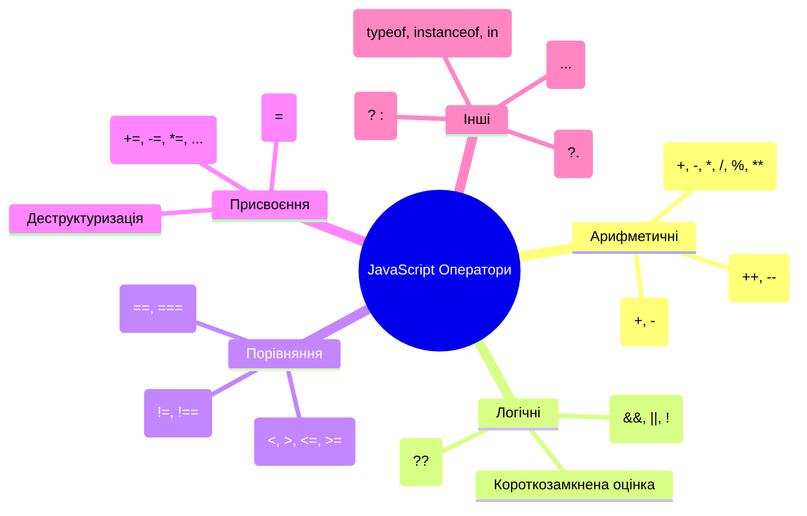

# JavaScript/TypeScript: Оператори

## Загальний огляд

Оператори в JavaScript/TypeScript — це символи, які виконують певні дії над операндами (значеннями). Вони є фундаментальними будівельними блоками будь-якого коду та дозволяють виконувати математичні обчислення, порівнювати значення, об'єднувати рядки, маніпулювати бітами та багато іншого.

```mermaid
graph TD
    A[Оператори в JavaScript] --> B[Арифметичні]
    A --> C[Логічні]
    A --> D[Порівняння]
    A --> E[Присвоєння]
    A --> F[Бітові]
    A --> G[Умовні]
    A --> H[Оператори типу]
    A --> I[Оператори роботи з об'єктами]

    B --> B1[+, -, *, /, %, **, ++, --]
    C --> C1[&&, ||, !, ??]
    D --> D1[==, ===, !=, !==, >, <, >=, <=]
    E --> E1[=, +=, -=, *=, /=, %=]
    F --> F1[&, |, ^, ~, <<, >>, >>>]
    G --> G1[? :, ?.]
    H --> H1[typeof, instanceof, in]
    I --> I1[., [], ...]
```

## 1. Арифметичні оператори

Арифметичні оператори виконують математичні операції над числовими операндами.

### Базові арифметичні оператори

| Оператор | Назва                 | Опис                           | Приклад        |
| -------- | --------------------- | ------------------------------ | -------------- |
| `+`      | Додавання             | Додає числа                    | `5 + 2 // 7`   |
| `-`      | Віднімання            | Віднімає числа                 | `5 - 2 // 3`   |
| `*`      | Множення              | Множить числа                  | `5 * 2 // 10`  |
| `/`      | Ділення               | Ділить числа                   | `5 / 2 // 2.5` |
| `%`      | Залишок від ділення   | Повертає залишок після ділення | `5 % 2 // 1`   |
| `**`     | Піднесення до степеня | Підносить до степеня (ES2016)  | `5 ** 2 // 25` |

### Інкремент і декремент

| Оператор | Назва     | Опис          | Приклад                    |
| -------- | --------- | ------------- | -------------------------- |
| `++`     | Інкремент | Збільшує на 1 | `let a = 5; a++; // a = 6` |
| `--`     | Декремент | Зменшує на 1  | `let a = 5; a--; // a = 4` |

Інкремент і декремент мають префіксну та постфіксну форми:

```javascript
let a = 5;
let b = a++; // b = 5, a = 6 (постфіксний: спочатку присвоєння, потім збільшення)
let c = 5;
let d = ++c; // d = 6, c = 6 (префіксний: спочатку збільшення, потім присвоєння)
```

### Унарні оператори

| Оператор | Назва         | Опис              | Приклад       |
| -------- | ------------- | ----------------- | ------------- |
| `+`      | Унарний плюс  | Конвертує в число | `+"42" // 42` |
| `-`      | Унарний мінус | Змінює знак числа | `-5 // -5`    |

### Особливості арифметичних операторів

#### Оператор + для рядків

Оператор `+` також використовується для конкатенації (об'єднання) рядків:

```javascript
"Hello" + " " + "World"; // "Hello World"

// Якщо один з операндів є рядком, інший буде автоматично перетворений у рядок
"The answer is " + 42; // "The answer is 42"
42 + " is the answer"; // "42 is the answer"

// Обережно з порядком операцій
1 + 2 + " items"; // "3 items" (спочатку додавання, потім конкатенація)
"items " + 1 + 2; // "items 12" (обидва числа перетворюються на рядки)
```

#### Числові перетворення

Більшість арифметичних операторів автоматично конвертують нечислові операнди в числа:

```javascript
5 - "2"; // 3 (рядок "2" перетворюється на число 2)
5 * "2"; // 10
5 / "2"; // 2.5
5 % "2"; // 1

// Але для оператора + це не завжди так (див. вище)
5 +
    "2" + // "52" (конкатенація рядків)
    // Унарний + ефективно конвертує в число
    "42" + // 42
    true + // 1
    false + // 0
    null + // 0
    undefined + // NaN
    "hello"; // NaN
```

#### Поведінка з особливими значеннями

```javascript
// Операції з Infinity
Infinity + 1; // Infinity
Infinity - Infinity; // NaN
Infinity * Infinity; // Infinity
Infinity / Infinity; // NaN
5 / 0; // Infinity

// Операції з NaN
NaN + 5; // NaN
NaN * 2; // NaN
NaN / 0; // NaN
```

### Підводні камені арифметичних операторів

1. **Проблеми з точністю чисел з плаваючою комою**:

```javascript
0.1 + 0.2; // 0.30000000000000004 (не точно 0.3)
0.1 + 0.2 === 0.3; // false

// Рішення: використовувати округлення або бібліотеки для роботи з десятковими числами
Math.round((0.1 + 0.2) * 10) / 10; // 0.3
Number((0.1 + 0.2).toFixed(1)); // 0.3
```

2. **Неочікувані результати з рядками**:

```javascript
// Нечислові значення перетворюються на NaN
"five" - 2; // NaN
"five" * 2; // NaN

// Але з оператором + рядки конкатенуються
"5" + 2; // "52" (не 7)

// Порядок операцій має значення
1 + 2 + "3"; // "33" (не "123")
```

3. **Бінарні бітові оператори завжди конвертують до 32-бітного цілого числа**:

```javascript
// Усі дробові частини відкидаються
5.7 |
    (0 - // 5
        5.7) |
    0; // -5
```

### Внутрішня реалізація в JavaScript рушіях

JavaScript рушії (наприклад, V8 у Chrome) оптимізують арифметичні операції кількома способами:

1. **Оптимізація для цілих чисел**: Малі цілі числа (SMI - Small Integer) обробляються спеціальним чином для швидкості.
2. **Інлайнінг операцій**: Часто використовувані операції можуть бути вбудовані компілятором.
3. **Специфічні інструкції процесора**: Для базових арифметичних операцій використовуються нативні інструкції CPU.

```javascript
// Приклад низькорівневої оптимізації
function addNumbers(a, b) {
    return a + b; // Може бути оптимізовано до однієї інструкції процесора
}
```

## 2. Логічні оператори

Логічні оператори використовуються для виконання логічних операцій та часто застосовуються в умовних виразах.

### Базові логічні оператори

| Оператор | Назва                                          | Опис                                                         | Приклад                          |
| -------- | ---------------------------------------------- | ------------------------------------------------------------ | -------------------------------- |
| `&&`     | Логічне І (AND)                                | Повертає `true`, якщо обидва операнди істинні                | `true && true // true`           |
| `\|\|`   | Логічне АБО (OR)                               | Повертає `true`, якщо хоча б один операнд істинний           | `true \|\| false // true`        |
| `!`      | Логічне НЕ (NOT)                               | Інвертує логічне значення                                    | `!true // false`                 |
| `??`     | Оператор нульового злиття (Nullish coalescing) | Повертає правий операнд, якщо лівий є `null` або `undefined` | `null ?? "default" // "default"` |

### Перетворення типів у логічних операціях

Перед виконанням логічної операції, JavaScript автоматично конвертує операнди в логічні значення:

```javascript
// Falsy значення (конвертуються у false):
// false, 0, -0, 0n, "", null, undefined, NaN

// Усі інші значення є truthy (конвертуються у true):
// "0", "false", [], {}, function(){}, тощо

// Приклади:
0 && "hello"; // 0 (falsy, тому повертає перший операнд)
1 && "hello"; // "hello" (обидва truthy, повертає останній)
0 || "hello"; // "hello" (перший falsy, повертає другий)
"world" || "hello"; // "world" (перший truthy, повертає перший)
!0; // true (0 є falsy, його заперечення — true)
!"hello"; // false ("hello" є truthy, його заперечення — false)
null ?? "default"; // "default" (null є nullish)
undefined ?? 0; // 0 (undefined є nullish)
false ?? "default"; // false (false не є nullish)
0 ?? "default"; // 0 (0 не є nullish)
```

### Короткозамкнена оцінка (Short-circuit evaluation)

Логічні оператори використовують короткозамкнену оцінку:

-   `&&`: Якщо перший операнд `false`, другий не оцінюється
-   `||`: Якщо перший операнд `true`, другий не оцінюється
-   `??`: Якщо перший операнд не `null` і не `undefined`, другий не оцінюється

```javascript
// Приклади короткого замикання
false && console.log("Не виконається"); // Другий операнд не оцінюється
true || console.log("Не виконається"); // Другий операнд не оцінюється
0 ?? console.log("Не виконається"); // Другий операнд не оцінюється (0 не nullish)

// Практичне використання короткозамкненої оцінки
function getUser() {
    console.log("getUser викликано");
    return null;
}

// Функція викликається лише один раз, незважаючи на два використання
const user = getUser() || { name: "Default" }; // Запасний варіант для falsy значень
const userNullish = getUser() ?? { name: "Default" }; // Запасний варіант лише для null/undefined
```

### Порядок пріоритету логічних операторів

1. `!` (найвищий пріоритет)
2. `&&`
3. `||`
4. `??` (найнижчий пріоритет)

```javascript
// Приклад порядку виконання
!true || (false && true); // ((!true) || (false && true)) -> (false || false) -> false

// Рекомендується використовувати дужки для ясності
!(true || false) && true; // false
```

### Оператор ?? (Nullish coalescing)

Оператор нульового злиття (`??`) введений у ES2020 і діє подібно до `||`, але перевіряє лише на `null` та `undefined`:

```javascript
// Різниця між || та ??
0 || "default"; // "default" (0 є falsy)
0 ?? "default"; // 0 (0 не є null або undefined)

"" || "default"; // "default" (порожній рядок є falsy)
"" ?? "default"; // "" (порожній рядок не є null або undefined)

null ?? "default"; // "default"
undefined ?? "default"; // "default"
```

> Важливо: `??` не можна безпосередньо комбінувати з `&&` або `||` без дужок, щоб уникнути неоднозначності.

```javascript
// Помилка синтаксису (необхідні дужки)
// a ?? b || c

// Правильно
(a ?? b) || c;
a ?? (b || c);
```

### Логічні присвоєння (ES2021)

ES2021 ввів логічні оператори присвоєння:

| Оператор | Назва                        | Еквівалент                                |
| -------- | ---------------------------- | ----------------------------------------- |
| `&&=`    | Логічне І з присвоєнням      | `x &&= y` еквівалентно `x && (x = y)`     |
| `\|\|=`  | Логічне АБО з присвоєнням    | `x \|\|= y` еквівалентно `x \|\| (x = y)` |
| `??=`    | Нульове злиття з присвоєнням | `x ??= y` еквівалентно `x ?? (x = y)`     |

```javascript
// Приклади
let a = true;
a &&= false; // a = false

let b = false;
b ||= true; // b = true

let c = null;
c ??= "default"; // c = "default"

let d = "value";
d ??= "default"; // d = "value" (не змінюється)
```

### Використання логічних операторів у TypeScript

TypeScript використовує ті ж логічні оператори, але може забезпечити кращу типізацію:

```typescript
// Типізація при коротких замиканнях
function process(value: string | null): string {
    // TypeScript розуміє, що після короткого замикання value не null
    return value || "default";
}

// Типізація з оператором ??
function getConfig(config: object | null | undefined): object {
    // TypeScript розуміє, що після ?? config не null/undefined
    return config ?? { default: true };
}

// Захисники типу (Type Guards) з логічними операторами
function processValue(value: string | number) {
    if (typeof value === "string" && value.length > 0) {
        // TypeScript знає, що тут value - це string
        return value.toUpperCase();
    } else if (typeof value === "number" && !isNaN(value)) {
        // TypeScript знає, що тут value - це number
        return value.toFixed(2);
    }
    return null;
}
```

### Підводні камені логічних операторів

1. **Неочікувані повернені значення**:

```javascript
// Логічні оператори повертають значення операндів, а не boolean
"hello" && "world"; // "world" (не true)
0 || {}; // {} (не true)

// Для отримання справжнього boolean використовуйте !!
!!"hello"; // true
!!0; // false
```

2. **Плутанина між `||` та `??`**:

```javascript
// || може замінити значення, які ви хотіли б зберегти
const count = 0;
const defaultCount = count || 10; // defaultCount = 10 (можливо, не те, що очікувалося)

// ?? краще для значень, де 0 або "" є валідними
const betterDefault = count ?? 10; // betterDefault = 0
```

3. **Проблеми з короткозамкненою логікою**:

```javascript
// Побічні ефекти можуть не виконатися через коротке замикання
function updateUI() {
    console.log("UI updated");
}
isVisible && updateUI(); // updateUI не викликається, якщо isVisible falsy

// Краще використовувати if для ясності, якщо очікуєте побічні ефекти
if (isVisible) {
    updateUI();
}
```

## 3. Оператори порівняння

Оператори порівняння порівнюють операнди та повертають логічне значення залежно від результату порівняння.

### Базові оператори порівняння

| Оператор | Назва               | Опис                                                   | Приклад              |
| -------- | ------------------- | ------------------------------------------------------ | -------------------- |
| `==`     | Нестрога рівність   | Перевіряє, чи рівні значення (з конвертацією типів)    | `5 == "5" // true`   |
| `===`    | Строга рівність     | Перевіряє, чи рівні значення та типи                   | `5 === "5" // false` |
| `!=`     | Нестрога нерівність | Перевіряє, чи не рівні значення (з конвертацією типів) | `5 != "6" // true`   |
| `!==`    | Строга нерівність   | Перевіряє, чи не рівні значення або типи               | `5 !== "5" // true`  |
| `>`      | Більше              | Перевіряє, чи лівий операнд більший за правий          | `5 > 3 // true`      |
| `<`      | Менше               | Перевіряє, чи лівий операнд менший за правий           | `5 < 3 // false`     |
| `>=`     | Більше або дорівнює | Перевіряє, чи лівий операнд більший або рівний правому | `5 >= 5 // true`     |
| `<=`     | Менше або дорівнює  | Перевіряє, чи лівий операнд менший або рівний правому  | `5 <= 4 // false`    |

### Нестрога рівність (==) vs. Строга рівність (===)

Основна відмінність полягає в тому, що `==` конвертує типи перед порівнянням, а `===` — ні:

```javascript
// Приклади нестрогої рівності (з перетворенням типів)
5 == "5"; // true (рядок "5" перетворюється на число 5)
0 == false; // true (false перетворюється на 0)
null == undefined; // true (спеціальне правило)
("" ==
    (0)[1]) == // true (порожній рядок перетворюється на 0)
    "1"; // true (складне перетворення)

// Приклади строгої рівності (без перетворення типів)
5 === "5"; // false (різні типи)
0 === false; // false (різні типи)
null === undefined; // false (різні типи)
("" ===
    (0)[1]) === // false (різні типи)
    "1"; // false (різні типи)
```

### Алгоритми порівняння

#### Нестрога рівність (==)

Алгоритм нестрогої рівності згідно зі специфікацією:

1. Якщо операнди мають однаковий тип, порівнюються як ===
2. Якщо null порівнюється з undefined, повертає true
3. Якщо один операнд є числом, а інший рядком, рядок перетворюється на число
4. Якщо один операнд є логічним, перетворюється на число (true → 1, false → 0)
5. Якщо один операнд є об'єктом, а інший примітивом, об'єкт перетворюється на примітив

```javascript
// Приклад кожного кроку алгоритму
"5" == "5"; // Крок 1: true (однакові типи)
null == undefined; // Крок 2: true (спеціальне правило)
"5" == 5; // Крок 3: true (рядок → число)
(true ==
    (1)[(1, 2)]) == // Крок 4: true (логічне → число)
    "1,2"; // Крок 5: true (об'єкт → примітив)
```

#### Порівняння об'єктів

При порівнянні об'єктів рівність означає посилання на один і той самий об'єкт:

```javascript
let obj1 = { a: 1 };
let obj2 = { a: 1 };
let obj3 = obj1;

obj1 == obj2; // false (різні об'єкти в пам'яті)
obj1 === obj2; // false (різні об'єкти в пам'яті)
obj1 == obj3; // true (посилання на один об'єкт)
obj1 === obj3; // true (посилання на один об'єкт)
```

#### Оператори порівняння (>, <, >=, <=)

Алгоритм порівняння значень:

1. Якщо обидва операнди є числами, порівнюються як числа
2. Якщо обидва операнди є рядками, порівнюються лексикографічно (по символах)
3. Якщо один операнд є числом, інший перетворюється на число

```javascript
// Числове порівняння
5 > 3; // true
5 > "3"; // true (рядок перетворюється на число)

// Лексикографічне порівняння рядків
"apple" < "banana"; // true
"apple" < "Apple"; // false (великі літери мають менший код)
"10" <
    "2"[// Порівняння з конвертацією // true (порівняння по символах, "1" < "2")
    10] >
    9; // true ([10] перетворюється на "10", потім на 10)
```

### Особливі випадки порівняння

```javascript
// NaN не дорівнює нічому, включаючи себе
NaN == NaN; // false
NaN === NaN; // false

// Найкращий спосіб перевірити NaN
isNaN(NaN); // true
Number.isNaN(NaN); // true (ES6, більш надійний)

// Порівняння з нулями
0 === -0; // true (вважаються рівними)
Object.is(0, -0); // false (ES6, більш точне порівняння)

// Інші специфічні випадки
null > 0; // false
null == 0; // false
null >= 0; // true (null конвертується в 0)

undefined > 0; // false
undefined < 0; // false
undefined == 0; // false
```

### Нові методи порівняння

ES6 ввів `Object.is()`, який працює подібно до `===`, але має кілька відмінностей:

```javascript
// Різниця між Object.is() та ===
Object.is(NaN, NaN); // true (тоді як NaN === NaN — false)
Object.is(0, -0); // false (тоді як 0 === -0 — true)
Object.is(5, 5); // true (аналогічно 5 === 5)
Object.is("5", 5); // false (аналогічно "5" === 5)
```

### Використання в TypeScript

TypeScript додає статичну перевірку типів при порівнянні:

```typescript
// TypeScript виявляє помилки порівняння несумісних типів
let value1: string = "hello";
let value2: number = 42;

// Помилка компіляції: Оператори '>' не можна застосувати до типів 'string' та 'number'
if (value1 > value2) {
    console.log("Більше");
}

// Використання захисників типу (type guards)
function compare(a: string | number, b: string | number): boolean {
    if (typeof a === "string" && typeof b === "string") {
        return a.localeCompare(b) > 0;
    } else if (typeof a === "number" && typeof b === "number") {
        return a > b;
    }
    return false;
}
```

### Підводні камені операторів порівняння

1. **Нестрога рівність може давати неочікувані результати**:

```javascript
// Дивні випадки нестрогої рівності
([] ==
    ""[0]) == // true
    false; // true
"0" == false; // true
"" == 0; // true
```

2. **Непослідовність при порівнянні null/undefined**:

```javascript
null == 0; // false
null >= 0; // true
null > 0; // false
```

3. **Проблеми з порівнянням рядків**:

```javascript
// Регістрозалежне порівняння
"apple" < "Apple"; // false, але може очікуватися true

// Порівняння з різними кодуваннями
"café" < "cafe"; // результат залежить від кодування

// Правильне порівняння з локалями
"apple".localeCompare("Apple", "en", { sensitivity: "base" }) < 0; // true
```

4. **Проблеми порівняння NaN**:

```javascript
NaN < 1; // false
NaN > 1; // false
NaN === NaN; // false

// Перевірка на NaN
Number.isNaN(value); // Найкращий спосіб
```

## 4. Оператори присвоєння

Оператори присвоєння призначають значення лівому операнду на основі значення правого операнду.

### Базові оператори присвоєння

| Оператор | Назва                                       | Еквівалентний вираз | Приклад     |
| -------- | ------------------------------------------- | ------------------- | ----------- |
| `=`      | Присвоєння                                  |                     | `x = 5`     |
| `+=`     | Додавання з присвоєнням                     | `x = x + y`         | `x += 5`    |
| `-=`     | Віднімання з присвоєнням                    | `x = x - y`         | `x -= 5`    |
| `*=`     | Множення з присвоєнням                      | `x = x * y`         | `x *= 5`    |
| `/=`     | Ділення з присвоєнням                       | `x = x / y`         | `x /= 5`    |
| `%=`     | Залишок від ділення з присвоєнням           | `x = x % y`         | `x %= 5`    |
| `**=`    | Піднесення до степеня з присвоєнням         | `x = x ** y`        | `x **= 2`   |
| `<<=`    | Бітовий зсув вліво з присвоєнням            | `x = x << y`        | `x <<= 2`   |
| `>>=`    | Бітовий зсув вправо з присвоєнням           | `x = x >> y`        | `x >>= 2`   |
| `>>>=`   | Бітовий зсув вправо без знаку з присвоєнням | `x = x >>> y`       | `x >>>= 2`  |
| `&=`     | Бітове І з присвоєнням                      | `x = x & y`         | `x &= 5`    |
| `^=`     | Бітове XOR з присвоєнням                    | `x = x ^ y`         | `x ^= 5`    |
| `\|=`    | Бітове АБО з присвоєнням                    | `x = x \| y`        | `x \|= 5`   |
| `&&=`    | Логічне І з присвоєнням (ES2021)            | `x && (x = y)`      | `x &&= y`   |
| `\|\|=`  | Логічне АБО з присвоєнням (ES2021)          | `x \|\| (x = y)`    | `x \|\|= y` |
| `??=`    | Нульове злиття з присвоєнням (ES2021)       | `x ?? (x = y)`      | `x ??= y`   |

### Особливості оператора присвоєння

Оператор присвоєння (`=`) має кілька важливих особливостей:

1. **Присвоєння повертає значення**:

```javascript
let a, b, c;
a = b = c = 5; // всім трьом змінним присвоюється 5 (справа наліво)

let x = (y = 5); // x = 5, y = 5
```

2. **Ланцюгове присвоєння**:

```javascript
// Присвоєння виконується справа наліво
let a, b, c;
a = b = c = 5; // спочатку c = 5, потім b = 5, потім a = 5
```

3. **Деструктуризуюче присвоєння**:

```javascript
// Деструктуризація масиву
let [a, b] = [1, 2]; // a = 1, b = 2

// Деструктуризація об'єкта
let { name, age } = { name: "John", age: 30 }; // name = "John", age = 30

// З присвоєнням значень за замовчуванням
let [a = 0, b = 0] = [1]; // a = 1, b = 0

// З перейменуванням
let { name: userName, age: userAge } = { name: "John", age: 30 }; // userName = "John", userAge = 30

// Вкладена деструктуризація
let {
    user: {
        name,
        address: { city },
    },
} = { user: { name: "John", address: { city: "New York" } } };
// name = "John", city = "New York"
```

4. **Присвоєння з залишковими елементами (rest)**:

```javascript
// Залишкові елементи масиву
let [first, ...rest] = [1, 2, 3, 4]; // first = 1, rest = [2, 3, 4]

// Залишкові властивості об'єкта (ES2018)
let { name, ...details } = { name: "John", age: 30, city: "New York" };
// name = "John", details = {age: 30, city: "New York"}
```

### Складені оператори присвоєння

Складені оператори присвоєння поєднують операцію з присвоєнням:

```javascript
// Арифметичні складені присвоєння
let num = 10;
num += 5; // num = 15 (num = num + 5)
num -= 3; // num = 12 (num = num - 3)
num *= 2; // num = 24 (num = num * 2)
num /= 3; // num = 8 (num = num / 3)
num %= 5; // num = 3 (num = num % 5)
num **= 2; // num = 9 (num = num ** 2)

// Бітові складені присвоєння
let bits = 5; // 101 в двійковій
bits &= 3; // bits = 1 (101 & 011 = 001)
bits |= 6; // bits = 7 (001 | 110 = 111)
bits ^= 2; // bits = 5 (111 ^ 010 = 101)
bits <<= 1; // bits = 10 (101 << 1 = 1010)
bits >>= 1; // bits = 5 (1010 >> 1 = 101)

// Логічні складені присвоєння (ES2021)
let a = true;
a &&= false; // a = false (виконується лише якщо a є truthy)

let b = false;
b ||= true; // b = true (виконується лише якщо b є falsy)

let c = null;
c ??= "default"; // c = "default" (виконується лише якщо c є null або undefined)
```

### Конвертація типів при присвоєнні

JavaScript автоматично конвертує типи при використанні складених операторів:

```javascript
let value = "5";
value += 3; // value = "53" (рядкова конкатенація)
value -= 1; // value = 52 (конвертація в число)

let bool = true;
bool += ""; // bool = "true" (конвертація в рядок)
bool -= 1; // bool = 0 (true конвертується в 1, потім 1 - 1 = 0)
```

### Присвоєння в TypeScript

TypeScript додає статичну перевірку типів при присвоєнні:

```typescript
// Явна типізація
let age: number = 30;
let name: string = "John";

// Помилки при несумісних типах
age = "thirty"; // Помилка: Тип 'string' не можна присвоїти типу 'number'
name = 30; // Помилка: Тип 'number' не можна присвоїти типу 'string'

// Складені присвоєння з типізацією
let count: number = 10;
count += 5; // OK
count += "5"; // Помилка: Оператор '+=' не може бути застосований до типів 'number' та 'string'

// Типізоване деструктуризуюче присвоєння
interface Person {
    name: string;
    age: number;
}

const person: Person = { name: "John", age: 30 };
const { name: userName, age: userAge }: { name: string; age: number } = person;

// Типізація з залишковими елементами
function process(...args: number[]): number {
    return args.reduce((sum, val) => sum + val, 0);
}
```

### Підводні камені операторів присвоєння

1. **Помилкове використання `=` замість `==` або `===` в умовах**:

```javascript
// Помилка: присвоєння замість порівняння
if ((x = 5)) {
    // Присвоює 5 до x, а потім перевіряє істинність (завжди true для ненульових чисел)
    console.log("Завжди виконається для ненульових значень");
}

// Правильно: порівняння
if (x === 5) {
    console.log("Виконається тільки якщо x дорівнює 5");
}
```

2. **Несподівана поведінка з непримітивними значеннями**:

```javascript
// Присвоєння об'єктів і масивів працює за посиланням
let obj1 = { a: 1 };
let obj2 = obj1; // obj2 посилається на той самий об'єкт
obj2.a = 2; // змінює obj1.a також

// Рішення: клонування об'єкта
let obj2 = { ...obj1 }; // Поверхневе клонування (ES6 spread)
let obj3 = JSON.parse(JSON.stringify(obj1)); // Глибоке клонування (з обмеженнями)
let obj4 = structuredClone(obj1); // Сучасне глибоке клонування (ES2022)
```

3. **Проблеми зі складеними операторами та типами**:

```javascript
let value = "5";
value += 5; // "55" (рядкова конкатенація)
value -= 5; // 50 (числове віднімання)

// Для уникнення неоднозначності, явно конвертуйте типи
let numValue = Number(value);
numValue += 5; // 10 (числове додавання)
```

4. **Неочікувана поведінка присвоєння з деструктуризацією**:

```javascript
// Пропущені властивості стають undefined
let { a, b } = { a: 1 }; // a = 1, b = undefined

// Помилки при доступі до вкладених властивостей, які не існують
let {
    user: { name },
} = { user: null }; // TypeError: Cannot read property 'name' of null

// Безпечніше використання з перевіркою
let user = data.user && data.user.name; // старий спосіб
let userName = data.user?.name; // сучасний спосіб з optional chaining
```

## 5. Інші важливі оператори

### Умовний (тернарний) оператор

Єдиний оператор в JavaScript, який приймає три операнди:

```javascript
// Синтаксис: умова ? вираз1 : вираз2
let status = age >= 18 ? "дорослий" : "неповнолітній";

// Вкладені тернарні оператори (можливо, але не рекомендується для читабельності)
let category = age < 13 ? "дитина" : age < 18 ? "підліток" : "дорослий";

// Краще використовувати дужки для ясності
let category = age < 13 ? "дитина" : age < 18 ? "підліток" : "дорослий";

// Або if/else для складних умов
let category;
if (age < 13) {
    category = "дитина";
} else if (age < 18) {
    category = "підліток";
} else {
    category = "дорослий";
}
```

### Оператор optional chaining (?.)

Введений у ES2020, дозволяє безпечно доступатися до вкладених властивостей об'єктів:

```javascript
// Без optional chaining
let userName = user && user.profile && user.profile.name;

// З optional chaining
let userName = user?.profile?.name;

// Працює також з методами
let result = obj?.method?.();

// І з елементами масиву
let firstItem = arr?.[0];
```

### Оператор розгортання (spread) і залишкові параметри (rest)

Оператор `...` має два різних використання:

```javascript
// Spread: розгортає елементи масиву або властивості об'єкта
let arr1 = [1, 2, 3];
let arr2 = [...arr1, 4, 5]; // [1, 2, 3, 4, 5]

let obj1 = { a: 1, b: 2 };
let obj2 = { ...obj1, c: 3 }; // {a: 1, b: 2, c: 3}

// Rest: збирає залишкові елементи в масив
function sum(...numbers) {
    return numbers.reduce((total, num) => total + num, 0);
}
sum(1, 2, 3, 4); // 10

// Rest у деструктуризації
let [first, ...others] = [1, 2, 3, 4]; // first = 1, others = [2, 3, 4]
let { name, ...details } = { name: "John", age: 30, city: "New York" };
// name = "John", details = {age: 30, city: "New York"}
```

### Оператори для роботи з типами

```javascript
// typeof повертає рядок, що представляє тип операнда
typeof 42; // "number"
typeof "hello"; // "string"
typeof true; // "boolean"
typeof undefined; // "undefined"
typeof null; // "object" (це помилка в дизайні мови)
typeof {}; // "object"
typeof []; // "object"
typeof function () {}; // "function"
typeof Symbol(); // "symbol"
typeof 42n; // "bigint"

// instanceof перевіряє, чи є об'єкт екземпляром певного класу
[] instanceof Array; // true
({}) instanceof Object; // true
/regex/ instanceof RegExp; // true

// in перевіряє, чи існує властивість в об'єкті
"length" in []; // true
"toString" in {}; // true
"nonexistent" in {}; // false
```

### Оператори для роботи з бітами

Бітові оператори працюють з 32-бітними цілими числами:

```javascript
// Бітові оператори
5 & 3; // 1 (101 & 011 = 001) - бітове І
5 | 3; // 7 (101 | 011 = 111) - бітове АБО
5 ^ 3; // 6 (101 ^ 011 = 110) - бітове виключне АБО
~5; // -6 (~00000101 = 11111010) - бітове НЕ
5 << 1; // 10 (101 << 1 = 1010) - зсув вліво
5 >> 1; // 2 (101 >> 1 = 10) - зсув вправо зі знаком
5 >>> 1; // 2 (101 >>> 1 = 10) - зсув вправо без знаку
```

## Пріоритет операторів

Пріоритет операторів визначає порядок, в якому виконуються операції в виразі. Оператори з вищим пріоритетом виконуються перед операторами з нижчим пріоритетом.

| Пріоритет     | Оператор                                                                                                                                                                     | Асоціативність |
| ------------- | ---------------------------------------------------------------------------------------------------------------------------------------------------------------------------- | -------------- |
| 19 (найвищий) | `()` (групування)                                                                                                                                                            | н/д            |
| 18            | `.` (доступ до властивості)<br>`[]` (доступ до елемента)<br>`()` (виклик функції)<br>`new` (з аргументами)                                                                   | зліва направо  |
| 17            | `new` (без аргументів)                                                                                                                                                       | зліва направо  |
| 16            | `++` (постфікс)<br>`--` (постфікс)                                                                                                                                           | н/д            |
| 15            | `!` (логічне НЕ)<br>`~` (бітове НЕ)<br>`+` (унарний плюс)<br>`-` (унарний мінус)<br>`++` (префікс)<br>`--` (префікс)<br>`typeof`<br>`void`<br>`delete`<br>`await`            | справа наліво  |
| 14            | `**` (піднесення до степеня)                                                                                                                                                 | справа наліво  |
| 13            | `*` (множення)<br>`/` (ділення)<br>`%` (залишок)                                                                                                                             | зліва направо  |
| 12            | `+` (додавання)<br>`-` (віднімання)                                                                                                                                          | зліва направо  |
| 11            | `<<` (зсув вліво)<br>`>>` (зсув вправо)<br>`>>>` (зсув вправо без знаку)                                                                                                     | зліва направо  |
| 10            | `<` (менше)<br>`<=` (менше або дорівнює)<br>`>` (більше)<br>`>=` (більше або дорівнює)<br>`in`<br>`instanceof`                                                               | зліва направо  |
| 9             | `==` (нестрога рівність)<br>`!=` (нестрога нерівність)<br>`===` (строга рівність)<br>`!==` (строга нерівність)                                                               | зліва направо  |
| 8             | `&` (бітове І)                                                                                                                                                               | зліва направо  |
| 7             | `^` (бітове виключне АБО)                                                                                                                                                    | зліва направо  |
| 6             | `\|` (бітове АБО)                                                                                                                                                            | зліва направо  |
| 5             | `&&` (логічне І)                                                                                                                                                             | зліва направо  |
| 4             | `\|\|` (логічне АБО)                                                                                                                                                         | зліва направо  |
| 3             | `??` (нульове злиття)                                                                                                                                                        | зліва направо  |
| 2             | `? :` (умовний)                                                                                                                                                              | справа наліво  |
| 1 (найнижчий) | `=` (присвоєння)<br>`+=` `-=` `*=` `/=` (складені присвоєння)<br>`<<=` `>>=` `>>>=` `&=` `^=` `\|=` (складені бітові присвоєння)<br>`&&=` `\|\|=` `??=` (логічні присвоєння) | справа наліво  |

```javascript
// Приклад виразу з різними пріоритетами
let result = 2 + 3 * 4; // 14, а не 20, бо множення має вищий пріоритет

// Використання дужок для зміни порядку операцій
let result = (2 + 3) * 4; // 20

// Складний вираз з різними операторами
let x = 5;
let y = 10;
let z = x++ + --y * 2 + x ** 2 <= 30 ? "малий" : "великий";
// x++ (постфікс) виконується після обчислення виразу, але повертає 5
// --y (префікс) виконується до обчислення виразу, повертає 9
// 5 + 9 * 2 + 6 ** 2 = 5 + 18 + 36 = 59
// 59 <= 30 ? "малий" : "великий" = "великий"
```

## Оператори в TypeScript

TypeScript розширює JavaScript додатковими операторами та покращує типізацію існуючих:

### Оператори, специфічні для TypeScript

```typescript
// Оператор as для приведення типів
let value: any = "hello";
let length: number = (value as string).length;

// Альтернативний синтаксис приведення типів
let length: number = (<string>value).length;

// Оператор перевірки типу дженерика is
function isString(value: any): value is string {
    return typeof value === "string";
}

// Оператор keyof для отримання ключів типу
interface Person {
    name: string;
    age: number;
}
type PersonKeys = keyof Person; // "name" | "age"

// Оператор typeof для типів
let person = { name: "John", age: 30 };
type PersonType = typeof person; // { name: string; age: number; }

// Оператор indexed access для доступу до типів властивостей
type AgeType = Person["age"]; // number

// Умовні типи з extends
type IsString<T> = T extends string ? true : false;
type Result1 = IsString<"hello">; // true
type Result2 = IsString<42>; // false

// Оператор infer для виведення типів
type ReturnType<T> = T extends (...args: any[]) => infer R ? R : any;
type StringArray = ReturnType<() => string[]>; // string[]

// Mapped types для трансформації типів
type Readonly<T> = { readonly [P in keyof T]: T[P] };
type ReadonlyPerson = Readonly<Person>; // { readonly name: string; readonly age: number; }

// Template literal types (TypeScript 4.1+)
type Greeting = `Hello, ${string}!`;
type EventName = `on${Capitalize<string>}`; // "onClick", "onMouseMove", etc.
```

### Покращена типізація для JavaScript операторів

```typescript
// Строга типізація для арифметичних операторів
function add(a: number, b: number): number {
    return a + b; // TypeScript забезпечує, що обидва операнди є числами
}

// Типізовані порівняння
function compare<T>(a: T, b: T): boolean {
    return a === b; // Порівнюються значення одного типу
}

// Типізовані тернарні оператори
function getMessage(success: boolean): string {
    return success ? "Operation succeeded" : "Operation failed";
}

// Типізація об'єднання типів
type Status = "loading" | "success" | "error";

function handleStatus(status: Status): void {
    if (status === "loading") {
        // TypeScript знає, що status точно "loading" тут
    } else if (status === "success") {
        // TypeScript знає, що status точно "success" тут
    } else {
        // TypeScript знає, що status точно "error" тут
    }
}
```

## Внутрішня реалізація операторів в JavaScript рушіях

JavaScript рушії, такі як V8 (Chrome, Node.js), SpiderMonkey (Firefox) та JavaScriptCore (Safari), оптимізують виконання операторів різними способами:

1. **JIT-компіляція (Just-In-Time)**:

    - Інтерпретує код при першому виконанні
    - Збирає профілюючу інформацію про типи
    - Компілює "гарячий" код у оптимізований машинний код

2. **Інлайнінг (Inlining)**:

    - Прості операції, такі як додавання чисел, можуть бути інлайнені в одну інструкцію процесора
    - Уникає накладних витрат на виклики функцій

3. **Спеціалізація типів**:

    - Створює різні версії операцій для різних типів (int, float, string)
    - Деоптимізує, якщо зустрічає несподіваний тип

4. **Оптимізація константних виразів**:
    - Вирази з константами обчислюються під час компіляції
    - Наприклад, `5 + 3` стає просто `8` в машинному коді

Розглянемо, як V8 може оптимізувати простий код:

```javascript
function add(a, b) {
    return a + b;
}

// Перший виклик з числами
add(1, 2);

// Потенційна внутрішня оптимізована версія для чисел
function add_number(a, b) {
    if (typeof a === "number" && typeof b === "number") {
        return a + b; // Пряма числова операція
    }
    // Деоптимізація для інших типів
    return add_generic(a, b);
}

// Оптимізація для конкретних значень
add(1, 2); // Може бути оптимізовано до просто "return 3"
```

## Висновки та рекомендації щодо використання операторів

### Загальні рекомендації

1. **Використовуйте строгу рівність (===) замість нестрогої (==)**:

    ```javascript
    // Добре
    if (value === null) {
        /* ... */
    }

    // Потенційно небезпечно
    if (value == null) {
        /* ... */
    }
    ```

2. **Додавайте дужки для ясності в складних виразах**:

    ```javascript
    // Без дужок - важко зрозуміти пріоритет
    let result = (a && b) || (c && d);

    // З дужками - чіткіше
    let result = (a && b) || (c && d);
    ```

3. **Використовуйте оператор `??` замість `||` для значень за замовчуванням**:

    ```javascript
    // Поганий спосіб (заміняє будь-які falsy значення)
    const count = value || 0; // Замінює 0, "", false, що може бути валідними значеннями

    // Хороший спосіб (заміняє лише null/undefined)
    const count = value ?? 0;
    ```

4. **Використовуйте оператор optional chaining (?.) для безпечного доступу**:

    ```javascript
    // Поганий спосіб
    const name = user && user.profile && user.profile.name;

    // Хороший спосіб
    const name = user?.profile?.name;
    ```

5. **Уникайте побічних ефектів у виразах з декількома операторами**:

    ```javascript
    // Заплутаний код з побічними ефектами
    let x = 5;
    let result = (x++, x * 2); // Використовує кому як оператор

    // Кращий підхід
    let x = 5;
    x++;
    let result = x * 2;
    ```

6. **Не покладайтеся на автоматичне перетворення типів в операторах**:

    ```javascript
    // Непередбачувана поведінка
    "5" + 3; // "53"
    "5" - 3; // 2

    // Явне перетворення - чіткіше
    Number("5") + 3; // 8
    ```

### Рекомендації для TypeScript

1. **Використовуйте строгу типізацію для запобігання помилок з операторами**:

    ```typescript
    // Включіть строгі опції в tsconfig.json
    // "strict": true,
    // "strictNullChecks": true,

    // Типізуйте параметри
    function add(a: number, b: number): number {
        return a + b;
    }
    ```

2. **Використовуйте захисники типу для безпечного перетворення**:

    ```typescript
    function processValue(value: string | number) {
        if (typeof value === "string") {
            // TypeScript знає, що тут value - string
            return value.toUpperCase();
        } else {
            // TypeScript знає, що тут value - number
            return value.toFixed(2);
        }
    }
    ```

3. **Використовуйте оператор `as const` для літералів**:

    ```typescript
    // Без as const
    const config = { env: "production", debug: false };
    // config має тип { env: string; debug: boolean; }

    // З as const
    const config = { env: "production", debug: false } as const;
    // config має тип { readonly env: "production"; readonly debug: false; }
    ```

4. **Використовуйте оператор non-null assertion (`!`) з обережністю**:
    ```typescript
    // Використовуйте лише коли ви впевнені, що значення не null/undefined
    function getLength(value: string | null) {
        // Поганий спосіб (пригнічує перевірку типів)
        return value!.length;

        // Кращий спосіб
        if (value === null) {
            throw new Error("Value cannot be null");
        }
        return value.length;
    }
    ```

## Підсумок

Оператори в JavaScript та TypeScript — це потужні інструменти, які дозволяють маніпулювати даними та керувати потоком виконання програми. Правильне використання операторів робить код більш читабельним, ефективним та надійним.



Розуміння нюансів кожного типу операторів, їх пріоритету та внутрішньої реалізації дозволяє писати більш ефективний та безпечний код. Особливо важливо враховувати підводні камені, пов'язані з неявним перетворенням типів та небажаними побічними ефектами, які можуть призвести до складних для виявлення помилок.
