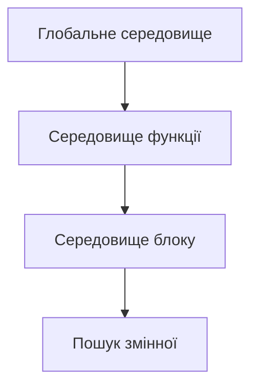
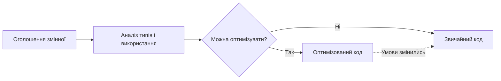

# JavaScript/TypeScript: Змінні

Змінні — це фундаментальний концепт у програмуванні, що дозволяє зберігати та маніпулювати даними в пам'яті. У JavaScript/TypeScript існує три способи оголошення змінних: `var`, `let` та `const`, кожен з яких має свої особливості та призначення.

## Загальний огляд

Змінні в JavaScript виконують такі функції:

-   Зберігають дані для подальшого використання
-   Дозволяють маніпулювати даними через операції
-   Передають інформацію між різними частинами програми
-   Зберігають стан програми під час її виконання

## Способи оголошення змінних

### var

`var` — це найстаріший спосіб оголошення змінних у JavaScript.

```javascript
var name = "John";
var age = 30;
var isActive = true;
```

**Особливості `var`:**

1. **Функціональна область видимості (function scope)**

    ```javascript
    function example() {
        var x = 10;
        if (true) {
            var x = 20; // та сама змінна
            console.log(x); // 20
        }
        console.log(x); // 20 (не 10!)
    }
    ```

2. **Підняття (hoisting)**

    ```javascript
    console.log(x); // undefined (не помилка!)
    var x = 5;
    // Інтерпретується як:
    // var x;
    // console.log(x);
    // x = 5;
    ```

3. **Може бути повторно оголошена**

    ```javascript
    var x = 5;
    var x = 10; // Дозволено, x = 10
    ```

4. **Глобальна видимість при оголошенні поза функціями**
    ```javascript
    var globalVar = "I'm global";
    // Стає властивістю глобального об'єкта (window у браузері)
    ```

### let

`let` був введений у ES6 (ES2015) і є рекомендованим способом оголошення змінних, значення яких може змінюватися.

```javascript
let name = "John";
let age = 30;
let isActive = true;
```

**Особливості `let`:**

1. **Блокова область видимості (block scope)**

    ```javascript
    function example() {
        let x = 10;
        if (true) {
            let x = 20; // нова змінна в блоці if
            console.log(x); // 20
        }
        console.log(x); // 10 (не змінилася)
    }
    ```

2. **Неможливість використання до оголошення (Temporal Dead Zone)**

    ```javascript
    console.log(x); // ReferenceError: x is not defined
    let x = 5;
    ```

3. **Неможливість повторного оголошення в тій самій області видимості**

    ```javascript
    let x = 5;
    let x = 10; // SyntaxError: Identifier 'x' has already been declared
    ```

4. **Не створює властивість глобального об'єкта**
    ```javascript
    let globalLet = "I'm not a property of window";
    console.log(window.globalLet); // undefined (у браузері)
    ```

### const

`const` також був введений у ES6 і використовується для оголошення констант — змінних, значення яких не може бути змінене після присвоєння.

```javascript
const PI = 3.14159;
const APP_NAME = "My Application";
const MAX_USERS = 100;
```

**Особливості `const`:**

1. **Блокова область видимості (як і `let`)**

    ```javascript
    if (true) {
        const x = 10;
        console.log(x); // 10
    }
    console.log(x); // ReferenceError: x is not defined
    ```

2. **Необхідність ініціалізації при оголошенні**

    ```javascript
    const x; // SyntaxError: Missing initializer in const declaration
    const y = 5; // Правильно
    ```

3. **Неможливість зміни значення примітивного типу**

    ```javascript
    const x = 5;
    x = 10; // TypeError: Assignment to constant variable
    ```

4. **Можливість модифікації об'єктів і масивів (але не перепризначення)**

    ```javascript
    const person = { name: "John" };
    person.name = "Jane"; // Дозволено (модифікуємо вміст)
    person = { name: "Mike" }; // TypeError: Assignment to constant variable

    const numbers = [1, 2, 3];
    numbers.push(4); // Дозволено [1, 2, 3, 4]
    numbers = [5, 6]; // TypeError: Assignment to constant variable
    ```

## Область видимості (Scope)

Область видимості визначає, де змінні доступні в коді. JavaScript має декілька типів областей видимості:

### 1. Глобальна область видимості (Global Scope)

Змінні, оголошені поза функціями або блоками, мають глобальну область видимості і доступні з будь-якої частини програми.

```javascript
// Глобальна змінна
var globalVar = "I'm global";
let globalLet = "I'm also global";
const GLOBAL_CONST = "I'm a global constant";

function exampleFunction() {
    console.log(globalVar); // Доступна
    console.log(globalLet); // Доступна
    console.log(GLOBAL_CONST); // Доступна
}
```

### 2. Функціональна область видимості (Function Scope)

Змінні, оголошені всередині функції, доступні лише всередині цієї функції.

```javascript
function exampleFunction() {
    var functionVar = "I'm function-scoped";
    let functionLet = "I'm also function-scoped";
    const FUNCTION_CONST = "I'm a function-scoped constant";

    console.log(functionVar); // Доступна
    console.log(functionLet); // Доступна
    console.log(FUNCTION_CONST); // Доступна
}

console.log(functionVar); // ReferenceError: functionVar is not defined
```

### 3. Блокова область видимості (Block Scope)

Змінні, оголошені з `let` і `const`, мають блокову область видимості, тобто вони доступні лише всередині блоку, в якому вони оголошені.

```javascript
if (true) {
    var blockVar = "I'm not actually block-scoped";
    let blockLet = "I'm block-scoped";
    const BLOCK_CONST = "I'm a block-scoped constant";
}

console.log(blockVar); // Доступна (var не має блокової області видимості)
console.log(blockLet); // ReferenceError: blockLet is not defined
console.log(BLOCK_CONST); // ReferenceError: BLOCK_CONST is not defined
```

### 4. Лексична область видимості та замикання (Lexical Scope & Closures)

JavaScript використовує лексичну область видимості, що означає, що функції мають доступ до змінних з їхнього зовнішнього середовища.

```javascript
function outer() {
    const outerVar = "I'm from outer function";

    function inner() {
        console.log(outerVar); // Доступна через замикання (closure)
    }

    return inner;
}

const innerFunction = outer();
innerFunction(); // Виведе: "I'm from outer function"
```

## Механізми роботи змінних

### Підняття (Hoisting)

JavaScript "піднімає" оголошення змінних (але не ініціалізацію) на початок їх області видимості під час компіляції коду.

```javascript
// Що пише програміст:
console.log(hoistedVar); // undefined
var hoistedVar = 5;

console.log(notHoistedLet); // ReferenceError
let notHoistedLet = 10;

// Як інтерпретує JavaScript (для var):
var hoistedVar; // Оголошення піднято
console.log(hoistedVar); // undefined
hoistedVar = 5; // Ініціалізація залишається на місці
```

### Temporal Dead Zone (TDZ) для let і const

Змінні, оголошені з `let` і `const`, технічно також "підняті", але вони не ініціалізуються до моменту оголошення, що створює "тимчасову мертву зону".

```javascript
// Змінна x існує тут, але знаходиться в TDZ
// console.log(x); // ReferenceError: Cannot access 'x' before initialization

let x = 5; // Закінчення TDZ для x

console.log(x); // 5
```

## Порівняння var, let і const

| Характеристика               | var                           | let            | const          |
| ---------------------------- | ----------------------------- | -------------- | -------------- |
| Область видимості            | Функціональна                 | Блокова        | Блокова        |
| Підняття                     | Так, зі значенням `undefined` | Так, але з TDZ | Так, але з TDZ |
| Повторне оголошення          | Дозволено                     | Помилка        | Помилка        |
| Переприсвоєння               | Дозволено                     | Дозволено      | Помилка        |
| Ініціалізація при оголошенні | Не обов'язкова                | Не обов'язкова | Обов'язкова    |
| Глобальна властивість        | Стає властивістю `window`     | Ні             | Ні             |

## Приклади використання

### Коли використовувати var

Сьогодні використання `var` вважається застарілим підходом. Однак його варто розуміти для підтримки старого коду.

```javascript
// Застарілий підхід
var counter = 0;
function incrementCounter() {
    var result = counter + 1;
    counter = result;
    return counter;
}
```

### Коли використовувати let

`let` ідеально підходить для змінних, значення яких буде змінюватися з часом.

```javascript
// Рекомендований підхід
let counter = 0;
function incrementCounter() {
    counter++;
    return counter;
}

// Цикли
for (let i = 0; i < 5; i++) {
    console.log(i);
}

// Обмеження області видимості
if (condition) {
    let result = performCalculation();
    console.log(result);
}
// result недоступна тут
```

### Коли використовувати const

`const` слід використовувати для значень, які не повинні змінюватися після ініціалізації.

```javascript
// Константи
const PI = 3.14159;
const API_URL = "https://api.example.com";

// Об'єкти конфігурації
const config = {
    theme: "dark",
    language: "uk",
    notifications: true,
};
config.theme = "light"; // Дозволено (змінюємо властивості)

// Масиви даних
const users = ["John", "Jane", "Bob"];
users.push("Alice"); // Дозволено (модифікуємо масив)
```

## Найкращі практики

1. **Уникайте `var`**

    - Використовуйте `let` і `const` замість `var` в сучасному коді

2. **Надавайте перевагу `const` перед `let`**

    - Використовуйте `const` для всіх змінних, які не будуть перепризначені
    - Це робить код більш передбачуваним і зменшує ймовірність помилок

3. **Використовуйте описові імена змінних**

    ```javascript
    // Погано
    const x = 42;

    // Добре
    const userAge = 42;
    ```

4. **Оголошуйте змінні на початку блоку**

    - Це робить код більш читабельним та допомагає уникнути проблем з TDZ

5. **Мінімізуйте область видимості змінних**
    - Оголошуйте змінні в найменшому можливому блоці, де вони потрібні

## Підкапотні механізми

### Як JavaScript зберігає змінні

Реалізація змінних у JavaScript рушіях (наприклад, V8 у Chrome або SpiderMonkey у Firefox) включає:

1. **Середовища виконання (Execution Environments)**

    - Для кожного контексту виконання (глобальний, функції, блоки) створюється середовище
    - Змінні зберігаються в цих середовищах

2. **Ланцюг областей видимості (Scope Chain)**
    - При доступі до змінної JS спочатку шукає її в поточному середовищі
    - Якщо не знайдено, пошук продовжується у зовнішніх середовищах



3. **Представлення в пам'яті**
    - Змінні з `var` зберігаються у VariableEnvironment
    - Змінні з `let` і `const` зберігаються у LexicalEnvironment
    - Рушії можуть оптимізувати зберігання та доступ до змінних різними способами

### Оптимізації рушіїв

JavaScript рушії застосовують різні оптимізації для ефективної роботи зі змінними:

1. **Inline Caching** - оптимізація доступу до властивостей об'єктів
2. **Hidden Classes** - оптимізація структури об'єктів для швидкого доступу
3. **Deoptimization** - відмова від оптимізацій у певних випадках



## Області застосування різних типів змінних

### var (в старому коді):

-   Історичні та legacy-додатки
-   Код, написаний до ES6
-   Випадки, де необхідна функціональна область видимості

### let:

-   Змінні, значення яких буде змінюватися
-   Лічильники в циклах
-   Тимчасові значення в обчисленнях
-   Стан, що змінюється

### const:

-   API URLs
-   Математичні константи
-   Конфігураційні об'єкти
-   Ін'єкції залежностей
-   Імпортовані модулі
-   Результати функцій, які не будуть змінені

## Поширені помилки та їх вирішення

### Проблема: Витік змінних (Variable Leakage)

```javascript
// Проблема
for (var i = 0; i < 5; i++) {
    // код
}
console.log(i); // 5 (змінна витекла за межі циклу)

// Вирішення
for (let j = 0; j < 5; j++) {
    // код
}
console.log(j); // ReferenceError (j недоступна)
```

### Проблема: Випадкова зміна константи

```javascript
// Проблема
let config = { theme: "dark" };
// Десь в іншому місці коду:
config = { theme: "light" }; // Перезапис всього об'єкта

// Вирішення
const config = { theme: "dark" };
// Тепер можна змінювати лише властивості:
config.theme = "light"; // OK
config = { theme: "blue" }; // TypeError
```

### Проблема: Асинхронні операції з циклами і var

```javascript
// Проблема
for (var i = 0; i < 5; i++) {
    setTimeout(() => console.log(i), 100); // Виведе: 5, 5, 5, 5, 5
}

// Вирішення
for (let i = 0; i < 5; i++) {
    setTimeout(() => console.log(i), 100); // Виведе: 0, 1, 2, 3, 4
}
```

## TypeScript і типи змінних

TypeScript розширює концепцію змінних, додаючи статичну типізацію:

```typescript
// Типізовані змінні
let name: string = "John";
const age: number = 30;
var isActive: boolean = true;

// Складніші типи
let numbers: number[] = [1, 2, 3];
const user: { name: string; age: number } = { name: "John", age: 30 };

// Type inference (виведення типів)
let inferred = "This is a string"; // TypeScript визначає як string
const inferredArray = [1, 2, 3]; // TypeScript визначає як number[]
```

TypeScript також додає поняття readonly для змінних, що дозволяє додатково захистити від модифікації:

```typescript
// Захист від зміни властивостей
interface User {
    readonly id: number;
    name: string;
}

const user: User = { id: 1, name: "John" };
user.name = "Jane"; // OK
user.id = 2; // Error: Cannot assign to 'id' because it is a read-only property

// Захист масиву від модифікації
const numbers: readonly number[] = [1, 2, 3];
numbers.push(4); // Error: Property 'push' does not exist on type 'readonly number[]'
```

## Висновки

1. **Сучасний JavaScript** рекомендує використовувати `const` за замовчуванням і `let` для змінних, значення яких буде змінюватися.

2. **Область видимості** є ключовим концептом, що впливає на структуру та безпеку коду.

3. **Розуміння механізмів підняття** допомагає уникнути поширених помилок.

4. **Правильний вибір типу змінної** залежить від конкретного випадку використання та вимог до коду.

5. **TypeScript** додає додатковий рівень безпеки через статичну типізацію змінних.

Знання особливостей різних типів змінних дозволяє писати більш безпечний, передбачуваний та оптимізований код.
