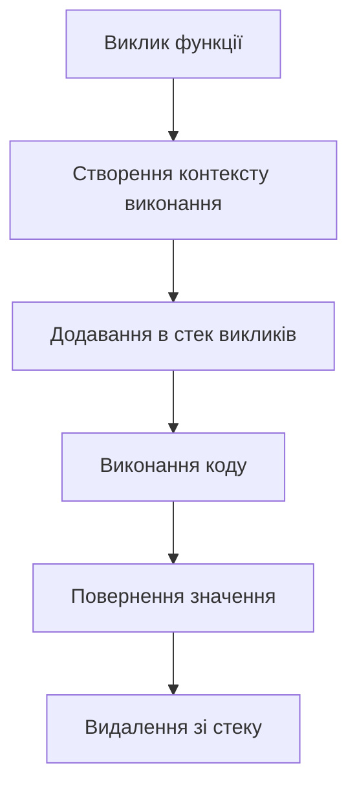

# JavaScript/TypeScript: Функції

Функції — це один з фундаментальних будівельних блоків JavaScript. Вони дозволяють інкапсулювати блоки коду, які можна викликати за потреби, передавати аргументи, повертати значення та багаторазово використовувати логіку.

## Загальний огляд

Функції в JavaScript виконують такі ролі:

-   Забезпечують повторне використання коду
-   Абстрагують логіку в зрозумілі блоки
-   Дозволяють створювати замикання і зберігати стан
-   Є об'єктами першого класу (можуть передаватися як значення)
-   Формують основу для об'єктно-орієнтованого та функціонального програмування

## Способи оголошення функцій

### Декларація функції (Function Declaration)

Декларація функції (або оголошення функції) — це найбільш традиційний спосіб створення функції в JavaScript.

```javascript
function sayHello(name) {
    return `Hello, ${name}!`;
}

// Виклик функції
console.log(sayHello("World")); // "Hello, World!"
```

**Особливості функцій-декларацій:**

1. **Підняття (hoisting)** — функції-декларації "піднімаються" під час компіляції, що дозволяє їх викликати до місця оголошення в коді:

```javascript
console.log(sum(5, 3)); // 8 — працює до оголошення функції

function sum(a, b) {
    return a + b;
}
```

2. **Іменовані функції** — мають ім'я, що спрощує налагодження та рекурсію:

```javascript
function factorial(n) {
    if (n <= 1) return 1;
    return n * factorial(n - 1); // Рекурсивний виклик
}
```

3. **Доступність в області видимості** — функції-декларації доступні в усій області видимості (функції або глобальній), де вони оголошені:

```javascript
if (true) {
    function conditionalFunc() {
        return "Inside condition";
    }
}
console.log(conditionalFunc()); // 'Inside condition' (але може поводитися по-різному в strict mode)
```

### Функціональний вираз (Function Expression)

Функціональний вираз — це функція, яка присвоюється змінній або константі, або передається як аргумент.

```javascript
const greet = function (name) {
    return `Hello, ${name}!`;
};

// Виклик функції
console.log(greet("World")); // "Hello, World!"
```

**Особливості функціональних виразів:**

1. **Не піднімаються повністю** — на відміну від функцій-декларацій:

```javascript
console.log(multiply(5, 3)); // Error: multiply is not a function

const multiply = function (a, b) {
    return a * b;
};
```

2. **Можуть бути анонімними або іменованими**:

```javascript
// Анонімний функціональний вираз
const log = function (message) {
    console.log(message);
};

// Іменований функціональний вираз
const factorial = function fact(n) {
    if (n <= 1) return 1;
    return n * fact(n - 1); // Ім'я 'fact' доступне лише всередині функції
};
```

3. **IIFE (Immediately Invoked Function Expression)** — функція, яка викликається відразу після створення:

```javascript
(function () {
    const privatVar = "I am private";
    console.log("IIFE executed");
})();

// або з параметрами:
(function (name) {
    console.log(`Hello, ${name}!`);
})("World");
```

4. **Функції вищого порядку** — функції, які приймають або повертають інші функції:

```javascript
function createMultiplier(factor) {
    return function (number) {
        return number * factor;
    };
}

const double = createMultiplier(2);
const triple = createMultiplier(3);

console.log(double(5)); // 10
console.log(triple(5)); // 15
```

### Стрілочні функції (Arrow Functions)

Стрілочні функції — це більш компактний синтаксис для створення функцій, введений у ES6 (ES2015).

```javascript
const greet = (name) => {
    return `Hello, ${name}!`;
};

// Скорочений синтаксис для функцій з одним виразом
const greetShort = (name) => `Hello, ${name}!`;

// Виклик функції
console.log(greetShort("World")); // "Hello, World!"
```

**Особливості стрілочних функцій:**

1. **Коротший синтаксис** — особливо для простих функцій:

```javascript
// Традиційний функціональний вираз
const numbers = [1, 2, 3, 4];
const doubled = numbers.map(function (n) {
    return n * 2;
});

// Стрілочна функція
const trippled = numbers.map((n) => n * 3);
```

2. **Неявне повернення** — якщо тіло функції складається з одного виразу:

```javascript
const sum = (a, b) => a + b; // Неявно повертає a + b
const getObject = () => ({ name: "John" }); // Для повернення об'єкта потрібні дужки
```

3. **Лексичний this** — стрілочні функції не мають власного `this` і використовують `this` з контексту, в якому вони були створені:

```javascript
function Person() {
    this.age = 0;

    // Стрілочна функція зберігає контекст `this` з моменту створення
    setInterval(() => {
        this.age++; // `this` вказує на об'єкт Person
        console.log(this.age);
    }, 1000);
}

const person = new Person();
```

4. **Обмеження** — стрілочні функції не можуть бути використані як конструктори, не мають `arguments` і не можуть змінити `this`:

```javascript
const ArrowFunc = () => {};
// const instance = new ArrowFunc(); // TypeError: ArrowFunc is not a constructor

function regularFunc() {
    console.log(arguments); // [1, 2, 3]
}

const arrowFunc = (...args) => {
    console.log(arguments); // undefined або посилання на аргументи зовнішньої функції
    console.log(args); // [1, 2, 3] — замість arguments використовуйте rest параметри
};

regularFunc(1, 2, 3);
```

## Параметри функцій

### Базові параметри

```javascript
function greet(firstName, lastName) {
    return `Hello, ${firstName} ${lastName}!`;
}

console.log(greet("John", "Doe")); // "Hello, John Doe!"
```

### Параметри за замовчуванням (ES6)

```javascript
function greet(name = "Guest", greeting = "Hello") {
    return `${greeting}, ${name}!`;
}

console.log(greet()); // "Hello, Guest!"
console.log(greet("John")); // "Hello, John!"
console.log(greet("John", "Hi")); // "Hi, John!"
```

### Rest параметри (ES6)

```javascript
function sum(...numbers) {
    return numbers.reduce((total, num) => total + num, 0);
}

console.log(sum(1, 2, 3, 4, 5)); // 15
```

### Деструктуризація параметрів (ES6)

```javascript
function displayPerson({ name, age, occupation = "Unknown" }) {
    console.log(`${name} is ${age} years old and works as ${occupation}`);
}

displayPerson({ name: "John", age: 30, occupation: "Developer" });
displayPerson({ name: "Jane", age: 25 }); // occupation буде "Unknown"
```

## Замикання (Closures)

Замикання — це комбінація функції та лексичного середовища, в якому ця функція була оголошена. Це дозволяє функції "запам'ятати" і мати доступ до змінних з зовнішньої області видимості, навіть після завершення виконання зовнішньої функції.

### Базове замикання

```javascript
function createCounter() {
    let count = 0; // Приватна змінна

    return function () {
        count++; // Доступ до змінної з зовнішньої області видимості
        return count;
    };
}

const counter = createCounter();
console.log(counter()); // 1
console.log(counter()); // 2
console.log(counter()); // 3
```

### Практичне застосування замикань

1. **Інкапсуляція даних** — створення приватних змінних:

```javascript
function createPerson(name) {
    // Приватні дані
    let age = 0;

    return {
        getName: function () {
            return name;
        },
        getAge: function () {
            return age;
        },
        setAge: function (newAge) {
            if (newAge >= 0) {
                age = newAge;
            }
        },
        celebrateBirthday: function () {
            age++;
            return `Happy Birthday, ${name}! You are now ${age} years old.`;
        },
    };
}

const john = createPerson("John");
console.log(john.getName()); // "John"
console.log(john.getAge()); // 0
john.setAge(30);
console.log(john.celebrateBirthday()); // "Happy Birthday, John! You are now 31 years old."
```

2. **Функціональні фабрики** — функції, що створюють інші функції з передналаштованими параметрами:

```javascript
function createGreeter(greeting) {
    return function (name) {
        return `${greeting}, ${name}!`;
    };
}

const sayHello = createGreeter("Hello");
const sayHi = createGreeter("Hi");
const sayGoodMorning = createGreeter("Good morning");

console.log(sayHello("John")); // "Hello, John!"
console.log(sayHi("Jane")); // "Hi, Jane!"
console.log(sayGoodMorning("Sam")); // "Good morning, Sam!"
```

3. **Збереження стану між викликами функції**:

```javascript
function createGame() {
    let score = 0;

    return {
        addPoint() {
            score++;
            return this;
        },
        removePoint() {
            score = Math.max(0, score - 1);
            return this;
        },
        getScore() {
            return score;
        },
    };
}

const game = createGame();
game.addPoint().addPoint().removePoint();
console.log(game.getScore()); // 1
```

### Підводні камені при роботі з замиканнями

1. **Замикання в циклах** — поширена помилка:

```javascript
// Проблема
function createFunctions() {
    var funcs = [];

    for (var i = 0; i < 3; i++) {
        funcs.push(function () {
            console.log(i);
        });
    }

    return funcs;
}

const functions = createFunctions();
functions[0](); // 3 (не 0!)
functions[1](); // 3 (не 1!)
functions[2](); // 3 (не 2!)

// Вирішення з IIFE
function createFunctionsFixed1() {
    var funcs = [];

    for (var i = 0; i < 3; i++) {
        funcs.push(
            (function (value) {
                return function () {
                    console.log(value);
                };
            })(i)
        );
    }

    return funcs;
}

// Вирішення з let (ES6)
function createFunctionsFixed2() {
    var funcs = [];

    for (let i = 0; i < 3; i++) {
        funcs.push(function () {
            console.log(i);
        });
    }

    return funcs;
}
```

2. **Управління пам'яттю** — замикання можуть викликати витоки пам'яті, якщо не використовуються належним чином:

```javascript
function potentialMemoryLeak() {
    const largeData = new Array(1000000).fill("data");

    return function () {
        // Якщо ця функція зберігається десь і рідко використовується,
        // вона триматиме largeData в пам'яті
        console.log(largeData.length);
    };
}

// Вирішення — очистити посилання, коли воно більше не потрібне
const leakyFunc = potentialMemoryLeak();
// ... використання ...
leakyFunc = null; // Дозволяє звільнити пам'ять
```

## Контекст `this` у функціях

`this` у JavaScript — це спеціальне ключове слово, яке посилається на об'єкт, у контексті якого виконується поточна функція. Розуміння `this` є ключовим для ефективного використання JavaScript.

### Правила визначення `this`

1. **Глобальний контекст** — у глобальному контексті `this` вказує на глобальний об'єкт:

```javascript
console.log(this); // глобальний об'єкт (window у браузері, global у Node.js)

function globalFunction() {
    console.log(this);
}

globalFunction(); // також глобальний об'єкт
```

2. **Метод об'єкта** — коли функція викликається як метод об'єкта, `this` вказує на цей об'єкт:

```javascript
const person = {
    name: "John",
    greet: function () {
        console.log(`Hello, my name is ${this.name}`);
    },
};

person.greet(); // "Hello, my name is John"
```

3. **Конструктор** — коли функція викликається з `new`, `this` вказує на новостворений об'єкт:

```javascript
function Person(name) {
    this.name = name;
    this.greet = function () {
        console.log(`Hello, my name is ${this.name}`);
    };
}

const john = new Person("John");
john.greet(); // "Hello, my name is John"
```

4. **Явне встановлення контексту** — за допомогою методів `call`, `apply` або `bind`:

```javascript
function greet() {
    console.log(`Hello, my name is ${this.name}`);
}

const person1 = { name: "John" };
const person2 = { name: "Jane" };

// call - виклик з новим контекстом і окремими аргументами
greet.call(person1); // "Hello, my name is John"

// apply - виклик з новим контекстом і аргументами у масиві
greet.apply(person2); // "Hello, my name is Jane"

// bind - створення нової функції з прив'язаним контекстом
const greetJohn = greet.bind(person1);
greetJohn(); // "Hello, my name is John"
```

5. **Стрілочні функції** — у стрілочних функціях `this` завжди визначається лексично (з контексту, де функція була створена):

```javascript
const person = {
    name: "John",
    // Регулярна функція
    greetRegular: function () {
        console.log(`Regular: Hello, my name is ${this.name}`);

        setTimeout(function () {
            // this тут вказує на глобальний об'єкт, а не на person
            console.log(`Regular timeout: Hello, my name is ${this.name}`);
        }, 100);
    },
    // Стрілочна функція
    greetArrow: function () {
        console.log(`Arrow: Hello, my name is ${this.name}`);

        setTimeout(() => {
            // this тут вказує на person через лексичний контекст
            console.log(`Arrow timeout: Hello, my name is ${this.name}`);
        }, 100);
    },
};

person.greetRegular();
// "Regular: Hello, my name is John"
// "Regular timeout: Hello, my name is undefined" (в браузері this = window)

person.greetArrow();
// "Arrow: Hello, my name is John"
// "Arrow timeout: Hello, my name is John"
```

### Втрата контексту і вирішення проблеми

```javascript
const person = {
    name: "John",
    greet: function () {
        console.log(`Hello, my name is ${this.name}`);
    },
};

// Працює нормально
person.greet(); // "Hello, my name is John"

// Втрата контексту
const greetFunction = person.greet;
greetFunction(); // "Hello, my name is undefined"

// Вирішення 1: використання bind
const boundGreet = person.greet.bind(person);
boundGreet(); // "Hello, my name is John"

// Вирішення 2: стрілочні функції та лексичний this
const person2 = {
    name: "Jane",
    greet: function () {
        const self = this; // Збереження контексту
        setTimeout(function () {
            console.log(`Hello, my name is ${self.name}`);
        }, 100);
    },
    greetArrow: function () {
        // Стрілочна функція "запам'ятовує" контекст
        setTimeout(() => {
            console.log(`Hello, my name is ${this.name}`);
        }, 100);
    },
};
```

## Інші типи функцій

### Генератори (ES6)

Генератори — це спеціальні функції, які можуть призупиняти своє виконання і пізніше продовжувати з того ж місця.

```javascript
function* countUp(max) {
    let count = 0;
    while (count < max) {
        yield count++;
    }
}

const counter = countUp(3);
console.log(counter.next().value); // 0
console.log(counter.next().value); // 1
console.log(counter.next().value); // 2
console.log(counter.next().value); // undefined
```

### Асинхронні функції (ES2017)

Асинхронні функції спрощують роботу з асинхронним кодом, використовуючи синтаксис `async/await`.

```javascript
async function fetchUserData(userId) {
    try {
        const response = await fetch(`https://api.example.com/users/${userId}`);
        const data = await response.json();
        return data;
    } catch (error) {
        console.error("Error fetching user data:", error);
        throw error;
    }
}

// Використання
fetchUserData(123)
    .then((data) => console.log(data))
    .catch((error) => console.error(error));
```

## Функції у TypeScript

TypeScript додає статичну типізацію для функцій, що підвищує надійність і читабельність коду.

### Типізовані функції

```typescript
// Типізація параметрів і повернення
function add(a: number, b: number): number {
    return a + b;
}

// Необов'язкові параметри
function greet(name: string, greeting?: string): string {
    return `${greeting || "Hello"}, ${name}!`;
}

// Параметри за замовчуванням
function createUser(name: string, role: string = "user"): object {
    return { name, role };
}

// Rest параметри
function sum(...numbers: number[]): number {
    return numbers.reduce((total, n) => total + n, 0);
}

// Функціональні типи
type MathOperation = (a: number, b: number) => number;

const add: MathOperation = (a, b) => a + b;
const subtract: MathOperation = (a, b) => a - b;

// Overloading (перевантаження)
function process(x: number): number;
function process(x: string): string;
function process(x: any): any {
    if (typeof x === "number") {
        return x * 2;
    }
    if (typeof x === "string") {
        return x.toUpperCase();
    }
}
```

### Generics для функцій

```typescript
// Загальна (generic) функція
function identity<T>(arg: T): T {
    return arg;
}

const numIdentity = identity<number>(42); // тип: number
const strIdentity = identity("hello"); // тип: string

// Узагальнені функції для масивів
function firstElement<T>(arr: T[]): T | undefined {
    return arr[0];
}

// Обмеження на тип
function longest<T extends { length: number }>(a: T, b: T): T {
    return a.length >= b.length ? a : b;
}

const longerArray = longest([1, 2], [1, 2, 3]); // [1, 2, 3]
const longerString = longest("alice", "bob"); // "alice"
```

## Підкапотні механізми та оптимізації

### Створення і виклик функцій

Коли JavaScript рушій зустрічає оголошення функції, відбувається наступне:

1. **Створення об'єкта функції** — функція в JavaScript є об'єктом з внутрішніми властивостями `[[Call]]`, `[[Construct]]` та ін.
2. **Створення лексичного середовища** — для зберігання змінних і аргументів функції
3. **Встановлення прототипу** — для функцій-конструкторів

При виклику функції:

1. **Створення контексту виконання** — включає `this`, змінні та аргументи
2. **Додавання контексту в стек викликів** (call stack)
3. **Виконання коду функції**
4. **Повернення значення**
5. **Видалення контексту зі стеку викликів**



### Оптимізації в сучасних рушіях JavaScript

1. **Inline Caching** — оптимізація доступу до властивостей

```javascript
function getFullName(person) {
    return person.firstName + " " + person.lastName;
}

// При багаторазовому виклику з об'єктами однакової структури,
// рушій оптимізує доступ до властивостей
```

2. **Function Inlining** — вбудовування простих функцій в місця виклику

```javascript
function add(a, b) {
    return a + b;
}

function calculate() {
    // Рушій може оптимізувати це до:
    // return 5 + 3 замість виклику add(5, 3)
    return add(5, 3);
}
```

3. **Deoptimization** — відмова від оптимізацій у випадку зміни контексту

```javascript
function example(x) {
    if (x < 10) {
        // Оптимізований шлях для чисел
        return x * 2;
    } else {
        // Якщо тут викликається з іншим типом, відбудеться деоптимізація
        return String(x);
    }
}
```

4. **Hidden Classes** — внутрішня оптимізація об'єктів

```javascript
// Ефективно для рушіїв JS
function Point(x, y) {
    this.x = x;
    this.y = y;
}

// Неефективно - створює різні "hidden classes"
function Point(x, y) {
    this.x = x;
    if (y !== undefined) {
        this.y = y;
    }
}
```

### Call Stack і Memory

Кожен виклик функції займає місце в стеку викликів:

```javascript
function a() {
    b();
}

function b() {
    c();
}

function c() {
    console.trace(); // Показує стек викликів
}

a();
// Stack: a -> b -> c
```

Обмеження стеку викликів (рекурсія):

```javascript
function recursiveFunction(n) {
    if (n === 0) return;
    recursiveFunction(n - 1);
}

recursiveFunction(10000); // RangeError: Maximum call stack size exceeded
```

## Патерни проектування з функціями

### Модульний патерн

```javascript
const counter = (function () {
    let count = 0;

    return {
        increment() {
            count++;
            return count;
        },
        decrement() {
            count--;
            return count;
        },
        getCount() {
            return count;
        },
    };
})();

console.log(counter.increment()); // 1
console.log(counter.increment()); // 2
console.log(counter.decrement()); // 1
```

### Memoization (кешування результатів)

```javascript
function memoize(fn) {
    const cache = {};

    return function (...args) {
        const key = JSON.stringify(args);

        if (cache[key]) {
            console.log("Повернення з кешу");
            return cache[key];
        }

        console.log("Обчислення результату");
        const result = fn.apply(this, args);
        cache[key] = result;
        return result;
    };
}

// Приклад: повільна функція обчислення факторіалу
function factorial(n) {
    if (n <= 1) return 1;
    return n * factorial(n - 1);
}

const memoizedFactorial = memoize(factorial);

console.log(memoizedFactorial(5)); // Обчислення результату: 120
console.log(memoizedFactorial(5)); // Повернення з кешу: 120
```

### Currying (каррінг)

```javascript
// Базова реалізація
function curry(fn) {
    return function curried(...args) {
        if (args.length >= fn.length) {
            return fn.apply(this, args);
        } else {
            return function (...args2) {
                return curried.apply(this, args.concat(args2));
            };
        }
    };
}

// Приклад
function sum(a, b, c) {
    return a + b + c;
}

const curriedSum = curry(sum);

console.log(curriedSum(1)(2)(3)); // 6
console.log(curriedSum(1, 2)(3)); // 6
console.log(curriedSum(1)(2, 3)); // 6
console.log(curriedSum(1, 2, 3)); // 6
```

### Композиція функцій

```javascript
// Базова композиція
const compose =
    (...fns) =>
    (x) =>
        fns.reduceRight((value, fn) => fn(value), x);

// Приклад
const double = (x) => x * 2;
const increment = (x) => x + 1;
const negate = (x) => -x;

const doubleThenIncrementThenNegate = compose(negate, increment, double);

console.log(doubleThenIncrementThenNegate(3)); // -(2*3+1) = -7
```

## Поширені помилки при роботі з функціями

### 1. Неправильне використання `this`

```javascript
const user = {
    name: "John",
    greet: function () {
        console.log(`Hello, ${this.name}`);
    },
};

// Проблема
const greet = user.greet;
greet(); // "Hello, undefined"

// Вирішення
const boundGreet = user.greet.bind(user);
boundGreet(); // "Hello, John"
```

### 2. Неочікувані замикання в циклах

```javascript
// Проблема
const funcs = [];
for (var i = 0; i < 3; i++) {
    funcs.push(function () {
        console.log(i);
    });
}
funcs.forEach((func) => func()); // 3, 3, 3

// Вирішення
const funcs2 = [];
for (let j = 0; j < 3; j++) {
    funcs2.push(function () {
        console.log(j);
    });
}
funcs2.forEach((func) => func()); // 0, 1, 2
```

### 3. Рекурсія без базового випадку

```javascript
// Проблема
function countDown(n) {
    console.log(n);
    countDown(n - 1); // Без базового випадку - призведе до переповнення стеку
}

// Вирішення
function countDownFixed(n) {
    console.log(n);
    if (n > 0) {
        countDownFixed(n - 1);
    }
}
```

### 4. Параметри vs. аргументи

```javascript
// Поширена плутанина
function example(a, b, c) {
    // a, b, c - це параметри
    console.log(arguments); // об'єкт arguments містить усі передані аргументи
}

example(1, 2, 3); // 1, 2, 3 - це аргументи
```

### 5. Помилки типів у TypeScript

```typescript
// Проблема
function processValue(value: string): number {
    return value.length;
}

// Типова помилка
const result = processValue(42); // Argument of type 'number' is not assignable to parameter of type 'string'

// Вирішення
function processValueFixed(value: string | number): number {
    if (typeof value === "string") {
        return value.length;
    }
    return String(value).length;
}
```

## Висновки

1. **JavaScript має різні способи створення функцій**, кожен з яких має свої особливості та використання:

    - Функції-декларації для загального використання
    - Функціональні вирази для змінних і callback-функцій
    - Стрілочні функції для коротких виразів і збереження контексту `this`

2. **Замикання є потужним механізмом** для інкапсуляції даних, створення приватних змінних та функціональних фабрик.

3. **Розуміння контексту `this`** є критичним для правильного використання функцій у різних контекстах.

4. **Сучасні JavaScript рушії** застосовують різні оптимізації для ефективного виконання функцій.

5. **TypeScript** додає статичну типізацію для функцій, що робить код більш надійним і читабельним.

Функції — це фундаментальний будівельний блок JavaScript, і глибоке розуміння їх особливостей дозволяє писати більш ефективний, чистий і зрозумілий код.
