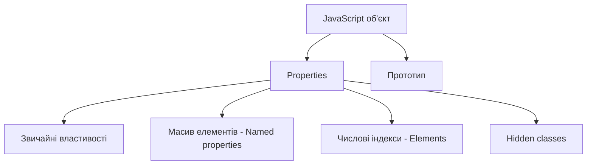
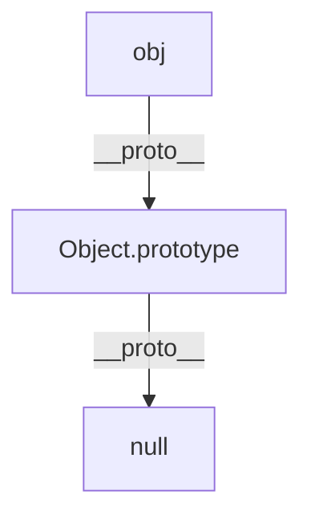

# JavaScript/TypeScript: Об'єкти

Об'єкти є одним з найфундаментальніших понять у JavaScript і TypeScript. Вони дозволяють зберігати та організовувати дані у вигляді колекцій пов'язаних властивостей і методів, що робить їх потужним інструментом для структурування коду та моделювання реального світу.

## Загальний огляд

Об'єкти в JavaScript — це набори пар "ключ-значення", де:

-   Ключі (імена властивостей) є рядками або символами
-   Значення можуть бути будь-якого типу, включаючи інші об'єкти та функції
-   Властивості можуть динамічно додаватися або видалятися під час виконання програми
-   Об'єкти передаються за посиланням, а не за значенням

## Створення об'єктів

У JavaScript існує кілька способів створення об'єктів, кожен із своїми особливостями та застосуванням.

### 1. Об'єктні літерали

Найпоширеніший спосіб створення об'єктів — використання об'єктних літералів (фігурних дужок).

```javascript
// Порожній об'єкт
const emptyObject = {};

// Об'єкт з властивостями
const person = {
    firstName: "John",
    lastName: "Doe",
    age: 30,
    isEmployed: true,
};

// Вкладені об'єкти
const employee = {
    name: "Jane Smith",
    department: {
        id: 101,
        name: "Engineering",
    },
    skills: ["JavaScript", "React", "Node.js"],
};
```

### 2. Конструктор Object()

Можна використовувати вбудований конструктор `Object()`.

```javascript
// Порожній об'єкт
const emptyObject = new Object();

// Додавання властивостей після створення
const person = new Object();
person.firstName = "John";
person.lastName = "Doe";
person.age = 30;
```

### 3. Функції-конструктори

Функції-конструктори дозволяють створювати об'єкти з визначеною структурою та поведінкою.

```javascript
function Person(firstName, lastName, age) {
    this.firstName = firstName;
    this.lastName = lastName;
    this.age = age;

    this.getFullName = function () {
        return `${this.firstName} ${this.lastName}`;
    };
}

const john = new Person("John", "Doe", 30);
const jane = new Person("Jane", "Smith", 25);

console.log(john.getFullName()); // "John Doe"
console.log(jane.getFullName()); // "Jane Smith"
```

### 4. Метод Object.create()

Цей метод створює новий об'єкт з вказаним прототипом і властивостями.

```javascript
// Об'єкт, який буде прототипом
const personProto = {
    greet: function () {
        return `Hello, my name is ${this.name}`;
    },
};

// Створення об'єкта з прототипом personProto
const john = Object.create(personProto);
john.name = "John";

console.log(john.greet()); // "Hello, my name is John"

// Створення об'єкта з прототипом та властивостями
const jane = Object.create(personProto, {
    name: {
        value: "Jane",
        writable: true,
        enumerable: true,
        configurable: true,
    },
    age: {
        value: 25,
        writable: true,
        enumerable: true,
        configurable: true,
    },
});

console.log(jane.greet()); // "Hello, my name is Jane"
console.log(jane.age); // 25
```

### 5. Класи (ES6)

З ES6 (ES2015) в JavaScript з'явилися класи, які є синтаксичним цукром над функціями-конструкторами.

```javascript
class Person {
    constructor(firstName, lastName, age) {
        this.firstName = firstName;
        this.lastName = lastName;
        this.age = age;
    }

    getFullName() {
        return `${this.firstName} ${this.lastName}`;
    }

    isAdult() {
        return this.age >= 18;
    }
}

const john = new Person("John", "Doe", 30);
console.log(john.getFullName()); // "John Doe"
console.log(john.isAdult()); // true
```

### 6. Factory функції (Фабричні функції)

Функції, які створюють і повертають об'єкти, часто використовуються як альтернатива конструкторам.

```javascript
function createPerson(firstName, lastName, age) {
    return {
        firstName,
        lastName,
        age,
        getFullName() {
            return `${firstName} ${lastName}`;
        },
        isAdult() {
            return age >= 18;
        },
    };
}

const john = createPerson("John", "Doe", 30);
console.log(john.getFullName()); // "John Doe"
console.log(john.isAdult()); // true
```

## Властивості об'єктів

Властивості — це пари "ключ-значення", що зберігаються в об'єкті.

### 1. Доступ до властивостей

```javascript
const person = {
    firstName: "John",
    lastName: "Doe",
    "full name": "John Doe", // Властивість з пробілом у назві
};

// Точкова нотація
console.log(person.firstName); // "John"

// Нотація з квадратними дужками
console.log(person["lastName"]); // "Doe"

// Необхідно використовувати квадратні дужки для властивостей з пробілами або спецсимволами
console.log(person["full name"]); // "John Doe"

// Використання змінної для доступу до властивості
const propertyName = "firstName";
console.log(person[propertyName]); // "John"
```

### 2. Додавання і зміна властивостей

```javascript
const person = {
    firstName: "John",
};

// Додавання нових властивостей
person.lastName = "Doe";
person["age"] = 30;

// Зміна існуючих властивостей
person.firstName = "Jane";

console.log(person); // { firstName: "Jane", lastName: "Doe", age: 30 }
```

### 3. Видалення властивостей

```javascript
const person = {
    firstName: "John",
    lastName: "Doe",
    age: 30,
    occupation: "Engineer",
};

// Видалення властивості
delete person.occupation;

console.log(person); // { firstName: "John", lastName: "Doe", age: 30 }
console.log(person.occupation); // undefined
```

### 4. Перевірка наявності властивості

```javascript
const person = {
    firstName: "John",
    lastName: "Doe",
    age: 30,
};

// Оператор in
console.log("firstName" in person); // true
console.log("occupation" in person); // false

// Метод hasOwnProperty() — перевіряє лише власні властивості (не з прототипу)
console.log(person.hasOwnProperty("firstName")); // true
console.log(person.hasOwnProperty("toString")); // false (метод з прототипу)

// Порівняння з undefined (не завжди надійно)
console.log(person.firstName !== undefined); // true
console.log(person.occupation !== undefined); // false
```

### 5. Обчислювані властивості (ES6)

```javascript
const propName = "dynamicProperty";
const value = 42;

// Обчислювана властивість в об'єктному літералі
const obj = {
    [propName]: value,
    [`computed_${propName}`]: value * 2,
};

console.log(obj.dynamicProperty); // 42
console.log(obj.computed_dynamicProperty); // 84
```

### 6. Скорочений запис властивостей (ES6)

```javascript
const name = "John";
const age = 30;

// Скорочений запис (замість name: name, age: age)
const person = { name, age };

console.log(person); // { name: "John", age: 30 }
```

### 7. Spread оператор для об'єктів (ES9/ES2018)

```javascript
const baseObject = { a: 1, b: 2 };
const extendedObject = { ...baseObject, c: 3 };

console.log(extendedObject); // { a: 1, b: 2, c: 3 }

// Перезапис властивостей
const overridenObject = { ...baseObject, a: 10 };

console.log(overridenObject); // { a: 10, b: 2 }

// Злиття об'єктів
const object1 = { a: 1, b: 2 };
const object2 = { b: 3, c: 4 };
const merged = { ...object1, ...object2 };

console.log(merged); // { a: 1, b: 3, c: 4 } (b перезаписано з object2)
```

### 8. Дескриптори властивостей

Кожна властивість об'єкта має дескриптор, який визначає її поведінку.

```javascript
const person = {
    firstName: "John",
};

// Отримання дескриптора властивості
const descriptor = Object.getOwnPropertyDescriptor(person, "firstName");
console.log(descriptor);
// {
//   value: "John",
//   writable: true,
//   enumerable: true,
//   configurable: true
// }

// Визначення властивості з дескриптором
Object.defineProperty(person, "lastName", {
    value: "Doe",
    writable: false, // Не можна змінити
    enumerable: true, // Видима при переборі
    configurable: false, // Не можна видалити або змінити дескриптор
});

// Спроба змінити властивість з writable: false
person.lastName = "Smith"; // Не спрацює у strict mode, або просто буде проігноровано
console.log(person.lastName); // "Doe"

// Визначення кількох властивостей одночасно
Object.defineProperties(person, {
    age: {
        value: 30,
        writable: true,
        enumerable: true,
        configurable: true,
    },
    occupation: {
        value: "Engineer",
        writable: true,
        enumerable: false, // Не буде видно при переборі
        configurable: true,
    },
});

// Перебір властивостей (occupation не буде виведено, бо enumerable: false)
for (const prop in person) {
    console.log(`${prop}: ${person[prop]}`);
}
// firstName: John
// lastName: Doe
// age: 30
```

### 9. Getter і Setter

Гетери і сетери дозволяють визначити спеціальну поведінку при отриманні та встановленні значень властивостей.

```javascript
const person = {
    firstName: "John",
    lastName: "Doe",

    // Getter
    get fullName() {
        return `${this.firstName} ${this.lastName}`;
    },

    // Setter
    set fullName(value) {
        const parts = value.split(" ");
        this.firstName = parts[0];
        this.lastName = parts[1];
    },

    // Приватна властивість (умовно)
    _age: 30,

    get age() {
        return this._age;
    },

    set age(value) {
        if (value < 0) {
            throw new Error("Age cannot be negative");
        }
        this._age = value;
    },
};

// Використання getter
console.log(person.fullName); // "John Doe"

// Використання setter
person.fullName = "Jane Smith";
console.log(person.firstName); // "Jane"
console.log(person.lastName); // "Smith"

// Валідація з setter
console.log(person.age); // 30
person.age = 35;
console.log(person.age); // 35
// person.age = -5; // Error: Age cannot be negative
```

### 10. Властивості-символи (ES6)

Символи можна використовувати як ключі властивостей для створення "напівприватних" властивостей або для уникнення конфліктів імен.

```javascript
// Створення символа
const idSymbol = Symbol("id");

const user = {
    name: "John",
    [idSymbol]: 123456, // Властивість з ключем-символом
};

console.log(user.name); // "John"
console.log(user[idSymbol]); // 123456

// Символьні властивості невидимі при звичайному переборі
for (const key in user) {
    console.log(key); // Виведе лише "name"
}

// Отримання символьних ключів
console.log(Object.getOwnPropertySymbols(user)); // [Symbol(id)]

// Вбудовані символи
const collection = {
    items: ["a", "b", "c"],

    // Визначення ітератора за допомогою Symbol.iterator
    [Symbol.iterator]: function* () {
        for (let item of this.items) {
            yield item;
        }
    },
};

// Тепер можна ітерувати по об'єкту
for (const item of collection) {
    console.log(item); // "a", "b", "c"
}
```

## Методи об'єктів

Методи — це функції, що зберігаються як властивості об'єктів.

### 1. Визначення методів

```javascript
// Традиційний спосіб
const person = {
    firstName: "John",
    lastName: "Doe",

    // Метод як властивість-функція
    getFullName: function () {
        return `${this.firstName} ${this.lastName}`;
    },

    // Скорочений синтаксис (ES6)
    greet() {
        return `Hello, my name is ${this.firstName}`;
    },
};

console.log(person.getFullName()); // "John Doe"
console.log(person.greet()); // "Hello, my name is John"
```

### 2. Контекст `this` у методах

```javascript
const person = {
    name: "John",

    sayName() {
        console.log(`My name is ${this.name}`);
    },
};

// Виклик як метод — this вказує на person
person.sayName(); // "My name is John"

// Виклик як звичайна функція — this буде undefined або window
const sayNameFunc = person.sayName;
// sayNameFunc(); // TypeError: Cannot read property 'name' of undefined (у strict mode)

// Рішення з bind
const boundSayName = person.sayName.bind(person);
boundSayName(); // "My name is John"

// Стрілочні функції як методи (не рекомендується)
const problematicPerson = {
    name: "Jane",

    // Стрілочна функція не має власного this
    arrowSayName: () => {
        console.log(`My name is ${this.name}`);
    },

    // Метод, що використовує стрілочну функцію всередині
    delayedSayName() {
        setTimeout(function () {
            console.log(`My name is ${this.name}`);
        }, 100); // this буде undefined або window

        setTimeout(() => {
            console.log(`My name is ${this.name}`);
        }, 200); // this вказує на problematicPerson
    },
};
```

### 3. Вбудовані методи Object

JavaScript надає низку статичних методів на конструкторі `Object`:

```javascript
// Створення об'єкта
const person = {
    firstName: "John",
    lastName: "Doe",
};

// Object.keys() — повертає масив ключів
const keys = Object.keys(person);
console.log(keys); // ["firstName", "lastName"]

// Object.values() — повертає масив значень
const values = Object.values(person);
console.log(values); // ["John", "Doe"]

// Object.entries() — повертає масив [ключ, значення]
const entries = Object.entries(person);
console.log(entries); // [["firstName", "John"], ["lastName", "Doe"]]

// Object.fromEntries() — створює об'єкт з масиву [ключ, значення]
const fromEntries = Object.fromEntries([
    ["name", "John"],
    ["age", 30],
]);
console.log(fromEntries); // { name: "John", age: 30 }

// Object.assign() — копіює властивості з одного об'єкта в інший
const target = { a: 1, b: 2 };
const source = { b: 3, c: 4 };
const result = Object.assign(target, source);
console.log(result); // { a: 1, b: 3, c: 4 }
console.log(target); // { a: 1, b: 3, c: 4 } (target змінюється)

// Object.freeze() — робить об'єкт незмінним
const frozen = { x: 1, y: 2 };
Object.freeze(frozen);
frozen.x = 10; // Не спрацює (в strict mode викине помилку)
frozen.z = 3; // Не спрацює (в strict mode викине помилку)
console.log(frozen); // { x: 1, y: 2 }
console.log(Object.isFrozen(frozen)); // true

// Object.seal() — забороняє додавання/видалення властивостей
const sealed = { a: 1, b: 2 };
Object.seal(sealed);
sealed.a = 10; // Дозволено змінювати існуючі властивості
sealed.c = 3; // Не спрацює (в strict mode викине помилку)
delete sealed.b; // Не спрацює (в strict mode викине помилку)
console.log(sealed); // { a: 10, b: 2 }
console.log(Object.isSealed(sealed)); // true

// Object.preventExtensions() — забороняє додавання нових властивостей
const nonExtensible = { a: 1, b: 2 };
Object.preventExtensions(nonExtensible);
nonExtensible.a = 10; // Дозволено змінювати існуючі властивості
nonExtensible.c = 3; // Не спрацює (в strict mode викине помилку)
delete nonExtensible.b; // Дозволено видаляти властивості
console.log(nonExtensible); // { a: 10 }
console.log(Object.isExtensible(nonExtensible)); // false
```

### 4. Прототипні методи

Методи, доступні всім об'єктам через прототипний ланцюжок:

```javascript
const person = {
    firstName: "John",
    lastName: "Doe",
};

// toString() - перетворює об'єкт на рядок
console.log(person.toString()); // "[object Object]"

// valueOf() - повертає примітивне значення об'єкта
console.log(person.valueOf()); // { firstName: "John", lastName: "Doe" }

// hasOwnProperty() - перевіряє, чи властивість є власною
console.log(person.hasOwnProperty("firstName")); // true
console.log(person.hasOwnProperty("toString")); // false

// propertyIsEnumerable() - перевіряє, чи властивість є перераховуваною
console.log(person.propertyIsEnumerable("firstName")); // true

// isPrototypeOf() - перевіряє, чи об'єкт є прототипом іншого об'єкта
const proto = { x: 1 };
const obj = Object.create(proto);
console.log(proto.isPrototypeOf(obj)); // true
```

### 5. Методи для роботи з прототипами

```javascript
// Object.getPrototypeOf() - повертає прототип об'єкта
const person = { name: "John" };
console.log(Object.getPrototypeOf(person) === Object.prototype); // true

// Object.setPrototypeOf() - встановлює прототип об'єкта
const animal = {
    isAnimal: true,
    eat() {
        console.log("Eating...");
    },
};

const dog = {
    bark() {
        console.log("Woof!");
    },
};

Object.setPrototypeOf(dog, animal);
console.log(dog.isAnimal); // true
dog.eat(); // "Eating..."
dog.bark(); // "Woof!"

// Object.create() - створює об'єкт з вказаним прототипом
const cat = Object.create(animal);
cat.meow = function () {
    console.log("Meow!");
};

cat.eat(); // "Eating..."
cat.meow(); // "Meow!"
console.log(cat.isAnimal); // true
```

## Деструктуризація об'єктів (ES6)

Деструктуризація дозволяє розпакувати властивості об'єкта в окремі змінні.

```javascript
const person = {
    firstName: "John",
    lastName: "Doe",
    age: 30,
    address: {
        city: "New York",
        country: "USA",
    },
};

// Базова деструктуризація
const { firstName, lastName } = person;
console.log(firstName); // "John"
console.log(lastName); // "Doe"

// Присвоєння новим іменам змінних
const { firstName: fName, lastName: lName } = person;
console.log(fName); // "John"
console.log(lName); // "Doe"

// Значення за замовчуванням
const { occupation = "Unknown" } = person;
console.log(occupation); // "Unknown"

// Вкладена деструктуризація
const {
    address: { city, country },
} = person;
console.log(city); // "New York"
console.log(country); // "USA"

// Залишкові властивості (rest)
const { firstName: name, ...rest } = person;
console.log(name); // "John"
console.log(rest); // { lastName: "Doe", age: 30, address: { city: "New York", country: "USA" } }

// Деструктуризація в параметрах функції
function printPerson({ firstName, lastName, age = 25 }) {
    console.log(`${firstName} ${lastName} is ${age} years old`);
}

printPerson(person); // "John Doe is 30 years old"
```

## Порівняння об'єктів

У JavaScript об'єкти порівнюються за посиланням, а не за значенням.

```javascript
const obj1 = { a: 1, b: 2 };
const obj2 = { a: 1, b: 2 };
const obj3 = obj1;

console.log(obj1 === obj2); // false (різні об'єкти, хоч і з однаковими властивостями)
console.log(obj1 === obj3); // true (одне й те саме посилання)

// Порівняння вмісту об'єктів
function areObjectsEqual(obj1, obj2) {
    // Перевірка на null або не об'єкти
    if (
        obj1 === null ||
        obj2 === null ||
        typeof obj1 !== "object" ||
        typeof obj2 !== "object"
    ) {
        return obj1 === obj2;
    }

    // Перевірка на однакову кількість властивостей
    const keys1 = Object.keys(obj1);
    const keys2 = Object.keys(obj2);

    if (keys1.length !== keys2.length) {
        return false;
    }

    // Перевірка кожної властивості
    for (const key of keys1) {
        if (!keys2.includes(key) || !areObjectsEqual(obj1[key], obj2[key])) {
            return false;
        }
    }

    return true;
}

console.log(areObjectsEqual(obj1, obj2)); // true
console.log(areObjectsEqual(obj1, { a: 1, b: 3 })); // false
console.log(areObjectsEqual({ a: 1, b: { c: 2 } }, { a: 1, b: { c: 2 } })); // true
```

## Об'єкти в TypeScript

TypeScript розширює можливості об'єктів у JavaScript за допомогою статичної типізації.

### 1. Типи об'єктів

```typescript
// Літеральний тип об'єкта
const person: { name: string; age: number } = {
    name: "John",
    age: 30,
};

// Використання type для створення типу об'єкта
type Person = {
    name: string;
    age: number;
    address?: string; // Необов'язкова властивість
    readonly id: number; // Властивість лише для читання
};

const john: Person = {
    name: "John",
    age: 30,
    id: 123,
};

// john.id = 456; // Помилка: Cannot assign to 'id' because it is a read-only property
```

### 2. Інтерфейси

```typescript
// Визначення інтерфейсу
interface User {
    name: string;
    age: number;
    greet(): string; // Метод
}

// Реалізація інтерфейсу
const user: User = {
    name: "John",
    age: 30,
    greet() {
        return `Hello, my name is ${this.name}`;
    },
};

// Розширення інтерфейсів
interface Employee extends User {
    department: string;
    salary: number;
}

const employee: Employee = {
    name: "Jane",
    age: 25,
    department: "IT",
    salary: 50000,
    greet() {
        return `Hi, I'm ${this.name} from ${this.department}`;
    },
};
```

### 3. Індексні типи

```typescript
// Індексний тип для об'єктів з динамічними ключами
interface Dictionary {
    [key: string]: string;
}

const colors: Dictionary = {
    red: "#FF0000",
    green: "#00FF00",
    blue: "#0000FF",
};

// Комбінований індексний тип
interface MixedDictionary {
    [key: string]: string | number;
    id: number; // Конкретна властивість
    name: string; // Конкретна властивість
}

const item: MixedDictionary = {
    id: 1,
    name: "Item",
    price: 29.99, // Додаткова числова властивість
    category: "Electronics", // Додаткова рядкова властивість
};
```

### 4. Utility типи для об'єктів

```typescript
interface User {
    id: number;
    name: string;
    email: string;
    address: {
        city: string;
        country: string;
    };
}

// Partial<T> - робить всі властивості необов'язковими
type PartialUser = Partial<User>;
// Еквівалент:
// {
//   id?: number;
//   name?: string;
//   email?: string;
//   address?: { city: string; country: string; };
// }

const partialUser: PartialUser = {
    name: "John",
}; // OK - інші властивості необов'язкові

// Readonly<T> - робить всі властивості лише для читання
type ReadonlyUser = Readonly<User>;
const readonlyUser: ReadonlyUser = {
    id: 1,
    name: "John",
    email: "john@example.com",
    address: { city: "New York", country: "USA" },
};
// readonlyUser.name = "Jane"; // Error: Cannot assign to 'name' because it is a read-only property

// Pick<T, K> - вибирає підмножину властивостей
type UserBasicInfo = Pick<User, "id" | "name">;
// Еквівалент: { id: number; name: string; }

// Omit<T, K> - видаляє вказані властивості
type UserWithoutContact = Omit<User, "email" | "address">;
// Еквівалент: { id: number; name: string; }

// Record<K, T> - створює тип з ключів K і значень T
type UserRoles = Record<string, boolean>;
const roles: UserRoles = {
    admin: true,
    editor: false,
    viewer: true,
};
```

## Підкапотні механізми роботи з об'єктами

### 1. Представлення об'єктів у пам'яті

В JavaScript рушіях об'єкти представлені як складні структури даних:



1. **Hidden Classes** — V8 та інші рушії використовують приховані класи для оптимізації доступу до властивостей
2. **Оптимізація числових індексів** — елементи з числовими індексами зберігаються окремо для швидшого доступу
3. **Властивості-дескриптори** — кожна властивість має свій дескриптор з метаданими

### 2. Оптимізація об'єктів у рушіях

1. **Уникайте зміни структури об'єктів після створення**

```javascript
// Неоптимально - змінює структуру об'єкта
function createPersonSlow(name, age) {
    const person = {};
    person.name = name;
    person.age = age;
    return person;
}

// Оптимально - створює об'єкт з однаковою структурою
function createPersonFast(name, age) {
    return {
        name: name,
        age: age,
    };
}
```

2. **Ініціалізуйте всі властивості в конструкторі**

```javascript
// Неоптимально
function PersonSlow(name) {
    this.name = name;
    if (name === "John") {
        this.specialFlag = true;
    }
}

// Оптимально
function PersonFast(name) {
    this.name = name;
    this.specialFlag = name === "John";
}
```

3. **Використовуйте однакову послідовність властивостей**

```javascript
// Різні hidden classes
const user1 = { name: "John", age: 30 };
const user2 = { age: 25, name: "Jane" };

// Однакові hidden classes
const user3 = { name: "John", age: 30 };
const user4 = { name: "Jane", age: 25 };
```

### 3. Прототипний ланцюжок

Прототипи — це механізм, за допомогою якого об'єкти в JavaScript можуть наслідувати властивості один від одного.



```javascript
// Створення об'єктів з прототипами
function Animal(name) {
    this.name = name;
}

Animal.prototype.eat = function () {
    console.log(`${this.name} is eating`);
};

function Dog(name, breed) {
    Animal.call(this, name);
    this.breed = breed;
}

// Встановлення прототипного ланцюжка
Dog.prototype = Object.create(Animal.prototype);
Dog.prototype.constructor = Dog;

// Додавання методів до Dog.prototype
Dog.prototype.bark = function () {
    console.log("Woof!");
};

// Використання
const rex = new Dog("Rex", "German Shepherd");
rex.eat(); // "Rex is eating" (метод з Animal.prototype)
rex.bark(); // "Woof!" (метод з Dog.prototype)
```

Коли ви звертаєтесь до властивості об'єкта, JavaScript:

1. Перевіряє, чи є ця властивість у самому об'єкті
2. Якщо ні, шукає в його прототипі
3. Якщо не знайдено, шукає в прототипі прототипу
4. І так далі до кінця ланцюжка (Object.prototype → null)

### 4. Перевантаження операторів для об'єктів

JavaScript має обмежену підтримку перевантаження операторів для об'єктів.

```javascript
// Неявне приведення об'єктів до примітивів
const obj = {
    // Викликається при неявному приведенні до рядка
    toString() {
        return "Custom object representation";
    },

    // Викликається при неявному приведенні до числа
    valueOf() {
        return 42;
    },

    // Метод Symbol.toPrimitive має пріоритет над toString і valueOf
    [Symbol.toPrimitive](hint) {
        if (hint === "string") {
            return "Custom string representation";
        } else if (hint === "number") {
            return 123;
        } else {
            // hint === 'default'
            return "Default representation";
        }
    },
};

console.log(String(obj)); // "Custom string representation"
console.log(Number(obj)); // 123
console.log(obj + ""); // "Default representation"
```

## Поширені патерни роботи з об'єктами

### 1. Об'єкт конфігурації (Options Object)

```javascript
// Замість багатьох параметрів
function createUser(options) {
    const defaults = {
        name: "Guest",
        age: null,
        isAdmin: false,
        notifications: true,
    };

    // Злиття опцій за замовчуванням з переданими
    const config = { ...defaults, ...options };

    return {
        name: config.name,
        age: config.age,
        role: config.isAdmin ? "admin" : "user",
        settings: {
            notifications: config.notifications,
        },
    };
}

const user = createUser({
    name: "John",
    isAdmin: true,
});
```

### 2. Модульний патерн (Module Pattern)

```javascript
// Приватні дані з замиканням
const userModule = (function () {
    // Приватні дані
    const privateData = {
        count: 0,
        secretKey: "abc123",
    };

    // Приватна функція
    function incrementCount() {
        privateData.count++;
    }

    // Публічний API
    return {
        addUser(name) {
            incrementCount();
            console.log(`User ${name} added`);
            return privateData.count;
        },
        getUserCount() {
            return privateData.count;
        },
    };
})();

userModule.addUser("John"); // "User John added"
console.log(userModule.getUserCount()); // 1
// console.log(userModule.privateData); // undefined
// userModule.incrementCount(); // Error
```

### 3. Фабричний патерн (Factory Pattern)

```javascript
// Фабрика для створення об'єктів
function createShape(type) {
    const commonProperties = {
        color: "black",
        setColor(color) {
            this.color = color;
            return this;
        },
    };

    if (type === "circle") {
        return {
            ...commonProperties,
            radius: 1,
            area() {
                return Math.PI * this.radius * this.radius;
            },
            setRadius(radius) {
                this.radius = radius;
                return this;
            },
        };
    } else if (type === "rectangle") {
        return {
            ...commonProperties,
            width: 1,
            height: 1,
            area() {
                return this.width * this.height;
            },
            setDimensions(width, height) {
                this.width = width;
                this.height = height;
                return this;
            },
        };
    }
}

const circle = createShape("circle").setColor("red").setRadius(5);

const rectangle = createShape("rectangle")
    .setColor("blue")
    .setDimensions(10, 5);

console.log(circle.area()); // 78.54
console.log(rectangle.area()); // 50
```

### 4. Об'єкти як мапи (Object as Maps)

```javascript
// Використання об'єктів як мап (хеш-таблиць)
function countWords(text) {
    const words = text.toLowerCase().match(/\w+/g) || [];
    const counts = {};

    for (const word of words) {
        counts[word] = (counts[word] || 0) + 1;
    }

    return counts;
}

const text = "JavaScript is amazing. JavaScript is fun.";
const wordCounts = countWords(text);
console.log(wordCounts);
// { javascript: 2, is: 2, amazing: 1, fun: 1 }

// З ES6 краще використовувати Map для складних ключів
const userCache = new Map();
const userObj = { id: 1, name: "John" };

userCache.set(userObj, { lastLogin: new Date() });
console.log(userCache.get(userObj)); // { lastLogin: Date }
```

## Поширені помилки та їх вирішення

### 1. Мутація об'єктів

```javascript
// Проблема
function processConfig(config) {
    config.processed = true;
    return config;
}

const originalConfig = { name: "Config", value: 42 };
const processedConfig = processConfig(originalConfig);

console.log(originalConfig); // { name: "Config", value: 42, processed: true }
// Оригінальний об'єкт також змінився!

// Вирішення: клонування об'єкта
function processConfigFixed(config) {
    const copy = { ...config };
    copy.processed = true;
    return copy;
}

const originalConfig2 = { name: "Config", value: 42 };
const processedConfig2 = processConfigFixed(originalConfig2);

console.log(originalConfig2); // { name: "Config", value: 42 }
console.log(processedConfig2); // { name: "Config", value: 42, processed: true }
```

### 2. Глибоке клонування

```javascript
// Проблема - spread оператор робить лише поверхневе клонування
const original = {
    name: "John",
    details: {
        age: 30,
        address: { city: "New York" },
    },
};

const shallowCopy = { ...original };
shallowCopy.details.age = 31;

console.log(original.details.age); // 31 - оригінал змінився!

// Вирішення 1: структурне клонування з використанням JSON
function deepCloneJSON(obj) {
    return JSON.parse(JSON.stringify(obj));
}

// Вирішення 2: рекурсивне клонування
function deepClone(obj) {
    if (obj === null || typeof obj !== "object") {
        return obj;
    }

    const copy = Array.isArray(obj) ? [] : {};

    for (const key in obj) {
        if (Object.prototype.hasOwnProperty.call(obj, key)) {
            copy[key] = deepClone(obj[key]);
        }
    }

    return copy;
}

const deepCopy = deepClone(original);
deepCopy.details.age = 32;

console.log(original.details.age); // 31 - оригінал не змінився
```

### 3. Перевірка властивостей

```javascript
// Проблема
function displayUserInfo(user) {
    const name = user.name;
    const age = user.age;
    console.log(`${name} is ${age} years old`);
}

displayUserInfo({ name: "John" }); // "John is undefined years old"

// Вирішення 1: перевірка властивостей
function displayUserInfoFixed(user) {
    const name = user.name || "Unknown";
    const age = user.age !== undefined ? user.age : "unknown";
    console.log(`${name} is ${age} years old`);
}

// Вирішення 2: деструктуризація з значеннями за замовчуванням
function displayUserInfoDestructured(user) {
    const { name = "Unknown", age = "unknown" } = user || {};
    console.log(`${name} is ${age} years old`);
}

// Вирішення 3: оператор optional chaining (ES2020)
function displayUserInfoOptional(user) {
    const name = user?.name || "Unknown";
    const age = user?.age ?? "unknown";
    console.log(`${name} is ${age} years old`);
}
```

### 4. Втрата контексту `this`

```javascript
// Проблема
const user = {
    name: "John",
    greet() {
        console.log(`Hello, my name is ${this.name}`);
    },
    delayedGreet() {
        setTimeout(function () {
            console.log(`Hello, my name is ${this.name}`);
        }, 100);
    },
};

user.delayedGreet(); // "Hello, my name is undefined"

// Вирішення 1: збереження контексту в змінну
const userFixed1 = {
    name: "John",
    delayedGreet() {
        const self = this;
        setTimeout(function () {
            console.log(`Hello, my name is ${self.name}`);
        }, 100);
    },
};

// Вирішення 2: bind
const userFixed2 = {
    name: "John",
    delayedGreet() {
        setTimeout(
            function () {
                console.log(`Hello, my name is ${this.name}`);
            }.bind(this),
            100
        );
    },
};

// Вирішення 3: стрілочна функція
const userFixed3 = {
    name: "John",
    delayedGreet() {
        setTimeout(() => {
            console.log(`Hello, my name is ${this.name}`);
        }, 100);
    },
};
```

## Сучасні можливості роботи з об'єктами (ES2020+)

### 1. Optional Chaining (?.)

```javascript
const user = {
    name: "John",
    details: {
        age: 30,
    },
};

// Без optional chaining
const cityOld =
    user.details && user.details.address && user.details.address.city;

// З optional chaining
const city = user.details?.address?.city;
console.log(city); // undefined (без помилки)

// Виклик методів з optional chaining
const greet = user.greet?.(); // undefined (без помилки)

// З масивами
const firstItem = user.items?.[0]; // undefined (без помилки)
```

### 2. Nullish Coalescing (??)

```javascript
const user = {
    name: "John",
    age: 0,
    score: null,
};

// Проблема з оператором ||
const ageOld = user.age || 18; // 18 (бо 0 вважається falsy)

// З оператором ??
const age = user.age ?? 18; // 0 (бо 0 не є null або undefined)
const score = user.score ?? 100; // 100 (бо score є null)
```

### 3. Логічне присвоєння (ES2021)

```javascript
let user = {
    name: "John",
};

// OR присвоєння (||=)
user.name ||= "Guest"; // name залишиться "John", бо це truthy
user.role ||= "User"; // додасть role: "User", бо user.role це undefined

// AND присвоєння (&&=)
user.name &&= user.name.toUpperCase(); // змінить name на "JOHN"
user.age &&= 30; // нічого не зробить, бо user.age це undefined

// Nullish присвоєння (??=)
user.age ??= 30; // додасть age: 30, бо user.age це undefined
user.name ??= "Guest"; // name залишиться "JOHN", бо це не null/undefined
```

## Висновки

1. **Об'єкти є фундаментом** JavaScript, дозволяючи створювати складні структури даних та моделювати реальні сутності.

2. **Існує багато способів створення об'єктів**, кожен з яких має свої переваги в різних ситуаціях:

    - Об'єктні літерали для простих об'єктів
    - Конструктори для об'єктів з однаковою структурою
    - Класи для об'єктно-орієнтованого підходу
    - Фабричні функції для гнучкого створення об'єктів

3. **Прототипи забезпечують механізм успадкування** в JavaScript, дозволяючи об'єктам успадковувати властивості та методи.

4. **Методи об'єктів є потужним інструментом** для роботи з даними та забезпечення інкапсуляції функціональності.

5. **Сучасний JavaScript надає багато вбудованих можливостей** для ефективної роботи з об'єктами, від поширення властивостей до optional chaining.

6. **TypeScript розширює типізацію об'єктів**, забезпечуючи більше безпеки та зручності розробки.

7. **Розуміння підкапотних механізмів роботи з об'єктами** допомагає писати більш оптимізований код.

Ефективне використання об'єктів є ключовим для написання чистого, структурованого та ефективного JavaScript коду.
