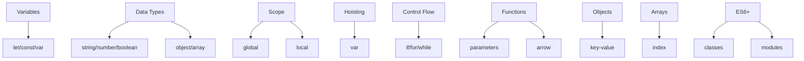

## 3.1. JavaScript Fundamentals

### Variables, Data Types, and Operators

Змінні (variables) — це іменовані області пам'яті для зберігання даних. В JS використовуються `let`, `const`, `var` (застарілий).

```js
let name = "Anna";
const age = 28;
var oldVar = true; // не рекомендується
```
- `let` — блочна область видимості.
- `const` — блочна, не можна перевизначити.
- `var` — функціональна область видимості.

Типи даних (data types):
- Примітиви: `string`, `number`, `boolean`, `null`, `undefined`, `symbol`, `bigint`
- Об'єкти: `Object`, `Array`, `Function`, `Date`, тощо

Оператори (operators):
- Арифметичні: `+`, `-`, `*`, `/`, `%`, `**`
- Порівняння: `==`, `===`, `!=`, `!==`, `<`, `>`, `<=`, `>=`
- Логічні: `&&`, `||`, `!`
- Присвоєння: `=`, `+=`, `-=`, `*=`, `/=`, `%=`

---

### Scope and Hoisting

Область видимості (scope) — визначає, де доступна змінна.
- Глобальна
- Локальна (функція, блок)

Hoisting (підняття) — механізм, коли оголошення змінних і функцій "піднімаються" на початок області видимості.

```js
console.log(a); // undefined
var a = 5;
```
- `var` піднімається, але значення не присвоюється.
- `let`/`const` не піднімаються (ReferenceError).

---

### Control Flow: Conditionals and Loops

Управління потоком (control flow) — це умовні оператори та цикли.

```js
if (age > 18) {
  console.log("Adult");
} else {
  console.log("Minor");
}

for (let i = 0; i < 5; i++) {
  console.log(i);
}

while (condition) {
  // ...
}
```
- `if`, `else if`, `else` — умовні оператори.
- `for`, `while`, `do...while` — цикли.
- `break`, `continue` — управління циклом.

---

### Functions and Parameters

Функції (functions) — блоки коду для повторного використання.

```js
function greet(name) {
  return `Hello, ${name}!`;
}
const sum = (a, b) => a + b; // стрілочна функція (arrow function)
```
- Можуть приймати параметри.
- Можуть повертати значення.
- Arrow functions — короткий синтаксис, не мають власного `this`.

---

### Objects and Arrays

Об'єкти (objects) — колекції пар "ключ-значення".

```js
const user = {
  name: "Anna",
  age: 28,
  isAdmin: false
};
console.log(user.name);
```

Масиви (arrays) — впорядковані списки.

```js
const fruits = ["apple", "banana", "cherry"];
console.log(fruits[1]); // "banana"
fruits.push("orange");
```

---

### ES6+ Features

Сучасний JavaScript (ES6+) містить багато нових можливостей:
- `let`, `const`
- Arrow functions
- Template literals: ``Hello, ${name}!``
- Деструктуризація (destructuring):

```js
const { name, age } = user;
const [first, second] = fruits;
```
- Spread/rest оператори: `...`
- Класи (classes):

```js
class Person {
  constructor(name) {
    this.name = name;
  }
  greet() {
    return `Hi, I'm ${this.name}`;
  }
}
```
- Модулі (modules): `import`, `export`

---

### Mermaid Diagram: JS Fundamentals


_Основи JavaScript_

---

#### Navigation

- [Попередня тема: Advanced CSS](2.8-advanced-css.md)
- [Наступна тема: JavaScript Core Concepts](3.2-javascript-core-concepts.md)
