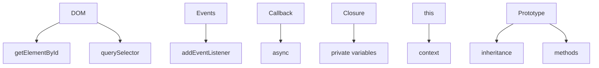

## 3.2. JavaScript Core Concepts

### DOM Manipulation

DOM (Document Object Model) — це структура HTML-документа у вигляді дерева, яку можна змінювати через JavaScript.

```js
const title = document.getElementById("main-title");
title.textContent = "New Title";
const items = document.querySelectorAll(".item");
items.forEach((item) => item.classList.add("active"));
```

-   `getElementById`, `getElementsByClassName`, `querySelector`, `querySelectorAll` — пошук елементів.
-   `textContent`, `innerHTML`, `classList`, `setAttribute` — зміна властивостей.
-   Можна створювати, видаляти, переміщати елементи.

---

### Events and Event Handling

Події (events) — це реакції на дії користувача (клік, клавіша, скрол).

```js
document.getElementById("btn").addEventListener("click", function (e) {
    alert("Button clicked!");
});
```

-   `addEventListener` — підписка на подію.
-   `event` (e) — об'єкт події (target, type, ...).
-   Можна використовувати стрілочні функції, але вони не мають власного `this`.

---

### Callbacks

Callback (зворотний виклик) — функція, яка передається як аргумент і викликається пізніше.

```js
function fetchData(url, callback) {
    // ...
    callback(data);
}
fetchData("/api", function (data) {
    console.log(data);
});
```

-   Використовується для асинхронних операцій (запити, таймери).
-   Може призводити до "callback hell" — вкладеність багатьох функцій.

---

### Closures

Closure (замикання) — функція, яка "запам'ятовує" змінні з зовнішнього контексту.

```js
function makeCounter() {
    let count = 0;
    return function () {
        count++;
        return count;
    };
}
const counter = makeCounter();
console.log(counter()); // 1
console.log(counter()); // 2
```

-   Замикання дозволяє створювати приватні змінні.
-   Важливо для модулів, фабрик, інкапсуляції.

---

### this Keyword

`this` — контекст виконання функції.

-   В глобальному контексті — window (у браузері).
-   В методі об'єкта — сам об'єкт.
-   В стрілочних функціях — не має власного `this`, бере з зовнішнього контексту.

```js
const user = {
    name: "Anna",
    greet() {
        return `Hi, I'm ${this.name}`;
    },
};
user.greet(); // "Hi, I'm Anna"
```

---

### Prototypes and Inheritance

Прототипи (prototypes) — механізм для наслідування властивостей і методів.

```js
function Animal(name) {
    this.name = name;
}
Animal.prototype.speak = function () {
    return `${this.name} makes a sound.`;
};
const dog = new Animal("Rex");
dog.speak(); // "Rex makes a sound."
```

-   Кожен об'єкт має прототип.
-   Наслідування через ланцюжок прототипів.
-   ES6 класи спрощують синтаксис:

```js
class Animal {
    constructor(name) {
        this.name = name;
    }
    speak() {
        return `${this.name} makes a sound.`;
    }
}
```

---

### Mermaid Diagram: JS Core Concepts



_Ключові концепти JavaScript_

---

#### Navigation

-   [Попередня тема: JavaScript Fundamentals](3.1-javascript-fundamentals.md)
-   [Наступна тема: Asynchronous JavaScript](3.3-asynchronous-javascript.md)
