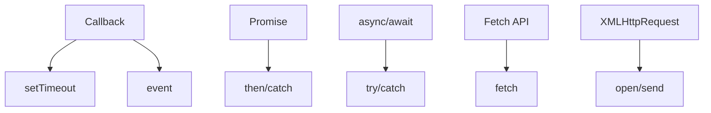

## 3.3. Asynchronous JavaScript

### Callbacks

Callback (зворотний виклик) — функція, яка викликається після завершення асинхронної операції.

```js
function getData(url, callback) {
  setTimeout(() => {
    callback('data from ' + url);
  }, 1000);
}
getData('/api', function(data) {
  console.log(data);
});
```
- Використовується для роботи з таймерами, запитами, подіями.
- Недолік: "callback hell" — вкладеність багатьох функцій.

---

### Promises

Promise (обіцянка) — об'єкт для роботи з асинхронними операціями.

```js
const promise = new Promise((resolve, reject) => {
  setTimeout(() => resolve('Success!'), 1000);
});
promise.then(result => console.log(result)).catch(error => console.error(error));
```
- `then` — обробка успіху.
- `catch` — обробка помилки.
- `finally` — виконується завжди.

---

### async/await

`async`/`await` — синтаксис для роботи з промісами у вигляді синхронного коду.

```js
async function fetchData() {
  try {
    const result = await promise;
    console.log(result);
  } catch (error) {
    console.error(error);
  }
}
fetchData();
```
- `async` — функція повертає проміс.
- `await` — "чекає" виконання промісу.
- Зручно для читабельності та обробки помилок.

---

### Fetch API

Fetch API — сучасний спосіб виконання HTTP-запитів.

```js
fetch('https://api.example.com/data')
  .then(response => response.json())
  .then(data => console.log(data))
  .catch(error => console.error(error));
```
- Повертає проміс.
- Підтримує async/await:

```js
async function getData() {
  const response = await fetch('https://api.example.com/data');
  const data = await response.json();
  console.log(data);
}
```

---

### XMLHttpRequest

XMLHttpRequest — старий спосіб виконання AJAX-запитів.

```js
const xhr = new XMLHttpRequest();
xhr.open('GET', 'https://api.example.com/data');
xhr.onload = function() {
  if (xhr.status === 200) {
    console.log(xhr.responseText);
  }
};
xhr.send();
```
- Більш складний синтаксис.
- Використовується для підтримки старих браузерів.

---

### Mermaid Diagram: Asynchronous JS


_Асинхронність у JavaScript_

---

#### Navigation

- [Попередня тема: JavaScript Core Concepts](3.2-javascript-core-concepts.md)
- [Наступна тема: Modern JavaScript](3.4-modern-javascript.md)
