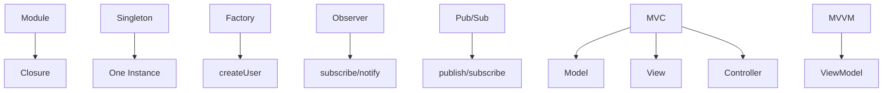

## 3.7. JavaScript Patterns

### Module Pattern

Module pattern (модульний патерн) — інкапсуляція коду у приватний простір, експорт лише потрібних частин.

```js
const Counter = (function() {
  let count = 0;
  return {
    increment() { count++; },
    getCount() { return count; }
  };
})();
Counter.increment();
console.log(Counter.getCount());
```
- Використовує замикання (closure) для приватності.
- Сучасний варіант — ES6 modules.

---

### Singleton

Singleton (сінглтон) — гарантує, що клас має лише один екземпляр.

```js
class Database {
  static instance;
  constructor() {
    if (Database.instance) return Database.instance;
    Database.instance = this;
  }
}
const db1 = new Database();
const db2 = new Database();
console.log(db1 === db2); // true
```
- Використовується для глобальних сервісів.

---

### Factory

Factory pattern (фабричний патерн) — створення об'єктів через фабричну функцію.

```js
function createUser(type) {
  if (type === 'admin') {
    return { role: 'admin', permissions: ['all'] };
  }
  return { role: 'user', permissions: ['read'] };
}
const admin = createUser('admin');
```
- Гнучко створює різні типи об'єктів.

---

### Observer

Observer pattern (патерн спостерігача) — об'єкти "слухають" зміни інших об'єктів.

```js
class Subject {
  observers = [];
  subscribe(fn) { this.observers.push(fn); }
  notify(data) { this.observers.forEach(fn => fn(data)); }
}
const subject = new Subject();
subject.subscribe(data => console.log('Received:', data));
subject.notify('Hello!');
```
- Використовується у UI, реактивних фреймворках.

---

### Pub/Sub

Pub/Sub (publish/subscribe) — розділення відправника і отримувача повідомлень.

```js
const PubSub = {
  events: {},
  subscribe(event, fn) {
    if (!this.events[event]) this.events[event] = [];
    this.events[event].push(fn);
  },
  publish(event, data) {
    if (this.events[event]) {
      this.events[event].forEach(fn => fn(data));
    }
  }
};
PubSub.subscribe('msg', data => console.log('Message:', data));
PubSub.publish('msg', 'Hello Pub/Sub!');
```
- Зручно для масштабних додатків.

---

### MVC/MVVM

MVC (Model-View-Controller) — розділення даних, UI та логіки.
MVVM (Model-View-ViewModel) — розширення MVC для двостороннього зв'язку.

```js
// MVC псевдокод
class Model { /* дані */ }
class View { /* UI */ }
class Controller { /* логіка */ }

// MVVM псевдокод
class Model { /* дані */ }
class View { /* UI */ }
class ViewModel { /* двосторонній зв'язок */ }
```
- Використовується у фреймворках (Angular, Vue, React).

---

### Mermaid Diagram: JS Patterns


_Поширені патерни JavaScript_

---

#### Navigation

- [Попередня тема: TypeScript Advanced](3.6-typescript-advanced.md)
- [Наступна тема: Testing and Debugging](3.8-testing-and-debugging.md)
