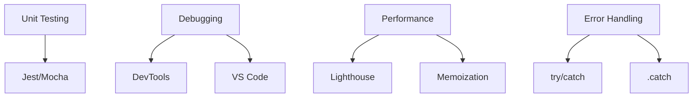

## 3.8. Testing and Debugging

### Unit Testing Frameworks

Unit testing frameworks (фреймворки для юніт-тестування) — інструменти для автоматичної перевірки окремих частин коду.

-   Найпопулярніші: Jest, Mocha, Jasmine, Vitest.

```js
// Jest приклад
test("adds 1 + 2 to equal 3", () => {
    expect(1 + 2).toBe(3);
});
```

-   Дозволяють писати тести для функцій, класів, компонентів.
-   Підтримують мокінг, асинхронні тести, покриття коду.

---

### Debugging Tools

Debugging tools (інструменти для дебагу) — засоби для пошуку і виправлення помилок.

-   Вбудовані: Chrome DevTools, Firefox Developer Tools.
-   IDE: VS Code Debugger.
-   Команди: `console.log`, `debugger`.

```js
function buggy() {
    debugger;
    console.log("Debug here");
}
```

-   Можна ставити брейкпоінти, переглядати змінні, виконувати код по кроках.

---

### Performance Optimization

Performance optimization (оптимізація продуктивності) — техніки для прискорення роботи додатка.

-   Профілювання: вкладка Performance у DevTools.
-   Аналіз пам'яті: вкладка Memory.
-   Інструменти: Lighthouse, WebPageTest.

```js
// Memoization приклад
function memoize(fn) {
    const cache = {};
    return function (arg) {
        if (cache[arg]) return cache[arg];
        cache[arg] = fn(arg);
        return cache[arg];
    };
}
```

-   Використовуйте lazy loading, code splitting, кешування.

---

### Error Handling

Error handling (обробка помилок) — механізми для виявлення і обробки помилок.

```js
try {
    throw new Error("Something went wrong");
} catch (e) {
    console.error(e.message);
} finally {
    console.log("Always runs");
}
```

-   Використовуйте `try/catch/finally`, обробку асинхронних помилок (`.catch`, `async/await`).
-   Логування помилок, повідомлення користувачу.

---

### Mermaid Diagram: Testing & Debugging



_Тестування та дебаг у JavaScript_

---

#### Navigation

-   [Попередня тема: JavaScript Patterns](3.7-javascript-patterns.md)
-   [Наступна тема: Vue 3 Fundamentals](4.1-vue3-fundamentals.md)
