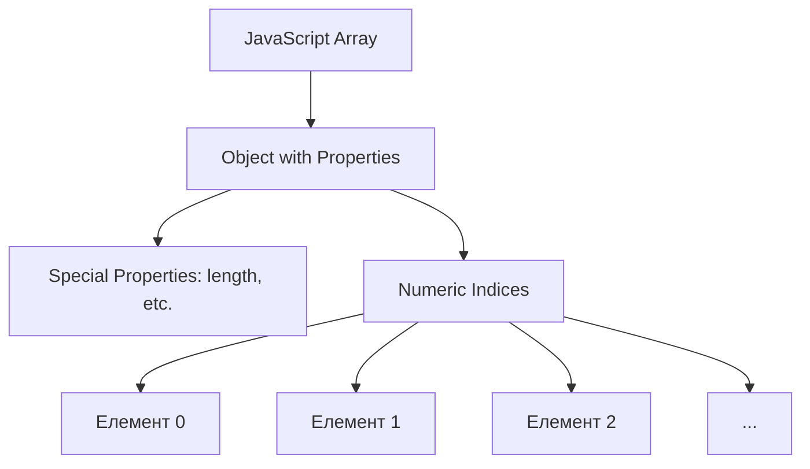

# JavaScript/TypeScript: Масиви

Масиви є одним із найважливіших типів даних у JavaScript, які дозволяють зберігати та маніпулювати впорядкованими колекціями елементів. Вони надають широкий спектр вбудованих методів для ефективної обробки даних та пропонують різні способи ітерації.

## Загальний огляд

Масиви в JavaScript:

-   Це впорядковані колекції даних, де кожен елемент має числовий індекс
-   Можуть містити елементи різних типів одночасно
-   Є динамічними (можуть змінювати розмір)
-   Є об'єктами спеціального типу з додатковими властивостями та методами
-   Передаються за посиланням, а не за значенням

## Створення масивів

У JavaScript існує кілька способів створення масивів:

### 1. Літеральний синтаксис

```javascript
// Порожній масив
const emptyArray = [];

// Масив з елементами
const numbers = [1, 2, 3, 4, 5];

// Масив з елементами різних типів
const mixedArray = [1, "hello", true, null, { name: "John" }, [1, 2, 3]];

// Масив з "дірками" (розріджений масив)
const sparseArray = [1, , 3]; // Елемент з індексом 1 буде undefined
```

### 2. Конструктор Array

```javascript
// Порожній масив
const emptyArray = new Array();

// Масив з заданою довжиною (всі елементи будуть undefined)
const arrayWithLength = new Array(5); // [empty × 5]

// Масив з елементами
const numbers = new Array(1, 2, 3, 4, 5); // [1, 2, 3, 4, 5]
```

### 3. Статичні методи створення

```javascript
// Array.from() - створює масив з ітерабельного об'єкта або масивоподібного об'єкта
const arrayFromString = Array.from("hello"); // ["h", "e", "l", "l", "o"]

// З мапуванням (другий аргумент - функція перетворення)
const squares = Array.from([1, 2, 3], (x) => x * x); // [1, 4, 9]

// Array.of() - створює масив з окремих елементів
const arrayOf = Array.of(1, 2, 3); // [1, 2, 3]
// Відрізняється від конструктора Array при одному аргументі:
const singleItemArray = Array.of(5); // [5] (не масив довжиною 5)
```

## Властивості масивів

### length

Властивість `length` показує кількість елементів у масиві:

```javascript
const fruits = ["apple", "banana", "orange"];
console.log(fruits.length); // 3

// Можна змінювати довжину масиву:
fruits.length = 2; // ["apple", "banana"] - останній елемент буде видалено
fruits.length = 5; // ["apple", "banana", undefined, undefined, undefined]
```

## Методи масивів

JavaScript надає багатий набір методів для роботи з масивами. Ми розглянемо їх за категоріями:

### Методи для додавання/видалення елементів

#### 1. push() - додає елементи в кінець масиву

```javascript
const fruits = ["apple", "banana"];
fruits.push("orange", "mango");
console.log(fruits); // ["apple", "banana", "orange", "mango"]

// Метод повертає нову довжину масиву:
const newLength = fruits.push("kiwi");
console.log(newLength); // 5
```

#### 2. pop() - видаляє останній елемент з масиву

```javascript
const fruits = ["apple", "banana", "orange"];
const lastFruit = fruits.pop();
console.log(lastFruit); // "orange"
console.log(fruits); // ["apple", "banana"]
```

#### 3. unshift() - додає елементи на початок масиву

```javascript
const fruits = ["banana", "orange"];
fruits.unshift("apple", "mango");
console.log(fruits); // ["apple", "mango", "banana", "orange"]

// Також повертає нову довжину масиву:
const newLength = fruits.unshift("kiwi");
console.log(newLength); // 5
```

#### 4. shift() - видаляє перший елемент з масиву

```javascript
const fruits = ["apple", "banana", "orange"];
const firstFruit = fruits.shift();
console.log(firstFruit); // "apple"
console.log(fruits); // ["banana", "orange"]
```

#### 5. splice() - додає/видаляє елементи з будь-якої позиції

```javascript
const fruits = ["apple", "banana", "orange", "mango"];

// Видалення елементів: splice(початковий_індекс, кількість_елементів)
const removed = fruits.splice(1, 2);
console.log(removed); // ["banana", "orange"]
console.log(fruits); // ["apple", "mango"]

// Додавання елементів: splice(початковий_індекс, кількість_елементів, ...нові_елементи)
fruits.splice(1, 0, "pear", "cherry");
console.log(fruits); // ["apple", "pear", "cherry", "mango"]

// Заміна елементів: видалення з одночасним додаванням
fruits.splice(2, 1, "peach", "grape");
console.log(fruits); // ["apple", "pear", "peach", "grape", "mango"]
```

#### 6. slice() - повертає частину масиву (не змінює оригінал)

```javascript
const fruits = ["apple", "banana", "orange", "mango", "kiwi"];

// slice(початковий_індекс, кінцевий_індекс) - кінцевий індекс не включається
const citrus = fruits.slice(1, 3);
console.log(citrus); // ["banana", "orange"]
console.log(fruits); // ["apple", "banana", "orange", "mango", "kiwi"] - оригінал не змінився

// Негативні індекси відраховуються з кінця
const lastTwo = fruits.slice(-2);
console.log(lastTwo); // ["mango", "kiwi"]

// Без аргументів - створює копію масиву
const copy = fruits.slice();
console.log(copy); // ["apple", "banana", "orange", "mango", "kiwi"]
```

### Методи для пошуку та перевірки елементів

#### 1. indexOf() - знаходить індекс першого входження елемента

```javascript
const fruits = ["apple", "banana", "orange", "banana", "kiwi"];
const bananaIndex = fruits.indexOf("banana");
console.log(bananaIndex); // 1

// Другий параметр - початковий індекс для пошуку
const secondBanana = fruits.indexOf("banana", 2);
console.log(secondBanana); // 3

// Якщо елемент не знайдено, повертає -1
const cherryIndex = fruits.indexOf("cherry");
console.log(cherryIndex); // -1
```

#### 2. lastIndexOf() - знаходить індекс останнього входження елемента

```javascript
const fruits = ["apple", "banana", "orange", "banana", "kiwi"];
const lastBanana = fruits.lastIndexOf("banana");
console.log(lastBanana); // 3

// Також приймає початковий індекс для пошуку (в зворотному напрямку)
const firstBanana = fruits.lastIndexOf("banana", 2);
console.log(firstBanana); // 1
```

#### 3. includes() - перевіряє наявність елемента

```javascript
const fruits = ["apple", "banana", "orange", "mango"];
console.log(fruits.includes("banana")); // true
console.log(fruits.includes("grape")); // false

// Другий параметр - початковий індекс для пошуку
console.log(fruits.includes("apple", 1)); // false
```

#### 4. find() - знаходить перший елемент, що задовольняє умову

```javascript
const users = [
    { id: 1, name: "John" },
    { id: 2, name: "Jane" },
    { id: 3, name: "Alex" },
];

// Функція-предикат отримує (елемент, індекс, масив)
const jane = users.find((user) => user.name === "Jane");
console.log(jane); // { id: 2, name: "Jane" }

// Якщо нічого не знайдено, повертає undefined
const bob = users.find((user) => user.name === "Bob");
console.log(bob); // undefined
```

#### 5. findIndex() - знаходить індекс першого елемента, що задовольняє умову

```javascript
const users = [
    { id: 1, name: "John" },
    { id: 2, name: "Jane" },
    { id: 3, name: "Alex" },
];

const alexIndex = users.findIndex((user) => user.name === "Alex");
console.log(alexIndex); // 2

const bobIndex = users.findIndex((user) => user.name === "Bob");
console.log(bobIndex); // -1 (не знайдено)
```

#### 6. findLast() і findLastIndex() (ES2023)

```javascript
const numbers = [1, 3, 5, 7, 9, 2, 4, 6, 8];

// Знаходить останній парний елемент
const lastEven = numbers.findLast((n) => n % 2 === 0);
console.log(lastEven); // 8

// Знаходить індекс останнього парного елемента
const lastEvenIndex = numbers.findLastIndex((n) => n % 2 === 0);
console.log(lastEvenIndex); // 8
```

#### 7. some() - перевіряє, чи задовольняє хоча б один елемент умову

```javascript
const numbers = [1, 2, 3, 4, 5];

// Чи є хоча б одне парне число?
const hasEven = numbers.some((n) => n % 2 === 0);
console.log(hasEven); // true

// Чи є хоча б одне число більше 10?
const hasLarge = numbers.some((n) => n > 10);
console.log(hasLarge); // false
```

#### 8. every() - перевіряє, чи задовольняють усі елементи умову

```javascript
const numbers = [2, 4, 6, 8, 10];

// Чи всі числа парні?
const allEven = numbers.every((n) => n % 2 === 0);
console.log(allEven); // true

// Чи всі числа менше 9?
const allSmall = numbers.every((n) => n < 9);
console.log(allSmall); // false
```

### Методи для перетворення масивів

#### 1. map() - створює новий масив шляхом трансформації кожного елемента

```javascript
const numbers = [1, 2, 3, 4, 5];

// Створюємо масив квадратів
const squares = numbers.map((n) => n * n);
console.log(squares); // [1, 4, 9, 16, 25]

// Трансформація об'єктів
const users = [
    { id: 1, name: "John" },
    { id: 2, name: "Jane" },
];

const usernames = users.map((user) => user.name);
console.log(usernames); // ["John", "Jane"]
```

#### 2. filter() - створює новий масив з елементів, що задовольняють умову

```javascript
const numbers = [1, 2, 3, 4, 5, 6, 7, 8, 9, 10];

// Фільтрація парних чисел
const evens = numbers.filter((n) => n % 2 === 0);
console.log(evens); // [2, 4, 6, 8, 10]

// Фільтрація об'єктів
const users = [
    { id: 1, name: "John", age: 25 },
    { id: 2, name: "Jane", age: 17 },
    { id: 3, name: "Alex", age: 30 },
];

const adults = users.filter((user) => user.age >= 18);
console.log(adults); // [{ id: 1, name: "John", age: 25 }, { id: 3, name: "Alex", age: 30 }]
```

#### 3. reduce() - зводить масив до єдиного значення

```javascript
const numbers = [1, 2, 3, 4, 5];

// Сума всіх елементів
// reduce(callbackFn, initialValue)
const sum = numbers.reduce((acc, curr) => acc + curr, 0);
console.log(sum); // 15

// Знаходження максимального значення
const max = numbers.reduce((max, curr) => Math.max(max, curr), -Infinity);
console.log(max); // 5

// Створення об'єкта з масиву
const users = [
    { id: 1, name: "John" },
    { id: 2, name: "Jane" },
    { id: 3, name: "Alex" },
];

const userMap = users.reduce((acc, user) => {
    acc[user.id] = user;
    return acc;
}, {});

console.log(userMap);
// {
//   "1": { id: 1, name: "John" },
//   "2": { id: 2, name: "Jane" },
//   "3": { id: 3, name: "Alex" }
// }
```

#### 4. reduceRight() - як reduce(), але йде справа наліво

```javascript
const numbers = [1, 2, 3, 4, 5];

// Обчислення виразу: ((((5 - 4) - 3) - 2) - 1)
const result = numbers.reduceRight((acc, curr) => acc - curr);
console.log(result); // -5

// Конкатенація рядків у зворотному порядку
const strings = ["a", "b", "c", "d"];
const reversed = strings.reduceRight((acc, curr) => acc + curr, "");
console.log(reversed); // "dcba"
```

#### 5. flatMap() - комбінація map() і flatten()

```javascript
const sentences = ["Hello world", "This is JavaScript"];

// Спочатку ділимо кожен рядок на слова, потім сплющуємо результат
const words = sentences.flatMap((sentence) => sentence.split(" "));
console.log(words); // ["Hello", "world", "This", "is", "JavaScript"]

// Еквівалент:
// sentences.map(sentence => sentence.split(" ")).flat()
```

### Методи для сортування та змін порядку

#### 1. sort() - сортує масив на місці

```javascript
const fruits = ["banana", "apple", "orange", "mango"];

// Сортування за замовчуванням (лексикографічне)
fruits.sort();
console.log(fruits); // ["apple", "banana", "mango", "orange"]

// Числа (увага: сортує як рядки за замовчуванням)
const numbers = [10, 5, 40, 1, 100];
numbers.sort();
console.log(numbers); // [1, 10, 100, 40, 5] - лексикографічне сортування!

// Правильне сортування чисел
numbers.sort((a, b) => a - b);
console.log(numbers); // [1, 5, 10, 40, 100]

// Сортування за властивістю об'єкта
const users = [
    { name: "John", age: 25 },
    { name: "Jane", age: 17 },
    { name: "Alex", age: 30 },
];

// За віком (зростання)
users.sort((a, b) => a.age - b.age);
console.log(users);
// [
//   { name: "Jane", age: 17 },
//   { name: "John", age: 25 },
//   { name: "Alex", age: 30 }
// ]

// За ім'ям (алфавіт)
users.sort((a, b) => a.name.localeCompare(b.name));
console.log(users);
// [
//   { name: "Alex", age: 30 },
//   { name: "Jane", age: 17 },
//   { name: "John", age: 25 }
// ]
```

#### 2. reverse() - розвертає масив на місці

```javascript
const numbers = [1, 2, 3, 4, 5];
numbers.reverse();
console.log(numbers); // [5, 4, 3, 2, 1]

// Використання разом із sort()
const fruits = ["banana", "apple", "orange"];
fruits.sort().reverse(); // Сортування у зворотному алфавітному порядку
console.log(fruits); // ["orange", "banana", "apple"]
```

#### 3. toSorted(), toReversed() (ES2023)

Неруйнівні версії sort() і reverse(), які повертають новий масив:

```javascript
const numbers = [3, 1, 4, 2, 5];

// Неруйнівне сортування
const sorted = numbers.toSorted((a, b) => a - b);
console.log(sorted); // [1, 2, 3, 4, 5]
console.log(numbers); // [3, 1, 4, 2, 5] - оригінал не змінився

// Неруйнівний розворот
const reversed = numbers.toReversed();
console.log(reversed); // [5, 2, 4, 1, 3]
console.log(numbers); // [3, 1, 4, 2, 5] - оригінал не змінився
```

### Методи для сплющення та об'єднання

#### 1. flat() - сплющує вкладені масиви

```javascript
const nestedArray = [1, 2, [3, 4, [5, 6]]];

// За замовчуванням сплющує на 1 рівень
const flatArray = nestedArray.flat();
console.log(flatArray); // [1, 2, 3, 4, [5, 6]]

// Вказання глибини сплющення
const fullyFlatArray = nestedArray.flat(2);
console.log(fullyFlatArray); // [1, 2, 3, 4, 5, 6]

// Нескінченна глибина сплющення
const deeplyNested = [1, [2, [3, [4, [5]]]]];
const completelyFlat = deeplyNested.flat(Infinity);
console.log(completelyFlat); // [1, 2, 3, 4, 5]
```

#### 2. concat() - об'єднує масиви

```javascript
const array1 = [1, 2, 3];
const array2 = [4, 5, 6];
const array3 = [7, 8, 9];

// Об'єднання двох масивів
const combined = array1.concat(array2);
console.log(combined); // [1, 2, 3, 4, 5, 6]

// Об'єднання декількох масивів
const allArrays = array1.concat(array2, array3);
console.log(allArrays); // [1, 2, 3, 4, 5, 6, 7, 8, 9]

// Додавання окремих елементів
const withItems = array1.concat("a", "b", ["c", "d"]);
console.log(withItems); // [1, 2, 3, "a", "b", "c", "d"]
```

### Методи для перетворення в рядок

#### 1. join() - об'єднує елементи масиву в рядок

```javascript
const fruits = ["apple", "banana", "orange"];

// За замовчуванням розділяє комами
const defaultJoin = fruits.join();
console.log(defaultJoin); // "apple,banana,orange"

// Власний розділювач
const customJoin = fruits.join(" | ");
console.log(customJoin); // "apple | banana | orange"

// Порожній рядок як розділювач
const noSeparator = fruits.join("");
console.log(noSeparator); // "applebananaorange"
```

#### 2. toString() - перетворює масив на рядок

```javascript
const fruits = ["apple", "banana", "orange"];
const fruitsString = fruits.toString();
console.log(fruitsString); // "apple,banana,orange"

// Працює з вкладеними масивами
const nested = [1, 2, [3, 4], 5];
console.log(nested.toString()); // "1,2,3,4,5"
```

### Методи для копіювання та заповнення

#### 1. fill() - заповнює масив вказаним значенням

```javascript
const array = [1, 2, 3, 4, 5];

// fill(значення, початковий_індекс, кінцевий_індекс)
array.fill(0); // Заповнює весь масив нулями
console.log(array); // [0, 0, 0, 0, 0]

// Заповнення частини масиву
const numbers = [1, 2, 3, 4, 5];
numbers.fill(0, 2, 4); // Заповнюємо з індексу 2 (включно) до 4 (виключно)
console.log(numbers); // [1, 2, 0, 0, 5]

// Створення масиву з однаковими значеннями
const zeros = new Array(5).fill(0);
console.log(zeros); // [0, 0, 0, 0, 0]
```

#### 2. copyWithin() - копіює частину масиву в інше місце того ж масиву

```javascript
const array = [1, 2, 3, 4, 5];

// copyWithin(цільовий_індекс, початковий_індекс, кінцевий_індекс)
array.copyWithin(0, 3); // Копіює елементи з індексу 3 до кінця в позицію 0
console.log(array); // [4, 5, 3, 4, 5]

// Копіювання частини масиву
const numbers = [1, 2, 3, 4, 5];
numbers.copyWithin(0, 2, 4); // Копіює елементи з індексів 2-3 в позицію 0
console.log(numbers); // [3, 4, 3, 4, 5]
```

#### 3. with() (ES2023)

Неруйнівна заміна елемента за індексом:

```javascript
const array = [1, 2, 3, 4, 5];

// Заміна елемента за індексом (без зміни оригіналу)
const newArray = array.with(2, 10);
console.log(newArray); // [1, 2, 10, 4, 5]
console.log(array); // [1, 2, 3, 4, 5] - оригінал не змінився
```

### Допоміжні методи для роботи з TypedArray

#### 1. entries() - повертає ітератор пар [індекс, елемент]

```javascript
const fruits = ["apple", "banana", "orange"];
const iterator = fruits.entries();

// Використання в циклі for...of
for (const [index, value] of iterator) {
    console.log(`${index}: ${value}`);
}
// "0: apple"
// "1: banana"
// "2: orange"

// Або перетворення ітератора назад в масив
const pairs = [...fruits.entries()];
console.log(pairs);
// [[0, "apple"], [1, "banana"], [2, "orange"]]
```

#### 2. keys() - повертає ітератор індексів

```javascript
const fruits = ["apple", "banana", "orange"];
const keysIterator = fruits.keys();

// Використання в циклі for...of
for (const key of keysIterator) {
    console.log(key);
}
// 0
// 1
// 2

// Перетворення в масив
const keys = [...fruits.keys()];
console.log(keys); // [0, 1, 2]
```

#### 3. values() - повертає ітератор значень

```javascript
const fruits = ["apple", "banana", "orange"];
const valuesIterator = fruits.values();

// Використання в циклі for...of
for (const value of valuesIterator) {
    console.log(value);
}
// "apple"
// "banana"
// "orange"

// Перетворення в масив
const values = [...fruits.values()];
console.log(values); // ["apple", "banana", "orange"]
```

## Ітерація по масивах

JavaScript надає багато способів для ітерації по масивах:

### 1. Цикл for з індексами

```javascript
const fruits = ["apple", "banana", "orange"];

for (let i = 0; i < fruits.length; i++) {
    console.log(`${i}: ${fruits[i]}`);
}
// "0: apple"
// "1: banana"
// "2: orange"
```

### 2. Цикл for...of (ES6)

```javascript
const fruits = ["apple", "banana", "orange"];

for (const fruit of fruits) {
    console.log(fruit);
}
// "apple"
// "banana"
// "orange"

// З індексами (використовуючи entries())
for (const [index, fruit] of fruits.entries()) {
    console.log(`${index}: ${fruit}`);
}
// "0: apple"
// "1: banana"
// "2: orange"
```

### 3. Цикл for...in (не рекомендується для масивів)

```javascript
const fruits = ["apple", "banana", "orange"];

// Увага: for...in перебирає всі перераховувані властивості,
// включаючи неіндексні та успадковані
for (const index in fruits) {
    console.log(`${index}: ${fruits[index]}`);
}
// "0: apple"
// "1: banana"
// "2: orange"

// Проблема з for...in для масивів:
Array.prototype.customProperty = "test";
for (const index in fruits) {
    console.log(index);
}
// "0", "1", "2", "customProperty" - включає прототипні властивості!
```

### 4. Методи масивів з колбеками

#### forEach()

```javascript
const fruits = ["apple", "banana", "orange"];

fruits.forEach((fruit, index, array) => {
    console.log(`${index}: ${fruit}`);
    // array - посилання на оригінальний масив
});
// "0: apple"
// "1: banana"
// "2: orange"
```

### 5. Інші методи ітерації, що повертають нові масиви

```javascript
const numbers = [1, 2, 3, 4, 5];

// map() - трансформує кожен елемент
const doubled = numbers.map((n) => n * 2);
console.log(doubled); // [2, 4, 6, 8, 10]

// filter() - фільтрує елементи
const evens = numbers.filter((n) => n % 2 === 0);
console.log(evens); // [2, 4]

// reduce() - зводить до одного значення
const sum = numbers.reduce((acc, curr) => acc + curr, 0);
console.log(sum); // 15
```

## Деструктуризація масивів

Деструктуризація - потужний спосіб розпакування значень з масивів:

```javascript
const rgb = [255, 200, 100];

// Базова деструктуризація
const [red, green, blue] = rgb;
console.log(red, green, blue); // 255 200 100

// Пропуск елементів
const [first, , third] = [1, 2, 3];
console.log(first, third); // 1 3

// Значення за замовчуванням
const [name = "Guest", age = 25] = ["John"];
console.log(name, age); // "John" 25

// Решта елементів (rest)
const [head, ...tail] = [1, 2, 3, 4, 5];
console.log(head); // 1
console.log(tail); // [2, 3, 4, 5]

// Обмін значень змінних
let a = 1,
    b = 2;
[a, b] = [b, a];
console.log(a, b); // 2 1

// Деструктуризація в параметрах функції
function processColor([r, g, b]) {
    return `rgb(${r}, ${g}, ${b})`;
}
console.log(processColor([255, 100, 50])); // "rgb(255, 100, 50)"
```

## Методи перевірки масивів

### 1. Array.isArray() - перевірка, чи є значення масивом

```javascript
console.log(Array.isArray([1, 2, 3])); // true
console.log(Array.isArray("not array")); // false
console.log(Array.isArray({})); // false
console.log(Array.isArray(null)); // false
```

## Масиви в TypeScript

TypeScript додає типізацію для масивів:

```typescript
// Типізація масиву
const numbers: number[] = [1, 2, 3, 4, 5];

// Альтернативний синтаксис
const strings: Array<string> = ["a", "b", "c"];

// Масив з різними типами (кортеж)
const mixed: [string, number, boolean] = ["hello", 42, true];

// Масив об'єктів
interface User {
    id: number;
    name: string;
}

const users: User[] = [
    { id: 1, name: "John" },
    { id: 2, name: "Jane" },
];

// Readonly масиви
const readonlyNumbers: readonly number[] = [1, 2, 3];
// readonlyNumbers.push(4); // Помилка: Property 'push' does not exist on type 'readonly number[]'

// Масиви з обмеженою довжиною (кортежі)
type Point = [number, number]; // x, y координати
const origin: Point = [0, 0];

// Необов'язкові елементи в кортежах
type OptionalPoint = [number, number, string?];
const point1: OptionalPoint = [10, 20];
const point2: OptionalPoint = [10, 20, "label"];
```

## Підкапотні механізми масивів

### Представлення масивів у пам'яті

У JavaScript масиви - це особливі об'єкти, оптимізовані для числових індексів:



-   Масиви мають спеціальну внутрішню реалізацію, оптимізовану для швидкого доступу за індексом
-   Рушії JS можуть використовувати різні стратегії зберігання залежно від типів даних у масиві
-   Щільні масиви (без "дірок") зазвичай зберігаються ефективніше, ніж розріджені

### Оптимізації в рушіях JavaScript

#### 1. Оптимізація щільних масивів

```javascript
// Оптимізований масив (щільний, однотипний)
const optimizedArray = [1, 2, 3, 4, 5];

// Неоптимізований масив (розріджений)
const sparseArray = [];
sparseArray[0] = 1;
sparseArray[10] = 10; // Створює "дірки"

// Неоптимізований масив (змішані типи)
const mixedArray = [1, "string", true, {}, []];
```

#### 2. Оптимізація операцій

Деякі операції з масивами більш ефективні, ніж інші:

```javascript
const array = [1, 2, 3, 4, 5];

// Швидкі операції:
array.push(6); // Додавання в кінець
array.pop(); // Видалення з кінця

// Повільні операції:
array.unshift(0); // Додавання на початок (потрібно зсунути всі елементи)
array.shift(); // Видалення з початку (потрібно зсунути всі елементи)
array.splice(2, 1); // Видалення/вставка в середині (потрібно зсунути елементи)
```

#### 3. Продуктивність методів масивів

```javascript
const largeArray = new Array(1000000).fill(1);

// Швидше: один прохід по масиву
const sum = largeArray.reduce((acc, val) => acc + val, 0);

// Повільніше: кілька проходів
const filtered = largeArray.filter((x) => x > 0); // Один прохід
const mapped = filtered.map((x) => x * 2); // Другий прохід
const result = mapped.reduce((acc, val) => acc + val, 0); // Третій прохід

// Оптимізовано: один прохід з reduce
const optimizedResult = largeArray.reduce((acc, val) => {
    if (val > 0) {
        return acc + val * 2;
    }
    return acc;
}, 0);
```

## Типові патерни роботи з масивами

### 1. Фільтрація та маппінг

```javascript
const users = [
    { id: 1, name: "John", age: 25, active: true },
    { id: 2, name: "Jane", age: 17, active: false },
    { id: 3, name: "Bob", age: 30, active: true },
    { id: 4, name: "Alice", age: 22, active: false },
];

// Отримати імена активних повнолітніх користувачів
const adultActiveNames = users
    .filter((user) => user.age >= 18 && user.active)
    .map((user) => user.name);

console.log(adultActiveNames); // ["John", "Bob"]
```

### 2. Групування за властивістю

```javascript
const users = [
    { id: 1, name: "John", department: "IT" },
    { id: 2, name: "Jane", department: "HR" },
    { id: 3, name: "Bob", department: "IT" },
    { id: 4, name: "Alice", department: "Finance" },
];

// Групування користувачів за відділом
const usersByDepartment = users.reduce((acc, user) => {
    const { department } = user;
    if (!acc[department]) {
        acc[department] = [];
    }
    acc[department].push(user);
    return acc;
}, {});

console.log(usersByDepartment);
// {
//   "IT": [
//     { id: 1, name: "John", department: "IT" },
//     { id: 3, name: "Bob", department: "IT" }
//   ],
//   "HR": [
//     { id: 2, name: "Jane", department: "HR" }
//   ],
//   "Finance": [
//     { id: 4, name: "Alice", department: "Finance" }
//   ]
// }
```

### 3. Пагінація масиву

```javascript
const items = Array.from({ length: 100 }, (_, i) => `Item ${i + 1}`);

// Функція для отримання сторінки елементів
function getPage(array, pageSize, pageNumber) {
    const startIndex = (pageNumber - 1) * pageSize;
    return array.slice(startIndex, startIndex + pageSize);
}

const page1 = getPage(items, 10, 1);
console.log(page1); // ["Item 1", "Item 2", ..., "Item 10"]

const page5 = getPage(items, 10, 5);
console.log(page5); // ["Item 41", "Item 42", ..., "Item 50"]
```

### 4. Видалення дублікатів

```javascript
// З використанням Set
function removeDuplicates(array) {
    return [...new Set(array)];
}

const numbers = [1, 2, 2, 3, 4, 4, 5];
console.log(removeDuplicates(numbers)); // [1, 2, 3, 4, 5]

// Для масиву об'єктів за ключем
function removeDuplicatesByKey(array, key) {
    const seen = new Set();
    return array.filter((item) => {
        const value = item[key];
        if (seen.has(value)) {
            return false;
        }
        seen.add(value);
        return true;
    });
}

const users = [
    { id: 1, name: "John" },
    { id: 2, name: "Jane" },
    { id: 1, name: "John (duplicate)" },
];

console.log(removeDuplicatesByKey(users, "id"));
// [
//   { id: 1, name: "John" },
//   { id: 2, name: "Jane" }
// ]
```

### 5. Сортування масиву об'єктів за кількома полями

```javascript
const users = [
    { name: "John", age: 25, score: 90 },
    { name: "Jane", age: 25, score: 95 },
    { name: "Bob", age: 20, score: 90 },
    { name: "Alice", age: 30, score: 85 },
];

// Сортування: спочатку за віком (зростання), потім за балами (спадання)
users.sort((a, b) => {
    // Порівнюємо за віком
    if (a.age !== b.age) {
        return a.age - b.age;
    }
    // Якщо вік однаковий, порівнюємо за балами (у зворотному порядку)
    return b.score - a.score;
});

console.log(users);
// [
//   { name: "Bob", age: 20, score: 90 },
//   { name: "Jane", age: 25, score: 95 },
//   { name: "John", age: 25, score: 90 },
//   { name: "Alice", age: 30, score: 85 }
// ]
```

## Типові помилки при роботі з масивами

### 1. Неправильне копіювання масивів

```javascript
// Проблема: присвоєння посилання, а не копіювання
const original = [1, 2, 3];
const badCopy = original; // Це не копія, а посилання на той самий масив

badCopy.push(4);
console.log(original); // [1, 2, 3, 4] - оригінал також змінився!

// Вирішення: правильне копіювання
const goodCopy1 = [...original]; // Використання spread оператора
const goodCopy2 = original.slice(); // Використання slice()
const goodCopy3 = Array.from(original); // Використання Array.from()

goodCopy1.push(5);
console.log(original); // [1, 2, 3, 4] - оригінал не змінився
```

### 2. Неправильне копіювання вкладених масивів

```javascript
// Проблема: поверхневе копіювання не копіює вкладені масиви
const original = [1, 2, [3, 4]];
const shallowCopy = [...original];

shallowCopy[2].push(5);
console.log(original); // [1, 2, [3, 4, 5]] - вкладений масив у оригіналі змінився!

// Вирішення: глибоке копіювання
const deepCopy1 = JSON.parse(JSON.stringify(original)); // Простий спосіб для JSON-сумісних даних

// Рекурсивне копіювання
function deepCopy(arr) {
    return arr.map((item) => {
        return Array.isArray(item) ? deepCopy(item) : item;
    });
}

const deepCopy2 = deepCopy(original);
deepCopy2[2].push(6);
console.log(original); // [1, 2, [3, 4, 5]] - вкладений масив не змінився
```

### 3. Неочікуване порівняння масивів

```javascript
// Проблема: масиви порівнюються за посиланням, а не за значенням
const arr1 = [1, 2, 3];
const arr2 = [1, 2, 3];

console.log(arr1 === arr2); // false - різні посилання, хоч і однакові значення

// Вирішення: порівняння вмісту
function arraysEqual(a, b) {
    if (a.length !== b.length) return false;
    for (let i = 0; i < a.length; i++) {
        if (a[i] !== b[i]) return false;
    }
    return true;
}

console.log(arraysEqual(arr1, arr2)); // true

// Або з використанням JSON (для простих випадків)
console.log(JSON.stringify(arr1) === JSON.stringify(arr2)); // true
```

### 4. Небезпечне використання сортування

```javascript
// Проблема: sort() змінює оригінальний масив
const numbers = [3, 1, 4, 2];
const sorted = numbers.sort();

console.log(numbers); // [1, 2, 3, 4] - оригінал змінився!
console.log(sorted === numbers); // true - sort повертає посилання на той самий масив

// Вирішення: копіювання перед сортуванням
const original = [3, 1, 4, 2];
const sortedCopy = [...original].sort();

console.log(original); // [3, 1, 4, 2] - оригінал не змінився
console.log(sortedCopy); // [1, 2, 3, 4]

// Або в ES2023 використовуйте toSorted()
const sortedNew = original.toSorted();
```

### 5. Неправильне використання методів, що змінюють масив

```javascript
// Проблема: неочікувані побічні ефекти при використанні методів, що змінюють масив
const numbers = [1, 2, 3, 4];

// Ланцюжок викликів з методами, що змінюють масив
const result = numbers.reverse().push(5);
console.log(result); // 5 - метод push повертає нову довжину, а не масив!

// Вирішення: правильне розуміння повернених значень
const numbers2 = [1, 2, 3, 4];
numbers2.reverse(); // Спочатку змінюємо масив
numbers2.push(5); // Потім додаємо елемент
console.log(numbers2); // [4, 3, 2, 1, 5]

// Або використання неруйнівних методів, якщо потрібно зберегти оригінал
const numbers3 = [1, 2, 3, 4];
const reversed = [...numbers3].reverse();
const withExtra = [...reversed, 5];
console.log(numbers3); // [1, 2, 3, 4] - оригінал не змінився
console.log(withExtra); // [4, 3, 2, 1, 5]
```

## Сучасні можливості роботи з масивами (ES2022+)

### 1. at() - доступ до елементів з підтримкою від'ємних індексів

```javascript
const fruits = ["apple", "banana", "orange", "mango"];

// Традиційний доступ
const last = fruits[fruits.length - 1];
console.log(last); // "mango"

// З методом at()
console.log(fruits.at(-1)); // "mango" - останній елемент
console.log(fruits.at(-2)); // "orange" - передостанній елемент
console.log(fruits.at(1)); // "banana" - також працює з додатними індексами
```

### 2. toSpliced() (ES2023)

Неруйнівний варіант splice():

```javascript
const original = [1, 2, 3, 4, 5];

// Неруйнівне видалення/додавання елементів
const modified = original.toSpliced(2, 1, 10, 11);
console.log(modified); // [1, 2, 10, 11, 4, 5]
console.log(original); // [1, 2, 3, 4, 5] - оригінал не змінився
```

## Висновки

1. **Масиви є ключовою структурою даних** у JavaScript для роботи з впорядкованими колекціями елементів.

2. **JavaScript надає багатий набір методів для роботи з масивами**:

    - Методи додавання/видалення елементів (push, pop, splice тощо)
    - Методи пошуку (indexOf, find, includes тощо)
    - Методи трансформації (map, filter, reduce тощо)
    - Методи сортування та порядку (sort, reverse тощо)

3. **Є різні способи ітерації по масивах**, включаючи цикли for, for...of та метод forEach().

4. **Розуміння мутабельних і немутабельних операцій** є критичним для ефективної роботи з масивами.

5. **Деструктуризація масивів** дозволяє елегантно розпаковувати значення в окремі змінні.

6. **TypeScript додає статичну типізацію** для масивів, що підвищує безпеку типів у вашому коді.

7. **Розуміння внутрішньої роботи масивів** допомагає писати більш ефективний і оптимізований код.

Ефективне використання масивів і їх методів є ключовим навиком для будь-якого JavaScript-розробника.
