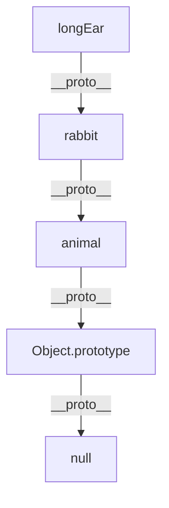
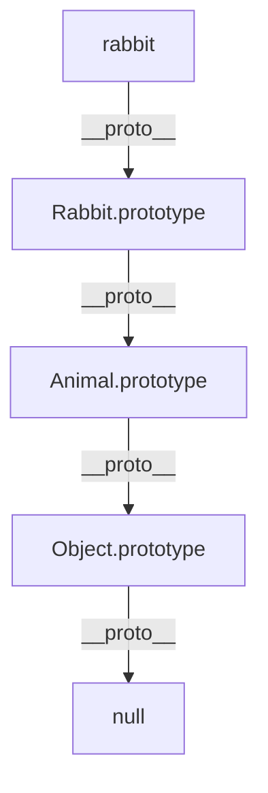
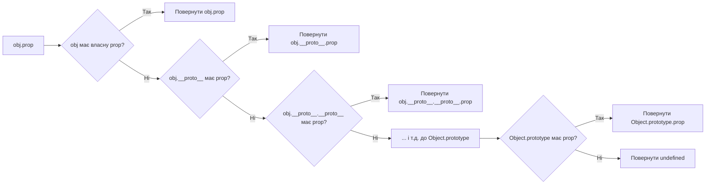

# JavaScript/TypeScript: Прототипне наслідування

Прототипне наслідування — це фундаментальний механізм у JavaScript, який дозволяє об'єктам успадковувати властивості та методи від інших об'єктів. Цей механізм є основою об'єктно-орієнтованого програмування в JavaScript і забезпечує гнучкість та потужність мови.

## Загальний огляд

Прототипне наслідування в JavaScript:

-   Відрізняється від класичного наслідування, яке використовується в C++, Java, C# тощо
-   Базується на концепції прототипів — об'єктів, від яких інші об'єкти успадковують властивості
-   Дозволяє створювати ланцюжки наслідування між об'єктами
-   Було розширене в ES6 синтаксисом класів, який є "синтаксичним цукром" над прототипами

## Основи прототипів

### Що таке прототип?

Кожен об'єкт у JavaScript має внутрішню властивість `[[Prototype]]` (яка доступна через геттер `__proto__`), яка вказує на інший об'єкт — його прототип. Коли ви намагаєтесь отримати доступ до властивості, яка не існує в об'єкті, JavaScript автоматично шукає цю властивість у прототипі, потім у прототипі прототипу і так далі вгору по ланцюжку, поки не досягне об'єкта з `null` як прототипом.

```javascript
const animal = {
    eats: true,
    walk() {
        console.log("Animal walks");
    },
};

const rabbit = {
    jumps: true,
    __proto__: animal, // встановлюємо animal як прототип для rabbit
};

// rabbit може використовувати властивості та методи animal
console.log(rabbit.eats); // true (успадковано від animal)
rabbit.walk(); // "Animal walks" (метод успадковано від animal)
```

> **Примітка**: Пряме використання `__proto__` вважається застарілим. Рекомендується використовувати `Object.getPrototypeOf()` і `Object.setPrototypeOf()` або `Object.create()`.

### Прототипний ланцюжок

Об'єкти в JavaScript формують "прототипний ланцюжок" — послідовність об'єктів, пов'язаних через прототипи. Пошук властивостей відбувається вздовж цього ланцюжка.

```javascript
const animal = {
    eats: true,
};

const rabbit = {
    jumps: true,
    __proto__: animal,
};

const longEar = {
    earLength: 10,
    __proto__: rabbit,
};

console.log(longEar.jumps); // true (з rabbit)
console.log(longEar.eats); // true (з animal)
```



### Методи для роботи з прототипами

```javascript
const animal = {
    eats: true,
};

// Створення об'єкта з заданим прототипом
const rabbit = Object.create(animal);
rabbit.jumps = true;

// Отримання прототипу
console.log(Object.getPrototypeOf(rabbit) === animal); // true

// Встановлення прототипу
const longEar = { earLength: 10 };
Object.setPrototypeOf(longEar, rabbit);

// Перевірка, чи є об'єкт прототипом іншого об'єкта
console.log(animal.isPrototypeOf(rabbit)); // true
console.log(animal.isPrototypeOf(longEar)); // true

// Перевірка, чи є властивість власною (не успадкованою)
console.log(rabbit.hasOwnProperty("jumps")); // true
console.log(rabbit.hasOwnProperty("eats")); // false (успадкована)
```

## Функції-конструктори

До появи класів (ES6) основним способом створення "типів" об'єктів були функції-конструктори та їх прототипи.

### Основи функцій-конструкторів

Функції-конструктори — це звичайні функції, які використовуються з оператором `new` для створення нових об'єктів. За угодою їх назви починаються з великої літери.

```javascript
function Animal(name) {
    // this вказує на новостворений об'єкт
    this.name = name;
    this.eats = true;
}

// Додавання методу до прототипу
Animal.prototype.walk = function () {
    console.log(`${this.name} walks`);
};

// Створення нового екземпляра
const rabbit = new Animal("Rabbit");
console.log(rabbit.name); // "Rabbit"
rabbit.walk(); // "Rabbit walks"
```

Що відбувається при виклику з `new`:

1. Створюється новий порожній об'єкт.
2. Цей об'єкт встановлюється як `this` для виконання функції.
3. Функція виконується. Зазвичай вона модифікує `this`, додаючи властивості.
4. Якщо функція не повертає об'єкт, повертається `this`.

```mermaid
graph TD
    A[new Animal"name"] -->|1. Створює| B[Порожній об'єкт]
    B -->|2. this = об'єкт| C[Виконання конструктора]
    C -->|3. Додавання властивостей| D[this.name = name]
    D -->|this.eats = true| E[Заповнений об'єкт]
    E -->|4. Повернення| F[Новий екземпляр Animal]
    F -->|__proto__| G[Animal.prototype]
```

### Властивість prototype

Кожна функція у JavaScript має властивість `prototype`. Ця властивість стає прототипом для об'єктів, створених за допомогою цієї функції як конструктора.

```javascript
function Animal(name) {
    this.name = name;
}

// Додавання методів до прототипу (спільних для всіх екземплярів)
Animal.prototype.walk = function () {
    console.log(`${this.name} walks`);
};

const rabbit = new Animal("Rabbit");
const cat = new Animal("Cat");

rabbit.walk(); // "Rabbit walks"
cat.walk(); // "Cat walks"

// Обидва екземпляри використовують той самий метод
console.log(rabbit.walk === cat.walk); // true
```

### Прототипне наслідування з конструкторами

```javascript
function Animal(name) {
    this.name = name;
    this.eats = true;
}

Animal.prototype.walk = function () {
    console.log(`${this.name} walks`);
};

function Rabbit(name, earLength) {
    // Виклик батьківського конструктора з поточним this
    Animal.call(this, name);
    this.earLength = earLength;
}

// Створення нового об'єкта на основі Animal.prototype
Rabbit.prototype = Object.create(Animal.prototype);

// Не забудьте відновити конструктор
Rabbit.prototype.constructor = Rabbit;

// Додавання методів до Rabbit.prototype
Rabbit.prototype.jump = function () {
    console.log(`${this.name} jumps`);
};

// Перевизначення батьківських методів
Rabbit.prototype.walk = function () {
    console.log(`${this.name} hops instead of walking`);
};

const rabbit = new Rabbit("White Rabbit", 10);
console.log(rabbit.name); // "White Rabbit"
console.log(rabbit.earLength); // 10
console.log(rabbit.eats); // true (успадковано від Animal)
rabbit.walk(); // "White Rabbit hops instead of walking"
rabbit.jump(); // "White Rabbit jumps"
```



### Недоліки старого підходу до наслідування

Наведений вище спосіб наслідування має кілька незручностей:

1. Необхідність викликати батьківський конструктор вручну (`Animal.call(this, name)`)
2. Встановлення прототипу та відновлення конструктора вимагає додаткового коду
3. Важко зрозуміти з першого погляду

Ці проблеми були вирішені з введенням класів у ES6.

## Класи в JavaScript (ES6+)

Класи в JavaScript, введені в ES6, є "синтаксичним цукром" над прототипним наслідуванням. Вони не вводять нову об'єктно-орієнтовану модель, а надають більш чистий і зрозумілий синтаксис.

### Оголошення класів

```javascript
class Animal {
    // Конструктор викликається при створенні нового екземпляра
    constructor(name) {
        this.name = name;
        this.eats = true;
    }

    // Методи класу автоматично додаються до Animal.prototype
    walk() {
        console.log(`${this.name} walks`);
    }

    // Статичні методи належать самому класу, а не його екземплярам
    static compareAnimals(a, b) {
        return a.name === b.name;
    }
}

const dog = new Animal("Dog");
dog.walk(); // "Dog walks"

// Виклик статичного методу
const anotherDog = new Animal("Dog");
console.log(Animal.compareAnimals(dog, anotherDog)); // true
```

### Наслідування з класами

```javascript
class Animal {
    constructor(name) {
        this.name = name;
        this.eats = true;
    }

    walk() {
        console.log(`${this.name} walks`);
    }
}

class Rabbit extends Animal {
    constructor(name, earLength) {
        // super() викликає конструктор батьківського класу
        super(name);
        this.earLength = earLength;
    }

    // Перевизначення методу батьківського класу
    walk() {
        console.log(`${this.name} hops instead of walking`);
    }

    // Додавання нового методу
    jump() {
        console.log(`${this.name} jumps`);
    }
}

const rabbit = new Rabbit("White Rabbit", 10);
console.log(rabbit.name); // "White Rabbit"
console.log(rabbit.earLength); // 10
console.log(rabbit.eats); // true (успадковано від Animal)
rabbit.walk(); // "White Rabbit hops instead of walking"
rabbit.jump(); // "White Rabbit jumps"
```

### Важливі особливості класів

#### 1. Необхідність super() перед this

```javascript
class Animal {
    constructor(name) {
        this.name = name;
    }
}

class Rabbit extends Animal {
    constructor(name, earLength) {
        // Помилка без super()
        // this.earLength = earLength; // ReferenceError: Must call super constructor before using 'this'

        super(name); // Спочатку виклик super()
        this.earLength = earLength; // Тепер можна використовувати this
    }
}
```

#### 2. Приватні поля та методи (ES2020+)

```javascript
class BankAccount {
    // Приватне поле (з префіксом #)
    #balance = 0;

    constructor(owner, initialBalance) {
        this.owner = owner;
        this.#balance = initialBalance;
    }

    // Приватний метод
    #validateAmount(amount) {
        return amount > 0 && amount <= this.#balance;
    }

    deposit(amount) {
        if (amount > 0) {
            this.#balance += amount;
            return true;
        }
        return false;
    }

    withdraw(amount) {
        if (this.#validateAmount(amount)) {
            this.#balance -= amount;
            return true;
        }
        return false;
    }

    get balance() {
        return this.#balance;
    }
}

const account = new BankAccount("John", 1000);
console.log(account.balance); // 1000
account.deposit(500);
console.log(account.balance); // 1500
account.withdraw(200);
console.log(account.balance); // 1300

// Приватні поля недоступні ззовні
// console.log(account.#balance); // SyntaxError
// account.#validateAmount(100); // SyntaxError
```

#### 3. Геттери і сеттери

```javascript
class Person {
    constructor(firstName, lastName) {
        this._firstName = firstName;
        this._lastName = lastName;
    }

    // Геттер для fullName
    get fullName() {
        return `${this._firstName} ${this._lastName}`;
    }

    // Сеттер для fullName
    set fullName(value) {
        const parts = value.split(" ");
        this._firstName = parts[0];
        this._lastName = parts[1];
    }

    // Геттер для firstName
    get firstName() {
        return this._firstName;
    }

    // Сеттер для firstName
    set firstName(value) {
        this._firstName = value;
    }
}

const person = new Person("John", "Doe");
console.log(person.fullName); // "John Doe"

person.fullName = "Jane Smith";
console.log(person.firstName); // "Jane"
console.log(person.fullName); // "Jane Smith"
```

#### 4. Статичні властивості та методи

```javascript
class MathUtils {
    // Статична властивість (ES2020+)
    static PI = 3.14159;

    // Статичний метод
    static sum(...numbers) {
        return numbers.reduce((acc, num) => acc + num, 0);
    }

    // Статичний блок ініціалізації (ES2022+)
    static {
        this.SQRT2 = Math.sqrt(2);
        this.E = 2.718;
    }
}

console.log(MathUtils.PI); // 3.14159
console.log(MathUtils.sum(1, 2, 3, 4)); // 10
console.log(MathUtils.SQRT2); // 1.414...
```

#### 5. Наслідування від вбудованих класів

```javascript
// Наслідування від вбудованого класу Array
class MyArray extends Array {
    // Додавання власних методів
    first() {
        return this[0];
    }

    last() {
        return this[this.length - 1];
    }
}

const arr = new MyArray(1, 2, 3, 4, 5);
console.log(arr.first()); // 1
console.log(arr.last()); // 5

// Успадковані методи від Array
console.log(arr.map((x) => x * 2)); // MyArray(5) [2, 4, 6, 8, 10]
```

## Просунуті теми прототипного наслідування

### Mixins (примішування)

Міксини — це спосіб додавання методів до класів без наслідування.

```javascript
// Оголошення міксину як об'єкта з методами
const swimmingMixin = {
    swim() {
        console.log(`${this.name} swims`);
    },

    dive() {
        console.log(`${this.name} dives`);
    },
};

const flyingMixin = {
    fly() {
        console.log(`${this.name} flies`);
    },

    land() {
        console.log(`${this.name} lands`);
    },
};

class Animal {
    constructor(name) {
        this.name = name;
    }

    walk() {
        console.log(`${this.name} walks`);
    }
}

class Duck extends Animal {
    constructor(name) {
        super(name);
    }
}

// Додавання методів з міксинів
Object.assign(Duck.prototype, swimmingMixin, flyingMixin);

const duck = new Duck("Donald");
duck.walk(); // "Donald walks"
duck.swim(); // "Donald swims"
duck.fly(); // "Donald flies"
duck.land(); // "Donald lands"
```

### Композиція замість наслідування

Композиція — це підхід, при якому об'єкти містять екземпляри інших об'єктів замість наслідування від них.

```javascript
// Класи, що реалізують окремі функціональності
class Walker {
    constructor(name) {
        this.name = name;
    }

    walk() {
        console.log(`${this.name} walks`);
    }
}

class Swimmer {
    constructor(name) {
        this.name = name;
    }

    swim() {
        console.log(`${this.name} swims`);
    }
}

class Flyer {
    constructor(name) {
        this.name = name;
    }

    fly() {
        console.log(`${this.name} flies`);
    }
}

// Клас, який використовує композицію
class Duck {
    constructor(name) {
        this.name = name;
        this.walker = new Walker(name);
        this.swimmer = new Swimmer(name);
        this.flyer = new Flyer(name);
    }

    // Делегування методів
    walk() {
        this.walker.walk();
    }

    swim() {
        this.swimmer.swim();
    }

    fly() {
        this.flyer.fly();
    }
}

const duck = new Duck("Donald");
duck.walk(); // "Donald walks"
duck.swim(); // "Donald swims"
duck.fly(); // "Donald flies"
```

### Функціональне наслідування

Функціональне наслідування (іноді називається фабричною функцією) використовує замикання для інкапсуляції приватних даних.

```javascript
// Базова фабрична функція
function createAnimal(name) {
    // Приватні дані
    const privateData = {
        hunger: 0,
        tiredness: 0,
    };

    // Публічний інтерфейс
    return {
        name,

        eat() {
            privateData.hunger = Math.max(0, privateData.hunger - 10);
            return this;
        },

        sleep() {
            privateData.tiredness = 0;
            return this;
        },

        play() {
            privateData.hunger += 5;
            privateData.tiredness += 10;
            return this;
        },

        getStatus() {
            return {
                name: this.name,
                hunger: privateData.hunger,
                tiredness: privateData.tiredness,
            };
        },
    };
}

// Наслідування через композицію фабричних функцій
function createDog(name, breed) {
    // Створення базового об'єкта animal
    const animal = createAnimal(name);

    // Розширення базового об'єкта
    return {
        ...animal,
        breed,

        bark() {
            console.log(`${this.name} barks: Woof!`);
            return this;
        },

        // Перевизначення методу
        play() {
            // Виклик оригінального методу
            animal.play.call(this);
            console.log(`${this.name} plays fetch`);
            return this;
        },

        getStatus() {
            const status = animal.getStatus.call(this);
            status.breed = this.breed;
            return status;
        },
    };
}

const rex = createDog("Rex", "German Shepherd");
rex.eat().play().bark();
console.log(rex.getStatus());
```

## Класи в TypeScript

TypeScript значно розширює можливості класів, додаючи статичну типізацію та додаткові функції.

### Базовий синтаксис класів у TypeScript

```typescript
class Animal {
    // Типізовані властивості
    name: string;
    protected age: number;
    private readonly id: number;

    // Модифікатори доступу для параметрів конструктора
    constructor(name: string, protected species: string, age: number = 1) {
        this.name = name;
        this.age = age;
        this.id = Math.random();
    }

    // Методи з типізованими параметрами і повернення
    walk(): void {
        console.log(`${this.name} walks`);
    }

    getInfo(): string {
        return `${this.name} is a ${this.species}, age: ${this.age}`;
    }
}

const dog = new Animal("Rex", "dog", 3);
console.log(dog.name); // "Rex"
// console.log(dog.age); // Помилка: Property 'age' is protected
// console.log(dog.id); // Помилка: Property 'id' is private
console.log(dog.getInfo()); // "Rex is a dog, age: 3"
```

### Модифікатори доступу

```typescript
class Animal {
    // public: доступно всюди (за замовчуванням)
    public name: string;

    // protected: доступно в цьому класі та його нащадках
    protected age: number;

    // private: доступно тільки в цьому класі
    private id: number;

    // readonly: не може бути змінено після ініціалізації
    readonly species: string;

    constructor(name: string, species: string, age: number) {
        this.name = name;
        this.species = species;
        this.age = age;
        this.id = Math.random();
    }
}

class Dog extends Animal {
    constructor(name: string, age: number, public breed: string) {
        super(name, "dog", age);
    }

    getDetails() {
        console.log(
            `Name: ${this.name}, Age: ${this.age}, Breed: ${this.breed}`
        );
        // console.log(`ID: ${this.id}`); // Помилка: Property 'id' is private
    }
}

const rex = new Dog("Rex", 3, "German Shepherd");
rex.getDetails(); // "Name: Rex, Age: 3, Breed: German Shepherd"
// rex.species = "wolf"; // Помилка: Cannot assign to 'species' because it is a read-only property
```

### Абстрактні класи

```typescript
// Абстрактний клас не може бути інстанційований напряму
abstract class Animal {
    constructor(public name: string) {}

    // Конкретний метод з реалізацією
    move(): void {
        console.log(`${this.name} moves`);
    }

    // Абстрактний метод повинен бути реалізований у нащадках
    abstract makeSound(): void;
}

class Dog extends Animal {
    constructor(name: string, public breed: string) {
        super(name);
    }

    // Реалізація абстрактного методу
    makeSound(): void {
        console.log(`${this.name} barks`);
    }

    // Додатковий метод
    fetch(): void {
        console.log(`${this.name} fetches the ball`);
    }
}

// const genericAnimal = new Animal("Generic"); // Помилка: Cannot create an instance of an abstract class
const rex = new Dog("Rex", "German Shepherd");
rex.move(); // "Rex moves"
rex.makeSound(); // "Rex barks"
rex.fetch(); // "Rex fetches the ball"
```

### Реалізація інтерфейсів

```typescript
// Оголошення інтерфейсу
interface Walkable {
    walk(): void;
}

interface Swimmable {
    swim(): void;
}

// Клас, що реалізує кілька інтерфейсів
class Duck implements Walkable, Swimmable {
    constructor(public name: string) {}

    walk(): void {
        console.log(`${this.name} walks`);
    }

    swim(): void {
        console.log(`${this.name} swims`);
    }
}

// Використання інтерфейсу як типу
function makeWalk(entity: Walkable) {
    entity.walk();
}

const donald = new Duck("Donald");
makeWalk(donald); // "Donald walks"
donald.swim(); // "Donald swims"
```

### Generics в класах

```typescript
// Типізований клас з загальними типами
class Container<T> {
    private items: T[] = [];

    add(item: T): void {
        this.items.push(item);
    }

    getFirst(): T | undefined {
        return this.items[0];
    }

    getAll(): T[] {
        return [...this.items];
    }
}

// Контейнер для чисел
const numberContainer = new Container<number>();
numberContainer.add(1);
numberContainer.add(2);
numberContainer.add(3);
console.log(numberContainer.getAll()); // [1, 2, 3]

// Контейнер для рядків
const stringContainer = new Container<string>();
stringContainer.add("hello");
stringContainer.add("world");
console.log(stringContainer.getFirst()); // "hello"

// Контейнер для користувацьких типів
interface User {
    id: number;
    name: string;
}

const userContainer = new Container<User>();
userContainer.add({ id: 1, name: "John" });
userContainer.add({ id: 2, name: "Jane" });
const firstUser = userContainer.getFirst();
console.log(firstUser?.name); // "John"
```

## Підкапотні механізми прототипного наслідування

### Як працюють прототипи

Коли JavaScript шукає властивість або метод на об'єкті, він:

1. Перевіряє, чи об'єкт має власну властивість з цим ім'ям
2. Якщо ні, шукає в прототипі об'єкта
3. Якщо не знайдено, шукає в прототипі прототипа
4. Продовжує пошук до кінця ланцюжка (Object.prototype → null)



### Відношення між класами та прототипами

Коли ви оголошуєте клас:

```javascript
class Animal {
    constructor(name) {
        this.name = name;
    }

    walk() {
        console.log(`${this.name} walks`);
    }
}
```

JavaScript перетворює його приблизно на таке:

```javascript
// Функція-конструктор
function Animal(name) {
    this.name = name;
}

// Методи в прототипі
Animal.prototype.walk = function () {
    console.log(`${this.name} walks`);
};
```

А наслідування:

```javascript
class Dog extends Animal {
    constructor(name, breed) {
        super(name);
        this.breed = breed;
    }

    bark() {
        console.log(`${this.name} barks`);
    }
}
```

Приблизно відповідає:

```javascript
function Dog(name, breed) {
    // Виклик батьківського конструктора
    Animal.call(this, name);
    this.breed = breed;
}

// Встановлення прототипного наслідування
Dog.prototype = Object.create(Animal.prototype);
Dog.prototype.constructor = Dog;

// Додавання методів
Dog.prototype.bark = function () {
    console.log(`${this.name} barks`);
};
```

### Ключові відмінності між класами та функціями-конструкторами

| Функція-конструктор                           | Клас                                    |
| --------------------------------------------- | --------------------------------------- |
| Піднімається (hoisting)                       | Не піднімається                         |
| Може викликатись без `new`                    | Помилка при виклику без `new`           |
| Немає інкапсуляції (тільки умовно приватні)   | Підтримує приватні поля/методи (з #)    |
| Наслідування через ланцюжки прототипів вручну | Наслідування через `extends` і `super`  |
| Методи додаються в `Constructor.prototype`    | Методи додаються автоматично            |
| Статичні методи через `Constructor.method`    | Статичні методи через `static method()` |

### Оптимізації рушіїв для класів і прототипів

Сучасні JavaScript рушії (V8, SpiderMonkey тощо) застосовують різні оптимізації:

1. **Hidden Classes** — оптимізація для представлення структури об'єктів
2. **Inline Caching** — оптимізація доступу до властивостей
3. **Shape-based Optimizations** — оптимізація для об'єктів з подібною структурою

```javascript
// Оптимізований код — об'єкти мають однакову структуру
function Point(x, y) {
    this.x = x;
    this.y = y;
}

const p1 = new Point(1, 2);
const p2 = new Point(3, 4);

// Неоптимальний код — об'єкти мають різну структуру
function createPoint(x, y) {
    const point = {};
    point.x = x;
    point.y = y;
    return point;
}

const p3 = createPoint(5, 6);
p3.z = 7; // Змінює структуру об'єкта
```

### Прототипи vs. Класи: Продуктивність

-   **Ініціалізація**: класи зазвичай швидші для створення об'єктів завдяки оптимізаціям
-   **Доступ до методів**: приблизно однакова швидкість для обох підходів
-   **Пам'ять**: обидва підходи ефективні, бо методи зберігаються в прототипі

```javascript
// Ефективно з точки зору пам'яті — один метод на всі екземпляри
class Animal {
    constructor(name) {
        this.name = name;
    }

    walk() {
        console.log(`${this.name} walks`);
    }
}

// Витрата пам'яті — кожен екземпляр має власну копію методу
function createAnimal(name) {
    return {
        name,
        walk() {
            console.log(`${this.name} walks`);
        },
    };
}
```

## Популярні патерни об'єктно-орієнтованого програмування в JavaScript

### 1. Factory Pattern (Фабричний патерн)

```javascript
// Фабрична функція для створення об'єктів
function createAnimal(type, name, sound) {
    const animal = {
        type,
        name,
        makeSound() {
            console.log(sound);
        },
    };

    if (type === "dog") {
        animal.fetch = function () {
            console.log(`${name} fetches the ball`);
        };
    } else if (type === "bird") {
        animal.fly = function () {
            console.log(`${name} flies high`);
        };
    }

    return animal;
}

const dog = createAnimal("dog", "Rex", "Woof!");
dog.makeSound(); // "Woof!"
dog.fetch(); // "Rex fetches the ball"

const bird = createAnimal("bird", "Tweety", "Tweet!");
bird.makeSound(); // "Tweet!"
bird.fly(); // "Tweety flies high"
```

### 2. Constructor Pattern (Конструкторний патерн)

```javascript
// Базовий конструктор
function Animal(name) {
    this.name = name;
}

Animal.prototype.makeSound = function () {
    console.log("Some generic sound");
};

// Спеціалізовані конструктори
function Dog(name, breed) {
    Animal.call(this, name);
    this.breed = breed;
}

Dog.prototype = Object.create(Animal.prototype);
Dog.prototype.constructor = Dog;

Dog.prototype.makeSound = function () {
    console.log("Woof!");
};

Dog.prototype.fetch = function () {
    console.log(`${this.name} fetches the ball`);
};

const rex = new Dog("Rex", "German Shepherd");
rex.makeSound(); // "Woof!"
rex.fetch(); // "Rex fetches the ball"
```

### 3. Module Pattern (Модульний патерн)

```javascript
// Модуль з приватними та публічними членами
const AnimalModule = (function () {
    // Приватні змінні та функції
    const privateData = {
        animals: [],
    };

    function validateName(name) {
        return typeof name === "string" && name.length > 0;
    }

    // Публічний API
    return {
        addAnimal(name, type) {
            if (validateName(name)) {
                const animal = { name, type, id: Date.now() };
                privateData.animals.push(animal);
                return animal.id;
            }
            return null;
        },

        getAnimal(id) {
            return privateData.animals.find((animal) => animal.id === id);
        },

        getAllAnimals() {
            return [...privateData.animals];
        },
    };
})();

const dogId = AnimalModule.addAnimal("Rex", "dog");
const catId = AnimalModule.addAnimal("Whiskers", "cat");
console.log(AnimalModule.getAllAnimals());
console.log(AnimalModule.getAnimal(dogId));
```

### 4. Singleton Pattern (Патерн Одинак)

```javascript
// Клас з одним екземпляром
class Database {
    constructor() {
        if (Database.instance) {
            return Database.instance;
        }

        this.connections = 0;
        this.data = {};
        Database.instance = this;
    }

    connect() {
        this.connections++;
        console.log(
            `Connected to database. Active connections: ${this.connections}`
        );
    }

    disconnect() {
        if (this.connections > 0) {
            this.connections--;
        }
        console.log(
            `Disconnected from database. Active connections: ${this.connections}`
        );
    }

    getData(key) {
        return this.data[key];
    }

    setData(key, value) {
        this.data[key] = value;
    }
}

// Створення екземплярів
const db1 = new Database();
const db2 = new Database();

// Обидві змінні вказують на один екземпляр
console.log(db1 === db2); // true

db1.connect(); // "Connected to database. Active connections: 1"
db2.connect(); // "Connected to database. Active connections: 2"
db1.setData("users", ["John", "Jane"]);
console.log(db2.getData("users")); // ["John", "Jane"]
```

### 5. Mixin Pattern (Патерн Домішка)

```javascript
// Базовий клас
class Animal {
    constructor(name) {
        this.name = name;
    }

    eat() {
        console.log(`${this.name} eats`);
    }
}

// Міксини
const SwimMixin = {
    swim() {
        console.log(`${this.name} swims`);
    },

    dive() {
        console.log(`${this.name} dives underwater`);
    },
};

const FlyMixin = {
    fly() {
        console.log(`${this.name} flies`);
    },

    land() {
        console.log(`${this.name} lands`);
    },
};

// Застосування міксинів до класів
class Duck extends Animal {
    constructor(name) {
        super(name);
    }

    quack() {
        console.log(`${this.name} quacks`);
    }
}

// Додавання методів з міксинів
Object.assign(Duck.prototype, SwimMixin, FlyMixin);

const donald = new Duck("Donald");
donald.eat(); // "Donald eats"
donald.quack(); // "Donald quacks"
donald.swim(); // "Donald swims"
donald.fly(); // "Donald flies"
```

## Типові помилки при роботі з прототипами і класами

### 1. Неправильне використання this

```javascript
// Проблема: втрата контексту this
class Button {
    constructor(text) {
        this.text = text;
        this.element = document.createElement("button");
        this.element.textContent = text;

        // Проблема: this в addEventListener буде вказувати на element, а не на Button
        this.element.addEventListener("click", function () {
            this.handleClick(); // TypeError: this.handleClick is not a function
        });
    }

    handleClick() {
        console.log(`Button ${this.text} clicked`);
    }
}

// Вирішення 1: збереження this у змінну
class ButtonFixed1 {
    constructor(text) {
        this.text = text;
        this.element = document.createElement("button");
        this.element.textContent = text;

        const self = this;
        this.element.addEventListener("click", function () {
            self.handleClick();
        });
    }

    handleClick() {
        console.log(`Button ${this.text} clicked`);
    }
}

// Вирішення 2: використання bind
class ButtonFixed2 {
    constructor(text) {
        this.text = text;
        this.element = document.createElement("button");
        this.element.textContent = text;

        this.element.addEventListener("click", this.handleClick.bind(this));
    }

    handleClick() {
        console.log(`Button ${this.text} clicked`);
    }
}

// Вирішення 3: стрілочна функція
class ButtonFixed3 {
    constructor(text) {
        this.text = text;
        this.element = document.createElement("button");
        this.element.textContent = text;

        this.element.addEventListener("click", () => {
            this.handleClick();
        });
    }

    handleClick() {
        console.log(`Button ${this.text} clicked`);
    }
}
```

### 2. Забування виклику super()

```javascript
// Проблема: забули викликати super() у підкласі
class Animal {
    constructor(name) {
        this.name = name;
    }
}

class Dog extends Animal {
    constructor(name, breed) {
        // super(name); // Забули викликати super()
        this.breed = breed; // ReferenceError: Must call super constructor before using 'this'
    }
}

// Вирішення: правильний виклик super()
class DogFixed extends Animal {
    constructor(name, breed) {
        super(name); // Викликаємо батьківський конструктор
        this.breed = breed; // Тепер можна використовувати this
    }
}
```

### 3. Неправильне встановлення прототипного ланцюжка

```javascript
// Проблема: неправильне встановлення прототипу
function Animal(name) {
    this.name = name;
}

Animal.prototype.walk = function () {
    console.log(`${this.name} walks`);
};

function Dog(name, breed) {
    Animal.call(this, name);
    this.breed = breed;
}

// Неправильно: втрачається конструктор
Dog.prototype = Animal.prototype; // Змінює Animal.prototype!

// Додавання методу до Dog.prototype також додасть його до Animal.prototype
Dog.prototype.bark = function () {
    console.log(`${this.name} barks`);
};

const dog = new Dog("Rex", "German Shepherd");
dog.bark(); // "Rex barks"

const animal = new Animal("Generic Animal");
animal.bark(); // "Generic Animal barks" - метод доданий до Animal.prototype!

// Вирішення: правильне встановлення прототипу
function DogFixed(name, breed) {
    Animal.call(this, name);
    this.breed = breed;
}

// Створюємо новий об'єкт на основі Animal.prototype
DogFixed.prototype = Object.create(Animal.prototype);
// Відновлюємо конструктор
DogFixed.prototype.constructor = DogFixed;

// Тепер додавання методів до DogFixed.prototype не впливає на Animal.prototype
DogFixed.prototype.bark = function () {
    console.log(`${this.name} barks`);
};
```

### 4. Забування про те, що класи не піднімаються (hoisting)

```javascript
// Проблема: використання класу до його оголошення
// const dog = new Dog("Rex"); // ReferenceError: Cannot access 'Dog' before initialization

class Dog {
    constructor(name) {
        this.name = name;
    }
}

// Вирішення: переміщення оголошення класу перед його використанням
class Cat {
    constructor(name) {
        this.name = name;
    }
}

const cat = new Cat("Whiskers"); // Це працює
```

### 5. Модифікація об'єктів, які наслідують від Object.prototype

```javascript
// Проблема: модифікація Object.prototype може призвести до непередбачуваних результатів
Object.prototype.customMethod = function () {
    console.log("This appears on all objects!");
};

const obj = { a: 1 };
obj.customMethod(); // "This appears on all objects!"

// Проблеми з циклом for...in
for (const key in obj) {
    console.log(key); // "a", "customMethod"
}

// Вирішення: не модифікувати Object.prototype
// Використовувати Symbol для власних методів, якщо потрібно
const myMethod = Symbol("myMethod");
Object.prototype[myMethod] = function () {
    console.log("Using a symbol for safety");
};

// Символьні властивості не з'являються в for...in
for (const key in obj) {
    console.log(key); // тільки "a"
}

obj[myMethod](); // "Using a symbol for safety"
```

## Висновки

1. **Прототипне наслідування є основою ООП у JavaScript**. Воно дозволяє об'єктам успадковувати властивості та методи від інших об'єктів через ланцюжок прототипів.

2. **Функції-конструктори** були основним способом створення "типів" об'єктів до ES6, використовуючи властивість `prototype` для спільних методів.

3. **Класи в JavaScript** — це "синтаксичний цукор" над прототипним наслідуванням, який робить код більш зрозумілим і схожим на класичну ООП.

4. **Ключові поняття** включають:

    - Прототипний ланцюжок і механізм пошуку властивостей
    - Конструктори і оператор `new`
    - Наслідування через `extends` і `super`
    - Приватні поля та методи
    - Статичні члени

5. **TypeScript** розширює класи, додаючи модифікатори доступу, абстрактні класи, інтерфейси та generics.

6. **Підкапотні механізми** включають різні оптимізації рушіїв JavaScript для ефективної роботи з об'єктами та прототипами.

7. **Різні патерни проектування** (фабричний, конструкторний, модульний та інші) допомагають організувати код та використовувати прототипне наслідування ефективно.

Розуміння прототипного наслідування та класів є фундаментальним для майстерності JavaScript і дозволяє писати структурований, зрозумілий та ефективний код.
