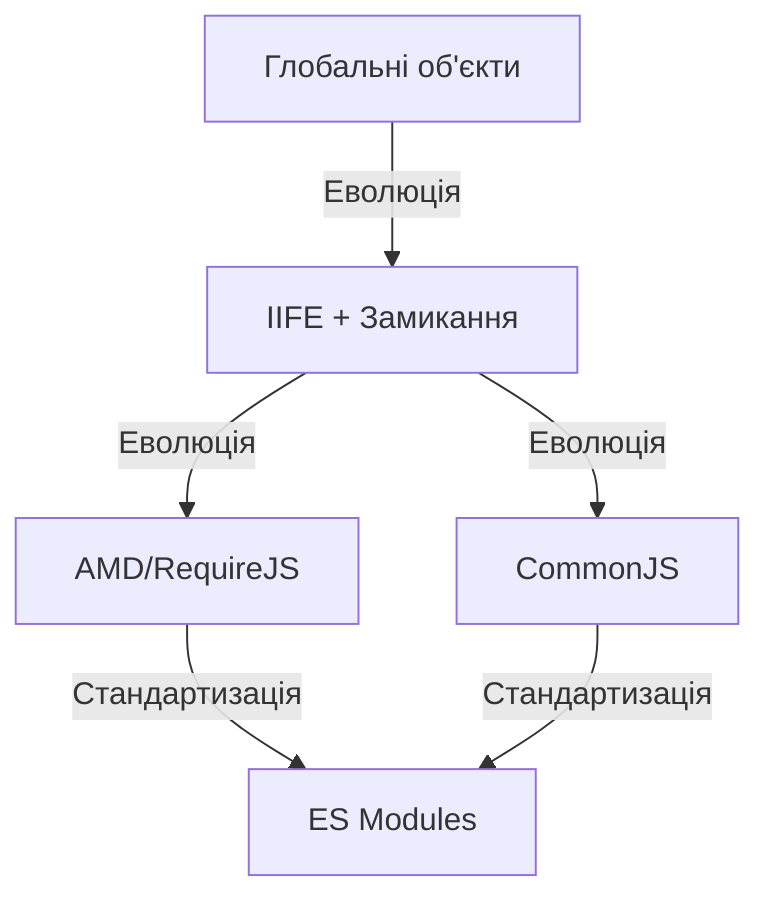
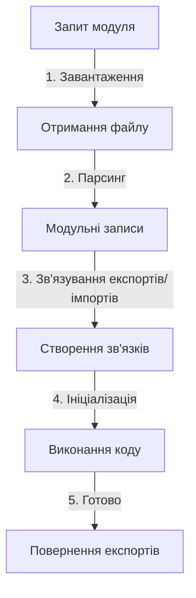

# JavaScript/TypeScript: Модулі

Модулі — це механізм організації коду в окремі, повторно використовувані частини. Вони дозволяють розділяти великі програми на менші, більш керовані фрагменти, кожен з яких має свою функціональність і може бути імпортований та використаний в інших частинах програми.

## Загальний огляд

Модулі в JavaScript:

-   Дозволяють інкапсулювати код та уникнути засмічення глобального простору імен
-   Забезпечують явні залежності між частинами коду
-   Роблять код більш організованим, тестованим і підтримуваним
-   Існують у кількох форматах: CommonJS (в основному Node.js), ES Modules (сучасний стандарт) та інші

## Еволюція модульних систем у JavaScript

Історично JavaScript не мав вбудованої системи модулів, що призвело до розробки різних підходів:



1. **Глобальні об'єкти та простори імен** — ранній підхід без справжньої ізоляції
2. **IIFE (Immediately Invoked Function Expressions)** — створення ізольованих областей видимості
3. **CommonJS** — перша популярна модульна система, використовується в Node.js
4. **AMD (Asynchronous Module Definition)** — альтернатива для браузерів з асинхронним завантаженням
5. **UMD (Universal Module Definition)** — гібрид, що працює як в Node.js, так і в браузерах
6. **ES Modules** — офіційний стандарт модулів в JavaScript (ES6+)

## ES Modules (ESM)

ES Modules — це стандартна модульна система JavaScript, представлена в ES6 (ES2015). Вона використовує ключові слова `import` і `export` для обміну функціональністю між файлами.

### Експорт (export)

#### 1. Іменований експорт

```javascript
// math.js

// Експорт окремих змінних/функцій/класів
export const PI = 3.14159;
export function add(a, b) {
    return a + b;
}

// Альтернативний синтаксис: експорт в кінці файлу
const subtract = (a, b) => a - b;
const multiply = (a, b) => a * b;
class Calculator {}

// Експорт кількох елементів одночасно
export { subtract, multiply, Calculator };

// Експорт з перейменуванням
const divide = (a, b) => a / b;
export { divide as division };
```

#### 2. Експорт за замовчуванням (default export)

```javascript
// user.js

// Варіант 1: пряме оголошення з export default
export default class User {
  constructor(name) {
    this.name = name;
  }
}

// Варіант 2: окреме оголошення і потім експорт
function createUser(name) {
  return new User(name);
}
export default createUser;

// Варіант 3: анонімна функція/об'єкт як експорт за замовчуванням
export default function(name) {
  return {
    name,
    greet() {
      return `Hello, ${name}!`;
    }
  };
}
```

#### 3. Повторний експорт (re-export)

```javascript
// api.js - модуль, який збирає і повторно експортує функціональність з інших модулів

// Повторний експорт всього вмісту модуля
export * from "./math.js";

// Повторний експорт конкретних елементів
export { User, createUser } from "./user.js";

// Повторний експорт з перейменуванням
export { add as sum, subtract as minus } from "./math.js";

// Повторний експорт default як іменований експорт
export { default as userFactory } from "./user.js";
```

### Імпорт (import)

#### 1. Іменований імпорт

```javascript
// app.js

// Імпорт конкретних елементів
import { PI, add } from "./math.js";
console.log(PI); // 3.14159
console.log(add(2, 3)); // 5

// Імпорт з перейменуванням
import { subtract as minus, division } from "./math.js";
console.log(minus(10, 5)); // 5
console.log(division(10, 2)); // 5

// Імпорт всіх експортів як простір імен
import * as MathUtils from "./math.js";
console.log(MathUtils.PI); // 3.14159
console.log(MathUtils.multiply(2, 3)); // 6
```

#### 2. Імпорт експорту за замовчуванням

```javascript
// app.js

// Імпорт default експорту
import User from "./user.js";
const john = new User("John");

// Можна вказати будь-яке ім'я для default імпорту
import UserFactory from "./user.js"; // Те саме, що й import createUser
const createJohn = UserFactory("John");

// Комбінований імпорт default та іменованих експортів
import Database, { connect, query } from "./database.js";
```

#### 3. Динамічний імпорт

```javascript
// app.js

// Статичний імпорт (на рівні модуля)
import { add } from "./math.js";

// Динамічний імпорт (під час виконання)
async function loadModule() {
    try {
        // Повертає проміс, який резолвиться до модуля
        const mathModule = await import("./math.js");
        console.log(mathModule.add(2, 3)); // 5

        // Деструктуризація модуля
        const { multiply } = await import("./math.js");
        console.log(multiply(2, 3)); // 6
    } catch (error) {
        console.error("Помилка завантаження модуля:", error);
    }
}

// Можна використовувати для умовного завантаження
if (condition) {
    import("./feature.js")
        .then((module) => module.enableFeature())
        .catch((err) => console.error(err));
}
```

### Особливості ES Modules

#### 1. Строгий режим (strict mode)

Модулі ES завжди виконуються в строгому режимі, навіть якщо ви не вказуєте `"use strict"`.

```javascript
// module.js
x = 10; // ReferenceError: x is not defined (через strict mode)
```

#### 2. Лексична область видимості верхнього рівня

`this` на верхньому рівні модуля має значення `undefined`, а не глобального об'єкту, як у звичайних скриптах.

```javascript
// module.js
console.log(this); // undefined

// script.js (не модуль)
console.log(this); // window (в браузері)
```

#### 3. Єдиний екземпляр

Модулі завантажуються та виконуються лише один раз, незалежно від того, скільки разів вони імпортуються.

```javascript
// counter.js
let count = 0;
export function increment() {
    count++;
    return count;
}

// a.js
import { increment } from "./counter.js";
console.log(increment()); // 1

// b.js
import { increment } from "./counter.js";
console.log(increment()); // 2 (не 1, бо модуль має спільний стан)
```

#### 4. Циклічні залежності

ES модулі підтримують циклічні залежності, хоча їх варто уникати.

```javascript
// a.js
import { b } from "./b.js";
export const a = "Module A";
console.log("In A:", b); // 'Module B' або undefined, залежно від порядку виконання

// b.js
import { a } from "./a.js";
export const b = "Module B";
console.log("In B:", a); // 'Module A' або undefined, залежно від порядку виконання
```

## CommonJS (CJS)

CommonJS — це модульна система, яка стала стандартом для Node.js. Вона використовує функції `require()` та об'єкт `module.exports` для обміну функціональністю між файлами.

### Експорт

#### 1. Експорт через module.exports

```javascript
// math.js

// Експорт об'єкта з функціями
module.exports = {
    PI: 3.14159,
    add: function (a, b) {
        return a + b;
    },
    subtract: function (a, b) {
        return a - b;
    },
};

// АБО експорт одного значення/функції/класу
module.exports = function add(a, b) {
    return a + b;
};
```

#### 2. Експорт через exports

```javascript
// math.js

// exports є посиланням на module.exports
exports.PI = 3.14159;
exports.add = function (a, b) {
    return a + b;
};
exports.subtract = function (a, b) {
    return a - b;
};

// УВАГА: не можна присвоювати exports напряму, бо це порушує посилання
// exports = { PI: 3.14159 }; // Це НЕ працює!
```

### Імпорт

#### Імпорт за допомогою require()

```javascript
// app.js

// Імпорт модуля з об'єктом
const math = require("./math.js");
console.log(math.PI); // 3.14159
console.log(math.add(2, 3)); // 5

// Імпорт з деструктуризацією
const { PI, subtract } = require("./math.js");
console.log(PI); // 3.14159
console.log(subtract(10, 5)); // 5

// Якщо експортується одна функція/об'єкт
const add = require("./math.js");
console.log(add(2, 3)); // 5
```

### Особливості CommonJS

#### 1. Синхронне завантаження

CommonJS завантажує модулі синхронно, що працює добре в Node.js, але не підходить для браузерів без додаткових інструментів.

```javascript
// Блокує виконання, поки модуль не завантажиться
const fs = require("fs");
```

#### 2. Кешування модулів

Модулі кешуються після першого завантаження, забезпечуючи єдиний екземпляр.

```javascript
// counter.js
let count = 0;
module.exports = {
    increment: function () {
        count++;
        return count;
    },
};

// app.js
const counter1 = require("./counter.js");
const counter2 = require("./counter.js");

console.log(counter1.increment()); // 1
console.log(counter2.increment()); // 2 (не 1, бо це той самий об'єкт)
console.log(counter1 === counter2); // true
```

#### 3. Циклічні залежності

CommonJS також підтримує циклічні залежності, але з певними обмеженнями.

```javascript
// a.js
console.log("Module A is loading");
const b = require("./b.js");
console.log("In A, b.value:", b.value);
module.exports = { value: "A" };

// b.js
console.log("Module B is loading");
const a = require("./a.js");
console.log("In B, a.value:", a ? a.value : "undefined");
module.exports = { value: "B" };

// Вивід:
// Module A is loading
// Module B is loading
// In B, a.value: undefined
// In A, b.value: B
```

У циклічних залежностях один з модулів отримає частково заповнений об'єкт експорту.

## Порівняння ESM та CommonJS

### Синтаксичні відмінності

| Функціональність            | ES Modules                   | CommonJS                                 |
| --------------------------- | ---------------------------- | ---------------------------------------- |
| Синтаксис експорту          | `export`, `export default`   | `module.exports`, `exports`              |
| Синтаксис імпорту           | `import`, `import()`         | `require()`                              |
| Іменований експорт          | `export { name }`            | `exports.name = ...`                     |
| Експорт за замовчуванням    | `export default value`       | `module.exports = value`                 |
| Динамічний імпорт           | `import('./module.js')`      | `require(path)`                          |
| Перейменування при експорті | `export { name as newName }` | `exports.newName = name`                 |
| Перейменування при імпорті  | `import { name as newName }` | `const { name: newName } = require(...)` |

### Функціональні відмінності

| Характеристика             | ES Modules                                               | CommonJS                              |
| -------------------------- | -------------------------------------------------------- | ------------------------------------- |
| Завантаження               | Асинхронне                                               | Синхронне                             |
| Час аналізу                | Під час компіляції (статично)                            | Під час виконання (динамічно)         |
| Hoisting імпортів          | Так                                                      | Ні                                    |
| Прямий доступ до імпортів  | Ні (тільки через імена)                                  | Так (`require.cache`)                 |
| Циклічні залежності        | Краща підтримка через попередній аналіз                  | Обмежена підтримка                    |
| Автоматичний строгий режим | Так                                                      | Ні                                    |
| Завантаження частин модуля | Так (tree-shaking)                                       | Ні (завантажує весь модуль)           |
| Імпорт JSON                | `import json from './data.json' assert { type: 'json' }` | `const json = require('./data.json')` |

```javascript
// ESM - статичний аналіз, імпорти хойстяться
console.log(add(1, 2)); // Помилка: Cannot access 'add' before initialization
import { add } from "./math.js";

// CommonJS - динамічний аналіз
console.log(add(1, 2)); // Помилка: add is not defined
const { add } = require("./math.js");
console.log(add(1, 2)); // 3 - працює після require
```

## Використання модулів у різних середовищах

### 1. Node.js

Node.js традиційно використовує CommonJS, але з версії 12+ підтримує і ES Modules.

#### CommonJS в Node.js

```javascript
// math.js
exports.add = (a, b) => a + b;
exports.subtract = (a, b) => a - b;

// app.js
const math = require("./math.js");
console.log(math.add(5, 3)); // 8
```

#### ES Modules в Node.js

Для використання ES Modules в Node.js потрібно:

1. Встановити розширення файлу `.mjs` або
2. Додати `"type": "module"` в package.json або
3. Використовувати прапорець `--input-type=module`

```javascript
// math.mjs АБО math.js з "type": "module" в package.json
export const add = (a, b) => a + b;
export const subtract = (a, b) => a - b;

// app.mjs АБО app.js з "type": "module" в package.json
import { add, subtract } from "./math.js";
console.log(add(5, 3)); // 8
```

### 2. Браузери

Сучасні браузери підтримують ES Modules напряму через атрибут `type="module"`.

```html
<!-- index.html -->
<!DOCTYPE html>
<html>
    <head>
        <script type="module">
            import { add } from "./math.js";
            console.log(add(2, 3)); // 5
        </script>

        <!-- Зовнішній скрипт-модуль -->
        <script type="module" src="app.js"></script>

        <!-- Для старих браузерів (запасний варіант) -->
        <script nomodule src="legacy-app.js"></script>
    </head>
    <body>
        <!-- Вміст сторінки -->
    </body>
</html>
```

```javascript
// math.js
export const add = (a, b) => a + b;

// app.js
import { add } from "./math.js";
document.addEventListener("DOMContentLoaded", () => {
    console.log(add(5, 10)); // 15
});
```

### 3. Використання з бандлерами

Інструменти збірки, такі як webpack, Rollup, Parcel та esbuild, дозволяють використовувати модулі в будь-якому середовищі, трансформуючи їх у сумісний формат.

#### Webpack

```javascript
// webpack.config.js
module.exports = {
    entry: "./src/app.js",
    output: {
        filename: "bundle.js",
        path: __dirname + "/dist",
    },
    // Інші налаштування...
};

// src/math.js - може використовувати ESM або CommonJS
export const add = (a, b) => a + b;

// src/app.js
import { add } from "./math";
console.log(add(2, 3)); // 5
```

#### Rollup

```javascript
// rollup.config.js
export default {
    input: "src/app.js",
    output: {
        file: "dist/bundle.js",
        format: "iife", // або 'esm', 'cjs', 'umd'
    },
    // Інші налаштування...
};

// Код модулів такий самий, як у прикладі з webpack
```

## Модулі в TypeScript

TypeScript повністю підтримує модульну систему JavaScript з додатковими можливостями для типізації.

### Експорт та імпорт в TypeScript

```typescript
// math.ts
export const PI: number = 3.14159;

export function add(a: number, b: number): number {
    return a + b;
}

export default class Calculator {
    add(a: number, b: number): number {
        return a + b;
    }

    subtract(a: number, b: number): number {
        return a - b;
    }
}

// app.ts
import Calculator, { PI, add } from "./math";

const calc = new Calculator();
console.log(PI); // 3.14159
console.log(add(2, 3)); // 5
console.log(calc.subtract(10, 5)); // 5
```

### Імпорт типів

```typescript
// types.ts
export interface User {
    id: number;
    name: string;
    email: string;
}

export type UserRole = "admin" | "user" | "guest";

export enum UserStatus {
    Active = "active",
    Inactive = "inactive",
    Blocked = "blocked",
}

// user-service.ts
import { User, UserRole, UserStatus } from "./types";

export function createUser(name: string, role: UserRole): User {
    return {
        id: Date.now(),
        name,
        email: `${name.toLowerCase()}@example.com`,
    };
}

const admin: User = createUser("Admin", "admin");
const status: UserStatus = UserStatus.Active;
```

### Імпорт тільки типів

З TypeScript 3.8+ можна імпортувати тільки типи без додавання імпортів у JavaScript-вихід:

```typescript
// user-service.ts
import type { User, UserRole } from "./types";

// Імпорт як значення та тип одночасно
import { UserStatus } from "./types";
```

### Типи модульних систем у TypeScript

TypeScript підтримує різні модульні системи через параметр `module` у `tsconfig.json`:

```json
{
    "compilerOptions": {
        "module": "ESNext" // або "CommonJS", "AMD", "UMD", "System"
        // Інші опції...
    }
}
```

## Найкращі практики роботи з модулями

### 1. Структура проекту

```
project/
├── src/
│   ├── modules/
│   │   ├── users/
│   │   │   ├── index.js        // Реекспорт публічного API модуля
│   │   │   ├── user.model.js   // Визначення даних користувача
│   │   │   ├── user.service.js // Бізнес-логіка
│   │   │   └── user.utils.js   // Допоміжні функції
│   │   └── products/
│   │       ├── index.js
│   │       └── ...
│   ├── utils/
│   │   ├── index.js
│   │   ├── formatters.js
│   │   └── validators.js
│   └── index.js                // Точка входу
├── package.json
└── ...
```

#### Чисті експорти через індексні файли

```javascript
// src/modules/users/index.js
export { User } from "./user.model.js";
export { createUser, updateUser, deleteUser } from "./user.service.js";
export { validateUser } from "./user.utils.js";

// src/index.js
export * from "./modules/users/index.js";
export * from "./modules/products/index.js";
export * from "./utils/index.js";
```

### 2. Кращі практики експорту/імпорту

#### Називайте експорти за замовчуванням осмислено

```javascript
// user.js
// ✅ Правильно: ім'я класу відповідає файлу
export default class User {
  // ...
}

// ❌ Неправильно: складно зрозуміти, що імпортується
export default function() {
  // ...
}
```

#### Віддавайте перевагу іменованим експортам для кращого аналізу коду

```javascript
// utils.js
// ✅ Правильно: чітко що імпортується
export function formatDate(date) {
    /* ... */
}
export function formatCurrency(amount) {
    /* ... */
}

// ❌ Неправильно: менш явно, вимагає знання внутрішньої структури
export default {
    formatDate: function (date) {
        /* ... */
    },
    formatCurrency: function (amount) {
        /* ... */
    },
};
```

#### Уникайте сайд-ефектів у модулях

```javascript
// ❌ Неправильно: сайд-ефект при імпорті
console.log("Module loaded");
document.addEventListener("DOMContentLoaded", setup);

export function doSomething() {
    /* ... */
}

// ✅ Правильно: експорт функції ініціалізації
export function initialize() {
    console.log("Module initialized");
    document.addEventListener("DOMContentLoaded", setup);
}

export function doSomething() {
    /* ... */
}
```

#### Точкові експорти для великих проектів

```javascript
// ✅ Правильно: імпорт тільки потрібних елементів
import { useState, useEffect } from "react";

// ❌ Неправильно: імпорт всього модуля, коли потрібні лише деякі частини
import * as React from "react";
```

### 3. Розділення бізнес-логіки та інфраструктури

```javascript
// ✅ Правильно: розділення за відповідальністю
// db.js - інфраструктурний рівень
export function connectToDatabase() {
    /* ... */
}
export function executeQuery(sql) {
    /* ... */
}

// user-repository.js - шар доступу до даних
import { executeQuery } from "./db.js";
export async function findUserById(id) {
    return executeQuery("SELECT * FROM users WHERE id = ?", [id]);
}

// user-service.js - бізнес-логіка
import { findUserById } from "./user-repository.js";
export async function getUserProfile(id) {
    const user = await findUserById(id);
    // Бізнес-логіка обробки профілю...
    return { ...user, lastActive: formatDate(user.lastLogin) };
}
```

## Підкапотні механізми модульних систем

### Як працюють ES Modules

Завантаження та виконання ES Modules відбувається в три етапи:

1. **Конструювання** — завантаження файлів та розбір на модульні записи
2. **Миттєва зв'язування** — рекурсивне з'єднання експортів та імпортів
3. **Виконання** — виконання коду модулів в правильному порядку



#### Особливості реалізації в браузерах

1. **CORS перевірка** — модулі підпадають під перевірку CORS
2. **Кешування за URL** — модулі кешуються за їх URL
3. **MIME типи** — модулі повинні використовувати коректний MIME тип (`text/javascript`)

```javascript
// Браузер завантажує модулі асинхронно, що дозволяє продовжувати парсинг HTML
<script type="module" src="app.js"></script>
```

#### Особливості реалізації в Node.js

1. **Розширення файлів** — потрібно явно вказувати розширення в шляхах імпорту
2. **Розширення протоколу file:** — імпорти транслюються в file: URL
3. **package.json для конфігурації** — параметр `"type": "module"` або `.mjs`

```javascript
// Імпорти в Node.js ESM вимагають розширень
import { add } from "./math.js"; // Потрібно .js
```

### Як працює CommonJS

CommonJS працює за принципом "виконати та кешувати":

1. **Резолюція модуля** — пошук файлу за шляхом (з різними розширеннями)
2. **Обгортання в функцію** — код модуля обгортається в функцію
3. **Виконання** — функція виконується з параметрами `module`, `exports`, `require`, тощо
4. **Кешування** — результат зберігається в `require.cache`

```javascript
// Спрощений псевдо-код реалізації require
function require(path) {
    // Перевірка кешу
    if (require.cache[resolvedPath]) {
        return require.cache[resolvedPath].exports;
    }

    // Створення об'єкта модуля
    const module = {
        exports: {},
        loaded: false,
        // інші властивості...
    };

    // Додавання в кеш
    require.cache[resolvedPath] = module;

    // Читання та виконання коду
    const moduleCode = fs.readFileSync(resolvedPath, "utf8");

    // Обгортання в функцію та виконання
    const moduleFunction = new Function(
        "module",
        "exports",
        "require",
        "__dirname",
        "__filename",
        moduleCode + "\n return module.exports;"
    );

    // Виконання модуля
    moduleFunction(module, module.exports, require, dirname, filename);
    module.loaded = true;

    // Повернення експортів
    return module.exports;
}
```

### Трансформація модулів через інструменти збірки

Інструменти збірки, такі як webpack, Rollup та esbuild, трансформують модулі різних форматів у сумісний код:

1. **Побудова графу залежностей** — аналіз імпортів для створення графу модулів
2. **Трансформація** — перетворення синтаксису модулів на сумісний код
3. **Склеювання** — об'єднання модулів в один або кілька файлів
4. **Оптимізації** — видалення невикористаного коду (tree-shaking), мінімізація, тощо

```javascript
// Оригінальний код з ES модулями
// math.js
export function add(a, b) {
    return a + b;
}

// app.js
import { add } from "./math.js";
console.log(add(2, 3));

// Трансформований у звичайний JavaScript (спрощено)
(function () {
    // math.js
    function add(a, b) {
        return a + b;
    }

    // app.js
    console.log(add(2, 3));
})();
```

### Оптимізація: Tree Shaking

Tree shaking — це оптимізація, яка видаляє невикористаний код при збірці, працює тільки з ESM через статичний аналіз.

```javascript
// utils.js
export function add(a, b) {
    return a + b;
}

export function subtract(a, b) {
    return a - b;
}

export function multiply(a, b) {
    return a * b;
}

// app.js
import { add } from "./utils.js";
console.log(add(2, 3));

// Після tree shaking буде включено тільки функцію add,
// subtract і multiply будуть видалені з фінального бандлу
```

## Проблеми та їх вирішення

### 1. Циклічні залежності

Циклічні залежності виникають, коли модуль A імпортує модуль B, а B імпортує A.

```javascript
// a.js
import { b } from "./b.js";
export const a = "Module A";
console.log("Value of b:", b); // undefined у CommonJS, правильне значення в ESM

// b.js
import { a } from "./a.js";
export const b = "Module B";
console.log("Value of a:", a); // undefined в обох системах
```

#### Вирішення:

1. **Реструктуризація модулів** — розділення на менші модулі
2. **Перенесення спільної функціональності** — створення спільного модуля
3. **Використання динамічних імпортів** — імпорт під час виконання

```javascript
// shared.js
export const shared = "Shared functionality";

// a.js
import { shared } from "./shared.js";
export const a = "Module A using " + shared;

// b.js
import { shared } from "./shared.js";
export const b = "Module B using " + shared;
```

### 2. Динамічні шляхи для імпорту

ESM не підтримує динамічні шляхи для статичних імпортів.

```javascript
// ❌ Не працює
const moduleName = 'math';
import { add } from `./${moduleName}.js`; // Помилка синтаксису
```

#### Вирішення:

1. **Динамічний імпорт**:

```javascript
// ✅ Працює
const moduleName = "math";
import(`./${moduleName}.js`).then((module) => {
    console.log(module.add(2, 3));
});
```

2. **Імпорт всіх можливих модулів і вибір під час виконання**:

```javascript
// ✅ Також працює, але не оптимально
import * as mathModule from "./math.js";
import * as stringModule from "./string.js";

const modules = {
    math: mathModule,
    string: stringModule,
};

const moduleName = "math";
const selectedModule = modules[moduleName];
console.log(selectedModule.add(2, 3));
```

### 3. Проблеми сумісності ESM і CommonJS

#### Імпорт ESM в CommonJS

CommonJS не може напряму використовувати `await import()`:

```javascript
// ❌ Не працює в CommonJS на верхньому рівні
await import("./esm-module.js"); // SyntaxError: await is only valid in async functions

// ✅ Працює в асинхронній функції
async function loadModule() {
    const module = await import("./esm-module.js");
    return module;
}
```

#### Імпорт CommonJS в ESM

Імпорт CommonJS модулів в ESM вимагає додаткових кроків:

```javascript
// CommonJS модуль
// cjs-module.js
module.exports = {
    hello: "world",
};

// ESM модуль
// esm-module.js
// ✅ Працює, але немає доступу до exports як об'єкту
import { hello } from "./cjs-module.js";
console.log(hello); // 'world'

// ✅ Працює, дає доступ до default
import cjsModule from "./cjs-module.js";
console.log(cjsModule.hello); // 'world'

// ✅ Найбільш гнучкий варіант
import * as cjsModule from "./cjs-module.js";
console.log(cjsModule.default.hello); // 'world'
```

### 4. Типові проблеми з бандлерами

#### Корегування імпортів для Node.js і браузера

```javascript
// package.json
{
  "name": "my-package",
  "main": "dist/index.cjs.js",  // Для CommonJS
  "module": "dist/index.esm.js", // Для ESM
  "browser": "dist/index.umd.js", // Для браузерів
  "exports": {
    ".": {
      "require": "./dist/index.cjs.js",
      "import": "./dist/index.esm.js",
      "browser": "./dist/index.umd.js"
    }
  }
}
```

#### Вирішення проблем з неправильними шляхами

```javascript
// webpack.config.js
module.exports = {
  // ...
  resolve: {
    extensions: ['.js', '.jsx', '.ts', '.tsx'],
    alias: {
      '@': path.resolve(__dirname, 'src') // Дозволяє імпортувати через @/components/...
    }
  }
};

// tsconfig.json
{
  "compilerOptions": {
    "baseUrl": ".",
    "paths": {
      "@/*": ["src/*"]
    }
  }
}
```

## Сучасні можливості та майбутні тенденції

### 1. Import maps (для браузерів)

Import maps дозволяють контролювати, як браузер резолвить модулі.

```html
<script type="importmap">
    {
        "imports": {
            "lodash": "https://cdn.skypack.dev/lodash",
            "react": "https://cdn.jsdelivr.net/npm/react/umd/react.production.min.js",
            "components/": "/src/components/"
        }
    }
</script>

<script type="module">
    import _ from "lodash"; // Резолвиться в https://cdn.skypack.dev/lodash
    import React from "react"; // Резолвиться в URL з CDN
    import { Button } from "components/Button.js"; // Резолвиться в /src/components/Button.js
</script>
```

### 2. JSON модулі

Нативна підтримка імпорту JSON файлів у ESM.

```javascript
// В Node.js з флагом --experimental-json-modules або з assert
import data from "./data.json" assert { type: "json" };
console.log(data.name);

// В браузерах
import config from "./config.json" assert { type: "json" };
```

### 3. CSS модулі

Імпорт CSS як модулів (підтримується в бандлерах, експериментально в браузерах).

```javascript
// В бандлерах (webpack, etc.)
import styles from "./styles.css";
element.className = styles.container;

// Експериментально в браузерах
import styles from "./styles.css" assert { type: "css" };
document.adoptedStyleSheets = [styles];
```

### 4. WebAssembly модулі

Нативний імпорт WebAssembly модулів.

```javascript
// Імпорт WebAssembly модулів
import * as wasm from "./module.wasm";

// Або з assert
import { add } from "./math.wasm" assert { type: "webassembly" };
console.log(add(1, 2)); // 3
```

### 5. Worker модулі

Модулі для Web Workers з ESM синтаксисом.

```javascript
// Створення Worker з модулем
const worker = new Worker("./worker.js", { type: "module" });

// worker.js
import { heavyCalculation } from "./calculations.js";

self.onmessage = function (event) {
    const result = heavyCalculation(event.data);
    self.postMessage(result);
};
```

## Висновки

1. **Модулі — це фундаментальний механізм** для організації коду в JavaScript та TypeScript, забезпечуючи інкапсуляцію, перевикористання та підтримуваність.

2. **Існує кілька модульних систем**:

    - **CommonJS** — традиційна система для Node.js з синхронними `require()`
    - **ES Modules** — сучасний стандарт з `import`/`export` синтаксисом
    - Інші історичні формати: AMD, UMD, тощо

3. **ES Modules мають ключові переваги**:

    - Статичний аналіз, що дозволяє оптимізації (tree-shaking)
    - Асинхронне завантаження
    - Підтримка циклічних залежностей
    - Нативна підтримка в сучасних браузерах

4. **Інструменти збірки** дозволяють використовувати модулі в будь-якому середовищі, трансформуючи їх у сумісний формат.

5. **TypeScript розширює** можливості модулів з додатковими функціями для типізації.

6. **Майбутні тенденції** включають import maps, JSON/CSS/WebAssembly модулі, що розширюють можливості модульної системи.

Модульний підхід є одним з наріжних каменів сучасної розробки JavaScript, дозволяючи створювати масштабовані, підтримувані та ефективні додатки.
