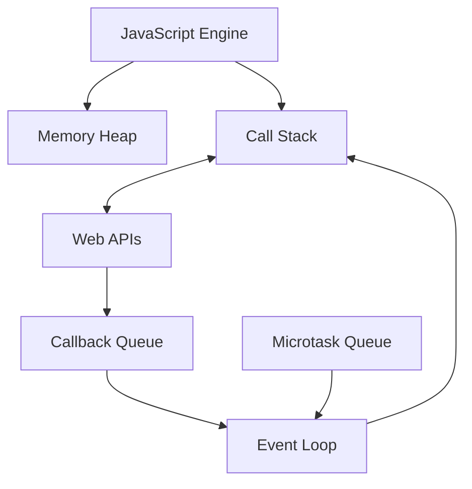
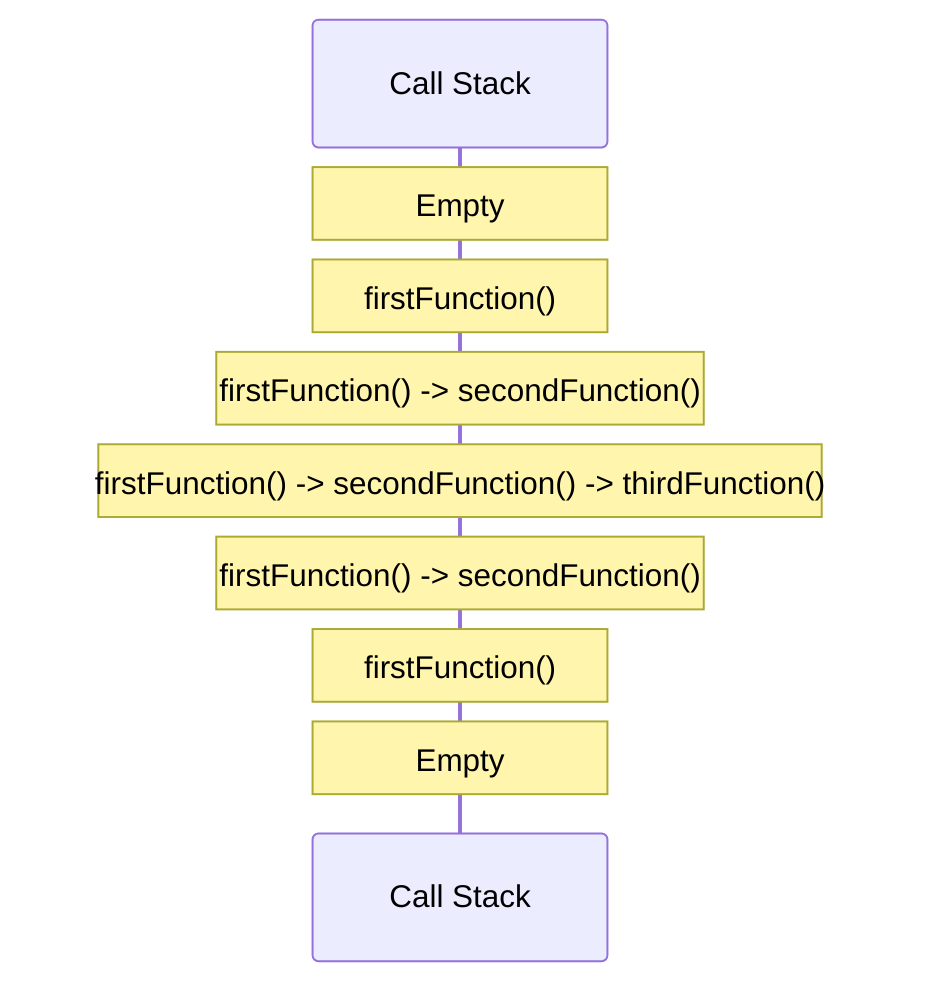
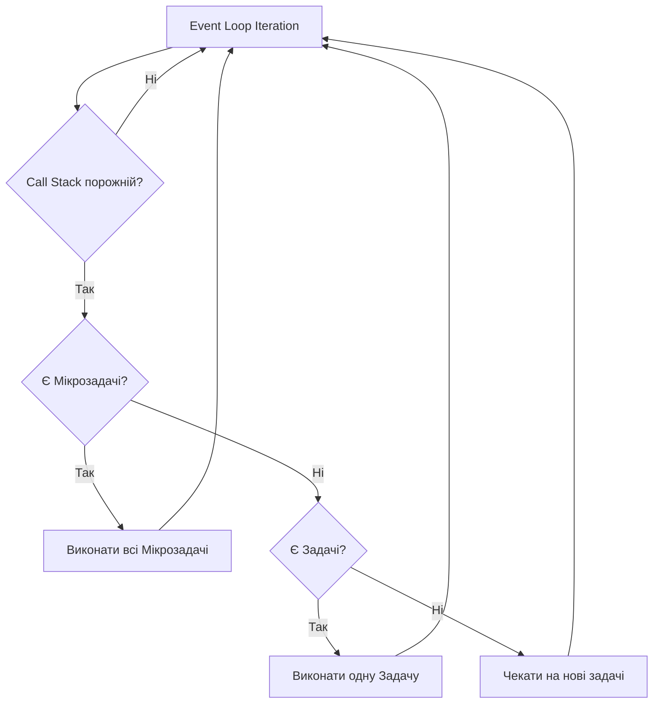
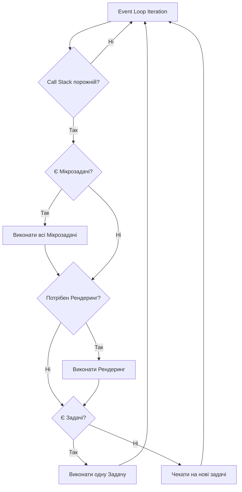

# JavaScript: Event Loop

Event Loop (Цикл подій) — це фундаментальний механізм JavaScript, який дозволяє виконувати асинхронні операції в однопоточному середовищі. Він забезпечує неблокуючу поведінку JavaScript, дозволяючи коду продовжувати виконуватися, поки чекає на завершення таких операцій, як запити до сервера, таймери або події користувацького інтерфейсу.

## Загальний огляд архітектури JavaScript

JavaScript є однопоточною мовою програмування, що означає, що він може виконувати лише одну операцію за раз. Однак завдяки Event Loop, JavaScript може працювати асинхронно, що створює ілюзію багатопотоковості.



Основні компоненти архітектури:

1. **JavaScript Engine**: Середовище виконання JavaScript (V8, SpiderMonkey, JavaScriptCore).
2. **Memory Heap**: Область пам'яті, де зберігаються об'єкти та змінні.
3. **Call Stack**: Стек викликів функцій.
4. **Web APIs**: Функціональність, що надається браузером або Node.js (DOM, setTimeout, fetch, тощо).
5. **Task Queue (Callback Queue)**: Черга колбеків для асинхронних операцій.
6. **Microtask Queue**: Черга для мікрозадач з високим пріоритетом (Promise).
7. **Event Loop**: Механізм, який перевіряє стек і черги та координує виконання.

## Call Stack (Стек викликів)

Call Stack — це структура даних, яка відстежує поточне місце виконання програми. Коли виконується функція, вона додається (push) на вершину стеку, а коли функція завершує виконання, вона видаляється (pop) зі стеку.

### Принцип роботи Call Stack

```javascript
function firstFunction() {
    console.log("I'm the first function");
    secondFunction();
    console.log("First function ends");
}

function secondFunction() {
    console.log("I'm the second function");
    thirdFunction();
    console.log("Second function ends");
}

function thirdFunction() {
    console.log("I'm the third function");
    console.log("Third function ends");
}

firstFunction();
```

Процес виконання коду:

1. `firstFunction()` додається до стеку
2. Виводиться "I'm the first function"
3. `secondFunction()` додається до стеку
4. Виводиться "I'm the second function"
5. `thirdFunction()` додається до стеку
6. Виводиться "I'm the third function"
7. Виводиться "Third function ends"
8. `thirdFunction()` видаляється зі стеку
9. Виводиться "Second function ends"
10. `secondFunction()` видаляється зі стеку
11. Виводиться "First function ends"
12. `firstFunction()` видаляється зі стеку



### Stack Overflow

Stack Overflow (переповнення стеку) виникає, коли стек викликів перевищує свій розмір, зазвичай через нескінченну рекурсію:

```javascript
function recursiveFunction() {
    recursiveFunction(); // Нескінченна рекурсія призведе до Stack Overflow
}

recursiveFunction();
// Uncaught RangeError: Maximum call stack size exceeded
```

Кожен браузер/середовище має обмеження на розмір стеку. У більшості сучасних браузерів це 10,000-50,000 викликів.

### Порівняння синхронного та асинхронного коду

#### Синхронний код

```javascript
function syncOperation() {
    console.log("Start");
    // Блокуюча операція (імітація важких обчислень)
    const startTime = Date.now();
    while (Date.now() - startTime < 3000) {
        // Блокуючий цикл на 3 секунди
    }
    console.log("End after blocking");
}

syncOperation();
console.log("This logs after the sync operation completes");

// Вивід:
// Start
// End after blocking
// This logs after the sync operation completes
```

#### Асинхронний код

```javascript
function asyncOperation() {
    console.log("Start");

    setTimeout(() => {
        console.log("End after timeout");
    }, 3000);
}

asyncOperation();
console.log("This logs before the async operation completes");

// Вивід:
// Start
// This logs before the async operation completes
// End after timeout (через 3 секунди)
```

У асинхронному коді функція зворотного виклику (callback) знімається зі стеку і відправляється в Web API, звільняючи стек для виконання інших операцій.

## Task Queue (Черга задач)

Task Queue (також відома як Callback Queue або Macrotask Queue) — це черга, яка зберігає колбеки асинхронних операцій, готових до виконання. Коли стек викликів спорожняється, Event Loop бере наступний колбек з черги і додає його до стеку для виконання.

### Основні джерела задач (macrotasks)

1. **setTimeout, setInterval**: Таймери
2. **setImmediate**: Негайне виконання (переважно в Node.js)
3. **requestAnimationFrame**: Анімація в браузері
4. **I/O операції**: Мережеві запити, файлові операції
5. **UI події**: Кліки, введення даних, тощо
6. **postMessage, MessageChannel**: Комунікація між вікнами/воркерами

### Приклад з setTimeout

```javascript
console.log("Script start");

setTimeout(() => {
    console.log("setTimeout callback");
}, 0);

console.log("Script end");

// Вивід:
// Script start
// Script end
// setTimeout callback
```

Навіть з нульовою затримкою, колбек `setTimeout` виконується після синхронного коду, оскільки він спочатку потрапляє в чергу задач, а Event Loop може взяти його тільки після спорожнення стеку викликів.

## Microtask Queue (Черга мікрозадач)

Microtask Queue — це окрема черга для мікрозадач, які мають вищий пріоритет, ніж звичайні задачі. Після кожного виконання макрозадачі (і спорожнення стеку викликів) Event Loop обробляє всі мікрозадачі в черзі, перш ніж перейти до наступної макрозадачі.

### Основні джерела мікрозадач

1. **Promise.then/catch/finally**: Обробники промісів
2. **queueMicrotask()**: Пряме додавання в мікрочергу
3. **process.nextTick()**: Node.js-специфічний API (має найвищий пріоритет в Node.js)
4. **MutationObserver**: Спостереження за змінами в DOM
5. **IntersectionObserver callbacks**: Спостереження за перетинами елементів

### Приклад з Promise

```javascript
console.log("Script start");

setTimeout(() => {
    console.log("setTimeout callback");
}, 0);

Promise.resolve()
    .then(() => console.log("Promise.then 1"))
    .then(() => console.log("Promise.then 2"));

console.log("Script end");

// Вивід:
// Script start
// Script end
// Promise.then 1
// Promise.then 2
// setTimeout callback
```

У цьому прикладі, хоча `setTimeout` викликається перед створенням промісу, обробники `.then()` виконуються раніше, оскільки вони поміщаються в чергу мікрозадач, яка має пріоритет над чергою задач.

### Порівняння обробки обіцянок (Promises) та setTimeout

```javascript
console.log("Start");

setTimeout(() => {
    console.log("Timeout 1");
    Promise.resolve().then(() => console.log("Promise inside Timeout"));
    setTimeout(() => console.log("Timeout inside Timeout"), 0);
}, 0);

Promise.resolve().then(() => {
    console.log("Promise 1");
    setTimeout(() => console.log("Timeout inside Promise"), 0);
    Promise.resolve().then(() => console.log("Promise inside Promise"));
});

console.log("End");

// Вивід:
// Start
// End
// Promise 1
// Promise inside Promise
// Timeout 1
// Promise inside Timeout
// Timeout inside Promise
// Timeout inside Timeout
```

Цей складний приклад демонструє, як переплітаються макро- та мікрозадачі:

1. Синхронний код виконується першим: 'Start', 'End'
2. Мікрозадачі виконуються після спорожнення стеку: 'Promise 1'
3. Вкладені мікрозадачі виконуються одразу: 'Promise inside Promise'
4. Потім йде перша макрозадача: 'Timeout 1'
5. Мікрозадачі з макрозадачі: 'Promise inside Timeout'
6. Наступні макрозадачі: 'Timeout inside Promise', 'Timeout inside Timeout'

## Повний алгоритм Event Loop

Спрощений алгоритм роботи Event Loop:



Детальний алгоритм:

1. **Перевірка стеку**: Виконати все, що є у стеку викликів до його спорожнення
2. **Обробка мікрозадач**: Виконати всі мікрозадачі з черги мікрозадач
3. **Рендеринг** (в браузері): Виконати оновлення рендерингу, якщо потрібно
4. **Виконання макрозадачі**: Вибрати найстарішу задачу з черги задач і виконати її
5. **Повторення**: Повернутися до кроку 1

### Особливості в різних середовищах

#### Браузери

У браузерах Event Loop також відповідає за оновлення рендерингу:



Рендеринг зазвичай відбувається з частотою 60 кадрів на секунду (кожні ~16.7 мс), але може бути пропущений, якщо стек викликів не порожній.

#### Node.js

У Node.js Event Loop дещо складніший і має кілька фаз:

1. **timers**: Виконання колбеків setTimeout() і setInterval()
2. **pending callbacks**: Виконання відкладених колбеків системних операцій
3. **idle, prepare**: Внутрішнє використання
4. **poll**: Отримання нових I/O подій
5. **check**: Виконання колбеків setImmediate()
6. **close callbacks**: Виконання колбеків закриття, наприклад socket.on('close', ...)

## Практичні приклади роботи Event Loop

### Приклад 1: Основна концепція

```javascript
console.log("1 - Start program"); // Синхронний код

setTimeout(() => {
    console.log("4 - setTimeout callback"); // Макрозадача
}, 0);

Promise.resolve().then(() => console.log("3 - Promise callback")); // Мікрозадача

console.log("2 - End program"); // Синхронний код

// Вивід:
// 1 - Start program
// 2 - End program
// 3 - Promise callback
// 4 - setTimeout callback
```

### Приклад 2: Порядок виконання вкладених колбеків

```javascript
console.log("Script start");

setTimeout(() => {
    console.log("Timeout 1");

    Promise.resolve().then(() => {
        console.log("Promise in Timeout");
    });
}, 0);

Promise.resolve().then(() => {
    console.log("Promise 1");

    setTimeout(() => {
        console.log("Timeout in Promise");
    }, 0);
});

console.log("Script end");

// Вивід:
// Script start
// Script end
// Promise 1
// Timeout 1
// Promise in Timeout
// Timeout in Promise
```

### Приклад 3: requestAnimationFrame і Event Loop

`requestAnimationFrame` виконується перед рендерингом, але після мікрозадач:

```javascript
console.log("Start");

setTimeout(() => console.log("Timeout"), 0);

Promise.resolve().then(() => console.log("Promise"));

requestAnimationFrame(() => console.log("Animation Frame"));

console.log("End");

// Вивід у більшості браузерів:
// Start
// End
// Promise
// Animation Frame
// Timeout
```

Зверніть увагу, що `requestAnimationFrame` зазвичай виконується перед наступним циклом рендерингу, тому його позиція може дещо варіюватися між браузерами.

### Приклад 4: Затримка виконання через блокування стеку

```javascript
console.log("Start");

// Блокування стеку викликів
const start = Date.now();
while (Date.now() - start < 1000) {
    // Блокуючий цикл на 1 секунду
}

setTimeout(() => console.log("Timeout"), 0);
Promise.resolve().then(() => console.log("Promise"));

console.log("End");

// Вивід:
// Start
// End
// Promise
// Timeout
```

Хоча `setTimeout` викликається раніше за проміс, проміс все одно виконується першим після блокуючої операції, демонструючи, що черга мікрозадач має пріоритет.

## Складні випадки та підводні камені

### queueMicrotask vs. setTimeout(fn, 0)

`queueMicrotask` додає колбек безпосередньо в чергу мікрозадач, забезпечуючи виконання перед наступною макрозадачею:

```javascript
console.log("Start");

setTimeout(() => console.log("Timeout"), 0);
queueMicrotask(() => console.log("Microtask"));

console.log("End");

// Вивід:
// Start
// End
// Microtask
// Timeout
```

### Мінімальна затримка setTimeout

Браузери встановлюють мінімальну затримку для вкладених викликів `setTimeout`, зазвичай 4 мс для неактивних вкладок:

```javascript
let count = 0;
const start = Date.now();

function increment() {
    count++;

    if (count < 10) {
        setTimeout(increment, 0);
    } else {
        console.log(`Виконано 10 setTimeout за ${Date.now() - start} мс`);
    }
}

increment();
// Виведе приблизно: "Виконано 10 setTimeout за 40-50 мс"
// Замість теоретичних 0 мс
```

### Циклічні промісові ланцюжки

Безкінечні промісові ланцюжки можуть блокувати Event Loop:

```javascript
function createEndlessPromiseChain() {
    Promise.resolve().then(() => {
        console.log("Microtask executed");
        createEndlessPromiseChain(); // Рекурсивний виклик створює нескінченний ланцюжок мікрозадач
    });
}

createEndlessPromiseChain();
setTimeout(() => console.log("This will never run"), 0);
```

Цей код створює безкінечний ланцюжок мікрозадач, блокуючи Event Loop від переходу до макрозадач.

### Різниця між process.nextTick() і setImmediate() в Node.js

```javascript
// Node.js-специфічний код
console.log("Start");

setImmediate(() => {
    console.log("setImmediate");
});

process.nextTick(() => {
    console.log("nextTick");
});

setTimeout(() => {
    console.log("setTimeout");
}, 0);

Promise.resolve().then(() => {
    console.log("Promise");
});

console.log("End");

// Вивід:
// Start
// End
// nextTick
// Promise
// setTimeout
// setImmediate
```

`process.nextTick()` має найвищий пріоритет в Node.js і виконується навіть перед мікрозадачами.

## Внутрішня реалізація Event Loop

### Event Loop у браузерах

Специфікація HTML описує Event Loop як безперервний цикл, де браузер:

1. Вибирає найстарішу задачу з черги задач
2. Виконує її до завершення
3. Виконує всі мікрозадачі до спорожнення черги мікрозадач
4. Оновлює рендеринг, якщо потрібно
5. Повертається до початку циклу

```javascript
// Псевдокод браузерного Event Loop
while (true) {
    queue = getNextQueue();
    task = queue.oldestTask();
    if (task) {
        runTask(task);

        // Виконати всі мікрозадачі
        while (microtaskQueue.hasMore()) {
            microtask = microtaskQueue.dequeue();
            runMicrotask(microtask);
        }

        // Рендеринг
        if (shouldRender()) {
            render();
        }
    }
}
```

### Event Loop у Node.js

Node.js використовує libuv для реалізації Event Loop. Цикл подій проходить через кілька фаз:

```javascript
// Спрощений псевдокод Node.js Event Loop
while (true) {
    // Фаза таймерів
    runTimerHandlers();

    // Фаза I/O колбеків
    runPendingIOCallbacks();

    // Фаза підготовки (внутрішнє використання)
    prepareNextPhase();

    // Фаза опитування (poll)
    if (hasImmediateCallbacks() || hasTimers()) {
        // Скоротити фазу опитування, якщо є інші завдання
        runPollShortly();
    } else {
        // Очікувати на події
        runPollForEvents();
    }

    // Фаза перевірки (setImmediate)
    runImmediateCallbacks();

    // Фаза закриття колбеків
    runCloseCallbacks();

    // Перевірка, чи закінчити цикл
    if (shouldExit()) {
        break;
    }
}
```

## Оптимізація продуктивності з розумінням Event Loop

### Уникнення блокування Event Loop

Тривалі синхронні операції можуть блокувати Event Loop, призводячи до "зависання" UI:

```javascript
// ❌ Поганий код: Блокує Event Loop
function calculatePrimes(n) {
    const primes = [];
    for (let i = 2; i <= n; i++) {
        let isPrime = true;
        for (let j = 2; j < i; j++) {
            if (i % j === 0) {
                isPrime = false;
                break;
            }
        }
        if (isPrime) primes.push(i);
    }
    return primes;
}

// Блокує UI при виконанні
const result = calculatePrimes(100000);
console.log(result);
```

#### Розбиття на менші задачі з setTimeout

```javascript
// ✅ Кращий код: Розбиття на менші задачі
function calculatePrimesAsync(n, callback) {
    const primes = [];
    let i = 2;

    function calculateNextBatch() {
        let end = Math.min(i + 1000, n);

        for (; i <= end; i++) {
            let isPrime = true;
            for (let j = 2; j < i; j++) {
                if (i % j === 0) {
                    isPrime = false;
                    break;
                }
            }
            if (isPrime) primes.push(i);
        }

        if (i <= n) {
            // Продовжити в наступному циклі Event Loop
            setTimeout(calculateNextBatch, 0);
        } else {
            // Завершено
            callback(primes);
        }
    }

    calculateNextBatch();
}

calculatePrimesAsync(100000, (result) => {
    console.log(result);
});
```

#### Використання Web Workers

```javascript
// ✅ Найкращий код: Використання Web Worker
// main.js
const worker = new Worker("prime-worker.js");

worker.onmessage = function (event) {
    console.log("Primes calculated:", event.data);
};

worker.postMessage(100000);

// prime-worker.js
self.onmessage = function (event) {
    const n = event.data;
    const primes = calculatePrimes(n);
    self.postMessage(primes);
};

function calculatePrimes(n) {
    // Реалізація як у першому прикладі
    // ...
}
```

Web Workers виконуються в окремому потоці, не блокуючи основний Event Loop.

### Оптимізація черг задач

#### Використання requestAnimationFrame замість setTimeout для анімацій

```javascript
// ❌ Неоптимальний код для анімацій
function animateWithTimeout() {
    let position = 0;

    function update() {
        position += 5;
        element.style.left = position + "px";

        if (position < 1000) {
            setTimeout(update, 16); // ~60 fps
        }
    }

    update();
}

// ✅ Оптимальний код для анімацій
function animateWithRAF() {
    let position = 0;

    function update() {
        position += 5;
        element.style.left = position + "px";

        if (position < 1000) {
            requestAnimationFrame(update);
        }
    }

    requestAnimationFrame(update);
}
```

`requestAnimationFrame` синхронізується з циклом рендерингу браузера, що призводить до плавніших анімацій.

#### Використання queueMicrotask для операцій, які мають відбутися перед рендерингом

```javascript
// Припустимо, нам потрібно виконати кілька DOM-операцій і прочитати результат
function batchDOMOperations() {
    // Змінюємо DOM
    element1.style.width = "100px";
    element2.style.height = "200px";

    // Використовуємо queueMicrotask для читання після всіх змін, але перед рендерингом
    queueMicrotask(() => {
        // Читаємо оновлений DOM
        const width = element1.offsetWidth;
        const height = element2.offsetHeight;
        console.log("Updated dimensions:", width, height);
    });

    // Змінюємо DOM ще
    element3.style.color = "red";
}
```

Це запобігає вимушеному перекомпонуванню (forced reflow) між операціями запису і читання.

## Event Loop в TypeScript

TypeScript успадковує всі особливості Event Loop від JavaScript, але додає можливості типізації для асинхронного коду.

### Типізація колбеків

```typescript
// Типізація функції зворотного виклику для setTimeout
function delayedGreeting(
    name: string,
    callback: (greeting: string) => void
): void {
    setTimeout(() => {
        const greeting = `Hello, ${name}!`;
        callback(greeting);
    }, 1000);
}

delayedGreeting("Alice", (message: string) => {
    console.log(message); // Hello, Alice!
});
```

### Типізація Promise

```typescript
// Створення типізованого Promise
function fetchUserData(userId: number): Promise<User> {
    return new Promise((resolve, reject) => {
        setTimeout(() => {
            if (userId > 0) {
                const user: User = {
                    id: userId,
                    name: "User " + userId,
                    email: `user${userId}@example.com`,
                };
                resolve(user);
            } else {
                reject(new Error("Invalid user ID"));
            }
        }, 1000);
    });
}

interface User {
    id: number;
    name: string;
    email: string;
}

// Використання
fetchUserData(1)
    .then((user: User) => {
        console.log(user.name); // User 1
    })
    .catch((error: Error) => {
        console.error(error.message);
    });
```

### Типізація async/await

```typescript
// async/await з типізацією
async function getUserDetails(userId: number): Promise<UserDetails> {
    try {
        const user: User = await fetchUserData(userId);
        const permissions: string[] = await fetchUserPermissions(userId);

        return {
            user,
            permissions,
            timestamp: new Date(),
        };
    } catch (error) {
        console.error("Error fetching user details:", error);
        throw error;
    }
}

interface UserDetails {
    user: User;
    permissions: string[];
    timestamp: Date;
}

// Використання
getUserDetails(1).then((details: UserDetails) => {
    console.log(
        `${details.user.name} has permissions: ${details.permissions.join(
            ", "
        )}`
    );
});
```

## Найкращі практики роботи з Event Loop

### 1. Уникайте блокування основного потоку

-   Розбивайте тривалі обчислення на менші частини
-   Використовуйте Web Workers для важких обчислень
-   Не виконуйте синхронні AJAX-запити

```javascript
// ✅ Добре: Прогресивна обробка великих масивів
function processLargeArray(array, chunkSize = 1000) {
    let index = 0;

    function processChunk() {
        const chunk = array.slice(index, index + chunkSize);
        index += chunkSize;

        // Обробка частини масиву
        chunk.forEach((item) => {
            // Логіка обробки...
        });

        if (index < array.length) {
            // Запланувати обробку наступної частини
            setTimeout(processChunk, 0);
        }
    }

    processChunk();
}
```

### 2. Використовуйте правильну чергу для завдань

-   Використовуйте мікрозадачі для операцій, які мають відбутися перед наступним рендерингом
-   Використовуйте макрозадачі для відкладених операцій, які не блокують UI

```javascript
// ✅ Добре: Відповідне використання черг
function updateUIElements() {
    // Оновлення DOM
    element.textContent = "New content";
    element.className = "highlighted";

    // Використання мікрозадачі для вимірювань після оновлень, але перед рендерингом
    queueMicrotask(() => {
        const height = element.offsetHeight;
        console.log("Element height after update:", height);
    });

    // Використання макрозадачі для відкладеної дії
    setTimeout(() => {
        element.className = "normal";
    }, 1000);
}
```

### 3. Розуміння пріоритетів виконання

```javascript
// Пам'ятайте про порядок виконання:
console.log("1. Синхронний код");

Promise.resolve().then(() => console.log("3. Мікрозадача (проміс)"));
queueMicrotask(() => console.log("4. Мікрозадача (queueMicrotask)"));

setTimeout(() => console.log("5. Макрозадача (setTimeout)"), 0);
requestAnimationFrame(() =>
    console.log("6. requestAnimationFrame (перед рендерингом)")
);

console.log("2. Ще синхронний код");
```

### 4. Використовуйте async/await для кращої читабельності

```javascript
// ❌ Складний для розуміння код з вкладеними колбеками
function loadData(userId, callback) {
    fetchUser(userId, (user, error) => {
        if (error) {
            callback(null, error);
            return;
        }

        fetchPosts(user.id, (posts, error) => {
            if (error) {
                callback(null, error);
                return;
            }

            callback({ user, posts }, null);
        });
    });
}

// ✅ Чистіший код з async/await
async function loadData(userId) {
    try {
        const user = await fetchUser(userId);
        const posts = await fetchPosts(user.id);
        return { user, posts };
    } catch (error) {
        console.error("Error loading data:", error);
        throw error;
    }
}
```

### 5. Уникайте великих ланцюжків промісів на користь async/await

```javascript
// ❌ Довгий ланцюжок промісів
function processData(input) {
    return step1(input)
        .then((result1) => step2(result1))
        .then((result2) => step3(result2))
        .then((result3) => step4(result3))
        .then((result4) => step5(result4))
        .catch((error) => {
            console.error("Error in processing:", error);
            throw error;
        });
}

// ✅ Чистіший код з async/await
async function processData(input) {
    try {
        const result1 = await step1(input);
        const result2 = await step2(result1);
        const result3 = await step3(result2);
        const result4 = await step4(result3);
        return await step5(result4);
    } catch (error) {
        console.error("Error in processing:", error);
        throw error;
    }
}
```

## Висновки

Event Loop — це критичний механізм в JavaScript, який забезпечує однопоточну модель конкурентності. Розуміння Event Loop дозволяє:

1. **Писати ефективний асинхронний код**, який не блокує основний потік виконання
2. **Уникати поширених помилок**, таких як блокування UI або невідповідність порядку виконання
3. **Оптимізувати продуктивність додатків**, правильно розподіляючи завдання
4. **Розуміти, як працюють асинхронні API** в JavaScript

Ключові моменти:

-   JavaScript використовує однопоточну модель з Event Loop для обробки асинхронних операцій
-   Call Stack відстежує поточне виконання коду
-   Задачі (macrotasks) включають таймери, події та I/O операції
-   Мікрозадачі (microtasks) включають обробники промісів і мають вищий пріоритет
-   Event Loop постійно перевіряє черги задач і виконує їх у правильному порядку
-   Розуміння пріоритетів виконання (синхронний код → мікрозадачі → рендеринг → макрозадачі) критично для ефективного JavaScript
