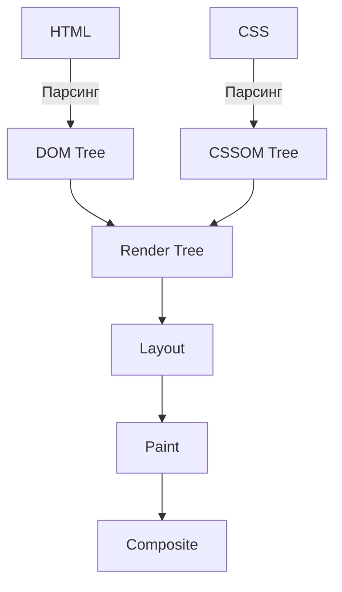
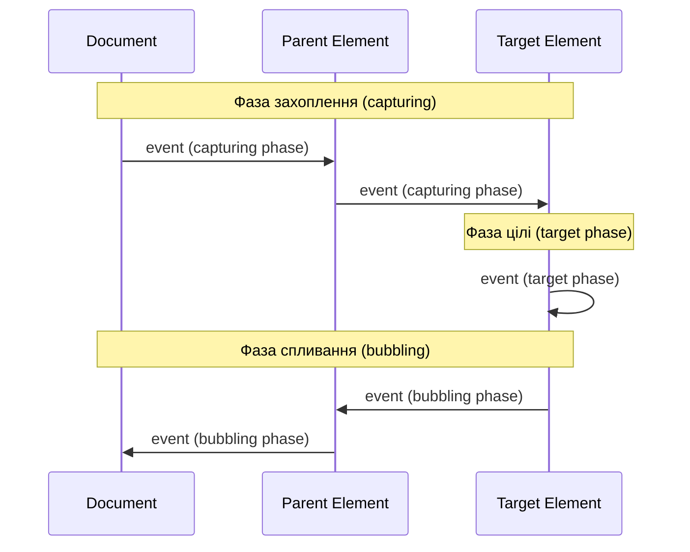
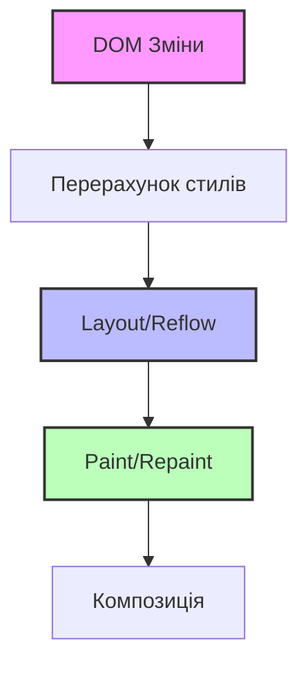

# JavaScript: DOM API

## Коротке пояснення

**DOM (Document Object Model)** — це програмний інтерфейс, який представляє HTML, XML і SVG документи як дерево об'єктів, дозволяючи JavaScript взаємодіяти зі структурою, стилем і вмістом веб-сторінки. DOM API надає методи та властивості для доступу, маніпуляції та реагування на події цих елементів.

---

## Доступ до елементів DOM

DOM надає різні методи для отримання доступу до елементів на сторінці.

### Методи пошуку елементів

| Метод | Опис | Повертає | Приклад |
|-------|------|----------|---------|
| `getElementById()` | Знаходить елемент за його ID | Один елемент або `null` | `document.getElementById('myId')` |
| `getElementsByClassName()` | Знаходить елементи за класом | "Жива" HTMLCollection | `document.getElementsByClassName('myClass')` |
| `getElementsByTagName()` | Знаходить елементи за тегом | "Жива" HTMLCollection | `document.getElementsByTagName('div')` |
| `querySelector()` | Знаходить перший елемент, що відповідає CSS-селектору | Один елемент або `null` | `document.querySelector('.myClass')` |
| `querySelectorAll()` | Знаходить всі елементи, що відповідають CSS-селектору | "Статична" NodeList | `document.querySelectorAll('div.item')` |

### Навігація по DOM-дереву

| Властивість | Опис | Приклад |
|-------------|------|---------|
| `parentNode` | Батьківський вузол елемента | `element.parentNode` |
| `parentElement` | Батьківський елемент (крім document і documentFragment) | `element.parentElement` |
| `childNodes` | Всі дочірні вузли як NodeList (включає текстові вузли та коментарі) | `element.childNodes` |
| `children` | Тільки дочірні елементи як HTMLCollection | `element.children` |
| `firstChild` | Перший дочірній вузол (може бути текстовим вузлом) | `element.firstChild` |
| `firstElementChild` | Перший дочірній елемент | `element.firstElementChild` |
| `lastChild` | Останній дочірній вузол | `element.lastChild` |
| `lastElementChild` | Останній дочірній елемент | `element.lastElementChild` |
| `nextSibling` | Наступний сусідній вузол | `element.nextSibling` |
| `nextElementSibling` | Наступний сусідній елемент | `element.nextElementSibling` |
| `previousSibling` | Попередній сусідній вузол | `element.previousSibling` |
| `previousElementSibling` | Попередній сусідній елемент | `element.previousElementSibling` |

### Приклади доступу до елементів

```javascript
// За ID (найшвидший метод)
const header = document.getElementById('header');

// За CSS селектором (сучасний та гнучкий підхід)
const firstButton = document.querySelector('button.primary');
const allButtons = document.querySelectorAll('.button');

// Навігація по дереву
const parent = firstButton.parentElement;
const firstChild = parent.firstElementChild;
const nextElement = firstButton.nextElementSibling;

// Отримання певного елемента з колекції
const thirdButton = allButtons[2];
```

---

## Маніпуляції з DOM

DOM API дозволяє динамічно змінювати вміст, структуру та стилі сторінки.

### Створення та додавання елементів

| Метод/Властивість | Опис | Приклад |
|-------------------|------|---------|
| `createElement()` | Створює новий елемент | `document.createElement('div')` |
| `createTextNode()` | Створює новий текстовий вузол | `document.createTextNode('Текст')` |
| `appendChild()` | Додає вузол як останню дитину | `parent.appendChild(child)` |
| `append()` | Додає вузли або текст як останні дочірні | `parent.append(child1, 'текст', child2)` |
| `insertBefore()` | Вставляє вузол перед іншим | `parent.insertBefore(newNode, referenceNode)` |
| `prepend()` | Додає вузли або текст як перші дочірні | `parent.prepend(child)` |
| `insertAdjacentHTML()` | Вставляє HTML в задану позицію | `element.insertAdjacentHTML('beforeend', '<div>Текст</div>')` |
| `cloneNode()` | Клонує вузол | `element.cloneNode(true)` |

### Видалення та заміна елементів

| Метод | Опис | Приклад |
|-------|------|---------|
| `removeChild()` | Видаляє дочірній елемент | `parent.removeChild(child)` |
| `remove()` | Видаляє сам елемент | `element.remove()` |
| `replaceChild()` | Замінює дочірній елемент | `parent.replaceChild(newChild, oldChild)` |
| `replaceWith()` | Замінює елемент новими вузлами | `element.replaceWith(newElement)` |

### Модифікація атрибутів та вмісту

| Метод/Властивість | Опис | Приклад |
|-------------------|------|---------|
| `getAttribute()` | Отримує значення атрибуту | `element.getAttribute('class')` |
| `setAttribute()` | Встановлює значення атрибуту | `element.setAttribute('class', 'new-class')` |
| `removeAttribute()` | Видаляє атрибут | `element.removeAttribute('disabled')` |
| `hasAttribute()` | Перевіряє наявність атрибуту | `element.hasAttribute('id')` |
| `innerHTML` | Отримує/встановлює HTML-вміст | `element.innerHTML = '<span>Новий вміст</span>'` |
| `textContent` | Отримує/встановлює текстовий вміст | `element.textContent = 'Новий текст'` |
| `innerText` | Подібно до textContent, але враховує стилі | `element.innerText = 'Видимий текст'` |
| `outerHTML` | Отримує/встановлює HTML самого елемента і його вмісту | `element.outerHTML = '<div>Замінено повністю</div>'` |

### Робота з класами та стилями

| Метод/Властивість | Опис | Приклад |
|-------------------|------|---------|
| `classList.add()` | Додає клас(и) | `element.classList.add('new-class', 'another-class')` |
| `classList.remove()` | Видаляє клас(и) | `element.classList.remove('old-class')` |
| `classList.toggle()` | Перемикає клас | `element.classList.toggle('active')` |
| `classList.contains()` | Перевіряє наявність класу | `element.classList.contains('hidden')` |
| `classList.replace()` | Замінює один клас іншим | `element.classList.replace('old', 'new')` |
| `className` | Отримує/встановлює всі класи як рядок | `element.className = 'class1 class2'` |
| `style` | Об'єкт для встановлення inline стилів | `element.style.color = 'red'` |
| `getComputedStyle()` | Отримує всі обчислені стилі | `getComputedStyle(element).backgroundColor` |

### Приклади маніпуляцій з DOM

```javascript
// Створення та додавання нового елементу
const newDiv = document.createElement('div');
newDiv.textContent = 'Новий елемент';
newDiv.classList.add('highlight');
document.body.appendChild(newDiv);

// Створення структури з елементів
const card = document.createElement('div');
card.classList.add('card');

const title = document.createElement('h2');
title.textContent = 'Заголовок картки';

const content = document.createElement('p');
content.textContent = 'Вміст картки з описом.';

card.append(title, content);
document.getElementById('container').appendChild(card);

// Заміна контенту
const oldParagraph = document.querySelector('.outdated');
const newParagraph = document.createElement('p');
newParagraph.textContent = 'Оновлений вміст';
oldParagraph.parentNode.replaceChild(newParagraph, oldParagraph);

// Видалення елементів
document.querySelectorAll('.temporary').forEach(item => {
  item.remove();
});

// Модифікація стилів
const highlightedElements = document.querySelectorAll('.highlight');
highlightedElements.forEach(el => {
  el.style.backgroundColor = 'yellow';
  el.style.padding = '10px';
  el.style.fontWeight = 'bold';
});
```

---

## Події DOM

DOM API надає потужну систему обробки подій для реагування на дії користувача та інші зміни.

### Типи подій

#### Події миші
- `click` - клік по елементу
- `dblclick` - подвійний клік
- `mousedown` - натиснення кнопки миші
- `mouseup` - відпускання кнопки миші
- `mouseover` - курсор наведено на елемент
- `mouseout` - курсор виведено з елемента
- `mousemove` - рух курсора над елементом
- `mouseenter` - курсор входить в елемент (без бульбашкового спливання)
- `mouseleave` - курсор виходить з елемента (без бульбашкового спливання)
- `contextmenu` - клік правою кнопкою миші

#### Події клавіатури
- `keydown` - клавіша натиснута
- `keyup` - клавіша відпущена
- `keypress` - клавіша натиснута (символьні клавіші)

#### Події форми
- `submit` - форма надіслана
- `reset` - форма скинута
- `change` - зміна значення елемента (при втраті фокусу)
- `input` - миттєва зміна значення (при вводі)
- `focus` - елемент отримав фокус
- `blur` - елемент втратив фокус
- `focusin` - елемент отримав фокус (бульбашкове спливання)
- `focusout` - елемент втратив фокус (бульбашкове спливання)

#### Події документа
- `DOMContentLoaded` - DOM-структура завантажена
- `load` - сторінка і всі ресурси завантажені
- `beforeunload` - перед покиданням сторінки
- `unload` - користувач покидає сторінку
- `resize` - зміна розміру вікна
- `scroll` - прокрутка сторінки або елемента

#### Події drag-and-drop
- `dragstart` - початок перетягування
- `drag` - перетягування елемента
- `dragend` - кінець перетягування
- `dragenter` - входження в зону елемента
- `dragover` - перетягування над елементом
- `dragleave` - вихід із зони елемента
- `drop` - скидання перетягуваного елемента

#### Медіа-події
- `play` - медіа починає відтворення
- `pause` - медіа призупинено
- `ended` - медіа завершило відтворення
- `volumechange` - змінена гучність
- `timeupdate` - змінена позиція відтворення

### Методи роботи з подіями

| Метод | Опис | Приклад |
|-------|------|---------|
| `addEventListener()` | Додає обробник події | `element.addEventListener('click', callback)` |
| `removeEventListener()` | Видаляє обробник події | `element.removeEventListener('click', callback)` |
| `dispatchEvent()` | Викликає подію програмно | `element.dispatchEvent(new Event('click'))` |

### Інформація про подію

| Властивість/Метод | Опис | Приклад |
|-------------------|------|---------|
| `event.target` | Елемент, на якому виникла подія | `event.target.tagName` |
| `event.currentTarget` | Елемент, на якому встановлений обробник | `event.currentTarget.id` |
| `event.type` | Тип події | `event.type === 'click'` |
| `event.preventDefault()` | Скасовує дію за замовчуванням | `event.preventDefault()` |
| `event.stopPropagation()` | Зупиняє бульбашкове спливання | `event.stopPropagation()` |
| `event.stopImmediatePropagation()` | Зупиняє виконання всіх наступних обробників | `event.stopImmediatePropagation()` |

### Делегування подій

**Делегування подій** — паттерн, при якому обробник встановлюється на батьківський елемент і обробляє події від усіх дочірніх елементів завдяки бульбашковому спливанню подій.

```javascript
// Замість установки окремих обробників на кожен елемент списку
document.getElementById('todo-list').addEventListener('click', function(e) {
  // Перевіряємо, чи клікнули ми на кнопку видалення
  if (e.target.classList.contains('delete-btn')) {
    // Видаляємо батьківський елемент (задачу)
    e.target.closest('li').remove();
  }
  
  // Перевіряємо, чи клікнули ми на елемент списку
  if (e.target.tagName === 'LI') {
    // Перемикаємо клас "completed"
    e.target.classList.toggle('completed');
  }
});
```

### Кастомні події

```javascript
// Створення події
const customEvent = new CustomEvent('userAction', {
  detail: { 
    username: 'john_doe',
    action: 'login',
    timestamp: Date.now()
  },
  bubbles: true,
  cancelable: true
});

// Активація події
document.dispatchEvent(customEvent);

// Обробка події
document.addEventListener('userAction', function(e) {
  console.log(`Користувач ${e.detail.username} виконав дію ${e.detail.action}`);
});
```

---

## Підкапотні механізми

### Як браузер інтерпретує DOM

1. **Парсинг HTML** → браузер перетворює HTML-код на токени.
2. **Побудова DOM-дерева** → з токенів будується дерево об'єктів.
3. **Парсинг CSS** → паралельно будується CSSOM (CSS Object Model).
4. **Побудова Render Tree** → DOM + CSSOM утворюють дерево рендерингу.
5. **Layout** → обчислення позицій і розмірів елементів.
6. **Paint** → відображення елементів на екрані.



### Особливості та підводні камені

1. **Спливання (Bubbling) та захоплення (Capturing) подій**:
   - Подія спочатку проходить фазу захоплення (зверху вниз)
   - Потім фазу таргетингу (на елементі події)
   - І потім фазу спливання (знизу вверх)

```
     | (1) Захоплення (capturing) |
     v                            v
+----+----------------------------+----+
|    |      document              |    |
|    |                            |    |
|    |  +-----------------------+ |    |
|    |  |        body           | |    |
|    |  |                       | |    |
|    |  |  +----------------+   | |    |
|    |  |  |    div.parent  |   | |    |
|    |  |  |                |   | |    |
|    |  |  |  +---------+   |   | |    |
|    |  |  |  |   button|   |   | |    |
|    |  |  |  +---------+   |   | |    |
|    |  |  |                |   | |    |
|    |  |  +----------------+   | |    |
|    |  |                       | |    |
|    |  +-----------------------+ |    |
|    |                            |    |
+----+----------------------------+----+
     ^                            ^
     | (3) Спливання (bubbling)   |
```

2. **Ефективність маніпуляцій**:
   - Операції з DOM повільні, бо вимагають перерахунку layout
   - DocumentFragment допомагає мінімізувати операції з DOM
   - Перерендеринг відбувається для всього DOM

3. **Живі колекції vs статичні колекції**:
   - HTMLCollection (getElementsBy*) — "живі" (автоматично оновлюються)
   - NodeList (querySelectorAll) — "статичні" (не оновлюються)

### Оптимізація роботи з DOM

1. **Мінімізація доступу до DOM**:
   - Кешування посилань на DOM-елементи в змінних
   - Використання документальних фрагментів для групування змін

```javascript
// Неоптимально:
for (let i = 0; i < 1000; i++) {
  document.getElementById('container').innerHTML += '<div>' + i + '</div>';
}

// Оптимально:
const fragment = document.createDocumentFragment();
const container = document.getElementById('container');

for (let i = 0; i < 1000; i++) {
  const div = document.createElement('div');
  div.textContent = i;
  fragment.appendChild(div);
}

container.appendChild(fragment);
```

2. **Уникнення Reflow/Layout Thrashing**:
   - Групування операцій читання і запису DOM
   - Зміна класів замість інлайнових стилів
   - Використання властивостей transform/opacity для анімацій

3. **Делегування подій**:
   - Встановлення обробників на батьківські елементи
   - Динамічна обробка через event.target

4. **Віртуальний DOM** (використовується в React, Vue):
   - Зміни спочатку вносяться у віртуальне представлення DOM
   - Алгоритм "reconciliation" знаходить найменшу кількість змін для оновлення реального DOM

---

## Схеми та діаграми

### Структура DOM-дерева

```
Document
├── <!DOCTYPE html>
├── <html>
│   ├── <head>
│   │   ├── <title>
│   │   │   └── #text: "Назва сторінки"
│   │   ├── <meta>
│   │   └── <link>
│   └── <body>
│       ├── <header>
│       │   └── <nav>
│       │       └── <ul>
│       │           ├── <li>
│       │           └── <li>
│       ├── <main>
│       │   └── <article>
│       │       ├── <h1>
│       │       │   └── #text: "Заголовок"
│       │       └── <p>
│       │           └── #text: "Параграф"
│       └── <footer>
│           └── #text: "Футер"
```

### Фази обробки подій



### Процес рендерингу DOM



> **Важливо**: Зміни властивостей `transform` і `opacity` впливають тільки на етап композиції, минаючи витратні етапи Layout і Paint, що робить їх ідеальними для анімацій.
