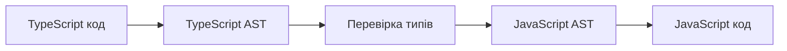
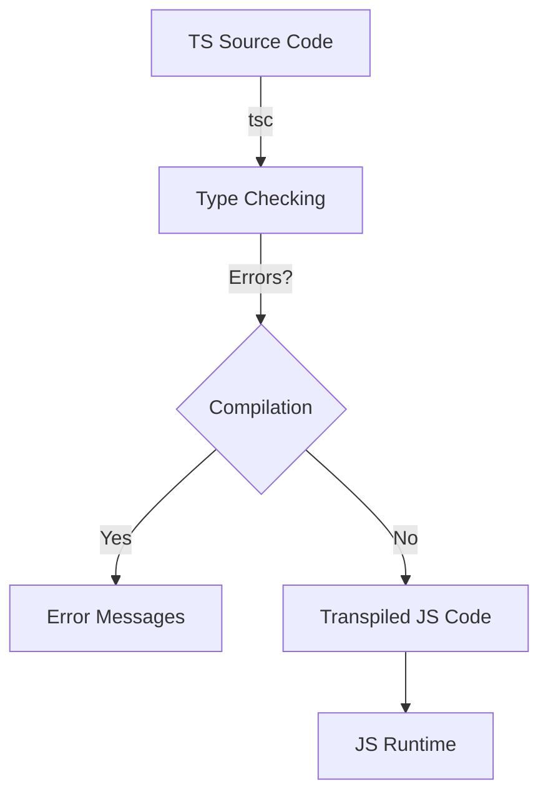
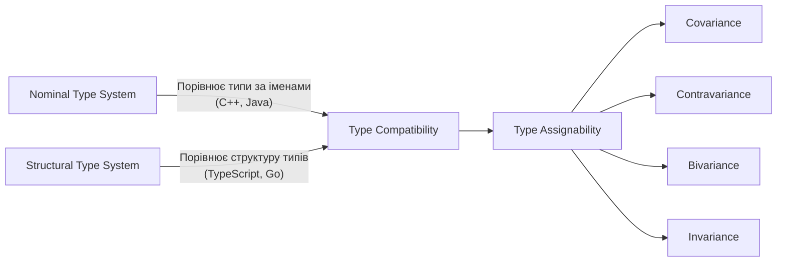

# JavaScript: TypeScript

## Коротке пояснення

**TypeScript** — це строго типізована надмножина JavaScript, розроблена Microsoft, яка додає статичну типізацію та інші об'єктно-орієнтовані можливості до мови. TypeScript компілюється у чистий JavaScript, що може виконуватися будь-яким JavaScript-рушієм. Основна мета TypeScript — покращити розробку, підтримку та рефакторинг великих JavaScript-проєктів через виявлення помилок на етапі компіляції, а не під час виконання.

---

## Типи даних TypeScript

TypeScript розширює стандартні типи JavaScript та додає власні типи для покращення типової безпеки.

### Примітивні типи

| Тип         | Опис                               | Приклад                            |
| ----------- | ---------------------------------- | ---------------------------------- |
| `boolean`   | Логічне значення                   | `let isDone: boolean = false;`     |
| `number`    | Числа (цілі та з плаваючою точкою) | `let decimal: number = 6;`         |
| `string`    | Текстові дані                      | `let color: string = "blue";`      |
| `null`      | Відсутність значення               | `let n: null = null;`              |
| `undefined` | Неініціалізована змінна            | `let u: undefined = undefined;`    |
| `symbol`    | Унікальний ідентифікатор           | `let sym: symbol = Symbol("key");` |
| `bigint`    | Цілі числа довільної довжини       | `let big: bigint = 100n;`          |

### Спеціальні типи TypeScript

| Тип       | Опис                                                   | Приклад                                                 |
| --------- | ------------------------------------------------------ | ------------------------------------------------------- |
| `any`     | Будь-який тип (відключає типову перевірку)             | `let notSure: any = 4;`                                 |
| `unknown` | Безпечніша альтернатива `any`                          | `let value: unknown = someValue;`                       |
| `void`    | Відсутність типу (для функцій без повернення значення) | `function log(): void { console.log('Hi'); }`           |
| `never`   | Тип, який ніколи не трапляється                        | `function error(): never { throw new Error('Error'); }` |

### Складні типи

| Тип                  | Опис                                      | Приклад                                    |
| -------------------- | ----------------------------------------- | ------------------------------------------ |
| `Array<T>` або `T[]` | Масиви певного типу                       | `let list: number[] = [1, 2, 3];`          |
| `Tuple`              | Масив фіксованої довжини з різними типами | `let x: [string, number] = ["hello", 10];` |
| `enum`               | Набір іменованих констант                 | `enum Color { Red, Green, Blue }`          |
| `object`             | Не-примітивний тип                        | `let obj: object = { key: "value" };`      |

### Об'єднання та перетин типів

| Тип                  | Опис                                    | Приклад                                                                                |
| -------------------- | --------------------------------------- | -------------------------------------------------------------------------------------- |
| `Union Types`        | Може бути одним із кількох типів        | `let id: string \| number = "abc123";`                                                 |
| `Intersection Types` | Повинен відповідати всім вказаним типам | `interface A {a: string}; interface B {b: number}; let obj: A & B = {a: "hi", b: 42};` |

### Приклад використання типів

```typescript
// Примітивні типи
let isDone: boolean = false;
let decimal: number = 6;
let hex: number = 0xf00d;
let binary: number = 0b1010;
let octal: number = 0o744;
let big: bigint = 100n;
let color: string = "blue";
let template: string = `Color: ${color}`;

// Масиви
let list: number[] = [1, 2, 3];
let genericList: Array<number> = [1, 2, 3];

// Кортежі (Tuples)
let tuple: [string, number] = ["hello", 10];
tuple[0] = "world"; // OK
// tuple[0] = 42; // Помилка: неправильний тип

// Enum
enum Color {
    Red = 1, // можна задавати власні значення
    Green, // автоматично буде 2
    Blue, // автоматично буде 3
}
let c: Color = Color.Green;
let colorName: string = Color[2]; // поверне "Green"

// Union Types
let id: string | number;
id = "abc123";
id = 123; // обидва варіанти валідні

// Literal Types (конкретні значення)
let direction: "north" | "east" | "south" | "west";
direction = "north"; // OK
// direction = "northeast"; // Помилка: невідповідний літерал

// Type Aliases (аліаси типів)
type Point = {
    x: number;
    y: number;
};
let point: Point = { x: 10, y: 20 };
```

---

## Інтерфейси

Інтерфейси в TypeScript визначають контракти в коді та надають явні імена для перевірки типів.

### Основи інтерфейсів

```typescript
// Базовий інтерфейс
interface User {
    id: number;
    name: string;
    email?: string; // Опціональна властивість (може бути відсутня)
    readonly createdAt: Date; // Властивість тільки для читання
}

// Використання інтерфейсу
const user: User = {
    id: 1,
    name: "John",
    createdAt: new Date(),
};
```

### Розширення інтерфейсів

```typescript
interface Animal {
    name: string;
}

// Розширення базового інтерфейсу
interface Dog extends Animal {
    breed: string;
    bark(): void;
}

const dog: Dog = {
    name: "Rex",
    breed: "German Shepherd",
    bark() {
        console.log("Woof!");
    },
};
```

### Реалізація інтерфейсів класами

```typescript
interface ClockInterface {
    currentTime: Date;
    setTime(d: Date): void;
}

class Clock implements ClockInterface {
    currentTime: Date = new Date();

    setTime(d: Date) {
        this.currentTime = d;
    }

    constructor(h: number, m: number) {
        this.currentTime = new Date();
        this.currentTime.setHours(h);
        this.currentTime.setMinutes(m);
    }
}
```

### Індексні сигнатури

```typescript
interface Dictionary {
    [key: string]: string | number;
}

const dict: Dictionary = {
    a: "apple",
    b: "banana",
    count: 2,
};
```

### Гібридні типи

```typescript
// Інтерфейс, що описує функцію з додатковими властивостями
interface Counter {
    (start: number): string;
    interval: number;
    reset(): void;
}

function getCounter(): Counter {
    const counter = ((start: number) => {
        return start.toString();
    }) as Counter;

    counter.interval = 123;
    counter.reset = function () {};

    return counter;
}

const c = getCounter();
c(10);
c.reset();
c.interval = 5;
```

---

## Generics (Узагальнення)

Generics дозволяють створювати "узагальнені" компоненти, які можуть працювати з різними типами, зберігаючи при цьому типову безпеку.

### Базовий синтаксис

```typescript
// Узагальнена функція
function identity<T>(arg: T): T {
    return arg;
}

// Виклик з явним зазначенням типу
let output1 = identity<string>("myString"); // тип: string

// Виклик з автоматичним виведенням типу
let output2 = identity(42); // тип: number
```

### Узагальнені інтерфейси

```typescript
interface GenericIdentityFn<T> {
    (arg: T): T;
}

function identity<T>(arg: T): T {
    return arg;
}

let myIdentity: GenericIdentityFn<number> = identity;
```

### Узагальнені класи

```typescript
class GenericNumber<T> {
    zeroValue: T;
    add: (x: T, y: T) => T;

    constructor(zero: T, addFn: (x: T, y: T) => T) {
        this.zeroValue = zero;
        this.add = addFn;
    }
}

// Для чисел
const numCalculator = new GenericNumber<number>(0, (x, y) => x + y);
numCalculator.add(5, 10); // 15

// Для рядків
const strCalculator = new GenericNumber<string>("", (x, y) => x + y);
strCalculator.add("Hello, ", "World"); // "Hello, World"
```

### Обмеження узагальнень

```typescript
// Обмеження T до типів, що мають властивість length
interface Lengthwise {
    length: number;
}

function loggingIdentity<T extends Lengthwise>(arg: T): T {
    console.log(arg.length); // Тепер можна безпечно звертатися до .length
    return arg;
}

loggingIdentity("hello"); // OK, рядки мають властивість length
// loggingIdentity(3);  // Помилка, числа не мають властивості length
```

### Узагальнені обмеження з ключами

```typescript
function getProperty<T, K extends keyof T>(obj: T, key: K) {
    return obj[key];
}

let x = { a: 1, b: 2, c: 3 };
getProperty(x, "a"); // OK
// getProperty(x, "z");  // Помилка: аргумент типу "z" не відповідає "a" | "b" | "c"
```

### Фабрика з узагальненнями

```typescript
function create<T>(c: { new (): T }): T {
    return new c();
}

class BeeKeeper {
    hasMask: boolean = true;
}

class ZooKeeper {
    nameTag: string = "Mikle";
}

class Animal {
    numLegs: number = 4;
}

class Bee extends Animal {
    keeper: BeeKeeper = new BeeKeeper();
}

class Lion extends Animal {
    keeper: ZooKeeper = new ZooKeeper();
}

// Створює екземпляр певного класу з використанням дженеріка
function createInstance<A extends Animal>(c: new () => A): A {
    return new c();
}

createInstance(Lion).keeper.nameTag; // Типобезпечний доступ
createInstance(Bee).keeper.hasMask; // Типобезпечний доступ
```

---

## Декоратори

Декоратори — спеціальні оголошення, які можна прикріпити до оголошення класу, методу, властивості або параметра. Вони використовують форму `@expression`, де `expression` оцінюється як функція, що буде викликана під час виконання.

> **Примітка**: Декоратори є експериментальною можливістю TypeScript, яка потребує включення в tsconfig.json через опцію `"experimentalDecorators": true`.

### Типи декораторів

1. **Декоратори класів**

```typescript
// Декоратор класу
function sealed(constructor: Function) {
    Object.seal(constructor);
    Object.seal(constructor.prototype);
}

@sealed
class BugReport {
    type = "report";
    title: string;

    constructor(t: string) {
        this.title = t;
    }
}
```

2. **Декоратори методів**

```typescript
// Декоратор методу, що вимірює час виконання
function measure(
    target: any,
    propertyKey: string,
    descriptor: PropertyDescriptor
) {
    const originalMethod = descriptor.value;

    descriptor.value = function (...args: any[]) {
        const start = performance.now();
        const result = originalMethod.apply(this, args);
        const finish = performance.now();
        console.log(`Метод ${propertyKey} виконувався ${finish - start} мс`);
        return result;
    };

    return descriptor;
}

class TaskRunner {
    @measure
    runTask(task: () => void) {
        task();
    }
}
```

3. **Декоратори властивостей**

```typescript
// Декоратор властивості для валідації
function required(target: any, propertyKey: string) {
    let value: any;

    const getter = function () {
        return value;
    };

    const setter = function (newVal: any) {
        if (newVal === undefined || newVal === null) {
            throw new Error(`Властивість ${propertyKey} є обов'язковою`);
        }
        value = newVal;
    };

    Object.defineProperty(target, propertyKey, {
        get: getter,
        set: setter,
    });
}

class User {
    @required
    name: string;

    constructor(name: string) {
        this.name = name;
    }
}
```

4. **Декоратори параметрів**

```typescript
// Декоратор параметра
function logParameter(
    target: any,
    propertyKey: string,
    parameterIndex: number
) {
    console.log(
        `Параметр ${parameterIndex} методу ${propertyKey} було декоровано`
    );
}

class Greeter {
    greeting: string;

    constructor(message: string) {
        this.greeting = message;
    }

    greet(@logParameter name: string) {
        return `${this.greeting}, ${name}!`;
    }
}
```

### Фабрики декораторів

```typescript
// Фабрика декораторів з параметрами
function log(message: string) {
    return function (
        target: any,
        propertyKey: string,
        descriptor: PropertyDescriptor
    ) {
        const originalMethod = descriptor.value;

        descriptor.value = function (...args: any[]) {
            console.log(`${message}: ${propertyKey}`);
            return originalMethod.apply(this, args);
        };

        return descriptor;
    };
}

class Calculator {
    @log("Викликано метод додавання")
    add(a: number, b: number) {
        return a + b;
    }

    @log("Викликано метод множення")
    multiply(a: number, b: number) {
        return a * b;
    }
}
```

---

## Enum (Перерахування)

Enum (перерахування) — це спосіб визначити набір іменованих констант, які полегшують документування намірів або створення набору окремих випадків.

### Числові Enum

```typescript
// Числовий Enum (за замовчуванням починається з 0)
enum Direction {
    Up, // 0
    Down, // 1
    Left, // 2
    Right, // 3
}

// Можна вказати початкове значення
enum Status {
    Pending = 1, // 1
    InProgress, // 2
    Done, // 3
    Cancelled, // 4
}

// Використання
let dir: Direction = Direction.Up;
let status: Status = Status.InProgress;

// Доступ за значенням (reverse mapping)
let dirName: string = Direction[0]; // "Up"
```

### Рядкові Enum

```typescript
// Рядковий Enum (не має автоматичного інкременту)
enum MediaTypes {
    JSON = "application/json",
    XML = "application/xml",
    TEXT = "text/plain",
}

// Використання
let contentType: MediaTypes = MediaTypes.JSON;
console.log(contentType); // "application/json"
```

### Гетерогенні Enum

```typescript
// Enum з різними типами значень
enum BooleanLikeEnum {
    No = 0,
    Yes = "YES",
}
```

### Обчислювані та константні члени

```typescript
enum FileAccess {
    // Константні члени
    None = 0,
    Read = 1 << 0, // 1
    Write = 1 << 1, // 2
    ReadWrite = Read | Write, // 3

    // Обчислюваний член
    G = getValue(),
}

function getValue() {
    return 4;
}
```

### Enum як об'єкт під час виконання

```typescript
enum E {
    X,
    Y,
    Z,
}

function f(obj: { X: number }) {
    return obj.X;
}

// Enum є об'єктом під час виконання, тому це працює
f(E); // OK, E має властивість X типу number
```

### Enum з константами (const enum)

```typescript
// Const enum повністю видаляється під час компіляції
const enum Direction {
    Up,
    Down,
    Left,
    Right,
}

// Компілюється в буквальне значення 0
let up = Direction.Up;
```

### Зовнішні Enum (ambient enum)

```typescript
// Оголошення в .d.ts файлі
declare enum Environment {
    Development,
    Staging,
    Production,
}
```

### Практичне використання Enum

```typescript
// Використання в switch
enum UserRole {
    Admin = "ADMIN",
    Moderator = "MODERATOR",
    User = "USER",
}

function checkAccess(role: UserRole): boolean {
    switch (role) {
        case UserRole.Admin:
            return true;
        case UserRole.Moderator:
            return true;
        default:
            return false;
    }
}

// Використання як об'єкт для ітерації
enum Color {
    Red = "#FF0000",
    Green = "#00FF00",
    Blue = "#0000FF",
}

// Отримання всіх ключів enum
const colorKeys = Object.keys(Color).filter((k) => isNaN(Number(k)));
console.log(colorKeys); // ["Red", "Green", "Blue"]

// Отримання всіх значень enum
const colorValues = colorKeys.map((key) => Color[key as keyof typeof Color]);
console.log(colorValues); // ["#FF0000", "#00FF00", "#0000FF"]
```

---

## Type Guards (Захисники типів)

Type Guards — це вирази, які виконують перевірку типу під час виконання, дозволяючи TypeScript звужувати тип змінної в певному блоці коду.

### Вбудовані захисники типів

1. **typeof**

```typescript
function padLeft(value: string, padding: string | number) {
    if (typeof padding === "number") {
        // TypeScript знає, що padding тут число
        return " ".repeat(padding) + value;
    }
    // TypeScript знає, що padding тут рядок
    return padding + value;
}
```

2. **instanceof**

```typescript
class Bird {
    fly() {
        console.log("flying...");
    }
}

class Fish {
    swim() {
        console.log("swimming...");
    }
}

function move(pet: Bird | Fish) {
    if (pet instanceof Bird) {
        // TypeScript знає, що pet тут Bird
        pet.fly();
    } else {
        // TypeScript знає, що pet тут Fish
        pet.swim();
    }
}
```

### Користувацькі захисники типів

1. **Предикати типу (Type Predicates)**

```typescript
interface Bird {
    fly(): void;
    layEggs(): void;
}

interface Fish {
    swim(): void;
    layEggs(): void;
}

// Функція-предикат: повертає boolean і використовує форму параметр is Тип
function isFish(pet: Bird | Fish): pet is Fish {
    return (pet as Fish).swim !== undefined;
}

function move(pet: Bird | Fish) {
    if (isFish(pet)) {
        // TypeScript знає, що pet тут Fish
        pet.swim();
    } else {
        // TypeScript знає, що pet тут Bird
        pet.fly();
    }
}
```

2. **Захисники на основі властивостей (Property in type guard)**

```typescript
interface A {
    a: number;
}

interface B {
    b: string;
}

function doSomething(obj: A | B) {
    if ("a" in obj) {
        // TypeScript знає, що obj тут A
        console.log(obj.a);
    } else {
        // TypeScript знає, що obj тут B
        console.log(obj.b);
    }
}
```

3. **Захисники з дискримінантними об'єднаннями (Discriminated Unions)**

```typescript
interface Circle {
    kind: "circle";
    radius: number;
}

interface Square {
    kind: "square";
    sideLength: number;
}

type Shape = Circle | Square;

function getArea(shape: Shape) {
    switch (shape.kind) {
        case "circle":
            // TypeScript знає, що shape тут Circle
            return Math.PI * shape.radius ** 2;
        case "square":
            // TypeScript знає, що shape тут Square
            return shape.sideLength ** 2;
    }
}
```

4. **Assertion функції**

```typescript
// Функція, яка перевіряє умову та кидає помилку, якщо вона не виконується
function assert(condition: any, msg?: string): asserts condition {
    if (!condition) {
        throw new Error(msg || "Assertion failed");
    }
}

// Функція, яка підтверджує, що value має тип T
function assertIsString(value: any): asserts value is string {
    if (typeof value !== "string") {
        throw new Error("Value is not a string");
    }
}

function example(value: unknown) {
    assertIsString(value);
    // Тепер TypeScript знає, що value - рядок
    console.log(value.toUpperCase());
}
```

### Складні приклади використання захисників типів

```typescript
// Використання захисників для обробки помилок
interface Success<T> {
    success: true;
    data: T;
}

interface Failure {
    success: false;
    error: string;
}

type Result<T> = Success<T> | Failure;

function processResult<T>(result: Result<T>): T | null {
    if (result.success) {
        // TypeScript знає, що result тут Success<T>
        return result.data;
    } else {
        // TypeScript знає, що result тут Failure
        console.error(result.error);
        return null;
    }
}

// Захисники з generics
function isArray<T>(value: T | T[]): value is T[] {
    return Array.isArray(value);
}

function process<T>(value: T | T[]) {
    if (isArray(value)) {
        // TypeScript знає, що value тут T[]
        value.forEach((item) => console.log(item));
    } else {
        // TypeScript знає, що value тут T
        console.log(value);
    }
}
```

---

## Підкапотні механізми

### Як TypeScript інтерпретується

1. **Процес компіляції TypeScript**:
    - TypeScript код → TypeScript AST (Abstract Syntax Tree)
    - Перевірка типів
    - TypeScript AST → JavaScript AST
    - JavaScript AST → JavaScript код



2. **Стирання типів (Type Erasure)**:
    - Вся інформація про типи видаляється під час компіляції
    - TypeScript типи існують тільки на етапі компіляції, не під час виконання
    - JavaScript не має статичних типів

```typescript
// TypeScript
function identity<T>(arg: T): T {
    return arg;
}

// Компілюється в JavaScript
function identity(arg) {
    return arg;
}
```

### Особливості та підводні камені

1. **Коваріантність і контраваріантність**:

```typescript
// Масиви є коваріантними (небезпечно!)
let animals: Animal[] = [];
let cats: Cat[] = [];
animals = cats; // OK, але може призвести до помилок під час виконання

// Функції є контраваріантними для параметрів
type AnimalCallback = (animal: Animal) => void;
type CatCallback = (cat: Cat) => void;
let animalFunc: AnimalCallback = (animal) => {};
let catFunc: CatCallback = (cat) => {};
catFunc = animalFunc; // OK, безпечно
// animalFunc = catFunc; // Помилка! Небезпечно
```

2. **Структурна типізація проти номінальної**:

```typescript
// TypeScript використовує структурну типізацію
interface Point {
    x: number;
    y: number;
}

class MyPoint {
    x: number;
    y: number;

    constructor(x: number, y: number) {
        this.x = x;
        this.y = y;
    }
}

// Це працює, бо структури сумісні, навіть якщо імена типів різні
const p: Point = new MyPoint(10, 20);
```

3. **Сумісність щодо надлишкових властивостей**:

```typescript
interface Person {
    name: string;
    age: number;
}

// Пряме присвоєння об'єктного літерала викликає перевірку надлишкових властивостей
// Наступний код викличе помилку:
let person: Person = { name: "John", age: 30, job: "Developer" };

// Але якщо використовувати проміжну змінну, це працює:
let obj = { name: "John", age: 30, job: "Developer" };
let person: Person = obj; // OK, немає помилки
```

4. **Видимість типів в JavaScript**:

```typescript
// TypeScript
interface User {
    id: number;
    name: string;
}

// В JavaScript інтерфейси не існують під час виконання:
// console.log(typeof User); // undefined

// Для створення типів, доступних під час виконання, використовуйте класи:
class UserClass {
    id: number;
    name: string;

    constructor(id: number, name: string) {
        this.id = id;
        this.name = name;
    }
}

console.log(typeof UserClass); // function
```

### Оптимізація використання TypeScript

1. **Строга перевірка**:

    - Включіть `"strict": true` в tsconfig.json
    - Це активує `strictNullChecks`, `strictFunctionTypes`, `strictBindCallApply` тощо

2. **Ізоляція будь-якого типу**:
    - Обмежте використання `any`, загорнувши його у типобезпечні функції
    - Використовуйте `unknown` замість `any`, коли можливо

```typescript
// Погано:
function processData(data: any) {
    return data.length; // Небезпечно, може призвести до помилок
}

// Краще:
function processData(data: unknown) {
    if (typeof data === "string" || Array.isArray(data)) {
        return data.length; // Безпечно, TypeScript знає, що data має властивість length
    }
    throw new Error("Data must be string or array");
}
```

3. **Попередньо визначені типи утиліт**:
    - `Partial<T>` - робить всі властивості T опціональними
    - `Required<T>` - робить всі властивості T обов'язковими
    - `Readonly<T>` - робить всі властивості T тільки для читання
    - `Record<K, T>` - будує тип з ключами K і значеннями T
    - `Pick<T, K>` - вибирає підмножину властивостей K з T
    - `Omit<T, K>` - виключає властивості K з T
    - `Exclude<T, U>` - виключає типи U з T
    - `Extract<T, U>` - витягує типи U з T
    - `NonNullable<T>` - виключає null і undefined з T
    - `ReturnType<F>` - отримує тип повернення функції F
    - `Parameters<F>` - отримує типи параметрів функції F

```typescript
interface User {
    id: number;
    name: string;
    email: string;
    address: string;
}

// Тільки певні поля
type UserBasicInfo = Pick<User, "id" | "name">;

// Всі поля, крім певних
type UserWithoutAddress = Omit<User, "address">;

// Всі поля опціональні (для оновлення)
type PartialUser = Partial<User>;

// Всі поля тільки для читання
type ReadonlyUser = Readonly<User>;

// Словник користувачів за ID
type UserDictionary = Record<number, User>;
```

---

## Схеми та діаграми

### Ієрархія типів TypeScript

```
TypeScript Types
│
├── Primitive Types
│   ├── string
│   ├── number
│   ├── boolean
│   ├── null
│   ├── undefined
│   ├── symbol
│   └── bigint
│
├── Object Types
│   ├── Interface
│   ├── Class
│   ├── Array
│   ├── Tuple
│   └── Function
│
├── Special Types
│   ├── any
│   ├── unknown
│   ├── void
│   └── never
│
├── Union & Intersection
│   ├── Type1 | Type2 (Union)
│   └── Type1 & Type2 (Intersection)
│
└── Utility Types
    ├── Partial<T>
    ├── Required<T>
    ├── Readonly<T>
    ├── Record<K, T>
    ├── Pick<T, K>
    ├── Omit<T, K>
    └── ...
```

### Процес компіляції TypeScript



### Система типів TypeScript



> **Важливо**: TypeScript використовує структурну типізацію, що означає, що типи сумісні, якщо їх структури співпадають, незалежно від імен типів. Це забезпечує гнучкість, але може призвести до несподіваних результатів, якщо не врахувати особливості системи типів.
