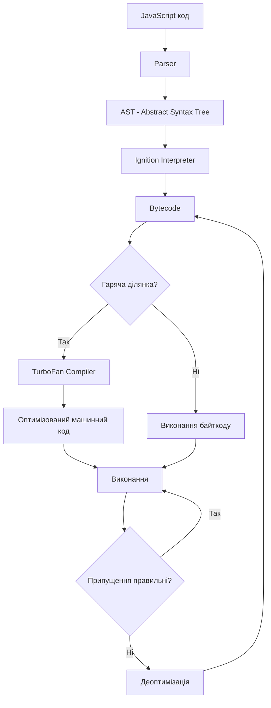
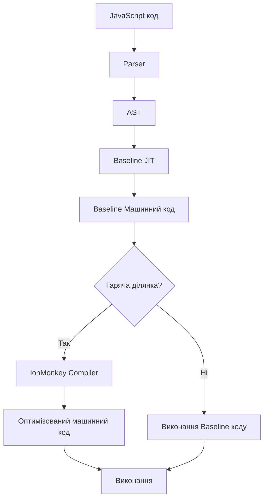
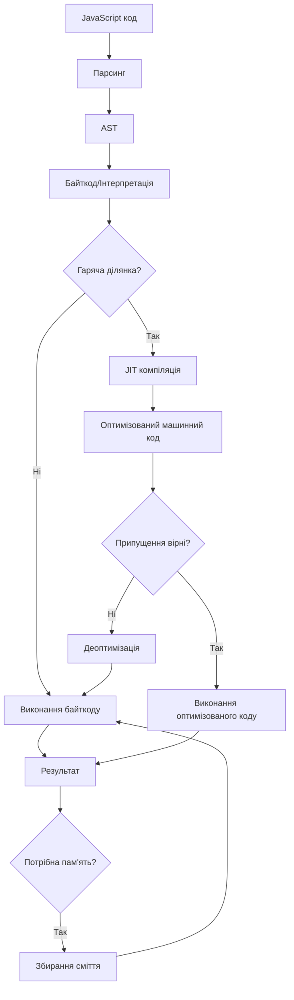
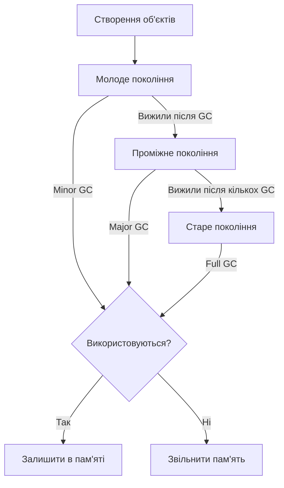

# JavaScript: Робота рушіїв JS

## Коротке пояснення

**JavaScript рушій (engine)** — це програмне забезпечення, яке виконує JavaScript код. Рушії читають, аналізують, компілюють та виконують код, перетворюючи його на машинні команди, що можуть бути виконані процесором. Різні браузери та середовища використовують різні рушії, але їхні основні принципи роботи схожі. Розуміння роботи цих рушіїв важливе для написання високопродуктивного коду та уникнення типових помилок оптимізації.

---

## Основні JavaScript рушії

### V8 (Google)

**V8** — високопродуктивний рушій JavaScript з відкритим кодом, розроблений Google, який використовується в:

-   Google Chrome
-   Node.js
-   Deno
-   Electron
-   Opera
-   Microsoft Edge (з 2020 року)

#### Ключові особливості V8:

-   **Компіляція Just-In-Time (JIT)** — компілює JavaScript безпосередньо в машинний код замість інтерпретації або байткоду
-   **Прихована класова оптимізація** — оптимізує роботу з об'єктами, групуючи їх у "приховані класи"
-   **Вбудований збирач сміття** — використовує генераційний підхід та паралельну обробку
-   **Вбудований профілювальник** — збирає метрики виконання для кращої оптимізації
-   **Інлайн-кешування** — прискорює доступ до властивостей об'єктів
-   **Турбо-фан (TurboFan)** та **Ігніція (Ignition)** — оптимізуючий компілятор і інтерпретатор байткоду

#### Архітектура V8



### SpiderMonkey (Mozilla)

**SpiderMonkey** — перший JavaScript рушій, створений Бренданом Айхом, розробником JavaScript. Використовується в:

-   Mozilla Firefox
-   Adobe Acrobat
-   CouchDB
-   GNOME

#### Ключові особливості SpiderMonkey:

-   **Багаторівнева компіляція** — використовує Baseline JIT для швидкої компіляції та IonMonkey для більш глибокої оптимізації
-   **Тип-інференція** — спостерігає за типами під час виконання для оптимізації
-   **Збирач сміття** — використовує інкрементальний та паралельний збір
-   **Wasm baseline compiler** — для швидкого виконання WebAssembly
-   **JavaScript shell** — інтерактивний інтерфейс для тестування

#### Архітектура SpiderMonkey



### JavaScriptCore (Apple)

**JavaScriptCore** (також відомий як Nitro) — рушій JavaScript, розроблений Apple для:

-   Safari
-   WebKit
-   Інших застосунків Apple

#### Ключові особливості JavaScriptCore:

-   **Чотирирівнева компіляція**: LLInt (інтерпретатор) → Baseline JIT → DFG JIT → FTL JIT
-   **FTLJIT (Faster Than Light)** — використовує LLVM для глибокої оптимізації
-   **Збирач сміття** — використовує метод міток і розгортки
-   **Резервування коду** — виділяє пам'ять для часто використовуваного коду

### Chakra (Microsoft)

**Chakra** — рушій JavaScript, розроблений Microsoft для:

-   Internet Explorer 9+
-   Старі версії Microsoft Edge (до переходу на V8)
-   Windows Applications

#### Ключові особливості Chakra:

-   **Відкладена компіляція** — компілює лише потрібний код
-   **Паралельний JIT** — виконує компіляцію в окремому потоці
-   **Збирач сміття** — паралельний, керований багатопотоковий
-   **Підтримка JSON** — native parser для JSON

### Інші рушії

-   **Hermes** — розроблений Facebook для React Native, оптимізований для мобільних пристроїв
-   **QuickJS** — легкий рушій, що підтримує ES2020, використовується в IoT
-   **Duktape** — рушій для вбудованих систем з малим об'ємом пам'яті
-   **JerryScript** — розроблений Samsung для IoT пристроїв

---

## Процес компіляції та виконання JavaScript

### Загальний потік виконання коду

1. **Завантаження** — отримання JavaScript-коду
2. **Парсинг** — перетворення коду на Abstract Syntax Tree (AST)
3. **Компіляція** — перетворення AST на байткод або машинний код
4. **Оптимізація** — поліпшення згенерованого коду
5. **Виконання** — безпосереднє виконання коду процесором
6. **Збирання сміття** — звільнення невикористовуваної пам'яті


### Детальний огляд етапів

#### 1. Парсинг (Parsing)

**Лексичний аналіз (Tokenizing)**:

-   Код розбивається на токени (мінімальні смислові одиниці)
-   Наприклад: `let a = 5;` → `let`, `a`, `=`, `5`, `;`

**Синтаксичний аналіз (Parsing)**:

-   Токени групуються відповідно до граматики мови
-   Будується дерево абстрактного синтаксису (AST)

```javascript
// Код
function add(a, b) {
  return a + b;
}

// Спрощене представлення AST
{
  "type": "Program",
  "body": [{
    "type": "FunctionDeclaration",
    "id": { "type": "Identifier", "name": "add" },
    "params": [
      { "type": "Identifier", "name": "a" },
      { "type": "Identifier", "name": "b" }
    ],
    "body": {
      "type": "BlockStatement",
      "body": [{
        "type": "ReturnStatement",
        "argument": {
          "type": "BinaryExpression",
          "operator": "+",
          "left": { "type": "Identifier", "name": "a" },
          "right": { "type": "Identifier", "name": "b" }
        }
      }]
    }
  }]
}
```

#### 2. Компіляція

**Інтерпретація**:

-   Традиційні інтерпретатори виконують код рядок за рядком
-   Повільніше, але простіше у реалізації

**Just-In-Time (JIT) компіляція**:

-   Комбінує інтерпретацію та компіляцію
-   Спочатку виконує байткод, збирає дані про виконання
-   Оптимізує та компілює гарячі ділянки (часто виконуваний код)

#### 3. Оптимізація

**Inlining (Вбудовування функцій)**:

-   Заміна виклику функції її тілом для уникнення накладних витрат

```javascript
// До оптимізації
function square(x) {
    return x * x;
}
function sumOfSquares(a, b) {
    return square(a) + square(b);
}

// Після інлайнінга
function sumOfSquares(a, b) {
    return a * a + b * b;
}
```

**Hidden Class (Приховані класи)**:

-   Оптимізує доступ до властивостей об'єктів
-   Об'єкти з однаковою структурою групуються разом

```javascript
// Ефективне створення об'єктів (один прихований клас)
let point1 = { x: 1, y: 2 };
let point2 = { x: 3, y: 4 };

// Неефективне (різні приховані класи)
let point1 = { x: 1, y: 2 };
let point2 = { y: 4, x: 3 }; // порядок властивостей важливий!

// Найгірше (постійна зміна прихованого класу)
let point = {};
point.x = 1; // зміна прихованого класу
point.y = 2; // знову зміна прихованого класу
```

**Спеціалізація типів**:

-   Оптимізація операцій для конкретних типів
-   Наприклад, додавання двох чисел vs додавання рядків

**Hoisting (Елізія)**:

-   Переміщення незмінних значень та обчислень поза циклами

```javascript
// До елізії
for (let i = 0; i < 1000; i++) {
    let area = Math.PI * radius * radius;
    // використання area
}

// Після елізії
let area = Math.PI * radius * radius;
for (let i = 0; i < 1000; i++) {
    // використання area
}
```

**Деоптимізація**:

-   Відмова від оптимізації, якщо припущення не виконуються
-   Повернення до інтерпретації або менш оптимізованого коду

```javascript
function add(a, b) {
    return a + b;
}

// Оптимізовано для чисел
add(1, 2);
add(3, 4);

// Деоптимізація, оскільки тип змінився
add("hello", "world");
```

---

## Just-In-Time компіляція (JIT)

JIT-компіляція — це техніка, при якій код компілюється в машинні інструкції "на льоту" під час виконання програми, а не заздалегідь.

### Принципи роботи JIT

1. **Профілювання** — збір інформації про виконання коду
2. **Аналіз** — визначення "гарячих" ділянок
3. **Оптимізація** — компіляція часто використовуваного коду
4. **Моніторинг** — перевірка, чи залишаються припущення вірними
5. **Деоптимізація** — відмова від оптимізації, якщо припущення порушені

### Рівні JIT-компіляції (на прикладі V8)

**Рівень 0: Інтерпретація (Ignition)**

-   Парсинг коду і генерація байткоду
-   Виконання байткоду з мінімальною оптимізацією
-   Збір статистики про типи, гарячі функції тощо

**Рівень 1: Базова оптимізація (TurboFan)**

-   Компіляція гарячих функцій в машинний код
-   Застосування базових оптимізацій
-   Створення спеціалізованого коду з використанням типової інформації

**Рівень 2: Агресивна оптимізація**

-   Поглиблена оптимізація дуже гарячих функцій
-   Спекулятивна оптимізація з припущеннями про типи
-   Вбудовування функцій, розгортання циклів, векторизація

### Типові оптимізації в JIT

| Оптимізація                    | Опис                                      | Приклад                                              |
| ------------------------------ | ----------------------------------------- | ---------------------------------------------------- |
| **Inline caching**             | Кешування результатів пошуку властивостей | Запам'ятовування offset у пам'яті для `obj.property` |
| **Function inlining**          | Вбудовування малих функцій                | Заміна `square(x)` на `x * x`                        |
| **Dead code elimination**      | Видалення коду, що не виконується         | Видалення if-гілок, які ніколи не виконуються        |
| **Loop-invariant code motion** | Винесення незмінного коду з циклів        | Обчислення `Math.PI * r * r` до циклу                |
| **Escape analysis**            | Аналіз доступності об'єктів               | Розміщення об'єктів на стеку замість купи            |

### Профілювання та моніторинг

JIT постійно відстежує:

-   Які функції викликаються часто
-   Які типи даних використовуються
-   Які властивості об'єктів використовуються
-   Чи виконуються припущення про типи

### Деоптимізація

Деоптимізація відбувається, коли порушуються припущення:

-   Змінився тип параметра функції
-   Додана нова властивість до оптимізованого об'єкта
-   З'явилась нова реалізація методу в ланцюгу прототипів

```javascript
// Оптимізовано для роботи з числами
function sum(array) {
    let result = 0;
    for (let i = 0; i < array.length; i++) {
        result += array[i];
    }
    return result;
}

// Спрацює добре, буде оптимізовано
sum([1, 2, 3, 4, 5]);

// Викличе деоптимізацію
sum([1, 2, "3", 4, 5]);
```

---

## Збирання сміття (Garbage Collection)

Збирання сміття — автоматичне звільнення пам'яті, яка більше не використовується програмою.

### Основні алгоритми збирання сміття

#### 1. Алгоритм підрахунку посилань

-   Кожен об'єкт має лічильник посилань
-   Коли лічильник досягає нуля, об'єкт видаляється
-   Простий, але не вирішує проблему циклічних посилань

```javascript
let obj1 = { ref: null };
let obj2 = { ref: null };

obj1.ref = obj2; // лічильник obj2 = 2
obj2.ref = obj1; // лічильник obj1 = 2

obj1 = null; // лічильник первинного obj1 = 1
obj2 = null; // лічильник первинного obj2 = 1

// Об'єкти залишаються в пам'яті через циклічні посилання!
```

#### 2. Алгоритм позначення та очищення (Mark and Sweep)

-   Основний алгоритм, що використовується в JS-рушіях
-   Періодично шукає та позначає всі досяжні об'єкти
-   Видаляє непозначені (недосяжні) об'єкти

```
    [Root] (window, global)
      /   \
     /     \
 [Об'єкт A] [Об'єкт B]
    |         |
    |         |
 [Об'єкт C] [Об'єкт D]
    |
    |
 [Об'єкт E]   [Об'єкт F] (недосяжний)
                  |
                  |
              [Об'єкт G] (недосяжний)
```

#### 3. Генераційне збирання сміття

-   Об'єкти розділені на "покоління" за часом життя
-   Молоді об'єкти перевіряються частіше (більшість об'єктів живуть коротко)
-   Старі об'єкти перевіряються рідше

```
Пам'ять поділена на сегменти:

[Молоде покоління (Nursery)] - нещодавно створені об'єкти
[Проміжне покоління]         - об'єкти, що вижили після кількох GC
[Старе покоління]            - довгоживучі об'єкти
```

### Процес збирання сміття в сучасних рушіях

#### V8 (Orinoco GC)

-   **Minor GC (Scavenger)** — збирає сміття в молодому поколінні
-   **Major GC** — повне збирання з використанням алгоритму Mark-Sweep-Compact
-   **Incremental marking** — розбиває позначення на маленькі кроки
-   **Concurrent marking** — позначає об'єкти в окремому потоці
-   **Lazy sweeping** — відкладає очищення до момента, коли потрібна пам'ять

#### SpiderMonkey

-   **Nursery collection** — швидке збирання молодих об'єктів
-   **Tenured collection** — глибше збирання старших об'єктів
-   **Incremental GC** — розбиває роботу на маленькі часові вікна
-   **Generational GC** — різна стратегія для різних поколінь

### Оптимізація для збирання сміття

**Правильні патерни**:

```javascript
// Погано: створення багатьох об'єктів у циклі
function createObjects() {
    let result = [];
    for (let i = 0; i < 1000000; i++) {
        result.push({ index: i, data: "some data" });
    }
    return result;
}

// Краще: переробка об'єктів
function processWithObject() {
    let obj = { data: null };
    for (let i = 0; i < 1000000; i++) {
        obj.data = i;
        // Обробка obj...
    }
}
```

**Уникнення випадкових посилань**:

```javascript
// Погано: випадкове замикання на великий об'єкт
function processData() {
    const hugeData = new Array(1000000).fill("x");

    const smallResult = hugeData[0]; // Потрібен лише один елемент

    // Ця функція захоплює hugeData в замикання
    setInterval(() => {
        console.log(smallResult);
        // hugeData залишається в пам'яті через замикання!
    }, 1000);
}

// Краще: уникнення надлишкових посилань
function processData() {
    const hugeData = new Array(1000000).fill("x");

    const smallResult = hugeData[0];

    // Функція захоплює лише потрібні дані
    setInterval(() => {
        console.log(smallResult);
        // hugeData може бути зібраний збирачем сміття
    }, 1000);
}
```

### Індикатори проблем зі збиранням сміття

-   Часті зупинки ("паузи") виконання коду
-   Зростаюче використання пам'яті (memory leaks)
-   Зниження продуктивності з часом
-   Аварійне завершення програми через нестачу пам'яті

---

## Оптимізація коду для JavaScript-рушіїв

### Загальні рекомендації

1. **Дотримуйтесь консистентності у використанні типів**

    - Не змінюйте типи змінних під час виконання
    - Не додавайте нові властивості до об'єктів після створення

2. **Ініціалізуйте об'єкти відразу з усіма потрібними властивостями**

```javascript
// Погано (постійна зміна прихованого класу)
const user = {};
user.name = "John";
user.age = 30;
user.email = "john@example.com";

// Добре (один прихований клас)
const user = {
    name: "John",
    age: 30,
    email: "john@example.com",
};
```

3. **Створюйте властивості об'єктів в одному порядку**

```javascript
// Різні приховані класи (погано)
const user1 = { name: "John", age: 30 };
const user2 = { age: 25, name: "Jane" };

// Однакові приховані класи (добре)
const user1 = { name: "John", age: 30 };
const user2 = { name: "Jane", age: 25 };
```

4. **Уникайте видалення властивостей**

```javascript
// Погано (руйнує оптимізацію прихованого класу)
delete user.age;

// Краще (зберігає прихований клас)
user.age = undefined;
```

5. **Уникайте мономорфізму у функціях**

```javascript
// Поганий приклад (поліморфний код)
function add(a, b) {
    return a + b;
}
add(1, 2); // числа
add("a", "b"); // рядки
add({}, {}); // об'єкти

// Кращий приклад (мономорфний код)
function addNumbers(a, b) {
    return a + b;
}
function addStrings(a, b) {
    return a + b;
}
addNumbers(1, 2); // тільки числа
addStrings("a", "b"); // тільки рядки
```

### Оптимізація циклів

1. **Кешуйте довжину масиву**

```javascript
// Погано (властивість length перевіряється на кожній ітерації)
for (let i = 0; i < array.length; i++) {
    // Щось робимо
}

// Добре (length кешується)
for (let i = 0, len = array.length; i < len; i++) {
    // Щось робимо
}
```

2. **Використовуйте сучасні методи масивів**

```javascript
// Функціональний підхід часто оптимізується краще
const result = array.filter((item) => item > 10).map((item) => item * 2);
```

### Оптимізація функцій

1. **Уникайте змішування типів аргументів**

```javascript
// Функція буде деоптимізована, якщо передати різні типи
function square(x) {
    return x * x;
}
```

2. **Використовуйте вбудовані методи замість власних реалізацій**

```javascript
// Вбудовані методи майже завжди швидші
array.forEach((item) => console.log(item));
```

3. **Уникайте динамічних звернень до властивостей**

```javascript
// Погано (JIT не може ефективно оптимізувати)
function getProp(obj, prop) {
    return obj[prop];
}

// Краще (JIT може оптимізувати прямий доступ)
function getName(user) {
    return user.name;
}
```

### Вимірювання продуктивності

-   **Використовуйте Performance API**: `performance.now()` для точного вимірювання
-   **Застосовуйте профілювання** в DevTools
-   **Порівнюйте різні підходи** з benchmark.js або подібними інструментами

---

## Схеми та діаграми

### Повний життєвий цикл JavaScript коду



### Порівняння JIT-компіляції та інтерпретації

```
+----------------------------------------+
|                                        |
|     Інтерпретація                      |
|                                        |
|  +-----------+    +------------+       |
|  |           |    |            |       |
|  |   Код     |--->| Результат  |       |
|  |           |    |            |       |
|  +-----------+    +------------+       |
|                                        |
+----------------------------------------+

+----------------------------------------+
|                                        |
|     JIT-компіляція                     |
|                                        |
|  +-----------+    +------------+       |
|  |           |    |            |       |
|  |   Код     |--->| Профайлер  |--+    |
|  |           |    |            |  |    |
|  +-----------+    +------------+  |    |
|                                   v    |
|  +----------------------------+   |    |
|  |                            |   |    |
|  |  Компілятор                |<--+    |
|  |                            |        |
|  +----------------------------+        |
|                |                       |
|                v                       |
|  +----------------------------+        |
|  |                            |        |
|  |  Оптимізований машинний код|        |
|  |                            |        |
|  +----------------------------+        |
|                |                       |
|                v                       |
|  +----------------------------+        |
|  |                            |        |
|  |  Результат                 |        |
|  |                            |        |
|  +----------------------------+        |
|                                        |
+----------------------------------------+
```

### Генераційне збирання сміття



> **Важливо**: Розуміння внутрішніх механізмів JavaScript рушіїв дозволяє писати більш ефективний код, але оптимізація повинна бути обґрунтована реальними потребами. Передчасна оптимізація може зробити код менш читабельним без значного приросту продуктивності. Завжди вимірюйте продуктивність перед і після оптимізації.
