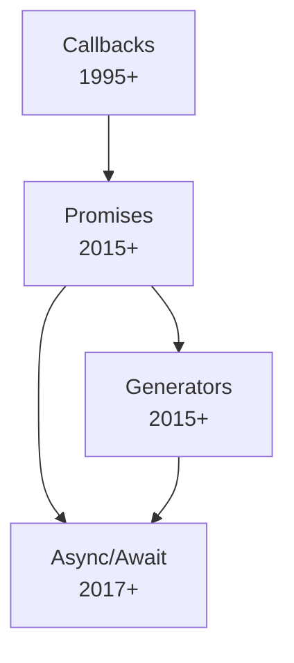
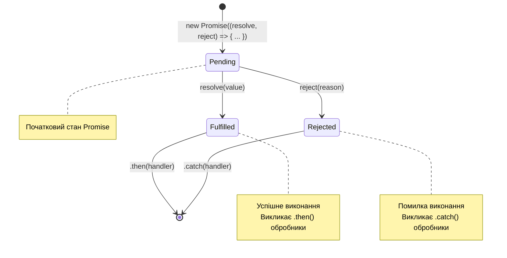

# JavaScript: Асинхронність

## Коротке пояснення

**Асинхронність** у JavaScript — це можливість виконувати код не послідовно, дозволяючи операціям, які потенційно займають багато часу (завантаження даних, читання файлів, мережеві запити), виконуватися у фоновому режимі, не блокуючи основний потік виконання. Це особливо важливо для JavaScript, який є однопотоковою мовою, оскільки дозволяє створювати відгучливі веб-застосунки, які можуть продовжувати реагувати на дії користувача навіть під час виконання тривалих операцій.

---

## Callback-функції

Callback-функції — найстаріший і найбазовіший механізм асинхронного програмування в JavaScript. Це функції, які передаються як аргументи в інші функції і викликаються пізніше, коли асинхронна операція завершена.

### Основи використання callback-функцій

```javascript
// Проста callback-функція
function doSomethingAsync(callback) {
    setTimeout(() => {
        const result = 42;
        callback(result);
    }, 1000);
}

// Використання callback-функції
doSomethingAsync((result) => {
    console.log(`Отриманий результат: ${result}`);
});
console.log("Код продовжує виконуватися не чекаючи результату");
```

### Обробка помилок у callback-функціях

```javascript
function fetchData(url, onSuccess, onError) {
    const xhr = new XMLHttpRequest();
    xhr.open("GET", url);

    xhr.onload = function () {
        if (xhr.status === 200) {
            onSuccess(xhr.responseText);
        } else {
            onError(`Помилка: ${xhr.status}`);
        }
    };

    xhr.onerror = function () {
        onError("Мережева помилка");
    };

    xhr.send();
}

// Використання з обробкою помилок
fetchData(
    "https://api.example.com/data",
    (data) => {
        console.log("Отримані дані:", data);
    },
    (error) => {
        console.error("Помилка:", error);
    }
);
```

### Callback Hell (Пекло зворотних викликів)

Одна з головних проблем callback-функцій — це "callback hell" або "піраміда приречення", яка виникає при вкладенні багатьох callback-функцій.

```javascript
// Приклад "callback hell"
getUser(
    userId,
    (user) => {
        getPermissions(
            user.id,
            (permissions) => {
                getArticles(
                    permissions.articles,
                    (articles) => {
                        getSortedArticles(
                            articles,
                            (sortedArticles) => {
                                getComments(
                                    sortedArticles[0].id,
                                    (comments) => {
                                        // Важко підтримувати та розуміти глибоко вкладені callbacks
                                        displayArticleWithComments(
                                            sortedArticles[0],
                                            comments
                                        );
                                    },
                                    (error) => {
                                        handleError(error);
                                    }
                                );
                            },
                            (error) => {
                                handleError(error);
                            }
                        );
                    },
                    (error) => {
                        handleError(error);
                    }
                );
            },
            (error) => {
                handleError(error);
            }
        );
    },
    (error) => {
        handleError(error);
    }
);
```

### Способи покращення роботи з callback-функціями

1. **Розбиття на іменовані функції**:

```javascript
function handleComments(comments) {
    displayArticleWithComments(currentArticle, comments);
}

function fetchComments(article) {
    currentArticle = article;
    getComments(article.id, handleComments, handleError);
}

function handleSortedArticles(articles) {
    getSortedArticles(
        articles,
        (sorted) => {
            fetchComments(sorted[0]);
        },
        handleError
    );
}

function handlePermissions(permissions) {
    getArticles(permissions.articles, handleSortedArticles, handleError);
}

function handleUser(user) {
    getPermissions(user.id, handlePermissions, handleError);
}

function handleError(error) {
    console.error("Error:", error);
}

// Основний код
getUser(userId, handleUser, handleError);
```

2. **Використання управління контролем потоку** (наприклад, з бібліотеками async.js):

```javascript
async.waterfall(
    [
        (callback) => {
            getUser(
                userId,
                (user) => callback(null, user),
                (err) => callback(err)
            );
        },
        (user, callback) => {
            getPermissions(
                user.id,
                (permissions) => callback(null, permissions),
                (err) => callback(err)
            );
        },
        (permissions, callback) => {
            getArticles(
                permissions.articles,
                (articles) => callback(null, articles),
                (err) => callback(err)
            );
        },
    ],
    (err, result) => {
        if (err) {
            handleError(err);
        } else {
            console.log("Результат:", result);
        }
    }
);
```

---

## Promises (Обіцянки)

Promises — це об'єкти, які представляють майбутній результат асинхронної операції, дозволяючи писати більш лінійний та структурований асинхронний код.

### Основи використання Promises

```javascript
// Створення Promise
function fetchData(url) {
  return new Promise((resolve, reject) => {
    const xhr = new XMLHttpRequest();
    xhr.open('GET', url);

    xhr.onload = function() {
      if (xhr.status === 200) {
        resolve(xhr.responseText);
      } else {
        reject(new Error(`Помилка запиту: ${xhr.status}`));
      }
    };

    xhr.onerror = function() {
      reject(new Error('Мережева помилка'));
    };

    xhr.send();
  });
}

// Використання Promise
fetchData('https://api.example.com/data')
  .then(data => {
    console.log('Отримані дані:', data);
    return JSON.parse(data); // Повертаємо новий Promise
  })
  .then(parsed => {
    console.log('Дані після обробки:', parsed);
    return fetchData(`https://api.example.com/related/${parsed.id}`);
  })
  .then(relatedData => {
    console.log('Пов'язані дані:', relatedData);
  })
  .catch(error => {
    console.error('Сталася помилка:', error);
  })
  .finally(() => {
    console.log('Запит завершено (успішно чи з помилкою)');
  });
```

### Стани Promise

Promise може бути в одному з трьох станів:

-   **Pending (Очікування)**: початковий стан, операція ще не завершена
-   **Fulfilled (Виконано)**: операція успішно завершена, Promise вирішено
-   **Rejected (Відхилено)**: сталася помилка, Promise відхилено

```javascript
// Створення Promise у різних станах
const pendingPromise = new Promise((resolve, reject) => {
    // Нічого не викликається, Promise залишається в стані "pending"
});

const fulfilledPromise = new Promise((resolve, reject) => {
    resolve("Дані"); // Promise переходить у стан "fulfilled"
});

const rejectedPromise = new Promise((resolve, reject) => {
    reject(new Error("Щось пішло не так")); // Promise переходить у стан "rejected"
});
```

### Методи класу Promise

| Метод                          | Опис                                                                  | Приклад                                    |
| ------------------------------ | --------------------------------------------------------------------- | ------------------------------------------ |
| `Promise.resolve(value)`       | Створює Promise, що відразу переходить у стан "fulfilled"             | `Promise.resolve(42)`                      |
| `Promise.reject(reason)`       | Створює Promise, що відразу переходить у стан "rejected"              | `Promise.reject(new Error('Failed'))`      |
| `Promise.all(iterable)`        | Очікує виконання всіх Promise, повертає масив результатів             | `Promise.all([promise1, promise2])`        |
| `Promise.race(iterable)`       | Повертає результат першого завершеного Promise                        | `Promise.race([promise1, promise2])`       |
| `Promise.allSettled(iterable)` | Очікує завершення всіх Promise, повертає масив статусів і результатів | `Promise.allSettled([promise1, promise2])` |
| `Promise.any(iterable)`        | Повертає результат першого успішно виконаного Promise                 | `Promise.any([promise1, promise2])`        |

### Приклади використання методів Promise

```javascript
// Promise.all - чекаємо, поки всі обіцянки будуть виконані
Promise.all([
    fetch("/api/users").then((r) => r.json()),
    fetch("/api/posts").then((r) => r.json()),
    fetch("/api/comments").then((r) => r.json()),
])
    .then(([users, posts, comments]) => {
        console.log("Користувачі:", users);
        console.log("Дописи:", posts);
        console.log("Коментарі:", comments);
    })
    .catch((error) => {
        // Якщо хоч один запит завершиться помилкою, буде викликано catch
        console.error("Один із запитів завершився помилкою:", error);
    });

// Promise.race - отримуємо результат найшвидшого запиту
Promise.race([
    fetch("/api/server1/data").then((r) => r.json()),
    fetch("/api/server2/data").then((r) => r.json()),
    fetch("/api/server3/data").then((r) => r.json()),
])
    .then((fastestResult) => {
        console.log("Результат найшвидшого сервера:", fastestResult);
    })
    .catch((error) => {
        console.error("Найшвидший запит завершився помилкою:", error);
    });

// Promise.allSettled - отримуємо результати всіх запитів, незалежно від успіху
Promise.allSettled([
    fetch("/api/reliable").then((r) => r.json()),
    fetch("/api/flaky").then((r) => r.json()),
    fetch("/api/errorprone").then((r) => r.json()),
]).then((results) => {
    results.forEach((result, index) => {
        if (result.status === "fulfilled") {
            console.log(`Запит ${index} успішний:`, result.value);
        } else {
            console.log(`Запит ${index} невдалий:`, result.reason);
        }
    });
});

// Promise.any - отримуємо перший успішний результат
Promise.any([
    fetch("/api/backup1/data").then((r) => r.json()),
    fetch("/api/backup2/data").then((r) => r.json()),
    fetch("/api/main/data").then((r) => r.json()),
])
    .then((firstSuccess) => {
        console.log("Перший успішний результат:", firstSuccess);
    })
    .catch((error) => {
        // AggregateError якщо всі Promise були відхилені
        console.error("Всі запити завершилися помилкою:", error);
    });
```

### Ланцюжки Promise

Один з головних плюсів Promise — це можливість створювати ланцюжки асинхронних операцій.

```javascript
function fetchUserData(userId) {
    return fetch(`/api/users/${userId}`).then((response) => {
        if (!response.ok) throw new Error("Користувача не знайдено");
        return response.json();
    });
}

function fetchUserPosts(user) {
    return fetch(`/api/posts?userId=${user.id}`)
        .then((response) => {
            if (!response.ok) throw new Error("Не вдалося отримати дописи");
            return response.json();
        })
        .then((posts) => {
            // Повертаємо і користувача, і його дописи
            return { user, posts };
        });
}

function fetchComments(data) {
    const latestPost = data.posts[0];
    return fetch(`/api/comments?postId=${latestPost.id}`)
        .then((response) => {
            if (!response.ok) throw new Error("Не вдалося отримати коментарі");
            return response.json();
        })
        .then((comments) => {
            // Додаємо коментарі до результату
            return {
                user: data.user,
                posts: data.posts,
                comments,
            };
        });
}

// Використовуємо ланцюжок Promise
fetchUserData(123)
    .then(fetchUserPosts)
    .then(fetchComments)
    .then((data) => {
        console.log("Всі дані:", data);
        // Тут можна рендерити UI з отриманими даними
    })
    .catch((error) => {
        console.error("Помилка в ланцюжку Promise:", error);
    });
```

---

## Async/Await

Async/await — це синтаксичний цукор над Promise, який дозволяє писати асинхронний код так, ніби він синхронний, що значно покращує читабельність.

### Основи async/await

```javascript
// Функція, позначена як async, завжди повертає Promise
async function fetchUserData(userId) {
    try {
        // await призупиняє виконання функції до отримання результату Promise
        const response = await fetch(`/api/users/${userId}`);

        if (!response.ok) {
            throw new Error(`HTTP помилка: ${response.status}`);
        }

        // Код нижче виконається тільки після завершення попереднього Promise
        const userData = await response.json();
        return userData;
    } catch (error) {
        console.error("Помилка при отриманні даних користувача:", error);
        throw error; // Перекидаємо помилку для обробки на вищому рівні
    }
}

// Використання async-функції
async function displayUserInfo() {
    try {
        const user = await fetchUserData(123);
        console.log("Інформація про користувача:", user);
    } catch (error) {
        console.error(
            "Не вдалося відобразити інформацію про користувача:",
            error
        );
    }
}

// Виклик асинхронної функції
displayUserInfo();
```

### Послідовні і паралельні операції з async/await

```javascript
// Послідовне виконання - кожна операція чекає завершення попередньої
async function sequentialFetching() {
    console.time("sequential");

    const users = await fetch("/api/users").then((r) => r.json());
    const posts = await fetch("/api/posts").then((r) => r.json());
    const comments = await fetch("/api/comments").then((r) => r.json());

    console.timeEnd("sequential");
    return { users, posts, comments };
}

// Паралельне виконання - всі операції запускаються одночасно
async function parallelFetching() {
    console.time("parallel");

    // Запускаємо всі запити одночасно
    const usersPromise = fetch("/api/users").then((r) => r.json());
    const postsPromise = fetch("/api/posts").then((r) => r.json());
    const commentsPromise = fetch("/api/comments").then((r) => r.json());

    // Чекаємо на всі результати
    const users = await usersPromise;
    const posts = await postsPromise;
    const comments = await commentsPromise;

    console.timeEnd("parallel");
    return { users, posts, comments };
}

// Ще простіший спосіб паралельного виконання за допомогою Promise.all
async function parallelFetchingWithPromiseAll() {
    console.time("parallelWithPromiseAll");

    const [users, posts, comments] = await Promise.all([
        fetch("/api/users").then((r) => r.json()),
        fetch("/api/posts").then((r) => r.json()),
        fetch("/api/comments").then((r) => r.json()),
    ]);

    console.timeEnd("parallelWithPromiseAll");
    return { users, posts, comments };
}
```

### Обробка помилок в async/await

```javascript
// Локальна обробка за допомогою try/catch
async function fetchWithTryCatch() {
    try {
        const response = await fetch("https://api.example.com/data");
        if (!response.ok) throw new Error(`HTTP помилка: ${response.status}`);
        const data = await response.json();
        return data;
    } catch (error) {
        console.error("Помилка при запиті:", error);
        // Можна повернути резервні дані
        return { error: true, message: error.message };
    }
}

// Вищий рівень обробки помилок
async function fetchAndProcess() {
    try {
        // Викличе помилку, якщо fetchWithErrorPropagation викине помилку
        const data = await fetchWithErrorPropagation();
        processData(data);
    } catch (error) {
        showErrorToUser(error);
    }
}

// Передача помилки вище для обробки
async function fetchWithErrorPropagation() {
    const response = await fetch("https://api.example.com/data");
    if (!response.ok) throw new Error(`HTTP помилка: ${response.status}`);
    return await response.json();
}
```

### Складний приклад з async/await

```javascript
// Утилітарна функція для обробки помилок запиту
async function fetchJson(url, options = {}) {
    try {
        const response = await fetch(url, options);

        if (!response.ok) {
            throw new Error(
                `HTTP помилка: ${response.status} ${response.statusText}`
            );
        }

        return await response.json();
    } catch (error) {
        console.error(`Помилка при запиті до ${url}:`, error);
        throw error;
    }
}

// Основні функції для отримання даних
async function getUser(userId) {
    return await fetchJson(`/api/users/${userId}`);
}

async function getUserPermissions(userId) {
    return await fetchJson(`/api/users/${userId}/permissions`);
}

async function getArticles(categoryId) {
    return await fetchJson(`/api/articles?category=${categoryId}`);
}

async function getArticleComments(articleId) {
    return await fetchJson(`/api/articles/${articleId}/comments`);
}

// Складний приклад з послідовними і паралельними операціями
async function loadUserDashboard(userId) {
    try {
        // Спочатку отримуємо дані користувача
        const user = await getUser(userId);

        // Потім паралельно отримуємо дозволи та статті
        const [permissions, articles] = await Promise.all([
            getUserPermissions(userId),
            getArticles(user.preferredCategory),
        ]);

        // Перевіряємо дозволи на перегляд статей
        if (!permissions.canViewArticles) {
            throw new Error("У користувача немає дозволу на перегляд статей");
        }

        // Сортуємо статті за датою
        const sortedArticles = articles.sort(
            (a, b) => new Date(b.publishedAt) - new Date(a.publishedAt)
        );

        // Беремо 5 найновіших статей
        const recentArticles = sortedArticles.slice(0, 5);

        // Для кожної статті отримуємо коментарі (паралельно)
        const articlesWithComments = await Promise.all(
            recentArticles.map(async (article) => {
                const comments = await getArticleComments(article.id);
                return {
                    ...article,
                    comments: comments.slice(0, 3), // Тільки 3 останні коментарі
                };
            })
        );

        // Повертаємо всі зібрані дані
        return {
            user,
            permissions,
            articles: articlesWithComments,
        };
    } catch (error) {
        console.error("Помилка при завантаженні панелі користувача:", error);
        throw error;
    }
}

// Використання
async function renderDashboard(userId) {
    try {
        // Показуємо індикатор завантаження
        showLoadingIndicator();

        // Отримуємо всі необхідні дані
        const dashboardData = await loadUserDashboard(userId);

        // Відображаємо дані
        renderUserInfo(dashboardData.user);
        renderArticles(dashboardData.articles);
    } catch (error) {
        // Показуємо помилку користувачу
        showErrorMessage(`Не вдалося завантажити панель: ${error.message}`);
    } finally {
        // В будь-якому випадку ховаємо індикатор завантаження
        hideLoadingIndicator();
    }
}
```

---

## Порівняння підходів до асинхронності

| Підхід          | Переваги                                                                                                                                        | Недоліки                                                                                                                          | Коли використовувати                                                                                                                                    |
| --------------- | ----------------------------------------------------------------------------------------------------------------------------------------------- | --------------------------------------------------------------------------------------------------------------------------------- | ------------------------------------------------------------------------------------------------------------------------------------------------------- |
| **Callbacks**   | - Простий базовий механізм<br>- Підтримується всюди<br>- Немає додаткових абстракцій                                                            | - Callback hell<br>- Складно обробляти помилки<br>- Важко обробляти паралельні операції                                           | - Для простих асинхронних операцій<br>- В старих кодових базах<br>- Для сумісності з API, що використовують callbacks                                   |
| **Promises**    | - Уникнення callback hell<br>- Покращена обробка помилок<br>- Зручні методи для комбінування (all, race)<br>- Ланцюжки для послідовних операцій | - Складніші для розуміння, ніж callbacks<br>- Не можуть бути скасовані<br>- Велика кількість .then() може бути важкою для читання | - Для більшості асинхронних операцій<br>- Коли потрібно комбінувати результати декількох асинхронних операцій<br>- Коли потрібна хороша обробка помилок |
| **Async/Await** | - Схожий на синхронний код<br>- Найкраща читабельність<br>- Проста обробка помилок з try/catch<br>- Легко комбінувати з Promise                 | - Вимагає ES2017 або транспіляцію<br>- Можлива надмірна послідовність операцій<br>- Потрібно розуміти як працюють Promise         | - Для нових проєктів<br>- Коли потрібна найкраща читабельність<br>- Для складної логіки, де callbacks і Promise стають заплутаними                      |

### Рефакторинг від callbacks до Promise до async/await

**Версія з callback**:

```javascript
function getUser(userId, callback) {
    const xhr = new XMLHttpRequest();
    xhr.open("GET", `/api/users/${userId}`);
    xhr.onload = function () {
        if (xhr.status === 200) {
            const user = JSON.parse(xhr.responseText);
            callback(null, user);
        } else {
            callback(new Error(`Request failed: ${xhr.status}`));
        }
    };
    xhr.onerror = function () {
        callback(new Error("Network error"));
    };
    xhr.send();
}

// Використання
getUser(123, function (error, user) {
    if (error) {
        console.error("Error:", error);
        return;
    }
    console.log("User:", user);
});
```

**Версія з Promise**:

```javascript
function getUser(userId) {
    return new Promise((resolve, reject) => {
        const xhr = new XMLHttpRequest();
        xhr.open("GET", `/api/users/${userId}`);
        xhr.onload = function () {
            if (xhr.status === 200) {
                const user = JSON.parse(xhr.responseText);
                resolve(user);
            } else {
                reject(new Error(`Request failed: ${xhr.status}`));
            }
        };
        xhr.onerror = function () {
            reject(new Error("Network error"));
        };
        xhr.send();
    });
}

// Використання
getUser(123)
    .then((user) => {
        console.log("User:", user);
    })
    .catch((error) => {
        console.error("Error:", error);
    });
```

**Версія з Fetch API та async/await**:

```javascript
async function getUser(userId) {
    try {
        const response = await fetch(`/api/users/${userId}`);
        if (!response.ok) {
            throw new Error(`Request failed: ${response.status}`);
        }
        const user = await response.json();
        return user;
    } catch (error) {
        console.error("Error in getUser:", error);
        throw error;
    }
}

// Використання
async function displayUser() {
    try {
        const user = await getUser(123);
        console.log("User:", user);
    } catch (error) {
        console.error("Error:", error);
    }
}

displayUser();
```

---

## Підкапотні механізми

### Як JavaScript обробляє асинхронні операції

JavaScript є однопотоковою мовою, що означає, що він може виконувати лише одну операцію за раз. Асинхронність реалізується через механізм Event Loop (циклу подій).

#### Взаємодія асинхронних операцій з Event Loop

1. **Call Stack (Стек викликів)** — структура даних LIFO (Last In, First Out), яка відстежує виконання функцій
2. **Web APIs** — надаються браузером API для асинхронних операцій (setTimeout, fetch, DOM події)
3. **Callback Queue (Черга зворотних викликів)** — сюди потрапляють завершені асинхронні операції
4. **Microtask Queue** — черга високого пріоритету для обробки проміжних асинхронних операцій (використовується Promise)
5. **Event Loop** — механізм, що переміщує завершені асинхронні операції з черг до стеку викликів, коли він пустий

```
+------------------+     +----------------+
|                  |     |                |
|   JavaScript     |     |                |
|    Engine        |     |  Web APIs      |
|                  |     |  setTimeout    |
|  +------------+  |     |  fetch         |
|  |            |  |     |  DOM Events    |
|  | Call Stack |  |     |                |
|  |            |  |     |                |
|  +------------+  |     |                |
|        ^         |     |                |
|        |         |     |                |
+------------------+     +----------------+
         |                       |
         |                       v
+------------------+     +----------------+
|                  |     |                |
|   Event Loop     |     | Callback Queue |
|                  |     |                |
+------------------+     +----------------+
         ^                       ^
         |                       |
+------------------+
|                  |
| Microtask Queue  |
|                  |
+------------------+
```

#### Порядок виконання асинхронних операцій

1. Виконується синхронний код у стеку викликів
2. Коли стек порожній, перевіряється Microtask Queue
3. Всі завдання з Microtask Queue виконуються до повного спорожнення черги
4. Потім перевіряється Callback Queue, і одне завдання переміщується в стек
5. Процес повторюється

```javascript
console.log("1. Синхронна операція");

setTimeout(() => {
    console.log("4. Callback у Task Queue (setTimeout)");
}, 0);

Promise.resolve().then(() => {
    console.log("3. Microtask у Microtask Queue");
});

console.log("2. Ще одна синхронна операція");

// Вивід:
// 1. Синхронна операція
// 2. Ще одна синхронна операція
// 3. Microtask у Microtask Queue
// 4. Callback у Task Queue (setTimeout)
```

### Особливості та підводні камені

#### 1. Обробка помилок

```javascript
// Втрачена помилка (неперехоплена)
function fetchData() {
    return fetch("/api/data").then((response) => response.json());
    // Немає .catch() для обробки помилок!
}

// Правильна обробка
function fetchData() {
    return fetch("/api/data")
        .then((response) => response.json())
        .catch((error) => {
            console.error("Error fetching data:", error);
            throw error; // Перекидаємо для обробки вище
        });
}
```

#### 2. Забуте await

```javascript
// Помилка: забутий await
async function fetchUserData() {
    try {
        const response = fetch("/api/users"); // Забутий await!
        const data = await response.json();
        return data;
    } catch (error) {
        console.error("Error:", error);
    }
}

// Правильно
async function fetchUserData() {
    try {
        const response = await fetch("/api/users");
        const data = await response.json();
        return data;
    } catch (error) {
        console.error("Error:", error);
    }
}
```

#### 3. Блокування Event Loop

```javascript
// Важка синхронна операція блокує Event Loop
function calculatePrimes(max) {
    const primes = [];
    for (let i = 2; i <= max; i++) {
        let isPrime = true;
        for (let j = 2; j < i; j++) {
            if (i % j === 0) {
                isPrime = false;
                break;
            }
        }
        if (isPrime) primes.push(i);
    }
    return primes;
}

// Важка операція блокує все
document.getElementById("calculate").addEventListener("click", () => {
    const primes = calculatePrimes(1000000); // Блокує UI
    console.log(primes.length);
});

// Краще: використовуємо асинхронність
document.getElementById("calculate").addEventListener("click", () => {
    // Показуємо індикатор завантаження
    showLoading();

    // Відкладаємо важке обчислення
    setTimeout(() => {
        const primes = calculatePrimes(1000000);
        console.log(primes.length);
        hideLoading();
    }, 0);
});

// Ще краще: використовуємо Web Worker для важких обчислень
const worker = new Worker("prime-worker.js");
document.getElementById("calculate").addEventListener("click", () => {
    showLoading();
    worker.postMessage({ max: 1000000 });
});

worker.onmessage = function (e) {
    console.log(e.data.length);
    hideLoading();
};
```

#### 4. Порядок виконання: Promise.all vs послідовні await

```javascript
// Послідовне виконання (повільніше)
async function sequential() {
    console.time("sequential");
    const data1 = await fetch("/api/data1").then((r) => r.json());
    const data2 = await fetch("/api/data2").then((r) => r.json());
    const data3 = await fetch("/api/data3").then((r) => r.json());
    console.timeEnd("sequential");
    return [data1, data2, data3];
}

// Паралельне виконання (швидше)
async function parallel() {
    console.time("parallel");
    const results = await Promise.all([
        fetch("/api/data1").then((r) => r.json()),
        fetch("/api/data2").then((r) => r.json()),
        fetch("/api/data3").then((r) => r.json()),
    ]);
    console.timeEnd("parallel");
    return results;
}
```

#### 5. Проблеми з this в асинхронному коді

```javascript
// Проблема з this
const user = {
    name: "John",
    fetchData: function () {
        fetch("/api/data").then(function (response) {
            // 'this' тут НЕ вказує на об'єкт user!
            this.data = response.json(); // Помилка
        });
    },
};

// Вирішення 1: збереження this
const user = {
    name: "John",
    fetchData: function () {
        const self = this;
        fetch("/api/data").then(function (response) {
            self.data = response.json(); // Працює
        });
    },
};

// Вирішення 2: стрілкова функція
const user = {
    name: "John",
    fetchData: function () {
        fetch("/api/data").then((response) => {
            // 'this' у стрілкових функціях зберігає контекст
            this.data = response.json(); // Працює
        });
    },
};
```

### Оптимізація асинхронного коду

#### 1. Кешування результатів

```javascript
// Простий кеш для мережевих запитів
const cache = new Map();

async function fetchWithCache(url) {
    if (cache.has(url)) {
        console.log(`Використовуємо кешований результат для ${url}`);
        return cache.get(url);
    }

    console.log(`Виконуємо запит до ${url}`);
    const response = await fetch(url);
    const data = await response.json();

    cache.set(url, data);
    return data;
}
```

#### 2. Скасування запитів

```javascript
// Використання AbortController для скасування запитів
async function fetchWithTimeout(url, timeoutMs = 5000) {
    const controller = new AbortController();
    const { signal } = controller;

    // Налаштовуємо таймаут
    const timeoutId = setTimeout(() => {
        controller.abort();
    }, timeoutMs);

    try {
        const response = await fetch(url, { signal });
        clearTimeout(timeoutId);
        return await response.json();
    } catch (error) {
        clearTimeout(timeoutId);
        if (error.name === "AbortError") {
            throw new Error(`Request to ${url} timed out after ${timeoutMs}ms`);
        }
        throw error;
    }
}

// Скасування запитів при зміні умов
function searchUsers(query) {
    // Зберігаємо поточний контролер
    if (this.currentController) {
        this.currentController.abort();
    }

    this.currentController = new AbortController();

    return fetch(`/api/search?q=${query}`, {
        signal: this.currentController.signal,
    }).then((response) => response.json());
}
```

#### 3. Обмеження швидкості запитів (Rate limiting)

```javascript
// Функція для обмеження кількості паралельних запитів
async function fetchWithConcurrencyLimit(urls, limit = 3) {
    const results = [];
    const inProgress = new Set();

    async function doFetch(url) {
        try {
            inProgress.add(url);
            const response = await fetch(url);
            const data = await response.json();
            results.push({ url, data, success: true });
        } catch (error) {
            results.push({ url, error, success: false });
        } finally {
            inProgress.delete(url);
        }
    }

    const queue = [...urls];

    async function processQueue() {
        if (queue.length === 0) return;

        if (inProgress.size < limit) {
            const url = queue.shift();
            // Запускаємо запит і одразу продовжуємо обробку черги
            doFetch(url).then(processQueue);
            // Рекурсивно перевіряємо, чи можемо запустити ще запити
            return processQueue();
        }

        // Чекаємо, поки звільниться місце для нового запиту
        await Promise.race(
            Array.from(inProgress).map((url) => fetch(url).catch(() => {}))
        );

        return processQueue();
    }

    // Запускаємо обробку черги
    await processQueue();

    // Чекаємо завершення всіх запитів
    while (inProgress.size > 0) {
        await new Promise((resolve) => setTimeout(resolve, 100));
    }

    return results;
}
```

#### 4. Повторні спроби при помилках

```javascript
// Функція з автоматичними повторами при помилках
async function fetchWithRetry(url, options = {}, maxRetries = 3, delay = 1000) {
    let lastError;

    for (let attempt = 1; attempt <= maxRetries; attempt++) {
        try {
            const response = await fetch(url, options);
            if (!response.ok) {
                throw new Error(`HTTP error: ${response.status}`);
            }
            return await response.json();
        } catch (error) {
            console.warn(
                `Attempt ${attempt} failed for ${url}:`,
                error.message
            );
            lastError = error;

            if (attempt < maxRetries) {
                // Експоненціальна затримка між спробами
                const retryDelay = delay * Math.pow(2, attempt - 1);
                console.log(`Retrying in ${retryDelay}ms...`);
                await new Promise((resolve) => setTimeout(resolve, retryDelay));
            }
        }
    }

    throw new Error(
        `Failed after ${maxRetries} attempts: ${lastError.message}`
    );
}
```

---

## Схеми та діаграми

### Еволюція асинхронного коду в JavaScript



### Життєвий цикл Promise



### Event Loop в контексті асинхронності

```
  +------------------------------+
  |          Call Stack          |
  |                              |
  | +------------------------+   |
  | |      main()            |   |
  | +------------------------+   |
  |                              |
  +------------------------------+
           |
           | Виконання асинхронних операцій
           v
  +------------------------------+
  |          Web APIs            |
  | +------------------------+   |
  | | setTimeout, fetch, I/O |   |
  | +------------------------+   |
  |                              |
  +------------------------------+
           |
           | Завершені операції
           v
  +------------------------------+
  |      Callback Queues         |
  |                              |
  | +------------------------+   |
  | |    Microtask Queue    |   |
  | | (Promise callbacks)   |   |
  | +------------------------+   |
  |                              |
  | +------------------------+   |
  | |     Task Queue        |   |
  | | (setTimeout, Events)  |   |
  | +------------------------+   |
  |                              |
  +------------------------------+
           ^
           | Event Loop перевіряє черги
           | і переміщує callbacks в Call Stack
           |
  +------------------------------+
  |        Event Loop            |
  |                              |
  +------------------------------+
```

### Порівняння асинхронних підходів

```
+---------------------------------------------------------------+
|                         Callbacks                              |
|                                                               |
|  doSomething(function(result1) {                              |
|    doSomethingElse(result1, function(result2) {              |
|      doThirdThing(result2, function(result3) {               |
|        console.log(result3);                                  |
|      });                                                      |
|    });                                                        |
|  });                                                          |
|                                                               |
+---------------------------------------------------------------+

+---------------------------------------------------------------+
|                         Promises                               |
|                                                               |
|  doSomething()                                                |
|    .then(function(result1) {                                  |
|      return doSomethingElse(result1);                         |
|    })                                                         |
|    .then(function(result2) {                                  |
|      return doThirdThing(result2);                            |
|    })                                                         |
|    .then(function(result3) {                                  |
|      console.log(result3);                                    |
|    })                                                         |
|    .catch(function(error) {                                   |
|      console.error(error);                                    |
|    });                                                        |
|                                                               |
+---------------------------------------------------------------+

+---------------------------------------------------------------+
|                       Async/Await                              |
|                                                               |
|  async function doAllThings() {                               |
|    try {                                                      |
|      const result1 = await doSomething();                     |
|      const result2 = await doSomethingElse(result1);          |
|      const result3 = await doThirdThing(result2);             |
|      console.log(result3);                                    |
|    } catch (error) {                                          |
|      console.error(error);                                    |
|    }                                                          |
|  }                                                            |
|                                                               |
+---------------------------------------------------------------+
```

> **Важливо**: Асинхронність є фундаментальною частиною JavaScript, особливо у веб-розробці, де багато операцій потенційно займають багато часу: мережеві запити, маніпуляції з DOM, файлові операції тощо. Розуміння та ефективне використання асинхронних патернів є ключовим для створення швидких, відгучливих та ефективних додатків.
