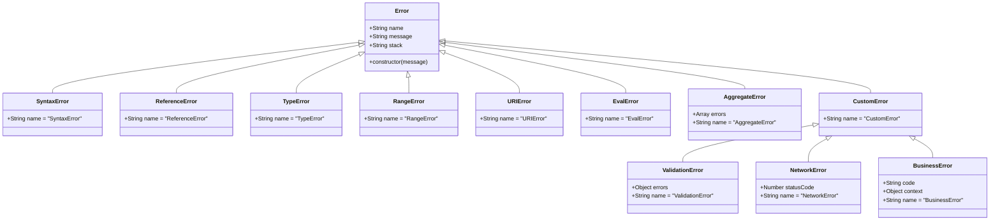

# JavaScript: Обробка помилок

## Коротке пояснення

**Обробка помилок** у JavaScript — це набір механізмів, які дозволяють виявляти, обробляти та реагувати на помилки, що виникають під час виконання коду. Ефективна обробка помилок є критично важливою для створення надійних та стійких додатків, оскільки допомагає запобігти аварійному завершенню програми та надає змогу елегантно реагувати на непередбачені ситуації.

---

## Типи помилок у JavaScript

### Вбудовані типи помилок

JavaScript має кілька вбудованих типів помилок, які виникають у різних ситуаціях:

| Тип помилки      | Опис                                              | Приклад                                                         |
| ---------------- | ------------------------------------------------- | --------------------------------------------------------------- |
| `Error`          | Базовий конструктор для всіх помилок              | `throw new Error('Загальна помилка')`                           |
| `SyntaxError`    | Синтаксична помилка в коді                        | `function foo( {` (відсутня закриваюча дужка)                   |
| `ReferenceError` | Спроба доступу до неоголошеної змінної            | `console.log(undefinedVar)`                                     |
| `TypeError`      | Операція на невідповідному типі                   | `null.toString()`                                               |
| `RangeError`     | Числове значення поза допустимим діапазоном       | `new Array(-1)`                                                 |
| `URIError`       | Некоректні параметри для функцій URI              | `decodeURI('%')`                                                |
| `EvalError`      | Помилка у функції eval() (рідко використовується) |                                                                 |
| `AggregateError` | Помилка, що представляє кілька помилок            | `Promise.any([Promise.reject('Err1'), Promise.reject('Err2')])` |

### Структура об'єкта помилки

Всі об'єкти помилок мають спільну структуру:

```javascript
// Стандартна структура помилки
const error = new Error("Повідомлення про помилку");

console.log(error.name); // "Error" - ім'я типу помилки
console.log(error.message); // "Повідомлення про помилку" - опис помилки
console.log(error.stack); // Рядок із стеком викликів (де сталася помилка)
```

---

## try/catch/finally

Основний механізм обробки помилок у JavaScript — конструкція `try/catch/finally`, яка дозволяє перехоплювати та обробляти помилки.

### Базовий синтаксис

```javascript
try {
    // Блок коду, в якому можуть виникнути помилки
    console.log("Початок спроби");
    nonExistentFunction(); // Викличе ReferenceError
    console.log("Кінець спроби"); // Не виконається
} catch (error) {
    // Блок коду для обробки помилки
    console.error("Сталася помилка:", error.message);
} finally {
    // Блок коду, який виконається в будь-якому випадку
    console.log("Цей блок виконається завжди");
}
```

### Варіації синтаксису

```javascript
// Тільки try/catch
try {
    // Код, який може викликати помилку
} catch (error) {
    // Обробка помилки
}

// try/finally без catch (рідко використовується)
try {
    // Код, який може викликати помилку
} finally {
    // Цей блок виконається в будь-якому випадку
    // Помилка не буде перехоплена
}

// try/catch/finally
try {
    // Код, який може викликати помилку
} catch (error) {
    // Обробка помилки
} finally {
    // Виконається в будь-якому випадку
}

// try/catch без параметра помилки (з ES2019)
try {
    // Код, який може викликати помилку
} catch {
    // Обробка помилки без доступу до об'єкта помилки
}
```

### Особливості роботи try/catch

1. **Перехоплення лише runtime помилок**:

```javascript
// try/catch перехоплює лише помилки під час виконання
try {
    // Це викличе SyntaxError, але вона НЕ БУДЕ перехоплена try/catch
    // тому що синтаксичні помилки виявляються на етапі парсингу
    eval('if (true) { console.log("Hi") }}}'); // Зайві дужки
} catch (error) {
    // Цей блок не виконається для синтаксичних помилок
    console.error("Перехоплена помилка:", error);
}
```

2. **Вкладені try/catch**:

```javascript
try {
    console.log("Зовнішній try");

    try {
        console.log("Внутрішній try");
        throw new Error("Внутрішня помилка");
    } catch (innerError) {
        console.error("Внутрішній catch:", innerError.message);
        throw new Error("Нова помилка з внутрішнього catch");
    } finally {
        console.log("Внутрішній finally");
    }
} catch (outerError) {
    console.error("Зовнішній catch:", outerError.message);
} finally {
    console.log("Зовнішній finally");
}

// Вивід:
// Зовнішній try
// Внутрішній try
// Внутрішній catch: Внутрішня помилка
// Внутрішній finally
// Зовнішній catch: Нова помилка з внутрішнього catch
// Зовнішній finally
```

3. **Типи перехоплюваних помилок**:

```javascript
try {
    // Код може викликати різні типи помилок
    const value = Math.random();

    if (value < 0.3) {
        throw new TypeError("Помилка типу");
    } else if (value < 0.6) {
        throw new RangeError("Помилка діапазону");
    } else {
        throw new Error("Загальна помилка");
    }
} catch (error) {
    // Перевірка типу помилки
    if (error instanceof TypeError) {
        console.error("Обробка помилки типу:", error.message);
    } else if (error instanceof RangeError) {
        console.error("Обробка помилки діапазону:", error.message);
    } else {
        console.error("Обробка загальної помилки:", error.message);
    }
}
```

### Використання try/catch з асинхронним кодом

1. **Обробка помилок у callbacks**:

```javascript
// Приклад зі старим підходом (callbacks)
function fetchData(callback) {
    setTimeout(() => {
        try {
            // Симуляція помилки
            throw new Error("Помилка отримання даних");
            // callback(null, 'Дані'); - не виконається
        } catch (error) {
            callback(error, null);
        }
    }, 1000);
}

fetchData((error, data) => {
    if (error) {
        console.error("Помилка:", error.message);
    } else {
        console.log("Отримані дані:", data);
    }
});
```

2. **Обробка помилок у Promise**:

```javascript
// Використання .catch() для Promise
function fetchData() {
    return new Promise((resolve, reject) => {
        setTimeout(() => {
            const success = Math.random() > 0.5;
            if (success) {
                resolve("Дані успішно отримані");
            } else {
                reject(new Error("Не вдалося отримати дані"));
            }
        }, 1000);
    });
}

fetchData()
    .then((data) => {
        console.log("Успіх:", data);
        return processData(data);
    })
    .then((result) => {
        console.log("Результат обробки:", result);
    })
    .catch((error) => {
        // Перехоплює всі помилки у ланцюжку Promise
        console.error("Сталася помилка:", error.message);
    })
    .finally(() => {
        console.log("Запит завершено");
    });
```

3. **Обробка помилок з async/await**:

```javascript
// Використання try/catch з async/await
async function fetchAndProcessData() {
    try {
        const data = await fetchData(); // Може викинути помилку
        console.log("Отримані дані:", data);

        const processed = await processData(data); // Також може викинути помилку
        console.log("Оброблені дані:", processed);

        return processed;
    } catch (error) {
        console.error("Помилка в процесі:", error.message);
        // Можна повернути запасний варіант або перекинути помилку далі
        throw new Error(`Не вдалося завершити операцію: ${error.message}`);
    } finally {
        console.log("Операції завершено");
    }
}

// Використання
fetchAndProcessData()
    .then((result) => {
        console.log("Фінальний результат:", result);
    })
    .catch((error) => {
        console.error("Помилка:", error.message);
    });
```

---

## Кидання помилок (throw)

Оператор `throw` дозволяє генерувати власні помилки, які потім можна обробляти за допомогою `try/catch`.

### Основи використання throw

```javascript
function divide(a, b) {
    // Перевірка аргументів
    if (typeof a !== "number" || typeof b !== "number") {
        throw new TypeError("Обидва аргументи повинні бути числами");
    }

    if (b === 0) {
        throw new Error("Ділення на нуль неможливе");
    }

    return a / b;
}

try {
    console.log(divide(10, 2)); // 5
    console.log(divide("10", 2)); // Викине TypeError
    console.log(divide(10, 0)); // Не виконається
} catch (error) {
    console.error("Помилка при діленні:", error.message);
}
```

### Що можна кидати

```javascript
// 1. Об'єкт Error або його нащадки
throw new Error("Повідомлення про помилку");
throw new TypeError("Неправильний тип");

// 2. Примітивні значення (не рекомендується)
throw "Рядок помилки";
throw 42;
throw true;
throw null;

// 3. Об'єкти
throw { code: 404, message: "Не знайдено" };
```

> **Важливо**: Хоча JavaScript дозволяє кидати будь-який тип даних, рекомендується завжди кидати об'єкти помилок (`Error` або його підкласи), оскільки вони містять трасування стеку, що значно спрощує налагодження.

---

## Власні (Custom) помилки

Створення власних типів помилок дозволяє розширювати стандартну ієрархію помилок і реалізовувати специфічну для додатку логіку обробки помилок.

### Створення власних класів помилок

```javascript
// Базовий клас для API помилок
class APIError extends Error {
    constructor(message, statusCode) {
        super(message);
        this.name = "APIError";
        this.statusCode = statusCode;

        // Для правильного трасування стеку в V8
        if (Error.captureStackTrace) {
            Error.captureStackTrace(this, APIError);
        }
    }
}

// Спеціалізовані типи API помилок
class NotFoundError extends APIError {
    constructor(resource) {
        super(`Ресурс "${resource}" не знайдено`, 404);
        this.name = "NotFoundError";
        this.resource = resource;
    }
}

class ValidationError extends APIError {
    constructor(errors) {
        super("Помилка валідації даних", 400);
        this.name = "ValidationError";
        this.errors = errors;
    }
}

class AuthenticationError extends APIError {
    constructor() {
        super("Необхідна автентифікація", 401);
        this.name = "AuthenticationError";
    }
}

// Використання власних помилок
function fetchUserData(userId) {
    if (!userId) {
        throw new ValidationError({ userId: "ID користувача обов'язковий" });
    }

    if (!isAuthenticated()) {
        throw new AuthenticationError();
    }

    const user = findUserInDatabase(userId);

    if (!user) {
        throw new NotFoundError(`Користувач з ID ${userId}`);
    }

    return user;
}

// Обробка власних помилок
try {
    const user = fetchUserData(5);
    console.log("Користувач:", user);
} catch (error) {
    if (error instanceof ValidationError) {
        console.error("Помилка валідації:", error.errors);
        // Показати помилки валідації в формі
    } else if (error instanceof AuthenticationError) {
        console.error("Помилка автентифікації");
        // Перенаправити користувача на сторінку входу
    } else if (error instanceof NotFoundError) {
        console.error(`Не знайдено: ${error.resource}`);
        // Показати 404 сторінку
    } else {
        console.error("Невідома помилка:", error.message);
        // Показати загальну помилку
    }

    // Можна використати статус-код для API відповідей
    if (error instanceof APIError) {
        console.log(`Відправлення відповіді з кодом ${error.statusCode}`);
    }
}
```

### Використання символів для спеціальних властивостей

```javascript
// Використання символів для розширення функціональності помилок
const ErrorCode = Symbol("ErrorCode");
const ErrorContext = Symbol("ErrorContext");

class BusinessError extends Error {
    constructor(message, code, context = {}) {
        super(message);
        this.name = "BusinessError";
        this[ErrorCode] = code;
        this[ErrorContext] = context;

        if (Error.captureStackTrace) {
            Error.captureStackTrace(this, BusinessError);
        }
    }

    get code() {
        return this[ErrorCode];
    }

    get context() {
        return this[ErrorContext];
    }
}

// Приклад використання
try {
    throw new BusinessError(
        "Не вдалося завершити транзакцію",
        "TRANSACTION_FAILED",
        { transactionId: "1234", amount: 50.0 }
    );
} catch (error) {
    if (error instanceof BusinessError) {
        console.error(`Бізнес-помилка (${error.code}):`, error.message);
        console.error("Контекст:", error.context);

        // Логування для налагодження
        console.debug("Стек помилки:", error.stack);
    }
}
```

### Багатомовні помилки

```javascript
// Клас для створення помилок з підтримкою локалізації
class LocalizedError extends Error {
    constructor(messageKey, params = {}, locale = "uk") {
        // Використовуємо поточну локаль для вибору повідомлення
        const message = LocalizedError.getLocalizedMessage(
            messageKey,
            params,
            locale
        );
        super(message);

        this.name = "LocalizedError";
        this.messageKey = messageKey;
        this.params = params;
        this.locale = locale;

        if (Error.captureStackTrace) {
            Error.captureStackTrace(this, LocalizedError);
        }
    }

    // Переключення мови помилки
    localize(newLocale) {
        return new LocalizedError(this.messageKey, this.params, newLocale);
    }

    // Статичний метод для отримання локалізованого повідомлення
    static getLocalizedMessage(messageKey, params, locale) {
        const messages = {
            uk: {
                "validation.required": 'Поле "{field}" є обов\'язковим',
                "auth.invalid_credentials": "Невірний логін або пароль",
                "payment.insufficient_funds":
                    "Недостатньо коштів для здійснення платежу на суму {amount}",
            },
            en: {
                "validation.required": 'Field "{field}" is required',
                "auth.invalid_credentials": "Invalid username or password",
                "payment.insufficient_funds":
                    "Insufficient funds to make a payment of {amount}",
            },
        };

        // Отримуємо шаблон повідомлення або використовуємо ключ як запасний варіант
        const template = messages[locale]?.[messageKey] || messageKey;

        // Заміняємо параметри в шаблоні
        return template.replace(/{(\w+)}/g, (match, paramName) => {
            return params[paramName] !== undefined ? params[paramName] : match;
        });
    }
}

// Приклад використання
try {
    // Валідація форми
    if (!formData.username) {
        throw new LocalizedError(
            "validation.required",
            { field: "Username" },
            "en"
        );
    }

    // Перевірка балансу
    if (user.balance < amount) {
        throw new LocalizedError("payment.insufficient_funds", {
            amount: "$50.00",
        });
    }
} catch (error) {
    if (error instanceof LocalizedError) {
        // Виведемо повідомлення поточною мовою
        console.error("Помилка:", error.message);

        // Змінимо мову помилки для англомовного інтерфейсу
        const engError = error.localize("en");
        console.error("Error:", engError.message);
    }
}
```

---

## Стратегії обробки помилок

### Централізована обробка помилок

```javascript
// Глобальний обробник помилок для додатку
class ErrorHandler {
    constructor() {
        this.errorListeners = [];

        // Встановлення глобальних обробників
        this.setupGlobalHandlers();
    }

    // Додати слухача помилок
    addListener(listener) {
        this.errorListeners.push(listener);
        return this; // Для ланцюжка викликів
    }

    // Обробка помилки
    handleError(error, source = "application") {
        console.error(`[${source} error]:`, error);

        // Сповіщення всіх слухачів
        this.errorListeners.forEach((listener) => {
            try {
                listener(error, source);
            } catch (listenerError) {
                console.error("Error in error listener:", listenerError);
            }
        });

        // Додаткова логіка залежно від типу помилки
        if (error instanceof NetworkError) {
            this.handleNetworkError(error);
        } else if (error instanceof ValidationError) {
            this.handleValidationError(error);
        }

        // Логування помилки на сервер
        this.logToServer(error, source);
    }

    // Налаштування глобальних обробників
    setupGlobalHandlers() {
        // Неперехоплені виключення
        window.addEventListener("error", (event) => {
            this.handleError(
                event.error || new Error(event.message),
                "uncaught"
            );
            // Запобігаємо стандартній обробці браузера
            // event.preventDefault();
        });

        // Неперехоплені відхилення Promise
        window.addEventListener("unhandledrejection", (event) => {
            const error =
                event.reason instanceof Error
                    ? event.reason
                    : new Error(String(event.reason));

            this.handleError(error, "unhandled-promise");
            // event.preventDefault();
        });

        // Помилки AJAX запитів
        if (window.XMLHttpRequest) {
            const originalSend = XMLHttpRequest.prototype.send;

            XMLHttpRequest.prototype.send = function (...args) {
                // Додаємо обробник помилок до запиту
                this.addEventListener("error", (event) => {
                    const errorHandler = window.errorHandler;
                    if (errorHandler) {
                        errorHandler.handleError(
                            new NetworkError("XHR Request failed", {
                                url: this.responseURL,
                            }),
                            "xhr"
                        );
                    }
                });

                return originalSend.apply(this, args);
            };
        }
    }

    // Специфічні обробники для різних типів помилок
    handleNetworkError(error) {
        if (navigator.onLine === false) {
            // Показати повідомлення про відсутність з'єднання
            this.showOfflineMessage();
        } else {
            // Спробувати повторити запит
            this.scheduleRetry(error);
        }
    }

    handleValidationError(error) {
        // Показати помилки валідації у відповідних полях форми
        this.displayValidationErrors(error.errors);
    }

    // Логування помилки на сервер
    logToServer(error, source) {
        const errorData = {
            message: error.message,
            stack: error.stack,
            name: error.name,
            source,
            url: window.location.href,
            userAgent: navigator.userAgent,
            timestamp: new Date().toISOString(),
        };

        // Додаємо додаткові властивості помилки
        if (error.code) errorData.code = error.code;
        if (error.statusCode) errorData.statusCode = error.statusCode;

        // Надсилаємо дані на сервер логування
        try {
            fetch("/api/log/error", {
                method: "POST",
                headers: { "Content-Type": "application/json" },
                body: JSON.stringify(errorData),
                // Використовуємо keepalive для випадків, коли сторінка закривається
                keepalive: true,
            }).catch((e) => console.error("Failed to log error:", e));
        } catch (e) {
            console.error("Error logging failed:", e);
        }
    }

    // Додаткові методи
    showOfflineMessage() {
        // Реалізація показу повідомлення про офлайн режим
        console.log("Showing offline message");
    }

    scheduleRetry(error) {
        // Реалізація повторних спроб
        console.log("Scheduling retry for failed operation");
    }

    displayValidationErrors(errors) {
        // Реалізація відображення помилок валідації
        console.log("Displaying validation errors", errors);
    }
}

// Створення глобального обробника помилок
window.errorHandler = new ErrorHandler()
    .addListener((error, source) => {
        // Відображення помилки в UI
        showErrorNotification(error.message);
    })
    .addListener((error, source) => {
        // Аналітика помилок
        trackErrorInAnalytics(error, source);
    });

// Користувацькі типи помилок
class NetworkError extends Error {
    constructor(message, context = {}) {
        super(message);
        this.name = "NetworkError";
        this.context = context;

        if (Error.captureStackTrace) {
            Error.captureStackTrace(this, NetworkError);
        }
    }
}

// Функції-утиліти для використання в коді
function handleErrorWith(fn, fallback) {
    return function (...args) {
        try {
            return fn(...args);
        } catch (error) {
            window.errorHandler.handleError(error);
            return fallback;
        }
    };
}

// Приклад використання
const calculateTotal = handleErrorWith(
    (items) => {
        return items.reduce((sum, item) => sum + item.price, 0);
    },
    0 // Запасне значення у випадку помилки
);

// Асинхронна версія
function handleAsyncErrorWith(fn, fallback) {
    return async function (...args) {
        try {
            return await fn(...args);
        } catch (error) {
            window.errorHandler.handleError(error);
            return fallback;
        }
    };
}

const fetchUserProfile = handleAsyncErrorWith(
    async (userId) => {
        const response = await fetch(`/api/users/${userId}`);
        if (!response.ok) throw new Error("Failed to fetch user");
        return response.json();
    },
    { name: "Unknown User" } // Запасні дані
);
```

### Обробка помилок у Node.js

```javascript
// Обробка неперехоплених помилок у Node.js
process.on("uncaughtException", (error) => {
    console.error("Неперехоплена помилка:", error);

    // Логування помилки
    logErrorToFile(error);

    // Завершення процесу з кодом помилки
    // Важливо: процес повинен бути завершений, оскільки стан програми
    // може бути нестабільним після неперехопленої помилки
    process.exit(1);
});

// Неперехоплені відхилення Promise
process.on("unhandledRejection", (reason, promise) => {
    console.error("Неперехоплене відхилення Promise:");
    console.error("- Promise:", promise);
    console.error("- Причина:", reason);

    // В деяких випадках можна не завершувати процес,
    // але краще зробити це для стабільності програми
    process.exit(1);
});

// Підключення обробника для Express.js
const express = require("express");
const app = express();

// Обробник помилок для Express
app.use((err, req, res, next) => {
    console.error("Express error:", err);

    // Визначення статус-коду
    const statusCode = err.statusCode || 500;

    // Відправлення відповіді
    res.status(statusCode).json({
        error: {
            message:
                process.env.NODE_ENV === "production"
                    ? "Помилка сервера"
                    : err.message,
            code: err.code || "INTERNAL_ERROR",
        },
    });

    // Логування помилки
    logErrorToDatabase(err, req);
});

// Функція для логування помилок
function logErrorToFile(error) {
    const fs = require("fs");
    const logEntry = {
        timestamp: new Date().toISOString(),
        error: {
            name: error.name,
            message: error.message,
            stack: error.stack,
        },
    };

    fs.appendFile("error.log", JSON.stringify(logEntry) + "\n", (err) => {
        if (err) console.error("Failed to write error log:", err);
    });
}

// Логування в базу даних
async function logErrorToDatabase(error, req) {
    try {
        // Підключення до бази даних (MongoDB, PostgreSQL тощо)
        const errorLog = {
            timestamp: new Date(),
            errorName: error.name,
            errorMessage: error.message,
            errorStack: error.stack,
            requestMethod: req.method,
            requestPath: req.path,
            requestQuery: req.query,
            requestBody: req.body,
            requestHeaders: req.headers,
            userAgent: req.get("User-Agent"),
            userIp: req.ip,
        };

        // Запис у базу даних
        await db.collection("errorLogs").insertOne(errorLog);
    } catch (dbError) {
        console.error("Failed to log error to database:", dbError);
    }
}
```

---

## Підкапотні механізми

### Як помилки впливають на продуктивність

```javascript
// Уникайте використання try/catch у критичних для продуктивності місцях
function slowSum(arr) {
    let sum = 0;
    try {
        // У циклах, які виконуються багато разів,
        // try/catch може істотно сповільнити виконання
        for (let i = 0; i < arr.length; i++) {
            sum += arr[i];
        }
    } catch (error) {
        console.error("Error in sum:", error);
    }
    return sum;
}

// Кращий підхід - перенести try/catch за межі критичного коду
function fastSum(arr) {
    try {
        // Перевіряємо аргументи перед критичним кодом
        if (!Array.isArray(arr)) {
            throw new TypeError("Argument must be an array");
        }

        // Критичний код без try/catch
        let sum = 0;
        for (let i = 0; i < arr.length; i++) {
            sum += arr[i];
        }
        return sum;
    } catch (error) {
        console.error("Error in sum:", error);
        return 0;
    }
}
```

### Обмеження стандартних об'єктів помилок

```javascript
// Проблеми стандартних об'єктів помилок

// 1. Серіалізація JSON відкидає стек викликів
const error = new Error("Test error");
console.log(JSON.stringify(error)); // Зазвичай {"message":"Test error"}

// 2. Нетипова робота з успадкуванням (до ES6)
function CustomError(message) {
    this.message = message;
    // Без цього стек буде відсутній або неправильний
    Error.captureStackTrace(this, CustomError);
}
CustomError.prototype = Object.create(Error.prototype);
CustomError.prototype.constructor = CustomError;
CustomError.prototype.name = "CustomError";

// 3. Стеки викликів відрізняються між браузерами і Node.js
try {
    throw new Error("Test error");
} catch (error) {
    console.log(error.stack);
    // Chrome: "Error: Test error at <anonymous>:2:9"
    // Firefox: "Error: Test error@debugger eval code:2:9"
    // Node.js: "Error: Test error at Object.<anonymous> (/path/to/file.js:2:9)"
}
```

### Як JavaScript створює об'єкти помилок

```javascript
// Внутрішній процес при створенні об'єкта помилки
function createError(message) {
    // 1. Створення об'єкта помилки
    const error = new Error(message);

    // 2. Встановлення стеку викликів
    // В реальності це робиться автоматично рушієм JavaScript
    if (Error.captureStackTrace) {
        // V8 (Chrome, Node.js)
        Error.captureStackTrace(error, createError);
    } else {
        // Інші рушії симулюють створення стеку
        const stack = new Error().stack;
        Object.defineProperty(error, "stack", {
            value: stack,
        });
    }

    // 3. Повернення об'єкта помилки
    return error;
}
```

### Стек викликів та його читання

```javascript
function functionA() {
    functionB();
}

function functionB() {
    functionC();
}

function functionC() {
    try {
        throw new Error("Помилка в functionC");
    } catch (error) {
        console.log("Стек викликів:");

        // Розбір стеку викликів
        const stackLines = error.stack.split("\n");

        // Перший рядок - повідомлення помилки
        console.log("Повідомлення:", stackLines[0]);

        // Інші рядки - стек викликів (формат залежить від браузера/середовища)
        stackLines.slice(1).forEach((line, index) => {
            console.log(`Рівень ${index + 1}:`, line.trim());

            // Розбір кожного рядка стеку (приклад для Chrome/V8)
            const match = line.match(/at\s+(.*?)\s+\((.*?):(\d+):(\d+)\)/);
            if (match) {
                const [, functionName, fileName, lineNumber, columnNumber] =
                    match;
                console.log(`  Функція: ${functionName}`);
                console.log(`  Файл: ${fileName}`);
                console.log(`  Рядок:Колонка: ${lineNumber}:${columnNumber}`);
            }
        });
    }
}

// Викликаємо функцію, щоб отримати стек
functionA();
```

### Оптимізація обробки помилок

```javascript
// Стратегії оптимізації обробки помилок

// 1. Використання ErrorBoundary в React
class ErrorBoundary extends React.Component {
    constructor(props) {
        super(props);
        this.state = { hasError: false, error: null };
    }

    static getDerivedStateFromError(error) {
        // Оновлюємо стан, щоб при наступному рендері показати запасний UI
        return { hasError: true, error };
    }

    componentDidCatch(error, errorInfo) {
        // Логування помилки
        console.error("React error boundary caught error:", error, errorInfo);
        logErrorToServer(error, errorInfo);
    }

    render() {
        if (this.state.hasError) {
            // Можна відрендерити будь-який запасний UI
            return <h1>Щось пішло не так. Спробуйте оновити сторінку.</h1>;
        }

        return this.props.children;
    }
}

// 2. Проміжне ПЗ для обробки помилок у Redux
const errorMiddleware = (store) => (next) => (action) => {
    try {
        return next(action);
    } catch (error) {
        console.error("Error in reducer or middleware:", error);
        store.dispatch({ type: "ERROR_OCCURRED", payload: error });
        throw error; // Перекидаємо помилку далі
    }
};

// 3. Патерн функціонального обробника помилок
const withErrorHandling =
    (fn, errorHandler) =>
    (...args) => {
        try {
            const result = fn(...args);

            // Перевіряємо, чи результат є Promise
            if (result && typeof result.catch === "function") {
                return result.catch((error) => {
                    return errorHandler(error, ...args);
                });
            }

            return result;
        } catch (error) {
            return errorHandler(error, ...args);
        }
    };

// Приклад використання:
const fetchData = withErrorHandling(
    async (url) => {
        const response = await fetch(url);
        if (!response.ok) throw new Error(`HTTP error: ${response.status}`);
        return response.json();
    },
    (error, url) => {
        console.error(`Failed to fetch ${url}:`, error);
        // Повертаємо запасні дані
        return { error: true, message: error.message };
    }
);

// 4. Стратегія обмеження кількості повторних спроб
class RetryableOperation {
    constructor(operation, options = {}) {
        this.operation = operation;
        this.maxRetries = options.maxRetries || 3;
        this.delay = options.delay || 1000;
        this.backoff = options.backoff || 2;
        this.timeout = options.timeout || 30000;
        this.onRetry = options.onRetry || (() => {});
        this.retryableErrors = options.retryableErrors || [
            "ECONNRESET",
            "ETIMEDOUT",
            "ECONNREFUSED",
        ];
    }

    async execute(...args) {
        let lastError;
        let startTime = Date.now();

        for (let attempt = 1; attempt <= this.maxRetries + 1; attempt++) {
            try {
                // Перевірка таймауту
                if (Date.now() - startTime > this.timeout) {
                    throw new Error("Operation timed out");
                }

                return await this.operation(...args);
            } catch (error) {
                lastError = error;

                // Перевіряємо, чи варто повторювати спробу
                if (
                    attempt <= this.maxRetries &&
                    this.isRetryableError(error)
                ) {
                    // Розрахунок затримки з експоненціальним відступом
                    const retryDelay =
                        this.delay * Math.pow(this.backoff, attempt - 1);

                    // Інформуємо про повторну спробу
                    this.onRetry(error, attempt, retryDelay);

                    // Чекаємо перед наступною спробою
                    await new Promise((resolve) =>
                        setTimeout(resolve, retryDelay)
                    );
                } else {
                    // Більше не повторюємо або помилка не підлягає повторній спробі
                    throw error;
                }
            }
        }

        // Цей код не повинен виконуватись, але на всяк випадок
        throw lastError;
    }

    isRetryableError(error) {
        // Перевіряємо, чи помилка підлягає повторній спробі
        if (error.code && this.retryableErrors.includes(error.code)) {
            return true;
        }

        // Перевіряємо на мережеві помилки fetch API
        if (error.name === "TypeError" && error.message.includes("fetch")) {
            return true;
        }

        // Перевіряємо помилки HTTP
        if (error.status >= 500 || error.status === 429) {
            return true;
        }

        return false;
    }
}

// Приклад використання
const retryableFetch = new RetryableOperation(
    async (url) => {
        const response = await fetch(url);
        if (!response.ok) {
            const error = new Error(`HTTP error: ${response.status}`);
            error.status = response.status;
            throw error;
        }
        return response.json();
    },
    {
        maxRetries: 3,
        delay: 1000,
        backoff: 2,
        onRetry: (error, attempt, delay) => {
            console.log(
                `Retry attempt ${attempt} after ${delay}ms due to error:`,
                error
            );
        },
    }
);

// Використання
retryableFetch
    .execute("https://api.example.com/data")
    .then((data) => console.log("Data:", data))
    .catch((error) => console.error("Final error:", error));
```

---

## Схеми та діаграми

### Ієрархія класів помилок в JavaScript



### Життєвий цикл обробки помилок


### Порівняння обробки помилок у синхронному та асинхронному коді

```
+------------------------------------------------------+
|                  Синхронний код                      |
|                                                      |
|  try {                                               |
|    // Синхронна операція                             |
|    const result = riskyOperation();                  |
|    console.log(result);                              |
|  } catch (error) {                                   |
|    // Перехоплення помилки                           |
|    console.error('Помилка:', error.message);         |
|  } finally {                                         |
|    // Виконується завжди                             |
|    cleanup();                                        |
|  }                                                   |
|                                                      |
+------------------------------------------------------+

+------------------------------------------------------+
|                 Callback-функції                     |
|                                                      |
|  riskyOperation((error, result) => {                 |
|    if (error) {                                      |
|      // Обробка помилки                              |
|      console.error('Помилка:', error.message);       |
|      return;                                         |
|    }                                                 |
|                                                      |
|    // Обробка результату                             |
|    console.log(result);                              |
|  });                                                 |
|                                                      |
+------------------------------------------------------+

+------------------------------------------------------+
|                     Promise                          |
|                                                      |
|  riskyOperation()                                    |
|    .then(result => {                                 |
|      // Обробка результату                           |
|      console.log(result);                            |
|    })                                                |
|    .catch(error => {                                 |
|      // Обробка помилки                              |
|      console.error('Помилка:', error.message);       |
|    })                                                |
|    .finally(() => {                                  |
|      // Виконується завжди                           |
|      cleanup();                                      |
|    });                                               |
|                                                      |
+------------------------------------------------------+

+------------------------------------------------------+
|                   Async/Await                        |
|                                                      |
|  async function performOperation() {                 |
|    try {                                             |
|      // Асинхронна операція                          |
|      const result = await riskyOperation();          |
|      console.log(result);                            |
|    } catch (error) {                                 |
|      // Перехоплення помилки                         |
|      console.error('Помилка:', error.message);       |
|    } finally {                                       |
|      // Виконується завжди                           |
|      cleanup();                                      |
|    }                                                 |
|  }                                                   |
|                                                      |
+------------------------------------------------------+
```

### Потік помилок в архітектурі додатку


> **Важливо**: Ефективна обробка помилок є одним з ключових аспектів створення стійких та надійних JavaScript-додатків. Правильно реалізована система обробки помилок не тільки покращує користувацький досвід, запобігаючи неочікуваному падінню додатка, але й значно спрощує розробку та налагодження, надаючи чітку інформацію про проблеми, що виникають.
