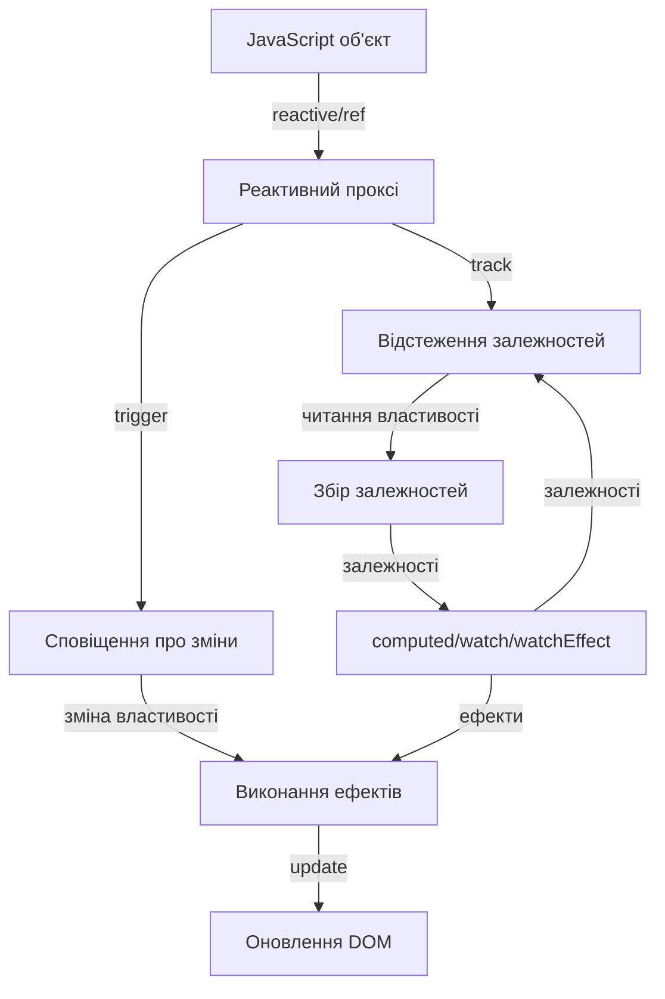
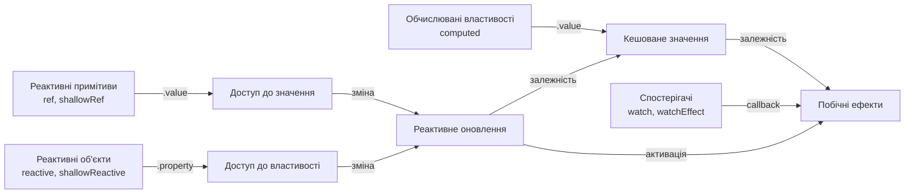

# Vue 3: Основи реактивності

## Коротке пояснення

**Реактивність** у Vue 3 — це система, яка автоматично відстежує зміни у JavaScript-даних і ефективно оновлює DOM, коли ці дані змінюються. Це фундаментальний механізм, на якому побудована вся екосистема Vue. У Vue 3 був впроваджений абсолютно новий підхід до реактивності, заснований на проксі-об'єктах (ES6 Proxy), що значно підвищило продуктивність і усунуло обмеження, які існували у Vue 2.

---

## reactive

Функція `reactive` — це основний спосіб створення реактивного стану в Composition API. Вона перетворює об'єкт на реактивний проксі, який відстежує всі зміни властивостей і вкладених об'єктів.

### Основи використання reactive

```javascript
import { reactive } from "vue";

export default {
    setup() {
        // Створення реактивного об'єкта
        const state = reactive({
            count: 0,
            user: {
                name: "John",
                age: 30,
            },
            items: ["Apple", "Banana", "Orange"],
        });

        // Зміна реактивних даних
        function increment() {
            state.count++;
        }

        function updateUser() {
            state.user.name = "Jane";
            state.user.age = 25;
        }

        function addItem() {
            state.items.push("Grape");
        }

        return {
            state,
            increment,
            updateUser,
            addItem,
        };
    },
};
```

### Обмеження reactive

1. **Працює лише з об'єктами**: `reactive` може перетворити на реактивний лише об'єкт (включаючи масиви та колекції, такі як Map і Set).

```javascript
// ✅ Правильно - об'єкт
const user = reactive({ name: "John" });

// ✅ Правильно - масив
const list = reactive(["Apple", "Banana"]);

// ❌ Не працює - примітиви
const count = reactive(0); // Не буде реактивним!
const name = reactive("John"); // Не буде реактивним!
```

2. **Втрата реактивності при деструктуризації**: Реактивність втрачається, якщо властивості об'єкта деструктуризуються за межами реактивного об'єкта.

```javascript
const state = reactive({ count: 0, name: "John" });

// ❌ Втрата реактивності - примітиви відокремлені від проксі
const { count, name } = state;
count++; // Зміна не буде відстежуватися

// ✅ Правильний підхід - використання об'єкта цілком
function increment() {
    state.count++;
}

// ✅ Альтернатива - використання toRefs
const { count: countRef } = toRefs(state);
countRef.value++; // Реактивність збережена
```

3. **Заміна всього об'єкта**: Заміна всього реактивного об'єкта новим об'єктом порушує реактивні зв'язки.

```javascript
let state = reactive({ count: 0 });

// ❌ Втрата реактивності - заміна об'єкта
state = { count: 1 }; // Реактивний зв'язок втрачено

// ✅ Правильний підхід - оновлення властивостей
state.count = 1;

// ✅ Альтернатива - використання Object.assign
Object.assign(state, { count: 1, name: "John" });
```

### Глибока реактивність

`reactive` автоматично робить об'єкт глибоко реактивним, включно з усіма вкладеними об'єктами та масивами.

```javascript
const state = reactive({
    user: {
        profile: {
            address: {
                city: "New York",
            },
        },
    },
});

// Зміни на будь-якому рівні вкладеності будуть відстежуватися
function updateCity() {
    state.user.profile.address.city = "San Francisco";
    // UI автоматично оновиться
}
```

### Оптимізація реактивності

```javascript
import { reactive, markRaw, shallowReactive } from "vue";

// 1. markRaw - запобігає перетворенню об'єкта на реактивний
const rawObject = markRaw({
    hugeData: new Array(10000).fill("data"),
    doSomething() {
        /* складна логіка */
    },
});

const state = reactive({
    // rawObject не буде реактивним всередині state
    nonReactiveData: rawObject,

    // Нормальні реактивні дані
    reactiveData: { count: 0 },
});

// 2. shallowReactive - створює "неглибокий" реактивний об'єкт
// тільки властивості верхнього рівня є реактивними
const shallowState = shallowReactive({
    count: 0,
    user: {
        name: "John", // Зміни не викликатимуть оновлення UI
        profile: {
            age: 30, // Зміни не викликатимуть оновлення UI
        },
    },
});

// Тільки це викличе оновлення UI
shallowState.count++;
shallowState.user = { name: "Jane" };

// Це НЕ викличе оновлення UI
shallowState.user.name = "Jane";
```

---

## ref

Функція `ref` створює реактивне посилання на значення будь-якого типу. На відміну від `reactive`, `ref` може працювати з примітивними типами даних, обгортаючи їх у об'єкт з властивістю `value`.

### Основи використання ref

```javascript
import { ref } from "vue";

export default {
    setup() {
        // Створення реактивних примітивів
        const count = ref(0);
        const name = ref("John");
        const isActive = ref(true);

        // Створення реактивних об'єктів
        const user = ref({
            name: "John",
            age: 30,
        });

        // Створення реактивних масивів
        const items = ref(["Apple", "Banana", "Orange"]);

        // Доступ до значення і його зміна
        function increment() {
            // Завжди використовуйте .value для читання або зміни значення ref
            count.value++;
        }

        function updateUser() {
            // Для вкладених об'єктів також потрібен .value
            user.value.name = "Jane";
            user.value.age = 25;
        }

        function addItem() {
            items.value.push("Grape");
        }

        return {
            count,
            name,
            isActive,
            user,
            items,
            increment,
            updateUser,
            addItem,
        };
    },
};
```

### Особливості ref

1. **Автоматична розгортка у шаблонах**: У шаблонах Vue до властивості `value` не потрібно звертатися напряму.

```html
<template>
    <!-- Автоматична розгортка - не потрібен .value -->
    <div>Count: {{ count }}</div>
    <div>Name: {{ name }}</div>
    <div>User name: {{ user.name }}</div>

    <button @click="increment">Increment</button>
</template>

<script>
    import { ref } from "vue";

    export default {
        setup() {
            const count = ref(0);
            const name = ref("John");
            const user = ref({ name: "John", age: 30 });

            function increment() {
                // В JavaScript-коді потрібен .value
                count.value++;
            }

            return { count, name, user, increment };
        },
    };
</script>
```

2. **Реактивні об'єкти всередині ref**: Якщо значення `ref` є об'єктом, воно автоматично перетворюється на реактивне за допомогою `reactive`.

```javascript
const user = ref({
    name: "John",
    profile: {
        age: 30,
    },
});

// Зміни будь-якої властивості будуть реактивними
user.value.name = "Jane";
user.value.profile.age = 31;
```

3. **Використання з масивами та колекціями**:

```javascript
const list = ref(["Apple", "Banana"]);

// Методи масиву працюють як звичайно, але з .value
list.value.push("Orange");
list.value.pop();

// Перезапис масиву
list.value = [...list.value, "Grape", "Melon"];

// Доступ до елементів за індексом
const firstItem = list.value[0];

// Оновлення елемента за індексом
list.value[0] = "Pineapple";
```

### Розпакування ref з реактивних об'єктів

Коли `ref` вкладається в реактивний об'єкт, він автоматично розпаковується.

```javascript
import { ref, reactive } from "vue";

const count = ref(0);
const state = reactive({
    count,
    name: "John",
});

// Доступ без .value
console.log(state.count); // 0

// Оновлення ref оновить і state
count.value++;
console.log(state.count); // 1

// Оновлення через state оновить і ref
state.count++;
console.log(count.value); // 2
```

### Порівняння ref і reactive

```javascript
import { ref, reactive } from "vue";

// === Підхід з ref ===
const countRef = ref(0);
const userRef = ref({
    name: "John",
    age: 30,
});

function updateRef() {
    countRef.value++;
    userRef.value.age++;
    // Заміна всього об'єкта працює
    userRef.value = { name: "Jane", age: 25 };
}

// === Підхід з reactive ===
const stateReactive = reactive({
    count: 0,
    user: {
        name: "John",
        age: 30,
    },
});

function updateReactive() {
    stateReactive.count++;
    stateReactive.user.age++;
    // Заміна всього об'єкта не рекомендується
    // stateReactive = { count: 1, user: {...} }; // ❌ Помилка!

    // Замість цього оновлюйте властивості
    Object.assign(stateReactive, {
        count: 1,
        user: { name: "Jane", age: 25 },
    });
}
```

### Оптимізація для ref

```javascript
import { ref, shallowRef, triggerRef, customRef } from "vue";

// 1. shallowRef - реактивний тільки сам ref, але не його внутрішні властивості
const shallowUser = shallowRef({
    name: "John",
    profile: {
        age: 30,
    },
});

// Це викличе оновлення UI
shallowUser.value = { name: "Jane", profile: { age: 25 } };

// Це НЕ викличе оновлення UI
shallowUser.value.name = "Jane";
shallowUser.value.profile.age = 31;

// Примусове оновлення shallow ref
function forceUpdate() {
    shallowUser.value.name = "Mike";
    // Примусове оновлення
    triggerRef(shallowUser);
}

// 2. customRef - створення власної реактивної поведінки
function useDebouncedRef(value, delay = 200) {
    let timeout;

    return customRef((track, trigger) => {
        return {
            get() {
                // Відстеження залежності
                track();
                return value;
            },
            set(newValue) {
                // Очищення попереднього таймера
                clearTimeout(timeout);

                // Відкладене оновлення і повідомлення
                timeout = setTimeout(() => {
                    value = newValue;
                    // Сповіщення про зміну
                    trigger();
                }, delay);
            },
        };
    });
}

// Використання debounced ref
const searchQuery = useDebouncedRef("", 300);
// Оновлення відбудеться тільки через 300мс після останньої зміни
```

---

## computed

Функція `computed` створює обчислювану властивість, яка автоматично оновлюється, коли залежності всередині неї змінюються. Вона повертає об'єкт `ref`, значення якого залежить від інших реактивних даних.

### Основи використання computed

```javascript
import { ref, computed } from "vue";

export default {
    setup() {
        const firstName = ref("John");
        const lastName = ref("Doe");

        // Обчислювана властивість, залежна від двох ref
        const fullName = computed(() => {
            return `${firstName.value} ${lastName.value}`;
        });

        // Обчислювана властивість з логікою
        const greeting = computed(() => {
            const hour = new Date().getHours();
            const prefix =
                hour < 12
                    ? "Good morning"
                    : hour < 18
                    ? "Good afternoon"
                    : "Good evening";
            return `${prefix}, ${fullName.value}!`;
        });

        function updateName() {
            firstName.value = "Jane";
            // fullName і greeting автоматично оновляться
        }

        return {
            firstName,
            lastName,
            fullName,
            greeting,
            updateName,
        };
    },
};
```

### Обчислювані властивості з можливістю запису

```javascript
import { ref, computed } from "vue";

export default {
    setup() {
        const firstName = ref("John");
        const lastName = ref("Doe");

        // Обчислювана властивість з геттером і сеттером
        const fullName = computed({
            // Отримання значення
            get() {
                return `${firstName.value} ${lastName.value}`;
            },
            // Встановлення значення
            set(newValue) {
                // Розбиття повного імені на складові
                const parts = newValue.split(" ");
                firstName.value = parts[0] || "";
                lastName.value = parts[1] || "";
            },
        });

        function updateFullName() {
            // Встановлення нового повного імені оновить firstName і lastName
            fullName.value = "Jane Smith";
        }

        return {
            firstName,
            lastName,
            fullName,
            updateFullName,
        };
    },
};
```

### Приклади складних обчислюваних властивостей

```javascript
import { ref, computed } from "vue";

export default {
    setup() {
        // Список товарів
        const products = ref([
            { id: 1, name: "Laptop", price: 1000, category: "Electronics" },
            { id: 2, name: "Phone", price: 700, category: "Electronics" },
            { id: 3, name: "Desk", price: 300, category: "Furniture" },
            { id: 4, name: "Chair", price: 100, category: "Furniture" },
        ]);

        // Фільтри
        const categoryFilter = ref("");
        const minPrice = ref(0);
        const maxPrice = ref(2000);
        const sortBy = ref("name"); // 'name', 'price'
        const sortOrder = ref("asc"); // 'asc', 'desc'

        // Фільтровані товари
        const filteredProducts = computed(() => {
            return products.value.filter((product) => {
                // Фільтр за категорією
                if (
                    categoryFilter.value &&
                    product.category !== categoryFilter.value
                ) {
                    return false;
                }

                // Фільтр за ціною
                if (
                    product.price < minPrice.value ||
                    product.price > maxPrice.value
                ) {
                    return false;
                }

                return true;
            });
        });

        // Сортовані і фільтровані товари
        const sortedProducts = computed(() => {
            const sorted = [...filteredProducts.value];

            sorted.sort((a, b) => {
                // Отримання значень для сортування
                let valueA = a[sortBy.value];
                let valueB = b[sortBy.value];

                // Рядкове порівняння для імен
                if (sortBy.value === "name") {
                    valueA = valueA.toLowerCase();
                    valueB = valueB.toLowerCase();
                }

                // Сортування
                if (valueA < valueB) return sortOrder.value === "asc" ? -1 : 1;
                if (valueA > valueB) return sortOrder.value === "asc" ? 1 : -1;
                return 0;
            });

            return sorted;
        });

        // Статистика
        const stats = computed(() => {
            if (filteredProducts.value.length === 0) {
                return {
                    count: 0,
                    minPrice: 0,
                    maxPrice: 0,
                    avgPrice: 0,
                };
            }

            const prices = filteredProducts.value.map((p) => p.price);

            return {
                count: filteredProducts.value.length,
                minPrice: Math.min(...prices),
                maxPrice: Math.max(...prices),
                avgPrice:
                    prices.reduce((sum, price) => sum + price, 0) /
                    prices.length,
            };
        });

        return {
            products,
            categoryFilter,
            minPrice,
            maxPrice,
            sortBy,
            sortOrder,
            filteredProducts,
            sortedProducts,
            stats,
        };
    },
};
```

### Підводні камені та оптимізація

1. **Мутації всередині computed**: Обчислювані властивості повинні бути чистими функціями без побічних ефектів.

```javascript
// ❌ Неправильно - обчислювана властивість з побічними ефектами
const fullName = computed(() => {
    firstName.value = firstName.value.toUpperCase(); // Мутація стану!
    return `${firstName.value} ${lastName.value}`;
});

// ✅ Правильно - обчислювана властивість без побічних ефектів
const fullName = computed(() => {
    return `${firstName.value.toUpperCase()} ${lastName.value}`;
});
```

2. **Кешування та ефективність**: Обчислювані властивості кешуються на основі своїх реактивних залежностей.

```javascript
// Неефективна функція без кешування
function calculateExpensive() {
    console.log("Expensive calculation");
    return complexCalculation(state.data);
}

// Ефективна обчислювана властивість з кешуванням
const cachedResult = computed(() => {
    console.log("Computed calculation");
    return complexCalculation(state.data);
});

// Демонстрація різниці
function update() {
    // Виконується щоразу при виклику, навіть якщо state.data не змінився
    console.log(calculateExpensive());

    // Виконується тільки коли state.data змінюється
    console.log(cachedResult.value);
}
```

3. **Ланцюжки обчислюваних властивостей**: Побудова ієрархії обчислюваних властивостей для складної логіки.

```javascript
// Базові дані
const items = ref([1, 2, 3, 4, 5]);
const multiplier = ref(2);

// Перший рівень обчислень
const doubledItems = computed(() => {
    console.log("Computing doubled items");
    return items.value.map((n) => n * multiplier.value);
});

// Другий рівень, залежний від першого
const sumOfDoubled = computed(() => {
    console.log("Computing sum");
    return doubledItems.value.reduce((sum, n) => sum + n, 0);
});

// Третій рівень
const formattedSum = computed(() => {
    console.log("Formatting sum");
    return `Total: ${sumOfDoubled.value}`;
});

// Оптимізація: зміна items або multiplier оновить ланцюжок
// тільки один раз при наступному доступі
```

---

## watch

Функція `watch` дозволяє відстежувати зміни в реактивних даних і виконувати побічні ефекти або дії у відповідь на ці зміни.

### Основи використання watch

```javascript
import { ref, watch } from "vue";

export default {
    setup() {
        const count = ref(0);
        const name = ref("John");

        // Спостереження за одним ref
        watch(count, (newValue, oldValue) => {
            console.log(`Count змінився з ${oldValue} на ${newValue}`);
        });

        // Спостереження за декількома джерелами в масиві
        watch([count, name], ([newCount, newName], [oldCount, oldName]) => {
            console.log(`Count: ${oldCount} -> ${newCount}`);
            console.log(`Name: ${oldName} -> ${newName}`);
        });

        // Спостереження за властивістю в reactive об'єкті
        const user = reactive({ name: "John", age: 30 });

        watch(
            () => user.name, // Повертає властивість, за якою слідкуємо
            (newName, oldName) => {
                console.log(`Name: ${oldName} -> ${newName}`);
            }
        );

        function increment() {
            count.value++;
        }

        function updateName() {
            name.value = "Jane";
        }

        function updateUser() {
            user.name = "Mike";
        }

        return {
            count,
            name,
            user,
            increment,
            updateName,
            updateUser,
        };
    },
};
```

### Опції watch

```javascript
import { ref, watch } from "vue";

export default {
    setup() {
        const count = ref(0);

        // Базове спостереження
        watch(count, (newValue) => {
            console.log(`Count: ${newValue}`);
        });

        // Спостереження з опціями
        watch(
            count,
            (newValue, oldValue) => {
                console.log(`Count змінився з ${oldValue} на ${newValue}`);
            },
            {
                // Негайний виклик при створенні спостерігача
                immediate: true,

                // Глибоке спостереження (для об'єктів і масивів)
                deep: true,

                // Кількість ms для очікування перед викликом обробника
                // Корисно для дебаунсингу
                flush: "post", // 'pre' | 'post' | 'sync' (за замовчуванням 'pre')

                // Колбек, який викликається при зупинці спостереження
                onStop: () => {
                    console.log("Спостереження зупинено");
                },
            }
        );

        // Глибоке спостереження для об'єктів
        const user = ref({
            name: "John",
            profile: {
                age: 30,
                preferences: {
                    theme: "dark",
                },
            },
        });

        // Без deep: true зміни у вкладених об'єктах не були б виявлені
        watch(
            user,
            (newUser, oldUser) => {
                console.log("User змінився", newUser, oldUser);
            },
            { deep: true }
        );

        // Примітка: з reactive об'єктами глибоке спостереження включено автоматично

        return {
            count,
            user,
        };
    },
};
```

### watchEffect

Функція `watchEffect` створює ефект, який автоматично відстежує свої реактивні залежності і перезапускається при їх зміні.

```javascript
import { ref, watchEffect } from "vue";

export default {
    setup() {
        const count = ref(0);
        const name = ref("John");
        const user = ref({ age: 30 });

        // watchEffect автоматично відстежує всі реактивні залежності,
        // що використовуються всередині нього
        const stop = watchEffect(() => {
            console.log(`Count: ${count.value}`);
            console.log(`Name: ${name.value}`);
            console.log(`Age: ${user.value.age}`);

            // Цей ефект запуститься:
            // 1. Негайно при створенні
            // 2. Коли count.value зміниться
            // 3. Коли name.value зміниться
            // 4. Коли user.value.age зміниться
        });

        // Зупинка ефекту
        function stopWatching() {
            stop();
        }

        // watchEffect з опціями
        watchEffect(
            () => {
                console.log(`Count вдруге: ${count.value}`);
            },
            {
                // Виконати після оновлення DOM
                flush: "post",

                // Відстежування залежностей при налагодженні
                onTrack(e) {
                    console.log("Відстежено:", e);
                },

                // Виклик при спрацьовуванні ефекту
                onTrigger(e) {
                    console.log("Спрацював:", e);
                },
            }
        );

        return {
            count,
            name,
            user,
            stopWatching,
        };
    },
};
```

### Відмінності між watch і watchEffect

```javascript
import { ref, watch, watchEffect } from "vue";

export default {
    setup() {
        const count = ref(0);
        const name = ref("John");

        // === watch ===
        // 1. Явне визначення відстежуваних джерел
        // 2. Отримує як нові, так і старі значення
        // 3. Не викликається негайно (за замовчуванням)
        // 4. Більше контролю над умовами виконання
        watch(count, (newValue, oldValue) => {
            console.log(`watch: ${oldValue} -> ${newValue}`);
            // Виконується тільки коли count змінюється
        });

        // === watchEffect ===
        // 1. Автоматично відстежує залежності
        // 2. Немає доступу до попередніх значень
        // 3. Викликається негайно при створенні
        // 4. Менше коду, але менше контролю
        watchEffect(() => {
            console.log(`watchEffect: ${count.value}, ${name.value}`);
            // Виконується при зміні count АБО name
        });

        // Приклад зупинки спостереження в залежності від умови
        const stopWatchingCount = watch(count, (newValue) => {
            console.log(`Count змінився на ${newValue}`);

            if (newValue > 10) {
                console.log("Досягнуто ліміт, зупиняємо спостереження");
                stopWatchingCount(); // Зупинка спостереження
            }
        });

        // Селективнийwatch з ручною умовою
        watch(count, (newValue) => {
            // Виконується тільки якщо count > 0
            if (newValue > 0) {
                console.log(`Позитивне значення: ${newValue}`);
            }
        });

        return {
            count,
            name,
        };
    },
};
```

### Практичні приклади використання watch і watchEffect

```javascript
import { ref, watch, watchEffect } from "vue";

export default {
    setup() {
        // 1. Синхронізація з localStorage
        const username = ref(localStorage.getItem("username") || "");

        watch(username, (newUsername) => {
            localStorage.setItem("username", newUsername);
        });

        // 2. Дебаунсинг пошукових запитів
        const searchQuery = ref("");
        const searchResults = ref([]);
        const isLoading = ref(false);

        const debouncedSearch = useDebouncedWatch(
            searchQuery,
            async (query) => {
                if (query.trim() === "") {
                    searchResults.value = [];
                    return;
                }

                isLoading.value = true;
                try {
                    const response = await fetch(`/api/search?q=${query}`);
                    searchResults.value = await response.json();
                } catch (error) {
                    console.error("Search error:", error);
                    searchResults.value = [];
                } finally {
                    isLoading.value = false;
                }
            },
            { delay: 300 }
        );

        // 3. Валідація форми
        const email = ref("");
        const password = ref("");
        const confirmPassword = ref("");
        const errors = ref({});

        // Валідація при зміні будь-якого поля
        watchEffect(() => {
            const newErrors = {};

            // Валідація email
            if (!email.value) {
                newErrors.email = "Email є обов'язковим";
            } else if (!/^\S+@\S+\.\S+$/.test(email.value)) {
                newErrors.email = "Введіть правильний email";
            }

            // Валідація пароля
            if (!password.value) {
                newErrors.password = "Пароль є обов'язковим";
            } else if (password.value.length < 8) {
                newErrors.password =
                    "Пароль повинен містити щонайменше 8 символів";
            }

            // Валідація підтвердження пароля
            if (password.value !== confirmPassword.value) {
                newErrors.confirmPassword = "Паролі не співпадають";
            }

            errors.value = newErrors;
        });

        // 4. Відстеження змін маршруту (Vue Router)
        const route = useRoute();
        const currentTabId = ref(null);

        watch(
            () => route.params.tabId,
            (newTabId) => {
                currentTabId.value = newTabId;
                // Завантаження даних для нової вкладки
                loadTabData(newTabId);
            },
            { immediate: true }
        );

        // 5. Складний watched для управління чатом
        const messages = ref([]);
        const chatBox = ref(null);

        // Автоматичне прокручування вниз при нових повідомленнях
        watch(
            messages,
            () => {
                nextTick(() => {
                    if (chatBox.value) {
                        chatBox.value.scrollTop = chatBox.value.scrollHeight;
                    }
                });
            },
            { deep: true }
        );

        return {
            username,
            searchQuery,
            searchResults,
            isLoading,
            email,
            password,
            confirmPassword,
            errors,
            currentTabId,
            messages,
            chatBox,
        };
    },
};

// Утиліта для дебаунсингу watch
function useDebouncedWatch(source, callback, options = {}) {
    const { delay = 200 } = options;
    let timeout;

    return watch(
        source,
        (...args) => {
            if (timeout) clearTimeout(timeout);

            timeout = setTimeout(() => {
                callback(...args);
            }, delay);
        },
        options
    );
}
```

---

## Підкапотні механізми

### Як працює реактивність у Vue 3

Vue 3 використовує ES6 Proxy для реалізації реактивності, яка є значним вдосконаленням порівняно з Vue 2, де використовувався `Object.defineProperty()`.

#### Проксі об'єкти

```javascript
// Спрощена реалізація реактивності Vue 3

// Відстеження залежностей
const targetMap = new WeakMap(); // об'єкт -> Map(ключ -> Set(ефекти))

// Активний ефект, який зараз виконується
let activeEffect;

// Відстеження ефекту
function track(target, key) {
    if (!activeEffect) return;

    // Отримуємо Map для об'єкта target
    let depsMap = targetMap.get(target);
    if (!depsMap) {
        targetMap.set(target, (depsMap = new Map()));
    }

    // Отримуємо Set ефектів для ключа
    let deps = depsMap.get(key);
    if (!deps) {
        depsMap.set(key, (deps = new Set()));
    }

    // Додаємо активний ефект до залежностей
    deps.add(activeEffect);
}

// Запуск ефектів при зміні
function trigger(target, key) {
    // Отримуємо Map для об'єкта
    const depsMap = targetMap.get(target);
    if (!depsMap) return;

    // Отримуємо Set ефектів для ключа
    const deps = depsMap.get(key);
    if (!deps) return;

    // Виконуємо всі ефекти
    deps.forEach((effect) => effect());
}

// Основна функція реактивності
function reactive(target) {
    const handler = {
        get(target, key, receiver) {
            const result = Reflect.get(target, key, receiver);

            // Відстежуємо читання властивості
            track(target, key);

            // Рекурсивне створення проксі для вкладених об'єктів
            if (typeof result === "object" && result !== null) {
                return reactive(result);
            }

            return result;
        },
        set(target, key, value, receiver) {
            const oldValue = target[key];
            const result = Reflect.set(target, key, value, receiver);

            // Запускаємо ефекти тільки якщо значення змінилося
            if (oldValue !== value) {
                trigger(target, key);
            }

            return result;
        },
    };

    return new Proxy(target, handler);
}

// Створення ефекту
function effect(fn) {
    const effectFn = () => {
        activeEffect = effectFn;
        fn();
        activeEffect = null;
    };

    // Перший запуск
    effectFn();

    return effectFn;
}

// Реалізація ref
function ref(value) {
    const refObject = {
        get value() {
            track(refObject, "value");
            return value;
        },
        set value(newValue) {
            if (value !== newValue) {
                value = newValue;
                trigger(refObject, "value");
            }
        },
    };

    return refObject;
}

// Реалізація computed
function computed(getter) {
    // Кешоване значення
    let value;
    // Чи потрібно перерахувати значення
    let dirty = true;

    // Ефект для відстеження залежностей
    const computedEffect = effect(() => {
        dirty = true;
    });

    return {
        get value() {
            // Якщо значення "брудне", перераховуємо його
            if (dirty) {
                activeEffect = computedEffect;
                value = getter();
                dirty = false;
                activeEffect = null;
            }

            // Відстежуємо доступ до обчислюваного значення
            track(this, "value");
            return value;
        },
    };
}
```

### Відмінність від Vue 2

```javascript
// Vue 2: Object.defineProperty
function defineReactive(obj, key, val) {
    const dep = new Dep();

    Object.defineProperty(obj, key, {
        get() {
            if (Dep.target) {
                dep.depend();
            }
            return val;
        },
        set(newVal) {
            if (newVal === val) return;
            val = newVal;
            dep.notify();
        },
    });
}

// === Обмеження Vue 2 ===

// 1. Не може виявляти додавання/видалення властивостей
const obj = {};
defineReactive(obj, "existing", "value");
obj.newProp = "не відстежується"; // Не викличе реактивність

// 2. Не може напряму відстежувати зміни в масивах за індексом
const arr = [1, 2, 3];
arr[0] = 4; // Не викличе оновлення у Vue 2 без спеціальних обхідних шляхів

// 3. Потрібні спеціальні методи для динамічних властивостей
// Vue 2:
this.$set(obj, "newProp", "значення");
this.$delete(obj, "oldProp");

// === Vue 3: Proxy вирішує ці проблеми ===

// 1. Виявляє додавання/видалення властивостей
const reactiveObj = reactive({});
reactiveObj.newProp = "відстежується"; // Автоматично викличе оновлення

// 2. Підтримує зміни масивів за індексом
const reactiveArr = reactive([1, 2, 3]);
reactiveArr[0] = 4; // Автоматично викличе оновлення

// 3. Не потребує спеціальних методів
delete reactiveObj.prop; // Автоматично викличе оновлення
```

### Особливості та підводні камені

1. **Небажані реактивні об'єкти**:

```javascript
import { reactive, markRaw, isReactive } from "vue";

// Деякі об'єкти не повинні бути реактивними
class PerformanceCritical {
    constructor() {
        this.data = new Array(1000000).fill(0);
    }

    process() {
        // Важкі обчислення
    }
}

// 1. Створення об'єкта
const instance = new PerformanceCritical();

// 2. Використання в реактивному стані
const state = reactive({
    // ❌ Поганий підхід: великий об'єкт стане реактивним
    // processor: instance,

    // ✅ Хороший підхід: явно позначаємо як нереактивний
    processor: markRaw(instance),
});

// Перевірка
console.log(isReactive(state.processor)); // false - не є реактивним
```

2. **Проблеми при обробці великих даних**:

```javascript
import { reactive, shallowReactive } from "vue";

// Проблема: високі витрати пам'яті та продуктивності
const bigData = reactive({
    items: Array.from({ length: 10000 }, (_, i) => ({
        id: i,
        name: `Item ${i}`,
        details: {
            description: `Description for item ${i}`,
            attributes: Array.from({ length: 20 }, (_, j) => `Attribute ${j}`),
        },
    })),
});

// Рішення 1: Shallow reactive для верхнього рівня
const efficientData = shallowReactive({
    items: Array.from({ length: 10000 }, (_, i) => ({
        id: i,
        name: `Item ${i}`,
        details: {
            description: `Description for item ${i}`,
            attributes: Array.from({ length: 20 }, (_, j) => `Attribute ${j}`),
        },
    })),
});

// Рішення 2: Відкладене створення реактивності
const lazyData = shallowReactive({
    items: [],
    loadedChunks: new Set(),
});

function loadChunk(index) {
    if (lazyData.loadedChunks.has(index)) return;

    const start = index * 100;
    const chunk = Array.from({ length: 100 }, (_, i) => ({
        id: start + i,
        name: `Item ${start + i}`,
        // ...інші дані
    }));

    lazyData.items.splice(start, 0, ...chunk);
    lazyData.loadedChunks.add(index);
}
```

3. **Реактивність і цикли**:

```javascript
import { reactive, isReactive } from "vue";

// Проблема: циклічні посилання
const user = reactive({
    name: "John",
    friends: [],
});

const friend = reactive({
    name: "Jane",
    friends: [user], // Циклічне посилання
});

user.friends.push(friend); // Ще одне циклічне посилання

// Vue автоматично обробляє циклічні структури даних
// і не створює нескінченну рекурсію

// Перевірка
console.log(isReactive(user.friends[0])); // true
console.log(user.friends[0] === friend); // true
console.log(friend.friends[0] === user); // true
```

4. **Продуктивність спостерігачів**:

```javascript
import { reactive, watch, watchEffect } from "vue";

const state = reactive({
    items: Array.from({ length: 1000 }, (_, i) => ({ id: i, value: i })),
});

// ❌ Неефективно: спостереження за всім об'єктом з глибоким відстеженням
watch(
    state,
    () => {
        console.log("State змінився");
    },
    { deep: true }
);

// ✅ Ефективніше: спостереження за конкретною властивістю
watch(
    () => state.items.length,
    (newLength) => {
        console.log(`Кількість елементів змінилася: ${newLength}`);
    }
);

// ✅ Ефективно: використання колбека для оптимізації
watch(
    () => [...state.items], // Створюємо новий масив при кожній зміні
    (items) => {
        console.log("Елементи змінилися:", items.length);
    },
    { deep: false } // Відключаємо глибоке відстеження
);

// ❌ Неефективно: watchEffect з важкими обчисленнями
watchEffect(() => {
    // Виконується при будь-якій зміні в state
    const sum = state.items.reduce((acc, item) => acc + item.value, 0);
    console.log("Сума всіх значень:", sum);
});

// ✅ Ефективніше: обчислювана властивість для кешування
const sum = computed(() => {
    return state.items.reduce((acc, item) => acc + item.value, 0);
});

// Тепер використовуємо суму без перерахунку при кожному рендерингу
watchEffect(() => {
    console.log("Поточна сума:", sum.value);
});
```

### Оптимізація реактивності

```javascript
import {
    reactive,
    ref,
    computed,
    shallowReactive,
    shallowRef,
    markRaw,
    readonly,
} from "vue";

// === Стратегії оптимізації ===

// 1. Використання shallowReactive для великих об'єктів з рідкісними змінами
const bigState = shallowReactive({
    user: { name: "John", permissions: ["read", "write"] },
    settings: { theme: "dark", notifications: true },
    data: new Array(1000).fill(0).map((_, i) => ({ id: i })),
});

// 2. Використання markRaw для об'єктів, які не потрібно відстежувати
const nonReactiveData = markRaw({
    immutableConfig: { version: "1.0" },
    helperFunctions: {
        format: (str) => str.toUpperCase(),
    },
});

const state = reactive({
    // Дані, що змінюються
    user: { name: "John" },

    // Дані, що не змінюються (не будуть реактивними)
    config: nonReactiveData,
});

// 3. Використання readonly для захисту від змін
const baseConfig = reactive({ apiUrl: "https://api.example.com" });
const safeConfig = readonly(baseConfig);

function setupApp() {
    // safeConfig не можна змінити, але він залишається реактивним
    console.log(safeConfig.apiUrl);

    // Спроба змодифікувати викличе помилку в режимі розробки
    // safeConfig.apiUrl = 'https://new-api.example.com'; // Error!

    // Правильний спосіб - змінювати через оригінальний об'єкт
    baseConfig.apiUrl = "https://new-api.example.com";
}

// 4. Дрібнозернисті реактивні стани
// Замість одного великого reactive об'єкта
const userProfile = reactive({
    // Багато полів...
    id: 1,
    name: "John",
    email: "john@example.com",
    preferences: {
        /* ... */
    },
    activities: [
        /* ... */
    ],
    friends: [
        /* ... */
    ],
});

// Краще - окремі стани для різних частин UI
const userData = reactive({ id: 1, name: "John", email: "john@example.com" });
const userPreferences = shallowReactive({
    /* ... */
});
const userActivities = shallowRef([
    /* ... */
]);
const userFriends = shallowRef([
    /* ... */
]);

// 5. Оптимізація списків з стабільними ідентифікаторами
function optimizedList() {
    const items = ref([]);

    // Замість прямої заміни масиву
    async function loadItems() {
        const newItems = await fetchItems();
        // items.value = newItems; // ❌ Викликає повторне рендерення всього списку

        // Оновлюємо існуючі елементи та додаємо/видаляємо за потреби
        mergeItems(items.value, newItems); // ✅ Мінімізує зміни в DOM
    }

    function mergeItems(currentItems, newItems) {
        const currentById = new Map(
            currentItems.map((item) => [item.id, item])
        );
        const newById = new Map(newItems.map((item) => [item.id, item]));

        // Оновлюємо існуючі елементи
        currentItems.forEach((item) => {
            const newItem = newById.get(item.id);
            if (newItem) {
                Object.assign(item, newItem);
            }
        });

        // Додаємо нові елементи
        const itemsToAdd = newItems.filter((item) => !currentById.has(item.id));
        if (itemsToAdd.length) {
            currentItems.push(...itemsToAdd);
        }

        // Видаляємо зниклі елементи
        const itemIdsToKeep = new Set(newItems.map((item) => item.id));
        let i = currentItems.length;
        while (i--) {
            if (!itemIdsToKeep.has(currentItems[i].id)) {
                currentItems.splice(i, 1);
            }
        }
    }

    return {
        items,
        loadItems,
    };
}
```

---

## Схеми та діаграми

### Життєвий цикл реактивних об'єктів



### Порівняння reactive, ref, computed і watch



### Структура реактивної системи Vue 3

```
+------------------------------------------------------+
|                   Vue компонент                      |
|                                                      |
|  +-------------------+       +-------------------+   |
|  |                   |       |                   |   |
|  |   Дані (State)    |       |   Шаблон (DOM)    |   |
|  |                   |       |                   |   |
|  |  +------------+   |       |  +-----------+    |   |
|  |  | reactive   |   |       |  | <div>     |    |   |
|  |  | ref        |<------------>| {{ text }} |    |   |
|  |  +------------+   |       |  +-----------+    |   |
|  |                   |       |                   |   |
|  +-------------------+       +-------------------+   |
|                |                      ^               |
|                v                      |               |
|  +-------------------+       +-------------------+   |
|  |                   |       |                   |   |
|  |   Обчислення      |       |    Ефекти         |   |
|  |                   |       |                   |   |
|  |  +------------+   |       |  +-----------+    |   |
|  |  | computed   |----------->|  watch      |    |   |
|  |  |            |   |       |  | watchEffect|    |   |
|  |  +------------+   |       |  +-----------+    |   |
|  |                   |       |                   |   |
|  +-------------------+       +-------------------+   |
|                                                      |
+------------------------------------------------------+
         |                               ^
         v                               |
+-----------------------------------------------------+
|                                                     |
|                Реактивна система                    |
|                                                     |
|  +----------------+          +----------------+     |
|  |                |          |                |     |
|  |   Проксі-      |          |  Система       |     |
|  |   обробники    |<-------->|  відстеження   |     |
|  |                |          |  залежностей   |     |
|  +----------------+          +----------------+     |
|                                                     |
+-----------------------------------------------------+
```

### Порівняння Options API та Composition API

```
+------------------------------------------------------+
|               Options API (Vue 2)                    |
|                                                      |
| export default {                                     |
|   data() {                                           |
|     return {                                         |
|       count: 0,                                      |
|       name: 'John'                                   |
|     }                                                |
|   },                                                 |
|   computed: {                                        |
|     doubleCount() {                                  |
|       return this.count * 2;                         |
|     }                                                |
|   },                                                 |
|   methods: {                                         |
|     increment() {                                    |
|       this.count++;                                  |
|     }                                                |
|   },                                                 |
|   watch: {                                           |
|     count(newVal, oldVal) {                          |
|       console.log(`Changed from ${oldVal} to ${newVal}`); |
|     }                                                |
|   }                                                  |
| }                                                    |
+------------------------------------------------------+

+------------------------------------------------------+
|               Composition API (Vue 3)                |
|                                                      |
| import { ref, computed, watch } from 'vue';          |
|                                                      |
| export default {                                     |
|   setup() {                                          |
|     // Стан                                          |
|     const count = ref(0);                            |
|     const name = ref('John');                        |
|                                                      |
|     // Обчислені властивості                         |
|     const doubleCount = computed(() => count.value * 2); |
|                                                      |
|     // Методи                                        |
|     function increment() {                           |
|       count.value++;                                 |
|     }                                                |
|                                                      |
|     // Спостерігачі                                  |
|     watch(count, (newVal, oldVal) => {               |
|       console.log(`Changed from ${oldVal} to ${newVal}`); |
|     });                                              |
|                                                      |
|     // Експортуємо все, що потрібно в шаблоні        |
|     return {                                         |
|       count,                                         |
|       name,                                         |
|       doubleCount,                                  |
|       increment                                     |
|     };                                              |
|   }                                                 |
| }                                                   |
+------------------------------------------------------+
```

> **Важливо**: Реактивність є фундаментальним механізмом Vue 3, що забезпечує автоматичне оновлення інтерфейсу при зміні даних. Правильне розуміння принципів роботи reactive, ref, computed та watch дозволяє будувати ефективні, оптимізовані та підтримувані компоненти. Використання ES6 Proxy у Vue 3 усунуло обмеження, які існували у Vue 2, але також вимагає розуміння нових підходів до організації та оптимізації стану додатку.
