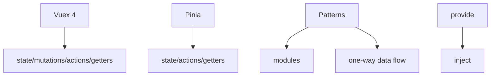

## 4.4. Vue 3 State Management

### Vuex 4

Vuex 4 — офіційний менеджер стану для Vue 3.

```js
// store.js
import { createStore } from "vuex";
export default createStore({
    state: { count: 0 },
    mutations: {
        increment(state) {
            state.count++;
        },
    },
    actions: {
        incrementAsync({ commit }) {
            setTimeout(() => commit("increment"), 1000);
        },
    },
    getters: {
        double(state) {
            return state.count * 2;
        },
    },
});
// main.js
import store from "./store";
app.use(store);
```

-   Стан, мутації, дії, геттери.
-   Глобальний доступ до даних.

---

### Pinia

Pinia — сучасний менеджер стану для Vue 3, офіційна заміна Vuex.

```js
// store.js
import { defineStore } from "pinia";
export const useCounterStore = defineStore("counter", {
    state: () => ({ count: 0 }),
    actions: {
        increment() {
            this.count++;
        },
    },
    getters: {
        double: (state) => state.count * 2,
    },
});
// main.js
import { createPinia } from "pinia";
app.use(createPinia());
```

-   Простий API, підтримка TypeScript.
-   Можна використовувати у Composition API.

---

### State Management Patterns

-   Глобальний стан: Vuex, Pinia.
-   Локальний стан: data, ref, reactive у компонентах.
-   Модульність: розділення store на модулі.
-   Однонаправлений потік даних.

```js
// Модульний store у Vuex
const moduleA = {
    state: () => ({ value: 1 }),
    mutations: {
        set(state, v) {
            state.value = v;
        },
    },
};
const store = createStore({ modules: { a: moduleA } });
```

-   Використовуйте геттери для обчислень, дії для асинхронності.

---

### Using provide/inject for State

`provide`/`inject` — альтернатива глобальному стану для невеликих додатків.

```js
// Parent.vue
import { provide, ref } from 'vue';
setup() {
  const theme = ref('dark');
  provide('theme', theme);
}
// Child.vue
import { inject } from 'vue';
setup() {
  const theme = inject('theme');
}
```

-   Зручно для sharing state між компонентами без store.

---

### Mermaid Diagram: Vue 3 State Management



_Менеджмент стану у Vue 3_

---

#### Navigation

-   [Попередня тема: Vue 3 Advanced](4.3-vue3-advanced.md)
-   [Наступна тема: Vue 3 Routing](4.5-vue3-routing.md)
