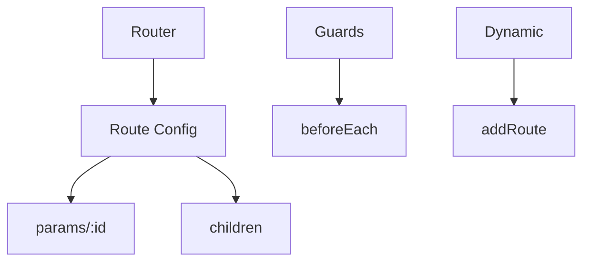

## 4.5. Vue 3 Routing

### Vue Router 4

Vue Router 4 — офіційний роутер для Vue 3.

```js
// router.js
import { createRouter, createWebHistory } from 'vue-router';
const routes = [
  { path: '/', component: Home },
  { path: '/about', component: About }
];
const router = createRouter({
  history: createWebHistory(),
  routes
});
// main.js
app.use(router);
```
- Підтримка історії, хеш-роутінгу, SSR.

---

### Route Configuration

Конфігурація маршрутів — опис шляхів, компонентів, вкладених маршрутів.

```js
const routes = [
  { path: '/', component: Home },
  { path: '/user/:id', component: User },
  {
    path: '/dashboard',
    component: Dashboard,
    children: [
      { path: 'stats', component: Stats },
      { path: 'settings', component: Settings }
    ]
  }
];
```
- Вкладені маршрути (`children`).
- Динамічні параметри (`:id`).

---

### Navigation Guards

Navigation guards (охоронці навігації) — контроль доступу до маршрутів.

```js
router.beforeEach((to, from, next) => {
  if (to.meta.requiresAuth && !isAuthenticated()) {
    next('/login');
  } else {
    next();
  }
});
```
- Можна використовувати глобально, у компонентах, для окремих маршрутів.

---

### Route Parameters

Route parameters (параметри маршруту) — динамічні частини URL.

```js
// /user/42
const route = useRoute();
console.log(route.params.id); // 42
```
- Доступ через `useRoute()` у Composition API.

---

### Nested Routes

Nested routes (вкладені маршрути) — маршрути всередині інших маршрутів.

```js
const routes = [
  {
    path: '/dashboard',
    component: Dashboard,
    children: [
      { path: 'stats', component: Stats },
      { path: 'settings', component: Settings }
    ]
  }
];
```
- Відображаються через `<router-view />` у дочірньому компоненті.

---

### Dynamic Routing

Dynamic routing (динамічний роутінг) — додавання/зміна маршрутів під час виконання.

```js
router.addRoute({ path: '/new', component: NewPage });
```
- Зручно для модульних додатків, lazy loading.

---

### Mermaid Diagram: Vue 3 Routing


_Роутінг у Vue 3_

---

#### Navigation

- [Попередня тема: Vue 3 State Management](4.4-vue3-state-management.md)
- [Наступна тема: Nuxt 3 Fundamentals](4.6-nuxt3-fundamentals.md)
