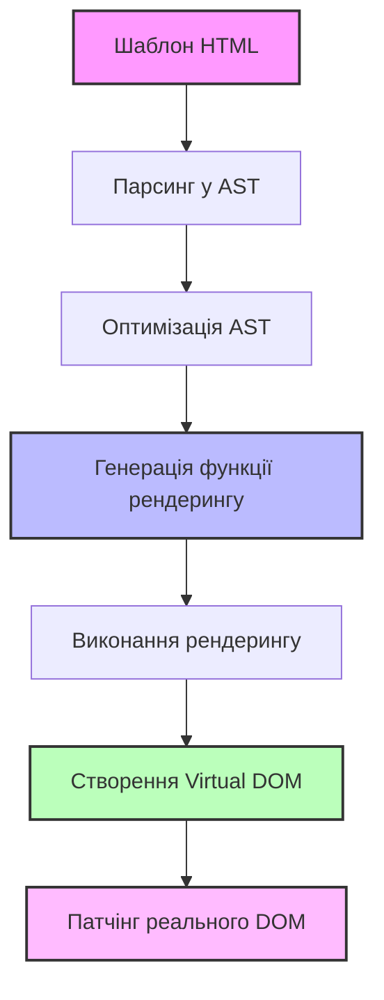
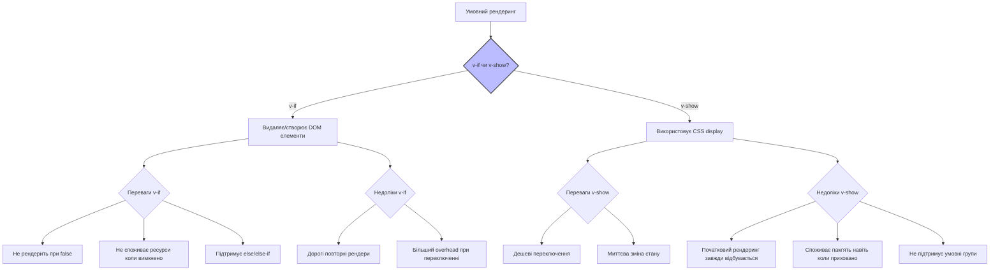
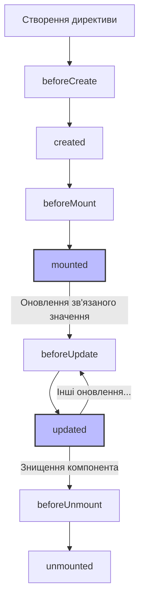

# Vue 3: Шаблони

## Коротке пояснення

**Шаблони** у Vue 3 — це частина системи декларативного рендерингу, яка дозволяє описувати структуру DOM на основі даних JavaScript. Vue використовує HTML-подібний синтаксис, який розширює стандартний HTML додатковими можливостями, такими як інтерполяція даних, директиви та вирази. Шаблон компілюється у функції рендерингу, які ефективно створюють та оновлюють DOM при зміні даних завдяки реактивній системі Vue.

---

## Синтаксис шаблонів

### Інтерполяція тексту

Найпростіший спосіб відображення реактивних даних у шаблоні — використання синтаксису "вусів" (mustache).

```html
<template>
    <!-- Базова текстова інтерполяція -->
    <p>Повідомлення: {{ message }}</p>

    <!-- Інтерполяція з виразом -->
    <p>Подвоєне число: {{ count * 2 }}</p>

    <!-- Виклик методів -->
    <p>Перевернутий текст: {{ reverseText(message) }}</p>

    <!-- Тернарний оператор -->
    <p>Статус: {{ isActive ? 'Активний' : 'Неактивний' }}</p>
</template>

<script>
    export default {
        data() {
            return {
                message: "Привіт, Vue!",
                count: 5,
                isActive: true,
            };
        },
        methods: {
            reverseText(text) {
                return text.split("").reverse().join("");
            },
        },
    };
</script>
```

### Сирий HTML

За замовчуванням інтерполяція виводить текст, а не HTML. Для відображення HTML-вмісту використовується директива `v-html`.

```html
<template>
    <!-- Виведення тексту з HTML-тегами як звичайний текст -->
    <p>{{ rawHtml }}</p>
    <!-- Виведе: <span style="color: red">Це має бути червоним</span> -->

    <!-- Виведення та рендеринг HTML -->
    <p v-html="rawHtml"></p>
    <!-- Виведе червоний текст -->
</template>

<script>
    export default {
        data() {
            return {
                rawHtml: '<span style="color: red">Це має бути червоним</span>',
            };
        },
    };
</script>
```

> **Важливо**: Використання `v-html` може призвести до XSS вразливостей. Ніколи не використовуйте його для відображення контенту, що надходить від користувачів або з ненадійних джерел.

### Атрибути

Для динамічного зв'язування атрибутів HTML використовується директива `v-bind`.

```html
<template>
    <!-- Динамічний id -->
    <div v-bind:id="dynamicId"></div>

    <!-- Скорочений синтаксис v-bind -->
    <div :id="dynamicId"></div>

    <!-- Булеві атрибути -->
    <button :disabled="isButtonDisabled">Кнопка</button>

    <!-- Динамічні класи (об'єкт) -->
    <div :class="{ active: isActive, 'text-danger': hasError }"></div>

    <!-- Динамічні класи (масив) -->
    <div :class="[activeClass, errorClass]"></div>

    <!-- Комбінація масиву та об'єкта -->
    <div :class="[baseClass, { active: isActive }]"></div>

    <!-- Динамічні стилі (об'єкт) -->
    <div :style="{ color: activeColor, fontSize: fontSize + 'px' }"></div>

    <!-- Динамічні стилі (масив) -->
    <div :style="[baseStyles, overrideStyles]"></div>
</template>

<script>
    export default {
        data() {
            return {
                dynamicId: "my-element",
                isButtonDisabled: false,
                isActive: true,
                hasError: false,
                activeClass: "active",
                errorClass: "text-danger",
                baseClass: "base",
                activeColor: "red",
                fontSize: 16,
                baseStyles: { color: "blue", fontWeight: "bold" },
                overrideStyles: { textDecoration: "underline" },
            };
        },
    };
</script>
```

### Умовний рендеринг

Vue пропонує декілька директив для умовного рендерингу елементів: `v-if`, `v-else-if`, `v-else` та `v-show`.

```html
<template>
    <!-- v-if/v-else-if/v-else -->
    <div v-if="type === 'A'">Тип A</div>
    <div v-else-if="type === 'B'">Тип B</div>
    <div v-else-if="type === 'C'">Тип C</div>
    <div v-else>Інший тип</div>

    <!-- v-show: альтернатива до v-if -->
    <div v-show="isVisible">
        Цей елемент буде в DOM, але зі стилем display: none, якщо isVisible ===
        false
    </div>

    <!-- Умовні групи з template -->
    <template v-if="showGroup">
        <h2>Заголовок</h2>
        <p>Параграф 1</p>
        <p>Параграф 2</p>
    </template>
</template>

<script>
    export default {
        data() {
            return {
                type: "B",
                isVisible: true,
                showGroup: true,
            };
        },
    };
</script>
```

### Списки та цикли

Директива `v-for` дозволяє відображати списки елементів, ітеруючи через масиви, об'єкти або діапазони чисел.

```html
<template>
    <!-- Цикл по масиву -->
    <ul>
        <li v-for="(item, index) in items" :key="item.id">
            {{ index }}. {{ item.name }}
        </li>
    </ul>

    <!-- Цикл по об'єкту -->
    <ul>
        <li v-for="(value, key, index) in object" :key="key">
            {{ index }}. {{ key }}: {{ value }}
        </li>
    </ul>

    <!-- Цикл по діапазону -->
    <ul>
        <li v-for="n in 5" :key="n">Item {{ n }}</li>
    </ul>

    <!-- v-for з template -->
    <template v-for="item in items" :key="item.id">
        <h3>{{ item.title }}</h3>
        <p>{{ item.description }}</p>
    </template>

    <!-- Вкладені цикли -->
    <ul>
        <li v-for="category in categories" :key="category.id">
            {{ category.name }}
            <ul>
                <li v-for="product in category.products" :key="product.id">
                    {{ product.name }} - ${{ product.price }}
                </li>
            </ul>
        </li>
    </ul>
</template>

<script>
    export default {
        data() {
            return {
                items: [
                    { id: 1, name: "Яблуко" },
                    { id: 2, name: "Банан" },
                    { id: 3, name: "Апельсин" },
                ],
                object: {
                    title: "Книга",
                    author: "Джон Сміт",
                    year: 2023,
                },
                categories: [
                    {
                        id: 1,
                        name: "Електроніка",
                        products: [
                            { id: 101, name: "Смартфон", price: 999 },
                            { id: 102, name: "Ноутбук", price: 1299 },
                        ],
                    },
                    {
                        id: 2,
                        name: "Одяг",
                        products: [
                            { id: 201, name: "Футболка", price: 29 },
                            { id: 202, name: "Джинси", price: 59 },
                        ],
                    },
                ],
            };
        },
    };
</script>
```

> **Важливо**: Завжди використовуйте атрибут `key` з `v-for` для покращення продуктивності та уникнення неочікуваної поведінки при зміні списку.

---

## Вирази у шаблонах

### Підтримувані JavaScript вирази

Vue підтримує повноцінні однорядкові JavaScript вирази в інтерполяціях та директивах.

```html
<template>
    <!-- Математичні операції -->
    <p>{{ count + 1 }}</p>

    <!-- Рядкові операції -->
    <p>{{ message.split('').reverse().join('') }}</p>

    <!-- Тернарні вирази -->
    <div :class="isActive ? 'active' : 'inactive'"></div>

    <!-- Логічні операції -->
    <p v-if="isActive && !isDisabled">Активний і не вимкнений</p>

    <!-- Методи з масивів -->
    <p>{{ items.filter(item => item.price > 100).length }} дорогих товарів</p>

    <!-- Доступ до глобальних об'єктів -->
    <p>Поточний час: {{ new Date().toLocaleTimeString() }}</p>

    <!-- Виклик методів -->
    <p>{{ formatPrice(product.price) }}</p>
</template>

<script>
    export default {
        data() {
            return {
                count: 10,
                message: "Привіт, Vue!",
                isActive: true,
                isDisabled: false,
                items: [
                    { name: "Товар 1", price: 50 },
                    { name: "Товар 2", price: 150 },
                    { name: "Товар 3", price: 250 },
                ],
                product: { name: "Смартфон", price: 999 },
            };
        },
        methods: {
            formatPrice(price) {
                return `$${price.toFixed(2)}`;
            },
        },
    };
</script>
```

### Обмеження виразів

Шаблони Vue мають певні обмеження:

1. **Тільки однорядкові вирази**: Не можна використовувати багаторядкові вирази або оператори `if`/`for`.
2. **Не можна писати присвоєння**: Вирази повинні бути "чистими", без побічних ефектів.
3. **Обмежений доступ до глобальних об'єктів**: З міркувань безпеки доступ до глобальних об'єктів обмежений.

```html
<!-- ❌ Неправильні вирази -->

<!-- Багаторядковий вираз -->
<div>{{ if (isActive) { return 'active' } else { return 'inactive' } }}</div>

<!-- Присвоєння -->
<div>{{ count = count + 1 }}</div>

<!-- ✅ Правильні альтернативи -->

<!-- Використання методів замість складних виразів -->
<div>{{ getStatus() }}</div>

<!-- Використання обчислюваних властивостей -->
<div>{{ status }}</div>

<!-- Використання тернарного оператора -->
<div>{{ isActive ? 'active' : 'inactive' }}</div>
```

```javascript
// Правильна реалізація в компоненті
export default {
    data() {
        return {
            isActive: true,
            count: 0,
        };
    },
    computed: {
        status() {
            if (this.isActive) {
                return "active";
            } else {
                return "inactive";
            }
        },
    },
    methods: {
        getStatus() {
            if (this.isActive) {
                return "active";
            } else {
                return "inactive";
            }
        },
        incrementCount() {
            this.count += 1;
        },
    },
};
```

---

## Директиви

Директиви у Vue — це спеціальні атрибути з префіксом `v-`, які застосовують реактивну поведінку до елементів DOM.

### v-if, v-else-if, v-else

Директиви умовного рендерингу, які додають або видаляють елементи з DOM на основі умови.

```html
<template>
    <div>
        <h2>Статус замовлення</h2>

        <div v-if="status === 'pending'">Замовлення очікує підтвердження</div>
        <div v-else-if="status === 'processing'">Замовлення обробляється</div>
        <div v-else-if="status === 'shipped'">Замовлення відправлено</div>
        <div v-else>Статус замовлення невідомий</div>

        <!-- Використання з формами -->
        <template v-if="loginType === 'username'">
            <label>Ім'я користувача</label>
            <input
                placeholder="Введіть ім'я користувача"
                key="username-input"
            />
        </template>
        <template v-else>
            <label>Email</label>
            <input placeholder="Введіть email" key="email-input" />
        </template>

        <button @click="toggleLoginType">Перемкнути тип входу</button>
    </div>
</template>

<script>
    export default {
        data() {
            return {
                status: "processing",
                loginType: "username",
            };
        },
        methods: {
            toggleLoginType() {
                this.loginType =
                    this.loginType === "username" ? "email" : "username";
            },
        },
    };
</script>
```

### v-show

Подібно до `v-if`, але не видаляє елемент з DOM, а лише перемикає його CSS властивість `display`.

```html
<template>
    <div>
        <h2>Панель користувача</h2>

        <!-- v-show використовує display: none для приховування -->
        <div v-show="isUserPanelVisible" class="user-panel">
            <h3>Вітаємо, {{ username }}!</h3>
            <button @click="logout">Вийти</button>
        </div>

        <button @click="toggleUserPanel">
            {{ isUserPanelVisible ? 'Сховати' : 'Показати' }} панель
        </button>
    </div>
</template>

<script>
    export default {
        data() {
            return {
                username: "John",
                isUserPanelVisible: true,
            };
        },
        methods: {
            toggleUserPanel() {
                this.isUserPanelVisible = !this.isUserPanelVisible;
            },
            logout() {
                // Логіка виходу
                alert("Вихід з системи");
            },
        },
    };
</script>
```

### v-for

Директива для рендерингу списків елементів на основі масиву або об'єкта.

```html
<template>
    <div>
        <h2>Список завдань</h2>

        <!-- Базове використання v-for -->
        <ul>
            <li v-for="(task, index) in tasks" :key="task.id">
                {{ index + 1 }}. {{ task.title }}
                <button @click="removeTask(task.id)">Видалити</button>
            </li>
        </ul>

        <!-- v-for з вкладеними компонентами -->
        <todo-item
            v-for="task in tasks"
            :key="task.id"
            :task="task"
            @delete="removeTask(task.id)"
        ></todo-item>

        <!-- v-for з об'єктом -->
        <div>
            <h3>Деталі користувача:</h3>
            <p v-for="(value, key) in user" :key="key">
                <strong>{{ key }}:</strong> {{ value }}
            </p>
        </div>

        <!-- v-for з фільтрацією -->
        <h3>Завершені завдання:</h3>
        <ul>
            <li v-for="task in completedTasks" :key="task.id">
                {{ task.title }}
            </li>
        </ul>
    </div>
</template>

<script>
    export default {
        data() {
            return {
                tasks: [
                    { id: 1, title: "Вивчити Vue.js", completed: true },
                    { id: 2, title: "Створити додаток", completed: false },
                    { id: 3, title: "Опублікувати проект", completed: false },
                ],
                user: {
                    name: "John Doe",
                    email: "john@example.com",
                    role: "Developer",
                    location: "New York",
                },
            };
        },
        computed: {
            completedTasks() {
                return this.tasks.filter((task) => task.completed);
            },
        },
        methods: {
            removeTask(id) {
                this.tasks = this.tasks.filter((task) => task.id !== id);
            },
        },
    };
</script>
```

### v-bind

Директива для динамічного зв'язування атрибутів HTML або властивостей компонентів.

```html
<template>
    <div>
        <!-- Базове зв'язування атрибутів -->
        

        <!-- Зв'язування класів (об'єкт) -->
        <div :class="{ 'active': isActive, 'disabled': isDisabled }"></div>

        <!-- Зв'язування класів (масив) -->
        <div :class="[baseClass, isActive ? activeClass : '']"></div>

        <!-- Зв'язування стилів (об'єкт) -->
        <div :style="{ color: textColor, fontSize: fontSize + 'px' }"></div>

        <!-- Зв'язування стилів (масив об'єктів) -->
        <div :style="[baseStyles, conditionalStyles]"></div>

        <!-- Зв'язування з булевими атрибутами -->
        <button :disabled="isSubmitting">Відправити</button>

        <!-- Динамічні імена атрибутів -->
        <div :[attributeName]="attributeValue"></div>

        <!-- Зв'язування всіх властивостей об'єкта -->
        <component-a v-bind="allProps"></component-a>
    </div>
</template>

<script>
    export default {
        data() {
            return {
                imageUrl: "https://example.com/image.jpg",
                imageAlt: "Приклад зображення",
                isActive: true,
                isDisabled: false,
                baseClass: "btn",
                activeClass: "btn-primary",
                textColor: "red",
                fontSize: 16,
                baseStyles: {
                    fontWeight: "bold",
                    padding: "10px",
                },
                conditionalStyles: {
                    backgroundColor: "lightgray",
                },
                isSubmitting: false,
                attributeName: "title",
                attributeValue: "Підказка при наведенні",
                allProps: {
                    propA: 1,
                    propB: "Hello",
                    propC: true,
                },
            };
        },
    };
</script>
```

### v-model

Директива для створення двостороннього зв'язування між формами вводу та станом програми.

```html
<template>
    <div>
        <h2>Форма реєстрації</h2>

        <!-- Базовий v-model з текстовим полем -->
        <div>
            <label for="username">Ім'я користувача:</label>
            <input id="username" v-model="username" type="text" />
        </div>

        <!-- v-model з текстовою областю -->
        <div>
            <label for="bio">Про себе:</label>
            <textarea id="bio" v-model="bio"></textarea>
        </div>

        <!-- v-model з чекбоксом (одиничним) -->
        <div>
            <input id="agree" v-model="agreeToTerms" type="checkbox" />
            <label for="agree">Я погоджуюсь з умовами</label>
        </div>

        <!-- v-model з чекбоксами (множинний вибір) -->
        <div>
            <label>Інтереси:</label>
            <div>
                <input
                    id="coding"
                    v-model="interests"
                    value="coding"
                    type="checkbox"
                />
                <label for="coding">Програмування</label>
            </div>
            <div>
                <input
                    id="music"
                    v-model="interests"
                    value="music"
                    type="checkbox"
                />
                <label for="music">Музика</label>
            </div>
            <div>
                <input
                    id="sports"
                    v-model="interests"
                    value="sports"
                    type="checkbox"
                />
                <label for="sports">Спорт</label>
            </div>
        </div>

        <!-- v-model з радіокнопками -->
        <div>
            <label>Стать:</label>
            <div>
                <input id="male" v-model="gender" value="male" type="radio" />
                <label for="male">Чоловіча</label>
            </div>
            <div>
                <input
                    id="female"
                    v-model="gender"
                    value="female"
                    type="radio"
                />
                <label for="female">Жіноча</label>
            </div>
            <div>
                <input id="other" v-model="gender" value="other" type="radio" />
                <label for="other">Інша</label>
            </div>
        </div>

        <!-- v-model з вибором (select) -->
        <div>
            <label for="country">Країна:</label>
            <select id="country" v-model="country">
                <option value="">Виберіть країну</option>
                <option value="us">США</option>
                <option value="uk">Великобританія</option>
                <option value="ua">Україна</option>
                <option value="de">Німеччина</option>
            </select>
        </div>

        <!-- v-model з множинним вибором -->
        <div>
            <label for="languages">Мови програмування (виберіть кілька):</label>
            <select id="languages" v-model="languages" multiple>
                <option value="js">JavaScript</option>
                <option value="python">Python</option>
                <option value="java">Java</option>
                <option value="csharp">C#</option>
                <option value="go">Go</option>
            </select>
        </div>

        <!-- Модифікатори v-model -->
        <div>
            <label for="trimmed"
                >Текст з автоматичним обрізанням пробілів:</label
            >
            <input id="trimmed" v-model.trim="trimmedText" type="text" />
        </div>

        <div>
            <label for="number">Вік (числове поле):</label>
            <input id="number" v-model.number="age" type="number" />
        </div>

        <div>
            <label for="lazy">Оновлюється при втраті фокусу:</label>
            <input id="lazy" v-model.lazy="lazyText" type="text" />
        </div>

        <!-- Відображення даних -->
        <div class="preview">
            <h3>Дані форми:</h3>
            <pre>{{ formData }}</pre>
        </div>
    </div>
</template>

<script>
    export default {
        data() {
            return {
                username: "",
                bio: "",
                agreeToTerms: false,
                interests: [],
                gender: "",
                country: "",
                languages: [],
                trimmedText: "",
                age: null,
                lazyText: "",
            };
        },
        computed: {
            formData() {
                return {
                    username: this.username,
                    bio: this.bio,
                    agreeToTerms: this.agreeToTerms,
                    interests: this.interests,
                    gender: this.gender,
                    country: this.country,
                    languages: this.languages,
                    trimmedText: this.trimmedText,
                    age: this.age,
                    lazyText: this.lazyText,
                };
            },
        },
    };
</script>
```

### v-on

Директива для прослуховування подій DOM та виконання JavaScript при їх активації.

```html
<template>
    <div>
        <h2>Обробка подій</h2>

        <!-- Базове використання v-on -->
        <button v-on:click="increment">Лічильник: {{ count }}</button>

        <!-- Скорочений синтаксис @ -->
        <button @click="decrement">Зменшити</button>

        <!-- Інлайн-обробник -->
        <button @click="count = 0">Скинути</button>

        <!-- Доступ до події -->
        <input @input="handleInput" placeholder="Введіть текст" />

        <!-- Модифікатори подій: .stop -->
        <div @click="outerClick">
            Зовнішній елемент
            <button @click.stop="innerClick">
                Не спрацьовує для зовнішнього
            </button>
        </div>

        <!-- Модифікатори подій: .prevent -->
        <form @submit.prevent="submitForm">
            <input type="text" />
            <button type="submit">Відправити</button>
        </form>

        <!-- Клавіатурні модифікатори -->
        <input @keyup.enter="processInput" placeholder="Натисніть Enter" />

        <!-- Системні модифікатори -->
        <div @click.ctrl="handleCtrlClick">Ctrl + Click</div>

        <!-- Модифікатор .once -->
        <button @click.once="showMessage">
            Показати повідомлення (тільки один раз)
        </button>

        <!-- Динамічні імена подій -->
        <button @[eventName]="handleEvent">Динамічна подія</button>

        <!-- Кілька обробників -->
        <button @click="handleClick1(), handleClick2()">
            Виконати два методи
        </button>
    </div>
</template>

<script>
    export default {
        data() {
            return {
                count: 0,
                message: "",
                eventName: "click",
            };
        },
        methods: {
            increment() {
                this.count++;
            },
            decrement() {
                this.count--;
            },
            handleInput(event) {
                this.message = event.target.value;
                console.log("Поточне значення:", this.message);
            },
            outerClick() {
                console.log("Клік на зовнішньому елементі");
            },
            innerClick() {
                console.log("Клік на внутрішньому елементі");
            },
            submitForm() {
                console.log("Форма відправлена");
            },
            processInput() {
                console.log("Enter натиснуто, обробка вводу:", this.message);
            },
            handleCtrlClick() {
                console.log("Ctrl + Click виконано");
            },
            showMessage() {
                alert("Це повідомлення з'явиться тільки один раз");
            },
            handleEvent() {
                console.log("Динамічна подія спрацювала");
            },
            handleClick1() {
                console.log("Перший обробник");
            },
            handleClick2() {
                console.log("Другий обробник");
            },
        },
    };
</script>
```

### v-slot

Директива для розподілу вмісту до іменованих слотів у дочірніх компонентах.

```html
<!-- ParentComponent.vue -->
<template>
    <div>
        <h2>Використання слотів</h2>

        <!-- Базовий слот -->
        <card>
            <p>Вміст за замовчуванням для картки</p>
        </card>

        <!-- Іменовані слоти -->
        <card-with-slots>
            <template v-slot:header>
                <h3>Заголовок картки</h3>
            </template>

            <template v-slot:default>
                <p>Основний вміст картки</p>
            </template>

            <template v-slot:footer>
                <button>Дія</button>
            </template>
        </card-with-slots>

        <!-- Скорочений синтаксис # -->
        <card-with-slots>
            <template #header>
                <h3>Заголовок з скороченим синтаксисом</h3>
            </template>

            <!-- Вміст за замовчуванням -->
            <p>Основний вміст картки</p>

            <template #footer>
                <button>Дія</button>
            </template>
        </card-with-slots>

        <!-- Слоти з прив'язкою даних (scoped slots) -->
        <user-list>
            <template #user="{ user, index }">
                <div :class="{ 'admin': user.role === 'admin' }">
                    {{ index + 1 }}. {{ user.name }} ({{ user.role }})
                    <button @click="sendMessage(user)">
                        Відправити повідомлення
                    </button>
                </div>
            </template>
        </user-list>

        <!-- Динамічні імена слотів -->
        <component-with-slots>
            <template #[dynamicSlotName]>
                <p>Динамічний вміст слоту</p>
            </template>
        </component-with-slots>
    </div>
</template>

<script>
    export default {
        data() {
            return {
                dynamicSlotName: "header",
            };
        },
        methods: {
            sendMessage(user) {
                console.log(`Відправлення повідомлення для ${user.name}`);
            },
        },
    };
</script>

<!-- Card.vue -->
<template>
    <div class="card">
        <slot>
            <!-- Вміст за замовчуванням, якщо слот не надано -->
            <p>Картка без вмісту</p>
        </slot>
    </div>
</template>

<!-- CardWithSlots.vue -->
<template>
    <div class="card">
        <div class="card-header">
            <slot name="header">
                <h3>Заголовок за замовчуванням</h3>
            </slot>
        </div>

        <div class="card-body">
            <slot></slot>
        </div>

        <div class="card-footer">
            <slot name="footer">
                <button>Дія за замовчуванням</button>
            </slot>
        </div>
    </div>
</template>

<!-- UserList.vue -->
<template>
    <div>
        <div v-for="(user, index) in users" :key="user.id">
            <slot name="user" :user="user" :index="index"></slot>
        </div>
    </div>
</template>

<script>
    export default {
        data() {
            return {
                users: [
                    { id: 1, name: "John", role: "user" },
                    { id: 2, name: "Jane", role: "admin" },
                    { id: 3, name: "Bob", role: "user" },
                ],
            };
        },
    };
</script>
```

### Користувацькі директиви

Vue дозволяє створювати власні директиви для низькорівневих маніпуляцій з DOM.

```html
<template>
    <div>
        <h2>Користувацькі директиви</h2>

        <!-- Фокус на елементі при монтуванні -->
        <input v-focus placeholder="Цей елемент отримає фокус" />

        <!-- Форматування введення -->
        <input
            v-format="'uppercase'"
            v-model="formattedText"
            placeholder="Введений текст буде у верхньому регістрі"
        />

        <!-- Зміна кольору фону залежно від значення -->
        <div v-highlight="score" class="score-box">Оцінка: {{ score }}</div>

        <button @click="score++">Збільшити оцінку</button>

        <!-- Відкладене оновлення вмісту -->
        <div v-debounce:input="updateSearchResults" class="search-box">
            <input type="text" placeholder="Пошук..." />
        </div>

        <!-- Перетягування елемента -->
        <div v-draggable class="draggable-box">Перетягніть мене</div>
    </div>
</template>

<script>
    export default {
        data() {
            return {
                formattedText: "",
                score: 75,
            };
        },
        methods: {
            updateSearchResults(value) {
                console.log("Пошук:", value);
                // Логіка пошуку
            },
        },
        directives: {
            // Автофокус на елементі
            focus: {
                mounted(el) {
                    el.focus();
                },
            },

            // Форматування введення
            format: {
                mounted(el, binding) {
                    const format = binding.value;

                    el.addEventListener("input", function () {
                        if (format === "uppercase") {
                            el.value = el.value.toUpperCase();
                            el.dispatchEvent(new Event("input"));
                        } else if (format === "lowercase") {
                            el.value = el.value.toLowerCase();
                            el.dispatchEvent(new Event("input"));
                        }
                    });
                },
            },

            // Підсвічування елемента залежно від значення
            highlight: {
                mounted(el, binding) {
                    const value = binding.value;
                    updateHighlight(el, value);
                },
                updated(el, binding) {
                    const value = binding.value;
                    updateHighlight(el, value);
                },
            },

            // Відкладене виконання (debounce)
            debounce: {
                mounted(el, binding) {
                    const event = binding.arg || "input";
                    let timeout;

                    el.addEventListener(event, function (e) {
                        clearTimeout(timeout);
                        timeout = setTimeout(() => {
                            binding.value(e.target.value);
                        }, 500);
                    });
                },
            },

            // Перетягування елемента
            draggable: {
                mounted(el) {
                    el.style.position = "relative";
                    el.style.cursor = "move";

                    el.addEventListener("mousedown", function (e) {
                        const startX = e.clientX;
                        const startY = e.clientY;
                        const startLeft = parseInt(el.style.left || "0");
                        const startTop = parseInt(el.style.top || "0");

                        function handleMouseMove(e) {
                            const dx = e.clientX - startX;
                            const dy = e.clientY - startY;
                            el.style.left = startLeft + dx + "px";
                            el.style.top = startTop + dy + "px";
                        }

                        function handleMouseUp() {
                            document.removeEventListener(
                                "mousemove",
                                handleMouseMove
                            );
                            document.removeEventListener(
                                "mouseup",
                                handleMouseUp
                            );
                        }

                        document.addEventListener("mousemove", handleMouseMove);
                        document.addEventListener("mouseup", handleMouseUp);
                    });
                },
            },
        },
    };

    // Допоміжна функція для директиви highlight
    function updateHighlight(el, value) {
        // Встановлюємо колір залежно від значення
        if (value < 40) {
            el.style.backgroundColor = "#ffcccc"; // Червоний (погано)
        } else if (value < 70) {
            el.style.backgroundColor = "#ffffcc"; // Жовтий (нормально)
        } else {
            el.style.backgroundColor = "#ccffcc"; // Зелений (добре)
        }
    }
</script>

<style>
    .score-box {
        padding: 10px;
        margin: 10px 0;
        border-radius: 4px;
        transition: background-color 0.3s;
    }

    .draggable-box {
        width: 150px;
        height: 150px;
        background-color: #e0e0e0;
        display: flex;
        align-items: center;
        justify-content: center;
        user-select: none;
        margin: 20px 0;
    }

    .search-box {
        margin: 10px 0;
    }

    .search-box input {
        width: 100%;
        padding: 8px;
    }
</style>
```

---

## Підкапотні механізми

### Компіляція шаблонів

Шаблони Vue проходять кілька етапів компіляції перед тим, як стати функціями рендерингу, які створюють Virtual DOM.

#### Етапи компіляції шаблонів

1. **Парсинг**: HTML-шаблон парситься в AST (Abstract Syntax Tree).
2. **Оптимізація**: AST оптимізується для кращої продуктивності.
3. **Генерація коду**: AST перетворюється на JavaScript-функцію рендерингу.
4. **Виконання**: Функція рендерингу виконується для створення Virtual DOM.

```javascript
// Спрощена демонстрація процесу компіляції шаблонів

// 1. Шаблон у вашому коді
const template = `
  <div>
    <h1>{{ title }}</h1>
    <p v-if="showDescription">{{ description }}</p>
    <button @click="increment">Кількість: {{ count }}</button>
  </div>
`;

// 2. Після парсингу і компіляції шаблону він перетворюється
// на функцію рендерингу приблизно такого вигляду:
function render() {
    return _createVNode("div", null, [
        _createVNode("h1", null, _toDisplayString(title), 1 /* TEXT */),
        showDescription
            ? _createVNode(
                  "p",
                  null,
                  _toDisplayString(description),
                  1 /* TEXT */
              )
            : _createCommentVNode("v-if", true),
        _createVNode(
            "button",
            {
                onClick: increment,
            },
            "Кількість: " + _toDisplayString(count),
            9 /* TEXT, PROPS */
        ),
    ]);
}

// 3. Функція рендерингу викликається для створення Virtual DOM
// під час монтування компонента та при зміні його реактивних даних
```

### Компіляція і Reactivity

Vue встановлює зв'язок між шаблоном і реактивними даними через автоматичне відстеження залежностей.

```javascript
// Спрощена демонстрація системи відстеження залежностей у Vue

// Під час рендерингу Vue відстежує, які реактивні властивості використовуються
const activeEffect = null;

function trackEffect() {
    if (activeEffect) {
        // Додати поточний ефект до залежностей властивості
    }
}

function triggerEffect() {
    // Запустити всі ефекти, які залежать від цієї властивості
}

// Коли ви використовуєте {{ count }} у шаблоні, Vue перетворює це на:
function renderCount() {
    trackEffect(); // Відстежуємо доступ до властивості
    return count.value;
}

// Коли змінюється count.value, Vue викликає:
function updateCount(newValue) {
    count.value = newValue;
    triggerEffect(); // Запускає перерендеринг всіх компонентів, що залежать від count
}
```

### Оптимізації директив

Vue реалізує різні оптимізації для директив для підвищення продуктивності.

#### v-if проти v-show

```javascript
// Як Vue обробляє v-if:
function renderWithIf(condition, trueBlock, falseBlock) {
    if (condition) {
        return trueBlock();
    } else if (falseBlock) {
        return falseBlock();
    }
    return null;
}

// Як Vue обробляє v-show:
function renderWithShow(condition, content) {
    return _createVNode(
        "div",
        {
            style: { display: condition ? "" : "none" },
        },
        [content]
    );
}

// v-if повністю знищує/створює елементи, що може бути дорого при частих змінах
// v-show лише змінює CSS, що дешевше при частих переключеннях, але споживає пам'ять
```

#### v-for і key

```javascript
// Без key або з нестабільними ключами
// Vue використовує стандартний алгоритм порівняння DOM, який неефективний
// при зміні порядку елементів

// З правильними ключами:
function renderList(items) {
    return items.map((item) => {
        // key дозволяє Vue відстежувати ідентичність елементів
        // навіть якщо вони переміщуються у списку
        return _createVNode("div", { key: item.id }, item.text);
    });
}

// Vue зможе переставити DOM-елементи замість створення нових
```

### Особливості та підводні камені

#### 1. Рендеринг списків і реактивність

```javascript
// Проблема: Vue не може виявити деякі зміни в масивах
const app = createApp({
    data() {
        return {
            items: ["A", "B", "C"],
        };
    },
    methods: {
        // ❌ Не викличе оновлення
        updateDirectly() {
            this.items[1] = "X"; // Безпосередня зміна за індексом
        },

        // ✅ Викличе оновлення
        updateCorrectly() {
            // Використання реактивного методу
            this.$set(this.items, 1, "X"); // Vue 2

            // або
            this.items.splice(1, 1, "X"); // Vue 2 і Vue 3

            // або в Vue 3
            this.items = [
                ...this.items.slice(0, 1),
                "X",
                ...this.items.slice(2),
            ];
        },
    },
});
```

#### 2. Умовний рендеринг та ідентичність елементів

```html
<!-- Проблема: елементи з однаковими тегами перевикористовуються -->
<template>
    <div>
        <div v-if="isLogin">
            <input placeholder="Ім'я користувача" />
        </div>
        <div v-else>
            <input placeholder="Email" />
        </div>
    </div>
</template>

<!-- Рішення: використання key для збереження окремих станів елементів -->
<template>
    <div>
        <div v-if="isLogin">
            <input placeholder="Ім'я користувача" key="username-input" />
        </div>
        <div v-else>
            <input placeholder="Email" key="email-input" />
        </div>
    </div>
</template>
```

#### 3. Обмеження динамічних компонентів

```html
<!-- Проблема: динамічні компоненти не зберігають стан при переключенні -->
<template>
    <component :is="currentTab"></component>
    <button @click="currentTab = 'TabA'">A</button>
    <button @click="currentTab = 'TabB'">B</button>
</template>

<!-- Рішення: використання <keep-alive> для збереження стану -->
<template>
    <keep-alive>
        <component :is="currentTab"></component>
    </keep-alive>
    <button @click="currentTab = 'TabA'">A</button>
    <button @click="currentTab = 'TabB'">B</button>
</template>
```

#### 4. Директиви та реактивність

```html
<!-- Проблема: директиви не реагують на глибокі зміни об'єктів -->
<template>
    <div v-some-directive="user"></div>
</template>

<script>
    export default {
        data() {
            return {
                user: {
                    name: "John",
                    preferences: {
                        theme: "dark",
                    },
                },
            };
        },
        methods: {
            // Це НЕ викличе оновлення директиви
            updateTheme() {
                this.user.preferences.theme = "light";
            },
        },
        directives: {
            someDirective: {
                // Ця директива не бачить глибокі зміни в user.preferences
                updated(el, binding) {
                    console.log("Директива оновлена", binding.value);
                },
            },
        },
    };
</script>

<!-- Рішення: передавати конкретні значення, а не весь об'єкт -->
<template>
    <div v-some-directive="user.preferences.theme"></div>
</template>
```

### Оптимізація шаблонів

#### 1. Мінімізація перерендерингів

```html
<!-- Проблема: зміна count викликає перерендеринг всього списку -->
<template>
    <div>
        <p>Counter: {{ count }}</p>
        <ul>
            <li v-for="item in expensiveComputedItems" :key="item.id">
                {{ item.name }}
            </li>
        </ul>
        <button @click="count++">Increment</button>
    </div>
</template>

<!-- Рішення: виділення списку в окремий компонент -->
<template>
    <div>
        <p>Counter: {{ count }}</p>
        <item-list :items="expensiveComputedItems" />
        <button @click="count++">Increment</button>
    </div>
</template>
```

#### 2. Використання v-once для статичного контенту

```html
<!-- Оптимізація для контенту, який ніколи не змінюється -->
<template>
    <div>
        <header v-once>
            <h1>{{ appTitle }}</h1>
            <p>{{ appDescription }}</p>
        </header>

        <main>
            <!-- Динамічний контент -->
        </main>
    </div>
</template>
```

#### 3. Віртуалізація списків

```html
<!-- Проблема: рендеринг великих списків -->
<template>
    <div>
        <ul>
            <li v-for="item in 10000items" :key="item.id">{{ item.name }}</li>
        </ul>
    </div>
</template>

<!-- Рішення: використання віртуалізації -->
<template>
    <div>
        <recycle-scroller
            class="scroller"
            :items="10000items"
            :item-size="50"
            key-field="id"
        >
            <template #item="{ item }">
                <div class="item">{{ item.name }}</div>
            </template>
        </recycle-scroller>
    </div>
</template>
```

#### 4. Оптимізація директив з великою кількістю елементів

```html
<!-- Проблема: багато однакових директив на багатьох елементах -->
<template>
    <div>
        <div v-tooltip="getTooltip(item)" v-for="item in items" :key="item.id">
            {{ item.name }}
        </div>
    </div>
</template>

<!-- Рішення: використання делегування подій -->
<template>
    <div @mouseover="handleMouseOver" @mouseout="handleMouseOut">
        <div
            :data-tooltip="item.tooltip"
            :data-id="item.id"
            v-for="item in items"
            :key="item.id"
        >
            {{ item.name }}
        </div>
    </div>
</template>

<script>
    export default {
        methods: {
            handleMouseOver(event) {
                const tooltip = event.target.dataset.tooltip;
                if (tooltip) {
                    // Показати підказку
                }
            },
            handleMouseOut() {
                // Приховати підказку
            },
        },
    };
</script>
```

---

## Схеми та діаграми

### Процес компіляції шаблонів Vue



### Порівняння директив v-if та v-show



### Цикл оновлення даних та рендерингу

```
+------------------------------------------+
|                                          |
|                Шаблон                    |
|                                          |
|  <div>                                   |
|    <p>{{ message }}</p>                  |
|    <button @click="updateMessage">       |
|      Оновити                             |
|    </button>                             |
|  </div>                                  |
|                                          |
+------------------------------------------+
              |
              | Компіляція
              v
+------------------------------------------+
|                                          |
|          Функція рендерингу              |
|                                          |
|  return h('div', [                       |
|    h('p', ctx.message),                  |
|    h('button', { onClick: ctx.update }, |
|      'Оновити')                          |
|  ])                                      |
|                                          |
+------------------------------------------+
              |
              | Виконання
              v
+------------------------------------------+
|                                          |
|            Virtual DOM                   |
|                                          |
|           div                            |
|          /   \                           |
|         p    button                      |
|        /       \                         |
|   "Hello"    "Оновити"                   |
|                                          |
+------------------------------------------+
              |
              | Рендеринг
              v
+------------------------------------------+
|                                          |
|             Реальний DOM                 |
|                                          |
|  <div>                                   |
|    <p>Hello</p>                          |
|    <button>Оновити</button>              |
|  </div>                                  |
|                                          |
+------------------------------------------+
              ^
              |
              | Зміна даних
+------------------------------------------+
|                                          |
|           Реактивні дані                 |
|                                          |
|  data() {                                |
|    return {                              |
|      message: 'Hello'                    |
|    }                                     |
|  }                                       |
|                                          |
+------------------------------------------+
```

### Життєвий цикл директив



### Порівняння патернів шаблонів

```
+------------------------------------------------------+
|              Інтерполяція vs Директиви               |
|                                                      |
| {{ expression }}                                     |
| - Для текстового вмісту                              |
| - Автоматичне екранування HTML                       |
| - Однонаправлена прив'язка даних                     |
| - Підтримує прості вирази JavaScript                 |
|                                                      |
| v-директива:[аргумент].[модифікатор]="вираз"         |
| - Для атрибутів, подій, DOM маніпуляцій              |
| - Різні типи директив для різних цілей               |
| - Підтримка модифікаторів для додаткових опцій       |
| - Може забезпечувати двосторонню прив'язку (v-model) |
+------------------------------------------------------+

+------------------------------------------------------+
|              v-if vs v-for Пріоритет                 |
|                                                      |
| v-if/v-for на одному елементі (Vue 2)                |
| - v-for має вищий пріоритет                          |
| - v-if виконується для кожної ітерації               |
|                                                      |
| v-if/v-for на одному елементі (Vue 3)                |
| - v-if має вищий пріоритет                           |
| - v-if виконується перед v-for                       |
|                                                      |
| Рекомендований підхід (обидві версії):               |
| - Використовувати <template> для розділення логіки    |
| - Використовувати обчислювані властивості для        |
|   фільтрації списків перед циклом                    |
+------------------------------------------------------+
```

> **Важливо**: Шаблони у Vue 3 — це потужний і гнучкий механізм для декларативного рендерингу інтерфейсу. Розуміння синтаксису шаблонів, виразів та директив дозволяє ефективно створювати динамічні, реактивні та продуктивні компоненти. При використанні шаблонів важливо враховувати особливості їх компіляції та виконання для оптимізації продуктивності та уникнення поширених проблем.
