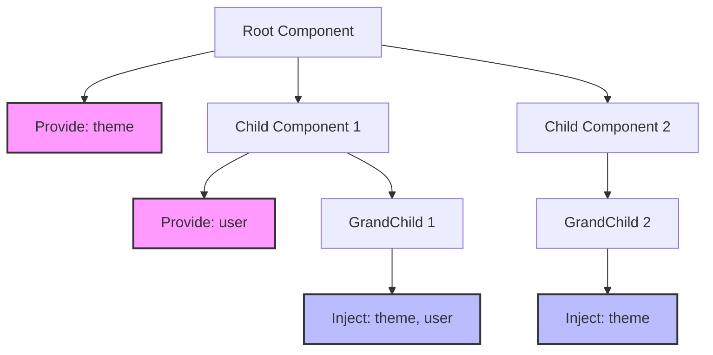

# Vue 3: Composition API

## Коротке пояснення

**Composition API** — це набір функцій, представлений у Vue 3, який забезпечує більш гнучкий спосіб організації логіки компонентів. На відміну від Options API, де код організований за типом опцій (data, methods, computed і т.д.), Composition API дозволяє групувати код за логічною функціональністю. Це спрощує повторне використання логіки, покращує типізацію TypeScript та робить великі компоненти більш підтримуваними. Composition API використовується всередині функції `setup()`, яка викликається на початку життєвого циклу компонента.

---

## setup

Функція `setup` — це центральний елемент Composition API, який замінює більшість опцій, що використовуються в Options API.

### Основи setup

```html
<template>
    <div>
        <p>Лічильник: {{ count }}</p>
        <button @click="increment">Збільшити</button>
    </div>
</template>

<script>
    import { ref } from "vue";

    export default {
        setup() {
            // Створення реактивної змінної
            const count = ref(0);

            // Метод для зміни стану
            function increment() {
                count.value++;
            }

            // Повернення значень, які будуть доступні в шаблоні
            return {
                count,
                increment,
            };
        },
    };
</script>
```

### setup з props та context

```html
<template>
    <div>
        <p>Привіт, {{ props.name }}!</p>
        <button @click="emitGreeting">Привітатися</button>
    </div>
</template>

<script>
    import { toRefs } from "vue";

    export default {
        props: {
            name: String,
        },
        setup(props, context) {
            // toRefs робить властивості props реактивними
            const { name } = toRefs(props);

            // Використання context для доступу до emit, attrs, slots
            function emitGreeting() {
                context.emit("greeting", `Привіт, ${name.value}!`);
            }

            return {
                props, // повертаємо весь об'єкт props для доступу в шаблоні
                emitGreeting,
            };
        },
    };
</script>
```

### Використання script setup

Vue 3.2+ представив спрощений синтаксис `<script setup>`, який робить використання Composition API ще простішим:

```html
<template>
    <div>
        <p>Лічильник: {{ count }}</p>
        <button @click="increment">Збільшити</button>
        <p>Ім'я: {{ props.name }}</p>
        <button @click="emitGreeting">Привітатися</button>
    </div>
</template>

<script setup>
    import { ref, toRefs } from "vue";

    // Props автоматично імпортуються у скоп скрипта
    const props = defineProps({
        name: String,
    });

    // Емітери подій декларуються через defineEmits
    const emit = defineEmits(["greeting"]);

    // Реактивний стан
    const count = ref(0);

    // Функції
    function increment() {
        count.value++;
    }

    function emitGreeting() {
        emit("greeting", `Привіт, ${props.name}!`);
    }

    // Не потрібен явний return, все що оголошено в скопі доступне у шаблоні
</script>
```

### Типізація Props і Emit з TypeScript

```html
<script setup lang="ts">
    import { ref } from "vue";

    // Типізовані props
    const props = defineProps<{
        name: string;
        age?: number;
        isActive: boolean;
    }>();

    // Типізовані емітери
    const emit = defineEmits<{
        (e: "greeting", message: string): void;
        (e: "update", id: number, value: any): void;
    }>();

    // Значення за замовчуванням для типізованих props
    // (Доступно з Vue 3.3+)
    withDefaults(
        defineProps<{
            name: string;
            age?: number;
            messages?: string[];
        }>(),
        {
            age: 30,
            messages: () => ["Привіт"],
        }
    );

    // Функція з типізацією
    function processUser(id: number): void {
        // логіка обробки
    }
</script>
```

### Відкриття компонентних властивостей

```html
<script setup>
    import { ref } from "vue";

    // Внутрішній стан
    const count = ref(0);

    // Методи, які ми хочемо зробити доступними для батьківського компонента
    function reset() {
        count.value = 0;
    }

    // Експорт методів для зовнішнього доступу
    defineExpose({
        reset,
    });
</script>
```

## lifecycle hooks

Хуки життєвого циклу в Composition API імпортуються з Vue та використовуються безпосередньо всередині `setup`.

### Основні хуки життєвого циклу

```html
<template>
    <div>
        <p>Компонент з хуками життєвого циклу</p>
        <p v-if="data">Дані: {{ data }}</p>
    </div>
</template>

<script setup>
    import {
        ref,
        onMounted,
        onBeforeMount,
        onBeforeUpdate,
        onUpdated,
        onBeforeUnmount,
        onUnmounted,
        onErrorCaptured,
    } from "vue";

    const data = ref(null);

    // Виконується перед монтуванням DOM
    onBeforeMount(() => {
        console.log("Компонент скоро буде змонтовано");
    });

    // Виконується після монтування DOM
    onMounted(() => {
        console.log("Компонент змонтовано");
        // Ідеальне місце для запитів до API
        fetchData();
    });

    // Перед оновленням DOM через зміни реактивних даних
    onBeforeUpdate(() => {
        console.log("Компонент скоро оновиться");
    });

    // Після оновлення DOM
    onUpdated(() => {
        console.log("Компонент оновлено");
    });

    // Перед демонтуванням компонента
    onBeforeUnmount(() => {
        console.log("Компонент скоро буде демонтовано");
        // Ідеальне місце для очищення (видалення обробників подій, таймерів)
        cleanupResources();
    });

    // Після демонтування
    onUnmounted(() => {
        console.log("Компонент демонтовано");
    });

    // Перехоплення помилок з дочірніх компонентів
    onErrorCaptured((err, instance, info) => {
        console.error(`Помилка перехоплена: ${err}`);
        console.log(`Компонент: `, instance);
        console.log(`Інформація: ${info}`);

        // Повернення false, щоб запобігти поширенню помилки вище
        return false;
    });

    // Приклад функції для отримання даних
    async function fetchData() {
        try {
            const response = await fetch("https://api.example.com/data");
            data.value = await response.json();
        } catch (error) {
            console.error("Помилка при отриманні даних", error);
        }
    }

    // Очищення ресурсів
    function cleanupResources() {
        // Наприклад, видалення обробників подій window
        window.removeEventListener("resize", handleResize);
    }

    // Додавання обробника подій при монтуванні
    const handleResize = () => {
        console.log("Розмір вікна змінився");
    };

    onMounted(() => {
        window.addEventListener("resize", handleResize);
    });
</script>
```

### Додаткові хуки в Composition API

```html
<script setup>
    import { ref, onActivated, onDeactivated, onServerPrefetch } from "vue";

    const data = ref(null);

    // Виконується, коли компонент активується всередині <keep-alive>
    onActivated(() => {
        console.log("Компонент активовано");
        // Оновлення даних, коли компонент знову стає видимим
        refreshData();
    });

    // Виконується, коли компонент деактивується всередині <keep-alive>
    onDeactivated(() => {
        console.log("Компонент деактивовано");
        // Призупинення дій, які не потрібні, коли компонент прихований
        pauseOperations();
    });

    // Тільки для SSR - дозволяє чекати на асинхронні операції
    onServerPrefetch(async () => {
        try {
            // Виконується тільки на сервері перед рендерингом
            await fetchDataForSSR();
        } catch (error) {
            console.error("Помилка при отриманні даних для SSR", error);
        }
    });

    // Функції для використання в хуках
    async function fetchDataForSSR() {
        const response = await fetch("https://api.example.com/data");
        data.value = await response.json();
    }

    function refreshData() {
        console.log("Оновлення даних після активації");
    }

    function pauseOperations() {
        console.log("Призупинення операцій при деактивації");
    }
</script>
```

### Порівняння хуків життєвого циклу: Options API vs Composition API

| Options API    | Composition API  | Опис                                             |
| -------------- | ---------------- | ------------------------------------------------ |
| beforeCreate   | setup()          | Перед ініціалізацією компонента                  |
| created        | setup()          | Після ініціалізації реактивності                 |
| beforeMount    | onBeforeMount    | Перед монтуванням DOM                            |
| mounted        | onMounted        | Після монтування DOM                             |
| beforeUpdate   | onBeforeUpdate   | Перед оновленням DOM                             |
| updated        | onUpdated        | Після оновлення DOM                              |
| beforeUnmount  | onBeforeUnmount  | Перед демонтуванням компонента                   |
| unmounted      | onUnmounted      | Після демонтування                               |
| errorCaptured  | onErrorCaptured  | Для перехоплення помилок дочірніх компонентів    |
| activated      | onActivated      | Коли компонент всередині keep-alive активовано   |
| deactivated    | onDeactivated    | Коли компонент всередині keep-alive деактивовано |
| serverPrefetch | onServerPrefetch | Для асинхронних операцій при SSR                 |

## provide/inject

Механізм `provide/inject` дозволяє батьківському компоненту надавати дані, які можуть бути "впорскнуті" в будь-який дочірній компонент у дереві компонентів, незалежно від глибини вкладеності.

### Базове використання provide/inject

```html
<!-- ParentComponent.vue -->
<template>
    <div>
        <h2>Батьківський компонент</h2>
        <p>Тема: {{ theme }}</p>
        <button @click="toggleTheme">Змінити тему</button>

        <child-component />
    </div>
</template>

<script setup>
    import { ref, provide } from "vue";
    import ChildComponent from "./ChildComponent.vue";

    // Створення реактивного стану
    const theme = ref("light");

    // Надання значення для дочірніх компонентів
    provide("theme", theme);

    // Функція для зміни теми
    function toggleTheme() {
        theme.value = theme.value === "light" ? "dark" : "light";
    }
</script>
```

```html
<!-- ChildComponent.vue -->
<template>
    <div :class="theme">
        <h3>Дочірній компонент</h3>
        <p>Поточна тема: {{ theme }}</p>

        <grand-child-component />
    </div>
</template>

<script setup>
    import { inject } from "vue";
    import GrandChildComponent from "./GrandChildComponent.vue";

    // Отримання значення, наданого батьківським компонентом
    const theme = inject("theme");
</script>
```

```html
<!-- GrandChildComponent.vue -->
<template>
    <div :class="theme">
        <h4>Компонент-внук</h4>
        <p>Поточна тема: {{ theme }}</p>
    </div>
</template>

<script setup>
    import { inject } from "vue";

    // Отримання значення, наданого батьківським компонентом
    const theme = inject("theme");
</script>
```

### Надання методів та значення за замовчуванням

```html
<!-- ParentComponent.vue -->
<template>
    <div>
        <h2>Батьківський компонент з методами</h2>
        <p>Лічильник: {{ counter }}</p>
        <button @click="increment">+1</button>

        <child-component />
    </div>
</template>

<script setup>
    import { ref, provide } from "vue";
    import ChildComponent from "./ChildComponent.vue";

    const counter = ref(0);

    // Надання як стану, так і методів
    provide("counter", counter);
    provide("increment", () => {
        counter.value += 1;
    });
    provide("reset", () => {
        counter.value = 0;
    });
</script>
```

```html
<!-- ChildComponent.vue -->
<template>
    <div>
        <h3>Дочірній компонент</h3>
        <p>Лічильник з батьківського компонента: {{ counter }}</p>
        <button @click="increment">Збільшити з дочірнього</button>
        <button @click="reset">Скинути</button>
    </div>
</template>

<script setup>
    import { inject } from "vue";

    // Отримання стану та методів
    const counter = inject("counter");
    const increment = inject("increment");
    const reset = inject("reset");

    // Інжект зі значенням за замовчуванням
    const message = inject("nonExistentKey", "Значення за замовчуванням");
</script>
```

### Використання символів для уникнення конфліктів імен

```html
<!-- constants.js -->
<script>
    export const themeSymbol = Symbol("theme");
    export const userSymbol = Symbol("user");
</script>

<!-- ParentComponent.vue -->
<template>
    <div>
        <h2>Використання символів для provide/inject</h2>
        <child-component />
    </div>
</template>

<script setup>
    import { ref, provide } from "vue";
    import { themeSymbol, userSymbol } from "./constants";
    import ChildComponent from "./ChildComponent.vue";

    const theme = ref("dark");
    const user = ref({ name: "John", role: "admin" });

    // Використання символів як ключів
    provide(themeSymbol, theme);
    provide(userSymbol, user);
</script>
```

```html
<!-- ChildComponent.vue -->
<template>
    <div>
        <h3>Дочірній компонент із символами</h3>
        <p>Тема: {{ theme }}</p>
        <p>Користувач: {{ user.name }} ({{ user.role }})</p>
    </div>
</template>

<script setup>
    import { inject } from "vue";
    import { themeSymbol, userSymbol } from "./constants";

    // Інжект використовуючи символи
    const theme = inject(themeSymbol);
    const user = inject(userSymbol);
</script>
```

### Створення типізованого API з provide/inject

```html
<!-- useTheme.ts -->
<script setup lang="ts">
    import { ref, provide, inject, Ref } from "vue";

    // Створення типу для API теми
    interface ThemeAPI {
        theme: Ref<string>;
        toggleTheme: () => void;
    }

    // Символ як ключ
    const ThemeSymbol = Symbol("theme");

    // Композіційна функція для провайдера
    export function provideTheme() {
        const theme = ref<string>("light");

        const toggleTheme = () => {
            theme.value = theme.value === "light" ? "dark" : "light";
        };

        // Надаємо весь API як єдиний об'єкт
        provide(ThemeSymbol, {
            theme,
            toggleTheme,
        } as ThemeAPI);

        return {
            theme,
            toggleTheme,
        };
    }

    // Композіційна функція для інжекту
    export function useTheme(): ThemeAPI {
        const themeAPI = inject<ThemeAPI>(ThemeSymbol);

        if (!themeAPI) {
            throw new Error("useTheme() must be used after provideTheme()");
        }

        return themeAPI;
    }
</script>
```

```html
<!-- ThemeProvider.vue -->
<template>
    <div :class="theme">
        <slot></slot>
    </div>
</template>

<script setup lang="ts">
    import { provideTheme } from "./useTheme";

    const { theme } = provideTheme();
</script>
```

```html
<!-- ThemedComponent.vue -->
<template>
    <div>
        <h3>Компонент з темою</h3>
        <p>Поточна тема: {{ theme }}</p>
        <button @click="toggleTheme">Змінити тему</button>
    </div>
</template>

<script setup lang="ts">
    import { useTheme } from "./useTheme";

    const { theme, toggleTheme } = useTheme();
</script>
```

```html
<!-- App.vue -->
<template>
    <theme-provider>
        <h1>Моя програма</h1>
        <themed-component />
    </theme-provider>
</template>

<script setup>
    import ThemeProvider from "./ThemeProvider.vue";
    import ThemedComponent from "./ThemedComponent.vue";
</script>
```

---

## Підкапотні механізми

### Реактивність у setup

Composition API ґрунтується на системі реактивності Vue 3, яка побудована на проксі JavaScript (ES6 Proxy).

```javascript
// Спрощена модель реактивної системи Vue 3

// Внутрішня реалізація ref
function createRef(initialValue) {
    // Внутрішній об'єкт для зберігання значення
    const refObject = {
        _value: initialValue,
        get value() {
            // При читанні value відстежуємо залежність
            track(refObject, "value");
            return this._value;
        },
        set value(newValue) {
            this._value = newValue;
            // При зміні value запускаємо ефекти оновлення
            trigger(refObject, "value");
        },
    };

    return refObject;
}

// Внутрішня реалізація reactive
function createReactive(target) {
    return new Proxy(target, {
        get(target, key, receiver) {
            const result = Reflect.get(target, key, receiver);
            // При читанні властивості відстежуємо залежність
            track(target, key);

            // Якщо результат - об'єкт, роби його реактивним рекурсивно
            return typeof result === "object" ? createReactive(result) : result;
        },
        set(target, key, value, receiver) {
            const oldValue = target[key];
            const result = Reflect.set(target, key, value, receiver);

            if (oldValue !== value) {
                // При зміні властивості запускаємо ефекти оновлення
                trigger(target, key);
            }

            return result;
        },
    });
}

// Відстеження залежностей
function track(target, key) {
    if (activeEffect) {
        // Додаємо поточний ефект до списку залежностей для цієї властивості
        let depsMap = targetMap.get(target);
        if (!depsMap) {
            targetMap.set(target, (depsMap = new Map()));
        }

        let dep = depsMap.get(key);
        if (!dep) {
            depsMap.set(key, (dep = new Set()));
        }

        dep.add(activeEffect);
    }
}

// Запуск ефектів при зміні
function trigger(target, key) {
    const depsMap = targetMap.get(target);
    if (!depsMap) return;

    const dep = depsMap.get(key);
    if (dep) {
        // Виконуємо всі ефекти, що залежать від цієї властивості
        dep.forEach((effect) => effect());
    }
}
```

### Виконання setup у життєвому циклі

Функція `setup` виконується один раз на початку життєвого циклу компонента, перед будь-якими хуками `beforeCreate` та `created` в Options API.

```javascript
// Спрощений алгоритм виконання setup у життєвому циклі

function mountComponent(initialProps, slots, parentComponent) {
    // Створення екземпляра компонента
    const instance = {
        props: initialProps,
        slots,
        emit: (event, ...args) => {
            // Логіка емітування подій
        },
        parent: parentComponent,
        // Інші властивості...
    };

    // Виконання setup перед будь-якими іншими хуками
    if (Component.setup) {
        const setupContext = {
            attrs: instance.attrs,
            slots: instance.slots,
            emit: instance.emit,
            expose: (exposed) => {
                instance.exposed = exposed;
            },
        };

        // Виклик setup з props та context
        const setupResult = Component.setup(instance.props, setupContext);

        // Обробка результату setup
        if (typeof setupResult === "function") {
            // Використання функції як рендер-функції
            instance.render = setupResult;
        } else if (typeof setupResult === "object") {
            // Використання об'єкту як стану компонента
            instance.setupState = setupResult;
        }
    }

    // Далі виконується решта життєвого циклу (beforeCreate, created, і т.д.)
    // ...
}
```

### Особливості provide/inject

Механізм `provide/inject` реалізований як системи ієрархічних ін'єкцій, що зберігаються на рівні екземплярів компонентів.

```javascript
// Спрощений алгоритм роботи provide/inject

// Внутрішні колекції для зберігання наданих значень
const provideValues = new WeakMap(); // зберігає значення, надані компонентами

// Функція provide
function innerProvide(key, value) {
    const currentInstance = getCurrentInstance();

    if (currentInstance) {
        // Отримуємо або створюємо мапу наданих значень для поточного компонента
        let provides = provideValues.get(currentInstance);

        if (!provides) {
            // Створюємо новий об'єкт provides, який прототипно наслідується
            // від батьківського provides (якщо є)
            const parentProvides = currentInstance.parent
                ? provideValues.get(currentInstance.parent)
                : null;

            provides = Object.create(parentProvides || null);
            provideValues.set(currentInstance, provides);
        }

        // Додаємо значення до provides поточного компонента
        provides[key] = value;
    }
}

// Функція inject
function innerInject(key, defaultValue) {
    const currentInstance = getCurrentInstance();

    if (currentInstance) {
        // Шукаємо provides у ієрархії компонентів
        const provides = currentInstance.parent
            ? provideValues.get(currentInstance.parent)
            : null;

        if (provides && key in provides) {
            // Знайдено надане значення
            return provides[key];
        } else if (arguments.length > 1) {
            // Повертаємо значення за замовчуванням, якщо воно надано
            return defaultValue;
        } else {
            console.warn(`Injection "${String(key)}" not found.`);
        }
    }
}
```

## Особливості та підводні камені

### 1. Реактивність та деструктуризація

```html
<script setup>
    import { reactive, toRefs, toRef } from "vue";

    // Проблема: втрата реактивності при деструктуризації
    const state = reactive({ count: 0, name: "Vue" });

    // ❌ Деструктуризація втрачає реактивний зв'язок
    const { count, name } = state;

    function increment() {
        // Це НЕ оновить UI, оскільки count втратив реактивність
        count++;
    }

    // ✅ Рішення 1: Використання toRefs
    const { count: countRef, name: nameRef } = toRefs(state);

    function incrementCorrect() {
        // Це працює, тому що countRef - це реактивне посилання
        countRef.value++;
    }

    // ✅ Рішення 2: Збереження посилання на повний об'єкт
    function incrementAlso() {
        // Це також працює, оскільки ми змінюємо оригінальний реактивний об'єкт
        state.count++;
    }

    // ✅ Рішення 3: Використання toRef для окремих властивостей
    const countToRef = toRef(state, "count");

    function incrementWithToRef() {
        // Це працює, оскільки countToRef - це реактивне посилання
        countToRef.value++;
    }
</script>
```

### 2. Цикл життя в setup і звичайному компоненті

```html
<script>
    import { onMounted, ref } from "vue";

    export default {
        setup() {
            const value = ref("з setup");

            // Цей хук виконається першим
            onMounted(() => {
                console.log(`onMounted ${value.value}`);
            });

            return { value };
        },

        // Цей хук виконається другим, після хуків у setup
        mounted() {
            console.log(`mounted option: ${this.value}`);
        },
    };
</script>
```

### 3. Використання this у setup

```html
<script>
    export default {
        data() {
            return {
                message: "Привіт",
            };
        },

        setup() {
            // ❌ `this` НЕ посилається на екземпляр компонента в setup
            console.log(this); // undefined

            // Потрібно використовувати інші способи доступу до даних
            function doSomething() {
                // Це НЕ працює:
                // console.log(this.message);
            }

            return { doSomething };
        },
    };
</script>
```

### 4. Порядок виконання хуків життєвого циклу

```html
<script>
    import { onMounted, onBeforeMount } from "vue";

    export default {
        beforeCreate() {
            console.log("1. beforeCreate (Options API)");
        },

        setup() {
            console.log("0. setup виконується перед усіма іншими хуками");

            onBeforeMount(() => {
                console.log("2. onBeforeMount (Composition API)");
            });

            onMounted(() => {
                console.log("4. onMounted (Composition API)");
            });

            return {};
        },

        created() {
            console.log("3. created (Options API)");
        },

        mounted() {
            console.log("5. mounted (Options API)");
        },
    };
</script>
```

### 5. Provide/Inject з немутованими значеннями

```html
<!-- ParentComponent.vue -->
<script setup>
    import { provide, readonly, ref } from "vue";

    const count = ref(0);

    // ❌ Проблема: дочірні компоненти можуть змінювати значення напряму
    provide("mutableCount", count);

    // ✅ Рішення: надання readonly версії для запобігання прямих мутацій
    provide("count", readonly(count));

    // Надання методу для контрольованого оновлення
    provide("incrementCount", () => {
        count.value++;
    });
</script>

<!-- ChildComponent.vue -->
<script setup>
    import { inject } from "vue";

    const mutableCount = inject("mutableCount");
    const count = inject("count");
    const incrementCount = inject("incrementCount");

    // ❌ Це працює, але може призвести до непередбачуваної поведінки
    function unsafeUpdate() {
        mutableCount.value++; // Прямий доступ з дочірнього компонента
    }

    // ✅ Безпечне оновлення через надану функцію
    function safeUpdate() {
        incrementCount();
    }

    // ❌ Це викличе помилку, оскільки count є readonly
    function readonlyUpdate() {
        count.value++; // TypeError: Cannot set property
    }
</script>
```

## Оптимізація

### 1. Повторне використання логіки з композиційними функціями

```html
<!-- useCounter.js -->
<script>
    import { ref, computed } from "vue";

    export function useCounter(initialValue = 0, step = 1) {
        const count = ref(initialValue);

        function increment() {
            count.value += step;
        }

        function decrement() {
            count.value -= step;
        }

        function reset() {
            count.value = initialValue;
        }

        const isPositive = computed(() => count.value > 0);
        const isNegative = computed(() => count.value < 0);

        return {
            count,
            increment,
            decrement,
            reset,
            isPositive,
            isNegative,
        };
    }
</script>

<!-- Component1.vue -->
<template>
    <div>
        <p>Лічильник: {{ count }}</p>
        <button @click="increment">+{{ step }}</button>
        <button @click="decrement">-{{ step }}</button>
        <button @click="reset">Скинути</button>
        <p v-if="isPositive">Значення додатне</p>
        <p v-if="isNegative">Значення від'ємне</p>
    </div>
</template>

<script setup>
    import { useCounter } from "./useCounter";

    // Повторне використання логіки лічильника
    const { count, increment, decrement, reset, isPositive, isNegative } =
        useCounter(10, 5);

    // Додатковий параметр для шаблону
    const step = 5;
</script>
```

### 2. Поділ складної логіки на композиційні функції

```html
<!-- useUser.js -->
<script>
    import { ref, computed } from "vue";

    export function useUser() {
        const user = ref(null);
        const loading = ref(false);
        const error = ref(null);

        const isLoggedIn = computed(() => !!user.value);
        const username = computed(() => user.value?.name || "Гість");

        async function fetchUser(id) {
            loading.value = true;
            error.value = null;

            try {
                const response = await fetch(`/api/users/${id}`);
                user.value = await response.json();
            } catch (err) {
                error.value = err.message;
                user.value = null;
            } finally {
                loading.value = false;
            }
        }

        function logout() {
            user.value = null;
        }

        return {
            user,
            loading,
            error,
            isLoggedIn,
            username,
            fetchUser,
            logout,
        };
    }
</script>

<!-- useNotifications.js -->
<script>
    import { ref, computed } from "vue";

    export function useNotifications() {
        const notifications = ref([]);

        const unreadCount = computed(
            () => notifications.value.filter((n) => !n.read).length
        );

        function addNotification(message) {
            notifications.value.push({
                id: Date.now(),
                message,
                read: false,
                date: new Date(),
            });
        }

        function markAsRead(id) {
            const notification = notifications.value.find((n) => n.id === id);
            if (notification) {
                notification.read = true;
            }
        }

        function clearAll() {
            notifications.value = [];
        }

        return {
            notifications,
            unreadCount,
            addNotification,
            markAsRead,
            clearAll,
        };
    }
</script>

<!-- UserDashboard.vue -->
<template>
    <div>
        <div v-if="loading">Завантаження...</div>
        <div v-else-if="error">Помилка: {{ error }}</div>
        <div v-else>
            <h1>Вітаємо, {{ username }}!</h1>

            <div class="notifications">
                <h2>Сповіщення ({{ unreadCount }})</h2>
                <ul v-if="notifications.length">
                    <li
                        v-for="notification in notifications"
                        :key="notification.id"
                        :class="{ read: notification.read }"
                    >
                        {{ notification.message }}
                        <button @click="markAsRead(notification.id)">
                            Позначити як прочитане
                        </button>
                    </li>
                </ul>
                <p v-else>Немає сповіщень</p>
                <button @click="clearAll">Очистити всі</button>
            </div>

            <button @click="logout">Вийти</button>
        </div>
    </div>
</template>

<script setup>
    import { onMounted } from "vue";
    import { useUser } from "./useUser";
    import { useNotifications } from "./useNotifications";

    // Поєднання різних композиційних функцій
    const { user, loading, error, username, fetchUser, logout } = useUser();
    const { notifications, unreadCount, markAsRead, clearAll } =
        useNotifications();

    // Ініціалізація даних
    onMounted(async () => {
        await fetchUser(1); // Завантажуємо користувача з ID = 1
    });
</script>
```

### 3. Ліниве завантаження компонентів з шаблонами

```html
<!-- LazyComponent.vue -->
<template>
    <div>
        <h1>Важкий компонент</h1>
        <p>Цей компонент завантажується лише при потребі</p>
        <!-- Важкий контент -->
    </div>
</template>

<!-- App.vue -->
<template>
    <div>
        <button @click="showHeavy = !showHeavy">
            {{ showHeavy ? 'Сховати' : 'Показати' }} важкий компонент
        </button>

        <!-- Ліниве завантаження компонента через defineAsyncComponent -->
        <lazy-component v-if="showHeavy" />
    </div>
</template>

<script setup>
    import { ref, defineAsyncComponent } from "vue";

    const showHeavy = ref(false);

    // Лінивий компонент завантажиться тільки при першому рендерингу
    const LazyComponent = defineAsyncComponent(() =>
        import("./LazyComponent.vue")
    );
</script>
```

### 4. Оптимізація setup для складних компонентів

```html
<script setup>
    import { ref, computed, onMounted, onUnmounted, watch } from 'vue';

    // Розділення стану на логічні групи
    const uiState = ref({
      theme: 'light',
      language: 'uk',
      fontSize: 'medium'
    });

    const userData = ref({
      name: '',
      email: '',
      preferences: {}
    });

    // Ініціалізуйте важкі обчислення лише якщо це необхідно
    const needsHeavyComputation = ref(false);
    const heavyResult = computed(() => {
      if (!needsHeavyComputation.value) {
        return null;
      }

      console.log('Виконання важких обчислень...');
      // Імітація важких обчислень
      return Array(1000).fill(0).map((_, i) => i * i);
    });

    // Використовуйте функції-обгортки для інкапсуляції логіки
    function loadUserData() {
      // Реалізація
    }

    // Використовуйте кешування для дорогих операцій
    const cache = new Map();
    function expensiveOperation(key) {
      if (cache.has(key)) {
        return cache.get(key);
      }

      const result = /* складні обчислення */;
      cache.set(key, result);
      return result;
    }

    // Ефективне прибирання ресурсів
    onMounted(() => {
      window.addEventListener('resize', handleResize);
    });

    onUnmounted(() => {
      window.removeEventListener('resize', handleResize);
      // Очищення кешу та інших ресурсів
      cache.clear();
    });

    // Використовуйте watch з глибоким відстеженням тільки при необхідності
    watch(() => uiState.value.theme, (newTheme) => {
      // Реагуємо на зміну теми
      document.body.className = newTheme;
    }, { immediate: true });

    // Уникайте глибокого спостереження, якщо потрібні лише конкретні властивості
    const { name, email } = toRefs(userData.value);
    watch([name, email], ([newName, newEmail]) => {
      console.log('Ім'я або email змінилися');
    });
</script>
```

---

## Схеми та діаграми

### Життєвий цикл компонента з Composition API

```mermaid
graph TD
    A[Створення компонента] --> B[setup()]
    B --> C[onBeforeMount]
    C --> D[Монтування DOM]
    D --> E[onMounted]

    E -- "Оновлення даних" --> F[onBeforeUpdate]
    F --> G[Оновлення DOM]
    G --> H[onUpdated]

    H -- "Більше оновлень..." --> F

    H -- "Демонтаж компонента" --> I[onBeforeUnmount]
    I --> J[Знищення DOM]
    J --> K[onUnmounted]

    style B fill:#f9f,stroke:#333,stroke-width:2px
    style D fill:#bbf,stroke:#333,stroke-width:2px
    style G fill:#bbf,stroke:#333,stroke-width:2px
    style J fill:#bbf,stroke:#333,stroke-width:2px
```

### Порівняння Options API та Composition API

```
+------------------------------------------------------+
|                  Options API                         |
|                                                      |
|  export default {                                    |
|    data() { ... },      ← Стан                       |
|    methods: { ... },    ← Методи                     |
|    computed: { ... },   ← Обчислювані властивості    |
|    watch: { ... },      ← Спостерігачі               |
|    mounted() { ... },   ← Хуки життєвого циклу       |
|    // ...                                            |
|  }                                                   |
|                                                      |
+------------------------------------------------------+
                      |
                      | Трансформація
                      ↓
+------------------------------------------------------+
|                Composition API                        |
|                                                      |
|  setup() {                                           |
|    // Стан                                           |
|    const count = ref(0)                              |
|    const user = reactive({...})                      |
|                                                      |
|    // Методи                                         |
|    function increment() { count.value++ }            |
|                                                      |
|    // Обчислювані властивості                        |
|    const doubleCount = computed(() => count.value*2) |
|                                                      |
|    // Спостерігачі                                   |
|    watch(count, (newVal) => {...})                   |
|                                                      |
|    // Хуки життєвого циклу                           |
|    onMounted(() => {...})                            |
|                                                      |
|    // Повернення значень для використання в шаблоні  |
|    return { count, increment, doubleCount }          |
|  }                                                   |
|                                                      |
+------------------------------------------------------+
```

### Механізм роботи provide/inject



### Система реактивності у Composition API

```
+----------------------------------------------------------+
|                Система реактивності Vue 3                 |
|                                                          |
|  +--------------+                                        |
|  |  Реактивні    |                                        |
|  |  Джерела      |                                        |
|  +--------------+                                        |
|  | - ref()      |-----+                                  |
|  | - reactive() |     |                                  |
|  | - computed() |     |                                  |
|  +--------------+     |  Читання                         |
|                       |  значень                         |
|                       v                                  |
|  +--------------+   +----------------+   +-----------+   |
|  |  Відстеження  |   |   Функція      |   |  Механізм  |   |
|  |  Залежностей  |<--|  Ефекту        |-->|  Тригера   |   |
|  +--------------+   |  (Effect)      |   +-----------+   |
|  | - track()    |   +----------------+   | - trigger()|   |
|  +--------------+   | - render()     |   +-----------+   |
|                     | - watch()      |                   |
|                     | - computed     |                   |
|                     +----------------+                   |
|                                 ^    Зміна               |
|                                 |    значень             |
|                                 |                        |
|                       +-----------------+                |
|                       | set value       |                |
|                       | (Мутація стану) |                |
|                       +-----------------+                |
|                                                          |
+----------------------------------------------------------+
```

### Порівняння Composition API і Options API для організації логіки

```
+--------------------------------------+    +--------------------------------------+
|        ORGANIZATION BY OPTION        |    |       ORGANIZATION BY FEATURE        |
|        (Options API)                 |    |       (Composition API)              |
+--------------------------------------+    +--------------------------------------+
|                                      |    |                                      |
| data() {                             |    | // Feature: User Authentication      |
|   return {                           |    | const user = ref(null)               |
|     user: null,                      |    | const isLoggedIn = computed(...)     |
|     posts: [],                       |    | function login() { ... }             |
|     comments: [],                    |    | function logout() { ... }            |
|     ...                              |    |                                      |
|   }                                  |    | // Feature: Post Management          |
| },                                   |    | const posts = ref([])                |
|                                      |    | const fetchPosts = async () => { ... }|
| methods: {                           |    | function addPost() { ... }           |
|   login() { ... },                   |    |                                      |
|   logout() { ... },                  |    | // Feature: Comment System           |
|   fetchPosts() { ... },              |    | const comments = ref([])             |
|   addPost() { ... },                 |    | function fetchComments() { ... }     |
|   fetchComments() { ... },           |    | function addComment() { ... }        |
|   addComment() { ... },              |    |                                      |
|   ...                                |    | onMounted(() => {                    |
| },                                   |    |   fetchPosts()                       |
|                                      |    |   fetchComments()                    |
| computed: {                          |    | })                                   |
|   isLoggedIn() { ... },              |    |                                      |
|   ...                                |    | return {                             |
| },                                   |    |   user, isLoggedIn, login, logout,   |
|                                      |    |   posts, fetchPosts, addPost,        |
| mounted() {                          |    |   comments, fetchComments, addComment|
|   this.fetchPosts()                  |    | }                                    |
|   this.fetchComments()               |    |                                      |
| },                                   |    |                                      |
|                                      |    |                                      |
+--------------------------------------+    +--------------------------------------+
```

> **Важливо**: Composition API не замінює Options API, а доповнює його. Ви можете обирати той підхід, який краще підходить для вашого проекту. Для простих компонентів часто достатньо Options API, але для складних компонентів з багатьма функціями або для повторного використання логіки Composition API надає більш гнучкі інструменти.
