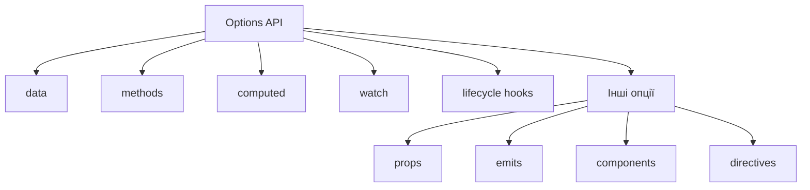
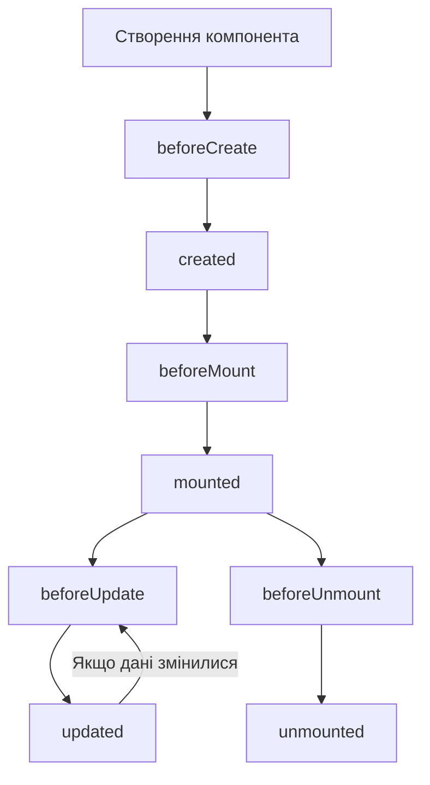

# Vue 3: Options API

## Коротке пояснення

**Options API** — це традиційний спосіб створення компонентів у Vue, який існував з перших версій фреймворку. Він заснований на визначенні різних опцій (data, methods, computed і т.д.) у вигляді об'єкта, що описує поведінку і стан компонента. Vue автоматично обробляє зв'язування цих опцій з екземпляром компонента. У Vue 3 Options API залишається повністю підтримуваним, навіть із появою Composition API.



---

## data

Опція `data` визначає реактивний стан компонента. Вона має бути функцією, яка повертає об'єкт з даними, які Vue перетворить на реактивні властивості.

### Синтаксис

```javascript
export default {
    data() {
        return {
            property1: value1,
            property2: value2,
            // ...
        };
    },
};
```

### Приклад використання

```javascript
export default {
    data() {
        return {
            count: 0,
            message: "Привіт, Vue!",
            user: {
                name: "Іван",
                email: "ivan@example.com",
            },
            items: ["Яблуко", "Банан", "Апельсин"],
        };
    },
};
```

### Важливі особливості

-   **Функція, а не об'єкт**: `data` повинна бути функцією, щоб кожен екземпляр компонента мав свою власну копію даних.
-   **Реактивність**: Всі властивості, оголошені в `data`, автоматично стають реактивними. Зміни цих властивостей призводять до оновлення DOM.
-   **Ініціалізація**: Всі властивості мають бути ініціалізовані при оголошенні для забезпечення правильного відстеження.

### Підкапотні механізми

У Vue 3 реактивність `data` реалізується за допомогою Proxy API (у Vue 2 використовувався Object.defineProperty):

1. Коли компонент створюється, Vue викликає функцію `data()` і отримує об'єкт.
2. Цей об'єкт обгортається у Proxy, який перехоплює операції доступу (get) та зміни (set) властивостей.
3. При зміні властивості Proxy спрацьовує перехоплювач set, який сповіщає систему реактивності.
4. Система реактивності позначає всі залежні обчислення (computed) і рендер-функції як застарілі.
5. Vue перерендерить компонент при наступному циклі оновлення.

### Підводні камені та обмеження

-   **Додавання нових властивостей**: Не можна додавати нові реактивні властивості після створення екземпляра. Замість цього потрібно використовувати `reactive()` з Composition API або Vue.set у Vue 2.
-   **Масиви**: Реактивність на методи масивів (push, pop, splice тощо) працює, але заміна елементів за індексом (arr[0] = 'new value') не реактивна у Vue 2 (у Vue 3 ця проблема вирішена).
-   **Вкладені об'єкти**: У Vue 3 глибока реактивність працює автоматично, але зауважте що заміна всього об'єкта також працює реактивно.

### Оптимізація

-   **Мінімізація даних**: Зберігайте у `data` тільки ті дані, які дійсно потрібні для реактивності.
-   **Плоска структура**: Намагайтеся уникати глибоко вкладених об'єктів для кращої продуктивності.
-   **Початкові значення**: Завжди встановлюйте початкові значення для всіх властивостей.

---

## methods

Опція `methods` містить функції, які можна викликати з шаблону компонента або з інших методів. Ці функції мають доступ до екземпляра компонента через `this`.

### Синтаксис

```javascript
export default {
    methods: {
        methodName() {
            // логіка методу
        },
        anotherMethod(param) {
            // логіка з параметрами
        },
    },
};
```

### Приклад використання

```javascript
export default {
    data() {
        return {
            count: 0,
        };
    },
    methods: {
        increment() {
            this.count++;
        },
        decrement() {
            this.count--;
        },
        reset() {
            this.count = 0;
        },
        addValue(value) {
            this.count += value;
        },
    },
};
```

```html
<template>
    <div>
        <p>Лічильник: {{ count }}</p>
        <button @click="increment">+</button>
        <button @click="decrement">-</button>
        <button @click="reset">Скинути</button>
        <button @click="addValue(10)">+10</button>
    </div>
</template>
```

### Важливі особливості

-   **Контекст this**: У методах `this` вказує на екземпляр компонента. Через це не слід використовувати стрілочні функції, які не мають власного `this`.
-   **Доступ до даних**: Методи мають доступ до всіх реактивних даних через `this`.
-   **Виклик з шаблону**: Методи можна викликати безпосередньо з шаблону, зокрема в обробниках подій.
-   **Передача параметрів**: При виклику з шаблону можна передавати параметри.

### Підкапотні механізми

1. Під час створення компонента Vue копіює всі методи з опції `methods` у прототип екземпляра компонента.
2. Vue прив'язує контекст кожного методу до екземпляра компонента (`this`).
3. Коли метод викликається з шаблону, Vue обробляє виклик і передає будь-які аргументи.
4. Методи не є реактивними самі по собі — вони не перезапускаються автоматично при зміні даних.

### Підводні камені та обмеження

-   **Стрілочні функції**: Не використовуйте стрілочні функції в методах, якщо вам потрібен доступ до `this`:
    ```javascript
    // Неправильно - this не буде вказувати на компонент
    methods: {
        badMethod: () => {
            console.log(this.count); // this тут - window або undefined
        };
    }
    ```
-   **Надмірне використання**: Не додавайте логіку, яка не потрібна в шаблоні, до методів — краще використовувати звичайні функції поза опцією `methods`.
-   **Продуктивність**: Методи завжди викликаються заново при кожному рендерингу, на відміну від обчислюваних властивостей (computed), які кешуються.

### Оптимізація

-   **Делегування подій**: Використовуйте делегування подій для обробки багатьох подібних елементів.
-   **Дросселювання та дебаунсінг**: Для методів, які викликаються часто (наприклад, при скролі або введенні), використовуйте `_.throttle` або `_.debounce` з lodash.
-   **Асинхронність**: Для важких обчислень використовуйте асинхронні методи, щоб не блокувати основний потік:
    ```javascript
    methods: {
      async heavyCalculation() {
        // Тут асинхронний код
      }
    }
    ```

---

## computed

Опція `computed` визначає обчислювані властивості, які є похідними від даних компонента. Вони кешуються на основі своїх залежностей і оновлюються лише коли змінюються залежні від них реактивні значення.

### Синтаксис

```javascript
export default {
    computed: {
        propertyName() {
            // обчислення на основі даних
            return result;
        },
        // Геттер і сеттер для двостороннього зв'язування
        propertyWithSetter: {
            get() {
                return result;
            },
            set(newValue) {
                // оновлення даних
            },
        },
    },
};
```

### Приклад використання

```javascript
export default {
    data() {
        return {
            firstName: "Іван",
            lastName: "Петренко",
            items: [1, 2, 3, 4, 5],
        };
    },
    computed: {
        // Проста обчислювана властивість
        fullName() {
            return `${this.firstName} ${this.lastName}`;
        },

        // Фільтрація даних
        evenItems() {
            return this.items.filter((item) => item % 2 === 0);
        },

        // З геттером і сеттером
        fullNameWithSetter: {
            get() {
                return `${this.firstName} ${this.lastName}`;
            },
            set(newValue) {
                const names = newValue.split(" ");
                this.firstName = names[0] || "";
                this.lastName = names[1] || "";
            },
        },
    },
};
```

```html
<template>
    <div>
        <p>Повне ім'я: {{ fullName }}</p>
        <p>Парні числа: {{ evenItems }}</p>
        <input v-model="fullNameWithSetter" />
    </div>
</template>
```

### Важливі особливості

-   **Кешування**: Обчислювані властивості кешуються на основі своїх реактивних залежностей і перераховуються лише при зміні залежностей.
-   **Декларативність**: Дозволяють декларативно описувати як дані мають бути перетворені для відображення.
-   **Геттер/сеттер**: Можуть мати як геттер (для читання), так і сеттер (для запису).
-   **Доступ як до властивостей**: До обчислюваних властивостей звертаються як до звичайних властивостей, без дужок.

### Підкапотні механізми

1. Vue створює геттери/сеттери для обчислюваних властивостей, які зв'язані з системою реактивності.
2. Під час першого доступу до обчислюваної властивості, Vue виконує її функцію та зберігає результат.
3. Система реактивності відстежує, які реактивні дані використовуються у функції.
4. Коли змінюється будь-яке залежне значення, Vue позначає обчислювану властивість як недійсну.
5. При наступному доступі до властивості функція буде викликана знову для отримання нового значення.

### Порівняння з методами

| Обчислювані властивості         | Методи                                |
| ------------------------------- | ------------------------------------- |
| Кешуються на основі залежностей | Виконуються щоразу при виклику        |
| Використовуються як властивості | Використовуються як функції з дужками |
| Ідеальні для перетворення даних | Підходять для дій та обробки подій    |

### Підводні камені та обмеження

-   **Залежність від реактивних даних**: Обчислювані властивості працюють лише з реактивними даними. Якщо ви використовуєте зовнішні змінні, зміни в них не викликатимуть перерахунок.
-   **Сайд-ефекти**: Обчислювані властивості не повинні мати сайд-ефектів (наприклад, змінювати стан або виконувати асинхронні операції).
-   **Асинхронність**: Стандартні обчислювані властивості не можуть бути асинхронними. Для асинхронних обчислень краще використовувати watch або Composition API.

### Оптимізація

-   **Декомпозиція складних обчислень**: Розбивайте складні обчислення на кілька простіших обчислюваних властивостей.
-   **Мінімізація залежностей**: Намагайтеся обмежити кількість залежностей для обчислюваних властивостей.
-   **Уникайте важких обчислень**: Для дуже складних обчислень розгляньте використання кешування або memoization:

    ```javascript
    import { memoize } from "lodash-es";

    export default {
        data() {
            return {
                numbers: [1, 2, 3, 4, 5],
            };
        },
        created() {
            this.expensiveOperation = memoize(function (arr) {
                console.log("Важке обчислення...");
                return arr.reduce((sum, n) => sum + n * n, 0);
            });
        },
        computed: {
            sumOfSquares() {
                return this.expensiveOperation(this.numbers);
            },
        },
    };
    ```

---

## watch

Опція `watch` дозволяє відстежувати зміни в реактивних даних компонента і виконувати певні дії у відповідь на ці зміни. Спостерігачі особливо корисні для реагування на зміни даних асинхронними або важкими операціями.

### Синтаксис

```javascript
export default {
    watch: {
        // Простий спостерігач
        propertyToWatch(newValue, oldValue) {
            // Дії при зміні
        },

        // Спостерігач з додатковими опціями
        anotherProperty: {
            handler(newValue, oldValue) {
                // Дії при зміні
            },
            deep: true, // Глибоке спостереження
            immediate: true, // Виклик при створенні компонента
        },

        // Спостереження за вкладеною властивістю
        "object.nestedProperty"(newValue, oldValue) {
            // Дії при зміні вкладеної властивості
        },

        // Кілька обробників
        multipleHandlers: [
            function handler1(newValue, oldValue) {
                /* ... */
            },
            function handler2(newValue, oldValue) {
                /* ... */
            },
        ],
    },
};
```

### Приклад використання

```javascript
export default {
    data() {
        return {
            searchQuery: "",
            searchResults: [],
            loading: false,
            user: {
                name: "Іван",
                preferences: {
                    theme: "light",
                    notifications: true,
                },
            },
        };
    },
    watch: {
        // Простий спостерігач
        searchQuery(newQuery, oldQuery) {
            this.loading = true;
            this.fetchSearchResults(newQuery).then((results) => {
                this.searchResults = results;
                this.loading = false;
            });
        },

        // З опціями
        "user.preferences": {
            handler(newPrefs, oldPrefs) {
                console.log("Налаштування користувача змінено:", newPrefs);
                this.saveUserPreferences(newPrefs);
            },
            deep: true,
            immediate: true,
        },

        // Спостереження за конкретною вкладеною властивістю
        "user.preferences.theme"(newTheme) {
            document.body.className = newTheme;
        },
    },
    methods: {
        async fetchSearchResults(query) {
            // Імітація API-запиту
            return new Promise((resolve) => {
                setTimeout(() => {
                    resolve([`Результат для ${query}`, "Інший результат"]);
                }, 500);
            });
        },
        saveUserPreferences(prefs) {
            localStorage.setItem("userPrefs", JSON.stringify(prefs));
        },
    },
};
```

### Важливі особливості

-   **Обробники змін**: Функції-обробники отримують нове і старе значення властивості.
-   **Глибоке спостереження**: Опція `deep: true` дозволяє відстежувати зміни у вкладених об'єктах.
-   **Негайне виконання**: Опція `immediate: true` викликає обробник одразу при створенні компонента.
-   **Шлях до властивості**: Можна спостерігати за вкладеними властивостями, використовуючи рядковий шлях 'object.property'.
-   **Кілька обробників**: Можна визначити масив функцій для спостереження за однією властивістю.

### Порівняння з computed

| watch                                    | computed                               |
| ---------------------------------------- | -------------------------------------- |
| Для сайд-ефектів та асинхронних операцій | Для синхронного перетворення даних     |
| Викликається у відповідь на зміни        | Кешується і перераховується за потреби |
| Ідеально для операцій, що змінюють стан  | Для отримання похідних даних           |
| Підтримує глибоке спостереження          | Автоматично відстежує залежності       |

### Підкапотні механізми

1. Vue зберігає обробники watch при створенні компонента.
2. Для кожної властивості, що спостерігається, Vue налаштовує реактивну залежність.
3. Коли значення змінюється, Vue ставить в чергу виконання відповідного обробника.
4. Обробники виконуються асинхронно в наступному циклі оновлення (tick).
5. Для властивостей з `deep: true` Vue рекурсивно проходить по об'єкту, щоб відстежити зміни на будь-якому рівні.

### Підводні камені та обмеження

-   **Продуктивність глибокого спостереження**: Опція `deep: true` може бути ресурсномісткою для великих об'єктів.
-   **Втрата контексту**: Як і з методами, не використовуйте стрілочні функції, якщо потрібен доступ до `this`.
-   **Початкові значення**: За замовчуванням, обробники не викликаються при ініціалізації (потрібно використовувати `immediate: true`).
-   **Порядок виконання**: Vue не гарантує певний порядок виконання кількох обробників, що спостерігають за однією властивістю.

### Оптимізація

-   **Точне спостереження**: Спостерігайте за конкретними вкладеними властивостями, а не цілими об'єктами з `deep: true`, коли це можливо.
-   **Очищення ресурсів**: Очищуйте ресурси (таймери, підписки на події) в обробниках, особливо якщо вони створюються кілька разів.
-   **Дебаунсінг**: Для властивостей, що змінюються часто, використовуйте дебаунсінг:

    ```javascript
    import { debounce } from "lodash-es";

    export default {
        data() {
            return {
                searchInput: "",
            };
        },
        created() {
            // Створення дебаунс-функції один раз
            this.debouncedSearch = debounce(this.performSearch, 300);
        },
        watch: {
            searchInput() {
                this.debouncedSearch();
            },
        },
        methods: {
            performSearch() {
                // Пошук з поточним значенням this.searchInput
            },
        },
    };
    ```

---

## lifecycle

Options API надає набір хуків життєвого циклу — спеціальних методів, які викликаються на різних етапах існування компонента, від створення до знищення.

### Схема життєвого циклу



### Повний список хуків життєвого циклу

#### Етап ініціалізації

1. **beforeCreate**
    - Викликається синхронно після ініціалізації екземпляра
    - Дані та обчислювані властивості ще не налаштовані
    - Доступ до `this` є, але реактивні дані ще не ініціалізовані

```javascript
export default {
    beforeCreate() {
        console.log("beforeCreate: компонент ініціалізується");
        // this.message не доступний тут
    },
    data() {
        return {
            message: "Привіт",
        };
    },
};
```

2. **created**
    - Викликається після створення екземпляра
    - Реактивні дані, обчислювані властивості, методи та спостерігачі вже налаштовані
    - DOM ще не змонтований
    - Ідеально для початкової вибірки даних

```javascript
export default {
    data() {
        return {
            users: [],
        };
    },
    created() {
        console.log("created: екземпляр створено");
        // Можна доступитися до реактивних даних
        console.log(this.users); // []
        // Часто використовується для початкового завантаження даних
        this.fetchUsers();
    },
    methods: {
        async fetchUsers() {
            try {
                const response = await fetch("/api/users");
                this.users = await response.json();
            } catch (error) {
                console.error("Помилка завантаження користувачів:", error);
            }
        },
    },
};
```

#### Етап монтування

3. **beforeMount**
    - Викликається перед монтуванням компонента до DOM
    - Рендер-функція компілюється, але DOM ще не створений
    - Рідко використовується на практиці

```javascript
export default {
    beforeMount() {
        console.log("beforeMount: компонент готується до монтування");
        // DOM ще не доступний
    },
};
```

4. **mounted**
    - Викликається після монтування компонента до DOM
    - Всі дочірні компоненти також змонтовані
    - DOM повністю доступний через `this.$el`
    - Ідеально для ініціалізації бібліотек, що працюють з DOM

```javascript
export default {
    mounted() {
        console.log("mounted: компонент змонтовано");
        // DOM доступний
        console.log(this.$el);

        // Ініціалізація сторонніх бібліотек
        const chart = new Chart(this.$refs.chartCanvas, {
            // налаштування графіка
        });

        // Додавання обробників подій до window
        window.addEventListener("resize", this.handleResize);
    },
    beforeUnmount() {
        // Не забудьте видалити обробники подій перед знищенням компонента
        window.removeEventListener("resize", this.handleResize);
    },
    methods: {
        handleResize() {
            // Обробка зміни розміру вікна
        },
    },
};
```

#### Етап оновлення

5. **beforeUpdate**
    - Викликається перед оновленням DOM у відповідь на зміни даних
    - Доступ до старого DOM перед оновленням
    - Рідко використовується; зазвичай краще використовувати обчислювані властивості або спостерігачі

```javascript
export default {
    beforeUpdate() {
        console.log("beforeUpdate: дані змінилися, DOM скоро оновиться");
        // Можна отримати доступ до DOM перед оновленням
        const oldHeight = this.$el.offsetHeight;
        this.oldScrollPosition = window.scrollY;
    },
};
```

6. **updated**
    - Викликається після того, як DOM оновлено через зміни даних
    - Ідеально для виконання операцій DOM після оновлення
    - Слід бути обережним, щоб не викликати зміни стану, які призведуть до нового оновлення

```javascript
export default {
    updated() {
        console.log("updated: DOM оновлено");

        // Відновлення позиції прокрутки
        if (this.oldScrollPosition) {
            window.scrollTo(0, this.oldScrollPosition);
        }

        // Обережно з маніпуляціями, що змінюють дані, це може викликати нескінченний цикл
        // this.count++ // Погана ідея! Викличе нове оновлення
    },
};
```

#### Етап знищення

7. **beforeUnmount**
    - Викликається безпосередньо перед тим, як компонент буде знищено
    - Компонент все ще повністю функціональний
    - Ідеально для очищення ресурсів (видалення таймерів, обробників подій, підписок)

```javascript
export default {
    mounted() {
        this.intervalId = setInterval(() => {
            this.count++;
        }, 1000);

        document.addEventListener("click", this.handleGlobalClick);
    },
    beforeUnmount() {
        console.log("beforeUnmount: компонент скоро буде знищено");

        // Очищення ресурсів
        clearInterval(this.intervalId);
        document.removeEventListener("click", this.handleGlobalClick);

        // Відписка від зовнішніх сервісів
        this.externalService.unsubscribe();
    },
    methods: {
        handleGlobalClick(event) {
            // Обробка кліка
        },
    },
};
```

8. **unmounted**
    - Викликається після знищення компонента
    - Всі дочірні компоненти також знищені
    - Всі директиви відв'язані
    - Всі обробники подій видалені

```javascript
export default {
    unmounted() {
        console.log("unmounted: компонент знищено");
        // Можна виконати додаткове очищення або логування
    },
};
```

#### Додаткові хуки

9. **errorCaptured**
    - Викликається, коли помилка з будь-якого дочірнього компонента перехоплюється
    - Отримує помилку, компонент, що викликав помилку, та інформацію про джерело помилки
    - Може повернути `false`, щоб запобігти поширенню помилки

```javascript
export default {
    errorCaptured(error, instance, info) {
        console.log(
            "errorCaptured: перехоплено помилку в дочірньому компоненті"
        );
        console.error(error);
        console.log("Компонент:", instance);
        console.log("Інформація:", info);

        // Запис помилки до сервісу моніторингу
        this.errorTrackingService.report(error, info);

        // Повернення false запобігає поширенню помилки далі
        return false;
    },
};
```

10. **renderTracked** і **renderTriggered** (тільки для режиму розробки)
    -   Допомагають відстежувати, що викликає перерендеринг компонента
    -   Корисні для відлагодження

```javascript
export default {
    renderTracked(event) {
        console.log("renderTracked", event);
    },
    renderTriggered(event) {
        console.log("renderTriggered", event);
    },
};
```

### Зв'язок з Composition API

У Vue 3 хуки життєвого циклу в Composition API мають аналоги для всіх хуків Options API:

| Options API     | Composition API   |
| --------------- | ----------------- |
| beforeCreate    | setup()           |
| created         | setup()           |
| beforeMount     | onBeforeMount     |
| mounted         | onMounted         |
| beforeUpdate    | onBeforeUpdate    |
| updated         | onUpdated         |
| beforeUnmount   | onBeforeUnmount   |
| unmounted       | onUnmounted       |
| errorCaptured   | onErrorCaptured   |
| renderTracked   | onRenderTracked   |
| renderTriggered | onRenderTriggered |
| activated       | onActivated       |
| deactivated     | onDeactivated     |

### Підкапотні механізми

1. Vue зберігає всі хуки життєвого циклу під час створення компонента.
2. На кожному етапі життєвого циклу Vue викликає відповідні хуки.
3. Хуки викликаються у визначеному порядку.
4. Якщо є кілька хуків одного типу (наприклад, через успадкування або міксини), вони викликаються в тому порядку, в якому вони були оголошені.

### Підводні камені та обмеження

-   **Асинхронні операції**: Хуки життєвого циклу виконуються синхронно. Якщо ви запускаєте асинхронні операції, це не затримає перехід до наступного етапу.
-   **Доступ до DOM**: У `beforeMount` і раніше DOM ще недоступний. Використовуйте `mounted` для роботи з DOM.
-   **Компоненти в циклах**: Будьте обережні з важкими операціями в хуках для компонентів, що рендеряться в циклах — це може призвести до проблем продуктивності.
-   **Очищення ресурсів**: Завжди очищуйте ресурси в `beforeUnmount`, щоб уникнути витоків пам'яті.

### Оптимізація

-   **Мінімізація роботи в хуках**: Уникайте важких обчислень у хуках, особливо в тих, що викликаються часто (`beforeUpdate`, `updated`).
-   **Асинхронний код**: Використовуйте асинхронні операції для важких завдань, щоб не блокувати UI:
    ```javascript
    mounted() {
      // Запуск важкої операції в наступному циклі оновлення
      this.$nextTick(() => {
        this.performHeavyTask()
      })

      // Або використовуйте setTimeout для відкладення операції
      setTimeout(() => {
        this.processLargeDataset()
      }, 0)
    }
    ```
-   **Умовні хуки**: Використовуйте умови в хуках для виконання логіки лише коли потрібно:
    ```javascript
    updated() {
      if (this.shouldUpdateChart) {
        this.updateChart()
      }
    }
    ```

---

## Порівняння Options API та Composition API

| Аспект                     | Options API                        | Composition API                        |
| -------------------------- | ---------------------------------- | -------------------------------------- |
| **Організація коду**       | За типом (data, methods, computed) | За логічними блоками функціональності  |
| **Реактивність**           | Автоматична через `this`           | Явна через `ref()` і `reactive()`      |
| **Довжина коду**           | Коротший для простих компонентів   | Ефективніший для складних компонентів  |
| **Повторне використання**  | Міксини, HOC (складніше)           | Композиційні функції (простіше)        |
| **Типізація (TypeScript)** | Обмежена підтримка                 | Повна підтримка                        |
| **Крива навчання**         | Проста для початківців             | Складніша, потребує розуміння замикань |

### Коли використовувати Options API

-   Для простих компонентів з невеликою кількістю логіки
-   Коли працюєте з існуючою кодовою базою Vue 2
-   Для розробників-початківців, що тільки вивчають Vue
-   Коли TypeScript не є пріоритетом

### Коли використовувати Composition API

-   Для складних компонентів з багатьма логічними блоками
-   Коли потрібне повторне використання логіки між компонентами
-   У проєктах з TypeScript
-   Для кращої організації та масштабування коду

### Приклад однакової функціональності в обох API

**Options API:**

```javascript
export default {
    data() {
        return {
            count: 0,
            isDark: false,
        };
    },
    computed: {
        doubleCount() {
            return this.count * 2;
        },
    },
    methods: {
        increment() {
            this.count++;
        },
        toggleTheme() {
            this.isDark = !this.isDark;
        },
    },
    watch: {
        isDark(newValue) {
            document.body.className = newValue ? "dark" : "light";
        },
    },
    mounted() {
        console.log("Компонент змонтовано");
    },
};
```

**Composition API:**

```javascript
import { ref, computed, watch, onMounted } from "vue";

export default {
    setup() {
        // Стан
        const count = ref(0);
        const isDark = ref(false);

        // Обчислювані властивості
        const doubleCount = computed(() => count.value * 2);

        // Методи
        function increment() {
            count.value++;
        }

        function toggleTheme() {
            isDark.value = !isDark.value;
        }

        // Спостерігачі
        watch(isDark, (newValue) => {
            document.body.className = newValue ? "dark" : "light";
        });

        // Хуки життєвого циклу
        onMounted(() => {
            console.log("Компонент змонтовано");
        });

        // Повертаємо все, що має бути доступне в шаблоні
        return {
            count,
            doubleCount,
            isDark,
            increment,
            toggleTheme,
        };
    },
};
```

## Підсумок

Options API — це потужний і зручний спосіб створення компонентів у Vue, який залишається повністю підтримуваним у Vue 3. Він пропонує простий та зрозумілий формат для організації коду, який особливо добре підходить для невеликих та середніх компонентів.

Ключові переваги Options API:

-   Чітка структура з розділами для різних типів функціональності
-   Проста модель з автоматичним зв'язуванням через `this`
-   Низький поріг входу для початківців
-   Сумісність з існуючим кодом Vue 2

Хоча Composition API пропонує потужніші можливості для складних сценаріїв, Options API залишається актуальним вибором для багатьох задач, і знання обох підходів дозволяє вибирати найкращий інструмент для конкретної ситуації.
