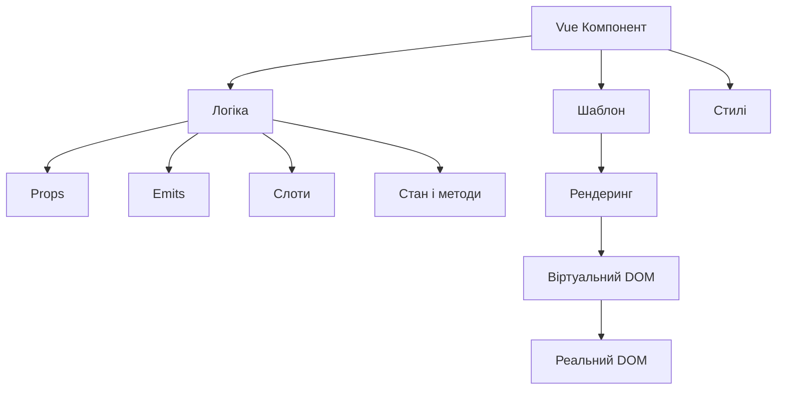
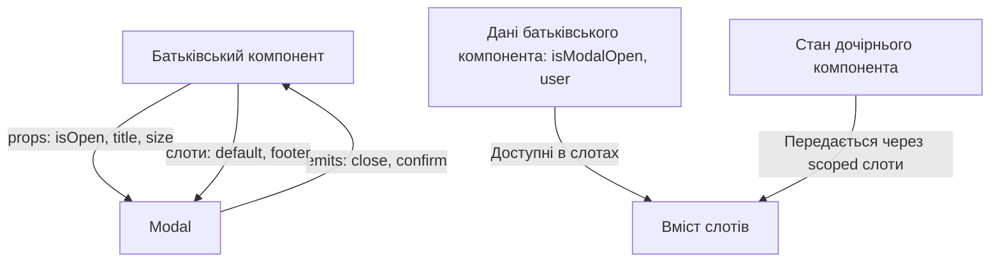

# Vue 3: Компоненти

## Коротке пояснення

**Компоненти** — це основні будівельні блоки Vue-додатків. Вони дозволяють розділити інтерфейс на незалежні, повторно використовувані частини, про які можна думати ізольовано. Компоненти Vue — це самодостатні модулі з власною логікою, шаблоном і стилями, які інкапсулюють своє внутрішнє функціонування і спілкуються із зовнішнім світом через чітко визначені інтерфейси.



---

## Створення компонентів

У Vue 3 компоненти можна створювати кількома способами: за допомогою функції `defineComponent`, як звичайний JavaScript об'єкт, або як SFC (Single-File Component).

### Single-File Components (SFC)

Найпоширеніший спосіб — використання однофайлових компонентів (SFC), які мають розширення `.vue` і поєднують шаблон, логіку та стилі в одному файлі.

```html
<!-- MyComponent.vue -->
<template>
    <div class="my-component">
        <h2>{{ title }}</h2>
        <slot></slot>
        <button @click="handleClick">{{ buttonText }}</button>
    </div>
</template>

<script>
    export default {
        name: "MyComponent",
        props: {
            title: String,
            buttonText: {
                type: String,
                default: "Натиснути",
            },
        },
        emits: ["buttonClicked"],
        methods: {
            handleClick() {
                this.$emit("buttonClicked");
            },
        },
    };
</script>

<style scoped>
    .my-component {
        padding: 20px;
        border: 1px solid #ccc;
        border-radius: 4px;
    }
</style>
```

### Options API

Компонент з використанням Options API (без SFC):

```javascript
// MyComponent.js
import { h } from "vue";

export default {
    name: "MyComponent",
    props: {
        title: String,
    },
    data() {
        return {
            count: 0,
        };
    },
    methods: {
        increment() {
            this.count++;
        },
    },
    render() {
        return h("div", [
            h("h2", this.title),
            h("p", `Лічильник: ${this.count}`),
            h("button", { onClick: this.increment }, "Збільшити"),
        ]);
    },
};
```

### Composition API

Компонент з використанням Composition API у SFC:

```html
<!-- CompositionComponent.vue -->
<template>
    <div>
        <h2>{{ title }}</h2>
        <p>Лічильник: {{ count }}</p>
        <button @click="increment">Збільшити</button>
    </div>
</template>

<script setup>
    import { ref } from "vue";

    // props мають бути оголошені за допомогою defineProps
    const props = defineProps({
        title: String,
    });

    // Стан і методи
    const count = ref(0);
    const increment = () => {
        count.value++;
    };

    // Емітування подій
    const emit = defineEmits(["update"]);
    const handleUpdate = () => {
        emit("update", count.value);
    };
</script>
```

### Функціональні компоненти

Для простих компонентів без стану можна використовувати функціональні компоненти:

```javascript
import { h } from "vue";

const FunctionalButton = (props, { slots, emit }) => {
    return h(
        "button",
        {
            class: "functional-button",
            onClick: () => emit("click"),
        },
        slots.default()
    );
};

// Можна задати властивості для цього функціонального компонента
FunctionalButton.props = ["color", "size"];
```

### Підкапотні механізми

Коли Vue створює компонент:

1. Парсинг SFC (якщо використовується) — Vue CLI або інші інструменти розділяють файл на шаблон, скрипт і стилі.
2. Компіляція шаблону в рендер-функцію (під час збірки або в runtime).
3. Створення конструктора компонента з різними опціями (props, data, methods і т.д.).
4. Ініціалізація екземпляра компонента з його станом і методами.
5. Монтування компонента в DOM із дотриманням життєвого циклу.

### Підводні камені та обмеження

-   **Назви компонентів**: Vue рекомендує давати компонентам назви з двох або більше слів, щоб уникнути конфліктів з існуючими і майбутніми HTML-елементами (які завжди однослівні).
-   **Циклічні залежності**: Будьте обережні з імпортом компонентів один в одного, це може призвести до циклічних залежностей. Використовуйте асинхронне завантаження для вирішення цієї проблеми.
-   **Inline-шаблони**: Уникайте великих інлайнових шаблонів у JavaScript-файлах, це ускладнює читабельність і позбавляє переваг інструментів IDE.

### Оптимізація

-   **Кешування компонентів**: Для компонентів, які не змінюються, використовуйте `v-once` або `markRaw`.
-   **Асинхронні компоненти**: Для великих компонентів використовуйте асинхронне завантаження:
    ```javascript
    const AsyncComponent = defineAsyncComponent(() =>
        import("./components/HeavyComponent.vue")
    );
    ```
-   **KeepAlive**: Використовуйте `<KeepAlive>` для кешування екземплярів компонентів, що часто перемикаються.

---

## Реєстрація компонентів

У Vue 3 компоненти можна реєструвати глобально або локально.

### Глобальна реєстрація

При глобальній реєстрації компонент стає доступним у всьому додатку.

```javascript
// main.js
import { createApp } from "vue";
import App from "./App.vue";
import MyComponent from "./components/MyComponent.vue";
import OtherComponent from "./components/OtherComponent.vue";

const app = createApp(App);

// Реєстрація окремих компонентів
app.component("MyComponent", MyComponent);
app.component("OtherComponent", OtherComponent);

// Автоматична реєстрація багатьох компонентів
const components = import.meta.glob("./components/*.vue", { eager: true });
Object.entries(components).forEach(([path, component]) => {
    const componentName = path
        .split("/")
        .pop()
        .replace(/\.\w+$/, "");
    app.component(componentName, component.default);
});

app.mount("#app");
```

### Локальна реєстрація

При локальній реєстрації компонент доступний тільки в тому компоненті, де він зареєстрований.

#### В Options API:

```javascript
import MyComponent from "./MyComponent.vue";
import OtherComponent from "./OtherComponent.vue";

export default {
    components: {
        MyComponent,
        OtherComponent,
        // Можна вказати інше ім'я для компонента
        "custom-name": MyComponent,
    },
    // інші опції...
};
```

#### В Composition API:

```html
<script setup>
    import MyComponent from "./MyComponent.vue";
    import OtherComponent from "./OtherComponent.vue";

    // У <script setup> імпортовані компоненти автоматично доступні в шаблоні
</script>

<template>
    <MyComponent />
    <OtherComponent />
</template>
```

### Динамічні компоненти

Vue дозволяє динамічно перемикати компоненти за допомогою спеціального елемента `<component>`:

```html
<template>
    <div>
        <button v-for="tab in tabs" :key="tab" @click="currentTab = tab">
            {{ tab }}
        </button>

        <component :is="currentTabComponent" />
    </div>
</template>

<script>
    export default {
        data() {
            return {
                currentTab: "Tab1",
                tabs: ["Tab1", "Tab2", "Tab3"],
            };
        },
        computed: {
            currentTabComponent() {
                return this.currentTab; // Буде використовувати зареєстрований компонент з таким ім'ям
                // Або можна використовувати імпортовані компоненти напряму
                // return this.tabs.includes(this.currentTab) ? this.components[this.currentTab] : null
            },
        },
    };
</script>
```

### Асинхронні компоненти

Для ледачого завантаження великих компонентів використовуйте `defineAsyncComponent`:

```javascript
import { defineAsyncComponent } from "vue";

// Простий синтаксис
const AsyncComponent = defineAsyncComponent(() =>
    import("./components/HeavyComponent.vue")
);

// Розширений синтаксис з додатковими опціями
const AsyncComponentWithOptions = defineAsyncComponent({
    loader: () => import("./components/HeavyComponent.vue"),
    loadingComponent: LoadingSpinner,
    errorComponent: ErrorComponent,
    delay: 200, // затримка перед показом компонента завантаження
    timeout: 3000, // таймаут, після якого показується errorComponent
    suspensible: true, // інтеграція з <Suspense>
    onError(error, retry, fail, attempts) {
        // Обробка помилок з можливістю повторних спроб
        if (attempts <= 3) {
            retry();
        } else {
            fail();
        }
    },
});
```

### Підкапотні механізми

1. **Глобальна реєстрація**:

    - Компонент додається до внутрішнього сховища компонентів Vue-додатка.
    - Доступний всюди, навіть там, де не використовується (збільшує розмір бандла).

2. **Локальна реєстрація**:

    - Компонент зберігається в межах батьківського компонента.
    - Використовується для tree-shaking (видалення невикористовуваного коду).

3. **Асинхронні компоненти**:
    - Код компонента виділяється в окремий JavaScript-файл (chunk).
    - Завантажується лише при необхідності за допомогою динамічного імпорту.

### Підводні камені та обмеження

-   **Глобальна реєстрація**: Погано піддається tree-shaking, що призводить до збільшення бандла.
-   **Конфлікти імен**: При автоматичній реєстрації багатьох компонентів можуть виникнути конфлікти імен.
-   **Локальна реєстрація**: Вимагає імпорту в кожному компоненті, де використовується.
-   **Асинхронні компоненти**: Додають невелику затримку при першому рендерингу.

### Оптимізація

-   **Локальна реєстрація vs глобальна**: Використовуйте локальну реєстрацію для більшості компонентів, щоб покращити tree-shaking.
-   **Іменування компонентів**: Створіть узгоджену систему іменування для своїх компонентів (наприклад, префікс App- для додатка або префікс відповідно до функціональності).
-   **Автоматична реєстрація**: Для великих додатків використовуйте автоматичну реєстрацію тільки для справді глобальних UI-компонентів (кнопки, модалки і т.д.).

---

## props

Props (скорочення від "properties") — це система передачі даних від батьківського компонента до дочірнього. Вони дозволяють створювати повторно використовувані компоненти, поведінка яких може бути налаштована за допомогою переданих властивостей.

### Основи props

#### Оголошення Props

**В Options API:**

```javascript
export default {
    props: {
        // Базове оголошення типу
        title: String,

        // Детальніше визначення з перевірками та значенням за замовчуванням
        size: {
            type: String,
            default: "medium",
            validator: (value) => ["small", "medium", "large"].includes(value),
        },

        // Обов'язковий prop
        items: {
            type: Array,
            required: true,
        },

        // Об'єкт як значення за замовчуванням (має бути функцією)
        userData: {
            type: Object,
            default: () => ({ name: "Гість" }),
        },
    },
};
```

**В Composition API:**

```html
<script setup>
    const props = defineProps({
        title: String,
        size: {
            type: String,
            default: "medium",
            validator: (value) => ["small", "medium", "large"].includes(value),
        },
        items: {
            type: Array,
            required: true,
        },
        userData: {
            type: Object,
            default: () => ({ name: "Гість" }),
        },
    });
</script>
```

#### Передача Props

Props передаються як атрибути у шаблоні:

```html
<template>
    <!-- Статичне значення -->
    <UserProfile title="Профіль користувача" />

    <!-- Динамічне значення з використанням v-bind -->
    <UserProfile :title="profileTitle" />

    <!-- Передача всіх властивостей з об'єкта -->
    <UserProfile v-bind="userProfileProps" />
</template>

<script>
    export default {
        data() {
            return {
                profileTitle: "Налаштування профілю",
                userProfileProps: {
                    title: "Профіль VIP-користувача",
                    size: "large",
                    items: ["Налаштування", "Безпека", "Платежі"],
                },
            };
        },
    };
</script>
```

### Типи props

Vue підтримує різні типи даних для props:

-   **String**: Рядки
-   **Number**: Числа
-   **Boolean**: Логічні значення
-   **Array**: Масиви
-   **Object**: Об'єкти
-   **Date**: Дати
-   **Function**: Функції
-   **Symbol**: Символи
-   **Конструктори**: Власні класи

Можна також вказати кілька можливих типів:

```javascript
props: {
  value: [String, Number],
  callback: Function,
  user: Object,
  items: Array
}
```

### Однонаправлений потік даних

Vue використовує однонаправлений потік даних для props — батьківський компонент може передавати дані дочірньому, але не навпаки. Це запобігає випадковій зміні стану батьківського компонента з дочірнього.

Неправильно:

```javascript
// Дочірній компонент
export default {
    props: ["value"],
    mounted() {
        // Це призведе до попередження!
        this.value = "Нове значення";
    },
};
```

Правильно:

```javascript
// Дочірній компонент
export default {
    props: ["value"],
    data() {
        return {
            // Створення локальної копії
            localValue: this.value,
        };
    },
    methods: {
        updateValue(newValue) {
            // Оновлення локальної копії
            this.localValue = newValue;
            // Інформування батьківського компонента
            this.$emit("update:value", newValue);
        },
    },
};
```

### Модифікація Props

Якщо потрібно модифікувати prop, є кілька рекомендованих підходів:

1. **Використання локальної копії даних**:

```javascript
export default {
    props: ["initialValue"],
    data() {
        return {
            // Створення локальної копії
            internalValue: this.initialValue,
        };
    },
};
```

2. **Обчислювані властивості на основі props**:

```javascript
export default {
    props: ["size"],
    computed: {
        // Похідне значення на основі props
        buttonClass() {
            return `btn-${this.size}`;
        },
    },
};
```

3. **Використання v-model з компонентами**:

```html
<!-- Батьківський компонент -->
<template>
    <CustomInput v-model="searchText" />
</template>

<!-- Дочірній компонент (CustomInput.vue) -->
<template>
    <input
        :value="modelValue"
        @input="$emit('update:modelValue', $event.target.value)"
    />
</template>

<script>
    export default {
        props: ["modelValue"],
        emits: ["update:modelValue"],
    };
</script>
```

### Props drilling

Проблема "props drilling" виникає, коли props потрібно передавати через багато рівнів компонентів. Для вирішення цієї проблеми можна використовувати:

1. **Provide/Inject**:

```javascript
// Батьківський компонент
export default {
  provide() {
    return {
      user: this.user
    }
  },
  data() {
    return {
      user: { name: 'Іван' }
    }
  }
}

// Глибоко вкладений дочірній компонент
export default {
  inject: ['user']
}
```

2. **Vuex/Pinia** для стану додатка:

```javascript
// Компонент з використанням Pinia
import { useUserStore } from "@/stores/user";

export default {
    setup() {
        const userStore = useUserStore();

        return {
            user: userStore.user,
        };
    },
};
```

### Підкапотні механізми

1. **Валідація props**:

    - Vue перевіряє типи і застосовує валідатори під час розробки
    - У production-збірці деякі перевірки вимикаються для оптимізації

2. **Реактивність**:

    - Props є реактивними, тому при зміні значення в батьківському компоненті оновлюється і в дочірньому
    - Зміна властивостей об'єкта або елементів масиву в prop відслідковується (глибока реактивність)

3. **Нормалізація імен**:
    - Vue автоматично конвертує імена props з kebab-case у camelCase в JavaScript
    - `<component item-text="Текст" />` → `props.itemText`

### Підводні камені та обмеження

-   **Зміна об'єктів і масивів**: Хоча Vue попереджає про зміну props, зміна вкладених властивостей об'єктів або елементів масивів технічно можлива (але не рекомендується).
-   **Продуктивність**: Передача великих об'єктів через props може призвести до проблем з продуктивністю.
-   **Типи даних**: У JavaScript перевірка типів відбувається на основі примітивних типів, тому `{ type: Object }` допускає також масиви і функції.
-   **Масиви і об'єкти за замовчуванням**: Завжди використовуйте функцію, що повертає нове значення, для масивів і об'єктів.

### Оптимізація

-   **Мінімізація props**: Передавайте тільки необхідні дані, а не цілі великі об'єкти.
-   **Правильні типи**: Завжди вказуйте правильні типи і валідатори для своїх props.
-   **Дефолтні значення**: Завжди надавайте значення за замовчуванням для необов'язкових props.
-   **Memo для важких обчислень**: Використовуйте `computed` або `useMemo` для важких обчислень на основі props.

---

## emits

Emits — це механізм передачі подій від дочірнього компонента до батьківського. Це дозволяє реалізувати двосторонню комунікацію між компонентами, дотримуючись однонаправленого потоку даних.

### Оголошення подій

#### В Options API:

```javascript
export default {
    // Просте оголошення подій
    emits: ["update", "delete", "submit"],

    // Або з валідацією
    emits: {
        // Без валідації
        update: null,

        // З валідацією
        submit: (payload) => {
            // Перевірка, що payload містить обов'язкові поля
            if (!payload.id || !payload.data) {
                console.warn("Event submit should contain id and data");
                return false;
            }
            return true;
        },
    },

    methods: {
        sendUpdate() {
            this.$emit("update", { value: this.value });
        },

        submitForm() {
            this.$emit("submit", {
                id: this.formId,
                data: this.formData,
            });
        },
    },
};
```

#### В Composition API:

```html
<script setup>
    // Просте оголошення
    const emit = defineEmits(["update", "delete", "submit"]);

    // Або з валідацією
    const emit = defineEmits({
        update: null,
        submit: (payload) => {
            if (!payload.id || !payload.data) {
                console.warn("Event submit should contain id and data");
                return false;
            }
            return true;
        },
    });

    function sendUpdate() {
        emit("update", { value: "нове значення" });
    }

    function submitForm() {
        emit("submit", {
            id: 1,
            data: { name: "Іван", email: "ivan@example.com" },
        });
    }
</script>
```

### Прослуховування подій

У батьківському компоненті події прослуховуються за допомогою `v-on` або скороченого синтаксису `@`:

```html
<template>
    <!-- Базове прослуховування -->
    <UserForm @submit="handleSubmit" />

    <!-- З inline-обробником -->
    <UserForm @update="userData = $event" />

    <!-- Прослуховування кількох подій -->
    <UserForm
        @submit="handleSubmit"
        @update="handleUpdate"
        @delete="handleDelete"
    />
</template>

<script>
    export default {
        data() {
            return {
                userData: {},
            };
        },
        methods: {
            handleSubmit(payload) {
                console.log("Форма відправлена:", payload);
                // Обробка відправлення форми
            },

            handleUpdate(payload) {
                console.log("Дані оновлено:", payload);
                this.userData = payload.data;
            },

            handleDelete() {
                console.log("Запит на видалення");
                // Логіка видалення
            },
        },
    };
</script>
```

### v-model з компонентами

`v-model` — це директива, яка поєднує props і emit для двостороннього зв'язування даних. У Vue 3 можна використовувати кілька `v-model` на одному компоненті.

#### Базове використання v-model:

```html
<!-- Батьківський компонент -->
<template>
    <CustomInput v-model="searchText" />
</template>

<!-- Дочірній компонент (CustomInput.vue) -->
<template>
    <input
        :value="modelValue"
        @input="$emit('update:modelValue', $event.target.value)"
    />
</template>

<script>
    export default {
        props: ["modelValue"],
        emits: ["update:modelValue"],
    };
</script>
```

#### Кілька v-model:

```html
<!-- Батьківський компонент -->
<template>
    <UserForm v-model:name="user.name" v-model:email="user.email" />
</template>

<!-- Дочірній компонент (UserForm.vue) -->
<template>
    <div>
        <input
            :value="name"
            @input="$emit('update:name', $event.target.value)"
        />
        <input
            :value="email"
            @input="$emit('update:email', $event.target.value)"
        />
    </div>
</template>

<script>
    export default {
        props: ["name", "email"],
        emits: ["update:name", "update:email"],
    };
</script>
```

### События з аргументами

Можна передавати кілька аргументів у події:

```javascript
// Дочірній компонент
methods: {
  notifyWithDetails() {
    // Можна передати кілька аргументів
    this.$emit('notification', 'success', 'Операція виконана успішно', { id: 123 })
  }
}

// Батьківський компонент
methods: {
  handleNotification(type, message, details) {
    console.log(type, message, details)
    // 'success', 'Операція виконана успішно', { id: 123 }
  }
}
```

### Підкапотні механізми

1. **Система подій Vue**:

    - Vue використовує внутрішній шину подій для обробки emits
    - Події передаються безпосередньо від дочірнього компонента до батьківського
    - Валідація подій відбувається в режимі розробки

2. **v-model**:

    - У Vue 3 `v-model` за замовчуванням використовує prop `modelValue` і подію `update:modelValue`
    - Можна налаштувати властивості v-model за допомогою опції `model` в компоненті

3. **Обробка подій**:
    - Події в Vue є синхронними за замовчуванням
    - Обробники подій виконуються в контексті батьківського компонента

### Підводні камені та обмеження

-   **Назви подій**: Vue автоматично конвертує назви подій в нижній регістр, тому емітування події 'myEvent' буде доступне як '@my-event' у шаблоні.
-   **Обробка об'єктів**: При передачі об'єктів через події, вони передаються за посиланням, тому зміни в одному компоненті впливатимуть на інші.
-   **Бульбашкове поширення**: На відміну від DOM-подій, Vue-події не "бульбашкують" вгору по ієрархії компонентів.
-   **Забуті обробники**: Якщо емітувати подію, для якої немає обробника, нічого не станеться (на відміну від звичайних JavaScript-подій, які можуть викликати помилки).

### Найкращі практики

-   **Валідація подій**: Використовуйте валідацію для гарантії правильного формату даних.
-   **Документування інтерфейсу**: Чітко документуйте всі події, які можуть бути емітовані компонентом.
-   **Конвенції іменування**: Використовуйте послідовні конвенції для назв подій (наприклад, дієслово + іменник).
-   **Уникнення стану**:

    ```javascript
    // Погано: передача стану через події
    this.$emit("update", this.localState);

    // Добре: передача тільки необхідних даних
    this.$emit("update", { id: this.id, value: this.value });
    ```

---

## слоти

Слоти — це механізм, який дозволяє передавати шаблони від батьківського компонента до дочірнього. Це дає можливість створювати більш гнучкі компоненти з налаштовуваним вмістом.

### Типи слотів

#### 1. Базовий слот

```html
<!-- Компонент Card.vue -->
<template>
    <div class="card">
        <div class="card-header">
            <h3>{{ title }}</h3>
        </div>
        <div class="card-body">
            <!-- Базовий слот -->
            <slot></slot>
        </div>
    </div>
</template>

<script>
    export default {
        props: {
            title: String,
        },
    };
</script>

<!-- Використання -->
<template>
    <Card title="Профіль користувача">
        <p>Це вміст, який буде відображено в слоті</p>
        <button>Редагувати</button>
    </Card>
</template>
```

#### 2. Іменовані слоти

```html
<!-- Компонент Layout.vue -->
<template>
    <div class="layout">
        <header>
            <slot name="header"></slot>
        </header>

        <main>
            <!-- Безіменний слот = слот за замовчуванням -->
            <slot></slot>
        </main>

        <footer>
            <slot name="footer"></slot>
        </footer>
    </div>
</template>

<!-- Використання -->
<template>
    <Layout>
        <template v-slot:header>
            <h1>Заголовок сторінки</h1>
            <nav>Навігація</nav>
        </template>

        <!-- Короткий синтаксис для іменованих слотів -->
        <template #footer>
            <p>© 2025 Моя компанія</p>
        </template>

        <!-- Вміст слота за замовчуванням -->
        <p>Основний вміст сторінки</p>
        <button>Дія</button>
    </Layout>
</template>
```

#### 3. Scoped слоти (слоти з областю видимості)

Scoped слоти дозволяють дочірньому компоненту передавати дані назад до слота в батьківському компоненті.

```html
<!-- Компонент DataList.vue -->
<template>
    <div>
        <ul>
            <li v-for="(item, index) in items" :key="index">
                <!-- Передача даних у слот -->
                <slot :item="item" :index="index"></slot>
            </li>
        </ul>
    </div>
</template>

<script>
    export default {
        props: {
            items: {
                type: Array,
                required: true,
            },
        },
    };
</script>

<!-- Використання -->
<template>
    <datalist :items="users">
        <!-- v-slot з деструктуризацією -->
        <template v-slot="{ item, index }">
            <div class="user-item">
                <span>{{ index + 1 }}. </span>
                <strong>{{ item.name }}</strong>
                <p>{{ item.email }}</p>
            </div>
        </template>
    </datalist>

    <!-- Або з повним синтаксисом -->
    <datalist :items="products">
        <template v-slot:default="slotProps">
            <div class="product">
                <h3>{{ slotProps.item.name }}</h3>
                <p>Ціна: {{ slotProps.item.price }}</p>
            </div>
        </template>
    </datalist>
</template>
```

#### 4. Динамічні слоти

Можна використовувати динамічні імена слотів:

```html
<template>
    <layout>
        <!-- Динамічний слот на основі змінної -->
        <template v-slot:[dynamicSlotName]>
            Динамічний вміст для слота {{ dynamicSlotName }}
        </template>
    </layout>
</template>

<script>
    export default {
        data() {
            return {
                dynamicSlotName: "header", // Може змінюватися на 'footer', 'sidebar' тощо
            };
        },
    };
</script>
```

### Значення за замовчуванням для слотів

Можна визначити вміст за замовчуванням для слота, який буде використовуватися, якщо батьківський компонент не надав свій вміст:

```html
<!-- Компонент з резервним вмістом для слота -->
<template>
    <div class="alert">
        <slot>
            <!-- Цей вміст буде показаний, якщо слот порожній -->
            <p>Сталася помилка. Спробуйте ще раз.</p>
        </slot>
    </div>
</template>

<!-- Використання -->
<template>
    <!-- Зі своїм вмістом -->
    <Alert>
        <p>Користувач успішно створений!</p>
    </Alert>

    <!-- Без вмісту, буде використано вміст за замовчуванням -->
    <Alert></Alert>
</template>
```

### Умовні слоти

Можна перевіряти, чи був наданий вміст для слота:

```html
<template>
    <div class="card">
        <!-- Перевірка, чи передано вміст для слота header -->
        <div class="card-header" v-if="$slots.header">
            <slot name="header"></slot>
        </div>

        <div class="card-body">
            <slot></slot>
        </div>

        <div class="card-footer" v-if="$slots.footer">
            <slot name="footer"></slot>
        </div>
    </div>
</template>
```

У Composition API:

```html
<script setup>
    import { useSlots } from "vue";

    const slots = useSlots();

    // Можна перевіряти наявність слотів
    const hasHeaderSlot = !!slots.header;
</script>
```

### Підкапотні механізми

1. **Компіляція слотів**:

    - Vue компілює вміст слотів у так звані "слот-функції"
    - Ці функції виконуються в контексті батьківського компонента
    - Для scoped слотів Vue створює функції, які приймають параметри

2. **Rendering**:

    - Вміст слота фактично рендериться в батьківському компоненті
    - Дочірній компонент лише визначає, де цей вміст буде розміщено

3. **Контекст виконання**:
    - Вміст слота має доступ до даних батьківського компонента
    - Дані передані через атрибути v-bind у слоті доступні тільки через slotProps

### Підводні камені та обмеження

-   **Область видимості**: Вміст слота має доступ лише до областей видимості батьківського компонента, а не дочірнього (крім даних, переданих через scoped слоти).
-   **Продуктивність**: Надмірне використання scoped слотів може негативно впливати на продуктивність, оскільки це створює додаткові функції.
-   **Рендеринг**: Умовний рендеринг слотів (`v-if="$slots.name"`) може призвести до неочікуваних результатів, якщо слот перестає бути переданим після початкового рендерингу.
-   **TypeScript**: Типізація scoped слотів може бути складною у великих додатках.

### Найкращі практики

-   **Чітка документація**: Документуйте очікувану структуру слотів та передані дані для scoped слотів.
-   **Угоди про іменування**: Використовуйте зрозумілі та послідовні імена для слотів.
-   **Резервний вміст**: Завжди надавайте якісний вміст за замовчуванням для важливих слотів.
-   **Мінімізація даних**: Для scoped слотів передавайте лише необхідні дані, щоб уникнути зайвого перерендерингу.

### Оптимізація

-   **Мемоізація**: Використовуйте `v-memo` для оптимізації перерендерингу вмісту слотів:
    ```html
    <ul>
        <li v-for="item in items" :key="item.id">
            <!-- Оптимізація: перерендеринг лише при зміні item.value -->
            <template v-memo="[item.value]">
                <slot :item="item"></slot>
            </template>
        </li>
    </ul>
    ```
-   **Ледаче завантаження**: Використовуйте динамічні компоненти з KeepAlive для важкого вмісту слотів:
    ```html
    <KeepAlive>
        <component :is="currentTab">
            <template #header>
                <heavy-component />
            </template>
        </component>
    </KeepAlive>
    ```

---

## Комбінування компонентів, props, emits і слотів

Давайте розглянемо приклад, який демонструє, як ці концепції працюють разом для створення гнучкого та повторно використовуваного компонента.

### Приклад: Модальне вікно

```html
<!-- Modal.vue -->
<template>
    <div v-if="isOpen" class="modal-wrapper">
        <div class="modal" :class="modalClass">
            <div class="modal-header">
                <slot name="header">
                    <h3>{{ title }}</h3>
                </slot>
                <button class="close-btn" @click="close">&times;</button>
            </div>

            <div class="modal-body">
                <slot></slot>
            </div>

            <div class="modal-footer" v-if="$slots.footer">
                <slot name="footer">
                    <button @click="close">Закрити</button>
                </slot>
            </div>
        </div>
    </div>
</template>

<script>
    export default {
        name: "Modal",
        props: {
            title: {
                type: String,
                default: "Модальне вікно",
            },
            isOpen: {
                type: Boolean,
                default: false,
            },
            size: {
                type: String,
                default: "medium",
                validator: (value) =>
                    ["small", "medium", "large", "full"].includes(value),
            },
        },
        emits: ["close", "confirm"],
        computed: {
            modalClass() {
                return `modal-${this.size}`;
            },
        },
        methods: {
            close() {
                this.$emit("close");
            },
            confirm() {
                this.$emit("confirm");
            },
        },
    };
</script>

<style scoped>
    .modal-wrapper {
        position: fixed;
        top: 0;
        left: 0;
        width: 100%;
        height: 100%;
        background: rgba(0, 0, 0, 0.5);
        display: flex;
        justify-content: center;
        align-items: center;
        z-index: 1000;
    }

    .modal {
        background: white;
        border-radius: 4px;
        box-shadow: 0 2px 8px rgba(0, 0, 0, 0.2);
        max-height: 90vh;
        overflow: auto;
    }

    .modal-small {
        width: 300px;
    }
    .modal-medium {
        width: 500px;
    }
    .modal-large {
        width: 800px;
    }
    .modal-full {
        width: 90%;
        height: 90vh;
    }

    .modal-header {
        display: flex;
        justify-content: space-between;
        align-items: center;
        padding: 15px;
        border-bottom: 1px solid #eee;
    }

    .modal-body {
        padding: 15px;
    }

    .modal-footer {
        padding: 15px;
        border-top: 1px solid #eee;
        display: flex;
        justify-content: flex-end;
    }

    .close-btn {
        background: none;
        border: none;
        font-size: 20px;
        cursor: pointer;
    }
</style>
```

### Використання компонента

```html
<!-- У батьківському компоненті -->
<template>
    <div>
        <button @click="openModal">Відкрити модальне вікно</button>

        <Modal
            :isOpen="isModalOpen"
            title="Налаштування користувача"
            size="large"
            @close="closeModal"
            @confirm="saveSettings"
        >
            <!-- Використання scoped слота для основного вмісту -->
            <template v-slot="{ item }">
                <form @submit.prevent="submitForm">
                    <div class="form-group">
                        <label>Ім'я</label>
                        <input v-model="user.name" type="text" />
                    </div>
                    <div class="form-group">
                        <label>Email</label>
                        <input v-model="user.email" type="email" />
                    </div>
                </form>
            </template>

            <!-- Кастомний футер -->
            <template #footer>
                <button class="secondary-btn" @click="closeModal">
                    Скасувати
                </button>
                <button class="primary-btn" @click="saveSettings">
                    Зберегти
                </button>
            </template>
        </Modal>
    </div>
</template>

<script>
    import Modal from "./Modal.vue";

    export default {
        components: {
            Modal,
        },
        data() {
            return {
                isModalOpen: false,
                user: {
                    name: "Іван Петренко",
                    email: "ivan@example.com",
                },
            };
        },
        methods: {
            openModal() {
                this.isModalOpen = true;
            },
            closeModal() {
                this.isModalOpen = false;
            },
            saveSettings() {
                // Логіка збереження
                console.log("Збереження налаштувань:", this.user);
                this.closeModal();
            },
            submitForm() {
                this.saveSettings();
            },
        },
    };
</script>
```

### Діаграма взаємодії



## Підсумок

Компоненти Vue 3 дозволяють створювати модульні, повторно використовувані частини інтерфейсу. Ефективне використання компонентів, props, emits і слотів є ключем до побудови гнучких і масштабованих додатків.

-   **Компоненти** інкапсулюють логіку, шаблон і стилі
-   **Props** забезпечують передачу даних від батьківського компонента до дочірнього
-   **Emits** дозволяють дочірнім компонентам повідомляти про події батьківським
-   **Слоти** надають гнучкість у композиції компонентів, дозволяючи батьківським компонентам визначати частини шаблону

Правильне використання цих механізмів допомагає дотримуватися принципу однонаправленого потоку даних і створювати компоненти, які легко підтримувати, тестувати і повторно використовувати.
