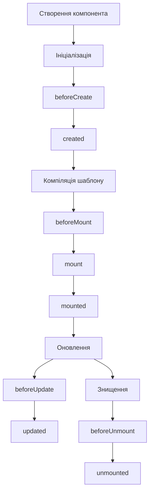
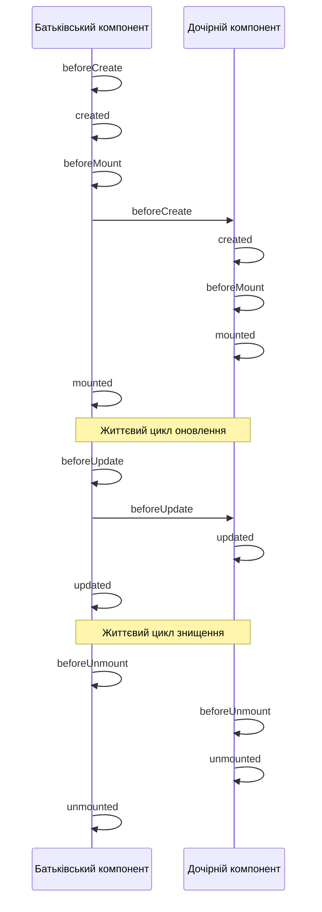

# Vue 3: Життєвий цикл компонентів

## Коротке пояснення

**Життєвий цикл компонента** — це послідовність етапів, через які проходить компонент від створення до видалення. На кожному етапі Vue викликає спеціальні хуки (функції), які дозволяють виконувати код у певні моменти існування компонента. Розуміння життєвого циклу дозволяє ефективно керувати ресурсами, ініціалізувати дані, взаємодіяти з DOM та очищувати ресурси при видаленні компонента.



---

## Огляд життєвого циклу Vue 3

У Vue 3 компонент проходить чотири основні етапи життєвого циклу:

1. **Створення**: Ініціалізація компонента та його реактивного стану
2. **Монтування**: Рендеринг і вставка у DOM
3. **Оновлення**: Реагування на зміни даних і перерендеринг
4. **Знищення**: Видалення з DOM і очищення ресурсів

Для кожного етапу Vue надає хуки життєвого циклу, які можна використовувати в Options API або Composition API.

### Хуки життєвого циклу в Options API та Composition API

| Етап                   | Options API                    | Composition API                    |
| ---------------------- | ------------------------------ | ---------------------------------- |
| Створення              | beforeCreate, created          | setup()                            |
| Монтування             | beforeMount, mounted           | onBeforeMount, onMounted           |
| Оновлення              | beforeUpdate, updated          | onBeforeUpdate, onUpdated          |
| Знищення               | beforeUnmount, unmounted       | onBeforeUnmount, onUnmounted       |
| Обробка помилок        | errorCaptured                  | onErrorCaptured                    |
| Активація (keep-alive) | activated, deactivated         | onActivated, onDeactivated         |
| Відлагодження          | renderTracked, renderTriggered | onRenderTracked, onRenderTriggered |

---

## Детальний опис хуків життєвого циклу

### 1. Етап створення

#### beforeCreate

Викликається синхронно після ініціалізації екземпляра, але до обробки опцій (data, computed, methods тощо).

**Options API:**

```javascript
export default {
    beforeCreate() {
        console.log("beforeCreate хук викликано");
        // this.message ще не доступний
        // this.$el ще не існує
    },
    data() {
        return {
            message: "Привіт",
        };
    },
};
```

**Composition API:**
У Composition API немає прямого еквівалента. Код, який потрібно виконати до ініціалізації реактивності, слід розмістити на початку функції `setup()`.

```javascript
import { ref } from "vue";

export default {
    setup() {
        console.log("setup викликано (аналог beforeCreate і created)");

        // Ініціалізація реактивних даних
        const message = ref("Привіт");

        return {
            message,
        };
    },
};
```

#### created

Викликається після того, як екземпляр завершив обробку всіх опцій, тобто після ініціалізації реактивних даних, обчислюваних властивостей і методів.

**Options API:**

```javascript
export default {
    data() {
        return {
            users: [],
        };
    },
    created() {
        console.log("created хук викликано");
        // Можна отримати доступ до this.users
        // Часто використовується для початкового завантаження даних
        this.fetchUsers();
    },
    methods: {
        async fetchUsers() {
            try {
                const response = await fetch("https://api.example.com/users");
                this.users = await response.json();
            } catch (error) {
                console.error("Помилка завантаження користувачів:", error);
            }
        },
    },
};
```

**Composition API:**
Як і для `beforeCreate`, у Composition API немає прямого еквівалента. Код, який відповідає `created`, розміщується в функції `setup()`.

```javascript
import { ref, onMounted } from "vue";

export default {
    setup() {
        const users = ref([]);

        // Цей код еквівалентний коду у created
        const fetchUsers = async () => {
            try {
                const response = await fetch("https://api.example.com/users");
                users.value = await response.json();
            } catch (error) {
                console.error("Помилка завантаження користувачів:", error);
            }
        };

        // Виклик функції безпосередньо (як у created)
        fetchUsers();

        // Також можна викликати в onMounted, якщо потрібен доступ до DOM

        return {
            users,
        };
    },
};
```

### 2. Етап монтування

#### beforeMount

Викликається безпосередньо перед монтуванням компонента до DOM. Віртуальний DOM вже створено, але ще не вставлено в документ.

**Options API:**

```javascript
export default {
    beforeMount() {
        console.log("beforeMount хук викликано");
        // this.$el існує, але ще не вставлений у документ
        console.log(this.$el); // DOM-елемент, але ще не в документі
    },
};
```

**Composition API:**

```javascript
import { onBeforeMount } from "vue";

export default {
    setup() {
        onBeforeMount(() => {
            console.log("onBeforeMount хук викликано");
            // DOM ще не доступний
        });
    },
};
```

#### mounted

Викликається після того, як компонент був вставлений у DOM. Тут можна отримати доступ до відрендереного DOM-дерева і виконувати операції, що вимагають доступу до DOM.

**Options API:**

```javascript
export default {
    mounted() {
        console.log("mounted хук викликано");
        // this.$el тепер вставлений у документ
        console.log("DOM-елемент доступний:", this.$el);

        // Ініціалізація сторонніх бібліотек, що працюють з DOM
        this.initializeChart();

        // Встановлення обробників подій на рівні документа
        window.addEventListener("resize", this.handleResize);
    },
    beforeUnmount() {
        // Не забудьте видалити глобальні обробники подій
        window.removeEventListener("resize", this.handleResize);
    },
    methods: {
        initializeChart() {
            // Ініціалізація графіка з використанням this.$refs.chart
            if (this.$refs.chart) {
                new Chart(this.$refs.chart, {
                    // налаштування графіка
                });
            }
        },
        handleResize() {
            // Обробка зміни розміру вікна
        },
    },
};
```

**Composition API:**

```javascript
import { ref, onMounted, onBeforeUnmount } from "vue";

export default {
    setup() {
        const chartRef = ref(null);

        const handleResize = () => {
            // Обробка зміни розміру вікна
        };

        onMounted(() => {
            console.log("onMounted хук викликано");
            console.log("DOM-елемент доступний:", chartRef.value);

            // Ініціалізація графіка
            if (chartRef.value) {
                new Chart(chartRef.value, {
                    // налаштування графіка
                });
            }

            // Встановлення обробників подій
            window.addEventListener("resize", handleResize);
        });

        onBeforeUnmount(() => {
            // Видалення обробників подій
            window.removeEventListener("resize", handleResize);
        });

        return {
            chartRef,
        };
    },
};
```

```html
<template>
    <canvas ref="chartRef"></canvas>
</template>
```

### 3. Етап оновлення

#### beforeUpdate

Викликається перед тим, як компонент оновить свій DOM-дерево через зміни в даних. Можна отримати доступ до DOM перед оновленням.

**Options API:**

```javascript
export default {
    data() {
        return {
            count: 0,
        };
    },
    beforeUpdate() {
        console.log("beforeUpdate хук викликано");
        console.log("DOM перед оновленням:", this.$el.textContent);
        console.log("Нове значення count:", this.count);

        // Збереження положення прокрутки перед оновленням
        this.savedScrollPosition = window.scrollY;
    },
};
```

**Composition API:**

```javascript
import { ref, onBeforeUpdate } from "vue";

export default {
    setup() {
        const count = ref(0);
        let savedScrollPosition = 0;

        onBeforeUpdate(() => {
            console.log("onBeforeUpdate хук викликано");
            console.log("Нове значення count:", count.value);

            // Збереження положення прокрутки
            savedScrollPosition = window.scrollY;
        });

        return {
            count,
        };
    },
};
```

#### updated

Викликається після того, як зміни в даних були відображені у DOM. Можна виконувати операції з DOM після його оновлення.

**Options API:**

```javascript
export default {
    data() {
        return {
            items: [],
        };
    },
    updated() {
        console.log("updated хук викликано");
        console.log("DOM після оновлення:", this.$el.textContent);

        // Відновлення позиції прокрутки
        if (this.savedScrollPosition) {
            window.scrollTo(0, this.savedScrollPosition);
        }

        // УВАГА! Будьте обережні зі зміною даних тут,
        // це може призвести до нескінченного циклу оновлень
        // this.items.push('новий елемент') // НЕ РОБІТЬ ТАК!
    },
};
```

**Composition API:**

```javascript
import { ref, onUpdated } from "vue";

export default {
    setup() {
        const items = ref([]);
        let savedScrollPosition = 0;

        onUpdated(() => {
            console.log("onUpdated хук викликано");

            // Відновлення позиції прокрутки
            if (savedScrollPosition) {
                window.scrollTo(0, savedScrollPosition);
            }

            // Будьте обережні зі зміною реактивних даних тут
        });

        return {
            items,
        };
    },
};
```

### 4. Етап знищення

#### beforeUnmount

Викликається безпосередньо перед відмонтуванням і знищенням компонента. Компонент все ще повністю функціональний. Ідеальне місце для очищення ресурсів.

**Options API:**

```javascript
export default {
    data() {
        return {
            intervalId: null,
            subscription: null,
        };
    },
    mounted() {
        // Створення таймера
        this.intervalId = setInterval(() => {
            this.refreshData();
        }, 1000);

        // Підписка на події
        this.subscription = someEventBus.subscribe("event", this.handleEvent);

        // Додавання обробників DOM-подій
        document.addEventListener("click", this.handleDocumentClick);
    },
    beforeUnmount() {
        console.log("beforeUnmount хук викликано");

        // Очищення таймерів
        clearInterval(this.intervalId);

        // Відписка від подій
        this.subscription.unsubscribe();

        // Видалення обробників подій
        document.removeEventListener("click", this.handleDocumentClick);

        // Очищення WebSocket з'єднань
        if (this.ws) {
            this.ws.close();
        }

        // Очищення бібліотек третіх сторін
        if (this.chart) {
            this.chart.destroy();
        }
    },
    methods: {
        refreshData() {
            // Оновлення даних
        },
        handleEvent(data) {
            // Обробка події
        },
        handleDocumentClick(event) {
            // Обробка кліку
        },
    },
};
```

**Composition API:**

```javascript
import { onMounted, onBeforeUnmount } from "vue";

export default {
    setup() {
        let intervalId = null;
        let subscription = null;

        const handleDocumentClick = (event) => {
            // Обробка кліку
        };

        const refreshData = () => {
            // Оновлення даних
        };

        const handleEvent = (data) => {
            // Обробка події
        };

        onMounted(() => {
            // Створення таймера
            intervalId = setInterval(refreshData, 1000);

            // Підписка на події
            subscription = someEventBus.subscribe("event", handleEvent);

            // Додавання обробників DOM-подій
            document.addEventListener("click", handleDocumentClick);
        });

        onBeforeUnmount(() => {
            console.log("onBeforeUnmount хук викликано");

            // Очищення таймерів
            clearInterval(intervalId);

            // Відписка від подій
            subscription.unsubscribe();

            // Видалення обробників подій
            document.removeEventListener("click", handleDocumentClick);
        });
    },
};
```

#### unmounted

Викликається після того, як компонент був відмонтований і знищений. Всі директиви компонента відв'язані, обробники подій видалені, а дочірні компоненти також знищені.

**Options API:**

```javascript
export default {
    unmounted() {
        console.log("unmounted хук викликано");
        // Компонент повністю знищено
        // Можна виконати додаткове логування або телеметрію
    },
};
```

**Composition API:**

```javascript
import { onUnmounted } from "vue";

export default {
    setup() {
        onUnmounted(() => {
            console.log("onUnmounted хук викликано");
            // Компонент повністю знищено
        });
    },
};
```

### 5. Додаткові хуки життєвого циклу

#### errorCaptured

Викликається, коли помилка з будь-якого дочірнього компонента перехоплюється. Отримує помилку, компонент, що викликав помилку, та інформацію про джерело помилки.

**Options API:**

```javascript
export default {
    errorCaptured(error, instance, info) {
        console.log("errorCaptured хук викликано");
        console.error("Перехоплена помилка:", error);
        console.log("Компонент, що викликав помилку:", instance);
        console.log("Інформація про помилку:", info);

        // Відправка помилки в систему моніторингу
        this.errorTrackingService.report(error, {
            componentName: instance.$.type.name,
            info,
        });

        // Показ повідомлення користувачу
        this.showErrorNotification(
            "Сталася помилка. Спробуйте оновити сторінку."
        );

        // Повернення false запобігає поширенню помилки далі вгору
        return false;
    },
};
```

**Composition API:**

```javascript
import { onErrorCaptured } from "vue";

export default {
    setup() {
        const showErrorNotification = (message) => {
            // Показ повідомлення про помилку
        };

        onErrorCaptured((error, instance, info) => {
            console.log("onErrorCaptured хук викликано");
            console.error("Перехоплена помилка:", error);
            console.log("Компонент, що викликав помилку:", instance);
            console.log("Інформація про помилку:", info);

            // Відправка помилки в систему моніторингу
            errorTrackingService.report(error, {
                componentName: instance.type.name,
                info,
            });

            // Показ повідомлення користувачу
            showErrorNotification(
                "Сталася помилка. Спробуйте оновити сторінку."
            );

            // Повернення false запобігає поширенню помилки далі вгору
            return false;
        });
    },
};
```

#### activated і deactivated

Ці хуки викликаються для компонентів, обгорнутих у `<KeepAlive>`. `activated` викликається, коли кешований компонент вставляється в DOM, а `deactivated` — коли він видаляється з DOM, але зберігається в кеші.

**Options API:**

```javascript
export default {
    activated() {
        console.log("activated хук викликано");
        // Компонент знову став видимим
        // Хороше місце для оновлення даних
        this.refreshData();

        // Або відновлення стану
        if (this.savedScrollPosition) {
            this.$el.scrollTop = this.savedScrollPosition;
        }
    },
    deactivated() {
        console.log("deactivated хук викликано");
        // Компонент приховано, але збережено в кеші
        // Хороше місце для збереження стану
        this.savedScrollPosition = this.$el.scrollTop;

        // Або призупинення довгих операцій
        this.pauseVideoPlayback();
    },
};
```

**Composition API:**

```javascript
import { onActivated, onDeactivated, ref } from "vue";

export default {
    setup() {
        let savedScrollPosition = 0;

        const refreshData = () => {
            // Оновлення даних
        };

        const pauseVideoPlayback = () => {
            // Призупинення відтворення відео
        };

        onActivated(() => {
            console.log("onActivated хук викликано");
            // Компонент знову став видимим
            refreshData();

            // Відновлення стану
            if (savedScrollPosition) {
                document.querySelector(".scrollable-container").scrollTop =
                    savedScrollPosition;
            }
        });

        onDeactivated(() => {
            console.log("onDeactivated хук викликано");
            // Компонент приховано, але збережено в кеші
            savedScrollPosition = document.querySelector(
                ".scrollable-container"
            ).scrollTop;

            pauseVideoPlayback();
        });
    },
};
```

Приклад використання з `<KeepAlive>`:

```html
<template>
    <button @click="activeTab = 'Tab1'">Tab 1</button>
    <button @click="activeTab = 'Tab2'">Tab 2</button>

    <KeepAlive>
        <component :is="activeTab"></component>
    </KeepAlive>
</template>

<script>
    import Tab1 from "./Tab1.vue";
    import Tab2 from "./Tab2.vue";

    export default {
        components: {
            Tab1,
            Tab2,
        },
        data() {
            return {
                activeTab: "Tab1",
            };
        },
    };
</script>
```

#### renderTracked і renderTriggered

Ці хуки доступні тільки в режимі розробки і використовуються для відлагодження. `renderTracked` викликається, коли реактивна залежність відстежується рендер-функцією, а `renderTriggered` — коли рендер-функція запускається повторно через зміну залежності.

**Options API:**

```javascript
export default {
    renderTracked(event) {
        console.log("renderTracked хук викликано");
        console.log("Відстежена залежність:", event);
    },
    renderTriggered(event) {
        console.log("renderTriggered хук викликано");
        console.log("Причина повторного рендерингу:", event);
    },
};
```

**Composition API:**

```javascript
import { onRenderTracked, onRenderTriggered } from "vue";

export default {
    setup() {
        onRenderTracked((event) => {
            console.log("onRenderTracked хук викликано");
            console.log("Відстежена залежність:", event);
        });

        onRenderTriggered((event) => {
            console.log("onRenderTriggered хук викликано");
            console.log("Причина повторного рендерингу:", event);
        });
    },
};
```

---

## Порядок виконання хуків життєвого циклу

Хуки життєвого циклу викликаються у певному порядку:

1. `beforeCreate`
2. `created`
3. `beforeMount`
4. `mounted`
5. `beforeUpdate` (за потреби, може викликатися багато разів)
6. `updated` (за потреби, може викликатися багато разів)
7. `beforeUnmount`
8. `unmounted`

Для компонентів з `<KeepAlive>`:

-   Перше рендерення: `beforeCreate`, `created`, `beforeMount`, `mounted`, `activated`
-   При деактивації: `deactivated`
-   При повторній активації: `activated`
-   При повному знищенні: `beforeUnmount`, `deactivated`, `unmounted`

### Порядок виконання хуків у компонентах з батьківсько-дочірніми відносинами

Порядок виконання хуків у компонентах з батьківсько-дочірніми відносинами слідує принципу "зверху вниз, знизу вгору":

-   Хуки створення і монтування: спочатку батьківський, потім дочірній
-   Хуки знищення: спочатку дочірній, потім батьківський



Наприклад:

```
// Монтування
Батьківський beforeCreate
Батьківський created
Батьківський beforeMount
  Дочірній beforeCreate
  Дочірній created
  Дочірній beforeMount
  Дочірній mounted
Батьківський mounted

// Знищення
Батьківський beforeUnmount
  Дочірній beforeUnmount
  Дочірній unmounted
Батьківський unmounted
```

---

## Підкапотні механізми

### Як Vue реалізує життєвий цикл

1. **Етап створення**:

    - Vue створює екземпляр компонента, встановлює початкові властивості
    - Ініціалізує систему реактивності для даних і обчислюваних властивостей
    - Викликає хуки `beforeCreate` і `created`

2. **Етап монтування**:

    - Vue компілює шаблон у рендер-функцію (якщо ще не скомпільовано)
    - Виконує рендер-функцію для створення віртуального DOM
    - Викликає хук `beforeMount`
    - Конвертує віртуальний DOM у реальний DOM і вставляє у документ
    - Викликає хук `mounted`

3. **Етап оновлення**:

    - При зміні реактивних даних Vue позначає компонент як "брудний"
    - У наступному циклі мікрозадач (microtask) Vue перевіряє, які компоненти потрібно оновити
    - Для кожного "брудного" компонента:
        - Викликає хук `beforeUpdate`
        - Виконує рендер-функцію для створення нового віртуального DOM
        - Виконує алгоритм порівняння (diff) між старим і новим віртуальним DOM
        - Застосовує мінімально необхідні зміни до реального DOM
        - Викликає хук `updated`

4. **Етап знищення**:
    - Коли компонент потрібно видалити (наприклад, через зміну `v-if` або видалення батьківського елемента):
        - Викликає хук `beforeUnmount`
        - Видаляє всі директиви і обробники подій
        - Від'єднує компонент від батьківського компонента
        - Видаляє DOM-елементи
        - Викликає хук `unmounted`

### Технічні деталі роботи хуків життєвого циклу

-   **Реєстрація хуків**: Кожен хук життєвого циклу додається до внутрішнього масиву хуків компонента
-   **Виклик хуків**: Vue викликає всі функції з відповідного масиву хуків послідовно
-   **Контекст виконання**: У Options API хуки життєвого циклу прив'язані до екземпляра компонента (`this`)
-   **Асинхронність**: Хуки життєвого циклу виконуються синхронно, але вони можуть містити асинхронний код

### Реактивність і життєвий цикл

-   Vue використовує систему реактивності для відстеження змін у даних і автоматичного запуску оновлень
-   У Options API Vue автоматично робить властивості в `data` реактивними
-   У Composition API розробник явно вказує, які значення мають бути реактивними, використовуючи `ref()` і `reactive()`
-   Зміни в реактивних даних призводять до повторного виконання рендер-функції компонента і запуску хуків оновлення

---

## Підводні камені та обмеження

### 1. Помилки при роботі з DOM

```javascript
export default {
    // ❌ Неправильно: DOM ще не існує
    created() {
        document.getElementById("my-element").innerText = "Новий текст"; // Помилка!
    },

    // ✅ Правильно: DOM вже існує
    mounted() {
        document.getElementById("my-element").innerText = "Новий текст";
    },
};
```

### 2. Безкінечні цикли оновлень

```javascript
export default {
    data() {
        return { count: 0 };
    },
    // ❌ Неправильно: створює безкінечний цикл
    updated() {
        this.count++; // Викликає нове оновлення, яке знову викликає updated
    },
};
```

### 3. Витоки пам'яті через незакриті слухачі

```javascript
export default {
    mounted() {
        window.addEventListener("resize", this.handleResize);
    },
    // ❌ Неправильно: слухач не видалено
    // beforeUnmount() {
    //   // Забули видалити обробник
    // }

    // ✅ Правильно: очищення ресурсів
    beforeUnmount() {
        window.removeEventListener("resize", this.handleResize);
    },
};
```

### 4. Асинхронні операції і хуки життєвого циклу

Будьте обережні з асинхронними операціями у хуках життєвого циклу:

```javascript
export default {
    async mounted() {
        // ❌ Неправильно: компонент може бути знищено до завершення асинхронної операції
        const result = await fetchData();
        this.data = result; // Може викликати помилку, якщо компонент вже знищено
    },
};
```

Краще використовувати перевірку на монтування:

```javascript
export default {
    data() {
        return {
            isMounted: false,
        };
    },
    async mounted() {
        this.isMounted = true;
        const result = await fetchData();
        // ✅ Правильно: перевірка, чи компонент все ще змонтований
        if (this.isMounted) {
            this.data = result;
        }
    },
    beforeUnmount() {
        this.isMounted = false;
    },
};
```

У Composition API:

```javascript
import { ref, onMounted, onBeforeUnmount } from "vue";

export default {
    setup() {
        const isMounted = ref(false);

        onMounted(async () => {
            isMounted.value = true;
            const result = await fetchData();
            if (isMounted.value) {
                // Оновлюємо дані, тільки якщо компонент все ще змонтований
            }
        });

        onBeforeUnmount(() => {
            isMounted.value = false;
        });
    },
};
```

### 5. Взаємодія між хуками у різних компонентах

У складних додатках хуки життєвого циклу різних компонентів можуть взаємодіяти непередбачуваним чином:

```javascript
// Батьківський компонент
export default {
  data() {
    return { show: true }
  },
  mounted() {
    // ❌ Неправильно: дочірній компонент ще не повністю ініціалізований
    this.$refs.child.loadData()
  }
}

// Дочірній компонент
export default {
  methods: {
    loadData() {
      // Метод викликається занадто рано
    }
  }
}
```

Використовуйте події для синхронізації:

```javascript
// Батьківський компонент
export default {
  mounted() {
    // ✅ Правильно: дочірній компонент сповістить, коли буде готовий
    this.$once('child-ready', this.onChildReady)
  },
  methods: {
    onChildReady() {
      this.$refs.child.loadData()
    }
  }
}

// Дочірній компонент
export default {
  mounted() {
    this.$emit('child-ready')
  }
}
```

### 6. Хуки життєвого циклу і асинхронні компоненти

Будьте обережні з хуками життєвого циклу в асинхронних компонентах:

```javascript
const AsyncComponent = defineAsyncComponent(() =>
    import("./AsyncComponent.vue")
);
```

Асинхронні компоненти завантажуються лише коли потрібні, тому їхні хуки життєвого циклу викликаються пізніше, ніж у звичайних компонентів.

---

## Оптимізація

### 1. Правильне розміщення коду

Розміщуйте код у відповідних хуках, залежно від його призначення:

```javascript
export default {
    // ✅ Початкова ініціалізація даних, що не залежать від DOM
    created() {
        this.initializeData();
    },

    // ✅ Взаємодія з DOM, ініціалізація бібліотек
    mounted() {
        this.initializeChart();
        this.setupEventListeners();
    },

    // ✅ Оновлення зовнішніх систем після зміни даних
    updated() {
        this.updateExternalSystems();
    },

    // ✅ Очищення ресурсів
    beforeUnmount() {
        this.cleanupResources();
    },
};
```

### 2. Використання nextTick для операцій після оновлення DOM

```javascript
export default {
    methods: {
        updateData() {
            this.data = newData;

            // ✅ Код виконається після оновлення DOM
            this.$nextTick(() => {
                // Тепер DOM оновлено і відображає нові дані
                this.scrollToNewElement();
            });
        },
    },
};
```

У Composition API:

```javascript
import { ref, nextTick } from "vue";

export default {
    setup() {
        const data = ref([]);

        const updateData = async (newData) => {
            data.value = newData;

            // Чекаємо оновлення DOM
            await nextTick();
            // Тепер DOM оновлено
            scrollToNewElement();
        };

        return {
            data,
            updateData,
        };
    },
};
```

### 3. Кешування важких обчислень

```javascript
export default {
    data() {
        return {
            items: [],
            cachedResults: null,
            lastQueryParams: null,
        };
    },
    methods: {
        fetchData(queryParams) {
            // Кешування результатів запитів
            const paramsKey = JSON.stringify(queryParams);

            if (this.lastQueryParams === paramsKey && this.cachedResults) {
                return this.cachedResults;
            }

            // Виконуємо запит, якщо немає в кеші
            const results = performHeavyComputation(queryParams);

            // Зберігаємо в кеші
            this.cachedResults = results;
            this.lastQueryParams = paramsKey;

            return results;
        },
    },
};
```

### 4. Умовне виконання коду в хуках життєвого циклу

```javascript
export default {
    mounted() {
        // Виконуємо важкі операції тільки якщо вони потрібні
        if (this.shouldInitializeChart) {
            this.initializeChart();
        }

        // Навішуємо глобальні обробники подій тільки в певних умовах
        if (this.needsGlobalListeners) {
            window.addEventListener("resize", this.handleResize);
        }
    },
};
```

### 5. Використання `v-once` для статичного контенту

```html
<template>
    <!-- Цей блок буде рендеритися тільки один раз -->
    <div v-once>
        <h1>{{ staticTitle }}</h1>
        <p>{{ staticDescription }}</p>
    </div>

    <!-- Цей блок буде оновлюватися при зміні даних -->
    <div>
        <p>{{ dynamicData }}</p>
    </div>
</template>
```

### 6. Оптимізація з keepAlive

```html
<template>
    <KeepAlive :include="['HeavyComponent']" :max="5">
        <component :is="currentComponent"></component>
    </KeepAlive>
</template>
```

```javascript
export default {
    name: "HeavyComponent",
    data() {
        return {
            heavyData: null,
        };
    },
    activated() {
        // Цей хук викликається, коли компонент знову стає видимим
        // Відновлюємо стан або оновлюємо дані, якщо потрібно
        if (this.needsRefresh) {
            this.refreshData();
        }
    },
    deactivated() {
        // Цей хук викликається, коли компонент приховується, але зберігається в кеші
        // Зберігаємо стан або призупиняємо важкі обчислення
        this.saveComponentState();
    },
};
```

---

## Практичний приклад використання хуків життєвого циклу

Розглянемо приклад компонента з графіком, що відображає дані в реальному часі:

```html
<!-- RealTimeChart.vue -->
<template>
    <div class="chart-container">
        <div v-if="loading" class="loading-overlay">
            <spinner-component />
        </div>

        <div v-if="error" class="error-message">
            {{ error }}
            <button @click="retryLoading">Спробувати знову</button>
        </div>

        <canvas ref="chartCanvas" :width="width" :height="height"></canvas>

        <div class="chart-controls">
            <button @click="startDataStream">Почати</button>
            <button @click="stopDataStream">Зупинити</button>
            <button @click="resetChart">Скинути</button>
        </div>
    </div>
</template>

<script>
    import { Chart } from "chart.js";
    import SpinnerComponent from "./SpinnerComponent.vue";

    export default {
        name: "RealTimeChart",
        components: {
            SpinnerComponent,
        },
        props: {
            dataUrl: {
                type: String,
                required: true,
            },
            width: {
                type: Number,
                default: 600,
            },
            height: {
                type: Number,
                default: 400,
            },
        },
        data() {
            return {
                chart: null,
                chartData: [],
                dataStream: null,
                loading: true,
                error: null,
                isComponentMounted: false,
            };
        },
        // Хуки життєвого циклу
        async created() {
            // Виконуємо початкове завантаження даних
            try {
                this.chartData = await this.fetchInitialData();
            } catch (error) {
                this.error = `Помилка завантаження даних: ${error.message}`;
                console.error(
                    "Помилка при завантаженні початкових даних",
                    error
                );
            }
        },
        mounted() {
            this.isComponentMounted = true;

            // Ініціалізація графіка
            this.initializeChart();

            // Додаємо обробник зміни розміру вікна
            window.addEventListener("resize", this.handleResize);

            // Автоматично запускаємо потік даних, якщо немає помилок
            if (!this.error) {
                this.startDataStream();
            }

            // Компонент повністю готовий
            this.$emit("chart-ready");
            this.loading = false;
        },
        beforeUpdate() {
            // Перед оновленням DOM
            console.log("Оновлення графіка з новими даними");
        },
        updated() {
            // Після оновлення DOM
            if (this.chart && this.chartData.length > 0) {
                this.updateChartDisplay();
            }
        },
        beforeUnmount() {
            // Зупиняємо потік даних
            this.stopDataStream();

            // Видаляємо обробник зміни розміру вікна
            window.removeEventListener("resize", this.handleResize);

            // Знищуємо екземпляр графіка
            if (this.chart) {
                this.chart.destroy();
                this.chart = null;
            }

            this.isComponentMounted = false;
        },
        unmounted() {
            console.log("Компонент графіка знищено");
        },
        // Методи компонента
        methods: {
            // Ініціалізація графіка
            initializeChart() {
                const ctx = this.$refs.chartCanvas.getContext("2d");

                this.chart = new Chart(ctx, {
                    type: "line",
                    data: {
                        labels: this.chartData.map((point) => point.label),
                        datasets: [
                            {
                                label: "Дані в реальному часі",
                                data: this.chartData.map(
                                    (point) => point.value
                                ),
                                borderColor: "rgb(75, 192, 192)",
                                tension: 0.1,
                            },
                        ],
                    },
                    options: {
                        responsive: true,
                        maintainAspectRatio: false,
                        animation: {
                            duration: 0, // Для кращої продуктивності в режимі реального часу
                        },
                    },
                });
            },

            // Оновлення відображення графіка
            updateChartDisplay() {
                if (!this.chart) return;

                this.chart.data.labels = this.chartData.map(
                    (point) => point.label
                );
                this.chart.data.datasets[0].data = this.chartData.map(
                    (point) => point.value
                );
                this.chart.update();
            },

            // Завантаження початкових даних
            async fetchInitialData() {
                const response = await fetch(`${this.dataUrl}/initial`);

                if (!response.ok) {
                    throw new Error(`HTTP помилка! статус: ${response.status}`);
                }

                return await response.json();
            },

            // Запуск потоку даних в реальному часі
            startDataStream() {
                if (this.dataStream) return;

                // Імітація потоку даних (в реальному додатку це може бути WebSocket)
                this.dataStream = setInterval(async () => {
                    try {
                        const response = await fetch(`${this.dataUrl}/stream`);
                        const newData = await response.json();

                        // Додаємо нові дані і видаляємо старі, якщо їх забагато
                        this.chartData.push(newData);
                        if (this.chartData.length > 50) {
                            this.chartData.shift();
                        }

                        // Оновлюємо графік
                        this.updateChartDisplay();

                        // Сповіщаємо батьківський компонент про нові дані
                        this.$emit("data-updated", this.chartData);
                    } catch (error) {
                        console.error(
                            "Помилка при отриманні нових даних",
                            error
                        );
                        this.error = `Помилка оновлення даних: ${error.message}`;
                        this.stopDataStream();
                    }
                }, 1000);
            },

            // Зупинка потоку даних
            stopDataStream() {
                if (this.dataStream) {
                    clearInterval(this.dataStream);
                    this.dataStream = null;
                }
            },

            // Скидання графіка
            resetChart() {
                this.chartData = [];
                this.updateChartDisplay();
            },

            // Обробка зміни розміру вікна
            handleResize() {
                if (this.chart) {
                    this.chart.resize();
                }
            },

            // Повторна спроба завантаження при помилці
            async retryLoading() {
                this.loading = true;
                this.error = null;

                try {
                    this.chartData = await this.fetchInitialData();

                    // Ініціалізуємо графік заново, якщо його ще немає
                    if (!this.chart && this.isComponentMounted) {
                        this.initializeChart();
                    } else if (this.chart) {
                        this.updateChartDisplay();
                    }

                    // Запускаємо потік даних
                    this.startDataStream();
                } catch (error) {
                    this.error = `Помилка завантаження даних: ${error.message}`;
                } finally {
                    this.loading = false;
                }
            },
        },
    };
</script>

<style scoped>
    .chart-container {
        position: relative;
        width: 100%;
        height: 100%;
        min-height: 400px;
    }

    .loading-overlay {
        position: absolute;
        top: 0;
        left: 0;
        width: 100%;
        height: 100%;
        background-color: rgba(255, 255, 255, 0.7);
        display: flex;
        justify-content: center;
        align-items: center;
        z-index: 10;
    }

    .error-message {
        color: red;
        padding: 20px;
        text-align: center;
    }

    .chart-controls {
        margin-top: 10px;
        display: flex;
        justify-content: center;
        gap: 10px;
    }

    button {
        padding: 8px 16px;
        background-color: #4caf50;
        color: white;
        border: none;
        border-radius: 4px;
        cursor: pointer;
    }

    button:hover {
        background-color: #45a049;
    }
</style>
```

В цьому прикладі:

1. У `created` ми завантажуємо початкові дані для графіка.
2. У `mounted` ми ініціалізуємо сам графік, який потребує доступу до DOM.
3. У `beforeUpdate` і `updated` ми логуємо і оновлюємо графік при зміні даних.
4. У `beforeUnmount` ми виконуємо очищення ресурсів: зупиняємо потік даних, видаляємо обробники подій, знищуємо графік.
5. Ми використовуємо прапорець `isComponentMounted` для відстеження стану компонента і уникнення проблем з асинхронними операціями.

Цей приклад демонструє, як правильно використовувати хуки життєвого циклу для ініціалізації, оновлення і очищення ресурсів у компоненті Vue.

---

## Висновок

Хуки життєвого циклу — це потужний інструмент, який дозволяє розробникам виконувати код на певних етапах існування компонента. Розуміння життєвого циклу Vue і правильне використання хуків необхідне для створення ефективних і надійних компонентів.

Основні принципи використання хуків життєвого циклу:

1. **Використовуйте правильний хук для конкретного завдання**:

    - `created` для ініціалізації даних і початкових запитів
    - `mounted` для взаємодії з DOM і ініціалізації сторонніх бібліотек
    - `updated` для реагування на зміни даних
    - `beforeUnmount` для очищення ресурсів

2. **Уникайте поширених помилок**:

    - Не намагайтеся отримати доступ до DOM до хука `mounted`
    - Уникайте зміни стану в хуках `updated`, щоб не створювати безкінечні цикли
    - Завжди очищуйте ресурси в хуку `beforeUnmount`
    - Будьте обережні з асинхронними операціями в хуках життєвого циклу

3. **Оптимізуйте роботу компонентів**:
    - Використовуйте `nextTick` для операцій після оновлення DOM
    - Кешуйте результати важких обчислень
    - Умовно виконуйте код в хуках життєвого циклу
    - Використовуйте `KeepAlive` для кешування компонентів, що часто перемикаються

Добре розуміння життєвого циклу компонентів Vue дозволяє створювати більш передбачувані, ефективні та легкі в підтримці додатки.
