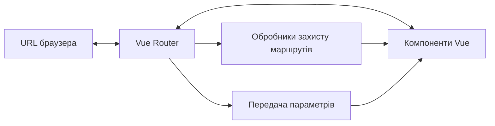

# Vue 3: Vue Router

## Коротке пояснення

**Vue Router** — це офіційна бібліотека маршрутизації для Vue.js, яка дозволяє створювати односторінкові додатки (SPA) з багатьма маршрутами. Vue Router синхронізує URL браузера з відповідними компонентами, дозволяючи навігацію між "сторінками" без перезавантаження, при цьому підтримуючи історію браузера і забезпечуючи додаткові функції як захист маршрутів, вкладені маршрути та переходи.



---

## Основи Vue Router

### Встановлення та налаштування

```bash
# Встановлення через npm
npm install vue-router@4
```

**Основна конфігурація:**

```javascript
// router/index.js
import { createRouter, createWebHistory } from "vue-router";
import Home from "../views/Home.vue";
import About from "../views/About.vue";

const routes = [
    {
        path: "/",
        name: "Home",
        component: Home,
    },
    {
        path: "/about",
        name: "About",
        component: About,
    },
];

const router = createRouter({
    history: createWebHistory(),
    routes,
});

export default router;
```

**Підключення до додатку:**

```javascript
// main.js
import { createApp } from "vue";
import App from "./App.vue";
import router from "./router";

const app = createApp(App);
app.use(router);
app.mount("#app");
```

**Базова розмітка:**

```html
<template>
    <div>
        <nav>
            <router-link to="/">Головна</router-link>
            <router-link to="/about">Про нас</router-link>
        </nav>

        <!-- Компонент, що відповідає поточному маршруту -->
        <router-view></router-view>
    </div>
</template>
```

---

## Маршрути та їх конфігурація

### Типи шляхів (path)

1. **Статичний шлях**: `/users`
2. **Динамічний шлях з параметром**: `/users/:id`
3. **Необов'язковий параметр**: `/users/:id?`
4. **Регулярний вираз**: `/users/:id(\\d+)`
5. **Багатосегментний параметр**: `/files/*`

```javascript
const routes = [
    { path: "/users", component: UserList },
    { path: "/users/:id", component: UserDetail },
    { path: "/optional/:param?", component: Optional },
    { path: "/numbers/:id(\\d+)", component: NumbersOnly },
    { path: "/files/*", component: FileSystem },
];
```

### Іменовані маршрути

```javascript
const routes = [
    {
        path: "/user/:id",
        name: "user",
        component: User,
    },
];
```

```html
<router-link :to="{ name: 'user', params: { id: 123 }}">Користувач</router-link>
```

### Вкладені маршрути

```javascript
const routes = [
    {
        path: "/user/:id",
        component: User,
        children: [
            { path: "", component: UserHome },
            { path: "profile", component: UserProfile },
            { path: "posts", component: UserPosts },
        ],
    },
];
```

```html
<div>
    <h2>Користувач {{ $route.params.id }}</h2>
    <router-view></router-view>
</div>
```

### Перенаправлення і псевдоніми

```javascript
const routes = [
    // Перенаправлення
    { path: "/old-path", redirect: "/new-path" },
    {
        path: "/old-path/:id",
        redirect: (to) => {
            return { path: "/new-path", query: { id: to.params.id } };
        },
    },

    // Псевдонім (аліас)
    { path: "/main", component: Home, alias: ["/home", "/homepage"] },
];
```

### Передача параметрів

**Через параметри шляху:**

```javascript
// Маршрут: /user/:id
const route = useRoute();
const userId = route.params.id;
```

**Через query параметри:**

```javascript
// Маршрут: /search?query=vue&sort=desc
const route = useRoute();
const searchQuery = route.query.query;
const sortOrder = route.query.sort;
```

**Через props:**

```javascript
const routes = [
    {
        path: "/user/:id",
        component: User,
        props: true, // передача params як props
    },
    {
        path: "/search",
        component: SearchResults,
        props: (route) => ({ query: route.query.q }), // функція для перетворення
    },
];
```

```javascript
// User.vue
export default {
    props: ["id"], // отримання id напряму через props
    setup(props) {
        console.log(props.id);
    },
};
```

### Обробка невідомих маршрутів (404)

```javascript
const routes = [
    // ... інші маршрути

    // Має бути останнім у масиві
    { path: "/:pathMatch(.*)*", name: "NotFound", component: NotFound },
];
```

---

## Навігація

### Декларативна навігація через `<router-link>`

```html
<!-- Базове використання -->
<router-link to="/home">Головна</router-link>

<!-- Динамічний шлях -->
<router-link :to="`/user/${userId}`">Профіль</router-link>

<!-- Об'єкт маршруту -->
<router-link :to="{ name: 'user', params: { id: userId }}">Профіль</router-link>

<!-- З query параметрами -->
<router-link :to="{ path: '/search', query: { q: searchQuery }}"
    >Пошук</router-link
>

<!-- Заміна історії замість додавання -->
<router-link :to="{ path: '/home' }" replace>Головна</router-link>

<!-- Активний клас -->
<router-link to="/home" active-class="active">Головна</router-link>

<!-- Точний активний клас (тільки повний збіг) -->
<router-link to="/home" exact-active-class="exact-active">Головна</router-link>
```

### Програмна навігація через Router API

**Options API:**

```javascript
export default {
    methods: {
        goToHome() {
            this.$router.push("/home");
        },
        goToUser(id) {
            this.$router.push({ name: "user", params: { id } });
        },
        goToSearch(query) {
            this.$router.push({ path: "/search", query: { q: query } });
        },
        goBack() {
            this.$router.go(-1);
        },
        goForward() {
            this.$router.go(1);
        },
        replaceRoute() {
            this.$router.replace("/new-page");
        },
    },
};
```

**Composition API:**

```javascript
import { useRouter } from "vue-router";

export default {
    setup() {
        const router = useRouter();

        function goToHome() {
            router.push("/home");
        }

        function goToUser(id) {
            router.push({ name: "user", params: { id } });
        }

        function goToSearch(query) {
            router.push({ path: "/search", query: { q: query } });
        }

        function goBack() {
            router.go(-1);
        }

        function replaceRoute() {
            router.replace("/new-page");
        }

        return {
            goToHome,
            goToUser,
            goToSearch,
            goBack,
            replaceRoute,
        };
    },
};
```

### Обробка подій навігації

```javascript
router
    .push("/user/123")
    .then(() => {
        // Навігація завершена успішно
        console.log("Навігація завершена");
    })
    .catch((error) => {
        if (error.name === "NavigationDuplicated") {
            // Ігнорувати помилки дублювання навігації
        } else {
            // Інша помилка
            console.error(error);
        }
    });
```

---

## Guards (Захисники маршрутів)

### Глобальні guards

**beforeEach** — викликається перед кожною навігацією:

```javascript
router.beforeEach((to, from, next) => {
    // Перевірка авторизації
    if (to.meta.requiresAuth && !isAuthenticated()) {
        // Перенаправлення на сторінку логіну, якщо не авторизований
        next({ name: "login", query: { redirect: to.fullPath } });
    } else {
        // Продовження навігації
        next();
    }
});
```

**afterEach** — викликається після завершення навігації:

```javascript
router.afterEach((to, from) => {
    // Аналітика або логування
    sendToAnalytics(to.fullPath);

    // Зміна заголовка сторінки
    document.title = to.meta.title || "Мій додаток";
});
```

**beforeResolve** — викликається після того, як усі компоненти маршруту готові:

```javascript
router.beforeResolve(async (to, from, next) => {
    try {
        // Завантаження даних перед показом маршруту
        await loadAsyncData(to);
        next();
    } catch (error) {
        next(error);
    }
});
```

### Guards на рівні маршрутів

```javascript
const routes = [
    {
        path: "/admin",
        component: Admin,
        beforeEnter: (to, from, next) => {
            // Перевірка ролі користувача
            if (hasAdminRole()) {
                next();
            } else {
                next("/access-denied");
            }
        },
    },
];
```

### Guards на рівні компонентів

**Options API:**

```javascript
export default {
    beforeRouteEnter(to, from, next) {
        // Викликається до створення компонента
        // Немає доступу до 'this'
        fetchData(to.params.id).then((data) => {
            // Передача даних у компонент через callback
            next((vm) => {
                vm.data = data;
            });
        });
    },

    beforeRouteUpdate(to, from, next) {
        // Викликається при зміні параметрів маршруту
        // Компонент вже створений, є доступ до 'this'
        this.loading = true;
        fetchData(to.params.id).then((data) => {
            this.data = data;
            this.loading = false;
            next();
        });
    },

    beforeRouteLeave(to, from, next) {
        // Викликається перед виходом з маршруту
        // Можна запобігти виходу
        if (this.hasUnsavedChanges) {
            const confirm = window.confirm(
                "У вас є незбережені зміни. Продовжити?"
            );
            if (confirm) {
                next();
            } else {
                next(false);
            }
        } else {
            next();
        }
    },
};
```

**Composition API:**

```javascript
import { onBeforeRouteLeave, onBeforeRouteUpdate } from "vue-router";
import { ref } from "vue";

export default {
    setup() {
        const hasUnsavedChanges = ref(false);
        const data = ref(null);
        const loading = ref(false);

        onBeforeRouteUpdate(async (to, from, next) => {
            loading.value = true;
            try {
                data.value = await fetchData(to.params.id);
                loading.value = false;
                next();
            } catch (error) {
                loading.value = false;
                next(error);
            }
        });

        onBeforeRouteLeave((to, from, next) => {
            if (hasUnsavedChanges.value) {
                const confirm = window.confirm(
                    "У вас є незбережені зміни. Продовжити?"
                );
                if (confirm) {
                    next();
                } else {
                    next(false);
                }
            } else {
                next();
            }
        });

        return {
            hasUnsavedChanges,
            data,
            loading,
        };
    },
};
```

### Порядок виконання guards

1. Глобальний beforeEach
2. beforeEnter маршруту, що виходить з компонента (якщо виконується оновлення)
3. beforeRouteUpdate у компоненті, що перевикористовується (якщо маршрут оновлюється)
4. beforeEnter нового маршруту
5. Обробка асинхронних компонентів
6. beforeRouteEnter у компонентах нового маршруту
7. Глобальний beforeResolve
8. Навігація підтверджена
9. Глобальний afterEach
10. Оновлення DOM
11. Виклик коллбеків у beforeRouteEnter

---

## Ледаче завантаження маршрутів

### Асинхронні компоненти

```javascript
// Ледаче завантаження компонентів для оптимізації розміру бандлу
const routes = [
    {
        path: "/user/:id",
        name: "user",
        component: () => import("../views/User.vue"),
    },
    {
        path: "/admin",
        name: "admin",
        component: () => import("../views/Admin.vue"),
    },
];
```

### Групування компонентів

```javascript
// Групування компонентів адмін-панелі в один чанк
const routes = [
    {
        path: "/admin",
        component: () =>
            import(/* webpackChunkName: "admin" */ "../views/Admin.vue"),
        children: [
            {
                path: "dashboard",
                component: () =>
                    import(
                        /* webpackChunkName: "admin" */ "../views/AdminDashboard.vue"
                    ),
            },
            {
                path: "users",
                component: () =>
                    import(
                        /* webpackChunkName: "admin" */ "../views/AdminUsers.vue"
                    ),
            },
        ],
    },
];
```

---

## Метадані маршрутів

```javascript
const routes = [
    {
        path: "/private",
        component: PrivatePage,
        meta: {
            requiresAuth: true,
            roles: ["admin", "editor"],
            title: "Приватна сторінка",
            transitionName: "fade",
        },
    },
];
```

```javascript
// Використання метаданих у guard
router.beforeEach((to, from, next) => {
    document.title = to.meta.title || "Мій додаток";

    const userRoles = getUserRoles();

    if (to.meta.requiresAuth) {
        if (!isAuthenticated()) {
            next("/login");
        } else if (
            to.meta.roles &&
            !to.meta.roles.some((role) => userRoles.includes(role))
        ) {
            next("/forbidden");
        } else {
            next();
        }
    } else {
        next();
    }
});
```

---

## Підкапотні механізми

### Як працює Vue Router

1. **Ініціалізація:**

    - Створення екземпляра Router
    - Реєстрація всіх маршрутів
    - Підключення до екземпляра Vue

2. **Обробка URL:**

    - Розбір URL на базовий шлях і query параметри
    - Зіставлення з зареєстрованими маршрутами
    - Визначення компонентів для рендерингу

3. **Запуск навігації:**

    - Послідовне виконання guards
    - Підготовка нових компонентів до рендерингу
    - Оновлення URL у браузері

4. **Рендеринг:**
    - Оновлення компонентів у `<router-view>`
    - Оновлення активних класів у `<router-link>`

### Режими історії

Vue Router підтримує три режими історії:

1. **HTML5 Mode (`createWebHistory`):**
    - Використовує History API браузера
    - Чисті URL без хешів
    - Потребує налаштування серверу для перенаправлення запитів на index.html

```javascript
import { createRouter, createWebHistory } from "vue-router";

const router = createRouter({
    history: createWebHistory(),
    routes: [
        /*...*/
    ],
});
```

2. **Hash Mode (`createWebHashHistory`):**
    - Використовує хеш у URL (#)
    - Не потребує налаштування серверу
    - Працює на старих браузерах

```javascript
import { createRouter, createWebHashHistory } from "vue-router";

const router = createRouter({
    history: createWebHashHistory(),
    routes: [
        /*...*/
    ],
});
```

3. **Memory Mode (`createMemoryHistory`):**
    - Зберігає історію в пам'яті
    - Корисно для тестування або SSR
    - URL не змінюється

```javascript
import { createRouter, createMemoryHistory } from "vue-router";

const router = createRouter({
    history: createMemoryHistory(),
    routes: [
        /*...*/
    ],
});
```

### Внутрішня структура маршрутизатора

Vue Router складається з кількох ключових компонентів:

1. **Matcher** — відповідає за зіставлення URL з маршрутами
2. **History** — взаємодіє з історією браузера
3. **Router** — координує роботу Matcher і History, відповідає за виконання guards
4. **RouterLink** — компонент для декларативної навігації
5. **RouterView** — компонент для рендерингу відповідних компонентів

### Процес вирішення маршруту

1. Отримання поточного URL
2. Нормалізація URL (видалення дублюючих слешів, обробка кодування)
3. Пошук відповідного маршруту в зареєстрованих маршрутах
4. Розбір параметрів маршруту
5. Створення об'єкта Route з інформацією про маршрут
6. Виконання ланцюжка guards
7. Зміна URL браузера, якщо необхідно
8. Оновлення компонентів для відображення

---

## Підводні камені та обмеження

### Використання параметрів

```javascript
// ❌ Неправильно
watch: {
  '$route.params.id'() {
    // Оновлення даних при зміні параметру
    this.fetchData()
  }
}

// ✅ Правильно
beforeRouteUpdate(to, from, next) {
  this.fetchData(to.params.id)
  next()
}
```

### Спільний стан між маршрутами

```javascript
// ❌ Неправильно: дані будуть перезаписані при навігації
export default {
  data() {
    return {
      items: []
    }
  },
  created() {
    this.fetchItems()
  }
}

// ✅ Правильно: використання Vuex або Pinia для спільного стану
import { useStore } from 'vuex'

export default {
  setup() {
    const store = useStore()

    // Завантаження даних тільки якщо їх ще немає
    if (store.state.items.length === 0) {
      store.dispatch('fetchItems')
    }
  }
}
```

### Проблеми з кешуванням компонентів

```javascript
// ❌ Компонент не оновлюється при зміні параметрів маршруту
<router-view />

// ✅ Примусове перестворення компонента при зміні ключа
<router-view :key="$route.fullPath" />
```

### Обробка прокрутки

```javascript
const router = createRouter({
    history: createWebHistory(),
    routes: [
        /*...*/
    ],
    scrollBehavior(to, from, savedPosition) {
        // Повернення до збереженої позиції при використанні кнопок вперед/назад
        if (savedPosition) {
            return savedPosition;
        }

        // Прокрутка до елемента, якщо вказано хеш
        if (to.hash) {
            return {
                el: to.hash,
                behavior: "smooth",
            };
        }

        // Прокрутка догори для нових сторінок
        return { top: 0 };
    },
});
```

---

## Оптимізація

### Зменшення розміру бандлу

```javascript
// Розділення коду за маршрутами
const routes = [
    {
        path: "/admin",
        component: () => import("../views/Admin.vue"),
    },
];
```

### Передзавантаження маршрутів

```javascript
// Передзавантаження маршруту при наведенні
<router-link
  to="/user"
  @mouseenter="() => import('../views/User.vue')"
>
  Користувач
</router-link>
```

### Кешування результатів запитів

```javascript
const cache = new Map();

function fetchWithCache(url) {
    if (cache.has(url)) {
        return Promise.resolve(cache.get(url));
    }

    return fetch(url)
        .then((res) => res.json())
        .then((data) => {
            cache.set(url, data);
            return data;
        });
}
```

### Запобігання повторним навігаціям

```javascript
// Використання власної функції навігації
function navigateTo(route) {
    const currentRoute = router.currentRoute.value;

    // Перевірка, чи не рухаємось ми вже по поточному маршруту
    if (
        currentRoute.name === route.name &&
        JSON.stringify(currentRoute.params) === JSON.stringify(route.params) &&
        JSON.stringify(currentRoute.query) === JSON.stringify(route.query)
    ) {
        return Promise.resolve(false);
    }

    return router.push(route);
}
```

---

## Практичний приклад

Розглянемо приклад організації маршрутів у середньому додатку:

```javascript
// router/index.js
import { createRouter, createWebHistory } from "vue-router";

// Базові маршрути
import Home from "../views/Home.vue";
import About from "../views/About.vue";

// Маршрути з авторизацією
import authRoutes from "./auth-routes";
import userRoutes from "./user-routes";
import adminRoutes from "./admin-routes";

const routes = [
    {
        path: "/",
        name: "Home",
        component: Home,
        meta: { title: "Головна" },
    },
    {
        path: "/about",
        name: "About",
        component: About,
        meta: { title: "Про нас" },
    },

    // Аутентифікація
    ...authRoutes,

    // Маршрути користувача
    ...userRoutes,

    // Адмін-панель
    ...adminRoutes,

    // Сторінка 404
    {
        path: "/:pathMatch(.*)*",
        name: "NotFound",
        component: () => import("../views/NotFound.vue"),
        meta: { title: "Сторінку не знайдено" },
    },
];

const router = createRouter({
    history: createWebHistory(),
    routes,
    scrollBehavior(to, from, savedPosition) {
        if (savedPosition) {
            return savedPosition;
        }
        if (to.hash) {
            return { el: to.hash, behavior: "smooth" };
        }
        return { top: 0 };
    },
});

// Глобальні guards
router.beforeEach((to, from, next) => {
    // Встановлення заголовка сторінки
    document.title = to.meta.title
        ? `${to.meta.title} | Мій додаток`
        : "Мій додаток";

    // Перевірка авторизації
    const isAuthenticated = localStorage.getItem("token");

    if (to.meta.requiresAuth && !isAuthenticated) {
        next({ name: "Login", query: { redirect: to.fullPath } });
    } else if (to.meta.requiresGuest && isAuthenticated) {
        next({ name: "Dashboard" });
    } else {
        next();
    }
});

// Аналітика
router.afterEach((to, from) => {
    // Відправка інформації у сервіс аналітики
    if (process.env.NODE_ENV === "production") {
        sendToAnalytics({
            page_path: to.fullPath,
            page_title: to.meta.title,
        });
    }
});

export default router;
```

```javascript
// router/user-routes.js
export default [
    {
        path: "/dashboard",
        name: "Dashboard",
        component: () => import("../views/Dashboard.vue"),
        meta: {
            requiresAuth: true,
            title: "Панель керування",
        },
    },
    {
        path: "/profile",
        name: "Profile",
        component: () => import("../views/Profile.vue"),
        meta: {
            requiresAuth: true,
            title: "Мій профіль",
        },
    },
    {
        path: "/settings",
        name: "Settings",
        component: () => import("../views/Settings.vue"),
        meta: {
            requiresAuth: true,
            title: "Налаштування",
        },
        children: [
            {
                path: "account",
                name: "AccountSettings",
                component: () => import("../views/settings/Account.vue"),
                meta: { title: "Налаштування аккаунту" },
            },
            {
                path: "security",
                name: "SecuritySettings",
                component: () => import("../views/settings/Security.vue"),
                meta: { title: "Безпека" },
            },
            {
                path: "notifications",
                name: "NotificationSettings",
                component: () => import("../views/settings/Notifications.vue"),
                meta: { title: "Сповіщення" },
            },
        ],
    },
];
```

```vue
<!-- App.vue -->
<template>
    <div id="app">
        <header>
            <nav>
                <router-link to="/">Головна</router-link>
                <router-link to="/about">Про нас</router-link>
                <router-link v-if="isAuthenticated" to="/dashboard"
                    >Панель керування</router-link
                >
                <router-link v-if="isAuthenticated" to="/profile"
                    >Профіль</router-link
                >
                <button v-if="isAuthenticated" @click="logout">Вийти</button>
                <router-link v-else to="/login">Увійти</router-link>
            </nav>
        </header>

        <main>
            <transition name="fade" mode="out-in">
                <router-view :key="$route.fullPath" />
            </transition>
        </main>

        <footer>
            <p>&copy; 2025 Мій додаток</p>
        </footer>
    </div>
</template>

<script>
export default {
    data() {
        return {
            isAuthenticated: false,
        };
    },
    created() {
        // Перевірка авторизації при завантаженні додатку
        this.isAuthenticated = !!localStorage.getItem("token");

        // Прослуховування подій авторизації
        this.$bus.on("login", this.onLogin);
        this.$bus.on("logout", this.onLogout);
    },
    beforeUnmount() {
        // Очищення прослуховувачів
        this.$bus.off("login", this.onLogin);
        this.$bus.off("logout", this.onLogout);
    },
    methods: {
        onLogin() {
            this.isAuthenticated = true;
        },
        onLogout() {
            this.isAuthenticated = false;
        },
        logout() {
            localStorage.removeItem("token");
            this.$bus.emit("logout");
            this.$router.push("/login");
        },
    },
};
</script>

<style>
.fade-enter-active,
.fade-leave-active {
    transition: opacity 0.3s;
}
.fade-enter-from,
.fade-leave-to {
    opacity: 0;
}
</style>
```

---

## Висновок

Vue Router є потужним інструментом для організації навігації в односторінкових додатках. Він пропонує широкі можливості для налаштування маршрутів, захисту контенту, керування історією та оптимізації продуктивності. Основні переваги Vue Router:

1. **Декларативна навігація** через компонент `<router-link>`
2. **Програмна навігація** через методи `push`, `replace`, `go`
3. **Вкладені маршрути** для складних інтерфейсів
4. **Система guards** для контролю доступу та обробки переходів
5. **Підтримка різних режимів історії** (HTML5, hash, memory)
6. **Параметризовані маршрути** для динамічного контенту
7. **Ледаче завантаження компонентів** для оптимізації продуктивності

При використанні Vue Router важливо розуміти життєвий цикл навігації, правильно організовувати маршрути та ефективно використовувати guards для забезпечення безпеки та контролю навігації у вашому додатку.
