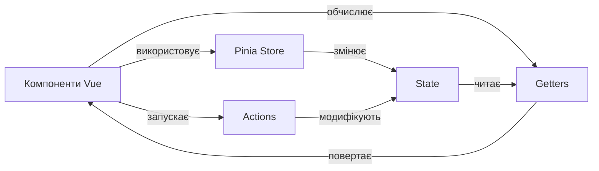
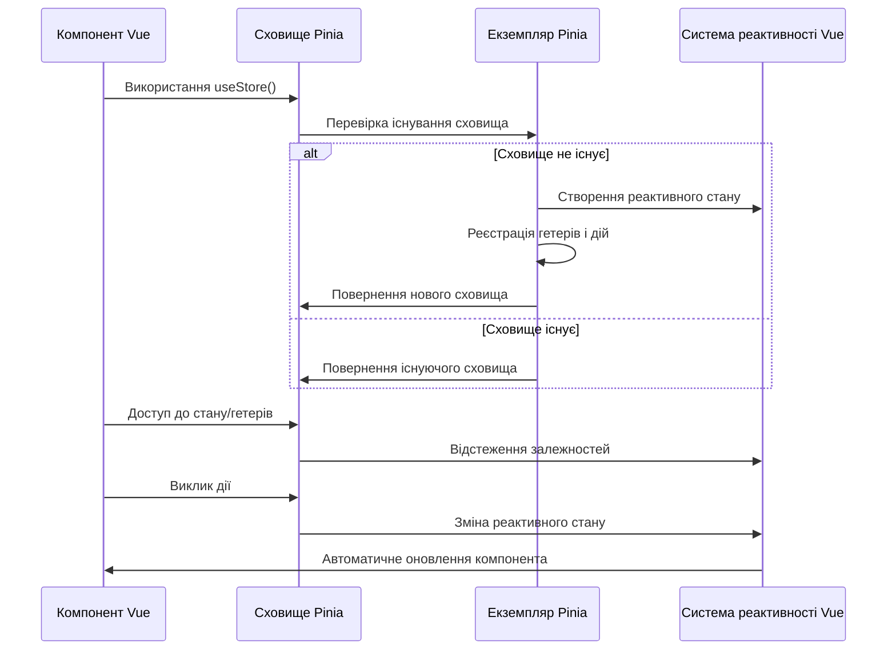

# Vue 3: Pinia

## Коротке пояснення

**Pinia** — це бібліотека управління станом для Vue.js, офіційно рекомендована командою Vue. Вона заміняє Vuex у версії 4 та пропонує більш інтуїтивний API, повну підтримку TypeScript, і краще відповідає стилю Composition API в Vue 3. Pinia спрощує роботу зі спільним станом у додатку, дозволяючи зберігати дані, доступні всім компонентам, і забезпечуючи передбачувану зміну стану через строго визначені дії.



---

## Встановлення та налаштування

### Встановлення Pinia

```bash
# Через npm
npm install pinia

# Через yarn
yarn add pinia
```

### Інтеграція з Vue додатком

```javascript
// main.js
import { createApp } from "vue";
import { createPinia } from "pinia";
import App from "./App.vue";

const pinia = createPinia();
const app = createApp(App);

app.use(pinia);
app.mount("#app");
```

---

## Основні концепції

### Store (Сховище)

Store — це центральний елемент Pinia, який містить стан, гетери і дії. У Pinia використовується декілька незалежних сховищ, на відміну від одного глобального сховища в Vuex.

#### Створення Store

**Використовуючи Options API (схоже на Vuex):**

```javascript
// stores/counter.js
import { defineStore } from "pinia";

export const useCounterStore = defineStore("counter", {
    // Стан (state) - реактивні дані
    state: () => ({
        count: 0,
        name: "Лічильник",
    }),

    // Гетери (getters) - обчислювані властивості
    getters: {
        doubleCount: (state) => state.count * 2,
        countPlusName: (state) => `${state.count} - ${state.name}`,
    },

    // Дії (actions) - методи для зміни стану
    actions: {
        increment() {
            this.count++;
        },
        decrement() {
            this.count--;
        },
        async fetchCount() {
            const response = await fetch("/api/count");
            this.count = await response.json();
        },
    },
});
```

**Використовуючи Composition API (більш сучасний підхід):**

```javascript
// stores/counter.js
import { defineStore } from "pinia";
import { ref, computed } from "vue";

export const useCounterStore = defineStore("counter", () => {
    // State
    const count = ref(0);
    const name = ref("Лічильник");

    // Getters
    const doubleCount = computed(() => count.value * 2);
    const countPlusName = computed(() => `${count.value} - ${name.value}`);

    // Actions
    function increment() {
        count.value++;
    }

    function decrement() {
        count.value--;
    }

    async function fetchCount() {
        const response = await fetch("/api/count");
        count.value = await response.json();
    }

    return {
        count,
        name,
        doubleCount,
        countPlusName,
        increment,
        decrement,
        fetchCount,
    };
});
```

### State (Стан)

State — це реактивний стан вашого додатку. У Pinia стан визначається як функція, що повертає початковий стан.

#### Доступ до стану

**У компоненті:**

```vue
<template>
    <div>
        <p>Рахунок: {{ counterStore.count }}</p>
        <p>Ім'я: {{ counterStore.name }}</p>
    </div>
</template>

<script>
import { useCounterStore } from "@/stores/counter";

export default {
    setup() {
        const counterStore = useCounterStore();

        return {
            counterStore,
        };
    },
};
</script>
```

**Деструктуризація з `storeToRefs`:**

```vue
<script>
import { useCounterStore } from "@/stores/counter";
import { storeToRefs } from "pinia";

export default {
    setup() {
        const counterStore = useCounterStore();
        // storeToRefs зберігає реактивність при деструктуризації
        const { count, name } = storeToRefs(counterStore);

        // Дії можна деструктуризувати напряму
        const { increment, decrement } = counterStore;

        return {
            count,
            name,
            increment,
            decrement,
        };
    },
};
</script>
```

#### Зміна стану

**Безпосередня зміна (не рекомендовано для складних змін):**

```javascript
const counterStore = useCounterStore();

// Зміна окремого поля
counterStore.count = 10;

// Зміна кількох полів одночасно через $patch
counterStore.$patch({
    count: 20,
    name: "Новий лічильник",
});

// Зміна через функцію $patch для складних модифікацій
counterStore.$patch((state) => {
    state.count = 100;
    state.name = `Оновлено: ${new Date().toLocaleString()}`;
});
```

**Зміна через дії (рекомендований підхід):**

```javascript
const counterStore = useCounterStore();

// Виклик дії
counterStore.increment();
counterStore.fetchCount();
```

#### Скидання стану

```javascript
const counterStore = useCounterStore();

// Скидання до початкових значень
counterStore.$reset();
```

### Getters (Гетери)

Getters — це обчислювані властивості для сховищ. Вони обчислюють похідні значення від стану.

#### Основні гетери

```javascript
import { defineStore } from "pinia";

export const useProductStore = defineStore("products", {
    state: () => ({
        products: [],
        searchQuery: "",
    }),
    getters: {
        // Базовий гетер
        productCount: (state) => state.products.length,

        // Гетер, що використовує стан
        filteredProducts: (state) => {
            if (!state.searchQuery) return state.products;

            const query = state.searchQuery.toLowerCase();
            return state.products.filter((product) =>
                product.name.toLowerCase().includes(query)
            );
        },

        // Гетер, що використовує інші гетери (через this)
        isEmpty() {
            return this.productCount === 0;
        },

        // Гетер з параметром (функція, що повертає функцію)
        getProductById: (state) => {
            return (productId) =>
                state.products.find((p) => p.id === productId);
        },
    },
});
```

#### Використання гетерів

```vue
<template>
    <div>
        <p>Кількість товарів: {{ productStore.productCount }}</p>
        <p v-if="productStore.isEmpty">Немає товарів</p>

        <input v-model="productStore.searchQuery" placeholder="Пошук..." />

        <ul>
            <li
                v-for="product in productStore.filteredProducts"
                :key="product.id"
            >
                {{ product.name }}
            </li>
        </ul>

        <!-- Використання гетера з параметром -->
        <div v-if="selectedProduct">
            <h3>Обраний товар: {{ selectedProduct.name }}</h3>
        </div>
    </div>
</template>

<script>
import { useProductStore } from "@/stores/product";
import { ref, computed } from "vue";

export default {
    setup() {
        const productStore = useProductStore();
        const productId = ref(1);

        const selectedProduct = computed(() =>
            productStore.getProductById(productId.value)
        );

        return {
            productStore,
            productId,
            selectedProduct,
        };
    },
};
</script>
```

### Actions (Дії)

Actions — це методи сховища, які використовуються для зміни стану. Вони можуть бути асинхронними і виконувати складну логіку.

#### Основні дії

```javascript
import { defineStore } from "pinia";

export const useUserStore = defineStore("user", {
    state: () => ({
        user: null,
        isLoading: false,
        error: null,
    }),
    actions: {
        // Синхронна дія
        setUser(userData) {
            this.user = userData;
        },

        // Асинхронна дія
        async login(credentials) {
            this.isLoading = true;
            this.error = null;

            try {
                const response = await fetch("/api/login", {
                    method: "POST",
                    headers: { "Content-Type": "application/json" },
                    body: JSON.stringify(credentials),
                });

                if (!response.ok) {
                    throw new Error("Помилка авторизації");
                }

                const userData = await response.json();
                this.user = userData;
                return userData;
            } catch (error) {
                this.error = error.message;
                throw error;
            } finally {
                this.isLoading = false;
            }
        },

        // Дія, яка викликає іншу дію
        async register(userData) {
            this.isLoading = true;
            this.error = null;

            try {
                const response = await fetch("/api/register", {
                    method: "POST",
                    headers: { "Content-Type": "application/json" },
                    body: JSON.stringify(userData),
                });

                if (!response.ok) {
                    throw new Error("Помилка реєстрації");
                }

                // Автоматичний логін після реєстрації
                return this.login({
                    email: userData.email,
                    password: userData.password,
                });
            } catch (error) {
                this.error = error.message;
                throw error;
            } finally {
                this.isLoading = false;
            }
        },

        // Дія для виходу з системи
        logout() {
            this.user = null;
        },
    },
});
```

#### Використання дій

```vue
<template>
    <div>
        <div v-if="userStore.isLoading">Завантаження...</div>
        <div v-if="userStore.error" class="error">{{ userStore.error }}</div>

        <template v-if="userStore.user">
            <h3>Вітаємо, {{ userStore.user.name }}!</h3>
            <button @click="logout">Вийти</button>
        </template>

        <form v-else @submit.prevent="login">
            <input v-model="email" placeholder="Email" />
            <input v-model="password" type="password" placeholder="Password" />
            <button type="submit">Увійти</button>
        </form>
    </div>
</template>

<script>
import { useUserStore } from "@/stores/user";
import { ref } from "vue";

export default {
    setup() {
        const userStore = useUserStore();
        const email = ref("");
        const password = ref("");

        async function login() {
            try {
                await userStore.login({
                    email: email.value,
                    password: password.value,
                });
                // Очищення форми після успішного входу
                email.value = "";
                password.value = "";
            } catch (error) {
                console.error("Помилка входу:", error);
            }
        }

        function logout() {
            userStore.logout();
        }

        return {
            userStore,
            email,
            password,
            login,
            logout,
        };
    },
};
</script>
```

---

## Додаткові можливості

### Підписка на зміни

```javascript
import { useCounterStore } from "@/stores/counter";

export default {
    setup() {
        const counterStore = useCounterStore();

        // Підписка на будь-які зміни
        const unsubscribe = counterStore.$subscribe((mutation, state) => {
            console.log("Зміна стану:", mutation);
            console.log("Новий стан:", state);

            // Можна зберегти стан в localStorage
            localStorage.setItem("counter", JSON.stringify(state));
        });

        // Підписка на конкретні дії
        const unsubscribeAction = counterStore.$onAction(
            ({ name, args, after, onError }) => {
                console.log(`Дія ${name} викликана з аргументами:`, args);

                // Після завершення дії
                after((result) => {
                    console.log(`Дія ${name} завершена з результатом:`, result);
                });

                // У випадку помилки
                onError((error) => {
                    console.error(`Дія ${name} зафейлилась:`, error);
                });
            }
        );

        // Не забудьте відписатися при знищенні компонента
        onUnmounted(() => {
            unsubscribe();
            unsubscribeAction();
        });

        return {
            counterStore,
        };
    },
};
```

### Опції зберігання стану

```javascript
import { defineStore } from "pinia";

export const usePreferencesStore = defineStore("preferences", {
    state: () => ({
        theme: "light",
        fontSize: 16,
        language: "uk",
    }),
    actions: {
        setTheme(theme) {
            this.theme = theme;
        },
        setFontSize(size) {
            this.fontSize = size;
        },
        setLanguage(lang) {
            this.language = lang;
        },
    },
    // Зберігання в localStorage
    persist: {
        enabled: true,
        strategies: [
            {
                key: "user-preferences",
                storage: localStorage,
            },
        ],
    },
});
```

> Для використання `persist` опції потрібно додатково встановити плагін `pinia-plugin-persist` або подібний.

### Взаємодія між сховищами

```javascript
import { defineStore } from "pinia";
import { useUserStore } from "./user";
import { useCartStore } from "./cart";

export const useCheckoutStore = defineStore("checkout", {
    state: () => ({
        status: "idle", // 'idle', 'processing', 'success', 'error'
        error: null,
        orderId: null,
    }),
    actions: {
        async createOrder() {
            const userStore = useUserStore();
            const cartStore = useCartStore();

            if (!userStore.user) {
                throw new Error(
                    "Для оформлення замовлення потрібно увійти в систему"
                );
            }

            if (cartStore.isEmpty) {
                throw new Error("Кошик порожній");
            }

            this.status = "processing";

            try {
                const response = await fetch("/api/orders", {
                    method: "POST",
                    headers: {
                        "Content-Type": "application/json",
                        Authorization: `Bearer ${userStore.user.token}`,
                    },
                    body: JSON.stringify({
                        userId: userStore.user.id,
                        items: cartStore.items,
                        totalAmount: cartStore.total,
                    }),
                });

                if (!response.ok) {
                    throw new Error("Помилка створення замовлення");
                }

                const data = await response.json();
                this.orderId = data.orderId;
                this.status = "success";

                // Очищення кошика після успішного замовлення
                cartStore.clearCart();

                return data;
            } catch (error) {
                this.status = "error";
                this.error = error.message;
                throw error;
            }
        },
    },
});
```

### Hot Module Replacement (HMR)

Pinia підтримує HMR, що дозволяє оновлювати сховища без перезавантаження сторінки:

```javascript
// stores/counter.js
import { defineStore } from "pinia";

export const useCounterStore = defineStore("counter", {
    state: () => ({
        count: 0,
    }),
    actions: {
        increment() {
            this.count++;
        },
    },
});

// Підтримка HMR
if (import.meta.hot) {
    import.meta.hot.accept(acceptHMRUpdate(useCounterStore, import.meta.hot));
}
```

---

## Робота з TypeScript

Pinia надає повну підтримку TypeScript, що дозволяє отримати автодоповнення та перевірку типів.

### Типізація сховища

```typescript
// stores/user.ts
import { defineStore } from "pinia";

// Визначення інтерфейсів
interface User {
    id: number;
    name: string;
    email: string;
    role: "user" | "admin";
    token?: string;
}

interface UserState {
    user: User | null;
    isLoading: boolean;
    error: string | null;
}

export const useUserStore = defineStore("user", {
    state: (): UserState => ({
        user: null,
        isLoading: false,
        error: null,
    }),
    getters: {
        isLoggedIn(): boolean {
            return !!this.user;
        },
        isAdmin(): boolean {
            return this.user?.role === "admin";
        },
        userName(): string {
            return this.user?.name ?? "Гість";
        },
    },
    actions: {
        setUser(user: User | null) {
            this.user = user;
        },
        async login(credentials: {
            email: string;
            password: string;
        }): Promise<User> {
            this.isLoading = true;
            this.error = null;

            try {
                const response = await fetch("/api/login", {
                    method: "POST",
                    headers: { "Content-Type": "application/json" },
                    body: JSON.stringify(credentials),
                });

                if (!response.ok) {
                    throw new Error("Помилка авторизації");
                }

                const userData: User = await response.json();
                this.user = userData;
                return userData;
            } catch (error) {
                this.error =
                    error instanceof Error ? error.message : "Невідома помилка";
                throw error;
            } finally {
                this.isLoading = false;
            }
        },
    },
});
```

### Використання типізованого сховища

```vue
<script lang="ts">
import { defineComponent, ref } from "vue";
import { useUserStore } from "@/stores/user";

export default defineComponent({
    setup() {
        const userStore = useUserStore();
        const email = ref("");
        const password = ref("");

        async function login() {
            try {
                await userStore.login({
                    email: email.value,
                    password: password.value,
                });
            } catch (error) {
                console.error("Помилка входу:", error);
            }
        }

        return {
            userStore,
            email,
            password,
            login,
        };
    },
});
</script>
```

---

## Підкапотні механізми

### Як працює Pinia

Pinia побудована на основі реактивної системи Vue 3, використовуючи Proxy для відстеження змін. Ось як вона працює:

1. **Ініціалізація**: При створенні екземпляра Pinia з `createPinia()` вона ініціалізує внутрішній стан для відстеження сховищ.

2. **Визначення сховища**: `defineStore` створює функцію (композабл), яка при виклику повертає екземпляр сховища.

3. **Створення сховища**: Коли сховище використовується вперше, Pinia:

    - Створює реактивний об'єкт стану за допомогою Vue.js `reactive()`
    - Реєструє гетери як обчислювані властивості
    - Прив'язує дії до сховища
    - Реєструє сховище в глобальній Pinia

4. **Реактивність**: Коли стан змінюється, Vue автоматично оновлює всі компоненти, які використовують цей стан.

5. **Девтулзи**: Pinia інтегрується з Vue DevTools, дозволяючи бачити стан, відстежувати зміни та виконувати часові подорожі (time travel).



### Внутрішня структура сховища

Кожне сховище Pinia має наступну внутрішню структуру:

1. **$id**: Унікальний ідентифікатор сховища
2. **$state**: Реактивний об'єкт стану
3. **$patch**: Метод для пакетного оновлення стану
4. **$reset**: Метод для скидання стану до початкових значень
5. **$subscribe**: Метод для підписки на зміни стану
6. **$onAction**: Метод для підписки на виклики дій
7. **$dispose**: Метод для видалення сховища

```javascript
// Спрощена внутрішня структура сховища Pinia
const store = {
    $id: "counter", // ідентифікатор сховища

    // Реактивний стан
    $state: reactive({
        count: 0,
        name: "Лічильник",
    }),

    // Гетери (обчислювані властивості)
    get doubleCount() {
        return this.$state.count * 2;
    },

    // Дії (методи)
    increment() {
        this.$state.count++;
    },

    // Службові методи
    $patch(partialStateOrMutator) {
        /* логіка пакетного оновлення */
    },

    $reset() {
        /* логіка скидання стану */
    },

    $subscribe(callback, options) {
        /* логіка підписки */
        return unsubscribe;
    },

    $onAction(callback) {
        /* логіка підписки на дії */
        return unsubscribe;
    },

    $dispose() {
        /* логіка видалення сховища */
    },
};
```

### Порівняння з Vuex

| Особливість | Pinia                                       | Vuex                                           |
| ----------- | ------------------------------------------- | ---------------------------------------------- |
| Синтаксис   | Простіший, менш багатослівний               | Більш структурований, але багатослівний        |
| Структура   | Кілька незалежних сховищ                    | Одне глобальне сховище з модулями              |
| Мутації     | Відсутні, зміни відбуваються напряму в діях | Обов'язкові для зміни стану                    |
| Типізація   | Повна нативна підтримка TypeScript          | Обмежена підтримка, потрібні додаткові хелпери |
| Devtools    | Інтеграція з Vue DevTools                   | Інтеграція з Vue DevTools                      |
| Модульність | Природня, кожне сховище — окремий модуль    | Потребує додаткової конфігурації               |
| Композиція  | Просто використовувати кілька сховищ        | Потребує спеціального синтаксису для модулів   |

---

## Підводні камені та обмеження

### Мутації стану поза діями

```javascript
// ❌ Неправильно: зміна стану поза сховищем
const store = useCounterStore();
const { count } = storeToRefs(store);
count.value = 100; // Це працює, але обходить механізми відстеження Pinia

// ✅ Правильно: використання дій або $patch
store.increment();
// або
store.$patch({ count: 100 });
```

### Деструктуризація без storeToRefs

```javascript
// ❌ Неправильно: втрата реактивності
const store = useCounterStore();
const { count, name } = store; // Властивості не будуть реактивними!

// ✅ Правильно: використання storeToRefs
import { storeToRefs } from "pinia";
const store = useCounterStore();
const { count, name } = storeToRefs(store); // Зберігає реактивність
```

### Глибоко вкладені оновлення об'єктів

```javascript
// Припустимо, у нас є сховище з вкладеними об'єктами
const useUserStore = defineStore('user', {
  state: () => ({
    user: {
      profile: {
        address: {
          city: 'Київ',
          street: 'Хрещатик'
        }
      }
    }
  })
})

// ❌ Неправильно: пряма зміна може не викликати реактивні оновлення
const store = useUserStore()
store.user.profile.address.city = 'Львів'

// ✅ Правильно: використання $patch з функцією
store.$patch((state) => {
  state.user.profile.address.city = 'Львів'
})

// ✅ Також правильно: створити дію
// У сховищі:
actions: {
  updateCity(city) {
    this.user.profile.address.city = city
  }
}
// У компоненті:
store.updateCity('Львів')
```

### Подвійне виконання в strict mode

```javascript
// Проблема: в strict mode дії можуть викликатися двічі
export const useCounterStore = defineStore('counter', {
  state: () => ({
    count: 0,
    logs: []
  }),
  actions: {
    increment() {
      this.count++
      // Побічний ефект може виконатися двічі в режимі розробки
      this.logs.push(`Інкремент до ${this.count} в ${new Date().toISOString()}`)
    }
  }
})

// ✅ Рішення: перевірка на режим продакшн для побічних ефектів
actions: {
  increment() {
    this.count++

    // Виконуємо побічні ефекти тільки один раз
    if (import.meta.env.PROD || !import.meta.env.DEV) {
      this.logs.push(`Інкремент до ${this.count} в ${new Date().toISOString()}`)
    }
  }
}
```

### Циклічні залежності між сховищами

```javascript
// ❌ Неправильно: циклічні залежності між сховищами
// store1.js
import { useStore2 } from "./store2";

export const useStore1 = defineStore("store1", {
    actions: {
        doSomething() {
            const store2 = useStore2();
            store2.doSomethingElse();
        },
    },
});

// store2.js
import { useStore1 } from "./store1";

export const useStore2 = defineStore("store2", {
    actions: {
        doSomethingElse() {
            const store1 = useStore1();
            store1.doSomething();
        },
    },
});

// ✅ Правильно: уникати циклічних залежностей або ініціалізувати сховища всередині дій
// store1.js
export const useStore1 = defineStore("store1", {
    actions: {
        doSomething() {
            // Імпорт всередині дії
            const { useStore2 } = require("./store2");
            const store2 = useStore2();
            store2.doSomethingElse();
        },
    },
});
```

---

## Оптимізація

### Ледаче завантаження сховищ

```javascript
// ❌ Стандартний імпорт: завантажується завжди
import { useUserStore } from "@/stores/user";
import { useCartStore } from "@/stores/cart";
import { useProductStore } from "@/stores/product";

// ✅ Ледачий імпорт: завантажується тільки за потреби
export default {
    setup() {
        // Завантажуємо тільки потрібні сховища
        const userStore = useUserStore();

        // Ледаче завантаження інших сховищ
        function loadCart() {
            const { useCartStore } = require("@/stores/cart");
            return useCartStore();
        }

        return {
            userStore,
            loadCart,
        };
    },
};
```

### Оптимізація підписок

```javascript
// ❌ Неоптимально: підписка на всі зміни
store.$subscribe((mutation) => {
    // Викликається для будь-яких змін
    saveToLocalStorage();
});

// ✅ Оптимально: фільтрація змін
store.$subscribe((mutation) => {
    // Перевіряємо, які поля змінилися
    if (mutation.type === "direct" && "user" in mutation.payload) {
        // Зберігаємо тільки дані користувача
        saveUserToLocalStorage(mutation.payload.user);
    }
});
```

### Поділ сховища на менші частини

Замість одного великого сховища використовуйте кілька менших:

```javascript
// ❌ Одне велике сховище
const useAppStore = defineStore("app", {
    state: () => ({
        user: null,
        products: [],
        cart: [],
        orders: [],
        notifications: [],
        settings: {},
        // багато інших полів...
    }),
});

// ✅ Декілька спеціалізованих сховищ
const useUserStore = defineStore("user", {
    state: () => ({
        user: null,
    }),
});

const useProductStore = defineStore("product", {
    state: () => ({
        products: [],
    }),
});

const useCartStore = defineStore("cart", {
    state: () => ({
        items: [],
    }),
});
```

### Кешування результатів гетерів

```javascript
import { defineStore } from "pinia";

export const useProductStore = defineStore("products", {
    state: () => ({
        products: [],
        cachedQueries: new Map(),
    }),
    actions: {
        // Гетер із кешуванням
        getFilteredProducts(category, priceRange) {
            const cacheKey = `${category}-${priceRange.min}-${priceRange.max}`;

            // Перевірка кешу
            if (this.cachedQueries.has(cacheKey)) {
                return this.cachedQueries.get(cacheKey);
            }

            // Фільтрація
            const filtered = this.products.filter(
                (product) =>
                    product.category === category &&
                    product.price >= priceRange.min &&
                    product.price <= priceRange.max
            );

            // Збереження в кеші
            this.cachedQueries.set(cacheKey, filtered);

            return filtered;
        },

        // Очищення кешу при оновленні даних
        updateProducts(newProducts) {
            this.products = newProducts;
            this.cachedQueries.clear();
        },
    },
});
```

---

## Практичний приклад

Розглянемо приклад комплексного додатку з кількома сховищами:

### Структура додатку

```
src/
├── stores/
│   ├── index.js           # Експорт всіх сховищ
│   ├── auth.js            # Авторизація користувача
│   ├── products.js        # Управління товарами
│   ├── cart.js            # Кошик покупок
│   ├── orders.js          # Замовлення
│   └── ui.js              # UI стан (модальні вікна, повідомлення)
```

### Головний файл Pinia

```javascript
// stores/index.js
import { createPinia } from "pinia";
import piniaPluginPersistedstate from "pinia-plugin-persistedstate";

// Створення екземпляра Pinia
const pinia = createPinia();

// Додавання плагіна для збереження стану в localStorage
pinia.use(piniaPluginPersistedstate);

export default pinia;

// Експорт всіх сховищ для зручності імпорту
export * from "./auth";
export * from "./products";
export * from "./cart";
export * from "./orders";
export * from "./ui";
```

### Сховище аутентифікації

```javascript
// stores/auth.js
import { defineStore } from "pinia";
import { ref, computed } from "vue";
import api from "@/services/api";

export const useAuthStore = defineStore(
    "auth",
    () => {
        // State
        const user = ref(null);
        const token = ref(null);
        const isLoading = ref(false);
        const error = ref(null);

        // Getters
        const isAuthenticated = computed(() => !!token.value);
        const isAdmin = computed(() => user.value?.role === "admin");

        // Actions
        async function login(credentials) {
            isLoading.value = true;
            error.value = null;

            try {
                const response = await api.auth.login(credentials);
                user.value = response.user;
                token.value = response.token;
                // Встановлення токена для API запитів
                api.setAuthToken(response.token);
                return response;
            } catch (err) {
                error.value = err.message;
                throw err;
            } finally {
                isLoading.value = false;
            }
        }

        async function register(userData) {
            isLoading.value = true;
            error.value = null;

            try {
                const response = await api.auth.register(userData);
                return response;
            } catch (err) {
                error.value = err.message;
                throw err;
            } finally {
                isLoading.value = false;
            }
        }

        function logout() {
            user.value = null;
            token.value = null;
            // Видалення токена з API
            api.removeAuthToken();
            // Очищення кошика при виході
            const cartStore = useCartStore();
            cartStore.$reset();
        }

        async function fetchUserProfile() {
            if (!token.value) return null;

            isLoading.value = true;

            try {
                const userData = await api.auth.getProfile();
                user.value = userData;
                return userData;
            } catch (err) {
                error.value = err.message;
                // Якщо токен недійсний, виходимо
                if (err.response?.status === 401) {
                    logout();
                }
                throw err;
            } finally {
                isLoading.value = false;
            }
        }

        return {
            // State
            user,
            token,
            isLoading,
            error,

            // Getters
            isAuthenticated,
            isAdmin,

            // Actions
            login,
            register,
            logout,
            fetchUserProfile,
        };
    },
    {
        // Зберігання токена в localStorage
        persist: {
            paths: ["token"],
        },
    }
);
```

### Сховище товарів

```javascript
// stores/products.js
import { defineStore } from "pinia";
import { ref, computed } from "vue";
import api from "@/services/api";

export const useProductStore = defineStore("products", () => {
    // State
    const products = ref([]);
    const categories = ref([]);
    const isLoading = ref(false);
    const error = ref(null);
    const filters = ref({
        category: null,
        priceRange: { min: 0, max: 1000 },
        sortBy: "price",
        sortOrder: "asc",
        searchQuery: "",
    });

    // Getters
    const filteredProducts = computed(() => {
        let result = [...products.value];

        // Фільтрація за категорією
        if (filters.value.category) {
            result = result.filter(
                (p) => p.category === filters.value.category
            );
        }

        // Фільтрація за ціною
        result = result.filter(
            (p) =>
                p.price >= filters.value.priceRange.min &&
                p.price <= filters.value.priceRange.max
        );

        // Пошук за запитом
        if (filters.value.searchQuery) {
            const query = filters.value.searchQuery.toLowerCase();
            result = result.filter(
                (p) =>
                    p.name.toLowerCase().includes(query) ||
                    p.description.toLowerCase().includes(query)
            );
        }

        // Сортування
        result.sort((a, b) => {
            const field = filters.value.sortBy;
            let aValue = a[field];
            let bValue = b[field];

            // Перетворення на числа для числових полів
            if (field === "price" || field === "rating") {
                aValue = Number(aValue);
                bValue = Number(bValue);
            }

            if (filters.value.sortOrder === "asc") {
                return aValue > bValue ? 1 : -1;
            } else {
                return aValue < bValue ? 1 : -1;
            }
        });

        return result;
    });

    const productsByCategory = computed(() => {
        const result = {};

        categories.value.forEach((category) => {
            result[category] = products.value.filter(
                (p) => p.category === category
            );
        });

        return result;
    });

    // Actions
    async function fetchProducts() {
        isLoading.value = true;
        error.value = null;

        try {
            const data = await api.products.getAll();
            products.value = data;
            return data;
        } catch (err) {
            error.value = err.message;
            throw err;
        } finally {
            isLoading.value = false;
        }
    }

    async function fetchCategories() {
        isLoading.value = true;

        try {
            const data = await api.products.getCategories();
            categories.value = data;
            return data;
        } catch (err) {
            error.value = err.message;
            throw err;
        } finally {
            isLoading.value = false;
        }
    }

    function setFilters(newFilters) {
        filters.value = { ...filters.value, ...newFilters };
    }

    async function fetchProductById(id) {
        // Спочатку перевіряємо кеш
        const cachedProduct = products.value.find((p) => p.id === id);

        if (cachedProduct) {
            return cachedProduct;
        }

        // Якщо немає в кеші, завантажуємо з API
        isLoading.value = true;

        try {
            const product = await api.products.getById(id);
            // Додаємо до кешу
            products.value.push(product);
            return product;
        } catch (err) {
            error.value = err.message;
            throw err;
        } finally {
            isLoading.value = false;
        }
    }

    return {
        // State
        products,
        categories,
        isLoading,
        error,
        filters,

        // Getters
        filteredProducts,
        productsByCategory,

        // Actions
        fetchProducts,
        fetchCategories,
        setFilters,
        fetchProductById,
    };
});
```

### Сховище кошика

```javascript
// stores/cart.js
import { defineStore } from "pinia";
import { ref, computed } from "vue";
import { useProductStore } from "./products";

export const useCartStore = defineStore(
    "cart",
    () => {
        // State
        const items = ref([]);

        // Getters
        const isEmpty = computed(() => items.value.length === 0);

        const totalItems = computed(() =>
            items.value.reduce((sum, item) => sum + item.quantity, 0)
        );

        const totalPrice = computed(() =>
            items.value.reduce(
                (sum, item) => sum + item.price * item.quantity,
                0
            )
        );

        const groupedItems = computed(() => {
            const productStore = useProductStore();

            return items.value.map((item) => {
                // Отримання додаткової інформації про товар
                const product =
                    productStore.products.find(
                        (p) => p.id === item.productId
                    ) || {};

                return {
                    ...item,
                    name: product.name || item.name,
                    image: product.image,
                    price: product.price || item.price,
                };
            });
        });

        // Actions
        function addItem(product, quantity = 1) {
            const existingItem = items.value.find(
                (item) => item.productId === product.id
            );

            if (existingItem) {
                // Оновлення кількості, якщо товар вже в кошику
                existingItem.quantity += quantity;
            } else {
                // Додавання нового товару
                items.value.push({
                    productId: product.id,
                    name: product.name,
                    price: product.price,
                    quantity,
                });
            }
        }

        function removeItem(productId) {
            const index = items.value.findIndex(
                (item) => item.productId === productId
            );

            if (index !== -1) {
                items.value.splice(index, 1);
            }
        }

        function updateItemQuantity(productId, quantity) {
            const item = items.value.find(
                (item) => item.productId === productId
            );

            if (item) {
                if (quantity <= 0) {
                    // Якщо кількість 0 або менше, видаляємо товар
                    removeItem(productId);
                } else {
                    item.quantity = quantity;
                }
            }
        }

        function clearCart() {
            items.value = [];
        }

        return {
            // State
            items,

            // Getters
            isEmpty,
            totalItems,
            totalPrice,
            groupedItems,

            // Actions
            addItem,
            removeItem,
            updateItemQuantity,
            clearCart,
        };
    },
    {
        // Зберігання кошика в localStorage
        persist: true,
    }
);
```

### Використання сховищ у компоненті

```vue
<template>
    <div class="product-page">
        <div v-if="productStore.isLoading" class="loading">Завантаження...</div>

        <div v-else-if="product" class="product-details">
            
            <h1>{{ product.name }}</h1>
            <p class="price">{{ product.price }} грн</p>
            <p class="description">{{ product.description }}</p>

            <div class="quantity-control">
                <button @click="decreaseQuantity" :disabled="quantity <= 1">
                    -
                </button>
                <input v-model.number="quantity" type="number" min="1" />
                <button @click="increaseQuantity">+</button>
            </div>

            <button
                class="add-to-cart"
                @click="addToCart"
                :disabled="!authStore.isAuthenticated"
            >
                Додати в кошик
            </button>

            <p v-if="!authStore.isAuthenticated" class="login-notice">
                Для покупки потрібно
                <router-link to="/login">увійти в систему</router-link>
            </p>

            <div
                v-if="uiStore.notification"
                class="notification"
                :class="uiStore.notification.type"
            >
                {{ uiStore.notification.message }}
            </div>
        </div>

        <div v-else class="error">Товар не знайдено</div>

        <div class="cart-summary" v-if="!cartStore.isEmpty">
            <h3>Ваш кошик</h3>
            <p>Товарів: {{ cartStore.totalItems }}</p>
            <p>Сума: {{ cartStore.totalPrice }} грн</p>
            <router-link to="/cart" class="checkout-btn">
                Оформити замовлення
            </router-link>
        </div>
    </div>
</template>

<script>
import { ref, computed, onMounted } from "vue";
import { useRoute } from "vue-router";
import {
    useProductStore,
    useCartStore,
    useAuthStore,
    useUiStore,
} from "@/stores";

export default {
    setup() {
        const route = useRoute();
        const productStore = useProductStore();
        const cartStore = useCartStore();
        const authStore = useAuthStore();
        const uiStore = useUiStore();

        const productId = computed(() => route.params.id);
        const quantity = ref(1);

        const product = computed(() =>
            productStore.products.find((p) => p.id === productId.value)
        );

        // Завантаження даних про товар при монтуванні компонента
        onMounted(async () => {
            if (!product.value) {
                try {
                    await productStore.fetchProductById(productId.value);
                } catch (error) {
                    uiStore.showNotification({
                        message: "Помилка завантаження товару",
                        type: "error",
                    });
                }
            }
        });

        // Методи для зміни кількості
        function increaseQuantity() {
            quantity.value++;
        }

        function decreaseQuantity() {
            if (quantity.value > 1) {
                quantity.value--;
            }
        }

        // Додавання товару в кошик
        function addToCart() {
            if (!authStore.isAuthenticated) {
                uiStore.showNotification({
                    message: "Для покупки потрібно увійти в систему",
                    type: "warning",
                });
                return;
            }

            cartStore.addItem(product.value, quantity.value);

            uiStore.showNotification({
                message: `${product.value.name} додано в кошик`,
                type: "success",
            });
        }

        return {
            product,
            quantity,
            productStore,
            cartStore,
            authStore,
            uiStore,
            increaseQuantity,
            decreaseQuantity,
            addToCart,
        };
    },
};
</script>
```

---

## Висновок

Pinia — це сучасна, легка та інтуїтивно зрозуміла бібліотека управління станом для Vue 3, яка пропонує ряд переваг у порівнянні з Vuex:

1. **Простіший API** — відсутність мутацій, модулів і інших складних концепцій
2. **Повна підтримка TypeScript** — типізація з коробки без додаткових налаштувань
3. **Модульність** — кожне сховище є незалежним і можливе ледаче завантаження
4. **Можливість деструктуризації** — зручний доступ до даних через `storeToRefs`
5. **Підтримка DevTools** — відстеження змін стану і дій з часовою подорожжю
6. **Розширюваність** — підтримка плагінів для додаткової функціональності
7. **Підтримка SSR** — серверний рендеринг для Vue і Nuxt

Pinia поєднує простоту використання з потужними можливостями управління станом, що робить її ідеальним вибором для будь-яких Vue 3 додатків — від маленьких проектів до великих корпоративних застосунків.
