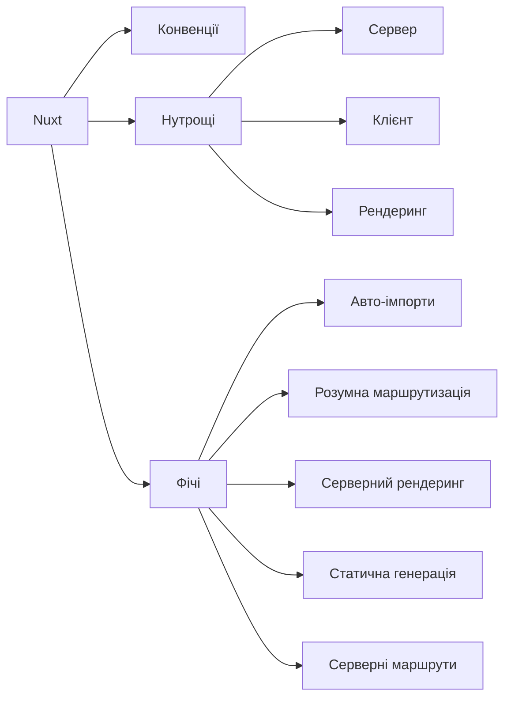
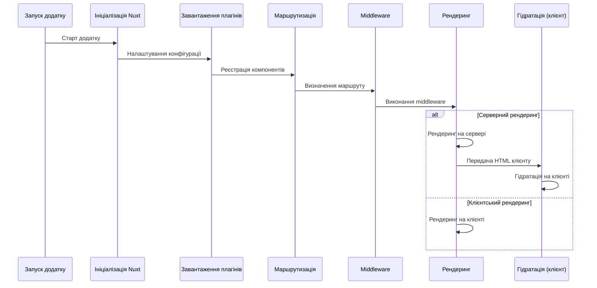

# Vue 3: Nuxt

## Коротке пояснення

**Nuxt** — це фреймворк, побудований на основі Vue.js, який спрощує створення універсальних (SSR), статичних (SSG) та SPA додатків. Nuxt надає структуру проєкту, конвенції, оптимізації та інструменти, що дозволяють швидко розробляти продуктивні та SEO-оптимізовані додатки. Nuxt 3 підтримує Vue 3, TypeScript, Vite і значно покращує швидкодію та розробницький досвід.



---

## Встановлення та налаштування

### Створення нового проєкту

```bash
# За допомогою CLI
npx nuxi init my-nuxt-app

# або з npm
npm init nuxt-app my-nuxt-app
```

### Структура проєкту

```
my-nuxt-app/
├── .nuxt/               # Згенерований код (автоматично)
├── assets/              # Статичні файли, що будуть оброблені збірником
├── components/          # Vue компоненти
├── composables/         # Композабли (автоматично імпортуються)
├── content/             # Контент (для Nuxt Content модуля)
├── layouts/             # Шаблони сторінок
├── middleware/          # Функції-посередники
├── pages/               # Сторінки (автоматично створюють маршрути)
├── plugins/             # Плагіни Vue/Nuxt
├── public/              # Статичні файли, доступні напряму через URL
├── server/              # Серверний API та проміжне ПЗ
│   ├── api/             # API ендпоінти (автоматично створюють маршрути)
│   ├── middleware/      # Серверні проміжні обробники
│   └── routes/          # Серверні маршрути
├── app.vue              # Головний компонент додатку
├── nuxt.config.ts       # Конфігурація Nuxt
├── package.json         # Залежності та скрипти
└── tsconfig.json        # Конфігурація TypeScript
```

### Базова конфігурація

```typescript
// nuxt.config.ts
export default defineNuxtConfig({
    // Глобальні метадані <head>
    app: {
        head: {
            title: "Мій Nuxt додаток",
            meta: [
                { charset: "utf-8" },
                {
                    name: "viewport",
                    content: "width=device-width, initial-scale=1",
                },
                {
                    hid: "description",
                    name: "description",
                    content: "Опис мого Nuxt додатку",
                },
            ],
            link: [{ rel: "icon", type: "image/x-icon", href: "/favicon.ico" }],
        },
    },

    // Модулі
    modules: ["@nuxtjs/tailwindcss", "@pinia/nuxt", "@nuxt/content"],

    // Режим рендерингу
    ssr: true,

    // Налаштування CSS
    css: ["@/assets/css/main.css"],

    // Налаштування рантайму
    runtimeConfig: {
        // Змінні, доступні тільки на сервері
        apiSecret: process.env.API_SECRET,

        // Публічні змінні, доступні на клієнті та сервері
        public: {
            apiBase: process.env.API_BASE || "https://api.example.com",
        },
    },
});
```

---

## Сторінки та маршрутизація

### Файлова система маршрутизації

Nuxt автоматично створює маршрути на основі файлів у директорії `pages/`:

```
pages/
├── index.vue          # => /
├── about.vue          # => /about
├── products/
│   ├── index.vue      # => /products
│   └── [id].vue       # => /products/:id (динамічний маршрут)
└── users-[group]/
    └── [id].vue       # => /users-:group/:id (вкладений динамічний маршрут)
```

### Базова сторінка

```vue
<!-- pages/index.vue -->
<template>
    <div>
        <h1>Головна сторінка</h1>
        <p>Ласкаво просимо до нашого Nuxt додатку!</p>

        <!-- Навігація -->
        <NuxtLink to="/about">Про нас</NuxtLink>
        <NuxtLink to="/products">Продукти</NuxtLink>
    </div>
</template>

<script setup>
// Доступ до маршруту
const route = useRoute();

// Метадані сторінки
useHead({
    title: "Головна сторінка",
    meta: [
        {
            name: "description",
            content: "Це головна сторінка нашого Nuxt додатку",
        },
    ],
});

// Виконання коду тільки на клієнті
onMounted(() => {
    console.log("Компонент змонтовано на клієнті");
});
</script>
```

### Динамічні маршрути

```vue
<!-- pages/products/[id].vue -->
<template>
    <div>
        <h1>Продукт: {{ product.name }}</h1>
        <p>ID: {{ route.params.id }}</p>
        <p>Ціна: {{ product.price }} грн</p>

        <NuxtLink to="/products">Назад до списку</NuxtLink>
    </div>
</template>

<script setup>
const route = useRoute();
const productId = route.params.id;

// Завантаження даних
const { data: product } = await useFetch(`/api/products/${productId}`);

// Перевірка, чи існує продукт
if (!product.value) {
    throw createError({
        statusCode: 404,
        message: "Продукт не знайдено",
    });
}

// Динамічні метадані на основі даних
useHead({
    title: `Продукт: ${product.value.name}`,
    meta: [{ name: "description", content: product.value.description }],
});
</script>
```

### Параметри маршруту

```vue
<!-- pages/search.vue -->
<template>
    <div>
        <h1>Результати пошуку</h1>
        <p>Запит: {{ route.query.q }}</p>
        <p>Категорія: {{ route.query.category || "Всі" }}</p>

        <ul>
            <li v-for="item in searchResults" :key="item.id">
                {{ item.name }}
            </li>
        </ul>
    </div>
</template>

<script setup>
const route = useRoute();
const router = useRouter();

// Реактивне отримання query параметрів
const query = computed(() => route.query.q || "");
const category = computed(() => route.query.category);

// Завантаження даних на основі параметрів
const { data: searchResults } = await useFetch("/api/search", {
    query: {
        q: query.value,
        category: category.value,
    },
});

// Функція для оновлення параметрів URL
function updateSearch(newQuery, newCategory) {
    router.push({
        path: "/search",
        query: {
            q: newQuery,
            ...(newCategory && { category: newCategory }),
        },
    });
}
</script>
```

### Вкладені маршрути

```vue
<!-- pages/dashboard.vue -->
<template>
    <div>
        <h1>Панель управління</h1>

        <nav>
            <NuxtLink to="/dashboard">Огляд</NuxtLink>
            <NuxtLink to="/dashboard/stats">Статистика</NuxtLink>
            <NuxtLink to="/dashboard/users">Користувачі</NuxtLink>
        </nav>

        <!-- Вкладений маршрут відображається тут -->
        <NuxtPage />
    </div>
</template>
```

```
pages/
├── dashboard.vue
└── dashboard/
    ├── index.vue      # => /dashboard
    ├── stats.vue      # => /dashboard/stats
    └── users.vue      # => /dashboard/users
```

### Програмна навігація

```vue
<script setup>
const router = useRouter();

function navigateToProduct(id) {
    router.push(`/products/${id}`);
}

function goBack() {
    router.back();
}

function navigateWithQuery() {
    router.push({
        path: "/search",
        query: {
            q: "nuxt",
            category: "framework",
        },
    });
}
</script>
```

---

## Layouts (шаблони)

### Базовий шаблон

```vue
<!-- layouts/default.vue -->
<template>
    <div class="layout">
        <header>
            <nav>
                <NuxtLink to="/">Головна</NuxtLink>
                <NuxtLink to="/about">Про нас</NuxtLink>
                <NuxtLink to="/products">Продукти</NuxtLink>
                <NuxtLink to="/contact">Контакти</NuxtLink>
            </nav>
        </header>

        <main>
            <!-- Слот, куди рендериться вміст сторінки -->
            <slot />
        </main>

        <footer>
            <p>&copy; 2025 Мій Nuxt додаток</p>
        </footer>
    </div>
</template>

<style scoped>
.layout {
    display: flex;
    flex-direction: column;
    min-height: 100vh;
}

main {
    flex: 1;
    padding: 20px;
}

header,
footer {
    padding: 20px;
    background-color: #f0f0f0;
}

nav a {
    margin-right: 10px;
}
</style>
```

### Вибір шаблону для сторінки

```vue
<!-- pages/admin/index.vue -->
<template>
    <div>
        <h1>Адмін-панель</h1>
        <!-- Вміст сторінки -->
    </div>
</template>

<script setup>
// Використання іншого шаблону для цієї сторінки
definePageMeta({
    layout: "admin",
});
</script>
```

```vue
<!-- layouts/admin.vue -->
<template>
    <div class="admin-layout">
        <div class="sidebar">
            <!-- Меню адміністратора -->
            <ul>
                <li><NuxtLink to="/admin">Дашборд</NuxtLink></li>
                <li><NuxtLink to="/admin/users">Користувачі</NuxtLink></li>
                <li><NuxtLink to="/admin/settings">Налаштування</NuxtLink></li>
            </ul>
        </div>

        <div class="content">
            <header>
                <h2>Адмін-панель</h2>
                <button @click="logout">Вийти</button>
            </header>

            <main>
                <slot />
            </main>
        </div>
    </div>
</template>

<script setup>
const logout = () => {
    // Логіка виходу
};
</script>
```

### Динамічна зміна шаблону

```vue
<template>
    <div>
        <button @click="toggleLayout">Змінити шаблон</button>
        <!-- Вміст сторінки -->
    </div>
</template>

<script setup>
// Використання reactivу для зміни шаблону
const layout = ref("default");

// Метадані сторінки з реактивним шаблоном
definePageMeta({
    layout: null, // Відключаємо автоматичний шаблон
});

// Використовуємо composable для контролю шаблону
const { setLayout } = useNuxtApp();

// Зміна шаблону
function toggleLayout() {
    const newLayout = layout.value === "default" ? "admin" : "default";
    layout.value = newLayout;
    setLayout(newLayout);
}
</script>
```

---

## Middleware (проміжне ПЗ)

Middleware дозволяє виконувати код перед тим, як рендериться сторінка. Це корисно для авторизації, перевірки прав доступу, перенаправлень тощо.

### Типи middleware

1. **Анонімне middleware**: Безпосередньо в компоненті
2. **Іменоване middleware**: Файли в директорії `middleware/`
3. **Глобальне middleware**: Файли, що починаються з `.global`

### Анонімне middleware

```vue
<!-- pages/admin/dashboard.vue -->
<script setup>
definePageMeta({
    middleware: [
        function (to, from) {
            // Отримання інформації про користувача
            const { isLoggedIn, isAdmin } = useAuth();

            if (!isLoggedIn.value) {
                // Перенаправлення на сторінку входу
                return navigateTo("/login", {
                    query: { redirect: to.fullPath },
                });
            }

            if (!isAdmin.value) {
                // Перенаправлення на сторінку помилки доступу
                return navigateTo("/access-denied");
            }
        },
    ],
});
</script>
```

### Іменоване middleware

```javascript
// middleware/auth.js
export default defineNuxtRouteMiddleware((to, from) => {
    const { isLoggedIn } = useAuth();

    if (!isLoggedIn.value && to.path !== "/login") {
        return navigateTo("/login", {
            query: { redirect: to.fullPath },
        });
    }
});
```

```vue
<!-- pages/profile.vue -->
<script setup>
definePageMeta({
    middleware: ["auth"],
});
</script>
```

### Глобальне middleware

```javascript
// middleware/stats.global.js
export default defineNuxtRouteMiddleware((to, from) => {
    // Відстеження переходів між сторінками
    trackPageView(to.fullPath);
});
```

### Порядок виконання middleware

Middleware виконуються в наступному порядку:

1. Глобальні middleware (в алфавітному порядку)
2. Middleware, визначені в шаблоні
3. Middleware, визначені на сторінці

### Middleware з підтримкою async/await

```javascript
// middleware/fetchData.js
export default defineNuxtRouteMiddleware(async (to) => {
    // Перевірка, чи потрібно завантажувати дані
    if (to.meta.requiresData) {
        try {
            // Завантаження даних
            await useStore().fetchData();
        } catch (error) {
            console.error("Помилка завантаження даних", error);
            return navigateTo("/error");
        }
    }
});
```

---

## Plugins (плагіни)

Плагіни дозволяють додавати функціональність до додатку, яка буде доступна у всіх компонентах. Вони виконуються до створення екземпляра Vue.

### Автоматичне завантаження плагінів

Файли в директорії `plugins/` автоматично завантажуються при старті додатку.

```
plugins/
├── vue-plugins.js           # Завантажується у обох режимах (клієнт+сервер)
├── analytics.client.js      # Завантажується тільки на клієнті
└── db-connection.server.js  # Завантажується тільки на сервері
```

### Порядок завантаження

Плагіни завантажуються у порядку їх назв. Щоб контролювати порядок, можна використовувати префікси з цифрами:

```
plugins/
├── 1.setup.js    # Завантажується першим
├── 2.api.js      # Завантажується другим
└── 3.tracking.js # Завантажується третім
```

### Базовий плагін

```javascript
// plugins/toast.js
export default defineNuxtPlugin((nuxtApp) => {
    // Створення сервісу сповіщень
    const toast = {
        show(message, type = "info") {
            console.log(`[${type}] ${message}`);
            // Реальна логіка показу сповіщень
        },
        success(message) {
            this.show(message, "success");
        },
        error(message) {
            this.show(message, "error");
        },
    };

    // Додавання до контексту Nuxt
    nuxtApp.provide("toast", toast);
});
```

### Використання плагіна в компоненті

```vue
<template>
    <div>
        <button @click="showToast">Показати сповіщення</button>
    </div>
</template>

<script setup>
const toast = useNuxtApp().$toast;

function showToast() {
    toast.success("Операцію успішно виконано!");
}
</script>
```

### Інтеграція зовнішніх бібліотек

```javascript
// plugins/vue-awesome-library.js
import { defineNuxtPlugin } from "#app";
import AwesomeLibrary from "vue-awesome-library";

export default defineNuxtPlugin((nuxtApp) => {
    nuxtApp.vueApp.use(AwesomeLibrary);
});
```

### Плагіни тільки для клієнта

```javascript
// plugins/analytics.client.js
export default defineNuxtPlugin(() => {
    // Ініціалізація Google Analytics
    if (process.client) {
        // Завантаження скрипта GA
        const script = document.createElement("script");
        script.async = true;
        script.src = `https://www.googletagmanager.com/gtag/js?id=${process.env.GA_ID}`;
        document.head.appendChild(script);

        // Налаштування GA
        window.dataLayer = window.dataLayer || [];
        function gtag() {
            window.dataLayer.push(arguments);
        }
        gtag("js", new Date());
        gtag("config", process.env.GA_ID);

        // Відстеження переходів між сторінками
        const router = useRouter();
        router.afterEach((to) => {
            gtag("set", "page", to.fullPath);
            gtag("send", "pageview");
        });
    }
});
```

---

## Підкапотні механізми

### Життєвий цикл додатку Nuxt



### Режими рендерингу

1. **Universal (SSR + клієнтська гідратація)**:

    - Рендеринг на сервері для першого запиту
    - Гідратація на клієнті
    - Клієнтська навігація після першого завантаження

2. **SPA (Single Page Application)**:

    - Рендеринг тільки на клієнті
    - Нема серверного рендерингу

3. **SSG (Static Site Generation)**:
    - Рендеринг всіх сторінок під час збірки
    - Генерація статичних HTML файлів

### Процес SSR у Nuxt

1. **Запит від клієнта** → Nuxt сервер отримує запит на URL
2. **Підготовка маршруту** → Nuxt визначає, який компонент відповідає URL
3. **Виконання middleware** → Nuxt виконує глобальне і маршрутне middleware
4. **Завантаження даних** → Виконуються хуки і composables для завантаження даних
5. **Рендеринг HTML** → Vue рендерить компоненти у HTML
6. **Відправка HTML** → Nuxt відправляє HTML клієнту
7. **Гідратація** → На клієнті JavaScript "оживляє" HTML у реактивний додаток

### Процес SSG у Nuxt

1. **Аналіз маршрутів** → Nuxt аналізує всі маршрути у додатку
2. **Генерація HTML** → Для кожного маршруту генерується HTML файл
3. **Генерація JSON файлів** → Для кожного маршруту генерується JSON з даними
4. **Збірка клієнтського JavaScript** → Вебпак збирає клієнтський код
5. **Розгортання** → Статичні файли (HTML, JS, CSS) розгортаються на хостингу

### Nuxt Nitro (серверний рушій)

Nitro — це серверний рушій, що використовується в Nuxt 3:

1. **Універсальний** → працює в будь-якому JavaScript середовищі
2. **Маршрутизація на основі файлів** → серверні маршрути на основі файлової системи
3. **Низькорівневі хуки** → для кастомізації серверного рендерингу
4. **Middleware API** → для обробки запитів
5. **Кешування** → вбудована підтримка кешування

### Оптимізації Nuxt

1. **Автоматичний code-splitting** → код ділиться на чанки за маршрутами
2. **Ледаче завантаження компонентів** → компоненти завантажуються за потреби
3. **Автоматичні prefetch/preload** → оптимізоване завантаження ресурсів
4. **Мінімізація повторних рендерингів** → оптимізація для SSR
5. **Кешування даних** → кешування результатів запитів
6. **Tree-shaking** → видалення невикористаного коду

---

## Приклад реального додатку

### app.vue (головний файл)

```vue
<!-- app.vue -->
<template>
    <NuxtLayout>
        <NuxtPage />
    </NuxtLayout>
</template>

<script setup>
// Глобальні метадані
useHead({
    titleTemplate: "%s - Мій Nuxt додаток",
    meta: [
        { name: "description", content: "Опис мого Nuxt додатку" },
        { name: "theme-color", content: "#ffffff" },
    ],
    link: [{ rel: "icon", type: "image/png", href: "/favicon.png" }],
});
</script>
```

### Аутентифікація

```vue
<!-- pages/login.vue -->
<template>
    <div class="login-page">
        <h1>Вхід до системи</h1>

        <form @submit.prevent="login">
            <div class="form-group">
                <label for="email">Email</label>
                <input id="email" v-model="email" type="email" required />
            </div>

            <div class="form-group">
                <label for="password">Пароль</label>
                <input
                    id="password"
                    v-model="password"
                    type="password"
                    required
                />
            </div>

            <div v-if="error" class="error-message">
                {{ error }}
            </div>

            <button type="submit" :disabled="isLoading">
                {{ isLoading ? "Завантаження..." : "Увійти" }}
            </button>
        </form>
    </div>
</template>

<script setup>
definePageMeta({
    layout: "auth",
    middleware: ["guest"],
});

const auth = useAuth();
const router = useRouter();
const route = useRoute();

const email = ref("");
const password = ref("");
const error = ref("");
const isLoading = ref(false);

async function login() {
    error.value = "";
    isLoading.value = true;

    try {
        await auth.login({
            email: email.value,
            password: password.value,
        });

        // Перенаправлення на сторінку, з якої прийшов користувач, або на дашборд
        const redirectPath = route.query.redirect || "/dashboard";
        router.push(redirectPath);
    } catch (err) {
        error.value = err.message || "Помилка авторизації";
    } finally {
        isLoading.value = false;
    }
}
</script>
```

### Структура додатку для блогу

```
blog-app/
├── assets/
│   └── css/
│       └── main.css
├── components/
│   ├── AppHeader.vue
│   ├── AppFooter.vue
│   ├── PostCard.vue
│   └── CommentForm.vue
├── composables/
│   ├── useAuth.js
│   ├── usePosts.js
│   └── useCategories.js
├── layouts/
│   ├── default.vue
│   ├── admin.vue
│   └── auth.vue
├── middleware/
│   ├── auth.js
│   └── admin.global.js
├── pages/
│   ├── index.vue
│   ├── about.vue
│   ├── login.vue
│   ├── register.vue
│   ├── blog/
│   │   ├── index.vue
│   │   ├── [slug].vue
│   │   └── category/
│   │       └── [slug].vue
│   └── admin/
│       ├── index.vue
│       ├── posts/
│       │   ├── index.vue
│       │   ├── create.vue
│       │   └── [id].vue
│       └── users.vue
├── plugins/
│   ├── api.js
│   └── toast.client.js
├── server/
│   ├── api/
│   │   ├── posts/
│   │   │   ├── index.get.js
│   │   │   └── [id].get.js
│   │   └── auth/
│   │       ├── login.post.js
│   │       └── register.post.js
│   └── middleware/
│       └── logger.js
├── app.vue
└── nuxt.config.ts
```

---

## Підводні камені та обмеження

### 1. Серверні vs. клієнтські компоненти

```vue
<template>
    <div>
        <!-- ❌ Помилка: window недоступне на сервері -->
        <p>Ширина вікна: {{ windowWidth }}</p>

        <!-- ✅ Правильно: перевірка, чи на клієнті -->
        <p v-if="isClient">Ширина вікна: {{ windowWidth }}</p>
    </div>
</template>

<script setup>
const isClient = ref(false);
const windowWidth = ref(0);

// Виконання коду тільки на клієнті
onMounted(() => {
    isClient.value = true;
    windowWidth.value = window.innerWidth;

    window.addEventListener("resize", () => {
        windowWidth.value = window.innerWidth;
    });
});
</script>
```

### 2. Обробка помилок SSR

```vue
<template>
    <div>
        <div v-if="error">
            <h2>Помилка: {{ error.message }}</h2>
            <button @click="clearError">Спробувати знову</button>
        </div>
        <div v-else-if="pending">Завантаження...</div>
        <div v-else>
            <!-- Контент сторінки -->
        </div>
    </div>
</template>

<script setup>
const { data, pending, error, refresh } = await useFetch("/api/data", {
    // Продовжувати рендеринг навіть при помилці
    lazy: true,
    // Спеціальна обробка помилок
    onResponseError(err) {
        console.error("Помилка API:", err);
    },
});

function clearError() {
    error.value = null;
    refresh();
}
</script>
```

### 3. Обмеження TypeScript

```typescript
// nuxt.d.ts - Розширення типів Nuxt
declare module "#app" {
    interface NuxtApp {
        $toast: {
            show(message: string, type?: string): void;
            success(message: string): void;
            error(message: string): void;
        };
    }
}

// Для використання в автоімпортах
export {};
```

### 4. Потенційні проблеми з гідратацією

```vue
<!-- ❌ Проблема: невідповідність між сервером і клієнтом -->
<template>
    <div>
        <p>Дата: {{ new Date().toLocaleDateString() }}</p>
    </div>
</template>

<!-- ✅ Рішення: використання ref для збереження консистентності -->
<template>
    <div>
        <p>Дата: {{ currentDate }}</p>
    </div>
</template>

<script setup>
const currentDate = ref("");

onServerPrefetch(() => {
    currentDate.value = new Date().toLocaleDateString();
});

onMounted(() => {
    if (!currentDate.value) {
        currentDate.value = new Date().toLocaleDateString();
    }
});
</script>
```

---

## Оптимізація

### 1. Кешування даних

```javascript
// composables/usePosts.js
export function usePosts() {
    // Використання кешованих даних
    const {
        data: posts,
        refresh,
        pending,
        error,
    } = useFetch("/api/posts", {
        // Кешування результату
        key: "posts",
        // Час життя кешу в мілісекундах
        cacheTime: 1000 * 60 * 5, // 5 хвилин
        // Стратегія стандності даних
        staleTime: 1000 * 60, // 1 хвилина
    });

    return {
        posts,
        refresh,
        pending,
        error,
    };
}
```

### 2. Ледаче завантаження компонентів

```vue
<template>
    <div>
        <h1>Сторінка продукту</h1>

        <!-- Ледаче завантаження важкого компонента -->
        <LazyProductGallery v-if="showGallery" :images="product.images" />

        <button @click="showGallery = true">Показати галерею</button>
    </div>
</template>

<script setup>
const showGallery = ref(false);
</script>
```

### 3. Оптимізація зображень

```vue
<template>
    <div>
        <!-- Автоматична оптимізація зображень -->
        <NuxtImg
            src="/images/hero.jpg"
            alt="Головне зображення"
            width="800"
            height="400"
            format="webp"
            quality="80"
            loading="lazy"
        />
    </div>
</template>
```

### 4. Ділення коду за маршрутами

```javascript
// nuxt.config.ts
export default defineNuxtConfig({
    build: {
        // Угруповання чанків для спільних компонентів
        splitChunks: {
            layouts: true,
            pages: true,
            commons: true,
        },
    },
});
```

### 5. Оптимізація для виробництва

```bash
# Збірка для виробництва
npm run build

# Збірка статичного сайту
npm run generate

# Перевірка оптимізацій і аналіз бандла
npx nuxi analyze
```

---

## Висновок

Nuxt.js є потужним фреймворком для розробки Vue.js додатків, що пропонує безліч вбудованих функцій та оптимізацій. Основні переваги Nuxt:

1. **Структура та конвенції** — заданий формат проєкту прискорює розробку
2. **Серверний рендеринг (SSR)** — покращує SEO та продуктивність завантаження
3. **Статична генерація (SSG)** — дозволяє створювати швидкі статичні сайти
4. **Автоматична маршрутизація** — на основі файлової системи
5. **Плагіни і middleware** — для розширення функціональності
6. **Композабли** — для організації та повторного використання логіки
7. **Шаблони** — для гнучкої структури UI

Nuxt 3 суттєво покращив ефективність розробки за допомогою Vite, TypeScript, Nitro та інших сучасних інструментів, роблячи його ідеальним вибором для побудови повнофункціональних Vue.js додатків будь-якої складності.
