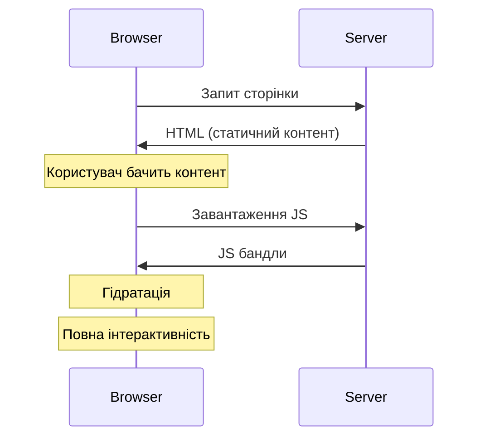
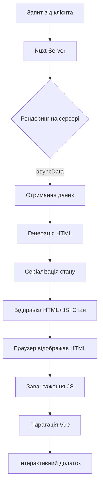
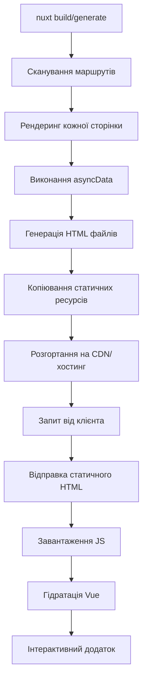

# Vue 3: SSR vs SSG

## Загальний огляд

Server-Side Rendering (SSR) та Static Site Generation (SSG) — два потужні підходи до рендерингу веб-додатків, які вирішують проблеми традиційних Single-Page Applications (SPA). Вони пропонують кращий SEO, швидше початкове завантаження та покращену продуктивність.

## Пояснення концепцій

### Server-Side Rendering (SSR)

SSR генерує HTML на сервері для кожного запиту. Коли користувач переходить на URL, сервер запускає Vue додаток, рендерить компоненти у HTML та відправляє повністю сформовану сторінку клієнту.

**Коли використовувати:**

-   Для динамічного контенту, що часто змінюється
-   Коли потрібно персоналізувати контент для користувача
-   Для веб-додатків, де SEO критично важливий
-   Коли необхідне швидке початкове завантаження

### Static Site Generation (SSG)

SSG попередньо рендерить всі сторінки під час збірки в статичні HTML файли. Ці файли можуть бути розміщені на будь-якому статичному хостингу.

**Коли використовувати:**

-   Для контенту, що рідко змінюється
-   Для блогів, документації, маркетингових сайтів
-   Коли максимальна продуктивність є пріоритетом
-   Для проєктів з обмеженим бюджетом (дешевший хостинг)

### Порівняння SSR і SSG

| Характеристика                 | SSR                          | SSG                        |
| ------------------------------ | ---------------------------- | -------------------------- |
| Час генерації                  | При кожному запиті           | Під час збірки             |
| Швидкість першого завантаження | Швидко                       | Дуже швидко                |
| Свіжість даних                 | Завжди актуальні             | Актуальні на момент збірки |
| Навантаження на сервер         | Високе                       | Низьке                     |
| Складність розгортання         | Складніше                    | Просто                     |
| Масштабованість                | Потребує додаткових ресурсів | Легко масштабується        |

## Hydration

Hydration — це процес, при якому Vue "оживляє" статичний HTML, отриманий при SSR або SSG, додаючи до нього JavaScript функціональність.

### Як працює hydration

1. Сервер генерує HTML сторінки і відправляє його клієнту
2. Браузер відображає HTML (швидке початкове відображення)
3. JavaScript файли завантажуються
4. Vue "гідратує" DOM, прикріплюючи обробники подій та встановлюючи реактивність

```javascript
// Клієнтський вхідний файл з гідратацією
import { createSSRApp } from "vue";
import App from "./App.vue";

// Створюємо додаток з підтримкою SSR
const app = createSSRApp(App);

// Монтуємо з режимом гідратації
app.mount("#app", true); // Другий параметр вказує на гідратацію
```

### Підводні камені hydration

1. **Mismatch помилки** — коли DOM структура, згенерована на сервері, не відповідає тому, що очікує клієнтський Vue:

```javascript
// Серверний рендеринг
if (isServer) {
    return h("div", "Серверний контент");
}
// Клієнтський рендеринг
return h("span", "Клієнтський контент");
```

2. **Затримка гідратації** — час між відображенням HTML і повною інтерактивністю додатка



### Часткова та прогресивна гідратація

У Nuxt 3 реалізовані просунуті техніки гідратації:

```vue
<template>
    <!-- Цей компонент буде гідратований тільки коли він з'явиться у видимій області -->
    <LazyClientOnly>
        <ExpensiveComponent />
    </LazyClientOnly>

    <!-- Компонент, який виконується тільки на клієнті -->
    <ClientOnly>
        <InteractiveChart />
        <template #fallback>
            <StaticChartImage />
        </template>
    </ClientOnly>
</template>
```

## AsyncData і Fetch у Nuxt

Nuxt надає два основні методи для отримання даних у SSR та SSG: `asyncData` і `fetch`.

### AsyncData

`asyncData` — це хук, який виконується до створення компонента і дозволяє отримати дані, які будуть інтегровані зі стейтом компонента.

**Особливості:**

-   Виконується на сервері при SSR
-   Виконується в браузері при навігації на клієнті
-   Має доступ до контексту Nuxt
-   Результат зливається з даними компонента
-   Доступний тільки на рівні сторінок (pages)

**Nuxt 2 (Options API):**

```javascript
export default {
    async asyncData({ $axios, params }) {
        const post = await $axios.$get(`/api/posts/${params.id}`);
        return { post };
    },
};
```

**Nuxt 3 (Composition API):**

```vue
<script setup>
const { data: post } = await useAsyncData("post", () => {
    return $fetch(`/api/posts/${route.params.id}`);
});
</script>
```

### Fetch

`fetch` — хук для отримання даних після ініціалізації компонента.

**Особливості:**

-   У Nuxt 2: подібний до asyncData, але не зливає дані з компонентом
-   У Nuxt 3: замінений на `useFetch` і `$fetch`
-   Може використовуватись у будь-якому компоненті
-   Підтримує кешування, повторні спроби та інші опції

**Nuxt 2:**

```javascript
export default {
    data() {
        return {
            posts: [],
        };
    },
    async fetch() {
        this.posts = await this.$axios.$get("/api/posts");
    },
};
```

**Nuxt 3:**

```vue
<script setup>
const {
    data: posts,
    pending,
    error,
    refresh,
} = await useFetch("/api/posts", {
    // Опції
    key: "blog-posts", // Унікальний ключ для кешування
    lazy: false, // Чи показувати зразу порожні дані
    server: true, // Чи робити запит на сервері
    default: () => [], // Значення за замовчуванням

    // Обробка та трансформація
    transform: (data) =>
        data.map((post) => ({
            ...post,
            createdAt: new Date(post.createdAt),
        })),
});

// Ручне оновлення даних
function updatePosts() {
    refresh();
}
</script>
```

### Порівняння asyncData і fetch/useFetch

| Характеристика        | asyncData       | fetch/useFetch            |
| --------------------- | --------------- | ------------------------- |
| Доступність           | Тільки сторінки | Будь-які компоненти       |
| Блокування рендерингу | Так             | Налаштовується            |
| Злиття з даними       | Автоматично     | Необхідно керувати вручну |
| Доступ до this        | Ні              | Так (у Nuxt 2)            |
| SSR підтримка         | Так             | Так                       |
| Кешування             | Базове          | Розширене                 |

## Реалізація SSR і SSG у Nuxt

### SSR Конфігурація

```javascript
// nuxt.config.js (Nuxt 3)
export default defineNuxtConfig({
    // SSR включений за замовчуванням
    ssr: true,

    // Додаткові налаштування
    nitro: {
        preset: "node-server", // Тип серверної платформи
        timing: true, // Вимірювання часу запитів
    },

    // Налаштування кешування
    routeRules: {
        // Кешування даної сторінки на 60 секунд
        "/blog/**": { swr: 60 },
        // Ніколи не кешувати
        "/admin/**": { cache: false },
    },
});
```

### SSG Конфігурація

```javascript
// nuxt.config.js (Nuxt 3)
export default defineNuxtConfig({
    // Конфігурація для SSG
    nitro: {
        preset: "static",
        // або
        prerender: {
            routes: ["/about", "/blog/post-1", "/blog/post-2"],
            crawlLinks: true, // Автоматичний обхід посилань
            ignore: ["/admin/**"], // Ігнорувати певні шляхи
        },
    },
});
```

### Динамічні маршрути в SSG

Для генерації сторінок з динамічними параметрами:

```javascript
// Створення файлу .js в папці /server/routes
// /server/routes/sitemap.xml.js
export default defineEventHandler(async (event) => {
    // Генерація даних для всіх сторінок
    const posts = await $fetch("/api/posts");

    // Надсилання цих шляхів для пререндерингу
    const routes = posts.map((post) => `/blog/${post.slug}`);

    // Додаємо маршрути для пререндерингу
    const nitro = useNitro();
    nitro.prerender.routes.push(...routes);

    // Відповідь для самого запиту
    return {
        // XML вміст сайтмапи
    };
});
```

## Підкапотні механізми

### Як працює SSR у Vue/Nuxt

1. **Запит від клієнта** — браузер відправляє запит на сервер
2. **Серверний рендеринг** — Nuxt створює екземпляр Vue, виконує asyncData/fetch і рендерить HTML
3. **Передача стану** — серіалізація Vuex/Pinia стану та інших даних
4. **Відправка клієнту** — HTML + JS бандли + серіалізований стан
5. **Гідратація** — Vue на клієнті створює екземпляр з тим же станом і "оживляє" DOM



### Як працює SSG у Nuxt

1. **Збірка проєкту** — команда `nuxt build` або `nuxt generate`
2. **Визначення маршрутів** — сканування файлової системи та програмне визначення
3. **Рендеринг кожної сторінки** — виконання asyncData/fetch для кожного маршруту
4. **Створення статичних файлів** — HTML, JSON, CSS, JS
5. **Розгортання на CDN** — розміщення статичних файлів на хостингу



### Процес гідратації під капотом

```javascript
// Спрощений код того, як працює гідратація в Vue
function hydrate(app, container) {
    // 1. Зберігаємо оригінальний DOM
    const originalDom = container.cloneNode(true);

    // 2. Створюємо Virtual DOM на основі стану додатка
    const vdom = renderVirtualDom(app.state);

    // 3. Порівнюємо реальний DOM з Virtual DOM
    const patches = compareNodes(originalDom, vdom);

    // 4. Застосовуємо тільки необхідні зміни (обробники подій тощо)
    applyPatches(container, patches);

    // 5. Встановлюємо відстеження змін для реактивності
    setupReactivity(app, container);
}
```

## Оптимізація SSR і SSG

### Оптимізація продуктивності SSR

1. **Кешування на рівні сервера**:

    ```javascript
    // Використання серверного кешування в Nuxt 3
    export default defineEventHandler(async (event) => {
        // Кешування на рівні обробника
        const cachedData = await useStorage().getItem(`cache:${event.path}`);
        if (cachedData) return cachedData;

        const data = await expensiveOperation();
        await useStorage().setItem(`cache:${event.path}`, data, {
            ttl: 60 * 60, // 1 година
        });

        return data;
    });
    ```

2. **Оптимізація компонентів**:

    ```vue
    <template>
        <!-- Умовна гідратація для важких компонентів -->
        <LazyIslandComponent />

        <!-- Компоненти, які рендеряться тільки на клієнті -->
        <ClientOnly>
            <ComplexComponent />
        </ClientOnly>
    </template>
    ```

3. **Мінімізація блокуючих запитів**:
    ```javascript
    // Паралельні запити
    const [users, posts, comments] = await Promise.all([
        $fetch("/api/users"),
        $fetch("/api/posts"),
        $fetch("/api/comments"),
    ]);
    ```

### Оптимізація SSG

1. **Інкрементальна генерація сторінок**:

    ```javascript
    // nuxt.config.js
    export default defineNuxtConfig({
        nitro: {
            preset: "static",
            prerender: {
                // Генерувати частинами
                chunkSize: 100, // К-сть сторінок за один раз
                failOnError: false, // Продовжувати при помилках
            },
        },
    });
    ```

2. **Перевикористання компонентів**:

    ```vue
    <script setup>
    // KeepAlive для зменшення повторних рендерингів
    // при навігації
    </script>

    <template>
        <NuxtLayout>
            <KeepAlive>
                <NuxtPage />
            </KeepAlive>
        </NuxtLayout>
    </template>
    ```

3. **Часткове оновлення (revalidation)**:
    ```javascript
    // Endpoint для тригеру перебудови
    // /server/api/revalidate.js
    export default defineEventHandler(async (event) => {
        const { path, token } = getQuery(event);

        // Перевірка секретного токена
        if (token !== process.env.REVALIDATION_TOKEN) {
            return createError({ statusCode: 401, message: "Unauthorized" });
        }

        // Тригер перебудови для конкретного шляху
        await $fetch(`/api/_rebuild?path=${path}`);

        return { revalidated: true };
    });
    ```

## Підводні камені та найкращі практики

### Підводні камені

1. **Розміри бандлів** — великі JS файли сповільнюють гідратацію

    ```javascript
    // nuxt.config.js
    export default defineNuxtConfig({
        // Розділення коду
        vite: {
            build: {
                rollupOptions: {
                    output: {
                        manualChunks: (id) => {
                            if (id.includes("node_modules")) {
                                return "vendor";
                            }
                        },
                    },
                },
            },
        },
    });
    ```

2. **Робота з window/document у SSR** — призводить до помилок

    ```javascript
    // Безпечний доступ до API браузера
    onMounted(() => {
        // Тільки на клієнті
        window.addEventListener("scroll", handleScroll);
    });

    // Або
    const isBrowser = typeof window !== "undefined";
    if (isBrowser) {
        // Безпечний код
    }
    ```

3. **Помилки гідратації**
    ```vue
    <script setup>
    // Використання однакових даних на сервері і клієнті
    const { data } = await useAsyncData(
        "key",
        () => {
            return myApi.getData();
        },
        {
            // Важливо для уникнення mismatch
            server: true,
            client: true,
        }
    );
    </script>
    ```

### Найкращі практики

1. **Оптимальний вибір підходу**:

    - SSR: для додатків із частими змінами даних
    - SSG: для статичного або рідко оновлюваного контенту
    - Гібридний підхід: поєднання обох для різних маршрутів

2. **Керування даними**:

    ```javascript
    // Композиційні функції для багаторазового використання
    // composables/useArticle.js
    export function useArticle(slug) {
        return useAsyncData(
            `article:${slug}`,
            () => {
                return $fetch(`/api/articles/${slug}`);
            },
            {
                transform: (article) => ({
                    ...article,
                    formattedDate: new Date(article.date).toLocaleDateString(),
                }),
                server: true,
                client: true,
            }
        );
    }
    ```

3. **Моніторинг і аналітика**:
    ```javascript
    // nuxt.config.js
    export default defineNuxtConfig({
        modules: ["@nuxtjs/sentry"],
        sentry: {
            dsn: "SENTRY_DSN",
            tracesSampleRate: 0.5,
            // Відстеження продуктивності гідратації
            vueOptions: {
                tracing: true,
                tracingOptions: {
                    hooks: ["mount", "update"],
                    timeout: 2000,
                },
            },
        },
    });
    ```

## Висновки

Server-Side Rendering (SSR) і Static Site Generation (SSG) є потужними підходами до рендерингу веб-додатків, які вирішують різні проблеми і мають свої переваги та недоліки.

SSR забезпечує найсвіжіші дані для кожного запиту, ідеальний для динамічного контенту, але вимагає більш потужного серверного середовища. SSG забезпечує максимальну продуктивність і безпеку, але обмежений у частоті оновлення контенту.

Обидва підходи використовують процес гідратації для "оживлення" статичного HTML, а Nuxt надає інструменти asyncData і fetch/useFetch для ефективного отримання та обробки даних у обох режимах.

Вибір між SSR, SSG або гібридним підходом повинен ґрунтуватися на конкретних вимогах проєкту, характері даних і потребах користувачів.
