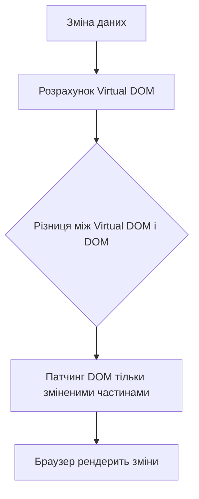
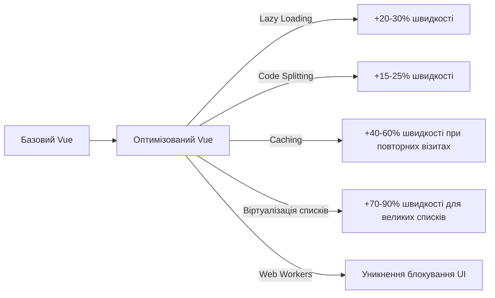
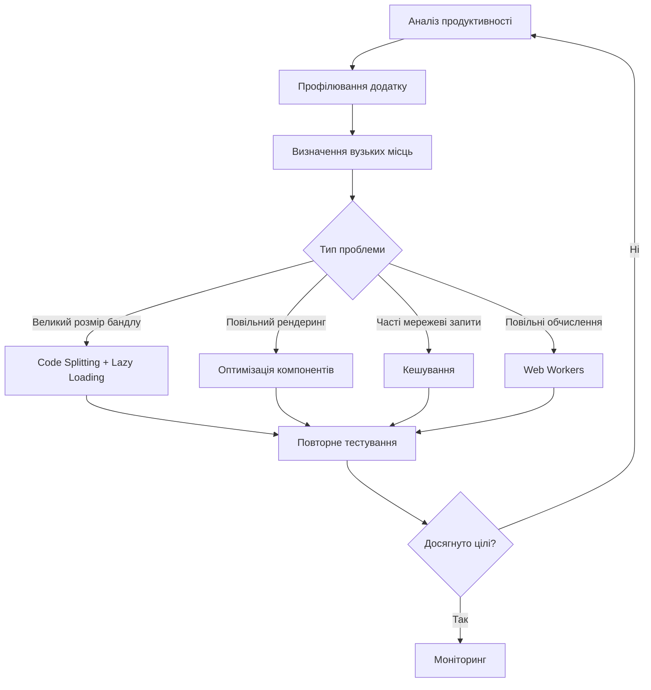
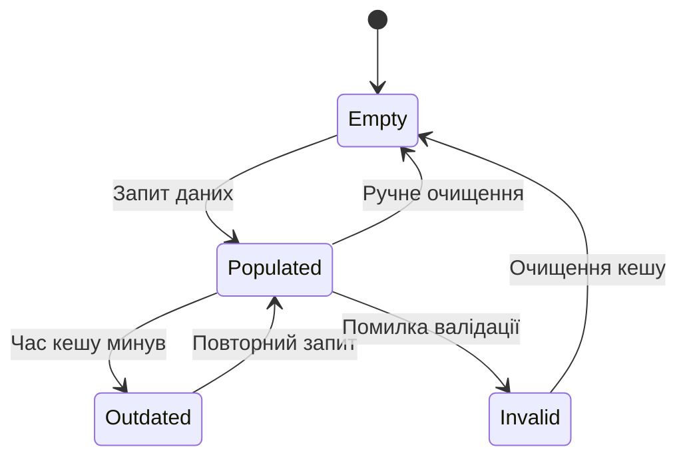

# Vue 3: Оптимізація продуктивності

## Загальний огляд

Оптимізація продуктивності Vue 3 додатків є критично важливою для забезпечення швидкого завантаження, плавної роботи інтерфейсу та ефективного використання ресурсів. Сучасні веб-додатки стають все складнішими, і без належної оптимізації можуть виникати проблеми з продуктивністю, які негативно впливають на користувацький досвід.

У цьому розділі ми розглянемо ключові техніки оптимізації Vue 3 додатків: lazy loading (ліниве завантаження), code splitting (розділення коду) та caching (кешування), а також інші важливі стратегії підвищення продуктивності.

## Lazy Loading (ліниве завантаження)

Lazy loading — це техніка, яка відкладає завантаження ресурсів до моменту, коли вони дійсно потрібні. Це дозволяє значно зменшити розмір початкового бандлу і прискорити час завантаження додатку.

### Лінивий імпорт компонентів

Vue 3 нативно підтримує лінивий імпорт компонентів за допомогою функції `defineAsyncComponent`:

```javascript
// Звичайний (жадібний) імпорт
import HeavyComponent from "./HeavyComponent.vue";

// Лінивий імпорт
import { defineAsyncComponent } from "vue";

const LazyHeavyComponent = defineAsyncComponent(() =>
    import("./HeavyComponent.vue")
);

// Лінивий імпорт з додатковими опціями
const LazyComponentWithOptions = defineAsyncComponent({
    loader: () => import("./HeavyComponent.vue"),
    loadingComponent: LoadingSpinner,
    errorComponent: ErrorDisplay,
    delay: 200, // мс перед показом loadingComponent
    timeout: 3000, // мс до таймауту
    suspensible: true, // взаємодія з <Suspense>
    onError(error, retry, fail, attempts) {
        if (attempts < 3) {
            // Повторна спроба при помилці
            retry();
        } else {
            fail();
        }
    },
});
```

### Лінивий імпорт маршрутів у Vue Router

Використання лінивого завантаження маршрутів зменшує початковий розмір бандлу:

```javascript
// router/index.js
import { createRouter, createWebHistory } from "vue-router";

const routes = [
    {
        path: "/",
        name: "Home",
        component: () =>
            import(/* webpackChunkName: "home" */ "@/views/Home.vue"),
    },
    {
        path: "/about",
        name: "About",
        // Маршрут буде завантажено лише коли користувач перейде на нього
        component: () =>
            import(/* webpackChunkName: "about" */ "@/views/About.vue"),
    },
    {
        path: "/admin",
        name: "Admin",
        component: () =>
            import(/* webpackChunkName: "admin" */ "@/views/Admin.vue"),
        // Вкладені маршрути також можуть бути лінивими
        children: [
            {
                path: "dashboard",
                component: () =>
                    import(
                        /* webpackChunkName: "admin-dashboard" */ "@/views/admin/Dashboard.vue"
                    ),
            },
        ],
    },
];

const router = createRouter({
    history: createWebHistory(),
    routes,
});

export default router;
```

### Лінивий імпорт Vue плагінів та бібліотек

Деякі плагіни можуть бути завантажені лише тоді, коли вони потрібні:

```javascript
// main.js
import { createApp } from "vue";
import App from "./App.vue";

const app = createApp(App);

// Лінивий імпорт VueI18n, який використовується не на всіх сторінках
if (window.location.pathname.includes("/international/")) {
    import("./plugins/i18n").then(({ setupI18n }) => {
        setupI18n(app);
        app.mount("#app");
    });
} else {
    app.mount("#app");
}
```

### Ліниве завантаження зображень та інших ресурсів

Для зображень можна використовувати атрибут `loading="lazy"` або Intersection Observer API:

```vue
<template>
    <!-- Нативне ліниве завантаження HTML5 -->
    

    <!-- Використання Intersection Observer API -->
    
</template>

<script setup>
import { ref, onMounted } from "vue";

const lazyImage = ref(null);
const imageUrl = "large-image.jpg";

onMounted(() => {
    const observer = new IntersectionObserver((entries) => {
        entries.forEach((entry) => {
            if (entry.isIntersecting) {
                // Завантажуємо зображення, коли воно з'являється у видимій області
                const img = entry.target;
                img.src = img.dataset.src;
                observer.unobserve(img);
            }
        });
    });

    if (lazyImage.value) {
        observer.observe(lazyImage.value);
    }
});
</script>
```

### Використання `<Suspense>` для асинхронних компонентів

Vue 3 надає компонент `<Suspense>`, який дозволяє відображати fallback-контент, поки асинхронні компоненти завантажуються:

```vue
<template>
    <Suspense>
        <template #default>
            <AsyncComponent />
        </template>
        <template #fallback>
            <div>Завантаження...</div>
        </template>
    </Suspense>
</template>

<script setup>
import { defineAsyncComponent } from "vue";

const AsyncComponent = defineAsyncComponent(() =>
    import("./HeavyComponent.vue")
);
</script>
```

## Code Splitting (розділення коду)

Code splitting — це техніка розділення коду на менші частини (чанки), які можуть бути завантажені на вимогу. Вона тісно пов'язана з лінивим завантаженням і дозволяє оптимізувати початковий розмір бандлу.

### Автоматичне розділення коду у Vue 3

Vue 3 з Vite або Webpack автоматично підтримує розділення коду при використанні динамічного імпорту:

```javascript
// Цей імпорт створить окремий чанк
const AdminPanel = () => import("./components/AdminPanel.vue");
```

### Налаштування Webpack для оптимального розділення коду

Якщо ви використовуєте Vue CLI (на основі Webpack), можна додатково налаштувати розділення коду:

```javascript
// vue.config.js
module.exports = {
    chainWebpack: (config) => {
        config.optimization.splitChunks({
            chunks: "all",
            maxInitialRequests: Infinity,
            minSize: 20000,
            cacheGroups: {
                vendor: {
                    test: /[\\/]node_modules[\\/]/,
                    name(module) {
                        // Отримуємо назву пакету з node_modules
                        const packageName = module.context.match(
                            /[\\/]node_modules[\\/](.*?)([\\/]|$)/
                        )[1];
                        return `npm.${packageName.replace("@", "")}`;
                    },
                },
            },
        });
    },
};
```

### Налаштування Vite для розділення коду

Vite (рекомендований інструмент збірки для Vue 3) має вбудовану підтримку розділення коду, яку можна додатково налаштувати:

```javascript
// vite.config.js
export default {
    build: {
        rollupOptions: {
            output: {
                manualChunks: {
                    vendor: ["vue", "vue-router", "pinia"],
                    ui: ["your-ui-library"],
                    utils: ["date-fns", "lodash-es"],
                },
            },
        },
        chunkSizeWarningLimit: 600, // kB
    },
};
```

### Динамічні імпорти з іменованими чанками

Іменування чанків допомагає відстежувати та оптимізувати завантаження:

```javascript
// Webpack
const UserProfile = () =>
    import(
        /* webpackChunkName: "user-profile" */
        "./components/UserProfile.vue"
    );

// Vite
const UserProfile = () =>
    import(
        /* @vite-ignore */
        "./components/UserProfile.vue"
    );
```

### Попереднє завантаження (prefetching) і попереднє отримання (preloading)

Браузери можуть заздалегідь завантажувати ресурси, що покращує UX:

```html
<!-- Префетчинг — низький пріоритет, завантажується в фоні -->
<link rel="prefetch" href="chunk-for-user-profile.js" />

<!-- Прелоадинг — високий пріоритет, завантажується зразу -->
<link rel="preload" href="critical-style.css" as="style" />
```

Vue Router може автоматично додавати префетчинг для майбутніх маршрутів:

```javascript
// router/index.js
const router = createRouter({
    history: createWebHistory(),
    routes,
    scrollBehavior() {
        /* ... */
    },
    // Автоматичний префетчинг майбутніх маршрутів
    linkExactActiveClass: "exact-active",
});

// Для Vue CLI можна налаштувати в vue.config.js
module.exports = {
    chainWebpack: (config) => {
        config.plugin("prefetch").tap((options) => {
            options[0].fileBlacklist = [
                /\.map$/,
                /admin-chunk(.*)\.js$/, // Не префетчити адмін-панель
            ];
            return options;
        });
    },
};
```

## Caching (кешування)

Кешування дозволяє зберігати та повторно використовувати дані без необхідності їх повторного отримання або обчислення. У Vue 3 застосовуються різні стратегії кешування для оптимізації продуктивності.

### Кешування компонентів з `<KeepAlive>`

`<KeepAlive>` дозволяє зберігати стан компонентів у пам'яті, уникаючи повторного рендерингу:

```vue
<template>
    <button @click="currentTab = 'Tab1'">Tab 1</button>
    <button @click="currentTab = 'Tab2'">Tab 2</button>

    <KeepAlive :max="5">
        <!-- Максимум 5 компонентів у кеші -->
        <component :is="currentTab"></component>
    </KeepAlive>
</template>

<script setup>
import { ref, shallowRef } from "vue";
import Tab1 from "./Tab1.vue";
import Tab2 from "./Tab2.vue";

const currentTab = ref("Tab1");
// shallowRef для оптимізації, коли об'єкт не потребує реактивності внутрішньої структури
const tabs = shallowRef({
    Tab1,
    Tab2,
});
</script>
```

Можна включати/виключати кешування для певних компонентів:

```vue
<template>
    <KeepAlive
        :include="['UserProfile', 'UserPosts']"
        :exclude="['UserSettings']"
    >
        <component :is="currentComponent" />
    </KeepAlive>
</template>
```

### Кешування API запитів у Composition API

```vue
<script setup>
import { ref, watch } from "vue";
import axios from "axios";

const userId = ref(1);
const userData = ref(null);
const loading = ref(false);
const cache = new Map();

watch(
    userId,
    async (newId) => {
        if (cache.has(newId)) {
            // Використовуємо кешовані дані
            userData.value = cache.get(newId);
            return;
        }

        loading.value = true;
        try {
            const response = await axios.get(
                `https://api.example.com/users/${newId}`
            );
            userData.value = response.data;
            // Зберігаємо в кеш
            cache.set(newId, response.data);
        } catch (error) {
            console.error(error);
        } finally {
            loading.value = false;
        }
    },
    { immediate: true }
);
</script>
```

### Composable для кешування API запитів

Створення повторно використовуваної функції для кешування API:

```javascript
// composables/useApiCache.js
import { ref } from "vue";
import axios from "axios";

// Глобальний кеш, що зберігається між викликами функції
const globalCache = new Map();

export function useApiCache(baseUrl, options = {}) {
    const {
        cacheTime = 5 * 60 * 1000, // 5 хвилин за замовчуванням
        localStorage = false, // Опція для зберігання в localStorage
        storageKey = "api-cache",
    } = options;

    // Ініціалізація кешу з localStorage, якщо включено
    if (localStorage && globalCache.size === 0) {
        try {
            const storedCache = window.localStorage.getItem(storageKey);
            if (storedCache) {
                const parsed = JSON.parse(storedCache);
                Object.entries(parsed).forEach(([key, { data, timestamp }]) => {
                    // Перевірка валідності кешу
                    if (Date.now() - timestamp < cacheTime) {
                        globalCache.set(key, { data, timestamp });
                    }
                });
            }
        } catch (e) {
            console.error("Error loading cache from localStorage", e);
        }
    }

    // Функція для збереження кешу в localStorage
    const saveToStorage = () => {
        if (!localStorage) return;

        const cacheObject = {};
        globalCache.forEach((value, key) => {
            cacheObject[key] = value;
        });

        try {
            window.localStorage.setItem(
                storageKey,
                JSON.stringify(cacheObject)
            );
        } catch (e) {
            console.error("Error saving cache to localStorage", e);
        }
    };

    // Функція для отримання даних з кешем
    const fetchWithCache = async (endpoint, config = {}) => {
        const cacheKey = `${baseUrl}${endpoint}${JSON.stringify(config)}`;
        const loading = ref(false);
        const error = ref(null);
        const data = ref(null);

        // Перевірка кешу
        if (globalCache.has(cacheKey)) {
            const cachedData = globalCache.get(cacheKey);
            // Перевірка валідності кешу
            if (Date.now() - cachedData.timestamp < cacheTime) {
                data.value = cachedData.data;
                return { data, loading, error, refresh };
            }
        }

        // Функція для оновлення даних
        const refresh = async () => {
            loading.value = true;
            error.value = null;

            try {
                const response = await axios.get(
                    `${baseUrl}${endpoint}`,
                    config
                );
                data.value = response.data;

                // Оновлення кешу
                globalCache.set(cacheKey, {
                    data: response.data,
                    timestamp: Date.now(),
                });

                saveToStorage();
            } catch (err) {
                error.value = err;
                console.error(`Error fetching ${baseUrl}${endpoint}:`, err);
            } finally {
                loading.value = false;
            }
        };

        // Початкове завантаження
        await refresh();

        return { data, loading, error, refresh };
    };

    // Функція для очищення кешу
    const clearCache = (endpoint = null) => {
        if (endpoint) {
            // Видалення конкретного ендпоінту
            const cacheKey = `${baseUrl}${endpoint}`;
            globalCache.delete(cacheKey);
        } else {
            // Видалення всього кешу
            globalCache.clear();
        }

        saveToStorage();
    };

    return {
        fetch: fetchWithCache,
        clearCache,
    };
}
```

Використання створеного composable:

```vue
<script setup>
import { useApiCache } from "@/composables/useApiCache";

const { fetch, clearCache } = useApiCache("https://api.example.com", {
    cacheTime: 10 * 60 * 1000, // 10 хвилин
    localStorage: true,
});

const { data: users, loading, error, refresh } = await fetch("/users");
</script>

<template>
    <div v-if="loading">Завантаження...</div>
    <div v-else-if="error">Помилка: {{ error.message }}</div>
    <div v-else>
        <ul>
            <li v-for="user in users" :key="user.id">{{ user.name }}</li>
        </ul>
        <button @click="refresh">Оновити</button>
        <button @click="clearCache('/users')">Очистити кеш</button>
    </div>
</template>
```

### Кешування в Pinia

Інтеграція кешування в сховище Pinia:

```javascript
// stores/users.js
import { defineStore } from "pinia";
import axios from "axios";

export const useUsersStore = defineStore("users", {
    state: () => ({
        users: [],
        loading: false,
        error: null,
        cache: {},
        lastFetch: null,
    }),

    getters: {
        getUser: (state) => (id) => {
            return state.users.find((user) => user.id === id);
        },

        isCacheValid: (state) => {
            // Кеш дійсний 5 хвилин
            return (
                state.lastFetch && Date.now() - state.lastFetch < 5 * 60 * 1000
            );
        },
    },

    actions: {
        async fetchUsers() {
            // Використовуємо кеш, якщо він валідний
            if (this.isCacheValid) {
                return this.users;
            }

            this.loading = true;
            this.error = null;

            try {
                const response = await axios.get(
                    "https://api.example.com/users"
                );
                this.users = response.data;
                this.lastFetch = Date.now();

                // Зберігаємо в localStorage для персистентності
                localStorage.setItem(
                    "users-cache",
                    JSON.stringify({
                        users: this.users,
                        timestamp: this.lastFetch,
                    })
                );
            } catch (error) {
                this.error = error;
                console.error("Error fetching users:", error);
            } finally {
                this.loading = false;
            }
        },

        async fetchUserById(id) {
            // Перевірка кешу для конкретного користувача
            if (
                this.cache[id] &&
                Date.now() - this.cache[id].timestamp < 5 * 60 * 1000
            ) {
                return this.cache[id].data;
            }

            try {
                const response = await axios.get(
                    `https://api.example.com/users/${id}`
                );
                // Оновлення кешу
                this.cache[id] = {
                    data: response.data,
                    timestamp: Date.now(),
                };
                return response.data;
            } catch (error) {
                console.error(`Error fetching user ${id}:`, error);
                throw error;
            }
        },

        // Ініціалізація сховища з localStorage
        initFromCache() {
            try {
                const cachedData = localStorage.getItem("users-cache");
                if (cachedData) {
                    const { users, timestamp } = JSON.parse(cachedData);
                    // Перевірка валідності кешу
                    if (Date.now() - timestamp < 5 * 60 * 1000) {
                        this.users = users;
                        this.lastFetch = timestamp;
                    }
                }
            } catch (e) {
                console.error("Error loading from cache:", e);
            }
        },

        clearCache() {
            this.users = [];
            this.cache = {};
            this.lastFetch = null;
            localStorage.removeItem("users-cache");
        },
    },
});
```

### HTTP-кешування через Service Worker

Використання Service Worker для кешування API запитів:

```javascript
// service-worker.js
// Версія кешу для контролю оновлень
const CACHE_VERSION = "v1";
const CACHE_NAME = `app-cache-${CACHE_VERSION}`;

// Ресурси для попереднього кешування
const PRECACHE_URLS = [
    "/",
    "/index.html",
    "/app.js",
    "/app.css",
    "/offline.html",
];

// Встановлення Service Worker
self.addEventListener("install", (event) => {
    event.waitUntil(
        caches
            .open(CACHE_NAME)
            .then((cache) => cache.addAll(PRECACHE_URLS))
            .then(() => self.skipWaiting())
    );
});

// Активація Service Worker і очищення старих кешів
self.addEventListener("activate", (event) => {
    event.waitUntil(
        caches
            .keys()
            .then((cacheNames) => {
                return Promise.all(
                    cacheNames
                        .filter((name) => name !== CACHE_NAME)
                        .map((name) => caches.delete(name))
                );
            })
            .then(() => self.clients.claim())
    );
});

// Стратегія кешування для різних запитів
self.addEventListener("fetch", (event) => {
    const url = new URL(event.request.url);

    // Стратегія для API запитів: Network First, потім кеш
    if (url.pathname.startsWith("/api/")) {
        event.respondWith(networkFirstStrategy(event.request));
    }
    // Стратегія для статичних ресурсів: Кеш First, потім мережа
    else if (url.pathname.match(/\.(js|css|png|jpg|jpeg|svg|ico)$/)) {
        event.respondWith(cacheFirstStrategy(event.request));
    }
    // Стратегія для HTML: Network First
    else {
        event.respondWith(networkFirstStrategy(event.request));
    }
});

// Стратегія "Спочатку мережа"
function networkFirstStrategy(request) {
    return fetch(request)
        .then((response) => {
            // Клонуємо відповідь, бо вона може бути використана тільки раз
            const responseClone = response.clone();

            if (response.ok) {
                caches.open(CACHE_NAME).then((cache) => {
                    // Кешуємо успішну відповідь
                    cache.put(request, responseClone);
                });
            }

            return response;
        })
        .catch(() => {
            // Якщо мережа недоступна, спробуємо з кешу
            return caches.match(request).then((cachedResponse) => {
                return cachedResponse || caches.match("/offline.html");
            });
        });
}

// Стратегія "Спочатку кеш"
function cacheFirstStrategy(request) {
    return caches.match(request).then((cachedResponse) => {
        // Якщо є в кеші, відразу повертаємо
        if (cachedResponse) {
            return cachedResponse;
        }

        // Інакше звертаємось до мережі
        return fetch(request).then((response) => {
            // Клонуємо відповідь
            const responseClone = response.clone();

            if (response.ok) {
                caches.open(CACHE_NAME).then((cache) => {
                    // Кешуємо нову відповідь
                    cache.put(request, responseClone);
                });
            }

            return response;
        });
    });
}
```

Реєстрація Service Worker у Vue додатку:

```javascript
// main.js
if ("serviceWorker" in navigator) {
    window.addEventListener("load", () => {
        navigator.serviceWorker
            .register("/service-worker.js")
            .then((registration) => {
                console.log("SW registered:", registration);
            })
            .catch((error) => {
                console.log("SW registration failed:", error);
            });
    });
}
```

## Підкапотні механізми оптимізації

### Рендеринг Vue компонентів

Vue 3 використовує Virtual DOM для оптимізації рендерингу:



Vue 3 додатково оптимізує цей процес через:

1. **Статичне визначення хукінгу** - аналіз компонентів під час компіляції для визначення статичних частин, які не потребують перерендерингу.

2. **Tree-shaking** - видалення невикористаного коду.

3. **Hoisting** - підняття статичних вузлів поза циклами рендерингу.

```vue
<template>
    <div>
        <!-- Статичний контент буде підданий hoisting -->
        <h1>Статичний заголовок</h1>

        <!-- Динамічний контент потребує оновлення -->
        <p>{{ message }}</p>

        <!-- v-once означає, що контент буде відрендерений тільки раз -->
        <div v-once>
            <ComplexComponent />
        </div>
    </div>
</template>
```

### Memory Leaks та оптимізація пам'яті

Важливо уникати витоків пам'яті:

```javascript
// Компонент з потенційним витоком пам'яті
export default {
    setup() {
        // Глобальний обробник подій
        window.addEventListener("resize", this.handleResize);

        // Таймер
        const timer = setInterval(() => {
            this.checkUpdates();
        }, 5000);

        // Очищення ресурсів при демонтажі компонента
        onUnmounted(() => {
            window.removeEventListener("resize", this.handleResize);
            clearInterval(timer);
        });
    },
};
```

### Оптимізація реактивності

Vue 3 надає інструменти для точного контролю реактивності:

```javascript
import { ref, shallowRef, triggerRef, readonly, markRaw } from "vue";

// Звичайний ref - глибока реактивність
const deepRef = ref({ nested: { value: 1 } });

// Поверхнева реактивність - тільки для root властивості
const shallow = shallowRef({ nested: { value: 1 } });
shallow.value.nested.value = 2; // Не викличе оновлення
shallow.value = { nested: { value: 2 } }; // Викличе оновлення

// Примусове оновлення shallow ref
triggerRef(shallow);

// Для великих об'єктів, які не повинні бути реактивними
const rawObject = markRaw({ huge: "data" });

// Для даних, які не повинні змінюватись
const readOnlyState = readonly(ref({ important: "data" }));
```

## Додаткові техніки оптимізації

### Віртуалізація великих списків

Для списків з тисячами елементів варто використовувати віртуалізацію:

```vue
<template>
    <RecycleScroller
        class="scroller"
        :items="items"
        :item-size="50"
        key-field="id"
    >
        <template #default="{ item }">
            <div class="user-item">
                {{ item.name }}
            </div>
        </template>
    </RecycleScroller>
</template>

<script setup>
import { RecycleScroller } from "vue-virtual-scroller";
import "vue-virtual-scroller/dist/vue-virtual-scroller.css";

// Тисячі елементів
const items = ref(
    Array.from({ length: 10000 }, (_, i) => ({
        id: i,
        name: `User ${i}`,
    }))
);
</script>
```

### Web Workers для важких обчислень

Використання Web Workers для перенесення важких обчислень у фоновий потік:

```javascript
// worker.js
self.addEventListener("message", (event) => {
    const { data, operation } = event.data;

    let result;
    switch (operation) {
        case "processLargeData":
            result = processLargeData(data);
            break;
        case "calculateStats":
            result = calculateStats(data);
            break;
        default:
            result = { error: "Unknown operation" };
    }

    self.postMessage(result);
});

function processLargeData(data) {
    // Важкі обчислення
    return transformedData;
}

function calculateStats(data) {
    // Аналіз даних
    return stats;
}
```

Використання у Vue компоненті:

```vue
<script setup>
import { ref, onMounted, onBeforeUnmount } from "vue";

const result = ref(null);
const loading = ref(false);
const worker = ref(null);

onMounted(() => {
    // Створення Web Worker
    worker.value = new Worker("/worker.js");

    // Обробка відповідей від воркера
    worker.value.addEventListener("message", (event) => {
        result.value = event.data;
        loading.value = false;
    });
});

const processData = (data) => {
    loading.value = true;
    // Відправка даних у воркер
    worker.value.postMessage({
        data,
        operation: "processLargeData",
    });
};

onBeforeUnmount(() => {
    // Завершення воркера при знищенні компонента
    if (worker.value) {
        worker.value.terminate();
    }
});
</script>
```

### Оптимізація рендерингу списків

Правильне використання `key` для оптимізації рендерингу списків:

```vue
<template>
    <!-- Неоптимально: використання індексу як key -->
    <div v-for="(item, index) in items" :key="index">
        {{ item.name }}
    </div>

    <!-- Оптимально: використання унікального ID -->
    <div v-for="item in items" :key="item.id">
        {{ item.name }}
    </div>
</template>
```

### Критичний CSS і уникнення Flash of Unstyled Content (FOUC)

```vue
<!-- App.vue -->
<template>
    <div id="app">
        <!-- Вміст додатку -->
    </div>
</template>

<script>
export default {
    // ...
};
</script>

<!-- Інлайн критичні стилі для швидкого рендерингу -->
<style>
/* Критичні стилі для видимої частини першого екрану */
body {
    margin: 0;
    font-family: Arial, sans-serif;
}

#app {
    display: flex;
    flex-direction: column;
    min-height: 100vh;
}

.header {
    background: #333;
    color: white;
    padding: 1rem;
}
</style>

<!-- Некритичні стилі завантажуються асинхронно -->
<style src="./non-critical.css" async></style>
```

### Оптимізація залежностей

Використання сучасних, оптимізованих залежностей та їх аналіз:

```bash
# Аналіз розміру бандлу
npm install -g webpack-bundle-analyzer

# Для проєктів на Vue CLI
vue-cli-service build --report

# Для проєктів на Vite
npx vite-bundle-visualizer
```

Заміна важких залежностей на легші альтернативи:

```javascript
// Замість повного lodash
import debounce from "lodash/debounce";
// або навіть краще
import debounce from "lodash-es/debounce";

// Замість moment.js
import { format } from "date-fns";
```

## Схеми та діаграми

### Порівняння продуктивності різних підходів



### Процес оптимізації проєкту Vue 3



### Життєвий цикл кешу в додатку



## Підводні камені та найкращі практики

### Підводні камені

1. **Над-оптимізація** — не оптимізуйте, поки це не потрібно:

    ```javascript
    // Вимірюйте перед оптимізацією
    console.time("operation");
    // Операція
    console.timeEnd("operation");
    ```

2. **Відкладена гідратація** може спричинити проблеми з інтерактивністю:

    ```javascript
    // Ризиковане відкладання гідратації для критичних елементів
    import { nextTick } from "vue";

    // Гідратація після рендерингу
    nextTick(() => {
        // Користувач може спробувати взаємодіяти до гідратації
    });
    ```

3. **Забагато чанків** може призвести до надмірної кількості запитів:

    ```javascript
    // Погано: занадто дрібне розділення
    const TinyComponent1 = () => import("./TinyComponent1.vue"); // 2KB
    const TinyComponent2 = () => import("./TinyComponent2.vue"); // 3KB
    const TinyComponent3 = () => import("./TinyComponent3.vue"); // 1KB

    // Краще: логічне групування
    const AdminComponents = () => import("./admin/index.js"); // Експортує все разом
    ```

### Найкращі практики

1. **Вимірюйте перед оптимізацією**:

    ```javascript
    // Використовуйте Vue DevTools і Performance панель Chrome

    // Для вимірювання продуктивності компонентів
    import { markRaw } from "vue";

    // Відключення реактивності для великих, незмінних об'єктів
    const largeData = markRaw(fetchLargeData());
    ```

2. **Поступове покращення**:

    ```javascript
    // Використовуйте динамічні імпорти з умовами
    if (process.client && "IntersectionObserver" in window) {
        import("./image-lazy-loader.js").then((module) => {
            module.default.init();
        });
    } else {
        // Fallback для старих браузерів
    }
    ```

3. **Пріоритизація ресурсів**:

    ```html
    <!-- Critical CSS інлайн у head -->
    <style>
        /* Critical CSS */
    </style>

    <!-- Прелоадинг важливих ресурсів -->
    <link
        rel="preload"
        href="/fonts/important-font.woff2"
        as="font"
        type="font/woff2"
        crossorigin
    />

    <!-- Префетчинг наступних сторінок -->
    <link rel="prefetch" href="/js/about.js" />
    ```

4. **Метрики користувацького досвіду**:

    ```javascript
    // Відстеження Web Vitals
    import { onCLS, onFID, onLCP } from "web-vitals";

    function sendToAnalytics({ name, delta, id }) {
        // Відправка метрик в аналітику
        console.log(name, delta, id);
    }

    onCLS(sendToAnalytics); // Cumulative Layout Shift
    onFID(sendToAnalytics); // First Input Delay
    onLCP(sendToAnalytics); // Largest Contentful Paint
    ```

5. **Адаптивне завантаження на основі мережі**:
    ```javascript
    // Визначення швидкості мережі
    if (navigator.connection) {
        const connection = navigator.connection;
        if (connection.saveData) {
            // Режим економії даних активний
            // Завантажуємо меншу кількість ресурсів
        }

        if (connection.effectiveType === "4g") {
            // Хороша мережа, можна завантажити більше
        } else if (connection.effectiveType === "2g") {
            // Повільна мережа, мінімізуємо завантаження
        }
    }
    ```

## Висновки

Оптимізація продуктивності Vue 3 додатків є багатогранним процесом, який включає в себе розділення коду, ліниве завантаження та кешування. Правильне застосування цих технік дозволяє створювати швидкі, відзивчиві додатки з відмінним користувацьким досвідом.

Основні принципи оптимізації:

1. **Вимірюйте перед оптимізацією** — знайдіть реальні вузькі місця
2. **Зменшуйте розмір бандлу** через code splitting та lazy loading
3. **Оптимізуйте рендеринг** за допомогою кешування та віртуалізації
4. **Зменшуйте мережеві запити** через кешування та локальне зберігання
5. **Фокусуйтеся на метриках користувацького досвіду** — FCP, LCP, CLS, TTI

Послідовне застосування цих принципів дозволить створити Vue 3 додаток, який працює швидко навіть на повільних пристроях та мережах.
