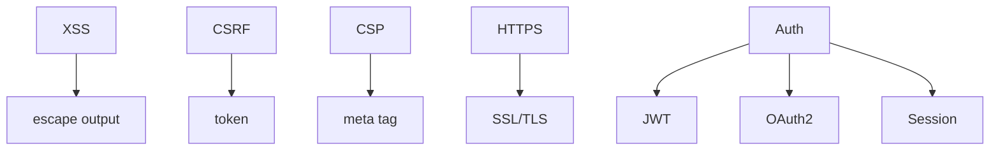

## 5.2. Security

### XSS Prevention

XSS (Cross-Site Scripting) — атака через вставку шкідливого коду у сторінку.
- Використовуйте автоматичне екранування у фреймворках (Vue, React).
- Не вставляйте дані напряму у HTML через `innerHTML`.
- Перевіряйте та фільтруйте введення користувача.

```js
// Vue: {{ userInput }} — безпечно
// document.body.innerHTML = userInput — небезпечно
```
- Використовуйте Content Security Policy.

---

### CSRF Protection

CSRF (Cross-Site Request Forgery) — атака через підробку запитів від імені користувача.
- Використовуйте токени CSRF у формах та API.
- Встановлюйте SameSite cookies.

```js
// Сервер: додає CSRF-токен у форму
<input type="hidden" name="csrf" value="TOKEN" />
```
- Перевіряйте токен на сервері при кожному запиті.

---

### Content Security Policy

CSP — політика, яка обмежує джерела скриптів, стилів, медіа.

```html
<meta http-equiv="Content-Security-Policy" content="default-src 'self'; script-src 'self' https://apis.google.com" />
```
- Захищає від XSS, підключення сторонніх скриптів.

---

### HTTPS

HTTPS — захищене з'єднання між клієнтом і сервером.
- Використовуйте SSL/TLS сертифікати.
- Перенаправляйте всі запити на HTTPS.

```js
// Express.js
app.use((req, res, next) => {
  if (req.protocol !== 'https') {
    res.redirect('https://' + req.headers.host + req.url);
  } else {
    next();
  }
});
```
- Захищає дані від перехоплення.

---

### Authentication Patterns

- JWT (JSON Web Token): токени для автентифікації.
- OAuth2: авторизація через сторонні сервіси.
- Session-based: збереження сесії на сервері.

```js
// JWT приклад
const token = jwt.sign({ userId: 1 }, 'secret');
// Перевірка токена
jwt.verify(token, 'secret');
```
- Використовуйте шифрування, зберігайте секрети у змінних середовища.

---

### Mermaid Diagram: Security


_Безпека у веб-розробці_

---

#### Navigation

- [Попередня тема: Performance Optimization](5.1-performance-optimization.md)
- [Наступна тема: Accessibility (A11y)](5.3-accessibility.md)
