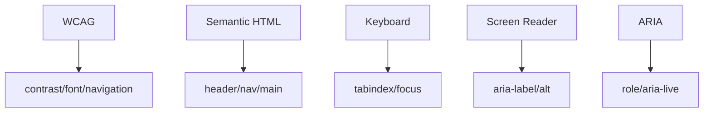

## 5.3. Accessibility (A11y)

### WCAG Guidelines

WCAG (Web Content Accessibility Guidelines) — міжнародний стандарт доступності.

-   Перевіряйте контрастність, розмір шрифту, навігацію.
-   Всі функції мають бути доступні з клавіатури.
-   Використовуйте семантичні елементи.

---

### Semantic HTML

Semantic HTML — використання тегів за призначенням (`<header>`, `<nav>`, `<main>`, `<button>`, `<form>`).

```html
<nav>
    <ul>
        <li><a href="/home">Home</a></li>
    </ul>
</nav>
```

-   Покращує доступність для скрінрідерів.

---

### Keyboard Navigation

Keyboard navigation — можливість керування сайтом з клавіатури.

-   Використовуйте `tabindex`, фокусовані елементи.
-   Всі інтерактивні елементи мають бути доступні через Tab.

```html
<button tabindex="0">Click</button>
```

-   Додавайте видимий фокус.

---

### Screen Reader Support

Screen reader support — коректне озвучення контенту для людей з вадами зору.

-   Використовуйте атрибути `aria-label`, `alt`, семантичні теги.

```html
 <button aria-label="Close">X</button>
```

-   Перевіряйте через NVDA, VoiceOver, JAWS.

---

### ARIA Attributes

ARIA (Accessible Rich Internet Applications) — атрибути для покращення доступності.

-   `aria-label`, `aria-labelledby`, `aria-describedby`, `aria-live`, `role`.

```html
<div role="alert" aria-live="assertive">Error!</div>
```

-   Використовуйте лише коли семантичних тегів недостатньо.

---

### Mermaid Diagram: Accessibility



_Доступність у веб-розробці_

---

#### Navigation

-   [Попередня тема: Security](5.2-security.md)
-   [Наступна тема: Internationalization (i18n)](5.4-internationalization.md)
