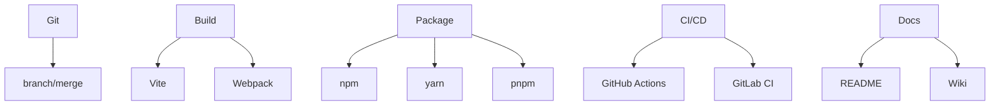

## 5.5. Development Workflow

### Version Control with Git

Git — система контролю версій для командної роботи та історії змін.

```bash
git init
git add .
git commit -m "Initial commit"
git branch feature/login
git merge feature/login
git log
```

-   Використовуйте GitHub, GitLab, Bitbucket для віддалених репозиторіїв.

---

### Build Tools (Vite, Webpack)

Build tools — автоматизація збірки, оптимізації, запуску додатків.

-   Vite — швидкий білдер для сучасних фреймворків.
-   Webpack — потужний білдер з гнучкою конфігурацією.

```js
// vite.config.js
import { defineConfig } from "vite";
export default defineConfig({
    /* ... */
});
// webpack.config.js
module.exports = { entry: "./src/index.js" /* ... */ };
```

-   Використовуйте для code splitting, hot reload, оптимізації.

---

### Package Management (npm, yarn, pnpm)

Package managers — керування залежностями та скриптами.

```bash
npm install vue
yarn add vue
pnpm add vue
```

-   Використовуйте lock-файли для стабільності.
-   npm — стандарт, yarn/pnpm — швидші альтернативи.

---

### CI/CD Pipelines

CI/CD (Continuous Integration/Continuous Deployment) — автоматизація тестування, збірки, деплою.

```yaml
# .github/workflows/ci.yml
name: CI
on: [push]
jobs:
    build:
        runs-on: ubuntu-latest
        steps:
            - uses: actions/checkout@v2
            - run: npm install
            - run: npm run build
            - run: npm test
```

-   Використовуйте GitHub Actions, GitLab CI, Jenkins.
-   Автоматичний деплой на сервер або хостинг.

---

### Documentation

Документація — опис коду, API, процесів для команди та користувачів.

-   Використовуйте README.md, Wiki, Storybook, JSDoc.

```md
# Project Title

## Installation

npm install

## Usage

npm run dev
```

-   Оновлюйте документацію при кожній зміні.

---

### Mermaid Diagram: Development Workflow



_Робочий процес розробки_

---

#### Navigation

-   [Попередня тема: Internationalization (i18n)](5.4-internationalization.md)
-   [Наступна тема: References and Resources](references-and-resources.md)
