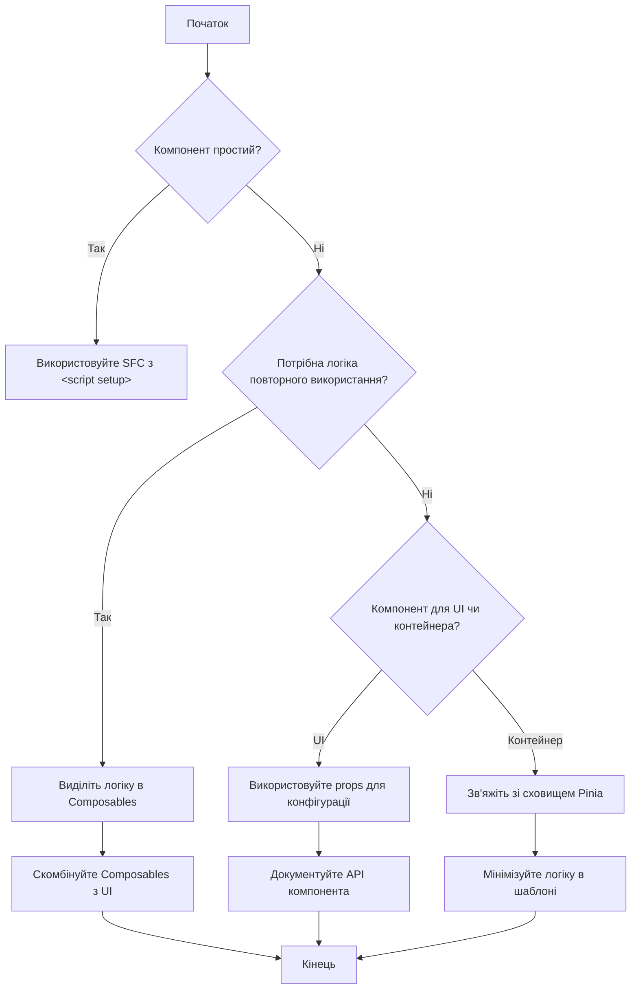
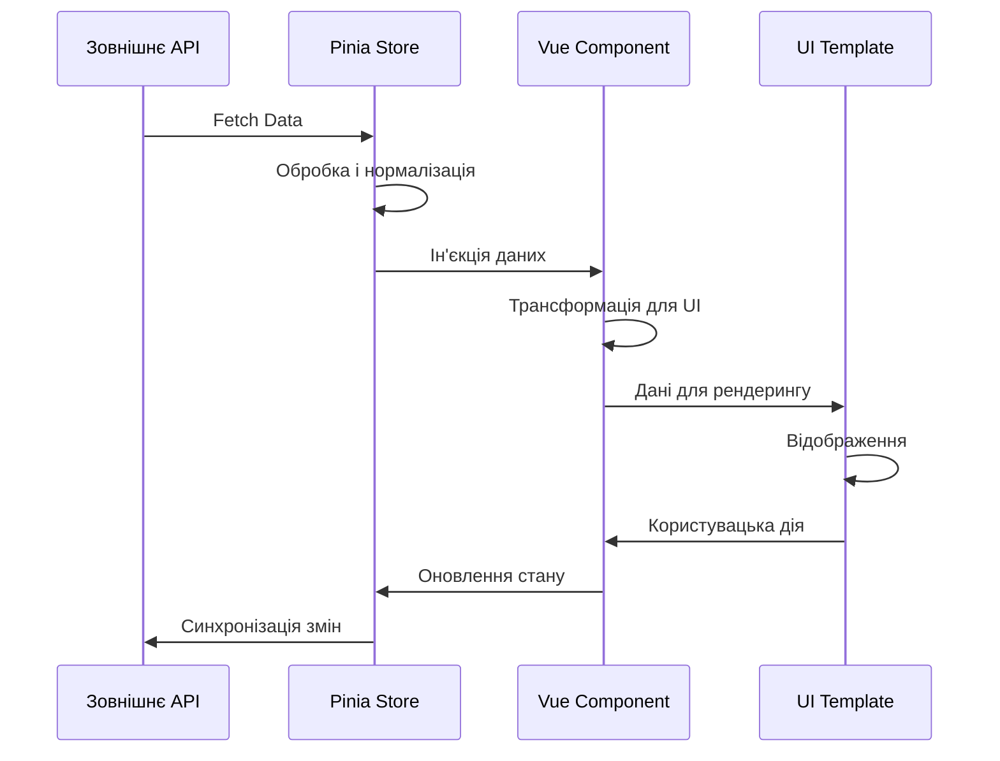

# Vue 3: Підводні камені та best practices

## Загальний огляд

Vue 3 є потужним та гнучким фреймворком, який пропонує багато шляхів вирішення одного й того ж завдання. Ця гнучкість — одночасно перевага та виклик. Знання поширених помилок, обмежень, підводних каменів і найкращих практик допоможе вам уникнути багатьох проблем та створювати ефективні, масштабовані та легко підтримувані додатки.

У цьому розділі ми розглянемо найпоширеніші помилки, які допускають розробники під час роботи з Vue 3, поглянемо на неочевидні моменти фреймворку та окреслимо найкращі практики, які слід застосовувати при розробці.

## Підводні камені Vue 3

### 1. Реактивність та її обмеження

Реактивна система Vue 3 має декілька нюансів, які можуть викликати неочікувану поведінку.

#### Проблеми з реактивністю масивів

```javascript
// Не спрацює! Vue не реагує на зміну елемента за індексом
const arr = reactive([1, 2, 3]);
arr[0] = 4; // Це не викличе оновлення шаблону

// Правильно:
arr.splice(0, 1, 4);
// або
const arr = ref([1, 2, 3]);
arr.value[0] = 4;
```

#### Втрата реактивності при деструктуризації

```javascript
const state = reactive({ count: 0 });

// Неправильно: втрата реактивності
const { count } = state;
count++; // Не викличе оновлення шаблону

// Правильно:
// 1. Використання toRefs
const { count } = toRefs(state);
count.value++; // Працює

// 2. Використання computed для читання
const count = computed(() => state.count);
// 3. Безпосереднє використання
state.count++; // Працює
```

#### Проблеми з вкладеними об'єктами

```javascript
// ref не робить глибоку реактивність для нових властивостей
const user = ref({ name: "John" });
user.value.age = 30; // Додавання нової властивості працює

// Але додавання вкладеного об'єкта може не спрацювати реактивно
user.value.address = { city: "New York" }; // address реактивний
user.value.address.street = "Broadway"; // Це спрацює

// Але якщо address не був реактивним до цього:
const plainAddress = { city: "Boston" };
user.value.address = plainAddress;
plainAddress.street = "Main St"; // Не викличе оновлення

// Правильно:
user.value.address = reactive({ city: "Boston" });
// або
user.value.address = { ...plainAddress }; // Створює новий об'єкт
```

#### Неочікувана поведінка з Set і Map

```javascript
// Стандартні методи Set і Map НЕ є реактивними
const set = reactive(new Set([1, 2, 3]));
set.add(4); // Реактивне оновлення працює
set.delete(1); // Реактивне оновлення працює

// Але деякі методи можуть не викликати оновлення шаблону
const size = set.size; // Не реактивне значення!

// Правильно:
const size = computed(() => set.size);
```

### 2. Проблеми з життєвим циклом компонентів

#### Несвоєчасне використання хуків життєвого циклу

```javascript
// Неправильно: використання хуків поза setup()
const MyComponent = {
  setup() {
    // Код...
  },
  mounted() { // Не буде працювати з Composition API
    // Код...
  }
}

// Правильно:
import { onMounted } from 'vue'

const MyComponent = {
  setup() {
    onMounted(() => {
      // Код...
    })

    return {}
  }
}

// Або з <script setup>:
<script setup>
import { onMounted } from 'vue'

onMounted(() => {
  // Код...
})
</script>
```

#### Неочікувана поведінка при використанні async setup()

```javascript
// Може призвести до проблем з SSR і Suspense
export default {
  async setup() {
    const data = await fetchData() // Компонент чекатиме на завершення
    return { data }
  }
}

// Краще використовувати onMounted для асинхронних операцій:
export default {
  setup() {
    const data = ref(null)

    onMounted(async () => {
      data.value = await fetchData()
    })

    return { data }
  }
}

// Або з Suspense:
<template>
  <Suspense>
    <template #default>
      <AsyncComponent />
    </template>
    <template #fallback>
      <LoadingIndicator />
    </template>
  </Suspense>
</template>
```

### 3. Управління станом

#### Мутація props

```javascript
// Неправильно: пряма мутація props
<script setup>
defineProps(['user'])

function updateUser() {
  props.user.name = 'New Name' // Анти-патерн! Мутує батьківські дані
}
</script>

// Правильно:
<script setup>
const props = defineProps(['user'])
const emit = defineEmits(['update:user'])

function updateUser() {
  emit('update:user', { ...props.user, name: 'New Name' })
}
</script>
```

#### Спільне використання стану між компонентами

```javascript
// Неправильно: створення спільного стану поза сховищем
// store.js
export const sharedState = reactive({ count: 0 });

// Component1.vue і Component2.vue імпортують sharedState
// Це працює, але не масштабується і важко відстежувати зміни

// Правильно: використання Pinia
// store.js
export const useCounterStore = defineStore("counter", {
    state: () => ({ count: 0 }),
    actions: {
        increment() {
            this.count++;
        },
    },
});

// Component.vue
import { useCounterStore } from "@/stores/counter";
const counterStore = useCounterStore();
```

### 4. Робота з refs та шаблонами

#### Доступ до DOM з використанням ref

```javascript
// Проблема: спроба отримати доступ до DOM елементу занадто рано
<template>
  <div ref="myDiv">Content</div>
</template>

<script setup>
import { ref, onMounted } from 'vue'

const myDiv = ref(null)

console.log(myDiv.value) // null на етапі створення компонента

// Правильно:
onMounted(() => {
  console.log(myDiv.value) // Тепер елемент доступний
})
</script>
```

#### Умовний рендеринг і refs

```javascript
<template>
  <!-- Проблема: умовний рендеринг елемента з ref -->
  <div v-if="showDiv" ref="conditionalDiv">Conditional Content</div>
</template>

<script setup>
import { ref, onMounted, watchEffect } from 'vue'

const showDiv = ref(false)
const conditionalDiv = ref(null)

onMounted(() => {
  // Не спрацює, якщо showDiv === false
  console.log(conditionalDiv.value)
})

// Правильно: використовуйте watchEffect для реагування на зміни
watchEffect(() => {
  if (conditionalDiv.value) {
    console.log('Div is now available:', conditionalDiv.value)
  }
})

// Потім десь у коді:
showDiv.value = true // Тепер watchEffect спрацює, коли div з'явиться
</script>
```

### 5. Проблеми з продуктивністю

#### Надмірне використання обчислюваних властивостей

```javascript
// Неоптимально: створення обчислюваної властивості для простих операцій
const double = computed(() => count.value * 2)

// Краще для простих випадків:
<template>
  <div>{{ count * 2 }}</div>
</template>

// Але computed потрібен, якщо:
// 1. Значення використовується багаторазово
// 2. Обчислення складне
// 3. Потрібне кешування результату
```

#### Важкі обчислення в шаблонах

```html
<!-- Неоптимально: складні обчислення в шаблоні -->
<div>{{ expensiveCalculation(items) }}</div>

<!-- Правильно: використання обчислюваних властивостей -->
<div>{{ calculatedResult }}</div>

<script setup>
    import { computed } from "vue";

    const calculatedResult = computed(() => expensiveCalculation(items));

    function expensiveCalculation(items) {
        // Складні обчислення...
    }
</script>
```

#### Пропуск реактивності для статичних даних

```javascript
// Неоптимально: використання reactive для статичних даних
const constants = reactive({
    API_URL: "https://api.example.com",
    MAX_ITEMS: 100,
});

// Краще: використання звичайних змінних або ref для простих значень
const API_URL = "https://api.example.com";
const MAX_ITEMS = 100;

// Або для імітації "статичного об'єкта":
const constants = Object.freeze({
    API_URL: "https://api.example.com",
    MAX_ITEMS: 100,
});
```

### 6. Проблеми з рендерингом

#### Ключі у v-for та перевикористання компонентів

```html
<!-- Неправильно: відсутність або використання індексу як ключа -->
<div v-for="(item, index) in items" :key="index">{{ item.name }}</div>

<!-- Правильно: використання унікального ідентифікатора -->
<div v-for="item in items" :key="item.id">{{ item.name }}</div>

<!-- Проблема: перевикористання компонентів без ключа -->
<component :is="currentComponent"></component>

<!-- Правильно: використання ключа для уникнення перевикористання -->
<component :is="currentComponent" :key="currentComponent"></component>
```

#### Динамічні компоненти та витоки пам'яті

```html
<!-- Проблема: компоненти не знищуються при переключенні -->
<component :is="currentComponent"></component>

<!-- Правильно: використання KeepAlive для контрольованого кешування -->
<KeepAlive :include="['ComponentA', 'ComponentB']" :max="5">
    <component :is="currentComponent"></component>
</KeepAlive>
```

### 7. Проблеми з типізацією в TypeScript

#### Втрата типізації в шаблонах

```vue
<template>
    <!-- TypeScript не перевіряє шаблони -->
    <div>{{ user.nmae }}</div>
    <!-- Опечатка в 'name', але TS не виявить -->
</template>

<script setup lang="ts">
interface User {
    name: string;
    age: number;
}

const user: User = {
    name: "John",
    age: 30,
};
</script>

<!-- Частково вирішується з Volar + TypeScript Vue Plugin -->
```

#### Проблеми з типізацією props

```typescript
// Проблема: втрата типізації при передачі props
<script setup lang="ts">
// Правильно:
const props = defineProps<{
  user: {
    name: string;
    age: number;
  }
}>()

// Але тип все ще може бути неточним:
console.log(props.user.nmae) // TS не завжди виявляє опечатку
</script>

// Краще:
<script setup lang="ts">
interface User {
  name: string;
  age: number;
}

const props = defineProps<{
  user: User
}>()

// Тепер типізація більш строга
</script>
```

#### Динамічні властивості та типізація

```typescript
// Проблема: доступ до динамічних властивостей
const dynamicProp = "name";
const user = reactive({ name: "John", age: 30 });

// TypeScript не може гарантувати, що властивість існує
console.log(user[dynamicProp]); // TS помилка

// Вирішення:
// 1. Типізація з індексною сигнатурою
interface User {
    [key: string]: any;
    name: string;
    age: number;
}

// 2. Використання типізованих геттерів
function getProp<T, K extends keyof T>(obj: T, key: K): T[K] {
    return obj[key];
}

const value = getProp(user, dynamicProp as keyof typeof user);
```

## Найкращі практики Vue 3

### 1. Структура проєкту та організація коду

#### Архітектура за можливостями (Feature-based)

```
src/
  features/
    authentication/
      components/
      composables/
      stores/
      types/
      utils/
      index.ts      # Публічне API модуля
    dashboard/
      components/
      composables/
      ...
  shared/           # Спільні компоненти/утиліти
    components/
    composables/
    ...
  App.vue
  main.ts
```

#### Модульне тестування

```javascript
// components/Counter.vue
<template>
  <button data-testid="increment" @click="increment">+</button>
  <span data-testid="count">{{ count }}</span>
</template>

<script setup>
import { ref } from 'vue'

const count = ref(0)
const increment = () => count.value++
</script>

// tests/Counter.spec.js
import { mount } from '@vue/test-utils'
import Counter from '@/components/Counter.vue'

describe('Counter.vue', () => {
  it('increments count when button is clicked', async () => {
    const wrapper = mount(Counter)
    await wrapper.find('[data-testid="increment"]').trigger('click')
    expect(wrapper.find('[data-testid="count"]').text()).toBe('1')
  })
})
```

#### Повторне використання логіки через Composables

```javascript
// composables/useCounter.js
import { ref } from "vue";

export function useCounter(initialValue = 0) {
    const count = ref(initialValue);

    function increment() {
        count.value++;
    }

    function decrement() {
        count.value--;
    }

    function reset() {
        count.value = initialValue;
    }

    return {
        count,
        increment,
        decrement,
        reset,
    };
}

// Використання:
import { useCounter } from "@/composables/useCounter";

const { count, increment } = useCounter(10);
```

### 2. Керування станом

#### Централізоване управління станом з Pinia

```javascript
// stores/counter.js
import { defineStore } from "pinia";

export const useCounterStore = defineStore("counter", {
    state: () => ({
        count: 0,
        history: [],
    }),

    getters: {
        doubleCount: (state) => state.count * 2,
        lastChange: (state) => state.history[state.history.length - 1] || null,
    },

    actions: {
        increment() {
            this.count++;
            this.history.push({ type: "increment", timestamp: Date.now() });
        },

        async fetchInitialCount() {
            try {
                const response = await fetch("/api/count");
                const data = await response.json();
                this.count = data.count;
            } catch (error) {
                console.error("Failed to fetch count:", error);
            }
        },
    },
});

// Використання:
import { useCounterStore } from "@/stores/counter";

const counterStore = useCounterStore();
counterStore.increment();
console.log(counterStore.doubleCount);
```

#### Локальний стан компонентів

```javascript
// Правило: тримайте стан максимально локальним
<script setup>
    // Локальний стан, що стосується тільки цього компонента const isMenuOpen =
    ref(false) const localSearchQuery = ref('') // Стан, який потрібно поділити
    між компонентами - в Pinia const userStore = useUserStore()
</script>
```

#### Атомарні оновлення стану

```javascript
// Неправильно: покрокове оновлення пов'язаних станів
const updateUserProfile = () => {
    userStore.updateName(form.name);
    userStore.updateEmail(form.email);
    userStore.updateAddress(form.address);
    // Це викличе 3 окремих оновлення і перерендеринга
};

// Правильно: атомарне оновлення
const updateUserProfile = () => {
    userStore.updateProfile({
        name: form.name,
        email: form.email,
        address: form.address,
    });
    // Одне оновлення та один перерендеринг
};
```

### 3. Оптимізація продуктивності

#### Ліниве завантаження компонентів

```javascript
// Неоптимально: одразу імпортувати всі компоненти
import HeavyComponent from "./HeavyComponent.vue";

// Оптимально: ліниве завантаження важких компонентів
import { defineAsyncComponent } from "vue";

const HeavyComponent = defineAsyncComponent(() =>
    import("./HeavyComponent.vue")
);

// З опціями завантаження
const HeavyComponentWithOptions = defineAsyncComponent({
    loader: () => import("./HeavyComponent.vue"),
    loadingComponent: LoadingSpinner,
    errorComponent: ErrorDisplay,
    delay: 200,
    timeout: 3000,
});
```

#### Мемоїзація дорогих обчислень

```javascript
import { computed } from "vue";

// Неоптимально: повторний запуск обчислень при кожному рендері
function getFilteredItems(items, filter) {
    console.log("Computing filtered items...");
    return items.filter((item) => item.name.includes(filter));
}

// Оптимально: обчислення кешується і перераховується тільки при зміні залежностей
const filteredItems = computed(() => {
    console.log("Computing filtered items...");
    return items.value.filter((item) => item.name.includes(filter.value));
});
```

#### Віртуалізація великих списків

```vue
<template>
    <!-- Неоптимально: рендеринг всіх елементів -->
    <div v-for="item in items" :key="item.id">
        {{ item.name }}
    </div>

    <!-- Оптимально: віртуалізація для великих списків -->
    <RecycleScroller
        class="scroller"
        :items="items"
        :item-size="40"
        key-field="id"
    >
        <template #default="{ item }">
            <div class="user-item">{{ item.name }}</div>
        </template>
    </RecycleScroller>
</template>

<script setup>
import { RecycleScroller } from "vue-virtual-scroller";
import "vue-virtual-scroller/dist/vue-virtual-scroller.css";
</script>
```

### 4. Переходи від Vue 2 до Vue 3

#### Уникнення міксинів на користь composables

```javascript
// Vue 2 міксин (уникайте в Vue 3)
// mixin.js
export default {
    data() {
        return {
            count: 0,
        };
    },
    methods: {
        increment() {
            this.count++;
        },
    },
};

// Vue 3 composable (рекомендовано)
// useCounter.js
import { ref } from "vue";

export function useCounter() {
    const count = ref(0);

    function increment() {
        count.value++;
    }

    return {
        count,
        increment,
    };
}
```

#### Міграція з Vuex на Pinia

```javascript
// Vuex (Vue 2)
// store/index.js
import Vue from "vue";
import Vuex from "vuex";

Vue.use(Vuex);

export default new Vuex.Store({
    state: {
        count: 0,
    },
    mutations: {
        INCREMENT(state) {
            state.count++;
        },
    },
    actions: {
        increment({ commit }) {
            commit("INCREMENT");
        },
    },
    getters: {
        doubleCount: (state) => state.count * 2,
    },
});

// Pinia (Vue 3)
// stores/counter.js
import { defineStore } from "pinia";

export const useCounterStore = defineStore("counter", {
    state: () => ({
        count: 0,
    }),
    actions: {
        increment() {
            this.count++;
        },
    },
    getters: {
        doubleCount: (state) => state.count * 2,
    },
});
```

#### Перехід від Options API до Composition API

```javascript
// Options API (Vue 2/3)
export default {
  data() {
    return {
      count: 0,
      name: 'John'
    }
  },
  computed: {
    formattedName() {
      return `Mr. ${this.name}`
    }
  },
  methods: {
    increment() {
      this.count++
    }
  },
  mounted() {
    console.log('Component mounted')
  }
}

// Composition API (Vue 3)
import { ref, computed, onMounted } from 'vue'

export default {
  setup() {
    const count = ref(0)
    const name = ref('John')

    const formattedName = computed(() => `Mr. ${name.value}`)

    function increment() {
      count.value++
    }

    onMounted(() => {
      console.log('Component mounted')
    })

    return {
      count,
      name,
      formattedName,
      increment
    }
  }
}

// <script setup> (Vue 3)
<script setup>
import { ref, computed, onMounted } from 'vue'

const count = ref(0)
const name = ref('John')

const formattedName = computed(() => `Mr. ${name.value}`)

function increment() {
  count.value++
}

onMounted(() => {
  console.log('Component mounted')
})
</script>
```

### 5. Безпека та надійність

#### XSS превенція

```javascript
// Неправильно: вставка необробленого HTML
<div v-html="userProvidedContent"></div> <!-- Небезпечно! -->

// Правильно: використання текстового контенту
<div>{{ userProvidedContent }}</div>

// Якщо потрібен HTML, використовуйте бібліотеки санітизації
import DOMPurify from 'dompurify'

const sanitizedHtml = computed(() => {
  return DOMPurify.sanitize(userProvidedContent.value)
})

<div v-html="sanitizedHtml"></div>
```

#### Убезпечення від прототипного забруднення

```javascript
// Проблема: прийняття об'єктів JSON безпосередньо може спричинити атаки прототипного забруднення
const userObject = JSON.parse(userProvidedJsonString);
const userState = reactive(userObject); // Потенційно небезпечно

// Безпечніше: створення нового об'єкта
const safeUserState = reactive({});
for (const [key, value] of Object.entries(userObject)) {
    // Можна додати валідацію ключів та значень
    if (isValidKey(key) && isValidValue(value)) {
        safeUserState[key] = value;
    }
}
```

#### Захист конфіденційних даних

```javascript
// Неправильно: зберігання конфіденційних даних у шаблоні
<template>
    <div>API Key: {{ apiKey }}</div>
</template>

// Правильно: ніколи не відображайте конфіденційні дані
// І не зберігайте їх у клієнтському коді
// Використовуйте server-side для операцій з конфіденційними даними
```

### 6. Інтеграція з Nuxt 3

#### Правильне використання серверних і клієнтських компонентів

```vue
<!-- Компонент, який рендериться на сервері та клієнті -->
<template>
    <div>
        <p>Рендериться на сервері і клієнті</p>

        <!-- Тільки клієнтський компонент -->
        <ClientOnly>
            <ExpensiveChart :data="chartData" />
            <template #fallback>
                <p>Завантаження графіка...</p>
            </template>
        </ClientOnly>
    </div>
</template>

<script setup>
// Хуки життєвого циклу для клієнтської частини
onMounted(() => {
    // Цей код виконається тільки на клієнті
});
</script>
```

#### Коректне використання API

```javascript
// composables/useFetch.js
export function useFetchData() {
    // Автоматично визначає, чи працює на клієнті чи на сервері
    const { data, error, pending, refresh } = useFetch("/api/data", {
        server: true, // запит на сервері під час SSR
        client: false, // не повторювати на клієнті якщо дані вже є
        lazy: false, // не чекати на клієнтську гідратацію
        default: () => ({ items: [] }), // значення за замовчуванням
    });

    return { data, error, pending, refresh };
}
```

#### Ефективне використання middleware

```javascript
// middleware/auth.js
export default defineNuxtRouteMiddleware((to, from) => {
  const userStore = useUserStore()

  // Перевірка автентифікації на клієнті та сервері
  if (!userStore.isAuthenticated) {
    // Перенаправлення на сторінку логіну
    return navigateTo('/login', {
      redirectCode: 302,
      query: { redirect: to.fullPath }
    })
  }
})

// Використання в layout або сторінці
<script setup>
// Локальне middleware
definePageMeta({
  middleware: ['auth']
})
</script>
```

### 7. Тестування та debugging

#### Ефективне тестування компонентів

```javascript
// Counter.vue
<template>
  <div>
    <span data-testid="count">{{ count }}</span>
    <button data-testid="increment" @click="increment">Increment</button>
  </div>
</template>

<script setup>
import { ref } from 'vue'

const count = ref(0)
const increment = () => count.value++

// Експортуємо для тестування
defineExpose({ count, increment })
</script>

// Counter.spec.js
import { mount } from '@vue/test-utils'
import Counter from '@/components/Counter.vue'

describe('Counter', () => {
  test('renders the correct count', () => {
    const wrapper = mount(Counter)
    expect(wrapper.find('[data-testid="count"]').text()).toBe('0')
  })

  test('increments the count when button is clicked', async () => {
    const wrapper = mount(Counter)
    await wrapper.find('[data-testid="increment"]').trigger('click')
    expect(wrapper.find('[data-testid="count"]').text()).toBe('1')
  })

  test('exposes count and increment', () => {
    const wrapper = mount(Counter)
    expect(wrapper.vm.count).toBe(0)
    wrapper.vm.increment()
    expect(wrapper.vm.count).toBe(1)
  })
})
```

#### Тестування Composables

```javascript
// useCounter.js
import { ref } from "vue";

export function useCounter(initialValue = 0) {
    const count = ref(initialValue);

    function increment() {
        count.value++;
    }

    return {
        count,
        increment,
    };
}

// useCounter.spec.js
import { useCounter } from "@/composables/useCounter";
import { describe, it, expect } from "vitest";

describe("useCounter", () => {
    it("initializes with default value", () => {
        const { count } = useCounter();
        expect(count.value).toBe(0);
    });

    it("initializes with provided value", () => {
        const { count } = useCounter(10);
        expect(count.value).toBe(10);
    });

    it("increments the count", () => {
        const { count, increment } = useCounter();
        increment();
        expect(count.value).toBe(1);
    });
});
```

#### Debugging в Vue DevTools

```javascript
// Помічання компонентів для DevTools
<script setup>
import { ref } from 'vue'

// Явне ім'я для DevTools
defineOptions({
  name: 'UserProfile'
})

// Використання custom inspector для DevTools
const counter = useCounter()
if (import.meta.env.DEV) {
  // Тільки в режимі розробки
  const { customRef } = Vue
  counter.count = customRef((track, trigger) => {
    return {
      get() {
        track()
        console.log('Reading count')
        return counter.count.value
      },
      set(newValue) {
        console.log(`Setting count to ${newValue}`)
        counter.count.value = newValue
        trigger()
      }
    }
  })
}
</script>
```

## Діаграми та візуалізації

### 1. Порівняння архітектурних підходів

```mermaid
flowchart TB
    subgraph "Монолітна архітектура"
    A[App.vue] --> B[Великі компоненти]
    B --> C[Змішана логіка]
    C --> D[Складний стан]
    end

    subgraph "Компонентна архітектура"
    E[App.vue] --> F[Маленькі компоненти]
    F --> G[Композиція компонентів]
    G --> H[Prop drilling]
    end

    subgraph "Композиційна архітектура"
    I[App.vue] --> J[Composables]
    J --> K[Логіка відділена від UI]
    K --> L[Атомарні компоненти]
    end

    style "Монолітна архітектура" fill:#f9d5e5
    style "Компонентна архітектура" fill:#eeeeee
    style "Композиційна архітектура" fill:#d5f9e5
```

### 2. Схема прийняття рішень для структури компонентів



### 3. Життєвий цикл даних у Vue 3 додатку



## Підводні камені та рішення для типових сценаріїв

### 1. Форми та валідація

#### Проблема: управління складними формами

```vue
<!-- Неправильно: inline валідація та управління станом у шаблоні -->
<template>
    <form @submit.prevent="submit">
        <input v-model="email" type="email" />
        <div v-if="!isValidEmail">Invalid email</div>
        <!-- Багато повторюваного коду для валідації -->
    </form>
</template>

<!-- Правильно: використання спеціалізованих бібліотек або composables -->
<template>
    <form @submit="handleSubmit">
        <input v-model="formData.email" type="email" />
        <div v-if="errors.email">{{ errors.email }}</div>
    </form>
</template>

<script setup>
import { useForm } from "vee-validate";
import * as yup from "yup";

const schema = yup.object({
    email: yup.string().required().email(),
    password: yup.string().required().min(8),
});

const { formData, errors, handleSubmit } = useForm({
    validationSchema: schema,
    initialValues: {
        email: "",
        password: "",
    },
});

const onSubmit = handleSubmit((values) => {
    // Обробка успішної форми
});
</script>
```

### 2. Асинхронні операції

#### Проблема: неконтрольовані асинхронні операції

```javascript
// Неправильно: непідготовлений код для асинхронних операцій
async function fetchUsers() {
  // Немає обробки стану завантаження і помилок
  const response = await fetch('/api/users')
  const data = await response.json()
  users.value = data
}

// Правильно: використання composable для обробки всіх станів
function useAsyncData(asyncFunction) {
  const data = ref(null)
  const error = ref(null)
  const loading = ref(false)

  async function execute(...args) {
    loading.value = true
    error.value = null

    try {
      data.value = await asyncFunction(...args)
    } catch (err) {
      error.value = err
      console.error(err)
    } finally {
      loading.value = false
    }
  }

  return {
    data,
    error,
    loading,
    execute
  }
}

// Використання
const {
  data: users,
  error: usersError,
  loading: usersLoading,
  execute: fetchUsers
} = useAsyncData(async () => {
  const response = await fetch('/api/users')
  if (!response.ok) {
    throw new Error(`Failed to fetch users: ${response.status}`)
  }
  return response.json()
})

// В шаблоні
<template>
  <div v-if="usersLoading">Loading...</div>
  <div v-else-if="usersError">Error: {{ usersError.message }}</div>
  <div v-else>
    <UserList :users="users" />
  </div>
</template>
```

### 3. Міжкомпонентна комунікація

#### Проблема: складне передавання даних між компонентами

```javascript
// Неправильно: надмірне використання props і events для глибоко вкладених компонентів
<GrandParent>
  <Parent :data="data" @update="handleUpdate">
    <Child :data="data" @update="handleChildUpdate" />
  </Parent>
</GrandParent>

// Варіанти вирішення:

// 1. Provide/Inject для дерева компонентів
// Parent Component
provide('userData', {
  data: readonly(userData),
  updateUser: updateUserData
})

// Deeply nested component
const { data, updateUser } = inject('userData')

// 2. Pinia store для глобального стану
const userStore = useUserStore()
// Доступний у будь-якому компоненті

// 3. Композиційні функції для пов'язаних компонентів
// useUserData.js
export function useUserData() {
  // Спільна логіка і стан
  return { userData, updateUser }
}

// Компоненти використовують одну composable функцію
const { userData, updateUser } = useUserData()
```

### 4. Впровадження TypeScript

#### Проблема: втрата типізації при інтеграції з Vue

```typescript
// Неправильно: втрата типів при використанні generic API
const items = ref([]); // типізація втрачена, any[]
const user = reactive({}); // типізація втрачена, any

// Правильно:
const items = ref<string[]>([]); // string[]
const user = reactive<User>({
    name: "",
    age: 0,
});

// Для props:
// Замість defineProps({ user: Object })
// Використовуйте:
const props = defineProps<{
    user: User;
    items: string[];
}>();

// Для emits:
// Замість defineEmits(['update', 'delete'])
// Використовуйте:
const emit = defineEmits<{
    (e: "update", id: number, data: User): void;
    (e: "delete", id: number): void;
}>();

// Для типізації composables:
function useUsers() {
    const users = ref<User[]>([]);

    async function fetchUsers(): Promise<void> {
        // ...
    }

    return {
        users,
        fetchUsers,
    };
}

// Використання:
const { users, fetchUsers } = useUsers();
// Повністю типізовано
```

## Висновки

Vue 3 надає потужний і гнучкий інструментарій для розробки сучасних веб-додатків. Знання підводних каменів і найкращих практик дозволяє уникнути багатьох проблем та створювати ефективні, надійні та масштабовані додатки.

Ключові принципи, які слід пам'ятати при розробці з Vue 3:

1. **Розуміння реактивності** — знайте обмеження та особливості системи реактивності Vue 3.

2. **Композиція замість наслідування** — використовуйте Composition API та composables для повторного використання логіки.

3. **Типізація** — надавайте перевагу TypeScript для кращої підказки типів та раннього виявлення помилок.

4. **Управління станом** — використовуйте правильний рівень зберігання стану (локальний, спільний, глобальний).

5. **Тестування** — пишіть тести для забезпечення стабільної роботи додатку при змінах.

6. **Оптимізація продуктивності** — застосовуйте ліниве завантаження, кешування та інші техніки оптимізації.

7. **Архітектура** — розбивайте додаток на логічні модулі та компоненти з чітко визначеними відповідальностями.

Слідуючи цим принципам та уникаючи описаних вище підводних каменів, ви значно покращите якість та надійність ваших Vue 3 додатків.
