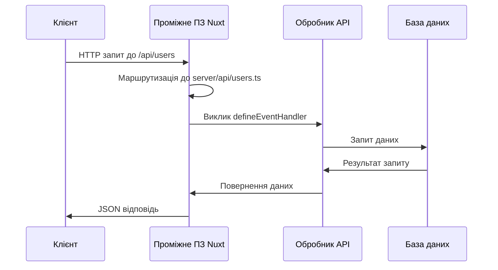
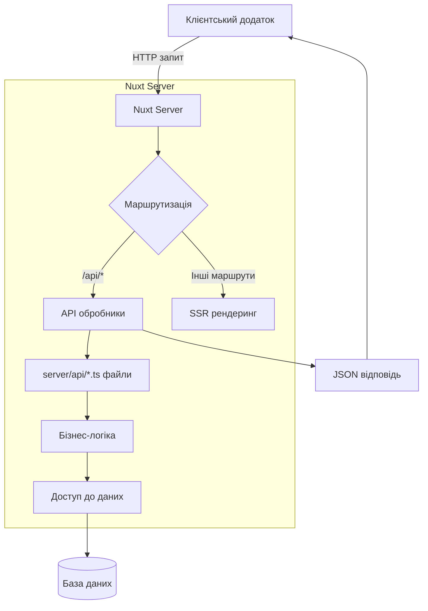
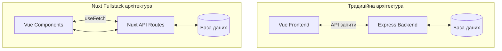

# Бекенд на Nuxt

## Nuxt: Сервер API

Nuxt дозволяє розробникам створювати повноцінні серверні API безпосередньо в рамках їхнього Vue-додатку, надаючи єдине рішення для фронтенду та бекенду. Це спрощує розробку, розгортання та масштабування повноцінних веб-додатків.

### Для чого використовується

-   **Повний стек в одному фреймворку**: розробка фронтенду та бекенду в єдиній кодовій базі
-   **Спрощена архітектура**: відсутність необхідності в окремому API-сервері
-   **Загальний TypeScript**: спільні типи та інтерфейси між клієнтом і сервером
-   **Оптимізована продуктивність**: вбудовані функції кешування та оптимізації

### API маршрути (endpoints)

#### Структура API маршрутів

У Nuxt 3 API маршрути розміщуються в директорії `server/api/`, де кожен файл стає окремим ендпоінтом:

```
server/
  api/
    users.ts         # /api/users
    products.js      # /api/products
    auth/
      login.ts       # /api/auth/login
      register.ts    # /api/auth/register
```

#### Базовий API ендпоінт

```typescript
// server/api/users.ts
export default defineEventHandler(async (event) => {
    // Обробка запиту
    return {
        users: [
            { id: 1, name: "John" },
            { id: 2, name: "Jane" },
        ],
    };
});
```

#### Динамічні маршрути

```typescript
// server/api/users/[id].ts
export default defineEventHandler(async (event) => {
    const id = getRouterParam(event, "id");

    // Отримання користувача за ID з бази даних
    const user = await getUserById(id);

    if (!user) {
        throw createError({
            statusCode: 404,
            message: `User with id ${id} not found`,
        });
    }

    return user;
});
```

#### HTTP методи

```typescript
// server/api/users/index.ts
export default defineEventHandler(async (event) => {
    const method = getMethod(event);

    switch (method) {
        case "GET":
            return getUsers();
        case "POST":
            const body = await readBody(event);
            return createUser(body);
        default:
            throw createError({
                statusCode: 405,
                message: "Method Not Allowed",
            });
    }
});
```

#### Альтернативний підхід з методами

```typescript
// server/api/users/index.get.ts
export default defineEventHandler(async (event) => {
    // Обробка GET запиту
    return getUsers();
});

// server/api/users/index.post.ts
export default defineEventHandler(async (event) => {
    // Обробка POST запиту
    const body = await readBody(event);
    return createUser(body);
});
```

### Контролери

Хоча Nuxt не має явної концепції контролерів, як у традиційних бекенд-фреймворках, можна організувати код у подібному стилі:

```typescript
// server/utils/controllers/userController.ts
export const userController = {
    async getAll() {
        // Отримання всіх користувачів
        return await prisma.user.findMany();
    },

    async getById(id: string) {
        // Отримання користувача за ID
        return await prisma.user.findUnique({
            where: { id },
        });
    },

    async create(userData: any) {
        // Створення користувача
        return await prisma.user.create({
            data: userData,
        });
    },

    async update(id: string, userData: any) {
        // Оновлення користувача
        return await prisma.user.update({
            where: { id },
            data: userData,
        });
    },

    async delete(id: string) {
        // Видалення користувача
        return await prisma.user.delete({
            where: { id },
        });
    },
};

// Використання в API ендпоінті
// server/api/users/[id].ts
import { userController } from "~/server/utils/controllers/userController";

export default defineEventHandler(async (event) => {
    const id = getRouterParam(event, "id");
    return userController.getById(id);
});
```

### Обробка запитів і відповідей

#### Отримання параметрів запиту

```typescript
// server/api/search.ts
export default defineEventHandler(async (event) => {
    // Отримання параметрів запиту (?query=value&page=1)
    const query = getQuery(event);

    // Отримання тіла запиту (POST, PUT, PATCH)
    const body = await readBody(event);

    // Отримання параметрів маршруту (/api/users/[id])
    const params = getRouterParams(event);

    // Отримання заголовків запиту
    const headers = getRequestHeaders(event);

    // Комбінування параметрів і логіка пошуку
    return {
        results: await searchItems(query.q, query.page),
        query: query.q,
        page: query.page || 1,
    };
});
```

#### Налаштування відповіді

```typescript
// server/api/download.ts
export default defineEventHandler(async (event) => {
    // Генерація файлу для завантаження
    const fileContent = generatePDF();

    // Встановлення заголовків відповіді
    setResponseHeaders(event, {
        "Content-Type": "application/pdf",
        "Content-Disposition": 'attachment; filename="report.pdf"',
    });

    // Встановлення статус-коду відповіді
    setResponseStatus(event, 200);

    return fileContent;
});
```

#### Обробка помилок

```typescript
// server/api/secure-data.ts
export default defineEventHandler(async (event) => {
    // Перевірка авторизації
    const token = getRequestHeader(event, "Authorization");

    if (!token) {
        // Створення помилки з кодом статусу
        throw createError({
            statusCode: 401,
            message: "Unauthorized: Missing token",
        });
    }

    try {
        // Перевірка валідності токена
        const decoded = verifyToken(token);
        return getSecureData(decoded.userId);
    } catch (error) {
        // Обробка помилок валідації токена
        throw createError({
            statusCode: 403,
            message: "Forbidden: Invalid token",
        });
    }
});
```

### Підкапотні механізми

#### Як Nuxt обробляє API-запити

1. **Обробка маршруту**:

    - Коли надходить запит до `/api/*`, Nuxt визначає відповідний файл у директорії `server/api/`
    - Динамічні сегменти шляху (наприклад, `[id]`) перетворюються в параметри

2. **Виконання обробника**:

    - Nuxt викликає функцію `defineEventHandler` з об'єктом події, що містить інформацію про запит
    - Обробник може бути асинхронним для виконання операцій бази даних або мережевих запитів

3. **Формування відповіді**:
    - Результат обробника автоматично серіалізується в JSON
    - Винятки обробляються і перетворюються у відповідні HTTP-відповіді



#### Особливості та підводні камені

1. **CORS (Cross-Origin Resource Sharing)**:
    - За замовчуванням Nuxt не налаштовує CORS для API
    - Може виникнути потреба налаштування для запитів з інших доменів

```typescript
// server/middleware/cors.ts
export default defineEventHandler((event) => {
    setResponseHeaders(event, {
        "Access-Control-Allow-Origin": "*",
        "Access-Control-Allow-Methods": "GET,HEAD,PUT,PATCH,POST,DELETE",
        "Access-Control-Allow-Headers": "Content-Type,Authorization",
    });

    if (getMethod(event) === "OPTIONS") {
        setResponseStatus(event, 204);
        return "OK";
    }
});
```

2. **Серіалізація даних**:

    - Nuxt автоматично серіалізує відповідь в JSON
    - Циклічні об'єкти можуть викликати помилки серіалізації

3. **Контекст запиту**:
    - Обробники API мають доступ лише до об'єкта події, а не до глобального контексту Nuxt
    - Для доступу до конфігурації або модулів потрібно використовувати утиліти `useRuntimeConfig`

```typescript
// server/api/config-sample.ts
export default defineEventHandler((event) => {
    // Доступ до конфігурації середовища виконання
    const config = useRuntimeConfig();

    return {
        publicConfig: config.public,
        apiKey: config.apiSecret, // Доступно тільки на сервері
    };
});
```

#### Оптимізація

1. **Кешування відповідей**:

```typescript
// server/api/cached-data.ts
export default defineCachedEventHandler(
    async (event) => {
        // Цей результат буде кешований на 60 секунд
        return fetchExpensiveData();
    },
    {
        maxAge: 60,
    }
);
```

2. **Обробка вхідних даних**:

```typescript
// server/api/users.post.ts
export default defineEventHandler(async (event) => {
    // Валідація вхідних даних
    const body = await readValidatedBody(event, (body) => {
        // Використання Zod для валідації
        return userSchema.parse(body);
    });

    // Дані вже валідовані та типізовані
    return createUser(body);
});
```

3. **Обмеження швидкості запитів**:

```typescript
// server/middleware/rate-limit.ts
import { rateLimit } from "express-rate-limit";

const limiter = rateLimit({
    windowMs: 15 * 60 * 1000, // 15 хвилин
    max: 100, // Ліміт 100 запитів на вікно
    standardHeaders: true,
    legacyHeaders: false,
});

export default defineEventHandler((event) => {
    const apiPath = event.path.startsWith("/api/");

    if (apiPath) {
        return new Promise((resolve) => {
            limiter(event.req, event.res, resolve);
        });
    }
});
```

### Схеми та діаграми

#### Архітектура API в Nuxt 3



#### Життєвий цикл API запиту

```
┌─────────────────────────────────────────────────────┐
│ 1. HTTP запит                                       │
│    GET /api/users?page=1                            │
└─────────────────┬───────────────────────────────────┘
                  ▼
┌─────────────────────────────────────────────────────┐
│ 2. Nuxt Middleware                                  │
│    server/middleware/*.ts                           │
└─────────────────┬───────────────────────────────────┘
                  ▼
┌─────────────────────────────────────────────────────┐
│ 3. Маршрутизація запиту                             │
│    Визначення обробника server/api/users.ts         │
└─────────────────┬───────────────────────────────────┘
                  ▼
┌─────────────────────────────────────────────────────┐
│ 4. Виконання обробника                              │
│    defineEventHandler() => {...}                    │
└─────────────────┬───────────────────────────────────┘
                  ▼
┌─────────────────────────────────────────────────────┐
│ 5. Обробка результату                               │
│    Серіалізація в JSON                              │
└─────────────────┬───────────────────────────────────┘
                  ▼
┌─────────────────────────────────────────────────────┐
│ 6. HTTP відповідь                                   │
│    200 OK, Content-Type: application/json           │
└─────────────────────────────────────────────────────┘
```

#### Порівняння з традиційною архітектурою



> **Важливо**: Хоча Nuxt API дозволяє швидко розробляти бекенд у межах проєкту, для великих і складних додатків варто розглянути окремий API-сервер або мікросервісну архітектуру для кращого масштабування та розділення відповідальності.

Nuxt Server API надає потужний та гнучкий спосіб створення бекенду безпосередньо в проєкті Nuxt, що особливо корисно для малих та середніх додатків, MVP та прототипів. Ця інтеграція спрощує розробку та розгортання повноцінних веб-додатків.
