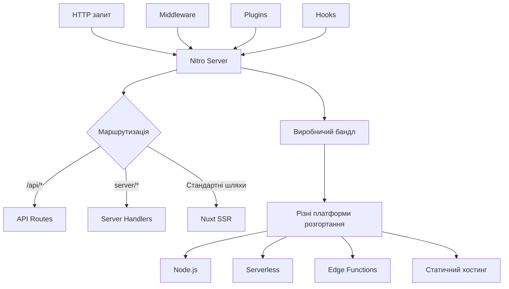
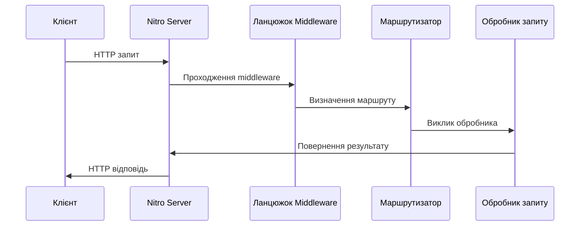
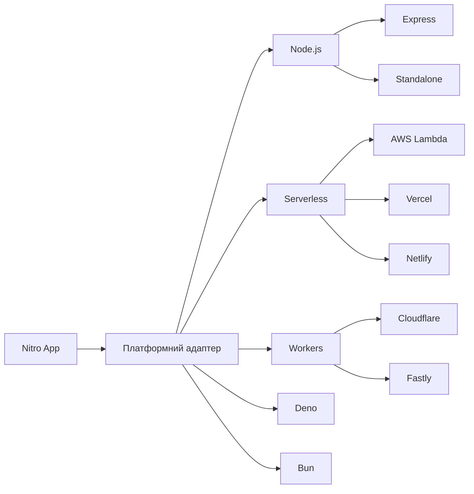
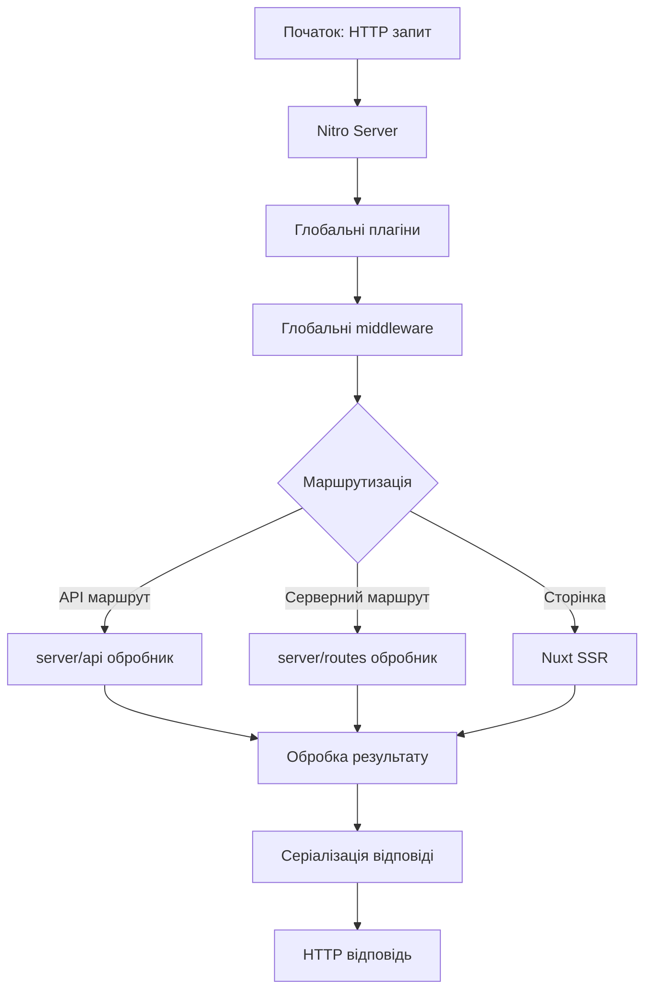

# Бекенд на Nuxt

## Nuxt: Nitro

Nitro — це потужний серверний движок, який лежить в основі Nuxt 3. Він забезпечує універсальний підхід до серверного рендерингу, API-маршрутів та серверних утиліт, дозволяючи створювати ефективні повноцінні веб-додатки.

### Для чого використовується

-   **Універсальний серверний код**: єдина кодова база для різних середовищ розгортання
-   **Автоматична адаптація до платформи**: від Node.js до Deno, Cloudflare Workers та інших
-   **Оптимізована продуктивність**: автоматичне кешування та мінімізація холодних запусків
-   **Модульна архітектура**: легке розширення функціональності через плагіни

### Архітектура Nitro

Nitro побудований на основі h3 — легкого шару абстракції для HTTP, який забезпечує сумісність між різними середовищами виконання. Архітектура Nitro включає:

#### Основні компоненти

```
┌─────────────────────────────────────────────────────┐
│ Nitro Engine                                        │
│                                                     │
│ ┌─────────────┐ ┌─────────────┐ ┌─────────────┐    │
│ │ API Routes  │ │ Server      │ │ Middleware  │    │
│ │             │ │ Handlers    │ │             │    │
│ └─────────────┘ └─────────────┘ └─────────────┘    │
│                                                     │
│ ┌─────────────┐ ┌─────────────┐ ┌─────────────┐    │
│ │ Storage     │ │ Plugins     │ │ Hooks       │    │
│ │             │ │             │ │             │    │
│ └─────────────┘ └─────────────┘ └─────────────┘    │
│                                                     │
└─────────────────────────────────────────────────────┘
```

#### Взаємодія компонентів



### Сервер-роути в Nitro

Nitro використовує файлову систему для визначення роутів, де кожен файл у директорії `server/` стає обробником:

#### Структура директорій

```
server/
  api/           # API ендпоінти (/api/*)
    users.ts
    products.ts
  routes/        # Серверні маршрути з власними шляхами
    sitemap.xml.ts
    custom/path.ts
  middleware/    # Глобальні middleware
    auth.ts
  plugins/       # Серверні плагіни
    database.ts
  utils/         # Утиліти та хелпери
    helpers.ts
```

#### API маршрути

```typescript
// server/api/hello.ts
export default defineEventHandler((event) => {
    return {
        message: "Hello, Nitro!",
    };
});
```

#### Спеціальні маршрути з власними шляхами

```typescript
// server/routes/sitemap.xml.ts
export default defineEventHandler((event) => {
    setResponseHeader(event, "Content-Type", "application/xml");
    return `<?xml version="1.0" encoding="UTF-8"?>
    <urlset xmlns="http://www.sitemaps.org/schemas/sitemap/0.9">
      <url>
        <loc>https://example.com/</loc>
        <lastmod>${new Date().toISOString()}</lastmod>
      </url>
    </urlset>`;
});
```

#### Динамічні маршрути

```typescript
// server/routes/[slug].ts
export default defineEventHandler(async (event) => {
    const slug = getRouterParam(event, "slug");

    // Використання slug для отримання даних
    const data = await fetchDataBySlug(slug);

    // Встановлення заголовків для кешування
    setResponseHeaders(event, {
        "Cache-Control": "max-age=600, public",
    });

    return data;
});
```

### Middleware

Nitro дозволяє створювати серверні middleware для обробки запитів до того, як вони досягнуть цільових обробників:

```typescript
// server/middleware/logger.ts
export default defineEventHandler((event) => {
    // Логування запиту
    console.log(
        `[${new Date().toISOString()}] ${getMethod(event)} ${getRequestURL(
            event
        )}`
    );
});
```

```typescript
// server/middleware/auth.ts
export default defineEventHandler((event) => {
    // Перевірка аутентифікації для API маршрутів
    if (event.path.startsWith("/api/admin")) {
        const token = getRequestHeader(event, "Authorization");

        if (!token || !validateToken(token)) {
            return sendError(
                event,
                createError({
                    statusCode: 401,
                    message: "Unauthorized",
                })
            );
        }
    }
});
```

### Обробники подій

Nitro використовує обробники подій (event handlers) для обробки HTTP-запитів:

#### Базовий обробник подій

```typescript
// server/api/data.ts
export default defineEventHandler(async (event) => {
    // Обробка запиту
    const query = getQuery(event);
    const data = await fetchData(query);

    return {
        result: data,
        timestamp: Date.now(),
    };
});
```

#### Типізовані обробники подій (з TypeScript)

```typescript
// server/api/users/[id].ts
import { User } from "~/types";

export default defineEventHandler<User>(async (event) => {
    const id = getRouterParam(event, "id");

    // Тепер TypeScript знає, що функція має повертати User
    const user = await getUserById(id);

    return user;
});
```

#### Кешовані обробники подій

```typescript
// server/api/weather.ts
export default defineCachedEventHandler(
    async (event) => {
        const query = getQuery(event);
        const city = query.city as string;

        // Цей результат буде кешований на основі city
        const weather = await fetchWeatherData(city);

        return weather;
    },
    {
        maxAge: 60 * 5, // 5 хвилин
        getKey: (event) => {
            const query = getQuery(event);
            return `weather-${query.city}`;
        },
    }
);
```

### Плагіни Nitro

Плагіни дозволяють розширювати функціональність Nitro і виконувати код під час ініціалізації сервера:

```typescript
// server/plugins/database.ts
import { PrismaClient } from "@prisma/client";

// Створення singleton підключення до БД
let prisma: PrismaClient;

export default defineNitroPlugin((nitroApp) => {
    // Код виконується при запуску сервера
    prisma = new PrismaClient();

    // Перехоплення завершення роботи
    nitroApp.hooks.hook("close", async () => {
        await prisma.$disconnect();
    });

    // Надання prisma через глобальний контекст
    nitroApp.hooks.hook("request", async (event) => {
        event.context.prisma = prisma;
    });

    console.log("Database plugin initialized");
});

// Хелпер для доступу до Prisma в обробниках
export const usePrisma = () => {
    return useEvent().context.prisma as PrismaClient;
};
```

### Утиліти Nitro

Nitro надає різноманітні утиліти для роботи з HTTP запитами та відповідями:

#### Утиліти для запитів

```typescript
// Отримання параметрів запиту з URL
const query = getQuery(event); // ?name=John -> { name: 'John' }

// Отримання параметрів з маршруту
const params = getRouterParams(event); // /users/123 -> { id: '123' }

// Отримання тіла запиту
const body = await readBody(event); // POST дані

// Отримання заголовків запиту
const headers = getRequestHeaders(event);

// Отримання метода запиту
const method = getMethod(event); // 'GET', 'POST', etc.

// Отримання URL запиту
const url = getRequestURL(event);
```

#### Утиліти для відповідей

```typescript
// Встановлення статус-коду
setResponseStatus(event, 201);

// Встановлення заголовків відповіді
setResponseHeaders(event, {
    "Content-Type": "application/json",
    "Cache-Control": "max-age=3600",
});

// Встановлення cookie
setCookie(event, "token", "value", {
    httpOnly: true,
    maxAge: 60 * 60 * 24 * 7, // 1 тиждень
    secure: process.env.NODE_ENV === "production",
});

// Створення та відправка помилки
sendError(
    event,
    createError({
        statusCode: 400,
        message: "Bad Request",
    })
);

// Перенаправлення
sendRedirect(event, "/new-location", 302);
```

### Підкапотні механізми

#### Як Nitro працює

1. **Старт сервера**:

    - Nitro ініціалізує h3 сервер
    - Завантажує всі плагіни та middleware
    - Аналізує файлову структуру для виявлення маршрутів

2. **Обробка запиту**:

    - Запит проходить через ланцюжок middleware
    - Nitro визначає відповідний обробник на основі URL
    - Обробник виконується і повертає результат

3. **Генерація відповіді**:
    - Результат серіалізується (зазвичай в JSON)
    - Встановлюються заголовки відповіді
    - Відповідь відправляється клієнту



#### Універсальне виконання

Одна з ключових особливостей Nitro — можливість працювати в різних середовищах:



Nitro автоматично адаптує код для різних платформ розгортання, забезпечуючи однаковий API та поведінку незалежно від середовища.

#### Особливості та підводні камені

1. **Контекст запиту**:
    - Кожен запит має свій контекст, який можна використовувати для зберігання даних
    - Доступ до конфігурації через `useRuntimeConfig()`

```typescript
// server/api/example.ts
export default defineEventHandler(async (event) => {
    // Доступ до конфігурації
    const config = useRuntimeConfig();

    // Збереження даних у контексті
    event.context.user = { id: 1, name: "John" };

    // Використання даних з контексту
    return {
        appName: config.appName,
        user: event.context.user,
    };
});
```

2. **Асинхронна обробка**:
    - Всі обробники можуть бути асинхронними
    - Важливо правильно обробляти помилки асинхронного коду

```typescript
// server/api/data.ts
export default defineEventHandler(async (event) => {
    try {
        const data = await fetchExternalData();
        return data;
    } catch (error) {
        // Правильна обробка помилок
        throw createError({
            statusCode: 500,
            message: "Failed to fetch data",
            cause: error,
        });
    }
});
```

3. **Обмеження серіалізації**:
    - Nitro автоматично серіалізує відповіді в JSON
    - Циклічні об'єкти та функції не можуть бути серіалізовані

```typescript
// Проблема: циклічний об'єкт
const user = { name: "John" };
const manager = { name: "Jane", subordinate: user };
user.manager = manager; // Циклічне посилання

// Рішення: деструктуризація або перетворення перед поверненням
return {
    userName: user.name,
    managerName: user.manager.name,
};
```

#### Оптимізація

1. **Стратегії кешування**:

```typescript
// server/api/expensive-operation.ts
export default defineCachedEventHandler(
    async (event) => {
        // Довга операція
        const result = await computeExpensiveResult();

        return result;
    },
    {
        maxAge: 3600, // Кешування на 1 годину
        staleMaxAge: 86400, // Stale-while-revalidate на 24 години
        swr: true,
    }
);
```

2. **Прелоадинг даних**:

```typescript
// server/plugins/preload.ts
export default defineNitroPlugin(async () => {
    // Попереднє завантаження даних при старті сервера
    const cachedData = await fetchInitialData();

    // Збереження в глобальному кеші
    const cache = useStorage("cache");
    await cache.setItem("initial-data", cachedData);
});

// Використання прелоаднутих даних
// server/api/fast-data.ts
export default defineEventHandler(async () => {
    const cache = useStorage("cache");
    return await cache.getItem("initial-data");
});
```

3. **Оптимізація бандлу**:

```typescript
// nitro.config.ts
export default defineNitroConfig({
    minify: true,
    prerender: {
        routes: ["/api/static-data"],
    },
    rollupConfig: {
        external: ["heavy-library"],
    },
    typescript: {
        strict: true,
    },
});
```

### Схеми та діаграми

#### Життєвий цикл запиту в Nitro



#### Порівняння з традиційними серверними фреймворками

```
┌───────────────────────┐  ┌───────────────────────┐
│ Традиційний фреймворк │  │ Nitro                 │
├───────────────────────┤  ├───────────────────────┤
│ - Конфігурація в коді │  │ - Файлова маршрутизація│
│ - Явна маршрутизація  │  │ - Конвенції над        │
│ - Контролери/сервіси  │  │   конфігурацією       │
│ - Один runtime (Node) │  │ - Мультиплатформеність │
│ - Повний контроль     │  │ - Авто-оптимізація    │
└───────────────────────┘  └───────────────────────┘
```

#### Архітектура обробки запитів

```
┌─────────────────────────────────────────────────────┐
│ HTTP запит                                          │
└───────────────────────┬─────────────────────────────┘
                        │
┌───────────────────────▼─────────────────────────────┐
│ h3 Server                                           │
└───────────────────────┬─────────────────────────────┘
                        │
┌───────────────────────▼─────────────────────────────┐
│ Nitro Middleware Layer                              │
│ ┌─────────────────┐ ┌─────────────────┐             │
│ │ Logger          │ │ Auth            │ ...         │
│ └─────────────────┘ └─────────────────┘             │
└───────────────────────┬─────────────────────────────┘
                        │
┌───────────────────────▼─────────────────────────────┐
│ Router                                              │
└───────────────────────┬─────────────────────────────┘
                        │
                        ▼
┌──────────────┐ ┌──────────────┐ ┌──────────────┐
│ API Handler  │ │ Route Handler│ │ Nuxt Handler │
└──────────────┘ └──────────────┘ └──────────────┘
```

> **Важливо**: Nitro спроектований для максимальної гнучкості та продуктивності на різних платформах. Це дозволяє розробникам створювати серверний код один раз і розгортати його де завгодно — від традиційних серверів до безсерверних функцій та edge computing.

Nitro Engine є потужним фундаментом Nuxt 3, який забезпечує оптимізовану продуктивність, кросплатформенність та простоту розробки серверного коду. З його допомогою можна створювати ефективні API, серверні маршрути та повноцінні бекенд-системи, які легко розгортаються в різноманітних середовищах.
