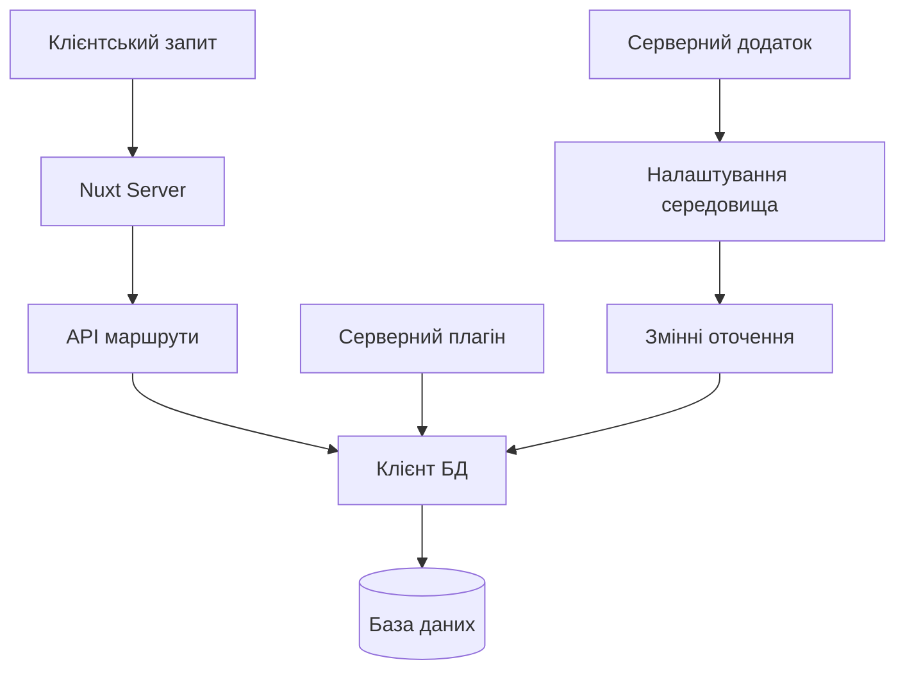
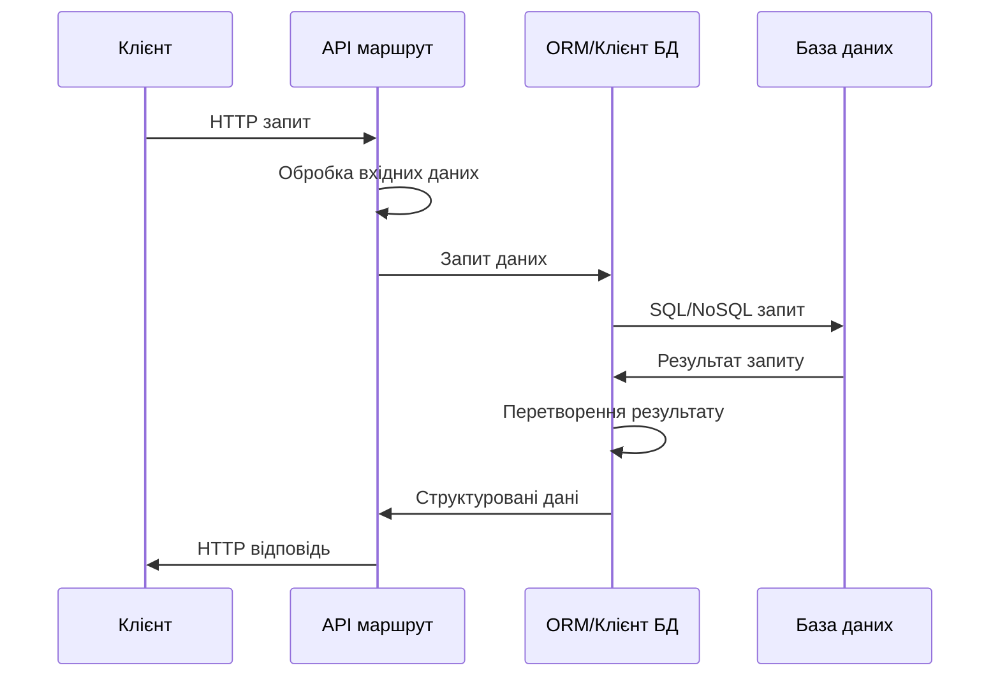
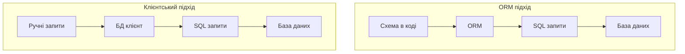

# Бекенд на Nuxt

## Робота з базами даних

В Nuxt можна інтегрувати різні системи управління базами даних (СУБД) для зберігання та управління даними. Це дозволяє створювати повноцінні веб-додатки з персистентністю даних безпосередньо в проєкті Nuxt без необхідності налаштування окремого бекенду.

### Для чого використовується

-   **Збереження даних**: зберігання інформації користувачів, контенту та налаштувань
-   **Управління відносинами**: організація зв'язків між різними типами даних
-   **Запити та фільтрація**: отримання даних за певними критеріями
-   **Транзакції**: забезпечення цілісності даних при виконанні складних операцій

### Підключення до баз даних в Nuxt

Nuxt не має вбудованої підтримки баз даних, але дозволяє легко інтегрувати різні ORM та клієнти БД. Основні підходи:

#### Використання серверних плагінів

```typescript
// server/plugins/database.ts
import { PrismaClient } from "@prisma/client";

let prisma: PrismaClient;

export default defineNitroPlugin((nitroApp) => {
    // Створення єдиного екземпляру клієнта БД
    prisma = new PrismaClient();

    // Закриття з'єднання при завершенні роботи
    nitroApp.hooks.hook("close", async () => {
        await prisma.$disconnect();
    });

    // Додавання клієнта до контексту для використання в API маршрутах
    nitroApp.hooks.hook("request", (event) => {
        event.context.prisma = prisma;
    });
});

// Хелпер для доступу до Prisma в API маршрутах
export function usePrisma() {
    return useEvent().context.prisma as PrismaClient;
}
```

#### Підключення до різних типів баз даних

Nuxt дозволяє підключатись до широкого спектру БД:

##### 1. SQL бази даних (PostgreSQL, MySQL, SQLite)

##### 2. NoSQL бази даних (MongoDB, Firebase)

##### 3. GraphQL API (через Apollo або інші клієнти)

##### 4. Serverless бази даних (Fauna, Supabase, PlanetScale)

### Prisma ORM

Prisma — сучасний ORM (Object-Relational Mapping) для Node.js і TypeScript, який спрощує роботу з базами даних.

#### Налаштування Prisma з Nuxt

1. **Встановлення залежностей**:

```bash
npm install prisma @prisma/client
npm install -D prisma-cli
```

2. **Ініціалізація Prisma**:

```bash
npx prisma init
```

3. **Налаштування схеми даних (prisma/schema.prisma)**:

```prisma
generator client {
  provider = "prisma-client-js"
}

datasource db {
  provider = "postgresql" // або "mysql", "sqlite", "sqlserver"
  url      = env("DATABASE_URL")
}

// Моделі даних
model User {
  id        Int       @id @default(autoincrement())
  email     String    @unique
  name      String?
  password  String
  posts     Post[]
  createdAt DateTime  @default(now())
  updatedAt DateTime  @updatedAt
}

model Post {
  id        Int       @id @default(autoincrement())
  title     String
  content   String?
  published Boolean   @default(false)
  author    User      @relation(fields: [authorId], references: [id])
  authorId  Int
  createdAt DateTime  @default(now())
  updatedAt DateTime  @updatedAt
}
```

4. **Інтеграція Prisma в Nuxt**:

```typescript
// nuxt.config.ts
export default defineNuxtConfig({
    nitro: {
        plugins: ["~/server/plugins/prisma.ts"],
    },
});

// server/plugins/prisma.ts
import { PrismaClient } from "@prisma/client";

const prisma = new PrismaClient();

export default defineNitroPlugin((_nitroApp) => {
    console.log("Prisma plugin initialized");
});

// Глобальний доступ до Prisma
export { prisma };
```

#### Використання Prisma в API маршрутах

```typescript
// server/api/users/index.get.ts
import { prisma } from "~/server/plugins/prisma";

export default defineEventHandler(async () => {
    const users = await prisma.user.findMany({
        select: {
            id: true,
            email: true,
            name: true,
            posts: {
                select: {
                    id: true,
                    title: true,
                },
            },
        },
    });

    return users;
});

// server/api/users/index.post.ts
import { prisma } from "~/server/plugins/prisma";
import { hash } from "~/server/utils/password";

export default defineEventHandler(async (event) => {
    const body = await readBody(event);

    // Валідація вхідних даних
    if (!body.email || !body.password) {
        throw createError({
            statusCode: 400,
            message: "Email and password are required",
        });
    }

    try {
        // Хешування пароля перед збереженням
        const hashedPassword = await hash(body.password);

        // Створення користувача
        const user = await prisma.user.create({
            data: {
                email: body.email,
                name: body.name,
                password: hashedPassword,
            },
            select: {
                id: true,
                email: true,
                name: true,
            },
        });

        return user;
    } catch (error) {
        // Обробка помилок унікальності
        if (error.code === "P2002") {
            throw createError({
                statusCode: 409,
                message: "User with this email already exists",
            });
        }

        throw error;
    }
});
```

### MongoDB

MongoDB — популярна NoSQL база даних, що зберігає дані у форматі BSON (бінарний JSON).

#### Налаштування MongoDB з Nuxt

1. **Встановлення залежностей**:

```bash
npm install mongodb
```

2. **Створення плагіна для MongoDB**:

```typescript
// server/plugins/mongodb.ts
import { MongoClient, Db } from "mongodb";

let db: Db;

export default defineNitroPlugin(async () => {
    const config = useRuntimeConfig();
    const client = new MongoClient(config.mongodbUri);

    await client.connect();
    db = client.db(config.mongodbName);

    console.log("MongoDB connected");

    // Закриття підключення при завершенні
    process.on("beforeExit", () => {
        client.close();
    });
});

// Експорт колекцій для використання в API
export const usersCollection = () => db.collection("users");
export const postsCollection = () => db.collection("posts");
```

3. **Налаштування в `nuxt.config.ts`**:

```typescript
// nuxt.config.ts
export default defineNuxtConfig({
    runtimeConfig: {
        mongodbUri: process.env.MONGODB_URI,
        mongodbName: process.env.MONGODB_NAME || "myapp",
        public: {
            // Публічні змінні конфігурації
        },
    },
    nitro: {
        plugins: ["~/server/plugins/mongodb.ts"],
    },
});
```

#### Використання MongoDB в API маршрутах

```typescript
// server/api/posts/index.get.ts
import { postsCollection } from "~/server/plugins/mongodb";

export default defineEventHandler(async (event) => {
    const query = getQuery(event);
    const limit = parseInt(query.limit as string) || 10;
    const skip = parseInt(query.skip as string) || 0;

    const posts = await postsCollection()
        .find({ published: true })
        .sort({ createdAt: -1 })
        .skip(skip)
        .limit(limit)
        .toArray();

    return posts;
});

// server/api/posts/[id].get.ts
import { postsCollection } from "~/server/plugins/mongodb";
import { ObjectId } from "mongodb";

export default defineEventHandler(async (event) => {
    const id = getRouterParam(event, "id");

    try {
        const post = await postsCollection().findOne({
            _id: new ObjectId(id),
        });

        if (!post) {
            throw createError({
                statusCode: 404,
                message: "Post not found",
            });
        }

        return post;
    } catch (error) {
        if (error.message.includes("ObjectId")) {
            throw createError({
                statusCode: 400,
                message: "Invalid post ID format",
            });
        }

        throw error;
    }
});
```

### SQL бази даних через Drizzle ORM

Drizzle — легкий TypeScript ORM для SQL баз даних з типобезпечними запитами.

#### Налаштування Drizzle з Nuxt

1. **Встановлення залежностей**:

```bash
npm install drizzle-orm postgres
npm install -D drizzle-kit
```

2. **Визначення схеми**:

```typescript
// server/db/schema.ts
import {
    pgTable,
    serial,
    text,
    varchar,
    timestamp,
    boolean,
    integer,
} from "drizzle-orm/pg-core";
import { relations } from "drizzle-orm";

export const users = pgTable("users", {
    id: serial("id").primaryKey(),
    email: varchar("email", { length: 255 }).notNull().unique(),
    name: text("name"),
    password: text("password").notNull(),
    createdAt: timestamp("created_at").defaultNow().notNull(),
    updatedAt: timestamp("updated_at").defaultNow().notNull(),
});

export const posts = pgTable("posts", {
    id: serial("id").primaryKey(),
    title: varchar("title", { length: 255 }).notNull(),
    content: text("content"),
    published: boolean("published").default(false).notNull(),
    authorId: integer("author_id").references(() => users.id),
    createdAt: timestamp("created_at").defaultNow().notNull(),
    updatedAt: timestamp("updated_at").defaultNow().notNull(),
});

// Визначення відносин
export const usersRelations = relations(users, ({ many }) => ({
    posts: many(posts),
}));

export const postsRelations = relations(posts, ({ one }) => ({
    author: one(users, {
        fields: [posts.authorId],
        references: [users.id],
    }),
}));
```

3. **Створення клієнта бази даних**:

```typescript
// server/plugins/database.ts
import { drizzle } from "drizzle-orm/postgres-js";
import postgres from "postgres";
import * as schema from "../db/schema";

// Створення SQL клієнта
const client = postgres(process.env.DATABASE_URL!);

// Створення Drizzle клієнта
export const db = drizzle(client, { schema });

export default defineNitroPlugin(() => {
    console.log("Drizzle ORM initialized");
});
```

#### Використання Drizzle в API маршрутах

```typescript
// server/api/users/index.ts
import { db } from "~/server/plugins/database";
import { users, posts } from "~/server/db/schema";
import { eq } from "drizzle-orm";

export default defineEventHandler(async (event) => {
    const method = getMethod(event);

    // Обробка різних HTTP методів
    switch (method) {
        case "GET":
            return await db.query.users.findMany({
                with: {
                    posts: {
                        where: eq(posts.published, true),
                    },
                },
            });

        case "POST":
            const body = await readBody(event);

            const [newUser] = await db
                .insert(users)
                .values({
                    email: body.email,
                    name: body.name,
                    password: await hashPassword(body.password),
                })
                .returning();

            return newUser;

        default:
            throw createError({
                statusCode: 405,
                message: "Method Not Allowed",
            });
    }
});
```

### Serverless бази даних

#### Приклад з Supabase

1. **Встановлення залежностей**:

```bash
npm install @supabase/supabase-js
```

2. **Налаштування клієнта Supabase**:

```typescript
// server/plugins/supabase.ts
import { createClient } from "@supabase/supabase-js";

const config = useRuntimeConfig();
const supabaseUrl = config.supabaseUrl;
const supabaseKey = config.supabaseServiceKey;

export const supabase = createClient(supabaseUrl, supabaseKey);

export default defineNitroPlugin(() => {
    console.log("Supabase client initialized");
});
```

3. **Використання в API маршрутах**:

```typescript
// server/api/products.ts
import { supabase } from "~/server/plugins/supabase";

export default defineEventHandler(async (event) => {
    const method = getMethod(event);

    switch (method) {
        case "GET":
            const { data, error } = await supabase.from("products").select("*");

            if (error)
                throw createError({ statusCode: 500, message: error.message });
            return data;

        case "POST":
            const body = await readBody(event);
            const { data: newProduct, error: insertError } = await supabase
                .from("products")
                .insert(body)
                .select();

            if (insertError)
                throw createError({
                    statusCode: 400,
                    message: insertError.message,
                });

            return newProduct[0];
    }
});
```

### Підкапотні механізми

#### Архітектура підключення до бази даних



#### Життєвий цикл запиту до бази даних



#### Особливості та підводні камені

1. **Підключення до бази даних**:
    - Використовуйте пул підключень для ефективної роботи
    - Закривайте з'єднання при завершенні роботи програми

```typescript
// Правильне налаштування пулу підключень
const pool = new Pool({
    max: 20,
    idleTimeoutMillis: 30000,
    connectionTimeoutMillis: 2000,
});

// Закриття підключень при зупинці
process.on("SIGINT", async () => {
    await pool.end();
    process.exit(0);
});
```

2. **Безпека та валідація**:
    - Завжди валідуйте вхідні дані перед збереженням
    - Уникайте SQL-ін'єкцій, використовуючи параметризовані запити

```typescript
// Неправильно (SQL-ін'єкція)
const userId = req.params.id;
const query = `SELECT * FROM users WHERE id = ${userId}`;

// Правильно (параметризований запит)
const result = await prisma.user.findUnique({
    where: { id: parseInt(userId) },
});

// або з Drizzle
const result = await db
    .select()
    .from(users)
    .where(eq(users.id, parseInt(userId)));
```

3. **Продуктивність**:
    - Використовуйте індекси для частих запитів
    - Обмежуйте кількість запитуваних полів

```typescript
// Погано: запит всіх полів
const user = await prisma.user.findUnique({
    where: { id: userId },
});

// Краще: запит тільки необхідних полів
const user = await prisma.user.findUnique({
    where: { id: userId },
    select: {
        id: true,
        name: true,
        email: true,
    },
});
```

4. **Транзакції**:
    - Використовуйте транзакції для операцій, що змінюють кілька таблиць

```typescript
// Prisma транзакція
const result = await prisma.$transaction(async (tx) => {
    // Створення користувача
    const user = await tx.user.create({
        data: { name: "John", email: "john@example.com" },
    });

    // Створення пов'язаного профілю
    const profile = await tx.profile.create({
        data: { userId: user.id, bio: "New user" },
    });

    return { user, profile };
});
```

#### Оптимізація

1. **Кешування запитів**:

```typescript
// server/api/products/[id].ts
import { cachedQuery } from "~/server/utils/cache";

export default defineEventHandler(async (event) => {
    const id = getRouterParam(event, "id");

    // Кешування запиту на 5 хвилин
    return await cachedQuery(
        `product-${id}`,
        () =>
            prisma.product.findUnique({
                where: { id: parseInt(id) },
            }),
        300 // 5 хвилин
    );
});

// server/utils/cache.ts
import { useStorage } from "#imports";

export async function cachedQuery(key, queryFn, ttl = 60) {
    const storage = useStorage("cache");
    const cached = await storage.getItem(key);

    if (cached) {
        const { data, expires } = cached;

        if (expires > Date.now()) {
            return data;
        }
    }

    const data = await queryFn();

    await storage.setItem(key, {
        data,
        expires: Date.now() + ttl * 1000,
    });

    return data;
}
```

2. **Батчинг запитів**:

```typescript
// Неоптимально: N+1 проблема
const posts = await prisma.post.findMany();
for (const post of posts) {
    // N окремих запитів на авторів
    post.author = await prisma.user.findUnique({
        where: { id: post.authorId },
    });
}

// Оптимально: отримання постів з авторами за один запит
const posts = await prisma.post.findMany({
    include: {
        author: true,
    },
});
```

3. **Обмеження розміру результатів**:

```typescript
// Пагінація
export default defineEventHandler(async (event) => {
    const query = getQuery(event);
    const page = parseInt(query.page as string) || 1;
    const pageSize = parseInt(query.pageSize as string) || 10;

    const [items, total] = await Promise.all([
        prisma.product.findMany({
            skip: (page - 1) * pageSize,
            take: pageSize,
            orderBy: { createdAt: "desc" },
        }),
        prisma.product.count(),
    ]);

    return {
        items,
        meta: {
            page,
            pageSize,
            total,
            totalPages: Math.ceil(total / pageSize),
        },
    };
});
```

### Схеми та діаграми

#### Взаємодія з базою даних в Nuxt

```
┌────────────────────────────────┐
│ Nuxt App                       │
│                                │
│ ┌──────────────┐ ┌───────────┐ │
│ │ Vue          │ │ API       │ │
│ │ Components   │ │ Routes    │ │
│ └──────┬───────┘ └─────┬─────┘ │
│        │               │       │
│ ┌──────▼───────────────▼─────┐ │
│ │ ORM / Database Client     │ │
│ └──────────────┬────────────┘ │
└────────────────┼──────────────┘
                 │
┌────────────────▼──────────────┐
│ Database                      │
│ ┌──────────┐ ┌──────────────┐ │
│ │ Data     │ │ Schema       │ │
│ │ Storage  │ │ Definitions  │ │
│ └──────────┘ └──────────────┘ │
└────────────────────────────────┘
```

#### Порівняння ORM та клієнтів баз даних



#### Структура моделі даних

```
┌──────────────────────────────────┐
│ User                             │
│ ┌────────────┐ ┌───────────────┐ │
│ │ id         │ │ INT (PK)      │ │
│ │ email      │ │ VARCHAR(255)  │ │
│ │ name       │ │ VARCHAR(100)  │ │
│ │ password   │ │ TEXT          │ │
│ │ createdAt  │ │ TIMESTAMP     │ │
│ │ updatedAt  │ │ TIMESTAMP     │ │
│ └────────────┘ └───────────────┘ │
└───────────────┬──────────────────┘
                │
                │ 1:N
                ▼
┌──────────────────────────────────┐
│ Post                             │
│ ┌────────────┐ ┌───────────────┐ │
│ │ id         │ │ INT (PK)      │ │
│ │ title      │ │ VARCHAR(255)  │ │
│ │ content    │ │ TEXT          │ │
│ │ published  │ │ BOOLEAN       │ │
│ │ authorId   │ │ INT (FK)      │ │
│ │ createdAt  │ │ TIMESTAMP     │ │
│ │ updatedAt  │ │ TIMESTAMP     │ │
│ └────────────┘ └───────────────┘ │
└──────────────────────────────────┘
```

> **Важливо**: Вибір ORM, клієнта БД та самої бази даних залежить від конкретних потреб проєкту. Для невеликих додатків SQLite або Supabase можуть бути достатніми, тоді як для великих систем краще розглянути PostgreSQL з Prisma або іншим ORM.

Nuxt надає гнучкі можливості для інтеграції різних баз даних, дозволяючи розробникам створювати повноцінні веб-додатки з надійним бекендом. Правильний вибір технології та дотримання кращих практик роботи з базами даних забезпечують ефективність, безпеку та масштабованість вашого додатку.
