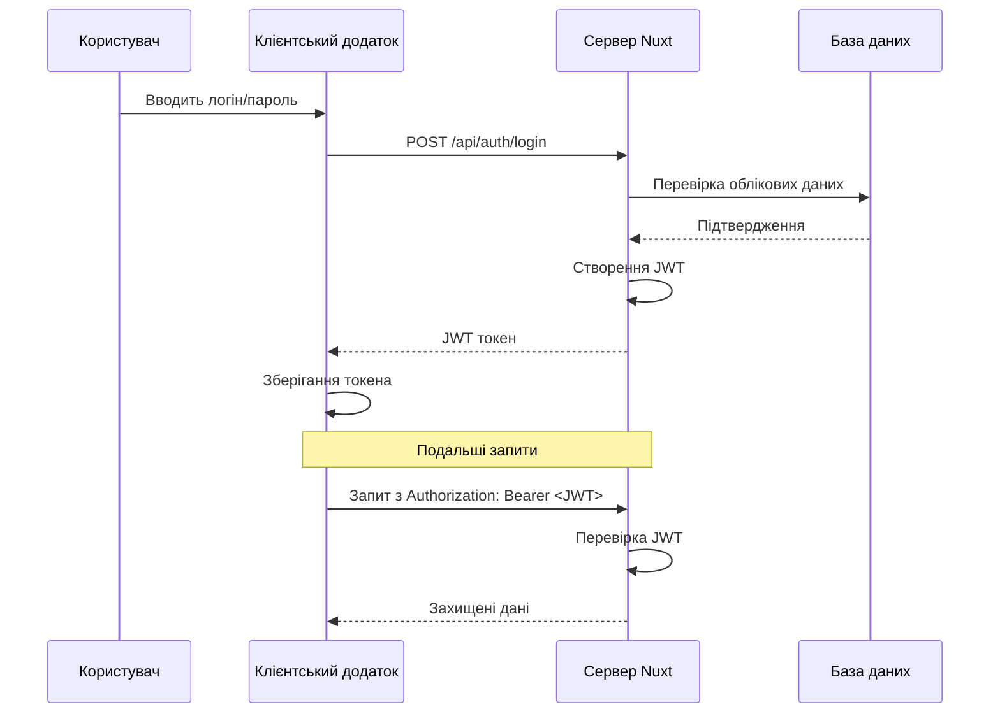
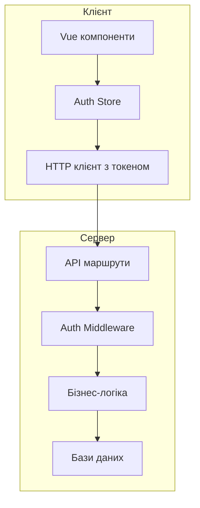

# Бекенд на Nuxt

## Аутентифікація та авторизація

Аутентифікація (підтвердження особи користувача) та авторизація (визначення прав доступу) — критично важливі аспекти будь-якого сучасного веб-додатка. Nuxt надає зручні інструменти для реалізації надійних систем аутентифікації та авторизації.

### Для чого використовується

-   **Захист ресурсів**: обмеження доступу до певних сторінок чи API
-   **Персоналізація**: надання користувачу персоналізованого досвіду
-   **Безпека даних**: запобігання несанкціонованого доступу до приватної інформації
-   **Відстеження дій**: логування дій конкретних користувачів

### JWT (JSON Web Tokens)

JWT — один з найпопулярніших підходів до аутентифікації в сучасних веб-додатках, особливо в архітектурі з окремим клієнтом і сервером.

#### Принцип роботи JWT

1. **Аутентифікація**: користувач надає облікові дані (логін/пароль)
2. **Видача токена**: сервер перевіряє дані та видає підписаний JWT
3. **Зберігання**: клієнт зберігає JWT у cookies або localStorage
4. **Авторизація**: клієнт надсилає JWT з кожним запитом для авторизації



#### Реалізація JWT в Nuxt

1. **Встановлення залежностей**:

```bash
npm install jsonwebtoken
npm install -D @types/jsonwebtoken
```

2. **Створення утиліт для роботи з JWT**:

```typescript
// server/utils/jwt.ts
import jwt from "jsonwebtoken";

// Отримання секретного ключа з конфігурації
const config = useRuntimeConfig();
const JWT_SECRET = config.jwtSecret;

// Створення токена
export function generateToken(payload: any, expiresIn = "1d") {
    return jwt.sign(payload, JWT_SECRET, { expiresIn });
}

// Перевірка токена
export function verifyToken(token: string) {
    try {
        return jwt.verify(token, JWT_SECRET);
    } catch (error) {
        return null;
    }
}

// Отримання payload з токена без перевірки підпису
export function decodeToken(token: string) {
    return jwt.decode(token);
}
```

3. **Створення API для аутентифікації**:

```typescript
// server/api/auth/login.post.ts
import { generateToken } from "~/server/utils/jwt";
import { prisma } from "~/server/plugins/prisma";
import { comparePasswords } from "~/server/utils/password";

export default defineEventHandler(async (event) => {
    // Отримання даних з тіла запиту
    const { email, password } = await readBody(event);

    // Валідація вхідних даних
    if (!email || !password) {
        throw createError({
            statusCode: 400,
            message: "Email and password are required",
        });
    }

    // Пошук користувача в базі даних
    const user = await prisma.user.findUnique({
        where: { email },
    });

    // Перевірка існування користувача
    if (!user) {
        throw createError({
            statusCode: 401,
            message: "Invalid credentials",
        });
    }

    // Перевірка пароля
    const passwordValid = await comparePasswords(password, user.password);

    if (!passwordValid) {
        throw createError({
            statusCode: 401,
            message: "Invalid credentials",
        });
    }

    // Генерація JWT
    const token = generateToken({
        id: user.id,
        email: user.email,
        role: user.role,
    });

    // Встановлення HTTP-only cookie
    setCookie(event, "auth_token", token, {
        httpOnly: true,
        maxAge: 60 * 60 * 24, // 1 день
        secure: process.env.NODE_ENV === "production",
        path: "/",
    });

    // Повернення користувача без пароля
    const { password: _, ...userWithoutPassword } = user;

    return {
        user: userWithoutPassword,
        token,
    };
});
```

4. **Створення middleware для захисту маршрутів**:

```typescript
// server/middleware/auth.ts
import { verifyToken } from "~/server/utils/jwt";

export default defineEventHandler(async (event) => {
    // Перевірка, чи маршрут потребує авторизації
    if (!event.path.startsWith("/api/protected")) {
        return;
    }

    // Отримання токена з заголовка або cookie
    const authHeader = getRequestHeader(event, "Authorization");
    const token = authHeader?.split(" ")[1] || getCookie(event, "auth_token");

    if (!token) {
        return sendError(
            event,
            createError({
                statusCode: 401,
                message: "Unauthorized: Missing token",
            })
        );
    }

    // Перевірка токена
    const decoded = verifyToken(token);

    if (!decoded) {
        return sendError(
            event,
            createError({
                statusCode: 401,
                message: "Unauthorized: Invalid token",
            })
        );
    }

    // Додавання інформації про користувача до контексту запиту
    event.context.auth = decoded;
});
```

5. **Використання аутентифікації в захищених маршрутах**:

```typescript
// server/api/protected/profile.get.ts
import { prisma } from "~/server/plugins/prisma";

export default defineEventHandler(async (event) => {
    // Отримання даних користувача з контексту
    const auth = event.context.auth;

    // Отримання повного профілю користувача
    const user = await prisma.user.findUnique({
        where: { id: auth.id },
        include: {
            profile: true,
        },
    });

    if (!user) {
        throw createError({
            statusCode: 404,
            message: "User not found",
        });
    }

    // Видалення пароля з відповіді
    const { password, ...userWithoutPassword } = user;

    return userWithoutPassword;
});
```

### OAuth (Open Authorization)

OAuth — протокол авторизації, що дозволяє користувачам надавати обмежений доступ до своїх ресурсів на одному сайті іншому сайту без передачі облікових даних.

#### Реалізація OAuth в Nuxt

1. **Встановлення залежностей**:

```bash
npm install @auth/core
npm install @auth/oauth2
```

2. **Створення провайдера OAuth**:

```typescript
// server/api/auth/[...].ts
import { NuxtAuthHandler } from "#auth";
import GoogleProvider from "@auth/oauth2/providers/google";
import GithubProvider from "@auth/oauth2/providers/github";
import { PrismaAdapter } from "@auth/prisma-adapter";
import { prisma } from "~/server/plugins/prisma";

export default NuxtAuthHandler({
    // Адаптер для збереження даних сесії
    adapter: PrismaAdapter(prisma),

    // Секретний ключ
    secret: useRuntimeConfig().authSecret,

    // Провайдери OAuth
    providers: [
        // Google
        GoogleProvider({
            clientId: useRuntimeConfig().google.clientId,
            clientSecret: useRuntimeConfig().google.clientSecret,
        }),

        // GitHub
        GithubProvider({
            clientId: useRuntimeConfig().github.clientId,
            clientSecret: useRuntimeConfig().github.clientSecret,
        }),
    ],

    // Конфігурація сесії
    session: {
        strategy: "jwt",
        maxAge: 30 * 24 * 60 * 60, // 30 днів
    },

    // Колбеки
    callbacks: {
        async jwt({ token, user }) {
            if (user) {
                token.id = user.id;
                token.role = user.role;
            }
            return token;
        },

        async session({ session, token }) {
            if (token) {
                session.user.id = token.id;
                session.user.role = token.role;
            }
            return session;
        },
    },

    // Сторінки
    pages: {
        signIn: "/auth/login",
        error: "/auth/error",
    },
});
```

3. **Використання в компонентах**:

```vue
<!-- components/LoginButtons.vue -->
<template>
    <div class="login-buttons">
        <button @click="signIn('google')">Login with Google</button>
        <button @click="signIn('github')">Login with GitHub</button>
    </div>
</template>

<script setup>
import { useAuth } from "#auth";

const auth = useAuth();

async function signIn(provider) {
    await auth.signIn(provider, { callbackUrl: "/dashboard" });
}
</script>
```

### Сесії

Сесії — традиційний підхід до аутентифікації, що зберігає стан користувача на сервері.

#### Реалізація сесій в Nuxt

1. **Встановлення залежностей**:

```bash
npm install h3-session
```

2. **Налаштування сесій**:

```typescript
// server/plugins/session.ts
import { sessionPlugin } from "h3-session";

export default defineNitroPlugin((nitroApp) => {
    // Налаштування плагіна сесій
    nitroApp.h3App.use(
        sessionPlugin({
            secret: useRuntimeConfig().sessionSecret,
            resave: false,
            saveUninitialized: false,
            cookie: {
                secure: process.env.NODE_ENV === "production",
                httpOnly: true,
                maxAge: 60 * 60 * 24 * 7, // 1 тиждень
            },
        })
    );
});
```

3. **Використання сесій в API**:

```typescript
// server/api/auth/login-session.post.ts
import { prisma } from "~/server/plugins/prisma";
import { comparePasswords } from "~/server/utils/password";

export default defineEventHandler(async (event) => {
    const { email, password } = await readBody(event);

    // Пошук користувача
    const user = await prisma.user.findUnique({
        where: { email },
    });

    if (!user || !(await comparePasswords(password, user.password))) {
        throw createError({
            statusCode: 401,
            message: "Invalid credentials",
        });
    }

    // Видалення пароля з даних
    const { password: _, ...userWithoutPassword } = user;

    // Збереження даних у сесії
    event.context.session.user = userWithoutPassword;

    return {
        user: userWithoutPassword,
    };
});

// server/api/auth/logout-session.post.ts
export default defineEventHandler(async (event) => {
    // Видалення даних з сесії
    delete event.context.session.user;

    return {
        success: true,
    };
});
```

### Middleware для захисту маршрутів

Middleware дозволяють перевіряти аутентифікацію та авторизацію перед доступом до маршрутів.

#### Серверне middleware

```typescript
// server/middleware/admin-auth.ts
export default defineEventHandler((event) => {
    // Перевіряємо, чи маршрут вимагає прав адміністратора
    if (event.path.startsWith("/api/admin")) {
        // Отримуємо дані користувача з авторизації
        const auth = event.context.auth;

        // Перевіряємо роль
        if (!auth || auth.role !== "ADMIN") {
            return sendError(
                event,
                createError({
                    statusCode: 403,
                    message: "Forbidden: Admin access required",
                })
            );
        }
    }
});
```

#### Клієнтське middleware (для захисту сторінок)

```typescript
// middleware/auth.ts
export default defineNuxtRouteMiddleware(async (to) => {
    const { status, data } = await useFetch("/api/auth/check");

    // Якщо користувач не авторизований і намагається отримати доступ до захищеної сторінки
    if (status.value === "error" && to.meta.requiresAuth) {
        return navigateTo("/auth/login", {
            query: { redirect: to.fullPath },
        });
    }

    // Якщо користувач намагається отримати доступ до сторінки адміністратора, але не має прав
    if (
        status.value === "success" &&
        to.meta.requiresAdmin &&
        data.value.role !== "ADMIN"
    ) {
        return navigateTo("/dashboard");
    }
});
```

### Ролі та права доступу

Системи авторизації часто включають ролі та права для більш детального контролю доступу.

#### Модель ролей та прав

```typescript
// prisma/schema.prisma
model User {
  id        Int      @id @default(autoincrement())
  email     String   @unique
  password  String
  role      Role     @default(USER)
  // Інші поля
}

enum Role {
  USER
  EDITOR
  ADMIN
}
```

#### Перевірка ролей в API

```typescript
// server/api/articles/[id].put.ts
import { prisma } from "~/server/plugins/prisma";

export default defineEventHandler(async (event) => {
    const id = getRouterParam(event, "id");
    const auth = event.context.auth;
    const body = await readBody(event);

    // Перевірка, чи існує стаття
    const article = await prisma.article.findUnique({
        where: { id: parseInt(id) },
    });

    if (!article) {
        throw createError({
            statusCode: 404,
            message: "Article not found",
        });
    }

    // Перевірка прав доступу
    const isOwner = article.authorId === auth.id;
    const isAdmin = auth.role === "ADMIN";
    const isEditor = auth.role === "EDITOR";

    if (!isOwner && !isAdmin && !isEditor) {
        throw createError({
            statusCode: 403,
            message:
                "Forbidden: You do not have permission to edit this article",
        });
    }

    // Оновлення статті
    const updatedArticle = await prisma.article.update({
        where: { id: parseInt(id) },
        data: {
            title: body.title,
            content: body.content,
            // Тільки адміністратор може змінити статус публікації
            ...(isAdmin ? { published: body.published } : {}),
        },
    });

    return updatedArticle;
});
```

### RBAC (Role-Based Access Control)

RBAC — модель контролю доступу, заснована на ролях, які надаються користувачам.

#### Реалізація RBAC в Nuxt

```typescript
// server/utils/rbac.ts
// Визначення можливих дій
type Action = "create" | "read" | "update" | "delete";

// Визначення ресурсів
type Resource = "articles" | "users" | "comments" | "settings";

// Таблиця прав доступу
const permissions: Record<string, Record<Resource, Action[]>> = {
    USER: {
        articles: ["read"],
        users: ["read"],
        comments: ["create", "read", "update", "delete"],
        settings: [],
    },
    EDITOR: {
        articles: ["create", "read", "update"],
        users: ["read"],
        comments: ["create", "read", "update", "delete"],
        settings: [],
    },
    ADMIN: {
        articles: ["create", "read", "update", "delete"],
        users: ["create", "read", "update", "delete"],
        comments: ["create", "read", "update", "delete"],
        settings: ["create", "read", "update", "delete"],
    },
};

// Функція перевірки прав
export function can(role: string, resource: Resource, action: Action): boolean {
    if (!permissions[role]) return false;

    return permissions[role][resource]?.includes(action) || false;
}

// Middleware для перевірки прав
export function checkPermission(
    role: string,
    resource: Resource,
    action: Action
) {
    return defineEventHandler((event) => {
        const auth = event.context.auth;

        if (!auth || !can(auth.role, resource, action)) {
            return sendError(
                event,
                createError({
                    statusCode: 403,
                    message: `Forbidden: No permission to ${action} ${resource}`,
                })
            );
        }
    });
}
```

#### Використання RBAC в API

```typescript
// server/api/articles/index.post.ts
import { checkPermission } from "~/server/utils/rbac";

export default defineEventHandler(
    checkPermission("articles", "create"),
    async (event) => {
        const body = await readBody(event);
        const auth = event.context.auth;

        // Створення статті
        const article = await prisma.article.create({
            data: {
                title: body.title,
                content: body.content,
                authorId: auth.id,
            },
        });

        return article;
    }
);
```

### Підкапотні механізми

#### Як працює JWT

JWT складається з трьох частин, розділених крапками:

1. **Header**: метадані про тип токена та алгоритм
2. **Payload**: дані користувача та метадані (exp, iat тощо)
3. **Signature**: підпис, що забезпечує цілісність

```
eyJhbGciOiJIUzI1NiIsInR5cCI6IkpXVCJ9.
eyJzdWIiOiIxMjM0NTY3ODkwIiwibmFtZSI6IkpvaG4gRG9lIiwiaWF0IjoxNTE2MjM5MDIyfQ.
SflKxwRJSMeKKF2QT4fwpMeJf36POk6yJV_adQssw5c
```

```javascript
// Створення JWT
const header = base64URLEncode({
    alg: "HS256",
    typ: "JWT",
});

const payload = base64URLEncode({
    sub: "1234567890",
    name: "John Doe",
    iat: 1516239022,
});

const signature = HMACSHA256(header + "." + payload, secret);

const jwt = header + "." + payload + "." + signature;
```

#### Особливості та підводні камені

1. **Безпека JWT**:
    - Токени можуть бути вкрадені через XSS атаки
    - Уникайте зберігання конфіденційних даних у payload
    - Використовуйте короткий термін дії та механізм оновлення

```typescript
// Механізм оновлення токенів
// server/api/auth/refresh.post.ts
import { verifyToken, generateToken } from "~/server/utils/jwt";

export default defineEventHandler(async (event) => {
    // Отримання refresh токена
    const refreshToken = getCookie(event, "refresh_token");

    if (!refreshToken) {
        throw createError({
            statusCode: 401,
            message: "Refresh token is required",
        });
    }

    // Перевірка токена
    const decoded = verifyToken(refreshToken);

    if (!decoded) {
        throw createError({
            statusCode: 401,
            message: "Invalid refresh token",
        });
    }

    // Генерація нових токенів
    const accessToken = generateToken(
        {
            id: decoded.id,
            email: decoded.email,
            role: decoded.role,
        },
        "15m"
    ); // Короткий термін дії

    const newRefreshToken = generateToken(
        {
            id: decoded.id,
            tokenVersion: decoded.tokenVersion,
        },
        "7d"
    ); // Довший термін дії

    // Встановлення нових токенів
    setCookie(event, "auth_token", accessToken, {
        httpOnly: true,
        maxAge: 60 * 15, // 15 хвилин
        secure: process.env.NODE_ENV === "production",
        path: "/",
    });

    setCookie(event, "refresh_token", newRefreshToken, {
        httpOnly: true,
        maxAge: 60 * 60 * 24 * 7, // 7 днів
        secure: process.env.NODE_ENV === "production",
        path: "/",
    });

    return {
        accessToken,
    };
});
```

2. **Сесії vs JWT**:

    - Сесії зберігають стан на сервері, JWT — на клієнті
    - Сесії легше відкликати, JWT складніше (але можна використовувати blacklist)
    - JWT добре масштабуються, сесії потребують спільного сховища

3. **CSRF атаки**:
    - JWT у Authorization заголовку захищені від CSRF
    - Сесії/cookies потребують додаткового захисту (CSRF токени)

```typescript
// Захист від CSRF для сесійної автентифікації
// server/api/auth/csrf.get.ts
import { randomUUID } from "crypto";

export default defineEventHandler(async (event) => {
    // Генерація CSRF токена
    const csrfToken = randomUUID();

    // Збереження в сесії
    event.context.session.csrfToken = csrfToken;

    return {
        csrfToken,
    };
});

// server/middleware/csrf.ts
export default defineEventHandler(async (event) => {
    // Пропускаємо GET запити та не захищені маршрути
    const method = getMethod(event);
    if (method === "GET" || !event.path.startsWith("/api/protected")) {
        return;
    }

    // Перевірка CSRF токена
    const csrfToken = getRequestHeader(event, "X-CSRF-Token");

    if (!csrfToken || csrfToken !== event.context.session.csrfToken) {
        return sendError(
            event,
            createError({
                statusCode: 403,
                message: "CSRF token validation failed",
            })
        );
    }
});
```

#### Оптимізація

1. **Кешування перевірки токенів**:

```typescript
// server/utils/jwt-cache.ts
import { verifyToken } from "./jwt";

const tokenCache = new Map<string, any>();

export function verifyTokenWithCache(token: string) {
    // Перевірка, чи токен у кеші
    if (tokenCache.has(token)) {
        return tokenCache.get(token);
    }

    // Верифікація токена
    const decoded = verifyToken(token);

    if (decoded) {
        // Збереження в кеші з часом життя трохи менше, ніж у токена
        tokenCache.set(token, decoded);

        // Видалення з кешу після закінчення терміну дії
        const expiresIn = (decoded.exp - decoded.iat) * 1000 * 0.9;
        setTimeout(() => {
            tokenCache.delete(token);
        }, expiresIn);
    }

    return decoded;
}
```

2. **Статичні маршрути без авторизації**:

```typescript
// nuxt.config.ts
export default defineNuxtConfig({
    routeRules: {
        // Публічні маршрути з кешуванням
        "/": { prerender: true },
        "/about": { prerender: true },
        "/blog/**": { swr: 600 },

        // Захищені маршрути
        "/dashboard/**": { ssr: true },
        "/admin/**": { ssr: true },
    },
});
```

3. **Мінімізація даних користувача**:

```typescript
// Замість передачі всіх даних користувача
const user = await prisma.user.findUnique({ where: { id } });

// Передаємо тільки необхідні дані
const { id, name, email, role } = await prisma.user.findUnique({
    where: { id },
    select: { id: true, name: true, email: true, role: true },
});
```

### Схеми та діаграми

#### Порівняння методів аутентифікації

```mermaid
graph TD
    A[Методи аутентифікації] --> B[JWT]
    A --> C[Сесії]
    A --> D[OAuth]

    B --> B1[Переваги]
    B --> B2[Недоліки]

    B1 --> B11[Stateless]
    B1 --> B12[Масштабованість]
    B1 --> B13[Менше запитів до БД]

    B2 --> B21[Складно відкликати]
    B2 --> B22[Розмір токена]
    B2 --> B23[Безпека зберігання]

    C --> C1[Переваги]
    C --> C2[Недоліки]

    C1 --> C11[Легко відкликати]
    C1 --> C12[Менший розмір cookie]
    C1 --> C13[Контроль стану]

    C2 --> C21[Стан на сервері]
    C2 --> C22[Складніше масштабувати]
    C2 --> C23[Більше запитів до БД]

    D --> D1[Переваги]
    D --> D2[Недоліки]

    D1 --> D11[Делегування аутентифікації]
    D1 --> D12[Безпека облікових даних]
    D1 --> D13[Соціальний вхід]

    D2 --> D21[Залежність від третіх сторін]
    D2 --> D22[Складніша реалізація]
    D2 --> D23[Обмеження провайдерів]
```



#### Процес аутентифікації та авторизації

```
┌─────────────────────────────────────────────────────┐
│ 1. Користувач надсилає облікові дані                │
│    POST /api/auth/login { email, password }         │
└─────────────────┬───────────────────────────────────┘
                  ▼
┌─────────────────────────────────────────────────────┐
│ 2. Сервер перевіряє облікові дані                   │
│    - Пошук користувача в БД                         │
│    - Перевірка пароля                               │
└─────────────────┬───────────────────────────────────┘
                  ▼
┌─────────────────────────────────────────────────────┐
│ 3. Створення токена або сесії                       │
│    - Генерація JWT або ідентифікатора сесії         │
│    - Збереження даних користувача                   │
└─────────────────┬───────────────────────────────────┘
                  ▼
┌─────────────────────────────────────────────────────┐
│ 4. Повернення відповіді клієнту                     │
│    - Токен або cookie                               │
│    - Базові дані користувача                        │
└─────────────────┬───────────────────────────────────┘
                  ▼
┌─────────────────────────────────────────────────────┐
│ 5. Подальші запити з токеном/сесією                 │
│    - Authorization: Bearer <token>                  │
│    - Cookie з ідентифікатором сесії                 │
└─────────────────┬───────────────────────────────────┘
                  ▼
┌─────────────────────────────────────────────────────┐
│ 6. Перевірка автентичності та авторизації           │
│    - Валідація токена/сесії                         │
│    - Перевірка прав доступу                         │
└─────────────────┬───────────────────────────────────┘
                  ▼
┌─────────────────────────────────────────────────────┐
│ 7. Доступ до захищених ресурсів                     │
│    - Отримання або зміна даних                      │
│    - Виконання дій від імені користувача            │
└─────────────────────────────────────────────────────┘
```

#### Архітектура системи авторизації



> **Важливо**: Вибір методу аутентифікації залежить від вимог проєкту. JWT підходить для додатків з розділеним клієнтом і сервером, сесії добре працюють для монолітних додатків, а OAuth ідеальний для делегування аутентифікації третім сторонам.

Аутентифікація та авторизація — критично важливі компоненти будь-якого сучасного веб-додатка. Nuxt надає гнучкі інструменти для реалізації надійних та безпечних систем аутентифікації, що забезпечують захист даних користувачів та ресурсів додатка.
