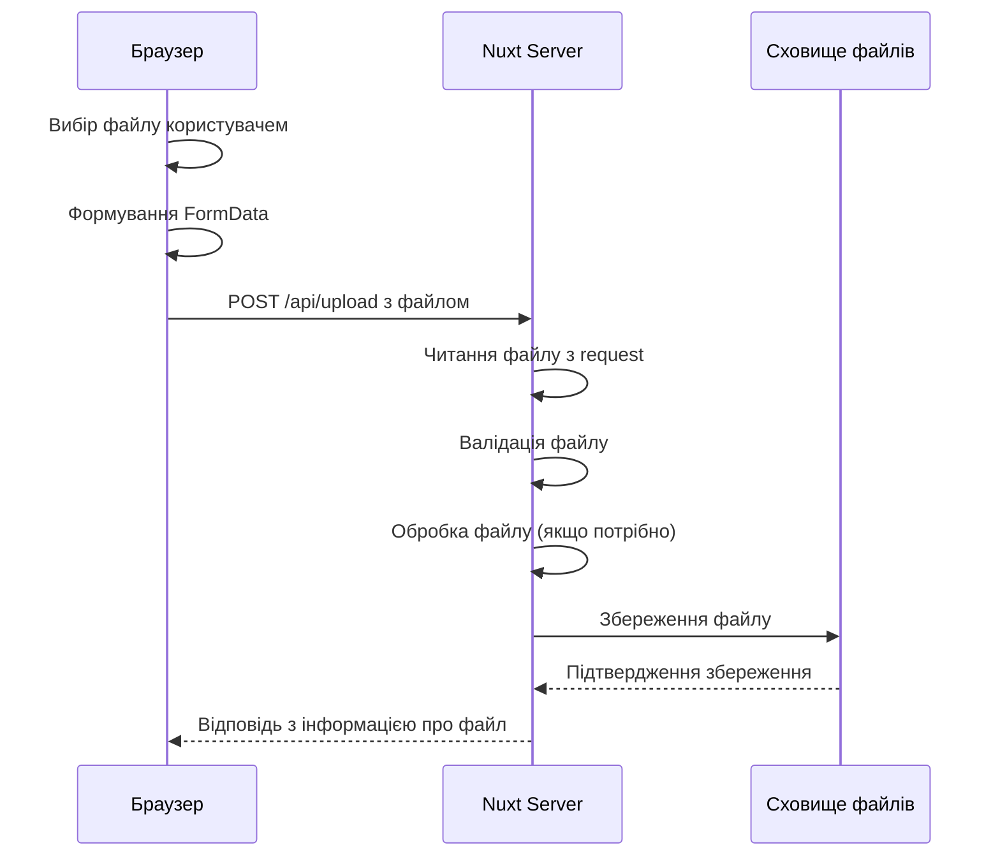
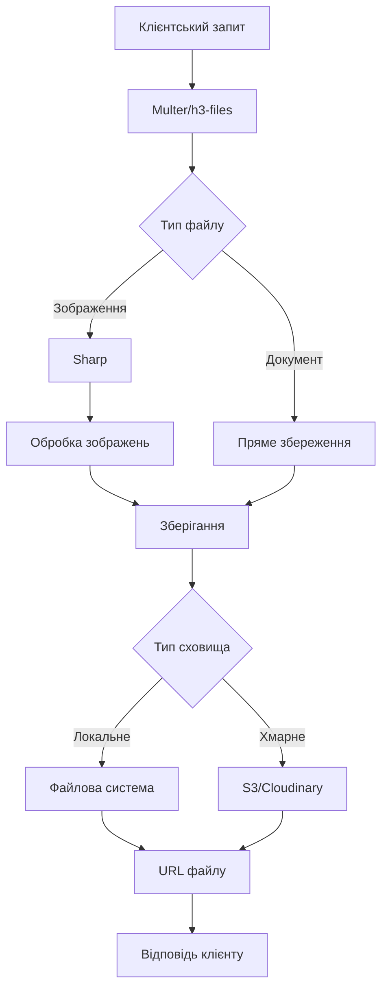
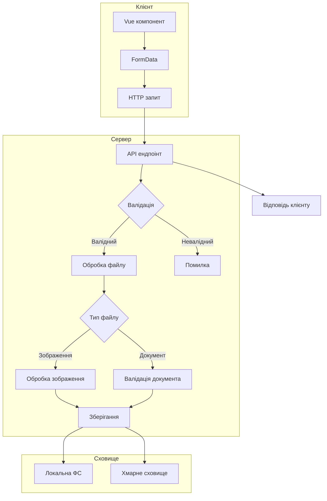

# Бекенд на Nuxt

## Файлова система

Робота з файлами є важливою частиною багатьох веб-додатків — від завантаження зображень профілю до обробки документів. Nuxt надає зручні інструменти для роботи з файловою системою як на сервері, так і для взаємодії з файлами, завантаженими користувачами.

### Для чого використовується

-   **Завантаження файлів**: прийом файлів від користувачів (зображення, документи)
-   **Зберігання файлів**: організація та постійне зберігання файлів
-   **Обробка зображень**: зміна розміру, кадрування, оптимізація
-   **Генерація файлів**: створення PDF, Excel та інших форматів на сервері

### Завантаження файлів

Nuxt дозволяє реалізувати завантаження файлів через API ендпоінти.

#### Базове завантаження файлів

1. **Створення API ендпоінту для завантаження файлів**:

```typescript
// server/api/upload.post.ts
import { readFiles } from "h3";
import { randomUUID } from "crypto";
import fs from "node:fs";
import path from "node:path";

export default defineEventHandler(async (event) => {
    try {
        // Створення директорії для зберігання файлів, якщо вона не існує
        const uploadsDir = path.resolve("./public/uploads");
        if (!fs.existsSync(uploadsDir)) {
            fs.mkdirSync(uploadsDir, { recursive: true });
        }

        // Читання файлів з запиту
        const files = await readFiles(event);

        // Перевірка, чи є файли
        if (!files) {
            throw createError({
                statusCode: 400,
                message: "No files uploaded",
            });
        }

        // Обробка файлів
        const uploadedFiles = [];

        for (const fieldname in files) {
            const file = files[fieldname];

            // Генерація унікального імені файлу
            const fileExt = path.extname(file.filename);
            const newFilename = `${randomUUID()}${fileExt}`;
            const filePath = path.join(uploadsDir, newFilename);

            // Збереження файлу
            await fs.promises.writeFile(filePath, file.data);

            // Додавання інформації про файл у відповідь
            uploadedFiles.push({
                originalName: file.filename,
                filename: newFilename,
                mimetype: file.type,
                size: file.data.length,
                path: `/uploads/${newFilename}`,
            });
        }

        return {
            success: true,
            files: uploadedFiles,
        };
    } catch (error) {
        console.error("Upload error:", error);
        throw createError({
            statusCode: 500,
            message: `Upload failed: ${error.message}`,
        });
    }
});
```

2. **Клієнтська частина для завантаження файлів**:

```vue
<!-- components/FileUploader.vue -->
<template>
    <div>
        <input type="file" @change="handleFileChange" :multiple="multiple" />
        <div v-if="uploading" class="progress">Uploading: {{ progress }}%</div>
        <div v-if="uploadedFiles.length" class="files">
            <div
                v-for="file in uploadedFiles"
                :key="file.filename"
                class="file"
            >
                
                <div class="file-info">
                    <div>{{ file.originalName }}</div>
                    <div>{{ formatSize(file.size) }}</div>
                </div>
            </div>
        </div>
    </div>
</template>

<script setup>
import { ref } from "vue";

const props = defineProps({
    multiple: {
        type: Boolean,
        default: false,
    },
});

const uploading = ref(false);
const progress = ref(0);
const uploadedFiles = ref([]);

const handleFileChange = async (event) => {
    const files = event.target.files;

    if (!files.length) return;

    uploading.value = true;
    progress.value = 0;

    try {
        const formData = new FormData();

        for (let i = 0; i < files.length; i++) {
            formData.append(`file${i}`, files[i]);
        }

        // Створення XMLHttpRequest для відстеження прогресу
        const xhr = new XMLHttpRequest();

        xhr.upload.addEventListener("progress", (e) => {
            if (e.lengthComputable) {
                progress.value = Math.round((e.loaded / e.total) * 100);
            }
        });

        // Використання Promise для роботи з XMLHttpRequest
        const response = await new Promise((resolve, reject) => {
            xhr.open("POST", "/api/upload");

            xhr.onload = () => {
                if (xhr.status >= 200 && xhr.status < 300) {
                    resolve(JSON.parse(xhr.responseText));
                } else {
                    reject(
                        new Error(`Upload failed with status ${xhr.status}`)
                    );
                }
            };

            xhr.onerror = () => reject(new Error("Network error"));

            xhr.send(formData);
        });

        // Оновлення списку завантажених файлів
        uploadedFiles.value = [...uploadedFiles.value, ...response.files];

        // Очищення input
        event.target.value = null;
    } catch (error) {
        console.error("Upload failed:", error);
        // Тут можна показати користувачу помилку
    } finally {
        uploading.value = false;
    }
};

const formatSize = (bytes) => {
    if (bytes < 1024) return bytes + " bytes";
    if (bytes < 1024 * 1024) return (bytes / 1024).toFixed(1) + " KB";
    return (bytes / (1024 * 1024)).toFixed(1) + " MB";
};
</script>
```

#### Перевірка типів файлів та обмеження розміру

```typescript
// server/api/upload-secure.post.ts
import { readFiles } from "h3";
import { randomUUID } from "crypto";
import fs from "node:fs";
import path from "node:path";

// Дозволені типи файлів
const ALLOWED_MIME_TYPES = [
    "image/jpeg",
    "image/png",
    "image/gif",
    "application/pdf",
];

// Максимальний розмір файлу (10MB)
const MAX_FILE_SIZE = 10 * 1024 * 1024;

export default defineEventHandler(async (event) => {
    try {
        const uploadsDir = path.resolve("./public/uploads");
        if (!fs.existsSync(uploadsDir)) {
            fs.mkdirSync(uploadsDir, { recursive: true });
        }

        const files = await readFiles(event);

        if (!files) {
            throw createError({
                statusCode: 400,
                message: "No files uploaded",
            });
        }

        const uploadedFiles = [];

        for (const fieldname in files) {
            const file = files[fieldname];

            // Перевірка розміру файлу
            if (file.data.length > MAX_FILE_SIZE) {
                throw createError({
                    statusCode: 400,
                    message: `File ${file.filename} exceeds maximum allowed size of 10MB`,
                });
            }

            // Перевірка типу файлу
            if (!ALLOWED_MIME_TYPES.includes(file.type)) {
                throw createError({
                    statusCode: 400,
                    message: `File type ${file.type} is not allowed`,
                });
            }

            // Генерація безпечного імені файлу
            const fileExt = path.extname(file.filename).toLowerCase();
            const newFilename = `${randomUUID()}${fileExt}`;
            const filePath = path.join(uploadsDir, newFilename);

            // Збереження файлу
            await fs.promises.writeFile(filePath, file.data);

            uploadedFiles.push({
                originalName: file.filename,
                filename: newFilename,
                mimetype: file.type,
                size: file.data.length,
                path: `/uploads/${newFilename}`,
            });
        }

        return {
            success: true,
            files: uploadedFiles,
        };
    } catch (error) {
        console.error("Upload error:", error);
        throw createError({
            statusCode: error.statusCode || 500,
            message: error.message || "Upload failed",
        });
    }
});
```

### Зберігання файлів

Існує кілька підходів до зберігання завантажених файлів у Nuxt-додатку.

#### Локальне зберігання файлів

Локальне зберігання файлів на сервері підходить для невеликих додатків або прототипів:

```typescript
// server/utils/storage/local.ts
import fs from "node:fs";
import path from "node:path";
import { randomUUID } from "crypto";

// Базова директорія для файлів
const UPLOADS_DIR = path.resolve("./public/uploads");

// Створення директорії, якщо вона не існує
if (!fs.existsSync(UPLOADS_DIR)) {
    fs.mkdirSync(UPLOADS_DIR, { recursive: true });
}

export const localFileStorage = {
    // Зберегти файл
    async saveFile(
        fileBuffer: Buffer,
        originalFilename: string
    ): Promise<string> {
        const fileExt = path.extname(originalFilename);
        const filename = `${randomUUID()}${fileExt}`;
        const filePath = path.join(UPLOADS_DIR, filename);

        await fs.promises.writeFile(filePath, fileBuffer);

        return `/uploads/${filename}`;
    },

    // Отримати файл
    async getFile(filename: string): Promise<Buffer> {
        const filePath = path.join(UPLOADS_DIR, path.basename(filename));

        return fs.promises.readFile(filePath);
    },

    // Видалити файл
    async deleteFile(filename: string): Promise<void> {
        const filePath = path.join(UPLOADS_DIR, path.basename(filename));

        if (fs.existsSync(filePath)) {
            await fs.promises.unlink(filePath);
        }
    },

    // Перевірити існування файлу
    async fileExists(filename: string): Promise<boolean> {
        const filePath = path.join(UPLOADS_DIR, path.basename(filename));

        return fs.existsSync(filePath);
    },
};
```

#### Зберігання файлів у хмарі (AWS S3)

Для продакшн-додатків рекомендується використовувати хмарне сховище:

1. **Встановлення залежностей**:

```bash
npm install @aws-sdk/client-s3 @aws-sdk/s3-request-presigner
```

2. **Реалізація сервісу для роботи з S3**:

```typescript
// server/utils/storage/s3.ts
import {
    S3Client,
    PutObjectCommand,
    GetObjectCommand,
    DeleteObjectCommand,
    HeadObjectCommand,
} from "@aws-sdk/client-s3";
import { getSignedUrl } from "@aws-sdk/s3-request-presigner";
import { randomUUID } from "crypto";
import path from "node:path";

// Конфігурація S3
const s3Client = new S3Client({
    region: useRuntimeConfig().aws.region,
    credentials: {
        accessKeyId: useRuntimeConfig().aws.accessKeyId,
        secretAccessKey: useRuntimeConfig().aws.secretAccessKey,
    },
});

const BUCKET_NAME = useRuntimeConfig().aws.bucketName;

export const s3FileStorage = {
    // Зберегти файл
    async saveFile(
        fileBuffer: Buffer,
        originalFilename: string
    ): Promise<string> {
        const fileExt = path.extname(originalFilename);
        const filename = `${randomUUID()}${fileExt}`;

        const command = new PutObjectCommand({
            Bucket: BUCKET_NAME,
            Key: filename,
            Body: fileBuffer,
            ContentType: getMimeType(fileExt),
        });

        await s3Client.send(command);

        return filename;
    },

    // Отримати URL для файлу
    async getFileUrl(filename: string, expiresIn = 3600): Promise<string> {
        const command = new GetObjectCommand({
            Bucket: BUCKET_NAME,
            Key: filename,
        });

        return getSignedUrl(s3Client, command, { expiresIn });
    },

    // Видалити файл
    async deleteFile(filename: string): Promise<void> {
        const command = new DeleteObjectCommand({
            Bucket: BUCKET_NAME,
            Key: filename,
        });

        await s3Client.send(command);
    },

    // Перевірити існування файлу
    async fileExists(filename: string): Promise<boolean> {
        try {
            const command = new HeadObjectCommand({
                Bucket: BUCKET_NAME,
                Key: filename,
            });

            await s3Client.send(command);
            return true;
        } catch (error) {
            return false;
        }
    },
};

// Допоміжна функція для визначення MIME-типу
function getMimeType(extension: string): string {
    const mimeTypes = {
        ".jpg": "image/jpeg",
        ".jpeg": "image/jpeg",
        ".png": "image/png",
        ".gif": "image/gif",
        ".pdf": "application/pdf",
        ".doc": "application/msword",
        ".docx":
            "application/vnd.openxmlformats-officedocument.wordprocessingml.document",
    };

    return mimeTypes[extension.toLowerCase()] || "application/octet-stream";
}
```

3. **Використання в API ендпоінті**:

```typescript
// server/api/upload-s3.post.ts
import { readFiles } from "h3";
import { s3FileStorage } from "~/server/utils/storage/s3";

export default defineEventHandler(async (event) => {
    try {
        const files = await readFiles(event);

        if (!files) {
            throw createError({
                statusCode: 400,
                message: "No files uploaded",
            });
        }

        const uploadedFiles = [];

        for (const fieldname in files) {
            const file = files[fieldname];

            // Завантаження файлу в S3
            const filename = await s3FileStorage.saveFile(
                file.data,
                file.filename
            );

            // Отримання URL для доступу до файлу
            const fileUrl = await s3FileStorage.getFileUrl(filename);

            uploadedFiles.push({
                originalName: file.filename,
                filename,
                mimetype: file.type,
                size: file.data.length,
                url: fileUrl,
            });
        }

        return {
            success: true,
            files: uploadedFiles,
        };
    } catch (error) {
        console.error("S3 upload error:", error);
        throw createError({
            statusCode: 500,
            message: `S3 upload failed: ${error.message}`,
        });
    }
});
```

### Обробка зображень

Часто завантажені зображення потребують обробки перед збереженням (зміна розміру, кадрування, оптимізація).

#### Використання Sharp для обробки зображень

1. **Встановлення залежностей**:

```bash
npm install sharp
```

2. **Сервіс для обробки зображень**:

```typescript
// server/utils/image-processor.ts
import sharp from "sharp";

export const imageProcessor = {
    // Зміна розміру зображення
    async resize(
        imageBuffer: Buffer,
        width: number,
        height: number,
        options: { fit?: "cover" | "contain" | "fill" } = {}
    ): Promise<Buffer> {
        return sharp(imageBuffer)
            .resize({
                width,
                height,
                fit: options.fit || "cover",
            })
            .toBuffer();
    },

    // Кадрування зображення
    async crop(
        imageBuffer: Buffer,
        width: number,
        height: number,
        left: number,
        top: number
    ): Promise<Buffer> {
        return sharp(imageBuffer)
            .extract({ left, top, width, height })
            .toBuffer();
    },

    // Зміна формату зображення
    async convert(
        imageBuffer: Buffer,
        format: "jpeg" | "png" | "webp",
        options: { quality?: number } = {}
    ): Promise<Buffer> {
        const transformer = sharp(imageBuffer);

        switch (format) {
            case "jpeg":
                return transformer
                    .jpeg({ quality: options.quality || 80 })
                    .toBuffer();
            case "png":
                return transformer
                    .png({ quality: options.quality || 80 })
                    .toBuffer();
            case "webp":
                return transformer
                    .webp({ quality: options.quality || 80 })
                    .toBuffer();
            default:
                return imageBuffer;
        }
    },

    // Створення мініатюри
    async thumbnail(imageBuffer: Buffer, size: number = 200): Promise<Buffer> {
        return sharp(imageBuffer)
            .resize(size, size, { fit: "cover" })
            .toBuffer();
    },

    // Отримання метаданих зображення
    async metadata(imageBuffer: Buffer): Promise<sharp.Metadata> {
        return sharp(imageBuffer).metadata();
    },

    // Оптимізація зображення
    async optimize(imageBuffer: Buffer): Promise<Buffer> {
        return sharp(imageBuffer)
            .jpeg({ quality: 80, progressive: true })
            .toBuffer();
    },
};
```

3. **Використання обробки зображень в API**:

```typescript
// server/api/upload-image.post.ts
import { readFiles } from "h3";
import { randomUUID } from "crypto";
import fs from "node:fs";
import path from "node:path";
import { imageProcessor } from "~/server/utils/image-processor";

// Дозволені типи зображень
const ALLOWED_IMAGE_TYPES = [
    "image/jpeg",
    "image/png",
    "image/gif",
    "image/webp",
];

export default defineEventHandler(async (event) => {
    try {
        const uploadsDir = path.resolve("./public/uploads");
        const thumbnailsDir = path.resolve("./public/uploads/thumbnails");

        // Створення директорій, якщо вони не існують
        if (!fs.existsSync(uploadsDir)) {
            fs.mkdirSync(uploadsDir, { recursive: true });
        }

        if (!fs.existsSync(thumbnailsDir)) {
            fs.mkdirSync(thumbnailsDir, { recursive: true });
        }

        const files = await readFiles(event);

        if (!files) {
            throw createError({
                statusCode: 400,
                message: "No files uploaded",
            });
        }

        const uploadedImages = [];

        for (const fieldname in files) {
            const file = files[fieldname];

            // Перевірка типу файлу
            if (!ALLOWED_IMAGE_TYPES.includes(file.type)) {
                throw createError({
                    statusCode: 400,
                    message: `File type ${file.type} is not an allowed image type`,
                });
            }

            // Отримання метаданих зображення
            const metadata = await imageProcessor.metadata(file.data);

            // Зміна розміру зображення (якщо потрібно)
            let processedImage = file.data;
            if (metadata.width && metadata.width > 1200) {
                processedImage = await imageProcessor.resize(
                    file.data,
                    1200,
                    undefined
                );
            }

            // Створення мініатюри
            const thumbnail = await imageProcessor.thumbnail(file.data, 200);

            // Генерація унікальних імен файлів
            const fileExt = path.extname(file.filename).toLowerCase();
            const newFilename = `${randomUUID()}${fileExt}`;
            const thumbnailFilename = `thumb_${newFilename}`;

            const filePath = path.join(uploadsDir, newFilename);
            const thumbnailPath = path.join(thumbnailsDir, thumbnailFilename);

            // Збереження файлів
            await fs.promises.writeFile(filePath, processedImage);
            await fs.promises.writeFile(thumbnailPath, thumbnail);

            uploadedImages.push({
                originalName: file.filename,
                filename: newFilename,
                path: `/uploads/${newFilename}`,
                thumbnailPath: `/uploads/thumbnails/${thumbnailFilename}`,
                width: metadata.width,
                height: metadata.height,
                size: processedImage.length,
                format: metadata.format,
            });
        }

        return {
            success: true,
            images: uploadedImages,
        };
    } catch (error) {
        console.error("Image upload error:", error);
        throw createError({
            statusCode: error.statusCode || 500,
            message: error.message || "Image upload failed",
        });
    }
});
```

### Генерація файлів

Nuxt може використовуватися для генерації файлів, таких як PDF, Excel та інші.

#### Генерація PDF документів

1. **Встановлення залежностей**:

```bash
npm install pdfkit
```

2. **Сервіс для генерації PDF**:

```typescript
// server/utils/pdf-generator.ts
import PDFDocument from "pdfkit";
import fs from "node:fs";
import path from "node:path";
import { randomUUID } from "crypto";

export async function generateInvoicePdf(invoiceData: any): Promise<string> {
    return new Promise((resolve, reject) => {
        try {
            // Створення PDF документа
            const doc = new PDFDocument({ margin: 50 });

            // Генерація унікального імені файлу
            const filename = `invoice_${randomUUID()}.pdf`;
            const outputDir = path.resolve("./public/documents");

            // Створення директорії, якщо вона не існує
            if (!fs.existsSync(outputDir)) {
                fs.mkdirSync(outputDir, { recursive: true });
            }

            const outputPath = path.join(outputDir, filename);
            const outputStream = fs.createWriteStream(outputPath);

            // Обробка подій потоку
            outputStream.on("finish", () => {
                resolve(`/documents/${filename}`);
            });

            outputStream.on("error", (err) => {
                reject(err);
            });

            // Напрямок PDF у файл
            doc.pipe(outputStream);

            // Додавання вмісту до PDF
            doc.fontSize(25).text("Invoice", { align: "center" }).moveDown();

            // Інформація про компанію
            doc.fontSize(10)
                .text(`Invoice Number: ${invoiceData.invoiceNumber}`)
                .text(`Date: ${new Date().toLocaleDateString()}`)
                .moveDown()
                .text(`Client: ${invoiceData.client.name}`)
                .text(`Address: ${invoiceData.client.address}`)
                .moveDown();

            // Таблиця товарів
            doc.moveDown();
            let yPos = doc.y;

            // Заголовки таблиці
            doc.fontSize(10)
                .text("Item", 50, yPos)
                .text("Quantity", 200, yPos)
                .text("Price", 300, yPos)
                .text("Amount", 400, yPos)
                .moveDown();

            yPos = doc.y;
            doc.moveTo(50, yPos).lineTo(500, yPos).stroke();

            // Рядки таблиці
            invoiceData.items.forEach((item, i) => {
                yPos = doc.y + 10;
                doc.text(item.description, 50, yPos)
                    .text(item.quantity.toString(), 200, yPos)
                    .text(`$${item.price.toFixed(2)}`, 300, yPos)
                    .text(
                        `$${(item.quantity * item.price).toFixed(2)}`,
                        400,
                        yPos
                    )
                    .moveDown();
            });

            // Підсумки
            yPos = doc.y + 10;
            doc.moveTo(50, yPos).lineTo(500, yPos).stroke();

            const total = invoiceData.items.reduce(
                (sum, item) => sum + item.quantity * item.price,
                0
            );

            yPos = doc.y + 20;
            doc.text("Total:", 300, yPos).text(
                `$${total.toFixed(2)}`,
                400,
                yPos
            );

            // Фіналізація документа
            doc.end();
        } catch (error) {
            reject(error);
        }
    });
}
```

3. **API ендпоінт для генерації PDF**:

```typescript
// server/api/generate-invoice.post.ts
import { generateInvoicePdf } from "~/server/utils/pdf-generator";

export default defineEventHandler(async (event) => {
    try {
        const body = await readBody(event);

        // Валідація вхідних даних
        if (
            !body.invoiceNumber ||
            !body.client ||
            !body.items ||
            !body.items.length
        ) {
            throw createError({
                statusCode: 400,
                message: "Invalid invoice data",
            });
        }

        // Генерація PDF
        const pdfPath = await generateInvoicePdf(body);

        return {
            success: true,
            pdfUrl: pdfPath,
        };
    } catch (error) {
        console.error("PDF generation error:", error);
        throw createError({
            statusCode: 500,
            message: `PDF generation failed: ${error.message}`,
        });
    }
});
```

### Підкапотні механізми

#### Як працює завантаження файлів



#### Потоки даних при роботі з файлами



#### Особливості та підводні камені

1. **Безпека при завантаженні файлів**:
    - Завжди перевіряйте тип файлу та розмір
    - Не довіряйте імені файлу, наданому клієнтом
    - Використовуйте обмеження на розширення файлів

```typescript
// Перевірка типу файлу на основі його вмісту, а не лише розширення
import { Magic, MAGIC_MIME_TYPE } from "mmmagic";

const magic = new Magic(MAGIC_MIME_TYPE);

function detectMimeType(buffer: Buffer): Promise<string> {
    return new Promise((resolve, reject) => {
        magic.detect(buffer, (err, result) => {
            if (err) reject(err);
            resolve(result as string);
        });
    });
}

// Використання в API
const actualMimeType = await detectMimeType(file.data);
if (actualMimeType !== file.type) {
    throw createError({
        statusCode: 400,
        message: "File type does not match content",
    });
}
```

2. **Продуктивність**:
    - Великі файли можуть спричинити проблеми з пам'яттю
    - Використовуйте потоки для обробки великих файлів

```typescript
// Збереження великого файлу з використанням потоків
import { createReadStream, createWriteStream } from "node:fs";
import { pipeline } from "node:stream/promises";

async function saveFileWithStream(tempPath: string, destinationPath: string) {
    const source = createReadStream(tempPath);
    const destination = createWriteStream(destinationPath);

    try {
        await pipeline(source, destination);
        return true;
    } catch (error) {
        console.error("File stream error:", error);
        return false;
    }
}
```

3. **Тимчасові файли**:
    - Регулярно очищуйте тимчасові файли
    - Використовуйте систему для відстеження файлів без посилань

```typescript
// Очищення тимчасових файлів
import fs from "node:fs";
import path from "node:path";
import { prisma } from "~/server/plugins/prisma";

async function cleanupOrphanedFiles() {
    try {
        const uploadsDir = path.resolve("./public/uploads");
        const files = await fs.promises.readdir(uploadsDir);

        // Отримання списку файлів, що використовуються
        const usedFiles = await prisma.file.findMany({
            select: { filename: true },
        });

        const usedFilenames = new Set(usedFiles.map((f) => f.filename));

        // Видалення файлів, що не використовуються
        for (const file of files) {
            if (!usedFilenames.has(file)) {
                await fs.promises.unlink(path.join(uploadsDir, file));
                console.log(`Deleted orphaned file: ${file}`);
            }
        }

        console.log("Cleanup completed");
    } catch (error) {
        console.error("Cleanup error:", error);
    }
}

// Запуск очищення за розкладом
export default defineNitroPlugin(() => {
    // Запуск очищення раз на день
    setInterval(cleanupOrphanedFiles, 24 * 60 * 60 * 1000);
});
```

#### Оптимізація

1. **Обмеження кількості одночасних завантажень**:

```typescript
// server/middleware/upload-limiter.ts
import { RateLimiter } from "limiter-flexible";

// Обмеження: максимум 10 одночасних завантажень
const uploadLimiter = new RateLimiter({
    points: 10,
    duration: 1,
});

export default defineEventHandler(async (event) => {
    if (event.path.startsWith("/api/upload")) {
        try {
            await uploadLimiter.consume(
                event.context.clientAddress || "anonymous"
            );
        } catch (error) {
            return sendError(
                event,
                createError({
                    statusCode: 429,
                    message: "Too many upload requests, please try again later",
                })
            );
        }
    }
});
```

2. **Використання WebP для зображень**:

```typescript
// Перетворення завантажених зображень у WebP для економії місця
async function convertToWebP(
    imageBuffer: Buffer,
    quality = 80
): Promise<Buffer> {
    return sharp(imageBuffer).webp({ quality }).toBuffer();
}

// Використання в API
const webpBuffer = await convertToWebP(file.data);
```

3. **Попередньо підписані URL для завантаження файлів**:

```typescript
// server/api/get-upload-url.post.ts
import { getSignedUrl } from "@aws-sdk/s3-request-presigner";
import { S3Client, PutObjectCommand } from "@aws-sdk/client-s3";
import { randomUUID } from "crypto";

const s3Client = new S3Client({
    region: useRuntimeConfig().aws.region,
    credentials: {
        accessKeyId: useRuntimeConfig().aws.accessKeyId,
        secretAccessKey: useRuntimeConfig().aws.secretAccessKey,
    },
});

export default defineEventHandler(async (event) => {
    const body = await readBody(event);

    // Валідація
    if (!body.filename || !body.contentType) {
        throw createError({
            statusCode: 400,
            message: "Filename and contentType are required",
        });
    }

    // Генерація унікального імені файлу
    const fileExt = path.extname(body.filename);
    const key = `${randomUUID()}${fileExt}`;

    // Створення попередньо підписаного URL
    const command = new PutObjectCommand({
        Bucket: useRuntimeConfig().aws.bucketName,
        Key: key,
        ContentType: body.contentType,
    });

    // URL дійсний 10 хвилин
    const presignedUrl = await getSignedUrl(s3Client, command, {
        expiresIn: 600,
    });

    return {
        uploadUrl: presignedUrl,
        key,
        url: `https://${
            useRuntimeConfig().aws.bucketName
        }.s3.amazonaws.com/${key}`,
    };
});
```

### Схеми та діаграми

#### Архітектура системи роботи з файлами



#### Порівняння підходів до зберігання файлів

```
┌─────────────────────────────────────────────────────┐
│ Локальне зберігання                                 │
├─────────────────────┬───────────────────────────────┤
│ Переваги            │ Недоліки                      │
├─────────────────────┼───────────────────────────────┤
│ + Просте налаштування│ - Обмежений об'єм            │
│ + Повний контроль   │ - Проблеми з масштабуванням   │
│ + Швидкий доступ    │ - Резервне копіювання         │
│ + Немає додаткових  │ - Висока вартість сервера     │
│   витрат            │   для великих обсягів         │
└─────────────────────┴───────────────────────────────┘

┌─────────────────────────────────────────────────────┐
│ Хмарне зберігання (S3, Cloudinary)                  │
├─────────────────────┬───────────────────────────────┤
│ Переваги            │ Недоліки                      │
├─────────────────────┼───────────────────────────────┤
│ + Необмежений об'єм │ - Складніше налаштування      │
│ + Масштабованість   │ - Залежність від провайдера   │
│ + Географічне       │ - Додаткові витрати           │
│   розподілення      │ - Можливі затримки            │
│ + CDN інтеграція    │   при завантаженні            │
└─────────────────────┴───────────────────────────────┘
```

#### Життєвий цикл файлу

```
┌─────────────────────────────────────────────────────┐
│ 1. Завантаження користувачем                        │
│    - Вибір файлу в браузері                         │
│    - Формування запиту на сервер                    │
└─────────────────┬───────────────────────────────────┘
                  ▼
┌─────────────────────────────────────────────────────┐
│ 2. Обробка на сервері                               │
│    - Валідація файлу                                │
│    - Сканування на віруси                           │
│    - Обробка (для зображень)                        │
└─────────────────┬───────────────────────────────────┘
                  ▼
┌─────────────────────────────────────────────────────┐
│ 3. Зберігання                                       │
│    - Локальне сховище або хмара                     │
│    - Генерація URL для доступу                      │
└─────────────────┬───────────────────────────────────┘
                  ▼
┌─────────────────────────────────────────────────────┐
│ 4. Використання                                     │
│    - Відображення в додатку                         │
│    - Завантаження користувачами                     │
└─────────────────┬───────────────────────────────────┘
                  ▼
┌─────────────────────────────────────────────────────┐
│ 5. Видалення                                        │
│    - За запитом користувача                         │
│    - Автоматично (для тимчасових файлів)            │
└─────────────────────────────────────────────────────┘
```

> **Важливо**: Вибір підходу до зберігання файлів залежить від потреб проєкту. Для невеликих додатків локальне зберігання може бути достатнім, але для продакшн-додатків рекомендується використовувати хмарні рішення для кращої масштабованості та надійності.

Робота з файлами в Nuxt дозволяє створювати повноцінні веб-додатки з можливістю завантаження, обробки та збереження файлів різних типів. Від профільних зображень до складних документів — Nuxt надає всі необхідні інструменти для роботи з файловою системою як на сервері, так і для взаємодії з користувацькими файлами.
