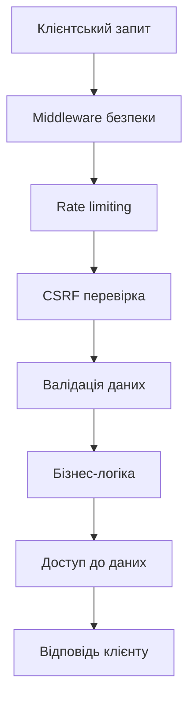

# Бекенд на Nuxt

## Безпека та захист від вразливостей

Безпека є критичним аспектом будь-якого веб-додатку. Nuxt надає інструменти та підходи для захисту від поширених вразливостей веб-додатків, включаючи XSS, CSRF, SQL-ін'єкції та інші.

### Основні загрози безпеки

-   **XSS (Cross-Site Scripting)**: ін'єкція шкідливих скриптів у веб-сторінки
-   **CSRF (Cross-Site Request Forgery)**: змушення користувачів виконувати небажані дії
-   **SQL-ін'єкції**: маніпуляція SQL-запитами через користувацькі входи
-   **DDoS-атаки**: перевантаження сервера великою кількістю запитів
-   **Недоліки в автентифікації та авторизації**: неправильна перевірка облікових даних

### Захист від XSS

Nuxt автоматично захищає від XSS завдяки Vue.js, який за замовчуванням екранує вміст HTML.

#### Додаткові заходи

```typescript
// server/middleware/content-security-policy.ts
export default defineEventHandler((event) => {
    // Встановлення заголовків Content-Security-Policy
    appendHeader(
        event,
        "Content-Security-Policy",
        "default-src 'self'; " +
            "script-src 'self' 'unsafe-inline'; " +
            "style-src 'self' 'unsafe-inline'; " +
            "img-src 'self' data:; " +
            "font-src 'self'; " +
            "connect-src 'self'"
    );
});
```

```typescript
// plugins/sanitize.ts
import { createSanitizer } from "some-sanitizer-library";

export default defineNuxtPlugin(() => {
    const sanitize = createSanitizer({
        allowedTags: ["p", "b", "i", "em", "strong", "a", "ul", "ol", "li"],
        allowedAttributes: {
            a: ["href", "target"],
        },
    });

    return {
        provide: {
            sanitize,
        },
    };
});
```

```vue
<!-- Використання в компоненті -->
<template>
    <div v-html="$sanitize(userGeneratedContent)"></div>
</template>
```

### Захист від CSRF

Реалізація CSRF-токенів для захисту від підробки міжсайтових запитів.

```typescript
// server/middleware/csrf-protection.ts
import { randomUUID } from "crypto";

export default defineEventHandler((event) => {
    // Пропускаємо для GET та HEAD запитів
    if (["GET", "HEAD"].includes(event.method || "")) {
        return;
    }

    // Перевіряємо наявність CSRF-токену для POST, PUT, DELETE
    const csrfToken = getCookie(event, "csrf-token");
    const requestToken = getHeader(event, "x-csrf-token");

    if (!csrfToken || !requestToken || csrfToken !== requestToken) {
        return createError({
            statusCode: 403,
            message: "CSRF token validation failed",
        });
    }
});

// Генерація CSRF-токена для клієнта
export function generateCsrfToken(event) {
    const token = randomUUID();
    setCookie(event, "csrf-token", token, {
        httpOnly: true,
        secure: process.env.NODE_ENV === "production",
        sameSite: "strict",
    });
    return token;
}
```

```typescript
// server/api/csrf-token.get.ts
import { generateCsrfToken } from "~/server/middleware/csrf-protection";

export default defineEventHandler((event) => {
    const token = generateCsrfToken(event);
    return { token };
});
```

```typescript
// composables/useCsrf.ts
export function useCsrf() {
    const token = ref("");

    const fetchToken = async () => {
        try {
            const { token: newToken } = await $fetch("/api/csrf-token");
            token.value = newToken;
        } catch (error) {
            console.error("Failed to fetch CSRF token:", error);
        }
    };

    const headers = computed(() => {
        return token.value ? { "x-csrf-token": token.value } : {};
    });

    return {
        token,
        fetchToken,
        headers,
    };
}
```

### Запобігання SQL-ін'єкціям

Захист від SQL-ін'єкцій через використання ORM та параметризованих запитів.

```typescript
// Неправильно (вразливо до SQL-ін'єкцій)
const query = `SELECT * FROM users WHERE username = '${username}'`;

// Правильно (використання параметризованих запитів)
import { PrismaClient } from "@prisma/client";
const prisma = new PrismaClient();

// server/api/user/[username].get.ts
export default defineEventHandler(async (event) => {
    const username = getRouterParam(event, "username");

    // Безпечний запит з Prisma
    const user = await prisma.user.findUnique({
        where: { username },
    });

    return user;
});
```

### Захист від Rate Limiting та DoS атак

```typescript
// server/middleware/rate-limiter.ts
import { RateLimiter } from "limiter-flexible";

// Лімітування запитів: 100 запитів за 1 хвилину
const limiter = new RateLimiter({
    points: 100,
    duration: 60,
});

export default defineEventHandler(async (event) => {
    const ip = event.context.clientAddress || "anonymous";

    try {
        await limiter.consume(ip);
    } catch (error) {
        return createError({
            statusCode: 429,
            message: "Too many requests, please try again later",
        });
    }
});
```

### Налаштування безпечних HTTP-заголовків

```typescript
// server/middleware/security-headers.ts
export default defineEventHandler((event) => {
    // Захист від клікджекінгу
    appendHeader(event, "X-Frame-Options", "DENY");

    // Захист від MIME-сніфінгу
    appendHeader(event, "X-Content-Type-Options", "nosniff");

    // Захист від XSS у старих браузерах
    appendHeader(event, "X-XSS-Protection", "1; mode=block");

    // Заборона індексації (для непублічних API)
    if (event.path.startsWith("/api/")) {
        appendHeader(event, "X-Robots-Tag", "noindex, nofollow");
    }

    // HSTS для HTTPS
    if (process.env.NODE_ENV === "production") {
        appendHeader(
            event,
            "Strict-Transport-Security",
            "max-age=31536000; includeSubDomains"
        );
    }
});
```

### Робота з Helmet для Nuxt

Для більш повного захисту використовуйте h3-helmet:

```bash
npm install h3-helmet
```

```typescript
// server/plugins/helmet.ts
import { defineNitroPlugin } from "nitropack/runtime";
import helmet from "h3-helmet";

export default defineNitroPlugin((nitroApp) => {
    nitroApp.h3App.use(
        helmet({
            contentSecurityPolicy: {
                directives: {
                    defaultSrc: ["'self'"],
                    scriptSrc: ["'self'", "'unsafe-inline'"],
                    styleSrc: ["'self'", "'unsafe-inline'"],
                    imgSrc: ["'self'", "data:"],
                    connectSrc: ["'self'"],
                    fontSrc: ["'self'"],
                    objectSrc: ["'none'"],
                    mediaSrc: ["'self'"],
                    frameSrc: ["'none'"],
                },
            },
            xssFilter: true,
            hsts: {
                maxAge: 31536000,
                includeSubDomains: true,
                preload: true,
            },
            noSniff: true,
            referrerPolicy: { policy: "same-origin" },
        })
    );
});
```

### Валідація вхідних даних

Важливо перевіряти всі дані, що надходять від користувачів:

```typescript
// server/api/users.post.ts
import { z } from "zod";

// Схема валідації
const userSchema = z.object({
    name: z.string().min(2).max(50),
    email: z.string().email(),
    age: z.number().int().positive().optional(),
});

export default defineEventHandler(async (event) => {
    try {
        const body = await readBody(event);

        // Валідація вхідних даних
        const validatedData = userSchema.parse(body);

        // Продовження обробки з валідованими даними
        const newUser = await prisma.user.create({
            data: validatedData,
        });

        return newUser;
    } catch (error) {
        if (error instanceof z.ZodError) {
            throw createError({
                statusCode: 400,
                message: "Validation error",
                data: error.errors,
            });
        }

        throw createError({
            statusCode: 500,
            message: "Internal server error",
        });
    }
});
```

### Найкращі практики безпеки

#### Діаграма безпечного потоку даних



#### Порівняння заходів безпеки

```
┌─────────────────────────────────────────────────────┐
│ Заходи безпеки                                      │
├─────────────────┬───────────────┬──────────────────┤
│ Захід           │ Від чого      │ Реалізація       │
├─────────────────┼───────────────┼──────────────────┤
│ CSP заголовки   │ XSS           │ Middleware       │
│ Sanitize HTML   │ XSS           │ Plugin           │
│ CSRF токени     │ CSRF          │ Middleware + API │
│ ORM + валідація │ Ін'єкції      │ API ендпоінти    │
│ Rate limiting   │ DDoS          │ Middleware       │
│ Helmet          │ Різні атаки   │ Nitro плагін     │
│ HTTPs           │ Перехоплення  │ Конфігурація     │
└─────────────────┴───────────────┴──────────────────┘
```

#### Контрольний список безпеки

1. **Автентифікація та авторизація**

    - Надійна парольна політика
    - Багатофакторна автентифікація
    - Захищені JWT з коротким терміном дії

2. **Захист даних**

    - Шифрування чутливих даних
    - Використання HTTPS
    - Безпечне зберігання паролів (bcrypt/argon2)

3. **Валідація вхідних даних**

    - Перевірка всіх користувацьких входів
    - Sanitize HTML та вихідних даних
    - Параметризовані запити до БД

4. **Захист від атак**

    - CSP та безпечні HTTP-заголовки
    - CSRF-токени
    - Rate limiting
    - Захист від брутфорс-атак

5. **Моніторинг та логування**
    - Журналювання подій безпеки
    - Моніторинг підозрілої активності
    - Регулярний аудит безпеки

### Приклад: Створення безпечного API ендпоінту

```typescript
// server/api/secure-data.post.ts
import { z } from "zod";

// Схема валідації
const dataSchema = z.object({
    userId: z.number().int().positive(),
    action: z.enum(["read", "write", "delete"]),
    data: z.string().optional(),
});

export default defineEventHandler(async (event) => {
    // 1. Перевірка авторизації
    const user = event.context.user;
    if (!user) {
        throw createError({
            statusCode: 401,
            message: "Unauthorized",
        });
    }

    try {
        // 2. Валідація вхідних даних
        const body = await readBody(event);
        const validatedData = dataSchema.parse(body);

        // 3. Перевірка доступу (авторизація)
        if (validatedData.userId !== user.id && !user.isAdmin) {
            throw createError({
                statusCode: 403,
                message: "Forbidden",
            });
        }

        // 4. Виконання дії з належною обробкою помилок
        try {
            const result = await performSecureAction(validatedData);
            return result;
        } catch (actionError) {
            throw createError({
                statusCode: 500,
                message: `Action failed: ${actionError.message}`,
            });
        }
    } catch (error) {
        if (error instanceof z.ZodError) {
            throw createError({
                statusCode: 400,
                message: "Validation error",
                data: error.errors,
            });
        }

        // Перекидаємо помилки авторизації та інші вже створені помилки
        if (error.statusCode) {
            throw error;
        }

        // Логуємо непередбачені помилки, але не розкриваємо деталі клієнту
        console.error("Secure endpoint error:", error);
        throw createError({
            statusCode: 500,
            message: "Internal server error",
        });
    }
});

// Безпечне виконання дії
async function performSecureAction({ userId, action, data }) {
    // Реалізація дії з належною обробкою помилок
    // та запобіганням витоку інформації

    switch (action) {
        case "read":
            return await prisma.userData.findUnique({
                where: { userId },
                select: { safeData: true }, // Вибір лише безпечних полів
            });
        case "write":
            return await prisma.userData.update({
                where: { userId },
                data: { safeData: data },
                select: { updatedAt: true },
            });
        case "delete":
            await prisma.userData.delete({
                where: { userId },
            });
            return { success: true };
        default:
            throw new Error("Invalid action");
    }
}
```

### Додаткові ресурси

-   [OWASP Top 10](https://owasp.org/www-project-top-ten/)
-   [Nuxt Security - офіційна документація](https://nuxt.com/docs/getting-started/security)
-   [OWASP Cheat Sheet Series](https://cheatsheetseries.owasp.org/)

> **Важливо**: Безпека — це процес, а не кінцевий стан. Регулярно оновлюйте залежності, проводьте аудит безпеки та слідкуйте за новими вразливостями.
