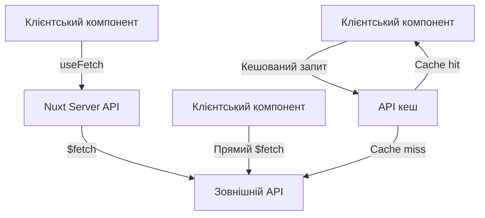

# Бекенд на Nuxt

## Взаємодія з зовнішніми API

Більшість сучасних веб-додатків взаємодіють з зовнішніми API для отримання даних, інтеграції сервісів або обміну інформацією. Nuxt надає потужні інструменти для ефективної та безпечної взаємодії з зовнішніми API.

### Інструменти для роботи з API

Nuxt пропонує декілька підходів до взаємодії з зовнішніми API:

1. **Вбудований `$fetch`**: Базується на [unjs/ofetch](https://github.com/unjs/ofetch), працює як на сервері, так і на клієнті
2. **API-шар Nitro**: Дозволяє створювати проксі-ендпоінти на сервері
3. **Бібліотеки**: Axios, TanStack Query та інші

### Вбудований $fetch

`$fetch` - це ізоморфна утиліта, яка працює однаково на клієнті та сервері.

```typescript
// composables/useWeather.ts
export function useWeather() {
    const config = useRuntimeConfig();
    const weatherData = ref(null);
    const loading = ref(false);
    const error = ref(null);

    const getWeather = async (city: string) => {
        loading.value = true;
        error.value = null;

        try {
            weatherData.value = await $fetch(
                `https://api.weatherapi.com/v1/current.json`,
                {
                    params: {
                        key: config.public.weatherApiKey,
                        q: city,
                    },
                }
            );
        } catch (err) {
            error.value = err.message || "Failed to fetch weather data";
        } finally {
            loading.value = false;
        }
    };

    return {
        weatherData,
        loading,
        error,
        getWeather,
    };
}
```

```vue
<!-- pages/weather.vue -->
<template>
    <div>
        <h1>Weather Information</h1>
        <div>
            <input v-model="city" placeholder="Enter city name" />
            <button @click="fetchWeather" :disabled="loading">
                Get Weather
            </button>
        </div>

        <div v-if="loading">Loading...</div>
        <div v-else-if="error" class="error">{{ error }}</div>
        <div v-else-if="weatherData" class="weather-data">
            <h2>
                {{ weatherData.location.name }},
                {{ weatherData.location.country }}
            </h2>
            <div class="temp">{{ weatherData.current.temp_c }}°C</div>
            <div>{{ weatherData.current.condition.text }}</div>
        </div>
    </div>
</template>

<script setup>
const { weatherData, loading, error, getWeather } = useWeather();
const city = ref("");

const fetchWeather = () => {
    if (city.value) {
        getWeather(city.value);
    }
};
</script>
```

### Проксіювання API через Nitro сервер

Використання сервера Nuxt як проксі для зовнішніх API допомагає:

-   Приховати ключі API від клієнта
-   Додати кешування
-   Трансформувати дані перед відправкою клієнту

```typescript
// server/api/weather/[city].get.ts
import { defineEventHandler, getRouterParam, createError } from "h3";

export default defineEventHandler(async (event) => {
    const city = getRouterParam(event, "city");
    const config = useRuntimeConfig();

    if (!city) {
        throw createError({
            statusCode: 400,
            message: "City parameter is required",
        });
    }

    try {
        // Запит до зовнішнього API
        const response = await $fetch(
            `https://api.weatherapi.com/v1/current.json`,
            {
                params: {
                    key: config.weatherApiKey, // Приватний ключ (не доступний на клієнті)
                    q: city,
                },
            }
        );

        // Трансформація даних (за потреби)
        return {
            city: response.location.name,
            country: response.location.country,
            temperature: response.current.temp_c,
            condition: response.current.condition.text,
            icon: response.current.condition.icon,
            updatedAt: new Date(),
        };
    } catch (error) {
        console.error("Weather API error:", error);

        throw createError({
            statusCode: error.response?.status || 500,
            message: error.message || "Failed to fetch weather data",
        });
    }
});
```

```vue
<!-- Тепер клієнт використовує наш проксі -->
<script setup>
const {
    data: weather,
    pending,
    error,
} = await useFetch(`/api/weather/${encodeURIComponent(city.value)}`);
</script>
```

### Налаштування `$fetch` та перехоплювачі

Можна налаштувати глобальні параметри запитів:

```typescript
// plugins/api.ts
export default defineNuxtPlugin(() => {
    const nuxtApp = useNuxtApp();
    const config = useRuntimeConfig();

    // Базові налаштування для всіх запитів
    nuxtApp.hook("app:created", () => {
        const originalFetch = globalThis.$fetch;

        globalThis.$fetch = async (request, options = {}) => {
            // Встановлення базових заголовків
            options.headers = {
                ...options.headers,
                Accept: "application/json",
                "Content-Type": "application/json",
            };

            // Додавання кастомних заголовків для авторизації
            const token = useCookie("token").value;
            if (token) {
                options.headers.Authorization = `Bearer ${token}`;
            }

            // Запит з оновленими опціями
            return await originalFetch(request, options);
        };
    });
});
```

### Використання TanStack Query (React Query)

TanStack Query надає потужні можливості для керування станом запитів, кешування та синхронізації.

```bash
npm install @tanstack/vue-query
```

```typescript
// plugins/vue-query.ts
import { VueQueryPlugin, QueryClient } from "@tanstack/vue-query";

export default defineNuxtPlugin((nuxtApp) => {
    const queryClient = new QueryClient({
        defaultOptions: {
            queries: {
                staleTime: 1000 * 60 * 5, // 5 хвилин
                refetchOnWindowFocus: false,
                retry: 1,
            },
        },
    });

    nuxtApp.vueApp.use(VueQueryPlugin, { queryClient });
});
```

```typescript
// composables/usePosts.ts
import { useQuery, useMutation, useQueryClient } from "@tanstack/vue-query";

export function usePosts() {
    const queryClient = useQueryClient();

    // Отримання списку постів
    const postsQuery = useQuery({
        queryKey: ["posts"],
        queryFn: () => $fetch("/api/posts"),
    });

    // Отримання одного поста
    const usePost = (id) => {
        return useQuery({
            queryKey: ["posts", id],
            queryFn: () => $fetch(`/api/posts/${id}`),
            enabled: !!id,
        });
    };

    // Створення нового поста
    const createPostMutation = useMutation({
        mutationFn: (newPost) =>
            $fetch("/api/posts", {
                method: "POST",
                body: newPost,
            }),
        onSuccess: () => {
            // Інвалідація кешу після успішного створення
            queryClient.invalidateQueries({ queryKey: ["posts"] });
        },
    });

    return {
        postsQuery,
        usePost,
        createPostMutation,
    };
}
```

```vue
<!-- pages/posts/index.vue -->
<template>
    <div>
        <h1>Posts</h1>
        <div v-if="postsQuery.isLoading">Loading...</div>
        <div v-else-if="postsQuery.isError">Error: {{ postsQuery.error }}</div>
        <div v-else>
            <div v-for="post in postsQuery.data" :key="post.id" class="post">
                <h2>{{ post.title }}</h2>
                <p>{{ post.excerpt }}</p>
                <NuxtLink :to="`/posts/${post.id}`">Read more</NuxtLink>
            </div>
        </div>

        <!-- Форма створення поста -->
        <div class="post-form">
            <h2>Create Post</h2>
            <form @submit.prevent="createPost">
                <input v-model="newPost.title" placeholder="Title" required />
                <textarea
                    v-model="newPost.content"
                    placeholder="Content"
                    required
                ></textarea>
                <button type="submit" :disabled="createPostMutation.isPending">
                    {{
                        createPostMutation.isPending
                            ? "Creating..."
                            : "Create Post"
                    }}
                </button>
            </form>
        </div>
    </div>
</template>

<script setup>
const { postsQuery, createPostMutation } = usePosts();
const newPost = ref({ title: "", content: "" });

const createPost = () => {
    createPostMutation.mutate(newPost.value, {
        onSuccess: () => {
            newPost.value = { title: "", content: "" };
        },
    });
};
</script>
```

### Обробка помилок API

Важливо правильно обробляти помилки під час взаємодії з зовнішніми API:

```typescript
// composables/useFetchWithError.ts
export function useFetchWithError<T>(url: string, options = {}) {
    const data = ref<T | null>(null);
    const error = ref(null);
    const loading = ref(true);

    const fetch = async () => {
        loading.value = true;
        error.value = null;

        try {
            data.value = await $fetch<T>(url, options);
        } catch (err) {
            error.value = {
                statusCode: err.response?.status || 500,
                message: err.message || "Unknown error",
                data: err.response?._data,
            };

            // Опціонально логування помилок
            if (process.server) {
                console.error(`API Error (${url}):`, error.value);
            }
        } finally {
            loading.value = false;
        }
    };

    // Викликаємо відразу, якщо immediate=true
    if (options.immediate !== false) {
        fetch();
    }

    return {
        data,
        error,
        loading,
        refresh: fetch,
    };
}
```

### Кешування API-запитів

Реалізація простого кешування для зменшення кількості запитів:

```typescript
// server/utils/api-cache.ts
import { createStorage } from "unstorage";
import memoryDriver from "unstorage/drivers/memory";

// Створення сховища в пам'яті для кешу
const storage = createStorage({
    driver: memoryDriver(),
});

export async function cachedFetch(url, options = {}, cacheTTL = 60) {
    const cacheKey = `api:${url}:${JSON.stringify(options)}`;

    // Спроба отримати з кешу
    const cached = await storage.getItem(cacheKey);
    if (cached) {
        return JSON.parse(cached);
    }

    // Виконання запиту, якщо немає в кеші
    const response = await $fetch(url, options);

    // Збереження в кеш
    await storage.setItem(cacheKey, JSON.stringify(response), {
        ttl: cacheTTL * 1000,
    });

    return response;
}
```

```typescript
// Використання кешованого запиту
// server/api/popular-posts.get.ts
import { cachedFetch } from "~/server/utils/api-cache";

export default defineEventHandler(async (event) => {
    // Кешування на 5 хвилин
    return await cachedFetch("https://external-api.com/popular-posts", {}, 300);
});
```

### Створення клієнтів для API

Для складних API варто створювати окремі клієнти:

```typescript
// server/utils/github-api.ts
const GITHUB_API_BASE = "https://api.github.com";

export const githubApi = {
    async getUser(username: string) {
        return await $fetch(`${GITHUB_API_BASE}/users/${username}`, {
            headers: {
                Accept: "application/vnd.github.v3+json",
                Authorization: `token ${useRuntimeConfig().githubToken}`,
            },
        });
    },

    async getRepos(username: string) {
        return await $fetch(`${GITHUB_API_BASE}/users/${username}/repos`, {
            headers: {
                Accept: "application/vnd.github.v3+json",
                Authorization: `token ${useRuntimeConfig().githubToken}`,
            },
            params: {
                sort: "updated",
                per_page: 10,
            },
        });
    },

    async getIssues(owner: string, repo: string) {
        return await $fetch(
            `${GITHUB_API_BASE}/repos/${owner}/${repo}/issues`,
            {
                headers: {
                    Accept: "application/vnd.github.v3+json",
                    Authorization: `token ${useRuntimeConfig().githubToken}`,
                },
                params: {
                    state: "open",
                    per_page: 20,
                },
            }
        );
    },
};
```

```typescript
// server/api/github/[username].get.ts
import { githubApi } from "~/server/utils/github-api";

export default defineEventHandler(async (event) => {
    const username = getRouterParam(event, "username");

    if (!username) {
        throw createError({
            statusCode: 400,
            message: "Username is required",
        });
    }

    try {
        // Паралельне виконання запитів
        const [user, repos] = await Promise.all([
            githubApi.getUser(username),
            githubApi.getRepos(username),
        ]);

        return {
            user,
            repos,
        };
    } catch (error) {
        throw createError({
            statusCode: error.response?.status || 500,
            message: error.message || "Failed to fetch GitHub data",
        });
    }
});
```

### Взаємодія з GraphQL API

Для роботи з GraphQL API можна використовувати `graphql-request`:

```bash
npm install graphql graphql-request
```

```typescript
// server/utils/graphql-client.ts
import { GraphQLClient, gql } from "graphql-request";

const endpoint = "https://api.example.com/graphql";
const client = new GraphQLClient(endpoint, {
    headers: {
        authorization: `Bearer ${useRuntimeConfig().graphqlToken}`,
    },
});

export const graphqlClient = {
    async getProducts() {
        const query = gql`
            query GetProducts {
                products(first: 10) {
                    id
                    title
                    price
                    imageUrl
                }
            }
        `;

        return await client.request(query);
    },

    async getProduct(id: string) {
        const query = gql`
            query GetProduct($id: ID!) {
                product(id: $id) {
                    id
                    title
                    description
                    price
                    imageUrl
                    categories {
                        id
                        name
                    }
                }
            }
        `;

        return await client.request(query, { id });
    },
};
```

```typescript
// server/api/products/[id].get.ts
import { graphqlClient } from "~/server/utils/graphql-client";

export default defineEventHandler(async (event) => {
    const id = getRouterParam(event, "id");

    if (!id) {
        throw createError({
            statusCode: 400,
            message: "Product ID is required",
        });
    }

    try {
        const { product } = await graphqlClient.getProduct(id);
        return product;
    } catch (error) {
        throw createError({
            statusCode: 500,
            message: `Failed to fetch product: ${error.message}`,
        });
    }
});
```

### Діаграми та схеми

#### Архітектура взаємодії з API



#### Порівняння підходів до API запитів

```
┌─────────────────────────────────────────────────────┐
│ Підхід              │ Переваги         │ Недоліки   │
├─────────────────────┼──────────────────┼────────────┤
│ Прямий $fetch       │ Простота         │ Безпека    │
│ з клієнта           │ Менше коду       │ Кешування  │
├─────────────────────┼──────────────────┼────────────┤
│ Проксі через        │ Приховані ключі  │ Більше коду│
│ Nuxt сервер         │ Трансформація    │ Складніше  │
├─────────────────────┼──────────────────┼────────────┤
│ TanStack Query      │ Кешування        │ Залежність │
│                     │ Інвалідація      │ Складніше  │
└─────────────────────┴──────────────────┴────────────┘
```

### Найкращі практики

1. **Використовуйте проксі** для приховування ключів API та конфіденційних даних.
2. **Додайте кешування** для зменшення кількості запитів до зовнішніх API.
3. **Обробляйте помилки** належним чином та інформативно.
4. **Застосовуйте ретрай-стратегії** для нестабільних API.
5. **Організуйте API-клієнти** для складних інтеграцій.
6. **Використовуйте абстракції** замість прямих викликів $fetch у компонентах.
7. **Додавайте автентифікацію** через middleware чи interceptors.
8. **Встановлюйте таймаути** для запитів, щоб запобігти "вічним" запитам.

```typescript
// Приклад встановлення таймауту
const data = await $fetch("https://slow-api.com/data", {
    timeout: 5000, // 5 секунд
});
```

9. **Додавайте логування** для відстеження проблем з API.

```typescript
// plugins/api-logger.ts
export default defineNuxtPlugin((nuxtApp) => {
    const config = useRuntimeConfig();

    // Логування лише в dev-режимі або на сервері
    if (process.dev || process.server) {
        nuxtApp.hook("app:created", () => {
            const originalFetch = globalThis.$fetch;

            globalThis.$fetch = async (request, options = {}) => {
                const startTime = Date.now();

                try {
                    const response = await originalFetch(request, options);

                    console.log(`API Request: ${request}`);
                    console.log(`Duration: ${Date.now() - startTime}ms`);

                    return response;
                } catch (error) {
                    console.error(`API Error: ${request}`);
                    console.error(`Status: ${error.response?.status}`);
                    console.error(`Message: ${error.message}`);

                    throw error;
                }
            };
        });
    }
});
```

10. **Використовуйте типізацію** для кращої розробки та автодоповнення.

```typescript
// types/api.ts
export interface User {
    id: number;
    name: string;
    email: string;
    role: "admin" | "user";
}

export interface Post {
    id: number;
    title: string;
    content: string;
    authorId: number;
    author?: User;
    createdAt: string;
}

// Типізований запит
const { data } = await useFetch<Post[]>("/api/posts");
```

### Висновок

Ефективна взаємодія з зовнішніми API є важливою складовою сучасних веб-додатків. Nuxt надає гнучкі інструменти для роботи з різними типами API (REST, GraphQL), забезпечуючи при цьому безпеку, продуктивність та зручність розробки. Використання серверних ендпоінтів як проксі, кешування та належна обробка помилок дозволяють створювати надійні та швидкі додатки з використанням зовнішніх даних та сервісів.
