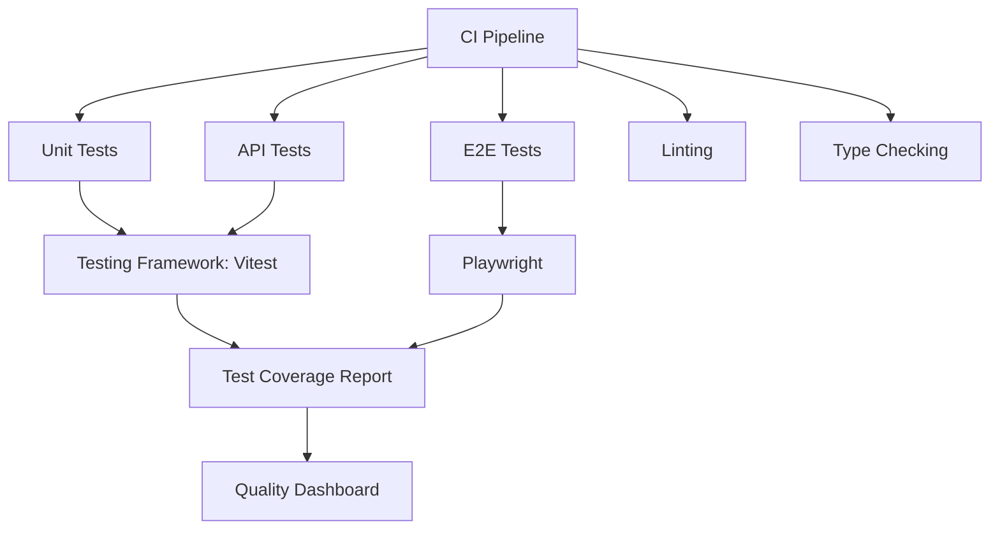

# Бекенд на Nuxt

## Тестування серверної частини

Тестування є невід'ємною частиною розробки надійних веб-додатків. Nuxt надає інструменти та підходи для ефективного тестування серверної частини вашого додатку, включаючи API ендпоінти, middleware та серверні утиліти.

### Види тестів

У тестуванні серверної частини Nuxt додатків зазвичай використовуються такі види тестів:

1. **Модульні тести (Unit Tests)**: тестування окремих функцій та утиліт
2. **Інтеграційні тести (Integration Tests)**: тестування взаємодії між компонентами
3. **API тести (API Tests)**: тестування API ендпоінтів
4. **End-to-End тести (E2E)**: тестування повного потоку взаємодії з додатком

### Налаштування середовища для тестування

#### Vitest

Vitest є рекомендованим інструментом для тестування у Nuxt 3 проектах.

1. **Встановлення залежностей**:

```bash
npm install -D vitest @nuxt/test-utils
```

2. **Конфігурація Vitest** у `vitest.config.ts`:

```typescript
import { defineConfig } from "vitest/config";
import { fileURLToPath } from "node:url";

export default defineConfig({
    test: {
        globals: true,
        environment: "node",
        include: ["test/**/*.test.ts"],
        exclude: ["node_modules", "dist", ".nuxt", ".output"],
    },
    resolve: {
        alias: {
            "~": fileURLToPath(new URL("./", import.meta.url)),
            "@": fileURLToPath(new URL("./", import.meta.url)),
        },
    },
});
```

3. **Додавання скриптів** у `package.json`:

```json
{
    "scripts": {
        "test": "vitest run",
        "test:watch": "vitest",
        "test:coverage": "vitest run --coverage"
    }
}
```

### Модульне тестування (Unit Testing)

Модульні тести перевіряють окремі функції, класи або компоненти ізольовано.

#### Тестування утиліт

```typescript
// server/utils/validation.ts
export function validateEmail(email: string): boolean {
    const regex = /^[^\s@]+@[^\s@]+\.[^\s@]+$/;
    return regex.test(email);
}

export function validatePassword(password: string): boolean {
    // Мінімум 8 символів, хоча б 1 літера та 1 цифра
    const regex = /^(?=.*[A-Za-z])(?=.*\d)[A-Za-z\d]{8,}$/;
    return regex.test(password);
}
```

```typescript
// test/utils/validation.test.ts
import { describe, test, expect } from "vitest";
import { validateEmail, validatePassword } from "~/server/utils/validation";

describe("Email validation", () => {
    test("valid emails", () => {
        expect(validateEmail("user@example.com")).toBe(true);
        expect(validateEmail("test.user+tag@subdomain.example.co.uk")).toBe(
            true
        );
    });

    test("invalid emails", () => {
        expect(validateEmail("invalid")).toBe(false);
        expect(validateEmail("user@")).toBe(false);
        expect(validateEmail("user@domain")).toBe(false);
        expect(validateEmail("")).toBe(false);
    });
});

describe("Password validation", () => {
    test("valid passwords", () => {
        expect(validatePassword("password123")).toBe(true);
        expect(validatePassword("securePass789")).toBe(true);
    });

    test("invalid passwords", () => {
        expect(validatePassword("pass")).toBe(false); // занадто коротка
        expect(validatePassword("password")).toBe(false); // немає цифр
        expect(validatePassword("12345678")).toBe(false); // немає літер
        expect(validatePassword("")).toBe(false); // порожня
    });
});
```

#### Тестування бізнес-логіки

```typescript
// server/utils/cart.ts
export interface CartItem {
    id: string;
    name: string;
    price: number;
    quantity: number;
}

export interface Cart {
    items: CartItem[];
}

export function calculateTotal(cart: Cart): number {
    return cart.items.reduce(
        (total, item) => total + item.price * item.quantity,
        0
    );
}

export function applyDiscount(total: number, discountPercent: number): number {
    if (discountPercent < 0 || discountPercent > 100) {
        throw new Error("Discount must be between 0 and 100");
    }

    return total - (total * discountPercent) / 100;
}
```

```typescript
// test/utils/cart.test.ts
import { describe, test, expect } from "vitest";
import { calculateTotal, applyDiscount } from "~/server/utils/cart";
import type { Cart } from "~/server/utils/cart";

describe("Cart utilities", () => {
    test("calculateTotal returns correct sum", () => {
        const cart: Cart = {
            items: [
                { id: "1", name: "Product 1", price: 10, quantity: 2 },
                { id: "2", name: "Product 2", price: 15.5, quantity: 1 },
                { id: "3", name: "Product 3", price: 5, quantity: 3 },
            ],
        };

        expect(calculateTotal(cart)).toBe(45.5); // 10*2 + 15.5*1 + 5*3
    });

    test("calculateTotal with empty cart returns 0", () => {
        const cart: Cart = { items: [] };
        expect(calculateTotal(cart)).toBe(0);
    });

    test("applyDiscount applies correct discount", () => {
        expect(applyDiscount(100, 10)).toBe(90); // 10% off 100
        expect(applyDiscount(50, 25)).toBe(37.5); // 25% off 50
        expect(applyDiscount(100, 0)).toBe(100); // 0% off (no discount)
    });

    test("applyDiscount throws error for invalid discount", () => {
        expect(() => applyDiscount(100, -10)).toThrow();
        expect(() => applyDiscount(100, 110)).toThrow();
    });
});
```

### Тестування API ендпоінтів

Для тестування API ендпоінтів можна використовувати `@nuxt/test-utils` або `supertest`.

#### Використання `@nuxt/test-utils`

```typescript
// test/api/users.test.ts
import { describe, test, expect, beforeAll, afterAll } from "vitest";
import { setup, $fetch } from "@nuxt/test-utils";

describe("Users API", async () => {
    await setup({
        server: true,
        browser: false,
    });

    test("GET /api/users returns users list", async () => {
        const users = await $fetch("/api/users");

        expect(Array.isArray(users)).toBe(true);
        expect(users.length).toBeGreaterThan(0);

        // Перевіряємо структуру даних
        const user = users[0];
        expect(user).toHaveProperty("id");
        expect(user).toHaveProperty("name");
        expect(user).toHaveProperty("email");
    });

    test("GET /api/users/[id] returns a specific user", async () => {
        const user = await $fetch("/api/users/1");

        expect(user).toHaveProperty("id", 1);
        expect(user).toHaveProperty("name");
        expect(user).toHaveProperty("email");
    });

    test("GET /api/users/[id] returns 404 for non-existent user", async () => {
        try {
            await $fetch("/api/users/999");
            // Якщо запит успішний (не повинен бути), тест не пройде
            expect(true).toBe(false);
        } catch (error) {
            expect(error.response.status).toBe(404);
        }
    });

    test("POST /api/users creates a new user", async () => {
        const newUser = {
            name: "Test User",
            email: "test@example.com",
            password: "password123",
        };

        const response = await $fetch("/api/users", {
            method: "POST",
            body: newUser,
        });

        expect(response).toHaveProperty("id");
        expect(response.name).toBe(newUser.name);
        expect(response.email).toBe(newUser.email);
        expect(response).not.toHaveProperty("password"); // пароль не повинен повертатися
    });
});
```

#### Використання `supertest`

```bash
npm install -D supertest
```

```typescript
// test/api/posts.test.ts
import { describe, test, expect, beforeAll, afterAll } from "vitest";
import request from "supertest";
import { createServer } from "http";
import { toNodeListener } from "h3";
import { createApp } from "../utils/test-app";

describe("Posts API", () => {
    let server;
    let app;

    beforeAll(async () => {
        app = await createApp();
        server = createServer(toNodeListener(app));
    });

    afterAll(() => {
        server.close();
    });

    test("GET /api/posts returns posts list", async () => {
        const response = await request(server)
            .get("/api/posts")
            .expect("Content-Type", /json/)
            .expect(200);

        expect(Array.isArray(response.body)).toBe(true);

        if (response.body.length > 0) {
            const post = response.body[0];
            expect(post).toHaveProperty("id");
            expect(post).toHaveProperty("title");
            expect(post).toHaveProperty("content");
        }
    });

    test("POST /api/posts creates a new post", async () => {
        const newPost = {
            title: "Test Post",
            content: "This is a test post content",
        };

        const response = await request(server)
            .post("/api/posts")
            .send(newPost)
            .expect("Content-Type", /json/)
            .expect(201);

        expect(response.body).toHaveProperty("id");
        expect(response.body.title).toBe(newPost.title);
        expect(response.body.content).toBe(newPost.content);
    });
});
```

```typescript
// test/utils/test-app.ts
import { createApp as createNitroApp } from "nitropack/app";
import { resolve } from "path";

export async function createApp() {
    // Створюємо екземпляр Nitro для тестування
    const app = await createNitroApp({
        rootDir: resolve("./"),
        dev: false,
    });

    await app.ready();
    return app;
}
```

### Моки та стаби

Для ізоляції тестів від зовнішніх залежностей використовуйте моки та стаби.

#### Мокування зовнішніх API

```typescript
// server/utils/weather-api.ts
export async function getWeather(city: string) {
    // Реальний API-запит
    const response = await $fetch(`https://api.weather.com/current`, {
        params: { city },
    });

    return {
        temperature: response.temp,
        condition: response.condition,
        humidity: response.humidity,
    };
}
```

```typescript
// test/utils/weather-api.test.ts
import { describe, test, expect, vi, beforeEach } from "vitest";
import { getWeather } from "~/server/utils/weather-api";

// Мокуємо глобальну функцію $fetch
vi.mock("$fetch", () => {
    return {
        default: vi.fn((url, options) => {
            // Перевіряємо URL та параметри
            if (
                url === "https://api.weather.com/current" &&
                options?.params?.city === "London"
            ) {
                return Promise.resolve({
                    temp: 15,
                    condition: "Cloudy",
                    humidity: 70,
                });
            }

            // Для інших міст повертаємо інші дані
            if (
                url === "https://api.weather.com/current" &&
                options?.params?.city
            ) {
                return Promise.resolve({
                    temp: 20,
                    condition: "Sunny",
                    humidity: 50,
                });
            }

            // Або можемо симулювати помилку
            return Promise.reject(new Error("Invalid request"));
        }),
    };
});

describe("Weather API", () => {
    test("getWeather returns correct data for London", async () => {
        const weather = await getWeather("London");

        expect(weather).toEqual({
            temperature: 15,
            condition: "Cloudy",
            humidity: 70,
        });
    });

    test("getWeather returns default data for other cities", async () => {
        const weather = await getWeather("Berlin");

        expect(weather).toEqual({
            temperature: 20,
            condition: "Sunny",
            humidity: 50,
        });
    });
});
```

#### Мокування бази даних

```typescript
// server/utils/user-service.ts
import { prisma } from "~/server/plugins/prisma";

export async function getUserById(id: number) {
    return await prisma.user.findUnique({
        where: { id },
    });
}

export async function createUser(data: {
    name: string;
    email: string;
    password: string;
}) {
    // Хешування пароля перед збереженням
    const hashedPassword = await hashPassword(data.password);

    return await prisma.user.create({
        data: {
            name: data.name,
            email: data.email,
            password: hashedPassword,
        },
        select: {
            id: true,
            name: true,
            email: true,
            createdAt: true,
        },
    });
}
```

```typescript
// test/utils/user-service.test.ts
import { describe, test, expect, vi, beforeEach } from "vitest";
import { getUserById, createUser } from "~/server/utils/user-service";

// Мокуємо Prisma клієнт
vi.mock("~/server/plugins/prisma", () => {
    return {
        prisma: {
            user: {
                findUnique: vi.fn(),
                create: vi.fn(),
            },
        },
    };
});

import { prisma } from "~/server/plugins/prisma";

describe("User Service", () => {
    beforeEach(() => {
        vi.resetAllMocks();
    });

    test("getUserById returns user when found", async () => {
        const mockUser = {
            id: 1,
            name: "Test User",
            email: "test@example.com",
            createdAt: new Date(),
        };

        // Налаштовуємо мок для повернення тестового користувача
        prisma.user.findUnique.mockResolvedValue(mockUser);

        const user = await getUserById(1);

        expect(user).toEqual(mockUser);
        expect(prisma.user.findUnique).toHaveBeenCalledWith({
            where: { id: 1 },
        });
    });

    test("getUserById returns null when user not found", async () => {
        // Налаштовуємо мок для повернення null
        prisma.user.findUnique.mockResolvedValue(null);

        const user = await getUserById(999);

        expect(user).toBeNull();
        expect(prisma.user.findUnique).toHaveBeenCalledWith({
            where: { id: 999 },
        });
    });

    test("createUser creates and returns a new user", async () => {
        const userData = {
            name: "New User",
            email: "new@example.com",
            password: "password123",
        };

        const mockCreatedUser = {
            id: 2,
            name: userData.name,
            email: userData.email,
            createdAt: new Date(),
        };

        // Налаштовуємо мок для повернення створеного користувача
        prisma.user.create.mockResolvedValue(mockCreatedUser);

        const newUser = await createUser(userData);

        expect(newUser).toEqual(mockCreatedUser);
        expect(prisma.user.create).toHaveBeenCalled();

        // Перевіряємо, що пароль не передається назад
        expect(newUser).not.toHaveProperty("password");
    });
});
```

### Тестування middleware

Middleware тестуються шляхом симуляції HTTP-запиту та перевірки змін у event.

```typescript
// server/middleware/auth.ts
export default defineEventHandler((event) => {
    const token = getCookie(event, "auth-token");

    if (!token && event.path.startsWith("/api/protected")) {
        throw createError({
            statusCode: 401,
            message: "Unauthorized",
        });
    }

    // Якщо токен є, можна додати інформацію в контекст
    if (token) {
        try {
            const user = verifyToken(token);
            event.context.user = user;
        } catch (error) {
            // Недійсний токен
            deleteCookie(event, "auth-token");
        }
    }
});
```

```typescript
// test/middleware/auth.test.ts
import { describe, test, expect, vi, beforeEach } from "vitest";
import { createEvent } from "h3";
import authMiddleware from "~/server/middleware/auth";

// Мокуємо h3 функції та util функції
vi.mock("h3", async (importOriginal) => {
    const h3 = await importOriginal();
    return {
        ...h3,
        getCookie: vi.fn(),
        createError: vi.fn(() => {
            throw new Error("Unauthorized");
        }),
        deleteCookie: vi.fn(),
    };
});

vi.mock("~/server/utils/jwt", () => ({
    verifyToken: vi.fn(),
}));

import { getCookie, createError, deleteCookie } from "h3";
import { verifyToken } from "~/server/utils/jwt";

describe("Auth Middleware", () => {
    beforeEach(() => {
        vi.resetAllMocks();
    });

    test("allows access to public routes without token", async () => {
        // Налаштовуємо мок для повернення відсутнього токена
        getCookie.mockReturnValue(null);

        const event = createEvent({
            method: "GET",
            url: "/api/public",
        });
        event.context = {};

        // Перевіряємо, що middleware не викидає помилку
        await expect(authMiddleware(event)).resolves.toBeUndefined();

        // Контекст не повинен містити інформацію про користувача
        expect(event.context.user).toBeUndefined();
    });

    test("blocks access to protected routes without token", async () => {
        // Налаштовуємо мок для повернення відсутнього токена
        getCookie.mockReturnValue(null);

        const event = createEvent({
            method: "GET",
            url: "/api/protected/data",
        });
        event.context = {};

        // Перевіряємо, що middleware викидає помилку для захищеного маршруту
        await expect(authMiddleware(event)).rejects.toThrow("Unauthorized");

        expect(createError).toHaveBeenCalledWith({
            statusCode: 401,
            message: "Unauthorized",
        });
    });

    test("adds user to context with valid token", async () => {
        const mockUser = { id: 1, email: "user@example.com" };

        // Налаштовуємо моки
        getCookie.mockReturnValue("valid-token");
        verifyToken.mockReturnValue(mockUser);

        const event = createEvent({
            method: "GET",
            url: "/api/protected/data",
        });
        event.context = {};

        await authMiddleware(event);

        // Перевіряємо, що користувач був доданий до контексту
        expect(event.context.user).toEqual(mockUser);
    });

    test("clears invalid token", async () => {
        // Налаштовуємо моки
        getCookie.mockReturnValue("invalid-token");
        verifyToken.mockImplementation(() => {
            throw new Error("Invalid token");
        });

        const event = createEvent({
            method: "GET",
            url: "/api/public",
        });
        event.context = {};

        await authMiddleware(event);

        // Перевіряємо, що токен був видалений
        expect(deleteCookie).toHaveBeenCalledWith(event, "auth-token");
        // Користувач не повинен бути в контексті
        expect(event.context.user).toBeUndefined();
    });
});
```

### End-to-End тестування

Для E2E тестування можна використовувати Playwright:

```bash
npm install -D @playwright/test
```

```typescript
// playwright.config.ts
import { defineConfig } from "@playwright/test";

export default defineConfig({
    testDir: "./test/e2e",
    webServer: {
        command: "npm run build && npm run preview",
        port: 3000,
        reuseExistingServer: !process.env.CI,
    },
    use: {
        baseURL: "http://localhost:3000",
    },
});
```

```typescript
// test/e2e/auth.spec.ts
import { test, expect } from "@playwright/test";

test.describe("Authentication", () => {
    test("login with valid credentials", async ({ page }) => {
        await page.goto("/login");

        await page.fill('input[name="email"]', "user@example.com");
        await page.fill('input[name="password"]', "password123");
        await page.click('button[type="submit"]');

        // Перевіряємо, що після успішного входу ми переходимо на головну сторінку
        await expect(page).toHaveURL("/");

        // Перевіряємо, що ім'я користувача відображається в навігації
        await expect(page.locator(".user-info")).toContainText(
            "user@example.com"
        );
    });

    test("login with invalid credentials shows error", async ({ page }) => {
        await page.goto("/login");

        await page.fill('input[name="email"]', "user@example.com");
        await page.fill('input[name="password"]', "wrongpassword");
        await page.click('button[type="submit"]');

        // Перевіряємо, що ми залишаємося на сторінці входу
        await expect(page).toHaveURL("/login");

        // Перевіряємо, що з'являється повідомлення про помилку
        await expect(page.locator(".error-message")).toBeVisible();
        await expect(page.locator(".error-message")).toContainText("Invalid");
    });

    test("protected page redirects to login when not authenticated", async ({
        page,
    }) => {
        await page.goto("/dashboard");

        // Перевіряємо, що нас перенаправлено на сторінку входу
        await expect(page).toHaveURL(/.*login/);
    });
});
```

### Тестування з реальною базою даних

Для інтеграційних тестів іноді потрібна реальна база даних:

```typescript
// test/setup/database.ts
import { PrismaClient } from "@prisma/client";
import { execSync } from "child_process";

const prisma = new PrismaClient();

// Функція для налаштування тестової бази даних
export async function setupTestDatabase() {
    // Створюємо нову базу даних для тестів
    try {
        // Запускаємо міграції
        execSync("npx prisma migrate deploy", {
            env: {
                ...process.env,
                DATABASE_URL: process.env.TEST_DATABASE_URL,
            },
        });

        // Повідомляємо, що база даних готова
        console.log("Test database setup complete");
    } catch (error) {
        console.error("Error setting up test database:", error);
        throw error;
    }
}

// Очищення бази даних після тестів
export async function cleanupTestDatabase() {
    // Очищаємо всі таблиці
    const tables = await prisma.$queryRaw`
    SELECT table_name
    FROM information_schema.tables
    WHERE table_schema = 'public'
  `;

    for (const { table_name } of tables) {
        if (table_name !== "_prisma_migrations") {
            await prisma.$executeRawUnsafe(
                `TRUNCATE TABLE "${table_name}" CASCADE;`
            );
        }
    }

    await prisma.$disconnect();
}

// Заповнення тестовими даними
export async function seedTestDatabase() {
    // Створюємо тестових користувачів
    await prisma.user.createMany({
        data: [
            {
                name: "Test User 1",
                email: "user1@test.com",
                password: "hashedpassword1",
            },
            {
                name: "Test User 2",
                email: "user2@test.com",
                password: "hashedpassword2",
            },
        ],
    });

    // Створюємо тестові дані для інших таблиць
    // ...

    await prisma.$disconnect();
}
```

```typescript
// test/api/users.integration.test.ts
import { describe, test, expect, beforeAll, afterAll } from "vitest";
import { setup, $fetch } from "@nuxt/test-utils";
import {
    setupTestDatabase,
    cleanupTestDatabase,
    seedTestDatabase,
} from "../setup/database";

describe("Users API Integration Tests", async () => {
    // Налаштовуємо тестове середовище перед всіма тестами
    beforeAll(async () => {
        await setupTestDatabase();
        await seedTestDatabase();

        await setup({
            server: true,
            browser: false,
        });
    });

    // Очищаємо базу даних після всіх тестів
    afterAll(async () => {
        await cleanupTestDatabase();
    });

    test("GET /api/users returns seeded users", async () => {
        const users = await $fetch("/api/users");

        expect(Array.isArray(users)).toBe(true);
        expect(users.length).toBe(2);

        // Перевіряємо, що повернуті користувачі відповідають тестовим даним
        expect(users[0].email).toBe("user1@test.com");
        expect(users[1].email).toBe("user2@test.com");
    });

    // Більше тестів...
});
```

### Найкращі практики тестування

1. **Ізолюйте тести**: кожен тест повинен бути незалежним від інших
2. **Моки та стаби**: використовуйте моки для зовнішніх залежностей
3. **Покриття коду**: прагніть до високого відсотка покриття коду тестами
4. **Оптимізація швидкості**: групуйте тести та запускайте їх паралельно
5. **Тестові середовища**: створюйте окремі середовища для різних типів тестів

### Діаграми та схеми

#### Піраміда тестування

```
┌─────────────────────────────────────────────────────┐
│                E2E Tests                            │
│         (slower, broader, fewer)                    │
└─────────────────────────────────────────────────────┘
┌─────────────────────────────────────────────────────┐
│              API/Integration Tests                  │
│               (balanced approach)                   │
└─────────────────────────────────────────────────────┘
┌─────────────────────────────────────────────────────┐
│                Unit Tests                           │
│         (faster, focused, numerous)                 │
└─────────────────────────────────────────────────────┘
```

#### Схема тестової інфраструктури



#### Порівняння підходів до тестування

```
┌─────────────────────────────────────────────────────┐
│ Тип тесту        │ Переваги         │ Недоліки      │
├──────────────────┼──────────────────┼───────────────┤
│ Unit Tests       │ Швидкі           │ Не виявляють  │
│                  │ Ізольовані       │ інтеграційні  │
│                  │ Детальні         │ проблеми      │
├──────────────────┼──────────────────┼───────────────┤
│ API Tests        │ Реалістичні      │ Повільніші    │
│                  │ Виявляють        │ Складніше     │
│                  │ інтеграційні     │ налаштування  │
│                  │ проблеми         │               │
├──────────────────┼──────────────────┼───────────────┤
│ E2E Tests        │ Перевіряють      │ Найповільніші │
│                  │ повний потік     │ Крихкі        │
│                  │ користувача      │ Складні в     │
│                  │                  │ підтримці     │
└──────────────────┴──────────────────┴───────────────┘
```

### Висновок

Тестування серверної частини Nuxt додатків є критично важливим для забезпечення надійності та якості коду. Використовуючи комбінацію модульних, інтеграційних та E2E тестів, ви можете досягти високого рівня впевненості в правильній роботі вашого додатку. Nuxt та його екосистема надають потужні інструменти для ефективного тестування всіх аспектів серверної логіки, від окремих утиліт до повних API ендпоінтів.
